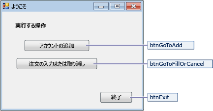
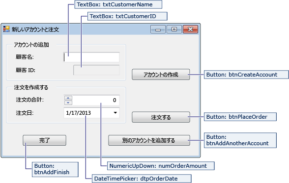
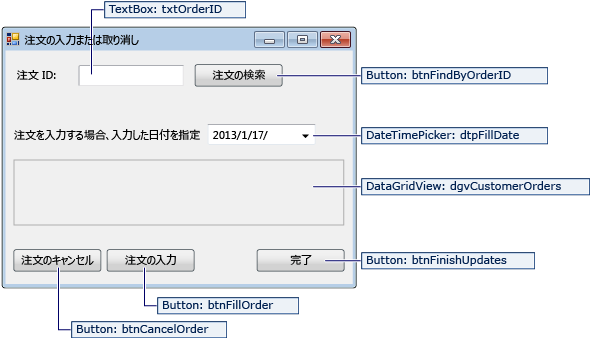

# <a name="create-a-simple-data-application-by-using-adonet"></a>ADO.NET を使用した単純なデータ アプリケーションの作成

データベースのデータを処理するアプリケーションの作成では、接続文字列の定義、データの挿入、ストアド プロシージャの実行などの基本的なタスクを実行します。 このトピックでは、Visual C# または Visual Basic と ADO.NET を使用して、単純な Windows フォームの "フォーム オーバー データ" アプリケーション内からデータベースと対話する方法について説明します。  データセット、LINQ to SQL、Entity Framework を含むすべての .NET データ テクノロジでは、最終的にこの記事に記載されている手順とよく似た手順を実行します。

この記事では、迅速な方法でデータベースからデータを取得する簡単な方法を示します。 アプリケーションで複雑な方法でデータを変更し、データベースを更新する必要がある場合は、Entity Framework の使用や、データ バインディングを使用して、基になるデータの変更にユーザー インターフェイス コントロールを自動的に同期することを検討してください。

> [!IMPORTANT]
> コードをシンプルにするため、運用環境で使用する例外処理は含まれていません。

## <a name="prerequisites"></a>必須コンポーネント

アプリケーションの作成には、次が必要です:

- 見ることができます。

- SQL Server Express LocalDB。 SQL Server Express LocalDB がない場合は、[SQL Server Express のダウンロード ページ](https://www.microsoft.com/sql-server/sql-server-editions-express)からインストールできます。

このトピックは、Visual Studio IDE の基本的な機能を理解していて、Windows フォーム アプリケーションの作成、そのプロジェクトへのフォームの追加、フォームへのボタンなどのコントロールの追加、コントロールのプロパティの設定、およびシンプルなイベントのコード記述ができることを前提としています。 これらのタスクに慣れていない場合は、このチュートリアルを開始する前に、[Visual C# と Visual Basic の概要](../ide/quickstart-visual-basic-console.md)に関するトピックを完了することをお勧めします。

## <a name="set-up-the-sample-database"></a>サンプル データベースを設定する

次の手順に従ってサンプル データベースを作成します。

1. Visual Studio で、 **[サーバー エクスプローラー]** ウィンドウを開きます。

2. **[データ接続]** を右クリックし、 **[新しい SQL Server データベースの作成]** を選択します。

3. **[サーバー名]** テキスト ボックスに「 **(localdb)\mssqllocaldb**」と入力します。

4. **[新しいデータベース名]** テキスト ボックスに「**Sales**」と入力し、 **[OK]** を選択します。

     空の **Sales** データベースが作成され、サーバー エクスプローラーの [データ接続] ノードに追加されます。

5. **Sales** データ接続を右クリックし、 **[新しいクエリ]** を選択します。

     クエリ エディター ウィンドウが開きます。

6. [Sales Transact-SQL スクリプト](https://github.com/MicrosoftDocs/visualstudio-docs/raw/master/docs/data-tools/samples/sales.sql)をクリップボードにコピーします。

7. T-SQL スクリプトをクエリ エディターに貼り付け、 **[実行]** ボタンを選択します。

     しばらくすると、クエリの実行が完了し、データベース オブジェクトが作成されます。 データベースには、Customer と Orders という 2 つのテーブルが含まれています。 最初はテーブルにデータはありませんが、作成したアプリケーションを実行してデータを追加できます。 データベースには、4 種類のシンプルなストアド プロシージャもあります。

## <a name="create-the-forms-and-add-controls"></a>フォームを作成してコントロールを追加する

1. Windows フォーム アプリケーションのプロジェクトを作成し、**SimpleDataApp** という名前を付けます。

    Visual Studio は、**Form1** という名前の空の Windows フォームを含めた、いくつかのファイルとプロジェクトを作成します。

2. 2 つの Windows フォームをプロジェクトに追加し、合計 3 つのフォームに次の名前を付けます。

   - **ナビゲーション**

   - **NewCustomer**

   - **FillOrCancel**

3. 各フォームに、次の図に示されるように、テキスト ボックス、ボタン、および他のコントロールを追加します。 各コントロールに、テーブルを示すプロパティを設定します。

   > [!NOTE]
   > グループ ボックス、およびラベル コントロールは明確性を追加しますが、コードでは使用されません。

   **Navigation フォーム**

   

|Navigation フォームのコントロール|プロパティ|
| - |----------------|
|ボタン|Name = btnGoToAdd|
|ボタン|Name = btnGoToFillOrCancel|
|ボタン|Name = btnExit|

**NewCustomer フォーム**



|NewCustomer フォームのコントロール|プロパティ|
| - |----------------|
|TextBox|Name = txtCustomerName|
|TextBox|Name = txtCustomerID<br /><br /> Readonly = True|
|ボタン|Name = btnCreateAccount|
|NumericUpdown|DecimalPlaces = 0<br /><br /> Maximum = 5000<br /><br /> Name = numOrderAmount|
|DateTimePicker|Format = Short<br /><br /> Name = dtpOrderDate|
|ボタン|Name = btnPlaceOrder|
|ボタン|Name = btnAddAnotherAccount|
|ボタン|Name = btnAddFinish|

**FillOrCancel フォーム**



|FillOrCancel フォームのコントロール|プロパティ|
| - |----------------|
|TextBox|Name = txtOrderID|
|ボタン|Name = btnFindByOrderID|
|DateTimePicker|Format = Short<br /><br /> Name = dtpFillDate|
|DataGridView|Name = dgvCustomerOrders<br /><br /> Readonly = True<br /><br /> RowHeadersVisible = False|
|ボタン|Name = btnCancelOrder|
|ボタン|Name = btnFillOrder|
|ボタン|Name = btnFinishUpdates|

## <a name="store-the-connection-string"></a>接続文字列を保存する
アプリケーションがデータベースの接続を開くとき、アプリケーションは接続文字列にアクセスする必要があります。 各フォームで文字列を手動で入力することを回避するため、プロジェクトの *App.config* ファイルに文字列を保存し、アプリケーションの任意のフォームから呼び出された場合にこの文字列を返すメソッドを作成します。

接続文字列を見つけるには、**サーバー エクスプローラー** で **Sales** データ接続を右クリックし、 **[プロパティ]** を選択します。 **ConnectionString** プロパティを見つけ、**Ctrl**+**A** キーを使用して文字列を選択し、**Ctrl**+**C** キーを使用してクリップボードにコピーします。

1. C# を使用している場合は、**ソリューション エクスプローラー** で、プロジェクトの **[プロパティ]** ノードを展開し、**Settings.settings** ファイルを開きます。
    Visual Basic を使用している場合は、**ソリューション エクスプローラー** で **[すべてのファイルを表示]** をクリックし、 **[My Project]** ノードを展開して、**Settings.settings** ファイルを開きます。

2. **[名前]** 列に、「`connString`」と入力します。

3. **[種類]** ボックスの一覧にある **[(接続文字列)]** を選択します。

4. **[スコープ]** ボックスの一覧にある **[アプリケーション]** を選択します。

5. **[値]** 列に、(引用符を除く) 接続文字列を入力し、変更を保存します。

> [!NOTE]
> 実際のアプリケーションでは、「[接続文字列と構成ファイル](/dotnet/framework/data/adonet/connection-strings-and-configuration-files)」で説明されているように、接続文字列を安全に保存する必要があります。

## <a name="write-the-code-for-the-forms"></a>フォームのコードを記述する

このセクションでは、各フォームの動作の概要を簡単に説明します。 また、フォーム上のボタンをクリックしたときの内部ロジックを定義するコードも提供します。

### <a name="navigation-form"></a>Navigation フォーム

Navigation フォームはアプリケーションを実行すると開きます。 **[Add an account]** ボタンは NewCustomer フォームを開きます。 **[Fill or cancel orders]** ボタンは FillOrCancel フォームを開きます。 **[Exit]** ボタンは、アプリケーションを閉じます。

#### <a name="make-the-navigation-form-the-startup-form"></a>Navigation フォームをスタートアップ フォームに設定

C# を使用している場合、**ソリューション エクスプローラー** で **Program.cs** を開き、`Application.Run` の行を `Application.Run(new Navigation());` に変更します。

Visual Basic を使用している場合、**ソリューション エクスプローラー** で、 **[プロパティ]** ウィンドウを開き、 **[アプリケーション]** タブを選択して、 **[スタートアップ フォーム]** の一覧から **SimpleDataApp.Navigation** を選択します。

#### <a name="create-auto-generated-event-handlers"></a>自動生成されたイベント ハンドラーを作成する

Navigation フォームの 3 つのボタンをダブルクリックして、空のイベント ハンドラー メソッドを作成します。 また、ボタンをダブルクリックすると、デザイナーのコード ファイルに自動生成されたコードが追加され、ボタンをクリックしてイベントを発生させることができます。

#### <a name="add-code-for-the-navigation-form-logic"></a>Navigation フォーム ロジックのコードを追加する

Navigation フォームのコード ページで、次のコードに示すように、3 つのボタン クリック イベント ハンドラーのメソッド本体を完成させます。

:::code language="csharp" source="../data-tools/codesnippet/CSharp/SimpleDataApp/Navigation.cs" id="Snippet1":::
:::code language="vb" source="../data-tools/codesnippet/VisualBasic/SimpleDataApp/Navigation.vb" id="Snippet1":::

### <a name="newcustomer-form"></a>NewCustomer フォーム

顧客名を入力し **[Create Account]** ボタンを選択すると、NewCustomer フォームは、顧客アカウントを作成し、SQL Server は新しい顧客 ID として IDENTITY 値を返します。 数量と注文日を指定して **[Place Order]** ボタンを選択すると、この新しいアカウントの注文を設定できます。

#### <a name="create-auto-generated-event-handlers"></a>自動生成されたイベント ハンドラーを作成する

4 つのボタンをそれぞれダブルクリックして、NewCustomer フォームの各ボタンに空のクリック イベント ハンドラーを作成します。 また、ボタンをダブルクリックすると、デザイナーのコード ファイルに自動生成されたコードが追加され、ボタンをクリックしてイベントを発生させることができます。

#### <a name="add-code-for-the-newcustomer-form-logic"></a>NewCustomer フォーム ロジックのコードを追加する

NewCustomer フォーム ロジックを完成させるには、次の手順を実行します。

1. `System.Data.SqlClient` 名前空間をスコープ内に入れて、メンバーの名前を完全修飾する必要がないようにします。

     ```csharp
     using System.Data.SqlClient;
     ```

     ```vb
     Imports System.Data.SqlClient
     ```

2. 次のコードに示すように、クラスにいくつかの変数とヘルパー メソッドを追加します。

     :::code language="csharp" source="../data-tools/codesnippet/CSharp/SimpleDataApp/NewCustomer.cs" id="Snippet1":::
     :::code language="vb" source="../data-tools/codesnippet/VisualBasic/SimpleDataApp/NewCustomer.vb" id="Snippet1":::

3. 次のコードに示すように、4 つのボタン クリック イベント ハンドラーのメソッド本体を完成させます。

     :::code language="csharp" source="../data-tools/codesnippet/CSharp/SimpleDataApp/NewCustomer.cs" id="Snippet2":::
     :::code language="vb" source="../data-tools/codesnippet/VisualBasic/SimpleDataApp/NewCustomer.vb" id="Snippet2":::

### <a name="fillorcancel-form"></a>FillOrCancel フォーム

FillOrCancel フォームは、Order ID (注文 ID) を入力して **[Find Order]** のボタンをクリックしたときに、Order (注文) を戻すクエリを実行します。 戻された行は読み取り専用なデータ グリッドに表示されます。 **[Cancel Order]** ボタンを選択すると、注文をキャンセル (X) としてマークできます。また **[Fill Order]** ボタンを選択すると、注文を満たした (F) としてマークできます。 **[Find Order]** ボタンをもう一度選択すると、更新された行が表示されます。

#### <a name="create-auto-generated-event-handlers"></a>自動生成されたイベント ハンドラーを作成する

ボタンをダブルクリックして、FillOrCancel フォームの 4 つのボタンに空のクリック イベント ハンドラーを作成します。 また、ボタンをダブルクリックすると、デザイナーのコード ファイルに自動生成されたコードが追加され、ボタンをクリックしてイベントを発生させることができます。

#### <a name="add-code-for-the-fillorcancel-form-logic"></a>FillOrCancel フォーム ロジックのコードを追加する

FillOrCancel フォーム ロジックを完成させるには、次の手順を実行します。

1. 次の 2 つの名前空間をスコープ内に入れて、メンバーの名前を完全修飾する必要がないようにします。

     ```csharp
     using System.Data.SqlClient;
     using System.Text.RegularExpressions;
     ```

     ```vb
     Imports System.Data.SqlClient
     Imports System.Text.RegularExpressions
     ```

2. 次のコードに示すように、クラスに変数とヘルパー メソッドを追加します。

     :::code language="csharp" source="../data-tools/codesnippet/CSharp/SimpleDataApp/FillOrCancel.cs" id="Snippet1":::
     :::code language="vb" source="../data-tools/codesnippet/VisualBasic/SimpleDataApp/FillOrCancel.vb" id="Snippet1":::

3. 次のコードに示すように、4 つのボタン クリック イベント ハンドラーのメソッド本体を完成させます。

     :::code language="csharp" source="../data-tools/codesnippet/CSharp/SimpleDataApp/FillOrCancel.cs" id="Snippet2":::
     :::code language="vb" source="../data-tools/codesnippet/VisualBasic/SimpleDataApp/FillOrCancel.vb" id="Snippet2":::

## <a name="test-your-application"></a>アプリケーションのテスト

各クリック イベント ハンドラーをコードし、コードの記述を完了した後、**F5** キーを押してアプリケーションのビルドとテストを実行します。

## <a name="see-also"></a>関連項目

- [.NET 用の Visual Studio データ ツール](../data-tools/visual-studio-data-tools-for-dotnet.md)
