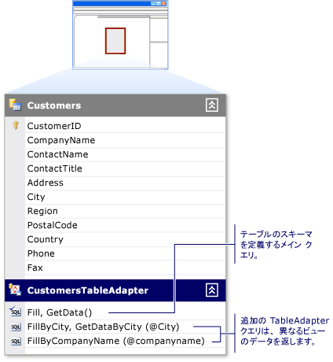

# Tableadapter の作成および構成

TableAdapter を使用すると、アプリケーションとデータベース間で通信できます。 これらはデータベースに接続し、クエリまたはストアド プロシージャを実行して、新しいデータ テーブルを返すか、返されたデータを既存の <xref:System.Data.DataTable> に入力します。 TableAdapter では、更新されたデータをアプリケーションからデータベースに送り返すこともできます。

TableAdapter は、次のいずれかの操作を実行すると作成されます。

- **サーバー エクスプローラー** から **データセット デザイナー** にデータベース オブジェクトをドラッグします。

- データ ソース構成ウィザードを実行し、データ ソースの種類として **データベース** または **Web サービス** を選択します。

   

**[ツールボックス]** から **データセット デザイナー** のサーフェイスの空の領域に TableAdapter をドラッグすることによって、新しい TableAdapter を作成し、データ ソースで構成することもできます。

TableAdapter の概要については、「[TableAdapters を使用してデータセットを入力する](../data-tools/fill-datasets-by-using-tableadapters.md)」を参照してください。

[!INCLUDE[note_settings_general](../data-tools/includes/note_settings_general_md.md)]

## TableAdapter 構成ウィザードを使用する

TableAdapter とそれに関連付けられた DataTable を作成または編集するには、**TableAdapter 構成ウィザード** を実行します。 既存の TableAdapter は、**データセット デザイナー** でそれを右クリックすることで構成できます。

**データセット デザイナー** にフォーカスがあるときに [ツールボックス] から新しい TableAdapter をドラッグすると、ウィザードが開始され、TableAdapter の接続先のデータ ソースを指定するよう求められます。 次のページでは、データベースとの通信に使用する必要があるコマンドの種類 (SQL ステートメントまたはストアド プロシージャ) をたずねられます (データ ソースに既に関連付けられている TableAdapter を構成している場合、これは表示されません)。

- データベースに対する適切なアクセス許可がある場合は、基になるデータベースに新しいストアド プロシージャを作成することもできます。 これらのアクセス許可がない場合、これを行うことはできません。

- TableAdapter の **SELECT**、**INSERT**、**UPDATE**、**DELETE** の各コマンドに対して、既存のストアド プロシージャを実行することもできます。 たとえば、`TableAdapter.Update()` メソッドが呼び出されると、**UPDATE** コマンドに割り当てられたストアド プロシージャが実行されます。

選択したストアド プロシージャのパラメーターを、データ テーブルの対応する列に割り当てます。 たとえば、ストアド プロシージャが、テーブルの `CompanyName` 列に渡される `@CompanyName` という名前のパラメーターを受け入れる場合は、`@CompanyName` パラメーターの **[ソース列]** を `CompanyName` に設定します。

> [!NOTE]
> SELECT コマンドに割り当てられたストアド プロシージャは、ウィザードの次の手順で指定する TableAdapter のメソッドを呼び出すことによって実行されます。 既定のメソッドは `Fill` であるため、SELECT プロシージャを実行するために通常使用されるコードは `TableAdapter.Fill(tableName)` です。 既定の名前を `Fill` から変更する場合は、`Fill` を割り当てた名前に置き換え、"TableAdapter" を TableAdapter の実際の名前 (例: `CustomersTableAdapter`) に置き換えます。

- **[更新を直接データベースに送信するためのメソッドを作成する]** オプションを選択することは、`GenerateDBDirectMethods` プロパティを true に設定することと同じです。 元の SQL ステートメントに十分な情報が含まれていないか、クエリが更新可能なクエリではない場合、このオプションは使用できません。 たとえば、**JOIN** クエリや単一の (スカラー) 値を返すクエリで、この状況が発生する可能性があります。

ウィザードの **[詳細設定オプション]** では、次のことが可能です。

- **[SQL ステートメントの生成]** ページで定義されている SELECT ステートメントに基づいて、INSERT、UPDATE、DELETE ステートメントを生成する
- [オプティミスティック コンカレンシーを使用する]
- INSERT および UPDATE ステートメントの実行後にデータ テーブルを更新するかどうかを指定する

## TableAdapter の Fill メソッドを構成する

TableAdapter のテーブルのスキーマを変更することが必要な場合があります。 これを行うには、TableAdapter のプライマリ `Fill` メソッドを変更します。 TableAdapter は、関連付けられたデータ テーブルのスキーマを定義するプライマリ `Fill` メソッドを使用して作成されます。 プライマリ `Fill` メソッドは、TableAdapter を最初に構成したときに入力したクエリまたはストアド プロシージャに基づいています。 これは、データセット デザイナーのデータ テーブルの下にある最初の (最上位の) メソッドです。

TableAdapter のメイン `Fill` メソッドに加えた変更は、関連付けられたデータ テーブルのスキーマに反映されます。 たとえば、メイン `Fill` メソッドのクエリから列を削除すると、関連付けられたデータ テーブルからもその列が削除されます。 さらに、メイン `Fill` メソッドから列を削除すると、その TableAdapter の追加のクエリから列が削除されます。

TableAdapter クエリの構成ウィザードを使用して、TableAdapter の追加のクエリを作成および編集できます。 これらの追加のクエリは、スカラー値を返す場合を除き、テーブル スキーマに準拠している必要があります。  各追加のクエリには、指定した名前が付けられます。

次の例は、`FillByCity` という名前の追加のクエリを呼び出す方法を示しています。

`CustomersTableAdapter.FillByCity(NorthwindDataSet.Customers, "Seattle")`

### 新しいクエリで TableAdapter クエリの構成ウィザードを開始するには

1. **データセット デザイナー** でご自分のデータセットを開きます。

2. 新しいクエリを作成する場合は、 **[ツールボックス]** の **[データセット]** タブから <xref:System.Data.DataTable> に **クエリ** オブジェクトをドラッグするか、TableAdapter のショートカット メニューから **[クエリの追加]** を選択します。 **データセット デザイナー** の空の領域に **クエリ** オブジェクトをドラッグすることもできます。この場合、<xref:System.Data.DataTable> が関連付けられていない TableAdapter が作成されます。 これらのクエリでは、単一の (スカラー) 値のみを返すことも、データベースに対して UPDATE、INSERT、または DELETE コマンドを実行することもできます。

3. **[データ接続の選択]** 画面で、クエリで使用する接続を選択または作成します。

    > [!NOTE]
    > この画面は、使用する適切な接続をデザイナーが判断できない場合、または接続が利用できない場合にのみ表示されます。

4. **[コマンドの種類を選択]** 画面で、データベースからデータをフェッチする方法を次の中から選択します。

    - **[SQL ステートメントを使用]** : データベースからデータを選択する SQL ステートメントを入力できます。

    - **[新しいストアド プロシージャの作成]** : 指定した SELECT ステートメントに基づいて、ウィザードで新しいストアド プロシージャを (データベースに) 作成できます。

    - **[既存のストアド プロシージャを使用]** : クエリの実行時に既存のストアド プロシージャを実行できます。

### 既存のクエリで TableAdapter クエリの構成ウィザードを開始するには

- 既存の TableAdapter クエリを編集する場合は、クエリを右クリックし、ショートカット メニューの **[構成]** を選択します。

    > [!NOTE]
    > TableAdapter のメイン クエリを右クリックすると、TableAdapter と <xref:System.Data.DataTable> スキーマが再構成されます。 ただし、TableAdapter の追加のクエリを右クリックすると、選択したクエリだけが構成されます。 **TableAdapter 構成ウィザード** では TableAdapter 定義が再構成され、**TableAdapter クエリの構成ウィザード** では選択したクエリだけが再構成されます。

### TableAdapter にグローバル クエリを追加するには

- グローバル クエリは、単一の (スカラー) 値を返すか、値を返さない SQL クエリです。 通常、グローバル関数では、挿入、更新、削除などのデータベース操作が実行されます。 また、テーブル内の顧客の数や、特定の注文のすべての品目の合計料金などの情報も集計されます。

     グローバル クエリを追加するには、 **[ツールボックス]** の **[データセット]** タブから **データセット デザイナー** の空の領域に **クエリ** オブジェクトをドラッグします。

- 目的のタスクを実行するクエリを入力します (例: `SELECT COUNT(*) AS CustomerCount FROM Customers`)。

    > [!NOTE]
    > **クエリ** オブジェクトを **データセット デザイナー** に直接ドラッグすると、スカラー (単一の) 値のみを返すメソッドが作成されます。 選択したクエリまたはストアド プロシージャで複数の値が返される場合がありますが、ウィザードによって作成されたメソッドは単一の値のみを返します。 たとえば、クエリは返されたデータの最初の行の最初の列を返します。

## 関連項目

- [TableAdapters を使用してデータセットを入力する](../data-tools/fill-datasets-by-using-tableadapters.md)
