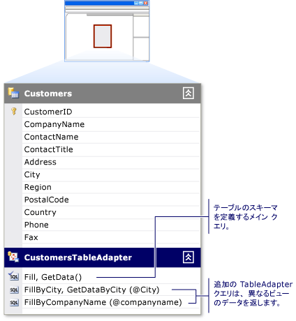

# TableAdapters を使用してデータセットを入力する

TableAdapter コンポーネントでは、指定された 1 つ以上のクエリまたはストアド プロシージャに基づいて、データセットにデータベースのデータを格納します。 Tableadapter では、データベースの追加、更新、削除を実行して、データセットに加えた変更を保持することもできます。 また、特定のテーブルに関連付けられていないグローバル コマンドを発行することもできます。

> [!NOTE]
> Tableadapter は、Visual Studio デザイナーによって生成されます。 プログラムによってデータセットを作成する場合は、.NET クラスである DataAdapter を使用します。

TableAdapter の操作の詳細については、次のトピックのいずれかを直接参照してください。

|トピック|説明|
|-----------|-----------------|
|[Tableadapter の作成および構成](../data-tools/create-and-configure-tableadapters.md)|デザイナーを使用して TableAdapter を作成および構成する方法|
|[パラメーター付きの TableAdapter クエリを作成する](../data-tools/create-parameterized-tableadapter-queries.md)|ユーザーが TableAdapter のプロシージャまたはクエリに引数を指定できるようにする方法|
|[TableAdapter で直接データベースにアクセスする](../data-tools/directly-access-the-database-with-a-tableadapter.md)|TableAdapter の Dbdirect メソッドを使用する方法|
|[データセットの読み込み中に制約をオフにする](../data-tools/turn-off-constraints-while-filling-a-dataset.md)|データの更新時に外部キー制約を使用する方法|
|[方法 : TableAdapter の機能を拡張する](../data-tools/fill-datasets-by-using-tableadapters.md)|TableAdapter にカスタム コードを追加する方法|
|[XML データのデータセットへの読み込み](../data-tools/read-xml-data-into-a-dataset.md)|XML を使用する方法|

## TableAdapter の概要

TableAdapter は、データベースに接続し、クエリまたはストアド プロシージャを実行し、返されたデータを DataTable に格納するデザイナーで生成されたコンポーネントです。 TableAdapter は、更新されたデータをアプリケーションからデータベースに送り返す場合にも使用します。 TableAdapter が関連付けられているテーブルのスキーマに準拠するデータが返される限り、TableAdapter に対して必要な数のクエリを実行できます。 次の図は、TableAdapter がメモリ内のデータベースやその他のオブジェクトとどのように対話するかを示しています。

TableAdapter は **データセット デザイナー** でデザインされますが、TableAdapter のクラスは、<xref:System.Data.DataSet> の入れ子にされたクラスとして生成されるわけではありません。 これらのクラスは、各データセットに固有の、個別の名前空間に格納されます。 たとえば、`NorthwindDataSet` という名前のデータセットがある場合、`NorthwindDataSet` 内の <xref:System.Data.DataTable> に関連付けられた TableAdapter は、`NorthwindDataSetTableAdapters` 名前空間に格納されます。 プログラムで特定の TableAdapter にアクセスするには、TableAdapter の新しいインスタンスを宣言する必要があります。 次に例を示します。

:::code language="csharp" source="../snippets/csharp/VS_Snippets_VBCSharp/VbRaddataTableAdapters/CS/Class1.cs" id="Snippet7":::
:::code language="vb" source="../snippets/visualbasic/VS_Snippets_VBCSharp/VbRaddataTableAdapters/VB/Class1.vb" id="Snippet7":::

## 関連付けられた DataTable スキーマ

TableAdapter を作成する場合、最初のクエリまたはストアド プロシージャは、TableAdapter の関連 <xref:System.Data.DataTable> のスキーマを定義するために使用されます。 最初のクエリまたはストアド プロシージャを実行するには、TableAdapter の `Fill` メソッド (TableAdapter の関連 <xref:System.Data.DataTable> に値を格納するメソッド) を呼び出します。 TableAdapter のメインのクエリに対する変更は、関連付けられたデータ テーブルのスキーマに反映されます。 たとえば、メインのクエリから列を削除すると、関連付けられたデータ テーブルからも列が削除されます。 TableAdapter に関する他のクエリで、メインのクエリにない列を返す SQL ステートメントを使用する場合、デザイナーによって、メインのクエリとその他のクエリの間で、列の変更の同期が試みられます。

## TableAdapter 更新コマンド

TableAdapter の更新機能は、**TableAdapter ウィザード** のメインのクエリに情報がどの程度存在するかによって異なります。 たとえば、複数のテーブル (`JOIN` を使用)、スカラー値、ビュー、または集約関数の結果から値を取得するように設定された TableAdapter の場合、最初の作成時には、基になるデータベースに更新を戻す機能がありません。 ただし、`INSERT`、`UPDATE`、`DELETE` の各コマンドは、 **[プロパティ]** ウィンドウで手動で構成できます。

## TableAdapter クエリ

TableAdapter には関連する各データ テーブルにデータを格納するために複数のクエリを設定できます。 それぞれのクエリが、関連するデータ テーブルと同じスキーマに従ったデータを返す限り、アプリケーションに必要なクエリをいくつでも TableAdapter に定義できます。 この機能により、TableAdapter にはさまざまな条件に基づいて異なる結果を読み込むことができます。

たとえば、アプリケーションに顧客名のテーブルが含まれている場合、名前が特定の英字で始まるすべての顧客をこのテーブルに格納するクエリ、同じ州内のすべての顧客をこのテーブルに格納するクエリなどを作成できます。 特定の州内の顧客を `Customers` テーブルに格納するには、州の値を示すパラメーターを受け取る `FillByState` クエリを、`SELECT * FROM Customers WHERE State = @State` のように作成します。 このクエリを実行するには、`FillByState` メソッドを呼び出し、`CustomerTableAdapter.FillByState("WA")` のようにパラメーター値を渡します。

TableAdapter のデータ テーブルと同じスキーマのデータを返すクエリの他に、スカラー (Single 型) 値を返すクエリを追加できます。 たとえば、顧客数を返すクエリ (`SELECT Count(*) From Customers`) は、返されるデータがテーブルのスキーマに準拠していなくても、`CustomersTableAdapter,` に対しては有効です。

## ClearBeforeFill プロパティ

既定では、TableAdapter のデータ テーブルに値を格納するクエリを実行するたびに、既存のデータが消去され、クエリ結果だけがテーブルに読み込まれます。 クエリから返されたデータをデータ テーブル内の既存のデータに追加またはマージする場合は、TableAdapter の `ClearBeforeFill` プロパティを `false` に設定します。 データを消去するかどうかに関係なく、更新を保持する場合は、明示的に更新をデータベースに送信する必要があります。 そのテーブルに値を格納する別のクエリを実行する前に、テーブル内のデータに加えた変更を保存してください。 詳細については、「[TableAdapter を使用してデータを更新する](../data-tools/update-data-by-using-a-tableadapter.md)」を参照してください。

## TableAdapter の継承

TableAdapter では、設定された <xref:System.Data.Common.DataAdapter> クラスをカプセル化することにより、標準データ アダプターの機能が拡張されます。 既定では、TableAdapter は、<xref:System.ComponentModel.Component> クラスから継承され、<xref:System.Data.Common.DataAdapter> クラスにキャストできません。 TableAdapter を <xref:System.Data.Common.DataAdapter> クラスにキャストすると、<xref:System.InvalidCastException> エラーが発生します。 TableAdapter の基底クラスを変更するには、**データセット デザイナー** で TableAdapter の **Base Class** プロパティに <xref:System.ComponentModel.Component> から派生したクラスを指定します。

## TableAdapter のメソッドとプロパティ

TableAdapter クラスは .NET 型ではありません。 つまり、ドキュメントや **オブジェクト ブラウザー** では検索できません。 このクラスは、デザイン時に、前述のいずれかのウィザードを使用することにより作成されます。 TableAdapter の作成時に TableAdapter に割り当てられる名前は、処理しているテーブルの名前に基づきます。 たとえば、`Orders` という名前のデータベース内にあるテーブルに基づいて TableAdapter を作成する場合、その TableAdapter の名前は、`OrdersTableAdapter` になります。 TableAdapter のクラス名は、**データセット デザイナー** の **Name** プロパティを使用して変更できます。

TableAdapter で共通に使用されるメソッドとプロパティを次に示します。

|メンバー|説明|
|------------|-----------------|
|`TableAdapter.Fill`|TableAdapter の関連付けられたデータ テーブルに、TableAdapter の `SELECT` コマンドの実行結果が格納されます。|
|`TableAdapter.Update`|データベースに変更を送信し、更新の影響を受ける行の数を表す整数値を返します。 詳細については、「[TableAdapter を使用してデータを更新する](../data-tools/update-data-by-using-a-tableadapter.md)」を参照してください。|
|`TableAdapter.GetData`|データを格納する新しい <xref:System.Data.DataTable> を返します。|
|`TableAdapter.Insert`|データ テーブル内に新しい行を作成します。 詳細については、「[データベースに新しいレコードを挿入する](../data-tools/insert-new-records-into-a-database.md)」を参照してください。|
|`TableAdapter.ClearBeforeFill`|いずれかの `Fill` メソッドを呼び出す前に、データ テーブルが空になっているかどうかを確認します。|

## TableAdapter 更新メソッド

TableAdapter では、データ コマンドを使用して、データベースからの読み取りと書き込みを実行します。 TableAdapter の最初の `Fill` (メイン) クエリは、関連データ テーブルのスキーマや、`TableAdapter.Update` メソッドに関連付けられた `InsertCommand`、`UpdateCommand`、`DeleteCommand` の各コマンドを作成する基として使用します。 TableAdapter の `Update` メソッドを呼び出すと、**TableAdapter クエリの構成ウィザード** で追加したクエリではなく、TableAdapter の元の設定時に作成されたステートメントが実行されます。

TableAdapter を使用すると、通常実行するコマンド操作を効果的に実行できます。 たとえば、アダプターの `Fill` メソッドを呼び出すと、その `SelectCommand` プロパティに設定されているデータ コマンドがアダプターによって実行され、データ リーダー (<xref:System.Data.SqlClient.SqlDataReader> など) によって結果セットがデータ テーブルに読み込まれます。 同様に、アダプターの `Update` メソッドを呼び出すと、データ テーブル内で変更された各レコードに対して、`UpdateCommand`、`InsertCommand`、`DeleteCommand` の各プロパティに設定されている適切なコマンドが実行されます。

> [!NOTE]
> メインのクエリに十分な情報がある場合、TableAdapter の生成時に既定で `InsertCommand`、`UpdateCommand`、および `DeleteCommand` の各コマンドが作成されます。 TableAdapter のメインのクエリが単一のテーブル `SELECT` ステートメントより複雑な場合、デザイナーで `InsertCommand`、`UpdateCommand`、`DeleteCommand` を生成できないことがあります。 これらのコマンドが生成されない場合は、`TableAdapter.Update` メソッドの実行時にエラーが発生することがあります。

## TableAdapter の GenerateDbDirectMethods

`InsertCommand`、`UpdateCommand`、`DeleteCommand` に加えて、データベースに対して直接実行できるメソッドを使用して TableAdapter が作成されます。 これらのメソッド (`TableAdapter.Insert`、`TableAdapter.Update`、`TableAdapter.Delete`) は、データベース内でデータを直接操作するために呼び出すことができます。 つまり、`TableAdapter.Update` を呼び出して関連するデータ テーブルに対して保留になっている挿入、更新、削除を処理するのではなく、これらの個別のメソッドをコードから呼び出すことができます。

これらの直接メソッドを作成しない場合は、TableAdapter の **GenerateDbDirectMethods** プロパティを `false` に設定します ( **[プロパティ]** ウィンドウ内)。 TableAdapter に追加されるその他のクエリはスタンドアロン クエリであり、これらのメソッドは生成されません。

## TableAdapter での Null 許容型のサポート

TableAdapter は、Null 許容型の `Nullable(Of T)` および `T?` をサポートしています。 Visual Basic での null 許容型について詳しくは、「[null 許容値型](/dotnet/visual-basic/programming-guide/language-features/data-types/nullable-value-types)」をご覧ください。 C# での null 許容型について詳しくは、[null 許容型の使用](/dotnet/csharp/programming-guide/nullable-types/using-nullable-types)に関するページをご覧ください。

## TableAdapterManager リファレンス

既定では、関連テーブルを含むデータセットを作成すると、TableAdapterManager クラスが生成されます。 クラスが生成されないようにするには、データセットの `Hierarchical Update` プロパティの値を false に変更します。 Windows フォームまたは WPF ページのデザイン サーフェイスにリレーションシップを持つテーブルをドラッグすると、Visual Studio ではクラスのメンバー変数が宣言されます。 データ バインドを使用しない場合は、手動で変数を宣言する必要があります。

TableAdapterManager クラスは .NET 型ではありません。 このため、ドキュメントでは確認できません。 これは、デザイン時にデータセット作成プロセスの一部として作成されます。

`TableAdapterManager` クラスのよく使用されるメソッドとプロパティを次に示します。

|メンバー|説明|
|------------|-----------------|
|`UpdateAll` メソッド|すべてのデータ テーブルのすべてのデータを保存します。|
|`BackUpDataSetBeforeUpdate` プロパティ|`TableAdapterManager.UpdateAll` メソッドを実行する前に、データセットのバックアップ コピーを作成するかどうかを決定します。ブール型です。|
|*tableName* `TableAdapter` プロパティ|TableAdapter を表します。 生成された TableAdapterManager には、管理される各 `TableAdapter` のプロパティが含まれています。 たとえば、Customers テーブルと Orders テーブルを含むデータセットでは、`CustomersTableAdapter` プロパティと `OrdersTableAdapter` プロパティを含む TableAdapterManager が生成されます。|
|`UpdateOrder` プロパティ|個々の挿入、更新、削除コマンドの順序を制御します。 これは、`TableAdapterManager.UpdateOrderOption` 列挙のいずれかの値に設定します。   既定では、`UpdateOrder` は **InsertUpdateDelete** に設定されます。 これは、データセット内のすべてのテーブルに対して、挿入、更新、削除の順に実行されることを意味します。|

## セキュリティ

CommandType プロパティを <xref:System.Data.CommandType.Text> に設定したデータ コマンドを使用するときは、クライアントから送信された情報をデータベースに渡す前に、その情報を十分にチェックしてください。 悪意のあるユーザーが、承認なしでデータベースにアクセスしたり、データベースを破壊したりする目的で、変更した SQL ステートメントや追加の SQL ステートメントの送信 (挿入) を試みる場合があります。 ユーザーによる入力をデータベースに転送する前に、その情報が有効であることを必ず確認してください。 可能な場合は、パラメーター化クエリまたはストアド プロシージャを必ず使用することをお勧めします。

## 関連項目

- [データセットのツール](../data-tools/dataset-tools-in-visual-studio.md)
