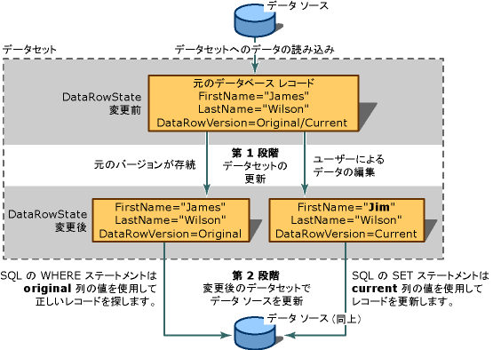

# <a name="save-data-back-to-the-database"></a>データをデータベースに保存する

データセットは、データのメモリ内のコピーです。 そのデータを変更した場合は、それらの変更をデータベースに保存し直すことをお勧めします。 これを行うには 3 つの方法があります。

- TableAdapter の `Update` メソッドの 1 つを呼び出す

- TableAdapter の `DBDirect` メソッドの 1 つを呼び出す

- データセット内の他のテーブルに関連付けられているテーブルがデータセットに含まれている場合に、Visual Studio によって自動的に生成される TableAdapterManager の `UpdateAll` メソッドを呼び出す

データセットのテーブルを Windows フォームまたは XAML ページのコントロールにデータ バインドすると、データ バインディング アーキテクチャによってすべての処理が自動的に行われます。

TableAdapter を使い慣れている場合は、次のいずれかのトピックに直接進んでかまいません。

|トピック|説明|
|-----------|-----------------|
|[データベースに新しいレコードを挿入する](../data-tools/insert-new-records-into-a-database.md)|TableAdapter または Command オブジェクトを使用して更新と挿入を実行する方法|
|[TableAdapter を使用してデータを更新する](../data-tools/update-data-by-using-a-tableadapter.md)|TableAdapter を使用して更新を実行する方法|
|[階層更新](../data-tools/hierarchical-update.md)|2 つ以上の関連するテーブルが含まれるデータセットから更新を実行する方法|
|[コンカレンシー例外を処理する](../data-tools/handle-a-concurrency-exception.md)|2 人のユーザーが同じデータベースの同じデータを同時に変更しようしたときに、例外を処理する方法|
|[方法: トランザクションを使用してデータを保存する](../data-tools/save-data-by-using-a-transaction.md)|System を使用してトランザクションにデータを保存する方法。 Transactions 名前空間と TransactionScope オブジェクト|
|[トランザクションにデータを保存する](../data-tools/save-data-in-a-transaction.md)|トランザクション内でデータベースにデータを保存する方法を示す Windows フォーム アプリケーションを作成するチュートリアル|
|[データベースへのデータの保存 (複数テーブル)](../data-tools/save-data-to-a-database-multiple-tables.md)|複数のテーブルのレコードを編集して変更をデータベースに保存し直す方法|
|[オブジェクトからデータベースにデータを保存する](../data-tools/save-data-from-an-object-to-a-database.md)|TableAdapter の DbDirect メソッドを使用して、データセットに含まれていないオブジェクトのデータをデータベースに渡す方法|
|[TableAdapter DBDirect メソッドを使用してデータを保存する](../data-tools/save-data-with-the-tableadapter-dbdirect-methods.md)|TableAdapter を使用して SQL クエリをデータベースに直接送信する方法|
|[データセットを XML として保存する](../data-tools/save-a-dataset-as-xml.md)|XML ドキュメントにデータセットを保存する方法|

## <a name="two-stage-updates"></a>2 段階の更新

データ ソースの更新は、2 ステップのプロセスです。 1 番目のステップでは、新しいレコード、変更されたレコード、または削除されたレコードでデータセットを更新します。 アプリケーションからそれらの変更がデータ ソースに送り返されない場合、更新はそれで完了です。

変更をデータベースに送り返す場合は、2 番目のステップが必要になります。 データ バインド コントロールを使用していない場合は、データ セットの設定に使用したものと同じ TableAdapter (つまりデータ アダプター) の `Update` メソッドを手動で呼び出す必要があります。 ただし、別のアダプターを使用して、たとえば異なるデータ ソース間でのデータの移動や、複数のデータ ソースの更新を行うこともできます。 データ バインディングを使用していない場合に、関連するテーブルの変更を保存するには、自動生成された `TableAdapterManager` クラスの変数を手動でインスタンス化してから、`UpdateAll` メソッドを呼び出す必要があります。



データセットにはテーブルのコレクションが含まれており、テーブルには行のコレクションが含まれています。 基になるデータ ソースを後で更新する場合は、行を追加または削除するときに、`DataTable.DataRowCollection` プロパティのメソッドを使用する必要があります。 これらのメソッドにより、データ ソースを更新するために必要な変更の追跡が行われます。 Rows プロパティで `RemoveAt` コレクションを呼び出すと、削除はデータベースに返されません。

## <a name="merge-datasets"></a>データセットをマージする

データセットを別のデータセットと "*マージする*" ことによって、データセットの内容を更新できます。 これには、"*ソース*" データセットの内容を、呼び出し元のデータセット ("*ターゲット*" データセットと呼ばれます) にコピーする処理が含まれます。 データセットをマージすると、ソース データセットの新しいレコードはターゲット データセットに追加されます。 また、ソース データセットのその他の列もターゲット データセットに追加されます。 データセットのマージは、ローカル データセットがあり、別のアプリケーションから 2 番目のデータセットを取得した場合に便利です。 また、XML Web サービスなどのコンポーネントから 2 番目のデータセットを取得した場合や、複数のデータセットのデータを統合する必要がある場合にも便利です。

データセットをマージするときは、ブール型の引数 (`preserveChanges`) を渡し、ターゲット データセットの既存の変更を維持するかどうかを <xref:System.Data.DataSet.Merge%2A> メソッドに指定することができます。 データセットはレコードの複数のバージョンを保持しているため、レコードの複数のバージョンがマージされるということに留意することは重要です。 次の表では、2 つのデータセットのレコードをマージする方法を示します。

|DataRowVersion|ターゲット データセット|ソース データセット|
| - | - | - |
|元|James Wilson|James C. Wilson|
|Current|Jim Wilson|James C. Wilson|

`preserveChanges=false targetDataset.Merge(sourceDataset)` である場合に上の表で <xref:System.Data.DataSet.Merge%2A> メソッドを呼び出すと、結果は次のデータのようになります。

|DataRowVersion|ターゲット データセット|ソース データセット|
| - | - | - |
|元|James C. Wilson|James C. Wilson|
|Current|James C. Wilson|James C. Wilson|

<xref:System.Data.DataSet.Merge%2A> である場合に `preserveChanges = true targetDataset.Merge(sourceDataset, true)` メソッドを呼び出すと、結果は次のデータのようになります。

|DataRowVersion|ターゲット データセット|ソース データセット|
| - | - | - |
|元|James C. Wilson|James C. Wilson|
|Current|Jim Wilson|James C. Wilson|

> [!CAUTION]
> `preserveChanges = true` の場合に、ターゲット データセットのレコードで <xref:System.Data.DataSet.RejectChanges%2A> メソッドが呼び出されると、そのレコードは "*ソース*" データセットの元のデータに戻ります。 これは、ターゲット データセットによって元のデータ ソースを更新しようとする場合に、更新する元の行を見つけることができない場合があることを意味しています。 データ ソースの更新されているレコードを別のデータセットに格納してからマージを行うことで、コンカレンシー違反を回避できます。 (コンカレンシー違反は、データセットにレコードが格納された後で別のユーザーがデータ ソース内のレコードを変更すると発生します。)

## <a name="update-constraints"></a>制約の更新

既存のデータ行を変更するには、各列のデータを追加または更新します。 データセットに制約 (外部キーや null 非許容制約など) が含まれている場合は、レコードを更新すると、レコードが一時的にエラー状態になる可能性があります。 つまり、ある列の更新が完了した後、次の列に到達する前に、エラー状態になることがあります。

早期に制約違反を防ぐために、更新制約を一時的に中断できます。 これは、次の 2 つの目的があります。

- 1 つの列の更新が完了した後、別の列の更新が開始していない場合、エラーがスローされないようにします。

- 特定の更新イベント (検証によく使われるイベント) が発生しないようにします。

> [!NOTE]
> Windows フォームでは、データ グリッドに組み込まれたデータ バインディング アーキテクチャによりフォーカスが行の外に移るまで制約チェックを中断できます。<xref:System.Data.DataRow.BeginEdit%2A>、<xref:System.Data.DataRow.EndEdit%2A>、または <xref:System.Data.DataRow.CancelEdit%2A> メソッドを明示的に呼び出す必要はありません。

データセットで <xref:System.Data.DataSet.Merge%2A> メソッドが呼び出されると、制約は自動的に無効になります。 マージが完了したときに、有効にできない制約がデータセットにあると、<xref:System.Data.ConstraintException> がスローされます。 この場合、<xref:System.Data.DataSet.EnforceConstraints%2A> プロパティが `false,` に設定されるので、すべての制約違反を解決してから <xref:System.Data.DataSet.EnforceConstraints%2A> プロパティを `true` に設定し直す必要があります。

更新が完了した後で制約チェックを再び有効にできます。これにより更新イベントも再び有効になり、更新イベントが発生します。

イベントの中断の詳細については、「[データセットの読み込み中に制約をオフにする](../data-tools/turn-off-constraints-while-filling-a-dataset.md)」を参照してください。

## <a name="dataset-update-errors"></a>データセットの更新エラー

データセットのレコードを更新するときにエラーが発生する場合があります。 たとえば、正しくない型のデータ、長すぎるデータ、その他の整合性問題があるデータを、誤って列に書き込んだ場合などです。 または、更新イベントのいずれかのステージにおいてカスタム エラーを引き起こす可能性がある、アプリケーション固有の検証の確認が実行される場合があります。 詳細については、「[データセットのデータの検証](../data-tools/validate-data-in-datasets.md)」を参照してください。

## <a name="maintain-information-about-changes"></a>変更に関する情報を保持する

データセットの変更に関する情報を保持するには、行が変更されているかどうかを示すフラグを設定する方法 (<xref:System.Data.DataRow.RowState%2A>) と、レコードの複数のコピーを保持する方法 (<xref:System.Data.DataRowVersion>) の 2 つがあります。 変更に関する情報を使用することにより、プロセスはデータセットの変更内容を確認し、適切な更新内容をデータ ソースに送信できます。

### <a name="rowstate-property"></a>RowState プロパティ

<xref:System.Data.DataRow.RowState%2A> オブジェクトの <xref:System.Data.DataRow> プロパティは、データの特定の行のステータスに関する情報を提供する値です。

<xref:System.Data.DataRowState> 列挙定数に使用できる値の詳細を次の表に示します。

|DataRowState 列挙定数の値|説明|
| - |-----------------|
|<xref:System.Data.DataRowState.Added>|行は項目として <xref:System.Data.DataRowCollection> に追加されました。 (この状態にある行に対応する元のバージョンはありません。最後の <xref:System.Data.DataRow.AcceptChanges%2A> メソッドが呼び出されたときにこの行は存在していなかったからです)。|
|<xref:System.Data.DataRowState.Deleted>|行は <xref:System.Data.DataRow.Delete%2A> オブジェクトの <xref:System.Data.DataRow> を使用して削除されました。|
|<xref:System.Data.DataRowState.Detached>|行は作成されましたが、<xref:System.Data.DataRowCollection> の一部ではありません。 <xref:System.Data.DataRow> オブジェクトがこの状態になるのは、作成直後でコレクションに追加される前、およびコレクションから削除された後です。|
|<xref:System.Data.DataRowState.Modified>|行内の列の値はなんらかの方法で変更されました。|
|<xref:System.Data.DataRowState.Unchanged>|行は <xref:System.Data.DataRow.AcceptChanges%2A> が最後に呼び出されてから変更されていません。|

### <a name="datarowversion-enumeration"></a>DataRowVersion 列挙型

データセットはレコードの複数のバージョンを保持します。 <xref:System.Data.DataRowVersion> フィールドは、<xref:System.Data.DataRow> オブジェクトの <xref:System.Data.DataRow.Item%2A> プロパティまたは <xref:System.Data.DataRow.GetChildRows%2A> メソッドを使用して、<xref:System.Data.DataRow> で見つかった値を取得するときに使用されます。

<xref:System.Data.DataRowVersion> 列挙定数に使用できる値の詳細を次の表に示します。

|DataRowVersion 列挙定数の値|説明|
| - |-----------------|
|<xref:System.Data.DataRowVersion.Current>|レコードの現在のバージョンには、<xref:System.Data.DataRow.AcceptChanges%2A> が最後に呼び出された後のレコードへの変更がすべて含まれています。 行が削除されている場合、現在のバージョンは存在しません。|
|<xref:System.Data.DataRowVersion.Default>|データセット スキーマまたはデータ ソースにより定義されたレコードの既定値です。|
|<xref:System.Data.DataRowVersion.Original>|レコードの元のバージョンは、データセットで最後の変更がコミットされたときのレコードのコピーです。 つまり、通常はデータ ソースから読み込まれたときのレコードのバージョンです。|
|<xref:System.Data.DataRowVersion.Proposed>|更新の実行中、つまり <xref:System.Data.DataRow.BeginEdit%2A> メソッドの呼び出しと <xref:System.Data.DataRow.EndEdit%2A> メソッドの呼び出しの間に一時的に利用できる、レコードの提案されたバージョンです。 通常は <xref:System.Data.DataTable.RowChanging> などのイベントのハンドラーで、レコードの提案されたバージョンにアクセスします。 <xref:System.Data.DataRow.CancelEdit%2A> メソッドを呼び出すと、変更は無効になり、データ行の提案されたバージョンは削除されます。|

元のバージョンおよび現在のバージョンは、更新情報をデータ ソースに送信する場合に役立ちます。 通常、更新情報をデータ ソースに送信すると、データベースの新しい情報がレコードの現在のバージョンに含まれます。 元のバージョンの情報は、更新するレコードを見つけるために使用されます。

たとえば、レコードの主キーが変更された場合に備え、変更を更新するためにデータ ソースの正しいレコードを探す方法を用意しておく必要があります。 元のバージョンがなかった場合、レコードはデータ ソースに追加される可能性が高く、結果として不要なレコードが作成されるだけでなく、不正確な古いレコードが 1 つ作成されることになります。 2 つのバージョンはコンカレンシー制御でも使用されます。 元のバージョンをデータ ソースのレコードと比較し、レコードがデータセットに最後に読み込まれた後で変更されているかどうかを確認します。

提案されたバージョンは、実際に変更をデータセットにコミットする前に検証が必要な場合に役立ちます。

レコードが変更されていても、その行の元のバージョンまたは現在のバージョンが必ず存在するわけではありません。 新しい行をテーブルに挿入した場合、元のバージョンは存在せず、現在のバージョンがあるだけです。 同様に、テーブルの `Delete` メソッドを呼び出すことにより行を削除した場合、元のバージョンはありますが現在のバージョンはありません。

データ行の <xref:System.Data.DataRow.HasVersion%2A> メソッドを照会することにより、レコードの特定のバージョンが存在するかどうかを確認するテストを行うことができます。 列の値を要求するときに <xref:System.Data.DataRowVersion> 列挙値をオプションの引数として渡すことにより、レコードのいずれかのバージョンにアクセスできます。

## <a name="get-changed-records"></a>変更されたレコードを取得する

データセット内のすべてのレコードを更新しないのが一般的な方法です。 たとえば、多数のレコードを表示する Windows フォームの <xref:System.Windows.Forms.DataGridView> コントロールをユーザーが使用しているとします。 このとき、ユーザーが一部のレコードだけを更新し、レコードを 1 つ削除し、新しいレコードを 1 つ挿入したとします。 そのような場合のために、データセットおよびデータ テーブルには、変更された行だけを返すためのメソッド (`GetChanges`) が用意されています。

データ テーブルの  メソッド () またはデータセットの  メソッド () を使って、変更されたレコードのサブセットを作成できます。 データ テーブルのメソッドを呼び出すと、変更されたレコードだけを含むテーブルのコピーが返されます。 同様に、データセットのメソッドを呼び出すと、変更されたレコードだけを含む新しいデータセットを取得できます。

`GetChanges` を単独で呼び出すと、変更されたすべてのレコードが返されます。 これに対し、必要な <xref:System.Data.DataRowState> をパラメーターとして `GetChanges` メソッドに渡すと、変更されたレコードのうち、新しく追加されたレコード、削除とマークされたレコード、分離されたレコード、変更されたレコード、のいずれか必要なサブセットを指定できます。

変更されたレコードのサブセットの取得は、レコードを処理するために別のコンポーネントに送信する場合に役立ちます。 データセット全体を送信する代わりに、コンポーネントが必要としているレコードだけを取得することにより、ほかのコンポーネントとの通信によるオーバーヘッドを小さくできます。

## <a name="commit-changes-in-the-dataset"></a>データセットの変更をコミットする

データセットを変更すると、変更された行の <xref:System.Data.DataRow.RowState%2A> プロパティが設定されます。 <xref:System.Data.DataRowView.RowVersion%2A> プロパティによって、レコードの元のバージョンおよび現在のバージョンが確立されて保持され、利用可能になります。 これらの変更された行のプロパティに格納されているメタデータは、正しい更新をデータ ソースに送信するために必要です。

変更内容がデータ ソースの現在の状態を反映している場合は、この情報を保持する必要はなくなります。 通常、データセットとそのソースの同期は以下の 2 通りの場合に保持されます。

- ソースからデータを読み込んだときなど、情報をデータセットに読み込んだ直後。

- 変更内容をデータセットからデータ ソースに送信した後 (ただし、データベースに変更内容を送信するのに必要な変更情報が失われてしまうため、送信前ではありません)。

保留中の変更は、<xref:System.Data.DataSet.AcceptChanges%2A> メソッドを呼び出してデータセットにコミットできます。 通常、<xref:System.Data.DataSet.AcceptChanges%2A> は次のタイミングで呼び出します。

- データセットを読み込んだ後。 TableAdapter の `Fill` メソッドを呼び出すことによりデータセットを読み込んだ場合、TableAdapter により変更が自動的にコミットされます。 ただし、別のデータセットをマージすることによりデータセットを読み込む場合は、変更を手動でコミットする必要があります。

    > [!NOTE]
    > `Fill` メソッドを呼び出したときに、アダプターによって変更が自動的にコミットされないようにするには、アダプターの `AcceptChangesDuringFill` プロパティを `false` に設定します。 `false` に設定した場合、読み込み中に挿入される各行の <xref:System.Data.DataRow.RowState%2A> は <xref:System.Data.DataRowState.Added> に設定されます。

- データセットの変更を別のプロセス (XML Web サービスなど) に送信した後。

    > [!CAUTION]
    > この方法で変更をコミットすると、変更情報はすべて削除されます。 データセットで行われた変更をアプリケーションで認識する必要がある操作の実行が完了するまで、変更をコミットしないでください。

この方法で実行できる処理は次のとおりです。

- レコードの <xref:System.Data.DataRowVersion.Current> バージョンを <xref:System.Data.DataRowVersion.Original> バージョンに書き込み、元のバージョンを上書きする。

- <xref:System.Data.DataRow.RowState%2A> プロパティが <xref:System.Data.DataRowState.Deleted> に設定されている行をすべて削除する。

- レコードの <xref:System.Data.DataRow.RowState%2A> プロパティを <xref:System.Data.DataRowState.Unchanged> に設定する。

<xref:System.Data.DataSet.AcceptChanges%2A> メソッドは、3 つのレベルで利用可能です。 それを <xref:System.Data.DataRow> オブジェクトで呼び出して、その行の変更だけをコミットできます。 また、<xref:System.Data.DataTable> オブジェクトでそれを呼び出して、テーブル内のすべての行をコミットすることもできます。 最後に、<xref:System.Data.DataSet> オブジェクトでそれを呼び出して、データセットのすべてのテーブルのすべてのレコードのすべての保留中の変更をコミットできます。

メソッドが呼び出されたオブジェクトに基づいて、コミットされる変更を次の表に示します。

|Method|結果|
|------------|------------|
|<xref:System.Data.DataRow.AcceptChanges%2A?displayProperty=fullName>|変更は特定の行にだけコミットされます。|
|<xref:System.Data.DataTable.AcceptChanges%2A?displayProperty=fullName>|変更は特定のテーブルのすべての行にコミットされます。|
|<xref:System.Data.DataSet.AcceptChanges%2A?displayProperty=fullName>|変更はデータセットのすべてのテーブルのすべての行にコミットされます。|

> [!NOTE]
> TableAdapter の `Fill` メソッドを呼び出すことによってデータセットを読み込む場合は、変更を明示的に受け入れる必要はありません。 データ テーブルの設定が終了した後、既定で、`Fill` メソッドによって `AcceptChanges` メソッドが呼び出されます。

関連メソッド <xref:System.Data.DataSet.RejectChanges%2A> により、レコードの <xref:System.Data.DataRowVersion.Original> バージョンを <xref:System.Data.DataRowVersion.Current> バージョンにコピーすることで、変更による影響が元に戻されます。 また、各レコードの <xref:System.Data.DataRow.RowState%2A> の設定も <xref:System.Data.DataRowState.Unchanged> に戻されます。

## <a name="data-validation"></a>データの検証

アプリケーションのデータが、渡される対象プロセスの要件を満たしているかどうかを検査するために、検証を追加することが必要な場合もあります。 この検証には、フォームへのユーザーの入力が適切かどうかの確認、別のアプリケーションから送られたデータの検証、またはコンポーネント内で計算された情報がデータ ソースおよびアプリケーションの制約を満たしているかどうかの確認が含まれます。

データを検証するには次の方法があります。

- ビジネス層で、データを検証するコードをアプリケーションに追加する。 データセットでこれを行うことができます。 データセットでは、列および行の値が変更されるたびに変更を検証する機能など、バック エンド検証を活用できます。 詳細については、「[データセットのデータの検証](../data-tools/validate-data-in-datasets.md)」を参照してください。

- プレゼンテーション層で、検証をフォームに追加する。 詳細については、「[Windows フォームでのユーザー入力の検証](/dotnet/framework/winforms/user-input-validation-in-windows-forms)」を参照してください。

- データのバック エンドで、データをデータベースなどのデータ ソースに送信し、データの受け入れまたは拒否を行うことができるようにする。 データの検証やエラー情報を提供する洗練された機能を備えたデータベースを使用している場合、実用的なアプローチになります。データのソースが何であるかにかかわらずデータを検証できるからです。 ただし、この方法はアプリケーション固有の検証要件には適応できない可能性があります。 また、データ ソースでデータを検証した場合に、バック エンドによって発生する検証エラーを解決する方法によってはデータへのラウンド トリップが多数発生する場合があります。

   > [!IMPORTANT]
   > <xref:System.Data.SqlClient.SqlCommand.CommandType%2A> プロパティを <xref:System.Data.CommandType.Text> に設定したデータ コマンドを使用するときは、クライアントから送信された情報をデータベースに渡す前に、その情報を十分にチェックしてください。 悪意のあるユーザーが、承認なしでデータベースにアクセスしたり、データベースを破壊したりする目的で、変更した SQL ステートメントや追加の SQL ステートメントの送信 (挿入) を試みる場合があります。 ユーザーによる入力をデータベースに転送する前に、その情報が有効であることを必ず確認してください。 可能な場合は、パラメーター化クエリまたはストアド プロシージャを必ず使用することをお勧めします。

## <a name="transmit-updates-to-the-data-source"></a>更新をデータ ソースに送信する

データセットを変更した後で、変更内容をデータ ソースに転送できます。 一般に、これは TableAdapter (またはデータ アダプター) の `Update` メソッドを呼び出すことによって行います。 このメソッドによりデータ テーブルの各レコードに対してループを実行し、更新が必要な場合はその種類 (更新、挿入、または削除) を確認し、適切なコマンドを実行します。

更新を実行する方法を説明するために、1 つのデータ テーブルを含むデータセットをアプリケーションで使用する場合を考えます。 アプリケーションはデータベースから 2 つの行をフェッチします。 行の取得後、インメモリ データ テーブルは次のようになります。

```sql
(RowState)     CustomerID   Name             Status
(Unchanged)    c200         Robert Lyon      Good
(Unchanged)    c400         Nancy Buchanan    Pending
```

アプリケーションによって Nancy Buchanan のステータスが "Preferred" に変更されます。 この変更の結果、その行の <xref:System.Data.DataRow.RowState%2A> プロパティの値は、<xref:System.Data.DataRowState.Unchanged> から <xref:System.Data.DataRowState.Modified> に変更されます。 最初の行の <xref:System.Data.DataRow.RowState%2A> プロパティの値は、<xref:System.Data.DataRowState.Unchanged> のままです。 データ テーブルは次のようになります。

```sql
(RowState)     CustomerID   Name             Status
(Unchanged)    c200         Robert Lyon      Good
(Modified)     c400         Nancy Buchanan    Preferred
```

アプリケーションは `Update` メソッドを呼び出し、データセットをデータベースに転送します。 このメソッドは各行を順に調べます。 最初の行はデータベースからフェッチされた行であり、変更されていないため、このメソッドではデータベースに SQL ステートメントを転送しません。

一方、2 番目の行については、`Update` メソッドによって正しいデータ コマンドが自動的に呼び出され、データベースに転送されます。 SQL ステートメント固有の構文は、基になるデータ ストアによってサポートされる SQL の言語によって異なります。 しかし、転送される SQL ステートメントには次のような一般的な特徴があります。

- 転送される SQL ステートメントは UPDATE ステートメントである。 <xref:System.Data.DataRow.RowState%2A> プロパティの値が <xref:System.Data.DataRowState.Modified> であるため、このアダプターは UPDATE ステートメントを使用します。

- 転送される SQL ステートメントには、UPDATE ステートメントの転送先が `CustomerID = 'c400'` の行であることを示す WHERE 句が含まれている。 `CustomerID` は転送先のテーブルの主キーであるため、SELECT ステートメントのこの部分により転送先の行を他の行と区別します。 行を識別するのに必要な値が変更されてしまった場合に備え、WHERE 句の情報はレコードの元のバージョン (`DataRowVersion.Original`) から派生しています。

- 転送される SQL ステートメントには SET 句が含まれており、変更された列の新しい値を設定する。

   > [!NOTE]
   > TableAdapter の `UpdateCommand` プロパティにストアド プロシージャの名前が設定されている場合、TableAdapter は SQL ステートメントを作成しません。 その代わりに、適切なパラメーターを渡してストアド プロシージャを呼び出します。

## <a name="pass-parameters"></a>パラメーターを渡す

通常は、パラメーターを使用して、データベースで更新されるレコードの値を渡します。 TableAdapter の `Update` メソッドは、UPDATE ステートメントを実行するときにパラメーター値を設定する必要があります。 この値は、該当するデータ コマンドの `Parameters` コレクションから取得します。この場合は TableAdapter の `UpdateCommand` オブジェクトです。

Visual Studio ツールを使ってデータ アダプターを生成した場合は、ステートメントの各パラメーター プレースホルダーに対応するパラメーターのコレクションが `UpdateCommand` オブジェクトに含まれます。

各パラメーターの <xref:System.Data.SqlClient.SqlParameter.SourceColumn%2A?displayProperty=fullName> プロパティは、データ テーブル内の列を指しています。 たとえば、`au_id` および `Original_au_id` パラメーターの `SourceColumn` プロパティには、データ テーブルの author id を含む列が設定されます。アダプターの `Update` メソッドを実行すると、更新されるレコードから author id 列が読み取られ、ステートメントに値が設定されます。

UPDATE ステートメントでは、新しい値 (レコードに書き込まれるもの) と、古い値 (レコードをデータベースで見つけることができるように) の両方を指定する必要があります。 したがって、それぞれの値に 2 つのパラメーターがあります。SET 句に 1 つ、WHERE 句に 1 つのパラメーターです。 両方のパラメーターは更新されるレコードからデータを読み込みますが、各パラメーターの <xref:System.Data.SqlClient.SqlParameter.SourceVersion> プロパティに基づいて、列ごとのバージョンを取得します。 SET 句のパラメーターは現在のバージョンを取得し、WHERE 句のパラメーターは元のバージョンを取得します。

> [!NOTE]
> `Parameters` コレクションの値はコードで設定することもできます。通常はデータ アダプターの <xref:System.Data.DataTable.RowChanging> イベントのイベント ハンドラーで設定します。

## <a name="see-also"></a>こちらもご覧ください

- [Visual Studio のデータセット ツール](../data-tools/dataset-tools-in-visual-studio.md)
- [Tableadapter の作成および構成](create-and-configure-tableadapters.md)
- [TableAdapter を使用してデータを更新する](../data-tools/update-data-by-using-a-tableadapter.md)
- [Visual Studio でのデータへのコントロールのバインド](../data-tools/bind-controls-to-data-in-visual-studio.md)
- [データの検証](validate-data-in-datasets.md)
- [方法: エンティティを追加、変更、および削除する (WCF Data Services)](/dotnet/framework/data/wcf/how-to-add-modify-and-delete-entities-wcf-data-services)
