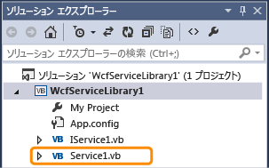
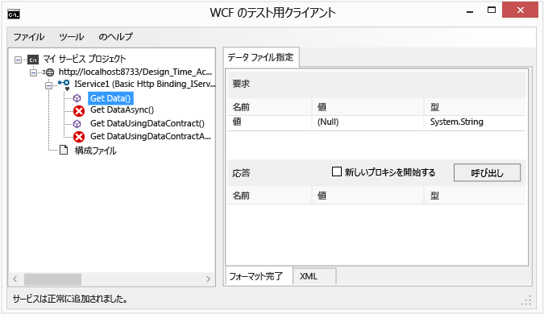
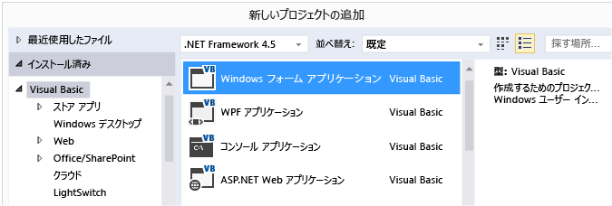
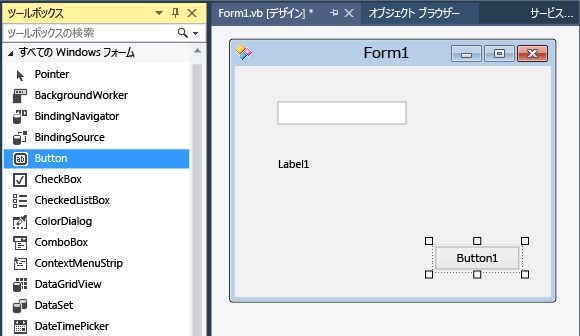

# チュートリアル: Windows フォームでの簡単な WCF サービスの作成

このチュートリアルでは、簡単な Windows Communication Foundation (WCF) サービスを作成し、テストして、Windows フォーム アプリケーションからアクセスする方法を例示しています。

[!INCLUDE[note_settings_general](../data-tools/includes/note_settings_general_md.md)]

## サービスの作成

1. Visual Studio を開きます。

::: moniker range="vs-2017"

2. **[ファイル]** メニューで、 **[新規]** > **[プロジェクト]** を選択します。

3. **[新しいプロジェクト]** ダイアログ ボックスで、 **[Visual Basic]** または **[Visual C#]** ノードを展開し、 **[WCF]** を選択してから **[WCF サービス ライブラリ]** を選択します。

4. **[OK]** をクリックしてプロジェクトを作成します。

   

::: moniker-end

::: moniker range=">=vs-2019"

2. スタート ウィンドウで、 **[新しいプロジェクトの作成]** を選択します。

3. **[新しいプロジェクトの作成]** ページの [検索] ボックスに「**WCF サービス ライブラリ**」と入力します。 **[WCF サービス ライブラリ]** の C# または Visual Basic テンプレートを選択し、 **[次へ]** をクリックします。

   

   > [!TIP]
   > テンプレートが表示されない場合は、Visual Studio の **Windows Communication Foundation** コンポーネントをインストールすることが必要な場合があります。 **[さらにツールと機能をインストールする]** を選択して Visual Studio インストーラーを開きます。 **[個々のコンポーネント]** タブを選択し、 **[開発作業]** まで下にスクロールして、 **[Windows Communication Foundation]** を選択します。 **[変更]** をクリックします。

4. **[新しいプロジェクトの構成]** ページで、 **[作成]** をクリックします。

::: moniker-end

   > [!NOTE]
   > これにより、テストしてアクセスすることが可能な機能するサービスが作成されます。 次の 2 つの手順は、別のデータ型を使用するように既定の方法を変更する方法を示しています。 実際のアプリケーションで、独自の関数をサービスに追加することもできます。

5. **ソリューション エクスプローラー** で、**IService1.vb** または **IService1.cs** をダブルクリックします。

   

   次の行を見つけます。

   :::code language="csharp" source="../snippets/csharp/VS_Snippets_VBCSharp/wcfwalkthrough/cs/iservice1_2.cs" id="Snippet4":::
   :::code language="vb" source="../snippets/visualbasic/VS_Snippets_VBCSharp/wcfwalkthrough/vb/iservice1_2.vb" id="Snippet4":::

   `value` パラメーターの型を文字列に変更します。

   :::code language="csharp" source="../snippets/csharp/VS_Snippets_VBCSharp/wcfwalkthrough/cs/iservice1.cs" id="Snippet1":::
   :::code language="vb" source="../snippets/visualbasic/VS_Snippets_VBCSharp/wcfwalkthrough/vb/iservice1.vb" id="Snippet1":::

   上記のコードで、`<OperationContract()>` または `[OperationContract]` 属性に注意してください。 これらの属性は、サービスによって公開されている任意のメソッドに必要です。

6. **ソリューション エクスプローラー** で、**Service1.vb** または **Service1.cs** をダブルクリックします。

   

   次の行を見つけます。

   :::code language="vb" source="../snippets/visualbasic/VS_Snippets_VBCSharp/wcfwalkthrough/vb/service1_2.vb" id="Snippet5":::
   :::code language="csharp" source="../snippets/csharp/VS_Snippets_VBCSharp/wcfwalkthrough/cs/service1_2.cs" id="Snippet5":::

   `value` パラメーターの型を文字列に変更します。

   :::code language="csharp" source="../snippets/csharp/VS_Snippets_VBCSharp/wcfwalkthrough/cs/service1.cs" id="Snippet2":::
   :::code language="vb" source="../snippets/visualbasic/VS_Snippets_VBCSharp/wcfwalkthrough/vb/service1.vb" id="Snippet2":::

## サービスをテストする

1. **F5** キーを押してサービスを実行します。 **[WCF のテスト用クライアント]** フォームが表示され、サービスが読み込まれます。

2. **[WCF のテスト用クライアント]** フォームで、**IService1** の下の **GetData()** メソッドをダブルクリックします。 **[GetData]** タブが表示されます。

     

3. **[要求]** ボックスで、**[値]** フィールドを選択して「`Hello`」と入力します。

     ![[値] フィールド](../data-tools/media/wcf5.png)

4. **[起動]** ボタンをクリックします。 **[セキュリティ警告]** ダイアログ ボックスが表示されたら、 **[OK]** をクリックします。 結果は **[応答]** ボックスに表示されます。

     ![[応答] ボックスに結果が表示される](../data-tools/media/wcf6.png)

5. **[ファイル]** メニューの **[終了]** をクリックして、テスト フォームを閉じます。

## サービスにアクセスする

### WCF サービスを参照する

1. **[ファイル]** メニューの **[追加]** をポイントし、 **[新しいプロジェクト]** をクリックします。

2. **[新しいプロジェクト]** ダイアログ ボックスで、 **[Visual Basic]** ノードまたは **[Visual C#]** ノードを展開し、 **[Windows]** を選択して **[Windows フォーム アプリケーション]** を選択します。 **[OK]** をクリックして、プロジェクトを開きます。

     

3. **[WindowsApplication1]** を右クリックして **[サービス参照の追加]** をクリックします。 [**サービス参照の追加**] ダイアログ ボックスが表示されます。

4. **[サービス参照の追加]** ダイアログ ボックスで、**[探索]** をクリックします。

     ![[サービス参照の追加] ダイアログ ボックス](../data-tools/media/wcf8.png)

     **Service1** が **[サービス]** ペインに表示されます。

5. **[OK]** をクリックしてサービス参照を追加します。

### クライアント アプリケーションを構築します

1. **ソリューション エクスプローラー** で、**[Form1.vb]** または **[Form1.cs]** をダブルクリックして、Windows フォーム デザイナーを (まだ開いていない場合に) 開きます。

2. **ツールボックス** で、`TextBox` コントロール、`Label` コントロール、および `Button` コントロールをフォームにドラッグします。

     

3. `Button` をダブルクリックし、`Click` イベント ハンドラーに次のコードを追加します。

     :::code language="csharp" source="../snippets/csharp/VS_Snippets_VBCSharp/wcfwalkthrough/cs/form1.cs" id="Snippet3":::
     :::code language="vb" source="../snippets/visualbasic/VS_Snippets_VBCSharp/wcfwalkthrough/vb/form1.vb" id="Snippet3":::

4. **ソリューション エクスプローラー** で、**[WindowsApplication1]** を右クリックして **[スタートアップ プロジェクトに設定]** をクリックします。

5. **F5** キーを押してプロジェクトを実行します。 いくつかのテキストを入力し、ボタンをクリックします。 ラベルに「You entered:」と入力したテキストが表示されます。

     

## 関連項目

- [Visual Studio での Windows Communication Foundation サービスと WCF データ サービス](../data-tools/windows-communication-foundation-services-and-wcf-data-services-in-visual-studio.md)
