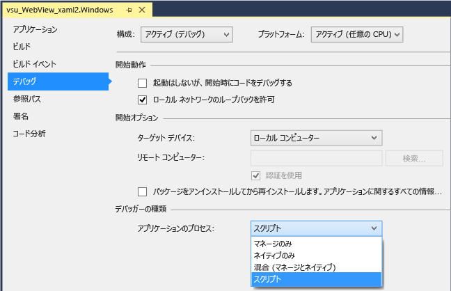

# UWP アプリでの WebView コントロールのデバッグ

 Windows Runtime アプリで `WebView` コントロールを検査しデバッグするには、アプリの開始時にスクリプト デバッガーをアタッチするよう Visual Studio を設定できます。 デバッガーを使用して `WebView` コントロールと 2 つの方法で対話できます。

- `WebView` インスタンスで [DOM Explorer](../debugger/quickstart-debug-html-and-css.md) を開き、DOM 要素を検査し、CSS スタイルの問題を調査し、スタイルに対する動的な変更をテストします。

- [JavaScript コンソール](../debugger/javascript-console-commands.md?view=vs-2017) ウィンドウで `WebView` インスタンスに表示される Web ページまたは `iFrame` をターゲットとして選択し、コンソール コマンドを使用して Web ページと対話します。 コンソールは、現在のスクリプト実行コンテキストへのアクセスを提供します。

### デバッガーのアタッチ (C#、Visual Basic、C++)

1. Visual Studio で、Windows Runtime アプリに `WebView` コントロールを追加します。

2. ソリューション エクスプローラーで、プロジェクトのショートカット メニューから **[プロパティ]** を選択して、プロジェクトのプロパティを開きます。

3. **[デバッグ]** を選択します。 **[アプリケーション プロセス]** ボックスの一覧の **[スクリプト]** をクリックします。

     

4. (オプション) Visual Studio の非 Express バージョンの場合、 **[ツール]、[オプション]、[デバッグ]、[Just-In-Time]** の順にクリックして、スクリプトの JIT デバッグを無効にします。

    > [!NOTE]
    > JIT デバッグを無効にすると、一部の Web ページで生じる未処理の例外のダイアログ ボックスを非表示にできます。 Visual Studio Express では、JIT デバッグは常に無効となっています。

5. F5 キーを押してデバッグを開始します。

### DOM Explorer を使って WebView コントロールを検査およびデバッグします。

1. (C#、Visual Basic、C++) スクリプト デバッガーをアプリにアタッチします。 手順については最初のセクションを参照してください。

2. まだ行っていない場合はアプリに `WebView` コントロールを追加して、F5 を押すとデバッグが開始します。

3. `Webview` コントロールが含まれるページに移動します。

4. **[デバッグ]** 、 **[ウィンドウ]** 、 **[DOM Explorer]** の順に選択して、`WebView` コントロールの DOM Explorer ウィンドウを開き、検索する `WebView` の URL を選択します。

     

     `WebView` に関連付けられた DOM Explorer が Visual Studio の新しいタブとして表示されます。

5. 「[DOM Explorer を使用した CSS スタイルのデバッグ](quickstart-debug-html-and-css.md)」で説明されているように、ライブ DOM 要素と CSS スタイルを表示および変更します。

### JavaScript コンソール ウィンドウを使って WebView コントロールを検査およびデバッグします。

1. (C#、Visual Basic、C++) スクリプト デバッガーをアプリにアタッチします。 手順については最初のセクションを参照してください。

2. まだ行っていない場合はアプリに `WebView` コントロールを追加して、F5 を押すとデバッグが開始します。

3. **[デバッグ]** 、 **[ウィンドウ]** 、 **[JavaScript コンソール]** の順に選択して、`WebView` コントロールの JavaScript コンソール ウインドウを開きます。

     JavaScript コンソール ウィンドウが開きます。

4. `Webview` コントロールが含まれるページに移動します。

5. コンソール ウィンドウで、 **[ターゲット]** 一覧の `WebView` コントロールの横に表示されている Web ページまたは `iFrame` を選択します。

     

    > [!NOTE]
    > コンソールを使って、1 度に 1 つの `WebView`、`iFrame`、共有コントラクト、または Web ワーカーとやり取りできます。 各要素では、Web プラットフォーム ホストの個別のインスタンスが必要となります (WWAHost.exe)。 一度に 1 つのホストとやり取りできます。

6. アプリの変数を表示および変更するか、コンソール コマンドを使用します。これは、[JavaScript のデバッグのためのクイックスタート](../debugger/quickstart-debug-javascript-using-the-console.md)および [JavaScript コンソール コマンド](../debugger/javascript-console-commands.md?view=vs-2017)に関するページで説明されています。

## 関連項目

- [クイック スタート:HTML および CSS のデバッグ](../debugger/quickstart-debug-html-and-css.md)