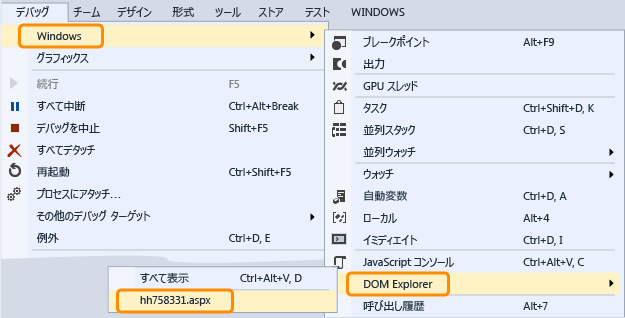

# UWP アプリの WebView コントロールをデバッグします。
  
 Windows Runtime アプリで `WebView` コントロールを検査しデバッグするには、アプリの開始時にスクリプト デバッガーをアタッチするよう Visual Studio を設定できます。 2 つの方法と対話する必要がある`WebView`デバッガーの使用方法を制御します。  
  
-   開く、 [DOM Explorer](../debugger/quickstart-debug-html-and-css.md)の`WebView`インスタンス、DOM 要素を検査し、CSS スタイルの問題を調査、およびスタイルに対する動的な変更をテストします。  
  
-   Web ページを選択または`iFrame`に表示される、`WebView`インスタンス内のターゲットとして、 [JavaScript コンソール](../debugger/javascript-console-commands.md)ウィンドウ、コンソールのコマンドを使用して web ページと対話して、します。 コンソールは、現在のスクリプト実行コンテキストへのアクセスを提供します。  
  
### デバッガーのアタッチ (C#、Visual Basic、C++)  
  
1.  Visual Studio で、Windows Runtime アプリに `WebView` コントロールを追加します。  
  
2.  ソリューション エクスプ ローラーで、プロジェクトのプロパティを選択して開きます**プロパティ**プロジェクトのショートカット メニューからです。  
  
3.  選択**デバッグ**です。 **アプリケーション プロセス**一覧で、選択**スクリプト**です。  
  
       
  
4.  (省略可能)非 Express バージョンの Visual Studio、・ イン タイム (JIT) を選択してデバッグを無効にする**ツール > オプション > デバッグ > ジャスト イン タイム**、およびスクリプトのデバッグ、JIT の無効化します。  
  
    > [!NOTE]
    >  JIT デバッグを無効にすると、一部の Web ページで生じる未処理の例外のダイアログ ボックスを非表示にできます。 Visual Studio Express では、JIT デバッグは常に無効となっています。  
  
5.  F5 キーを押してデバッグを開始します。  
  
### DOM Explorer を使って WebView コントロールを検査およびデバッグします。  
  
1.  (C#、Visual Basic、C++) スクリプト デバッガーをアプリにアタッチします。 手順については最初のセクションを参照してください。  
  
2.  まだ行っていない場合はアプリに `WebView` コントロールを追加して、F5 を押すとデバッグが開始します。  
  
3.  `Webview` コントロールが含まれるページに移動します。  
  
4.  DOM Explorer ウィンドウを開く、`WebView`コントロールを選択して**デバッグ**、 **Windows**、 **DOM Explorer**の URL を選択し、`WebView`しました。検査するとしてください。  
  
       
  
     `WebView` に関連付けられた DOM Explorer が Visual Studio の新しいタブとして表示されます。  
  
5.  説明に従って、ライブ DOM 要素と CSS スタイルの変更を表示および[DOM Explorer を使用して CSS のデバッグ スタイル](../debugger/debug-css-styles-using-dom-explorer.md)です。  
  
### JavaScript コンソール ウィンドウを使って WebView コントロールを検査およびデバッグします。  
  
1.  (C#、Visual Basic、C++) スクリプト デバッガーをアプリにアタッチします。 手順については最初のセクションを参照してください。  
  
2.  まだ行っていない場合はアプリに `WebView` コントロールを追加して、F5 を押すとデバッグが開始します。  
  
3.  JavaScript コンソール ウィンドウを開く、`WebView`コントロールを選択して**デバッグ**、 **Windows**、 **JavaScript コンソール**です。  
  
     JavaScript コンソール ウィンドウが開きます。  
  
4.  `Webview` コントロールが含まれるページに移動します。  
  
5.  コンソール ウィンドウで、web ページを選択または`iFrame`によって表示される、`WebView`内の制御、**ターゲット** ボックスの一覧です。  
  
       
  
    > [!NOTE]
    >  コンソールを使って、1 度に 1 つの `WebView`、`iFrame`、共有コントラクト、または Web ワーカーとやり取りできます。 各要素では、Web プラットフォーム ホストの個別のインスタンスが必要となります (WWAHost.exe)。 一度に 1 つのホストとやり取りできます。  
  
6.  表示し、アプリ内の変数を変更するか」の説明に従って、コンソールのコマンドを使用して[クイック スタート: JavaScript のデバッグ](../debugger/quickstart-debug-javascript-using-the-console.md)と[JavaScript コンソール コマンド](../debugger/javascript-console-commands.md)です。  
  
## 関連項目  
 [クイック スタート: HTML および CSS のデバッグ](../debugger/quickstart-debug-html-and-css.md)