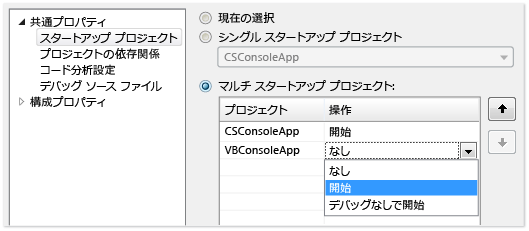

# 複数のプロセスをデバッグ (C#、Visual Basic、C++)

Visual Studio では、いくつかのプロセスを含むソリューションをデバッグできます。 開始しプロセス間の切り替え、中断、続行するとソース、デバッグの停止、および最後の手順したり個々 のプロセスからデタッチできます。  

##  複数のプロセスでデバッグを開始します。 

Visual Studio ソリューションでは、複数のプロジェクトは個別に実行できる、デバッガーが起動するプロジェクトを選択できます。 現在のスタートアップ プロジェクトに表示で太字**ソリューション エクスプ ローラー**します。 

スタートアップ プロジェクトを変更する**ソリューション エクスプ ローラー**を別のプロジェクトを右クリックし、**スタートアップ プロジェクトとして設定**します。

プロジェクトからデバッグを開始する**ソリューション エクスプ ローラー**スタートアップ プロジェクトを加えずには、プロジェクトを右クリックして**デバッグ** > **新しいインスタンスを開始する**または**新しいインスタンスにステップ イン**します。 

**スタートアップ プロジェクトまたは複数のプロジェクトをソリューションのプロパティから設定。**

1. ソリューションを選択します。**ソリューション エクスプ ローラー**を選び、**プロパティ**アイコンのツールバーで、またはソリューションを右クリックし、選択**プロパティ**します。  
   
1. **プロパティ**] ページで、[**共通プロパティ** > **スタートアップ プロジェクト**します。
   
     
   
1. 選択**現在の選択範囲**、**シングル スタートアップ プロジェクト**とプロジェクト ファイル、または**マルチ スタートアップ プロジェクト**します。 

   選択した場合**マルチ スタートアップ プロジェクト**、プロジェクトごとに実行するには、起動順序とアクションを変更することができます。**開始**、**デバッグなしで開始**、または**None**します。  
   
1. 選択**適用**、または**OK**を適用し、ダイアログ ボックスを閉じます。 

###   プロセスにアタッチする  

デバッガーこともできます*アタッチ*リモート デバイス上でなど、Visual Studio の外部プロセスで実行されているアプリ。 アプリにアタッチした後は、Visual Studio デバッガーを使用できます。 デバッグ機能は、限られた可能性があります。 デバッグ情報を持つかどうか、アプリの構築、アプリのソース コードへのアクセスがあるかどうかと、JIT コンパイラがデバッグ情報を追跡するかどうかによって異なります。  
  
詳細については、次を参照してください。[実行中のプロセスにアタッチ](../debugger/attach-to-running-processes-with-the-visual-studio-debugger.md)します。  
  
**実行中のプロセスにアタッチするには:**  
  
1. 実行中のアプリで次のように選択します。**デバッグ** > **プロセスにアタッチ**します。 

     
  
1. **プロセスにアタッチ**] ダイアログ ボックスで、プロセスを**選択可能なプロセス**、一覧表示し、[**アタッチ**します。  
  
>[!NOTE]
>デバッガーは、子プロジェクトが同じソリューション内にある場合でも、デバッグ対象のプロセスによって開始された子プロセスに自動的にアタッチされません。 子プロセスをデバッグするには、開始後に、子プロセスにアタッチするか、新しいデバッガー インスタンスで子プロセスを起動する Windows レジストリ エディターを構成します。  
  
###   レジストリ エディターを使用して、デバッガーでプロセスを自動的に開始  

場合によっては、別のプロセスによって起動されるアプリのスタートアップ コードをデバッグする必要があります。 たとえば、サービスやカスタムのセットアップ動作などです。 デバッガーを起動し、アプリに自動的に関連付けることができます。 

1. 実行して、Windows レジストリ エディターを開始*regedit.exe*します。  
   
1. レジストリ エディターに移動**hkey_local_machine \software\microsoft\windows nt \currentversion\image File Execution Options**します。  
  
1. デバッガーで起動するアプリのフォルダーを選択します。  
   
   アプリが子フォルダーとして表示されていない場合は右クリック**Image File Execution Options**を選択します**新規** > **キー**アプリの名前を入力します。 または、ツリーの 新しいキーを右クリックして**の名前を変更**、アプリ名を入力します。 
   
1. ツリーを選び、新しいキーを右クリックして**新規** > **文字列値**します。  
   
1. 新しい値の名前を変更**新しい値 #1**に`debugger`します。  
   
1. 右クリック**デバッガー**選択**変更**します。  
   
     
   
1. **文字列の編集**ダイアログ ボックスに「`vsjitdebugger.exe`で、**値のデータ**ボックスを選び**OK**します。  
   
     
   
##   複数のプロセスを使用したデバッグします。 
 

複数のプロセスを使用してアプリをデバッグするときに重大なステップ実行、および継続のデバッガー コマンドは既定ですべてのプロセスに影響します。 たとえば、プロセスがブレークポイントで中断されると、またその他のすべてのプロセスの実行は中断されます。 コマンドの実行対象をより詳細に制御するために、この既定の動作を変更できます。  

**1 つのプロセスがブレークするときにすべてのプロセスが中断されたかどうかを変更するには**

- **ツール**(または**デバッグ**) >**オプション** > **デバッグ** > **全般**、オンまたはオフ、 **1 つのプロセスがブレークするときに、すべてのプロセスをブレーク**チェック ボックスをオンします。  
  
###   中断、ステップ実行、続行のコマンド  
  
次の表に、デバッグの動作を説明するときにコマンド、 **1 つのプロセスがブレークするときに、すべてのプロセスをブレーク** チェック ボックスを選択または選択解除。

|**コマンド**|選択済み|選択を解除|  
|-|-|-|  
|**デバッグ**  > **すべて中断**|すべてのプロセスが中断されます。|すべてのプロセスが中断されます。|  
|**デバッグ** > **続行**|すべてのプロセスが再開されます。|一時停止中のすべてプロセスが再開されます。|  
|**デバッグ** > **にステップ イン**、**をステップ オーバーする**、または**ステップ アウト**|現在のプロセスのステップ実行中にすべてのプロセスが実行されます。  その後、すべてのプロセスが中断されます。|現在のプロセスがステップ実行されます。  一時停止中のプロセスが再開されます。  実行中のプロセスが続行されます。|  
|**デバッグ** > **現在のプロセスにステップ イン**、**ステップ オーバー、現在のプロセス**、または**ステップ アウト 現在のプロセス**|N/A|現在のプロセスがステップ実行されます。 他のプロセスの既存の状態 (一時停止中または実行中) が維持されます。|  
|ソース ウィンドウ**ブレークポイント**|すべてのプロセスが中断されます。|ソース ウィンドウのプロセスのみ中断されます。|  
|ソース ウィンドウ**カーソルまで実行** ソース ウィンドウのプロセスは現在のプロセスであることが必要です。|ソース ウィンドウのプロセスがカーソル位置まで実行されてから中断されている間に、すべてのプロセスが実行されます。 その後、他のすべてのプロセスが中断されます。|ソース ウィンドウのプロセスはカーソル位置まで実行されます。 他のプロセスの既存の状態 (一時停止中または実行中) が維持されます。|  
|**プロセス**ウィンドウ >**プロセスのブレーク**|N/A|選択したプロセスが中断されます。 他のプロセスの既存の状態 (一時停止中または実行中) が維持されます。|  
|**プロセス**ウィンドウ >**プロセスの続行**|N/A|選択したプロセスが再開されます。 他のプロセスの既存の状態 (一時停止中または実行中) が維持されます。|  

###   ソースとシンボル (.pdb) ファイルを検索する  
プロセスのソース コードを移動するには、デバッガーはそのソース ファイルとシンボル ファイルへのアクセスが必要です。 詳細については、[シンボル (.pdb) ファイルとソース ファイル](../debugger/specify-symbol-dot-pdb-and-source-files-in-the-visual-studio-debugger.md)の指定に関する記事をご覧ください。  
  
使用して移動することができます、プロセスのファイルにアクセスできない場合、**逆アセンブル**ウィンドウ。 詳細については、「[方法 :[逆アセンブル] ウィンドウを使用する](../debugger/how-to-use-the-disassembly-window.md)」を参照してください。  

###   プロセスの切り替え  

をデバッグしているが、特定の時点に 1 つだけのプロセスがデバッガーでアクティブなときに、複数のプロセスにアタッチすることができます。 **[デバッグの場所]** ツール バーまたは **[プロセス]** ウィンドウでアクティブまたは*現在*のプロセスを設定できます。 プロセス間で切り替えるには、両方のプロセスが中断モードであることが必要です。  
  
**デバッグの場所 ツールバーから現在のプロセスを設定します。**  
  
1. 開くには、**デバッグの場所**ツールバーで、**ビュー** > **ツールバー** > **デバッグの場所**します。  
   
1. デバッグ中に、**デバッグの場所**ツールバーから現在のプロセスとして設定するプロセスの選択、**プロセス**ドロップダウンします。  
  
     
  
**[プロセス] ウィンドウから、現在のプロセスを設定します。**  
  
1. 開くには、**プロセス**ウィンドウで、デバッグ中に、**デバッグ** > **Windows** > **プロセス**します。 

1. **プロセス**ウィンドウで、現在のプロセスが黄色の矢印でマークされます。 現在のプロセスとして設定するプロセスをダブルクリックします。  
  
     

プロセスに切り替えると、デバッグ目的で、現在のプロセスとして設定します。 デバッガー ウィンドウの現在のプロセスの状態を表示して、ステップ実行コマンドが現在のプロセスのみに影響します。  
  
## 複数のプロセスを使用したデバッグを停止します。  
  
既定で選択すると、**デバッグ** > **デバッグの停止**デバッガーを終了またはすべてのプロセスからデタッチされます。 
  
- 現在のプロセスをデバッガーで起動した場合、プロセスが終了しました。  
  
- デバッガーを現在のプロセスにアタッチした場合、デバッガーはプロセスからデタッチされ、プロセスは実行中のままになります。  
  
Visual Studio ソリューションからのプロセスのデバッグを開始する場合、既に実行されている別のプロセスにアタッチし、[**デバッグの停止]**、デバッグ セッションが終了します。 関連付けられているプロセスが実行中に、Visual Studio で開始されたプロセスを終了します。 

方法を制御する**デバッグの停止**で個々 のプロセスに影響を与えます、**プロセス**ウィンドウで、プロセスを右クリックし、オンまたはオフ、 **デバッグ停止時にデタッチ**チェック ボックスをオンします。  
  
>[!NOTE]
>**1 つのプロセスがブレークするときに、すべてのプロセスをブレーク**デバッガー オプションでは、停止、終了、またはプロセスからのデタッチは影響しません。  
  
###  停止、終了、デタッチのコマンド  
  
次の表に、デバッガーの停止の動作、終了、およびデタッチのコマンドで複数のプロセス。 

|**コマンド**|**説明**|  
|-|-| 
|**デバッグ** > **デバッグを停止**|動作が変更されない限り、**プロセス**ウィンドウで、デバッガーによって開始されたプロセスを終了すると、およびプロセスにアタッチがデタッチされます。|  
|**デバッグ** > **すべて中止**|すべてのプロセスは終了します。|  
|**デバッグ** > **すべてデタッチ**|すべてのプロセスからデバッガーがデタッチされます。|  
|**プロセス**ウィンドウ >**プロセスのデタッチ**|選択したプロセスからデバッガーがデタッチされます。 他のプロセスの既存の状態 (一時停止中または実行中) が維持されます。|  
|**プロセス**ウィンドウ >**プロセスの終了**|選択したプロセスが終了しました。 他のプロセスの既存の状態 (一時停止中または実行中) が維持されます。|  
|**プロセス**ウィンドウ >**デバッグの停止時にデタッチ**|選択した場合、**デバッグ** > **デバッグの停止**選択したプロセスからデタッチされます。  選択しなかった場合、**デバッグ** > **デバッグの停止**選択したプロセスを終了します。 |  
## 関連項目  
 [シンボル (.pdb) とソース ファイルの指定](../debugger/specify-symbol-dot-pdb-and-source-files-in-the-visual-studio-debugger.md)   
 [実行中のプロセスにアタッチする](../debugger/attach-to-running-processes-with-the-visual-studio-debugger.md)   
 [デバッガーでのコード間の移動](../debugger/navigating-through-code-with-the-debugger.md)   
 [Just-In-Time デバッグ](../debugger/just-in-time-debugging-in-visual-studio.md)   
 [マルチスレッド アプリケーションのデバッグ](../debugger/debug-multithreaded-applications-in-visual-studio.md)