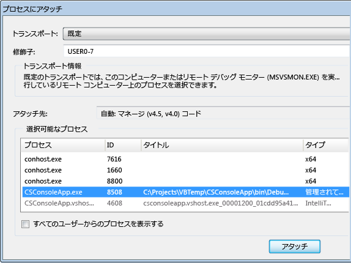

# Visual Studio での 1 つ以上のプロセスのデバッグ
[!INCLUDE[vs2017banner](../code-quality/includes/vs2017banner.md)]

ここでは、プロセスのデバッグ開始、プロセス間の切り替え、実行の中断と続行、ソースのステップ実行、デバッグの停止、プロセスの終了\/プロセスからのデタッチの方法について説明します。  
  
##   内容  
 [複数のプロセスの実行動作を構成する](#BKMK_Configure_the_execution_behavior_of_multiple_processes)  
  
 [ソースとシンボル (.pdb) ファイルを検索する](#BKMK_Find_the_source_and_symbol___pdb__files)  
  
 [VS ソリューション内の複数のプロセスを開始する、プロセスにアタッチする、デバッガーでプロセスを自動的に開始する](#BKMK_Start_multiple_processes_in_a_VS_solution__attach_to_a_process__automatically_start_a_process_in_the_debugger)  
  
 [プロセス間を切り替える、実行を中断/続行する、ソースをステップ実行する](#BKMK_Switch_processes__break_and_continue_execution__step_through_source)  
  
 [デバッグを停止する、プロセスを終了する/プロセスからデタッチする](#BKMK_Stop_debugging__terminate_or_detach_from_processes)  
  
##   複数のプロセスの実行動作を構成する  
 既定では、複数のプロセスがデバッガーで実行されているとき、デバッガーの中断、ステップ実行、停止のコマンドは通常、すべてのプロセスに影響を与えます。  たとえば、1 つのプロセスがブレークポイントで中断されると、他のすべてのプロセスの実行も一時停止されます。  コマンドの実行対象をより詳細に制御するために、この既定の動作を変更できます。  
  
1.  **\[デバッグ\]** メニューの **\[オプションと設定\]** をクリックします。  
  
2.  **\[デバッグ\]**\/**\[全般\]** ページで、**\[1 つのプロセスがブレークするとき、他のプロセスもブレークする\]** チェック ボックスをオフにします。  
  
  [内容](#BKMK_Contents)  
  
##   ソースとシンボル \(.pdb\) ファイルを検索する  
 プロセスのソース コードを処理するために、デバッガーにはプロセスのソース ファイルとシンボル ファイルへのアクセスが必要になります。  「[シンボルとソース コードの管理](../debugger/specify-symbol-dot-pdb-and-source-files-in-the-visual-studio-debugger.md)」を参照してください。  
  
 プロセスのこれらのファイルにアクセスできない場合は、\[逆アセンブル\] ウィンドウを使用してそれらのファイルを検索できます。  「[方法 : \[逆アセンブル\] ウィンドウを使用する](../Topic/How%20to:%20Use%20the%20Disassembly%20Window.md)」を参照してください。  
  
  [内容](#BKMK_Contents)  
  
##   VS ソリューション内の複数のプロセスを開始する、プロセスにアタッチする、デバッガーでプロセスを自動的に開始する  
  
-   [Visual Studio ソリューション内の複数のプロセスのデバッグを開始する](#BKMK_Start_debugging_multiple_processes_in_a_Visual_Studio_solution) • [スタートアップ プロジェクトを変更する](#BKMK_Change_the_startup_project) • [ソリューション内の特定のプロジェクトを開始する](#BKMK_Start_a_specific_project_in_a_solution) • [ソリューション内の複数のプロジェクトを開始する](#BKMK_Start_multiple_projects_in_a_solution) • [プロセスにアタッチする](#BKMK_Attach_to_a_process) • [デバッガーでプロセスを自動的に開始する](#BKMK_Automatically_start_an_process_in_the_debugger)  
  
> [!NOTE]
>  デバッガーは、子プロジェクトが同じソリューション内にある場合でも、デバッグ対象のプロセスによって開始された子プロセスに自動的にアタッチされません。  子プロセスをデバッグするには:  
>   
>  -   子プロセスが開始された後、そのプロセスにアタッチします。  
>   
>      または  
> -   デバッガーの新しいインスタンスで子プロセスが自動的に開始されるように Windows を構成します。  
  
###   Visual Studio ソリューション内の複数のプロセスのデバッグを開始する  
 Visual Studio ソリューション内に独立して実行できる複数のプロジェクト \(個別のプロセスで実行されるプロジェクト\) があるときは、デバッガーによって起動されるプロジェクトを選択できます。  
  
   
  
####   スタートアップ プロジェクトを変更する  
 ソリューションのスタートアップ プロジェクトを変更するには、ソリューション エクスプローラーでプロジェクトを選択し、コンテキスト メニューの **\[スタートアップ プロジェクトに設定\]** をクリックします。  
  
####   ソリューション内の特定のプロジェクトを開始する  
 既定のスタートアップ プロジェクトを変更せずにソリューションのプロジェクトを開始するには、ソリューション エクスプローラーでプロジェクトを選択し、コンテキスト メニューの **\[デバッグ\]** をクリックします。  次に、**\[新しいインスタンスを開始\]** または **\[新しいインスタンスにステップ イン\]** をクリックできます。  
  
  [VS ソリューション内の複数のプロセスを開始する、プロセスにアタッチする、デバッガーでプロセスを自動的に開始する](../debugger/debug-multiple-processes.md#BKMK_Start_multiple_processes_in_a_VS_solution__attach_to_a_process__automatically_start_a_process_in_the_debugger)  
  
  [内容](#BKMK_Contents)  
  
####   ソリューション内の複数のプロジェクトを開始する  
  
1.  ソリューション エクスプローラーでソリューションを選択し、コンテキスト メニューの **\[プロパティ\]** をクリックします。  
  
2.  **\[プロパティ\]** ダイアログ ボックスで、**\[共通プロパティ\]**、**\[スタートアップ プロジェクト\]** の順にクリックします。  
  
3.  変更するプロジェクトごとに、**\[開始\]**、**\[デバッグなしで開始\]**、**\[なし\]** のいずれかを選択します。  
  
  [VS ソリューション内の複数のプロセスを開始する、プロセスにアタッチする、デバッガーでプロセスを自動的に開始する](../debugger/debug-multiple-processes.md#BKMK_Start_multiple_processes_in_a_VS_solution__attach_to_a_process__automatically_start_a_process_in_the_debugger)  
  
  [内容](#BKMK_Contents)  
  
###   プロセスにアタッチする  
 デバッガーは、Visual Studio の外部プロセスで実行されているプログラム \(リモート デバイスで実行されているプログラムなど\) にも*アタッチ*できます。  プログラムにアタッチした後、デバッガーの実行コマンドを使用したり、プログラムの状態をチェックしたりできます。  プログラムのチェック機能は、デバッグ情報付きでビルドされたプログラムかどうか、プログラムのソース コードにアクセスできるかどうか、および共通言語ランタイムの JIT コンパイラがデバッグ情報を追跡しているかどうかによって限定される場合があります。  
  
 詳細については、「[実行中のプロセスへのアタッチ](../debugger/attach-to-running-processes-with-the-visual-studio-debugger.md)」を参照してください。  
  
 **ローカル コンピューター上で実行されているプロセスにアタッチする**  
  
 **\[デバッグ\]**、**\[プロセスにアタッチ\]** の順にクリックします。  **\[プロセスにアタッチ\]** ダイアログ ボックスの **\[選択可能なプロセス\]** ボックスの一覧で、アタッチするプロセスを選択し、**\[アタッチ\]** をクリックします。  
  
   
  
  [内容](#BKMK_Contents)  
  
###   デバッガーでプロセスを自動的に開始する  
 場合によっては、別のプロセスで起動されたプログラムのスタートアップ コードをデバッグする必要があります。  たとえば、サービスやカスタムのセットアップ動作などです。  このような場合、アプリケーションの起動時にデバッガーを起動して自動的にアタッチできます。  
  
1.  レジストリ エディター \(**regedit.exe**\) を起動します。  
  
2.  **HKEY\_LOCAL\_MACHINE\\Software\\Microsoft\\Windows NT\\CurrentVersion\\Image File Execution Options** フォルダーに移動します。  
  
3.  デバッガーで起動するアプリのフォルダーを選択します。  
  
     アプリの名前が子フォルダーとして表示されない場合は、**\[Image File Execution Options\]** を選択し、コンテキスト メニューで **\[新規作成\]**、**\[キー\]** の順にクリックします。  新しいキーを選択し、ショートカット メニューの **\[名前の変更\]** をクリックして、アプリの名前を入力します。  
  
4.  app フォルダーのコンテキスト メニューで **\[新規作成\]**、**\[文字列の値\]** の順にクリックします。  
  
5.  新しい値の名前を「**New Value**」から「`debugger`」に変更します。  
  
6.  デバッガー エントリのコンテキスト メニューの **\[変更\]** をクリックします。  
  
7.  \[文字列の編集\] ダイアログ ボックスの **\[Value data\]** ボックスに「`vsjitdebugger.exe`」と入力します。  
  
       
  
   
  
  [内容](#BKMK_Contents)  
  
##   プロセス間を切り替える、実行を中断\/続行する、ソースをステップ実行する  
  
-   [プロセス間を切り替える](#BKMK_Switch_between_processes) • [中断、ステップ実行、続行のコマンド](#BKMK_Break__step__and_continue_commands)  
  
###   プロセス間を切り替える  
 デバッグ中には複数のプロセスにアタッチできますが、デバッガーでアクティブになっているプロセスは常に 1 つだけです。  \[デバッグの場所\] ツール バーまたは **\[プロセス\]** ウィンドウでアクティブまたは*現在*のプロセスを設定できます。  プロセス間で切り替えるには、両方のプロセスが中断モードであることが必要です。  
  
 **現在のプロセスを設定するには**  
  
-   \[デバッグの場所\] でツール バーで、**\[プロセス\]** をクリックして **\[プロセス\]** ボックスの一覧を表示します。  現在のプロセスとして指定するプロセスを選択します。  
  
       
  
     **\[デバッグの場所\]** ツール バーが表示されていない場合は、**\[ツール\]**、**\[カスタマイズ\]** の順にクリックします。  **\[ツール バー\]** タブで、**\[デバッグの場所\]** を選択します。  
  
-   **\[プロセス\]** ウィンドウを開き \(ショートカット: **Ctrl\+Alt\+Z**\)、現在のプロセスとして設定するプロセスを見つけてダブルクリックします。  
  
       
  
     現在のプロセスが黄色の矢印でマークされます。  
  
 プロジェクトを切り替えると、そのプロジェクトがデバッグ対象の現在のプロセスに設定されます。  表示するすべてのデバッガー ウィンドウに、現在のプロセスの状態が表示され、すべてのステップ実行コマンドは現在のプロセスにのみ影響を与えます。  
  
  [プロセス間を切り替える、実行を中断/続行する、ソースをステップ実行する](../debugger/debug-multiple-processes.md#BKMK_Switch_processes__break_and_continue_execution__step_through_source)  
  
  [内容](#BKMK_Contents)  
  
###   中断、ステップ実行、続行のコマンド  
  
> [!NOTE]
>  既定では、中断、続行、ステップ実行のコマンドはデバッグ中のすべてのプロセスに影響を与えます。  この動作を変更するには、「[複数のプロセスの実行動作を構成する](#BKMK_Configure_the_execution_behavior_of_multiple_processes)」を参照してください  
  
||||  
|-|-|-|  
|**コマンド**|**\[1 つのプロセスがブレークするとき、他のプロセスもブレークする\]**   オンにした場合 \(既定\)|**\[1 つのプロセスがブレークするとき、他のプロセスもブレークする\]**   オフにした場合|  
|**\[デバッグ\]** メニュー:   -   **\[すべて中断\]**|すべてのプロセスが中断されます。|すべてのプロセスが中断されます。|  
|**\[デバッグ\]** メニュー:   -   **Continue**|すべてのプロセスが再開されます。|一時停止中のすべてプロセスが再開されます。|  
|**\[デバッグ\]** メニュー:   -   **\[ステップ イン\]** -   **\[ステップ オーバー\]** -   **\[ステップ アウト\]**|現在のプロセスのステップ実行中にすべてのプロセスが実行されます。   その後、すべてのプロセスが中断されます。|現在のプロセスがステップ実行されます。   一時停止中のプロセスが再開されます。   実行中のプロセスが続行されます。|  
|**\[デバッグ\]** メニュー:   -   **\[現在のプロセスにステップ インする\]** -   **\[現在のプロセスにステップ オーバーする\]** -   **\[現在のプロセスにステップ アウトする\]**|N\/A|現在のプロセスがステップ実行されます。   他のプロセスの既存の状態 \(一時停止中または実行中\) が維持されます。|  
|ソース ウィンドウ   -   **ブレークポイント**|すべてのプロセスが中断されます。|ソース ウィンドウのプロセスのみ中断されます。|  
|ソース ウィンドウのコンテキスト メニュー:   -   **\[カーソル行の前まで実行\]**   ソース ウィンドウのプロセスは現在のプロセスであることが必要です。|ソース ウィンドウのプロセスがカーソル位置まで実行されてから中断されている間に、すべてのプロセスが実行されます。   その後、他のすべてのプロセスが中断されます。|ソース ウィンドウのプロセスはカーソル位置まで実行されます。   他のプロセスの既存の状態 \(一時停止中または実行中\) が維持されます。|  
|**\[プロセス\]** ウィンドウのコンテキスト メニュー:   -   **\[プロセスのブレーク\]**|N\/A|選択したプロセスが中断されます。   他のプロセスの既存の状態 \(一時停止中または実行中\) が維持されます。|  
|**\[プロセス\]** ウィンドウのコンテキスト メニュー:   -   **\[プロセスの続行\]**|N\/A|選択したプロセスが再開されます。   他のプロセスの既存の状態 \(一時停止中または実行中\) が維持されます。|  
  
  [プロセス間を切り替える、実行を中断/続行する、ソースをステップ実行する](../debugger/debug-multiple-processes.md#BKMK_Switch_processes__break_and_continue_execution__step_through_source)  
  
  [内容](#BKMK_Contents)  
  
##   デバッグを停止する、プロセスを終了する\/プロセスからデタッチする  
  
-   [停止、終了、デタッチのコマンド](#BKMK_Stop__terminate__and_detach_commands)  
  
 既定では、複数のプロセスがデバッガーで開いているときに **\[デバッグ\]**、**\[デバッグの停止\]** をクリックすると、プロセスがデバッガーで開かれた方法に応じて、デバッガーがプロセスを終了するか、すべてのプロセスからデタッチされます。  
  
-   現在のプロセスがデバッガーで開始された場合、そのプロセスは終了します。  
  
-   デバッガーを現在のプロセスにアタッチした場合、デバッガーはプロセスからデタッチされ、プロセスは実行中のままになります。  
  
 たとえば、Visual Studio ソリューションからプロセスのデバッグを開始し、既に実行されている別のプロセスにアタッチしてから、**\[デバッグの停止\]** をクリックした場合、デバッグ セッションは終了し、Visual Studio で開始されたプロセスも終了しますが、アタッチしたプロセスは実行中のままになります。  次の手順を使用してデバッグの停止方法を制御できます。  
  
> [!NOTE]
>  **\[1 つのプロセスがブレークするとき、他のプロセスもブレークする\]** オプションはデバッグの停止、プロセスの終了、プロセスからのデタッチには影響を与えません。  
  
 **デバッグの停止による個々のプロセスへの影響を変更するには**  
  
-   **\[プロセス\]** ウィンドウを開きます \(ショートカット: **Ctrl\+Alt\+Z**\)。  プロセスを選択し、**\[デバッグの停止時にデタッチ\]** チェック ボックスをオンまたはオフにします。  
  
###   停止、終了、デタッチのコマンド  
  
|||  
|-|-|  
|**コマンド**|**説明**|  
|**\[デバッグ\]** メニュー:   -   **\[デバッグの停止\]**|**\[プロセス\]** ウィンドウの **\[デバッグの停止時にデタッチ\]** オプションによって動作が変更されない場合:   1.  デバッガーによって開始されたプロセスが終了します。 2.  アタッチ中のプロセスがデバッガーからデタッチされます。|  
|**\[デバッグ\]** メニュー:   -   **\[すべて中止\]**|すべてのプロセスが終了します。|  
|**\[デバッグ\]** メニュー:   -   **\[すべてデタッチ\]**|すべてのプロセスからデバッガーがデタッチされます。|  
|**\[プロセス\]** ウィンドウのコンテキスト メニュー:   -   **\[プロセスのデタッチ\]**|選択したプロセスからデバッガーがデタッチされます。   他のプロセスの既存の状態 \(一時停止中または実行中\) が維持されます。|  
|**\[プロセス\]** ウィンドウのコンテキスト メニュー:   -   **\[プロセスの終了\]**|選択したプロセスが終了します。   他のプロセスの既存の状態 \(一時停止中または実行中\) が維持されます。|  
|**\[プロセス\]** ウィンドウのコンテキスト メニュー:   -   **\[デバッグの停止時にデタッチ\]**|選択したプロセスに対して **\[デバッグ\]**\/**\[デバッグの停止\]** の動作を切り替えます。   -   オンにした場合: デバッガーがプロセスからデタッチされます。 -   オフにした場合: プロセスが終了します。|  
  
  [デバッグを停止する、プロセスを終了する/プロセスからデタッチする](../debugger/debug-multiple-processes.md#BKMK_Stop_debugging__terminate_or_detach_from_processes)  
  
  [内容](#BKMK_Contents)  
  
## 参照  
 [シンボルとソース コードの管理](../debugger/specify-symbol-dot-pdb-and-source-files-in-the-visual-studio-debugger.md)   
 [実行中のプロセスへのアタッチ](../debugger/attach-to-running-processes-with-the-visual-studio-debugger.md)   
 [デバッガーでのコード間の移動](../debugger/navigating-through-code-with-the-debugger.md)   
 [Just\-In\-Time デバッグ](../debugger/just-in-time-debugging-in-visual-studio.md)   
 [マルチスレッド アプリケーションのデバッグ](../debugger/debug-multithreaded-applications-in-visual-studio.md)