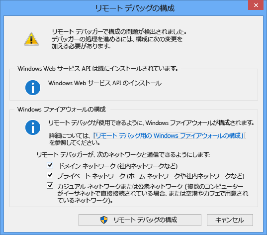

---
translation.priority.ht:
- cs-cz
- de-de
- es-es
- fr-fr
- it-it
- ja-jp
- ko-kr
- pl-pl
- pt-br
- ru-ru
- tr-tr
- zh-cn
- zh-tw
ms.openlocfilehash: 2e5782c49f26925d9eda81f04653b1a20666c6b1
ms.sourcegitcommit: da4079f5b6ec884baf3108cbd0519d20cb64c70b
ms.translationtype: MT
ms.contentlocale: ja-JP
ms.lasthandoff: 07/15/2019
ms.locfileid: "67043461"
---
1. リモート コンピューターでは、検索および開始、**リモート デバッガー**から、**開始**メニュー。 
   
   リモート コンピューターの管理アクセス許可を持ちを右クリックし、**リモート デバッガー**アプリと選択**管理者として実行**します。 それ以外の場合だけ、正常に起動します。

   (IIS) などのアカウントが、管理者として実行されているか、別のユーザーで実行されているプロセスにアタッチしようとしている場合を右クリックし、**リモート デバッガー**アプリと選択**を管理者として実行**. 詳細については、次を参照してください。[リモート デバッガーを管理者として実行](../remote-debugging-errors-and-troubleshooting.md#run-the-remote-debugger-as-an-administrator)します。
   
1. 最初に、リモート デバッガーを起動する (または構成する前に)、**リモート デバッグの構成** ダイアログ ボックスが表示されます。  
  
      
  
1. Windows Web サービスの API がインストールされていない場合、Windows Server 2008 R2 でのみ発生しますが、選択、**インストール**ボタンをクリックします。  
  
1. リモート ツールを使用するには少なくとも 1 つのネットワークの種類を選択します。 コンピューターがドメインを介して接続されている場合は、最初の項目を選択する必要があります。 コンピューターがワークグループまたはホーム グループを介して接続された場合、に応じて、2 番目または 3 番目の項目を選択します。  
  
1. 選択**のリモート デバッグ構成**ファイアウォールを構成し、リモート デバッガーを起動します。  
  
1. 構成が完了すると、**リモート デバッガー**ウィンドウが表示されます。
  
    
  
    接続のリモート デバッガーが待機しているようになりました。 サーバー名を使用し、ポート番号を示す Visual Studio でリモート接続の構成を設定します。  
  
リモート デバッガーを停止するには、次のように選択します。**ファイル** > **終了**します。 再起動することができます、**開始** メニューまたはコマンドラインから。  
  
```cmd
<Remote debugger installation directory>\msvsmon.exe
```
