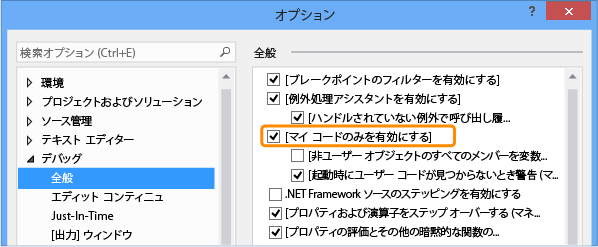

# <a name="debug-only-user-code-with-just-my-code"></a>マイ コードのみのユーザー コードのみのデバッグします。 

*マイ コードのみ*が Visual Studio のデバッグ機能を自動的に手順に対するシステム、フレームワーク、およびその他の非ユーザー コードの呼び出し。 **呼び出し履歴**ウィンドウ、マイ コードのみにこれらの呼び出しが閉じ、 **[外部コード]** フレーム。 

.NET Framework、C++、および JavaScript のプロジェクトでマイ コードのみが異なる方法では動作します。

##  <a name="BKMK_Enable_or_disable_Just_My_Code"></a>"マイ コードのみ" の有効/無効の切り替え  

ほとんどのプログラミング言語では、マイ コードのみは既定で有効にします。 

- 有効または Visual Studio で、マイ コードのみを無効にする**ツール** > **オプション**(または**デバッグ** > **オプション**) >**デバッグ** > **全般**をオンまたはオフ**マイ コードのみを有効にする**します。
  
   
  
> [!NOTE]
> **マイ コードのみを有効にする**はすべての言語のすべての Visual Studio プロジェクトに適用されるグローバル設定です。  
  
##  <a name="just-my-code-debugging"></a>マイ コードのみデバッグ

デバッグ セッション中に、**モジュール**の状態を読み込んで、シンボルとコードのモジュールは、デバッガーがマイ コード (ユーザー コード) として扱うことがウィンドウが表示されます。 詳細については、次を参照してください。[をアプリにデバッガーのアタッチをより理解を深める](../debugger/debugger-tips-and-tricks.md#modules_window)します。

 ![[モジュール] ウィンドウ内のユーザー コード](../debugger/media/dbg_justmycode_module.png "モジュール ウィンドウ内のユーザー コード")
  
**呼び出し履歴**または**タスク**マイ コードのみ ウィンドウには、というラベルが付いた淡色の注釈付きコード フレームに非ユーザー コードが折りたたまれます`[External Code]`します。

 
  
>[!TIP]
>開くには、**モジュール**、**呼び出し履歴**、**タスク**、またはその他のほとんどのデバッグ ウィンドウで、デバッグ セッションである必要があります。 下のデバッグ中に**デバッグ** > **Windows**、開きたい windows を選択します。 

<a name="BKMK_Override_call_stack_filtering"></a> 折りたたまれたコードを表示する **[外部コード]** フレームを右クリックして、**呼び出し履歴**または**タスク**ウィンドウ、および選択**外部コードの表示**、コンテキスト メニュー。 展開されている外部コード行を置き換える、 **[外部コード**] フレーム。 

 
  
> [!NOTE]
> **外部コードの表示**設定を現在のユーザー プロファイラーは、ユーザーによって開かれたすべての言語のすべてのプロジェクトに適用されます。

展開された外部のコード行をダブルクリックすると、**呼び出し履歴**ウィンドウには、ソース コード内で緑で呼び出し元のコード行が強調表示されます。 Dll または他のモジュールが見つからないか、読み込まれた場合、シンボルやソースが見つかりません。 ページを開くことがあります。

##  <a name="BKMK__NET_Framework_Just_My_Code"></a>.NET Framework での "マイ コードのみ" 

マイ コードのみ、.NET Framework プロジェクトでシンボルを使用して (*.pdb*) ファイルとプログラム最適化をユーザーと非ユーザー コードを分類します。 .NET Framework デバッガーは、バイナリを最適化し、読み込まれていない考慮 *.pdb*非ユーザー コード ファイル。
  
コンパイラの 3 つの属性は、ユーザー コードと見なされる .NET デバッガーも影響します。  

- <xref:System.Diagnostics.DebuggerNonUserCodeAttribute> 適用されるコードにユーザー コードがないことをデバッガーに指示します。  
- <xref:System.Diagnostics.DebuggerHiddenAttribute> は、"マイ コードのみ" がオフになっていても、コードをデバッガーから見えないようにするための属性です。  
- <xref:System.Diagnostics.DebuggerStepThroughAttribute> デバッガーは、コードにステップ インではなく、適用されるコードをステップ実行を指示します。  

.NET Framework デバッガーでは、その他のすべてのコードをユーザー コードと見なします。  

.NET Framework デバッグ: 中

- **デバッグ** > **ステップ イン**(または**F11**) の非ユーザー コードをステップ オーバー コードは、ユーザー コードの次の行にします。 
- **デバッグ** > **ステップ アウト**(または**Shift**+**F11**) 非ユーザー コードでは、ユーザー コードの次の行を実行します。 

ユーザー コードがある場合は、終了、別のブレークポイントにヒットまたは、エラーがスローされるまでは引き続きデバッグします。 

<a name="BKMK_NET_Breakpoint_behavior"></a> 非ユーザー コードでデバッガーを中断する場合 (たとえば、使用する**デバッグ** > **すべて中断**と非ユーザー コードで一時停止)、**ソースがありません**ウィンドウが表示されます。 使用することができます、**デバッグ** > **手順**コマンドをユーザー コードの次の行に移動します。

非ユーザー コードでハンドルされない例外が発生した場合、デバッガーは、例外が生成されたユーザーのコード行で中断します。  
  
初回例外で、例外を有効にする場合は、ソース コード内で緑で呼び出し元のユーザー コード行が強調表示されます。 **呼び出し履歴**ウィンドウには、というラベルの注釈付きフレームが表示されます。 **[外部コード]** します。  

##  <a name="BKMK_C___Just_My_Code"></a>C++ での "マイ コードのみ"  
  
C++ では、マイ コードのみを有効にするのと同じです、 [(だけマイ コードのデバッグ)/JMC](/cpp/build/reference/jmc)コンパイラ スイッチ。

<a name="BKMK_CPP_User_and_non_user_code"></a> ステップ実行の動作を個別に非ユーザー ファイルを指定できるため、マイ コードのみがよりも .NET Framework、JavaScript での C++ では異なる、**呼び出し履歴**ウィンドウ。 

マイ コードのみを C++ では、これらの関数を非ユーザー コードのみを考慮します。

- **呼び出し履歴**ウィンドウ。 

  - シンボル ファイル内に除去されたソース情報がある関数。  
  - シンボル ファイルがスタック フレームに対応するソース ファイルがないことを示す関数。  
  - 指定された関数 *\*.natjmc*内のファイル、 *%VsInstallDirectory%\Common7\Packages\Debugger\Visualizers*フォルダー。  
  
- 動作をステップ実行。
  
  - 指定された関数 *\*.natstepfilter*内のファイル、 *%VsInstallDirectory%\Common7\Packages\Debugger\Visualizers*フォルダー。  
  
作成することができます *.natstepfilter*と *.natjmc*マイ コードのみのステップ実行動作をカスタマイズするファイルと**呼び出し履歴**ウィンドウ。 参照してください[ステップ実行の動作をカスタマイズする C++](#BKMK_CPP_Customize_stepping_behavior)と[呼び出し履歴の動作をカスタマイズする C++](#BKMK_CPP_Customize_call_stack_behavior)します。 

<a name="BKMK_CPP_Stepping_behavior"></a> C++ のデバッグ中には

- **デバッグ** > **ステップ イン**(または**F11**) の非ユーザー コードをステップ オーバー コードは、ユーザー コードの次の行にします。 
- **デバッグ** > **ステップ アウト**(または**Shift**+**F11**) 非ユーザー コードでは、ユーザー コードの次の行を実行します。 

ユーザー コードがある場合は、終了、別のブレークポイントにヒットまたは、エラーがスローされるまでは引き続きデバッグします。 

非ユーザー コードでデバッガーを中断する場合 (などを使用する**デバッグ** > **すべて中断**と非ユーザー コードで一時停止)、非ユーザー コードでは引き続きステップ実行します。

デバッガーが例外に達する場合ユーザーまたは非ユーザー コード内にあるかどうか、例外で停止します。 **ユーザーよって処理されない**オプション、**例外設定** ダイアログ ボックスは無視されます。  

###  <a name="BKMK_CPP_Customize_stepping_behavior"></a> C++ のステップ実行動作をカスタマイズします。  

 C++ のプロジェクトでは、関数を非ユーザー コードとしてオーバーしてステップを指定できます *\*.natstepfilter*ファイル。  
  
- Visual Studio のすべてのローカル ユーザーの非ユーザー コードを指定するには、追加、 *.natstepfilter*ファイルを *%VsInstallDirectory%\Common7\Packages\Debugger\Visualizers*フォルダー。  
- 個々のユーザーの非ユーザー コードを指定するには、*%USERPROFILE%\My Documents\Visual Studio 2017\Visualizers* フォルダーに *.natstepfilter* ファイルを追加します。  
  
A *.natstepfilter*ファイルは、この構文を使用して XML ファイル。  
  
```xml  
<?xml version="1.0" encoding="utf-8"?>  
<StepFilter xmlns="http://schemas.microsoft.com/vstudio/debugger/natstepfilter/2010">  
    <Function>  
        <Name>FunctionSpec</Name>  
        <Action>StepAction</Action>  
    </Function>  
    <Function>  
        <Name>FunctionSpec</Name>  
        <Module>ModuleSpec</Module>  
        <Action>StepAction</Action>  
    </Function>  
</StepFilter>  
  
```  
  
|要素|説明|  
|-------------|-----------------|  
|`Function`|必須です。 1 つ以上の関数を非ユーザー関数として指定します。|  
|`Name`|必須です。 一致を照合する完全な関数名を指定する ECMA-262 書式の正規表現。 次に例を示します。<br /><br /> `<Name>MyNS::MyClass.*</Name>`<br /><br /> は、`MyNS::MyClass` のすべてのメソッドが非ユーザー コードと見なされることをデバッガーに知らせます。 一致照合では、大文字と小文字が区別されます。|  
|`Module`|任意。 関数を含むモジュールへの完全パスを指定する ECMA-262 書式の正規表現。 一致では、大文字と小文字を区別しません。|  
|`Action`|必須です。 大文字と小文字が区別される以下のいずれかの値です。<br /><br /> `NoStepInto`  -関数をステップ オーバーするデバッガーに指示します。<br /> `StepInto`  -その他のオーバーライド、関数にステップ インをデバッガーに指示`NoStepInto`一致する関数。|  
  
###  <a name="BKMK_CPP_Customize_call_stack_behavior"></a> C++ の呼び出し履歴の動作をカスタマイズします。  

C++ プロジェクトでは、モジュール、ソース ファイル、および関数を指定することができます、**呼び出し履歴**でそれらを指定し、ウィンドウが非ユーザー コードとして扱います *\*.natjmc*ファイル。  
  
-   Visual Studio コンピューターのすべてのユーザーの非ユーザー コードを指定するには、*%VsInstallDirectory%\Common7\Packages\Debugger\Visualizers* フォルダーに *.natjmc* ファイルを追加します。  
-   個人のユーザーの非ユーザー コードを指定するには、*%USERPROFILE%\My Documents\Visual Studio 2017\Visualizers* フォルダーに *.natjmc* ファイルを追加します。  

A *.natjmc*ファイルは、この構文を使用して XML ファイル。  
  
```xml  
<?xml version="1.0" encoding="utf-8"?>  
<NonUserCode xmlns="http://schemas.microsoft.com/vstudio/debugger/jmc/2015">  
  
  <!-- Modules -->  
  <Module Name="ModuleSpec" />  
  <Module Name="ModuleSpec" Company="CompanyName" />  
  
  <!-- Files -->  
  <File Name="FileSpec"/>  
  
  <!-- Functions -->  
  <Function Name="FunctionSpec" />  
  <Function Name="FunctionSpec" Module ="ModuleSpec" />  
  <Function Name="FunctionSpec" Module ="ModuleSpec" ExceptionImplementation="true" />  
  
</NonUserCode>  
  
```  
  
 **Module 要素の属性**  
  
|属性|説明|  
|---------------|-----------------|  
|`Name`|必須です。 モジュールの完全パス。 Windows のワイルドカード文字を使用することができます`?`(0 個または 1 つの文字) と`*`(0 個以上の文字)。 たとえば、オブジェクトに適用された<br /><br /> `<Module Name="?:\3rdParty\UtilLibs\*" />`<br /><br /> では、ドライブの *\3rdParty\UtilLibs* 内のすべてのモジュールを外部コードとして扱うことをデバッガーに指示します。|  
|`Company`|任意。 実行可能ファイルに埋め込まれているモジュールを発行する会社の名前。 この属性を使用して、モジュールのあいまいさを解消することができます。|  
  
 **File 要素の属性**  
  
|属性|説明|  
|---------------|-----------------|  
|`Name`|必須です。 外部コードとして扱うソース ファイルの完全パス。 パスを指定するときに Windows のワイルドカード文字、`?` および `*` を使用できます。|  
  
 **Function 要素の属性**  
  
|属性|説明|  
|---------------|-----------------|  
|`Name`|必須です。 外部コードとして扱う関数の完全修飾名。|  
|`Module`|任意。 関数を含むモジュールの名前または完全パス。 この属性を使用して、同じ名前の関数のあいまいさを解消することができます。|  
|`ExceptionImplementation`|`true` に設定すると、この関数ではなく、例外をスローした関数が呼び出し履歴に表示されます。|  
  
##  <a name="BKMK_JavaScript_Just_My_Code"></a>JavaScript での "マイ コードのみ"  

<a name="BKMK_JS_User_and_non_user_code"></a>JavaScript の "マイ コードのみ" では、以下のいずれかの方法でコードを分類することによって、ステップ実行と呼び出し履歴表示が制御されます。  

|||  
|-|-|  
|**MyCode**|ユーザーが所有および制御するユーザー コード。|  
|**LibraryCode**|ライブラリを定期的に使用して、アプリからの非ユーザー コードでは、正しく (WinJS や jQuery など) の機能に依存します。|  
|**UnrelatedCode**|所有していないアプリとアプリ内の非ユーザー コードは、正常に機能するに依存しません。 たとえば、広告の広告を表示する SDK には、UnrelatedCode 可能性があります。 UWP プロジェクトでは、HTTP または HTTPS URI からアプリに読み込まれる任意のコードも UnrelatedCode を考慮していました。|  

JavaScript デバッガーはユーザーまたはこの順序でないユーザーとしてコードを分類します。  
  
1. 既定の分類。  
   -   ホスト提供する文字列を渡すことによって実行されるスクリプト`eval`関数は**MyCode**します。  
   -   文字列を渡すことによって実行されるスクリプト、`Function`コンス トラクターは**LibraryCode**します。  
   -   WinJS や、Azure SDK などのフレームワーク参照内のスクリプトが**LibraryCode**します。  
   -   文字列を渡すことによって実行されるスクリプト、 `setTimeout`、 `setImmediate`、または`setInterval`関数は**UnrelatedCode**します。  
   
2. 指定されたすべての Visual Studio JavaScript プロジェクトの分類、 *%VSInstallDirectory%\JavaScript\JustMyCode\mycode.default.wwa.json*ファイル。  
   
3. 分類、 *mycode.json*の現在のプロジェクト ファイル。  
  
分類の各手順で、前の手順はオーバーライドされます。 

他のコードはすべて、**MyCode** として分類されます。  

既定の分類を変更して、ユーザーまたは非ユーザー コードとして追加することで特定のファイルや Url を分類、 *.json*という名前のファイル*mycode.json* JavaScript プロジェクトのルート フォルダーにします。 参照してください[JavaScript マイ コードのみをカスタマイズ](#BKMK_JS_Customize_Just_My_Code)します。 

<a name="BKMK_JS_Stepping_behavior"></a> JavaScript のデバッグ中には 

- 関数が非ユーザー コードでは場合、**デバッグ** > **ステップ イン**(または**F11**) と同様に動作**デバッグ** > **をステップ オーバーする**(または**F10**)。  
- ステップが非ユーザーで開始する場合 (**LibraryCode**または**UnrelatedCode**)、コードがマイ コードのみが有効になっていない場合のように動作一時的にステップ インします。 ユーザー コードでは、マイ コードのみにステップ インとステップ実行を再度有効にします。  
- 現在の実行コンテキストを離れることでユーザー コードのステップ結果、次のユーザーが実行されたコード行でデバッガーが停止します。 たとえば、コールバックが **LibraryCode** コードで実行されると、デバッガーはユーザー コードの次の行が実行されるまで続行されます。
- **ステップ アウト**(または**Shift**+**F11**) ユーザー コードの次の行で停止します。 

ユーザー コードがある場合は、終了、別のブレークポイントにヒットまたは、エラーがスローされるまでは引き続きデバッグします。 

コードで設定されたブレークポイントはヒットは常が、コードを分類します。  

- 場合、`debugger`でキーワードが発生した**LibraryCode**デバッガーは常に中断します。  
- 場合、`debugger`でキーワードが発生した**UnrelatedCode**デバッガーは停止しません。  
  
<a name="BKMK_JS_Exception_behavior"></a> ハンドルされない例外が発生した場合**MyCode**または**LibraryCode**コード、デバッガーは常に中断します。  

ハンドルされない例外が発生した場合**UnrelatedCode**、および**MyCode**または**LibraryCode**が呼び出し履歴をデバッガーは中断します。  
  
初回例外、例外が有効になっていて、例外が発生します**LibraryCode**または**UnrelatedCode**:  
  
-   例外が処理される場合、デバッガーは中断されません。  
-   例外が処理されない場合、デバッガーは中断します。  
  
###  <a name="BKMK_JS_Customize_Just_My_Code"></a> マイ コードのみの JavaScript をカスタマイズします。  

ユーザーと 1 つの JavaScript プロジェクトの非ユーザー コードを分類するには、追加することができます、 *.json*という名前のファイル*mycode.json*プロジェクトのルート フォルダーにします。  
  
このファイルの仕様は、既定の分類を上書きし、 *mycode.default.wwa.json*ファイル。 *Mycode.json*ファイルは、すべてのキー値のペアを一覧表示する必要はありません。 **MyCode**、**ライブラリ**、および**Unrelated**値が空の配列を指定できます。  
  
*Mycode.json*ファイルは、この構文を使用します。  
  
```json  
{  
    "Eval" : "Classification",  
    "Function" : "Classification",  
    "ScriptBlock" : "Classification",  
    "MyCode" : [  
        "UrlOrFileSpec",  
        . . .  
        "UrlOrFileSpec"  
    ],  
    "Libraries" : [  
        "UrlOrFileSpec",  
        . .  
        "UrlOrFileSpec"  
    ],  
    "Unrelated" : [  
        "UrlOrFileSpec",  
        . . .  
        "UrlOrFileSpec"  
    ]  
}  
  
```  
  
 **Eval、Function、および ScriptBlock**  
  
 **Eval**、**Function**、および **ScriptBlock** のキーと値のペアで、動的に生成されたコードを分類する方法が決まります。  
  
|||  
|-|-|  
|**Eval**|ホスト提供の `eval` 関数に文字列を渡すことで実行されるスクリプト。 既定では、Eval スクリプトは **MyCode** として分類されます。|  
|**Function**|`Function` コンストラクターに文字列を渡すことで実行されるスクリプト。 既定では、Function スクリプトは **LibraryCode** として分類されます。|  
|**ScriptBlock**|`setTimeout`、`setImmediate`、または `setInterval` 関数に文字列を渡すことで実行されるスクリプト。 既定では、ScriptBlock スクリプトは **UnrelatedCode** として分類されます。|  
  
 以下のいずれかのキーワードに値を変更できます。  
  
-   `MyCode` では、スクリプトが **MyCode** として分類されます。  
-   `Library` では、スクリプトが **LibraryCode** として分類されます。  
-   `Unrelated` では、スクリプトが **UnrelatedCode** として分類されます。  
  
  **MyCode、Libraries、および Unrelated**  
  
 **MyCode**、**Libraries**、および **Unrelated** のキーと値のペアでは、分類に含める URL またはファイルを指定します。  
  
|||  
|-|-|  
|**MyCode**|**MyCode** として分類される URL またはファイルの配列。|  
|**Libraries**|**LibraryCode** として分類される URL またはファイルの配列。|  
|**Unrelated**|**UnrelatedCode** として分類される URL またはファイルの配列。|  
  
 URL またはファイルの文字列は、1 つ以上を持つことができます`*`、0 個以上の文字に一致する文字。 `*` 正規表現として同じ`.*`します。
