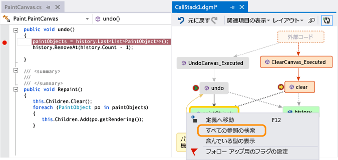

# デバッグ中に呼び出し履歴のビジュアルマップを作成するC#(、Visual Basic C++、、JavaScript)

デバッグ中に呼び出し履歴を視覚的にトレースするためのコード マップを作成します。 コメントをマップに追加することで、バグを見つけることに重点を置いてコードの動作を追跡できます。

チュートリアル、ビデオをご覧ください:[ビデオ: コード マップ デバッガーの統合 (チャネル 9) で視覚的にデバッグ](https://channel9.msdn.com/Series/Visual-Studio-2012-Premium-and-Ultimate-Overview/Visual-Studio-Ultimate-2012Debug-visually-with-Code-Map-debugger-integration)

コードマップで使用できるコマンドとアクションの詳細については、「[コードマップの参照および再配置](../modeling/browse-and-rearrange-code-maps.md)」を参照してください。

>[!IMPORTANT]
>コードマップは[Visual Studio Enterprise エディション](https://visualstudio.microsoft.com/downloads)でのみ作成できます。

コードマップを簡単に見てみましょう。

 

## 呼び出し履歴でマップを作成する

1. Visual Studio Enterprise C#Visual Basic C++、、、または JavaScript プロジェクトでデバッグを開始するには **、[デバッグ > ** **開始**] を選択するか、 **F5**キーを押します。

1. アプリが中断モードになった後、または関数にステップインした後、[**デバッグ** > **コードマップ**] を選択するか、 **ctrl**+**Shift**+ **`** を押します。

   現在の呼び出し履歴は新しいコード マップ上にオレンジ色で表示されます。

   

デバッグを続行すると、コードマップが自動的に更新されます。 マップ項目またはレイアウトを変更しても、コードには影響しません。 マップでの名前変更、移動、削除は自由に行うことができます。

項目に関する詳細情報を取得するには、項目の上にマウスポインターを移動し、項目のツールヒントを確認します。 また、ツールバーの **[凡例]** を選択すると、各アイコンの意味を知ることができます。

>[!NOTE]
>コードマップの上部にある**古いバージョンのコードに基づい**ている可能性のあるメッセージは、マップを最後に更新した後にコードが変更された可能性があることを意味します。 たとえば、マップ上の呼び出しがコードに存在しなくなった可能性があります。 メッセージを閉じてから、マップを再び更新する前にソリューションをリビルドしてみます。

## 外部コードのマップ

既定では、ユーザー自身のコードだけがマップに表示されます。 マップ上の外部コードを表示するには、次のようにします。

- **[呼び出し履歴]** ウィンドウを右クリックし、 **[外部コードの表示]** を選択します。

  ![[呼び出し履歴] ウィンドウを使用して外部コードを表示する](../debugger/media/debuggermap_callstackmenu.png "DebuggerMap_CallStackMenu")
- または、[Visual Studio **Tools**で**マイコードのみを有効にする**(または**デバッグ**)] を選択を解除し、**デバッグ** > **オプション**を選択します。

  ![[オプション] ダイアログボックスを使用して外部コードを表示する](../debugger/media/debuggermap_debugoptions.png "DebuggerMap_DebugOptions")

## マップのレイアウトを制御する

マップのレイアウトを変更しても、コードには影響しません。

マップのレイアウトを制御するには、マップのツールバーで **[レイアウト]** メニューを選択します。

**[レイアウト]** メニューでは、次のことができます。

- 既定のレイアウトを変更します。
- [**デバッグ時に自動的にレイアウト**を解除する] をオフにして、マップの並べ替えを自動的に停止します。
- **[インクリメンタルレイアウト]** をオフにして、項目を追加するときにできるだけ少ないマップを再配置します。

## コードに関するコメントを追加する

コメントを追加して、コード内で何が起こっているかを追跡できます。

コメントを追加するには、コードマップを右クリックし、[ **Edit** > **New comment**] を選択して、コメントを入力します。

コメントに新しい行を追加するには、 **Shift**キーを押し+**enter**キーを押します。

 

## 次の呼び出し履歴でマップを更新する

アプリを次のブレークポイントに対して実行するか、関数にステップインすると、マップに新しい呼び出し履歴が自動的に追加されます。

マップで新しい呼び出し履歴を自動的に追加しないようにするには、コードマップツールバーの [する] を選択します。 マップは、引き続き既存の呼び出し履歴を強調表示します。 現在の呼び出し履歴をマップに手動で追加するには、 **ctrl**+**Shift**+ **`** を押します。

## 関連するコードをマップに追加する

マップを作成したので、またC#は Visual Basic では、フィールド、プロパティ、その他のメソッドなどの項目を追加して、コード内で何が起こっているかを追跡できます。

コード内のメソッドの定義に進むには、マップ内のメソッドをダブルクリックするか、またはそのメソッドを選択して**F12**キーを押すか、右クリックして **[定義へのジャンプ]** を選択します。

追跡する項目をマップに追加するには、メソッドを右クリックして、追跡する項目を選択します。最後に追加された項目は緑色で表示されます。

>[!NOTE]
>既定では、マップに項目を追加すると、クラス、名前空間、アセンブリなどの親グループのノードも追加されます。 この機能をオンまたはオフにするには、コードマップツールバーの **[親を含める]** ボタンを選択するか、 **Ctrl**キーを押しながら項目を追加します。

コードのさらに多くの項目を表示するには、マップの作成を続けます。

 

 

## マップを使用してバグを見つける
 コードの視覚化はバグをよりすばやく見つけるために役立ちます。 たとえば、描画アプリのバグを調査しているとします。 直線を描画して元に戻そうとしても、別の直線を描画するまで何も起こりません。

 そのため、`clear`、`undo`、および `Repaint` メソッドにブレークポイントを設定し、デバッグを開始して、次のようなマップを作成します。

 

 マップ上のすべてのユーザー ジェスチャーが、`Repaint` を除いて、`undo` を呼び出していることがわかります。 これが原因で `undo` がすぐに動作しない可能性があります。

 バグを修正し、アプリの実行を続行すると、マップによって `undo` から `Repaint`に新しい呼び出しが追加されます。

 

## 他のユーザーとマップを共有する

マップをエクスポートし、Microsoft Outlook を使用して他のユーザーに送信し、ソリューションに保存して、バージョン管理にチェックインすることができます。

マップを共有または保存するには、コードマップツールバーの **[共有]** を使用します。

## 関連項目
[ソリューション間の依存関係をマップする](../modeling/map-dependencies-across-your-solutions.md)

[コード マップを使用してアプリケーションをデバッグする](../modeling/use-code-maps-to-debug-your-applications.md)

[コード マップ アナライザーを使用して潜在的な問題を検索する](../modeling/find-potential-problems-using-code-map-analyzers.md)

[コード マップの参照および再配置](../modeling/browse-and-rearrange-code-maps.md)
