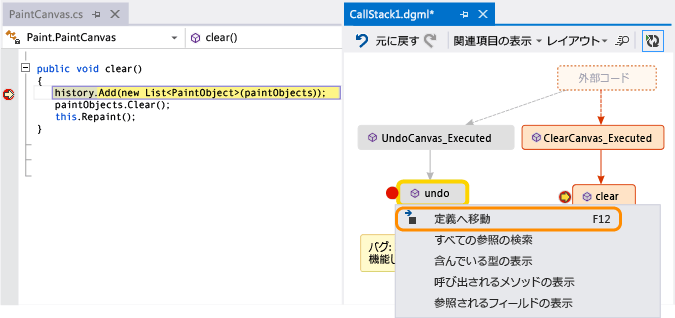

# デバッグ時に呼び出し履歴のビジュアル マップを作成する (C#、Visual Basic、C++、JavaScript)

デバッグ中に呼び出し履歴を視覚的にトレースするためのコード マップを作成します。 コメントをマップに追加することで、バグを見つけることに重点を置いてコードの動作を追跡できます。

チュートリアルについては、次のビデオをご覧ください。[ビデオ:コード マップ デバッガーの統合を使用して視覚的にデバッグする (Channel 9)](https://channel9.msdn.com/Series/Visual-Studio-2012-Premium-and-Ultimate-Overview/Visual-Studio-Ultimate-2012Debug-visually-with-Code-Map-debugger-integration)

コード マップで使用できるコマンドとアクションの詳細については、「[コード マップの参照および再配置](../modeling/browse-and-rearrange-code-maps.md)」を参照してください。

>[!IMPORTANT]
>コード マップは [Visual Studio Enterprise エディション](https://visualstudio.microsoft.com/downloads)でのみ作成できます。

コード マップを簡単に見てみましょう。

 

## 呼び出し履歴でマップを作成する

1. Visual Studio Enterprise C#、Visual Basic、C++、または JavaScript プロジェクトでは、 **[デバッグ]**  >  **[デバッグの開始]** を選択するか、**F5** キーを押してデバッグを開始します。

1. アプリが中断モードになった後、または関数にステップインした後、 **[デバッグ]**  >  **[コード マップ]** を選択するか、**Ctrl**+**Shift**+ **`** キーを押します。

   現在の呼び出し履歴は新しいコード マップ上にオレンジ色で表示されます。

   

デバッグを続行すると、コード マップは自動的に更新されます。 マップ項目またはレイアウトを変更しても、コードに影響はありません。 マップでの名前変更、移動、削除は自由に行うことができます。

項目に関する詳細情報を取得するには、項目にカーソルを合わせて、項目のツールヒントを確認します。 ツールバーの **[凡例]** を選択すると、各アイコンの意味がわかります。

>[!NOTE]
>コード マップの上部に "**ダイアグラムは古いバージョンのコードに基づいている可能性があります**" というメッセージが表示される場合は、マップを最後に更新した後にコードが変更された可能性があることを意味します。 たとえば、マップ上の呼び出しがコードに存在しなくなった可能性があります。 メッセージを閉じてから、マップを再び更新する前にソリューションをリビルドしてみます。

## 外部コードをマップする

既定では、ユーザー自身のコードだけがマップに表示されます。 マップに外部コードを表示するには、次のようにします。

- **[呼び出し履歴]** ウィンドウを右クリックし、 **[外部コードの表示]** を選択します。

  ![[呼び出し履歴] ウィンドウを使用して外部コードを表示する](../debugger/media/debuggermap_callstackmenu.png "DebuggerMap_CallStackMenu")
- または、Visual Studio の **[ツール]** (または **[デバッグ]** ) で **[マイ コードのみを有効にする]** をオフにして、 **[オプション]**  >  **[デバッグ]** を選択します。

  ![[オプション] ダイアログ ボックスを使用して外部コードを表示する](../debugger/media/debuggermap_debugoptions.png "DebuggerMap_DebugOptions")

## マップのレイアウトを制御する

マップのレイアウトを変更しても、コードに影響はありません。

マップのレイアウトを制御するには、マップ ツールバーの **[レイアウト]** メニューを選択します。

**[レイアウト]** メニューでは、次のことができます。

- 既定のレイアウトを変更します。
- **[デバッグ時に自動レイアウト]** をオフにして、マップの自動再配置を停止します。
- **[インクリメンタル レイアウト]** をオフにして、項目を追加するときのマップの再配置を最小限にします。

## コードに関するコメントを追加する

コードの動作を追跡するためのコメントを追加することができます。

コメントを追加するには、コード マップを右クリックして **[編集]**  >  **[新しいコメント]** を選択し、コメントを入力します。

コメント内で新しい行を追加するには、**Shift**+**Enter** キーを押します。

 

## 次の呼び出し履歴でマップを更新する

アプリを次のブレークポイントまで実行するか、関数にステップインすると、マップによって新しい呼び出し履歴が自動的に追加されます。

マップによって新しい呼び出し履歴が自動的に追加されないようにするには、コード マップ ツールバーの ![[コード マップにデバッガーの呼び出し履歴を自動的に表示]](../debugger/media/debuggermap_automaticupdateicon.gif "コード マップの呼び出し履歴を自動的に表示する") をオンにします。 マップには、引き続き既存の呼び出し履歴が強調表示されます。 マップに現在の呼び出し履歴を手動で追加するには、**Ctrl**+**Shift**+ **`** キーを押します。

## 関連するコードをマップに追加する

C# または Visual Basic でマップを作成したので、フィールド、プロパティ、その他のメソッドなどの項目を追加して、コード内で起こっていることを追跡できます。

コード内のメソッドの定義に移動するには、マップ内のメソッドをダブルクリックするか、選択して **F12** キーを押すか、右クリックして **[定義に移動]** を選択します。

追跡する項目をマップに追加するには、メソッドを右クリックし、追跡する項目を選択します。追加された最新の項目は緑色で表示されます。

>[!NOTE]
>既定では、マップに項目を追加すると、クラス、名前空間、アセンブリなどの親グループのノードも追加されます。 この機能をオフまたはオンにするには、コード マップ ツールバーの **[親を含める]** ボタンを選択するか、項目を追加するときに **Ctrl** キーを押します。

コードのさらに多くの項目を表示するには、マップの作成を続けます。

 

 

## マップを使用してバグを見つける
 コードの視覚化はバグをよりすばやく見つけるために役立ちます。 たとえば、描画アプリのバグを調査しているとします。 直線を描画して元に戻そうとしても、別の直線を描画するまで何も起こりません。

 そのため、`clear`、`undo`、および `Repaint` メソッドにブレークポイントを設定し、デバッグを開始して、次のようなマップを作成します。

 

 マップ上のすべてのユーザー ジェスチャーが、`Repaint` を除いて、`undo` を呼び出していることがわかります。 これが原因で `undo` がすぐに動作しない可能性があります。

 バグを修正してアプリの実行を続けると、マップに `undo` から `Repaint` への新しい呼び出しが追加されます。

 

## 他のユーザーとマップを共有する

マップをエクスポートし、Microsoft Outlook を使用して他のユーザーに送信し、ソリューションに保存して、バージョン コントロールにチェックインすることができます。

マップを共有または保存するには、コード マップ ツールバーの **[共有]** を使用します。

## 関連項目
[ソリューション間の依存関係をマップする](../modeling/map-dependencies-across-your-solutions.md)

[コード マップを使用してアプリケーションをデバッグする](../modeling/use-code-maps-to-debug-your-applications.md)

[コード マップ アナライザーを使用して潜在的な問題を検索する](../modeling/find-potential-problems-using-code-map-analyzers.md)

[コード マップの参照および再配置](../modeling/browse-and-rearrange-code-maps.md)
