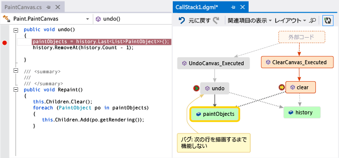

# デバッグ中に呼び出し履歴のビジュアル マップを作成 (C#、Visual Basic、C++、JavaScript)

デバッグ中に呼び出し履歴を視覚的にトレースするためのコード マップを作成します。 コメントをマップに追加することで、バグを見つけることに重点を置いてコードの動作を追跡できます。

チュートリアルについては、このビデオをご覧ください。[ビデオ:コード マップ デバッガーの統合 (チャネル 9) で視覚的にデバッグします。](http://go.microsoft.com/fwlink/?LinkId=293418)

コマンドとコード マップで使用できる操作の詳細については、次を参照してください。[参照およびコード マップの再配置](../modeling/browse-and-rearrange-code-maps.md)します。

>[!IMPORTANT]
>作成することができますのみでコード マップを[Visual Studio Enterprise edition](https://visualstudio.microsoft.com/downloads/?utm_medium=microsoft&utm_source=docs.microsoft.com&utm_campaign=inline+link&utm_content=download+vs2017)します。

コード マップの概要を次に示します。

 

##  呼び出し履歴でマップを作成する

1. Visual Studio Enterprise でC#、Visual Basic、C++ または JavaScript プロジェクトを選択してデバッグを開始**デバッグ** > **デバッグの開始**キーを押して**F5**.
   
1. アプリが中断モードになるか、関数にステップ イン、選択**デバッグ** > **コード マップ**、またはキーを押します**Ctrl**+**シフト**+**`**.

   現在の呼び出し履歴は新しいコード マップ上にオレンジ色で表示されます。

   

コードはデバッグを続行するよう、更新プログラムを自動的にマップします。 マップ項目またはレイアウトを変更すると、任意の方法でコードに影響しません。 マップでの名前変更、移動、削除は自由に行うことができます。

項目の詳細についてを取得するには、上にマウス ポインターを移動し、項目のツールヒントを確認します。 選択することも**凡例**で、ツールバーの各アイコンの意味について説明します。

>[!NOTE]
>メッセージ**の図は、以前のバージョンのコードに基づく可能性があります**最後に、マップを更新した後、コードを変更した可能性がありますがマップ、コードの上部にある意味します。 たとえば、マップ上の呼び出しがコードに存在しなくなった可能性があります。 メッセージを閉じてから、マップを再び更新する前にソリューションをリビルドしてみます。

## 外部コードをマップします。

既定では、ユーザー自身のコードだけがマップに表示されます。 マップ上の外部コードを参照してください。
  
- 右クリックし、**呼び出し履歴**ウィンドウと選択**外部コードの表示**:
  
  
- または、選択解除**マイ コードのみを有効にする**Visual Studio で**ツール**(または**デバッグ**) >**オプション** >  **デバッグ**:
  
  ![[オプション] ダイアログを使用して外部コードの表示](../debugger/media/debuggermap_debugoptions.png "DebuggerMap_DebugOptions")

## マップのレイアウトを制御します。

マップのレイアウトを変更すると、任意の方法でコードに影響しません。 

マップのレイアウトを制御するには、選択、**レイアウト**マップのツールバー メニュー。 

**レイアウト**ことができます メニュー。

-   既定のレイアウトを変更します。
-   選択を解除して、マップを自動的に再配置されないように**デバッグ時に自動レイアウト**します。
-   選択を解除して、項目を追加するときにできるだけのマップを再配置**インクリメンタル レイアウト**します。

##  コードに関するコメントを追加する

コードで何が起こっているかを追跡するためにコメントを追加することができます。 

コメントを追加するには、コード マップで右クリックして**編集** > **新しいコメント**コメントを入力します。 

コメントで新しい行を追加するキーを押します。 **Shift**+**Enter**します。

 

##  次の呼び出し履歴でマップを更新する

関数に次のブレークポイントまたはステップにアプリを実行すると、マップは新しい呼び出し履歴を自動的に追加します。

![[次へ] のコール スタックで更新プログラムのコード マップ](../debugger/media/debuggermap_addclearcallstack.png "DebuggerMap_AddClearCallStack")

新しい呼び出し履歴を自動的に追加することから、マップを停止する次のように選択します。 コード マップのツールバー。 マップは、既存の呼び出し履歴を強調表示が続行されます。 マップを現在の呼び出し履歴を手動で追加するには、キーを押して**Ctrl**+**Shift**+**`** します。 

##  関連するコードをマップに追加する

マップを取得したできたC#または Visual Basic では、フィールド、プロパティ、およびコードで何が起こっているかを追跡するために、他の方法などの項目を追加することができます。 

、コード内のメソッドの定義に移動するには、マップでは、メソッドをダブルクリックまたは選択してキーを押して**F12**、右クリックし、選択または**定義へ移動**します。

マップに追跡し項目を追加するには、メソッドを右クリックし、追跡する項目を選択します。追加された最新の項目は緑色で表示されます。

>[!NOTE]
>既定では、マップに項目を追加すると、クラス、名前空間、アセンブリなどの親グループのノードも追加されます。 選択してこの機能をオンとオフにすることができます、**親を含める**ボタン コード マップ ツールバーで、またはキーを押して**Ctrl**項目を追加するときにします。

コードのさらに多くの項目を表示するには、マップの作成を続けます。

 

 

##  マップを使用してバグを見つける
 コードの視覚化はバグをよりすばやく見つけるために役立ちます。 たとえば、描画のアプリでのバグを調査するいるとします。 直線を描画して元に戻そうとしても、別の直線を描画するまで何も起こりません。

 そのため、`clear`、`undo`、および `Repaint` メソッドにブレークポイントを設定し、デバッグを開始して、次のようなマップを作成します。

 

 マップ上のすべてのユーザー ジェスチャーが、`Repaint` を除いて、`undo` を呼び出していることがわかります。 これが原因で `undo` がすぐに動作しない可能性があります。

 マップがから新しい呼び出しを追加してバグを修正するし、アプリの実行を続行すると、`undo`に`Repaint`:

 

## マップを他のユーザーと共有します。

マップをエクスポートして他のユーザーを Microsoft Outlook に送信、ソリューションに保存するか、およびバージョン管理にチェックインできます。

共有する、またはマップを保存するには使用**共有**コード マップ ツールバーでします。 

## 関連項目
[ソリューション間の依存関係をマップする](../modeling/map-dependencies-across-your-solutions.md)

[コード マップを使用してアプリケーションをデバッグする](../modeling/use-code-maps-to-debug-your-applications.md)

[コード マップ アナライザーを使用して潜在的な問題を検索する](../modeling/find-potential-problems-using-code-map-analyzers.md)

[コード マップの参照および再配置](../modeling/browse-and-rearrange-code-maps.md)
