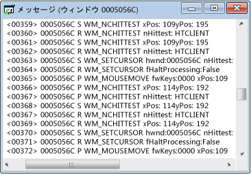

# Messages View
[!INCLUDE[vs2017banner](../code-quality/includes/vs2017banner.md)]

各ウィンドウには、関連のメッセージ ストリームがあります。  メッセージ ビュー ウィンドウには、このメッセージ ストリームが表示されます。  表示されるのは、ウィンドウ ハンドル、メッセージ コード、およびメッセージです。  スレッドやプロセス用のメッセージ ビューも同様に作成できます。  このメッセージ ビューでは、特定のプロセスまたはスレッドが所有するすべてのウィンドウに送信されるメッセージを表示でき、ウィンドウの初期化メッセージをキャプチャする際に特に役立ちます。  
  
 通常のメッセージ ビュー ウィンドウを以下に示します。  最初の列にはウィンドウ ハンドルが表示され、2 番目の列にはメッセージ コードが表示されています \(「[メッセージ コード](../debugger/message-codes.md)」を参照\)。  デコードされたメッセージ パラメーターと戻り値は右側に表示されます。  
  
   
Spy\+\+ メッセージ ビュー  
  
## 手順  
  
#### ウィンドウ、プロセス、またはスレッドのメッセージ ビューを開くには  
  
1.  [ウィンドウ ビュー](../debugger/windows-view.md)、[プロセス ビュー](../debugger/processes-view.md)、[スレッド ビュー](../debugger/threads-view.md)のいずれかのウィンドウにフォーカスを移動します。  
  
2.  メッセージを調べる項目のノードを探し、選択します。  
  
3.  \[スパイ\] メニューの \[メッセージのログ出力\] をクリックします。  
  
     [&#91;メッセージ オプション&#93; ダイアログ ボックス](../debugger/message-options-dialog-box.md)が開きます。  
  
4.  表示するメッセージのオプションを選択します。  
  
5.  \[OK\] をクリックし、メッセージのログ出力を開始します。  
  
     メッセージ ビュー ウィンドウが開き、\[メッセージ\] メニューが Spy\+\+ ツール バーに追加されます。  選択したオプションに応じて、アクティブなメッセージ ビュー ウィンドウへのメッセージのストリーミングが開始されます。  
  
6.  十分なメッセージが出力されたら、\[メッセージ\] メニューの \[ログ終了\] をクリックします。  
  
## このセクションの内容  
 [メッセージ ビューの制御](../debugger/how-to-control-messages-view.md)  
 メッセージ ビューの管理方法について説明します。  
  
 [&#91;ウィンドウ検索&#93; からメッセージ ビューを開く](_asug_choosing_message_options)  
 \[ウィンドウ検索\] ダイアログ ボックスからメッセージ ビューを開く方法について説明します。  
  
 [メッセージ ビューでのメッセージの検索](../Topic/How%20to:%20Search%20for%20a%20Message%20in%20Messages%20View.md)  
 メッセージ ビューで特定のメッセージを検索する方法について説明します。  
  
 [メッセージ ログの表示の開始と終了](../debugger/how-to-start-and-stop-the-message-log-display.md)  
 メッセージのログ出力の開始方法と終了方法について説明します。  
  
 [メッセージ コード](../debugger/message-codes.md)  
 メッセージ ビューに一覧表示されるメッセージのコードを定義します。  
  
 [メッセージ プロパティの表示](../debugger/how-to-display-message-properties.md)  
 メッセージの詳細情報を表示する方法について説明します。  
  
## 関連項目  
 [Spy\+\+ ビュー](../debugger/spy-increment-views.md)  
 ウィンドウ、メッセージ、プロセス、およびスレッドの Spy\+\+ ツリー ビューについて説明します。  
  
 [Spy\+\+ の使用](../debugger/using-spy-increment.md)  
 Spy\+\+ ツールとその使用方法について説明します。  
  
 [&#91;メッセージ オプション&#93; ダイアログ ボックス](../debugger/message-options-dialog-box.md)  
 アクティブなメッセージ ビューに一覧表示するメッセージを選択するために使用します。  
  
 [&#91;メッセージ検索&#93; ダイアログ ボックス](../debugger/message-search-dialog-box.md)  
 メッセージ ビューで特定のメッセージのノードを検索するために使用します。  
  
 [&#91;メッセージ プロパティ&#93; ダイアログ ボックス](../debugger/message-properties-dialog-box.md)  
 メッセージ ビューで選択したメッセージのプロパティを表示するために使用します。  
  
 [Spy\+\+ リファレンス](../debugger/spy-increment-reference.md)  
 Spy\+\+ の各メニューとダイアログ ボックスについて説明するセクションが含まれます。