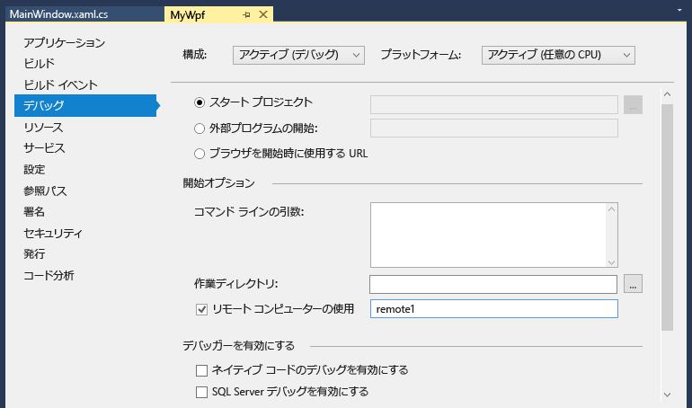

# リモート Visual Studio で c# または Visual Basic プロジェクトのデバッグ
別のコンピューターに展開されている Visual Studio アプリケーションをデバッグするには、インストールし、アプリをデプロイしたコンピューターでリモート ツールを実行、Visual Studio からリモート コンピューターに接続するプロジェクトを構成し、アプリを実行します。

  
リモート デバッグのユニバーサル Windows アプリ (UWP) の詳細については、次を参照してください。[インストール済みのアプリ パッケージをデバッグ](debug-installed-app-package.md)します。

## 要件

リモート デバッガーは Windows 7 でサポートされている以降 (phone ではありません) と Windows Server の Windows Server 2008 Service Pack 2 以降のバージョン。 要件の完全な一覧を参照してください。[要件](../debugger/remote-debugging.md#requirements_msvsmon)します。

> [!NOTE]
> プロキシを介して接続されている 2 台のコンピューター間でのデバッグはサポートされていません。 国の間での高待機時間またはダイヤルアップ、インターネットなどの低帯域幅接続経由またはインターネット経由でのデバッグは使用しないでと失敗は、ある非常に遅く。
  
## ダウンロードして、リモート ツールのインストール

[!INCLUDE [remote-debugger-download](../debugger/includes/remote-debugger-download.md)]

> [!TIP]
> 一部のシナリオでは、ファイル共有からリモート デバッガーを実行する最も効率的なができます。 詳細については、次を参照してください。[ファイル共有からリモート デバッガーを実行](../debugger/remote-debugging.md#fileshare_msvsmon)します。
  
##  リモート デバッガーを設定します。

[!INCLUDE [remote-debugger-configuration](../debugger/includes/remote-debugger-configuration.md)]

> [!NOTE]
> 必要がある追加のユーザーのアクセス許可を追加または変更した場合、認証モード、リモート デバッガーのポート番号を参照してください。[リモート デバッガーを構成する](../debugger/remote-debugging.md#configure_msvsmon)します。
  
##  プロジェクトのリモート デバッグ
デバッガーでは、Visual C# または Visual Basic のデスクトップ アプリケーションをリモート コンピューターに配置できませんが、次のようにリモートからそれらのデスクトップ アプリケーションをデバッグすることはできます。 次の手順では、という名前のコンピューターでデバッグする場合を前提と**MJO DL**の次の図に示すようにします。
  
1.  という名前の WPF プロジェクトの作成**MyWpf**します。  
  
2.  ブレークポイントをコード内の達しやすい任意の箇所に設定します。  
  
     たとえば、ブレークポイントをボタン ハンドラーに設定できます。 これを行うには、MainWindow.xaml をし、ツールボックスからボタン コントロールを追加のハンドラーを開く ボタンをダブルクリックします。
  
3.  ソリューション エクスプ ローラーでプロジェクトを右クリックし、選択**プロパティ**します。  
  
4.  **プロパティ**ページで、選択、**デバッグ**タブ。  
  
       
  
5.  確認、**作業ディレクトリ**テキスト ボックスが空です。  
  
6.  選択**リモート コンピューターの使用**、および種類**MJO-DL:4022**テキスト ボックスにします。 (4022 は、リモート デバッガー ウィンドウに表示されるポート番号です。 ポート番号をインクリメントで Visual Studio の各バージョン 2)。
  
7.  必ず**ネイティブ コードのデバッグを有効にする**が選択されていません。  
  
8.  プロジェクトをビルドします。  
  
9. 同じパスであるリモート コンピューター上のフォルダーを作成、**デバッグ**Visual Studio コンピューター上のフォルダー: **\<ソース パス > \MyWPF\MyWPF\bin\Debug**します。  
  
10. 上で作成した実行可能ファイルを、Visual Studio コンピューターから、リモート コンピューター上の新しく作成したフォルダーにコピーします。
  
    > [!CAUTION]
    >  コードまたは再構築に変更しないでください (または、この手順を繰り返す必要があります)。 リモート コンピューターにコピーした実行可能ファイルは、ローカルのソースとシンボルに正確に一致している必要があります。

    プロジェクトを手動でコピー、Xcopy、Robocopy、Powershell、またはその他のオプションを使用できます。
  
11. リモート デバッガーが、ターゲット コンピューターで実行されていることを確認 (そうでない場合は検索**リモート デバッガー**で、**開始**メニュー)。 次のようなリモート デバッガー ウィンドウが表示されます。  
  
       
  
12. Visual Studio でデバッグを開始 (**デバッグ > [デバッグ開始]**、または**F5**)。  
  
13. メッセージが表示されたら、リモート マシンに接続するネットワーク資格情報を入力します。  
  
     必要な資格情報は、ネットワークのセキュリティ構成によって異なります。 たとえば、ドメインのコンピューターで、ドメイン名とパスワードを入力できます。 非ドメイン コンピューターで、可能性がありますを入力する、マシン名と有効なユーザー アカウント名では、このような**MJO-DL\name@something.com**、正しいパスワードと共にします。

     WPF アプリケーションのメイン ウィンドウが、リモート コンピューター上で開かれていることがわかります。
  
14. 必要に応じては、ブレークポイントにヒットするアクションを実行します。 ブレークポイントがアクティブになっていることを確認できるはずです。 いない場合は、アプリケーションのシンボルが読み込まれていません。 Retry、およびシンボルの読み込みについての情報を取得しでそれらのトラブルシューティング方法がうまくいかない場合[Understanding シンボル ファイルおよび Visual Studio のシンボルの設定](https://blogs.msdn.microsoft.com/devops/2015/01/05/understanding-symbol-files-and-visual-studios-symbol-settings/)します。
  
15. Visual Studio コンピューターで、実行がブレークポイントで停止したことを確認できるはずです。
  
 アプリケーションで使用する必要があるすべての非コード ファイルがある場合は、Visual Studio プロジェクトに追加する必要があります。 追加ファイル用のプロジェクト フォルダーの作成 (で、**ソリューション エクスプ ローラー**、 をクリックして**追加 > 新しいフォルダー**)。 フォルダーにファイルを追加して (で、**ソリューション エクスプ ローラー**、] をクリックして**追加 > [既存項目の**のファイルを選択します)。 **プロパティ**ファイルごとに ページで、設定**出力ディレクトリにコピー**に**常にコピー**します。

## リモート シンボルを使用したデバッグのセットアップ 

[!INCLUDE [remote-debugger-symbols](../debugger/includes/remote-debugger-symbols.md)]  
  
## 関連項目  
 [Visual Studio でのデバッグ](../debugger/index.md)  
 [デバッガー機能ツアー](../debugger/debugger-feature-tour.md)   
 [リモート デバッグ用の Windows ファイアウォールを構成します。](../debugger/configure-the-windows-firewall-for-remote-debugging.md)   
 [リモート デバッガーのポートの割り当て](../debugger/remote-debugger-port-assignments.md)   
 [リモートの IIS コンピューター上の ASP.NET のリモート デバッグ](../debugger/remote-debugging-aspnet-on-a-remote-iis-computer.md)  
 [リモート デバッグ エラーとトラブルシューティング](../debugger/remote-debugging-errors-and-troubleshooting.md)