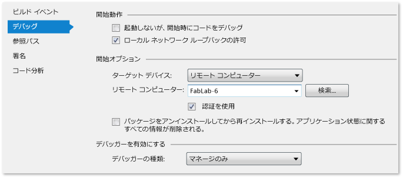

# リモート コンピューターでの UWP アプリを実行します。
  
  
UWP アプリをリモート コンピューターでを実行するには、Visual Studio リモート ツールを使用してにアタッチする必要があります。 リモート ツールを使用すると、実行、デバッグ、プロファイル、および Visual Studio を実行している 2 つ目のコンピューターから 1 つのデバイスで実行されている UWP アプリをテストできます。 リモート デバイスで実行されていることが効果的である特に、Visual Studio コンピューターがタッチ、位置情報、物理的な方向など、UWP アプリに固有の機能をサポートしていない場合。 このトピックでは、リモート セッションを構成および開始する手順について説明します。

一部のシナリオでリモート ツールはリモート デバイスに展開するときに自動的にインストールされます。

- 作成者更新およびそれ以降のバージョンを実行している Windows 10 Pc を参照してください。[インストール済みのアプリ パッケージをデバッグ](debug-installed-app-package.md#remote)です。 リモート ツールは自動的にインストールされます。
- Windows 10 Xbox、IOT、HoloLens デバイスでは、次を参照してください。[インストール済みのアプリ パッケージをデバッグ](debug-installed-app-package.md#remote)です。 リモート ツールは自動的にインストールされます。
- Windows Phone の電話に物理的に接続している、インストールする必要があります、[開発者ライセンス](https://msdn.microsoft.com/en-us/library/windows/apps/xaml/hh974578.aspx)(Windows Phone 8 および 8.1) を有効にまたは[開発者モード](/windows/uwp/get-started/enable-your-device-for-development)(Windows Mobile 10) する必要があります選択**デバイス**デバッグ ターゲットとして。 リモート ツールがないために必要なか、サポート。

Windows 8.1 Pc および Windows の事前作成元の更新プログラムのバージョンを実行している Windows 10 Pc では、必要がありますリモート ツール リモート コンピューターに手動でインストールするをデバッグする前にします。 このトピックの手順に従います。
  
##   必要条件  
 リモート デバイスでデバッグするには:  
  
-   リモート デバイスと Visual Studio コンピューターがネットワークを介して接続されている、またはイーサネット ケーブルによって直接接続されている必要があります。 インターネットを介したデバッグはサポートされません。  

- 開発用のリモート デバイスを有効にする必要があります。

    - Windows 8 および Windows 8.1 のデバイスの場合、[開発者ライセンス](https://msdn.microsoft.com/en-us/library/windows/apps/xaml/hh974578.aspx)リモート デバイスにインストールする必要があります。
    - Windows 10 デバイスの必要がありますを有効にした[開発者モード](/windows/uwp/get-started/enable-your-device-for-development)です。 
  
-   Windows 10 pc の Windows 10 の作成者の更新プログラムよりも前のバージョンの Windows 10 を実行している場合に、インストールして、リモート デバッグ コンポーネントを実行する必要があります。
  
-   インストール中にファイアウォールを構成するために、リモート デバイスの管理者である必要があります。 リモート デバッガーを実行するかリモート デバッガーに接続するために、リモート デバイスへのユーザー アクセスが必要です。  
  
##   セキュリティ  
 既定では、リモート デバッガーは Windows 認証を使用します。  
  
> [!WARNING]
>  リモート デバッガーを認証なしモードで実行することも選択できますが、このモードの使用は避けることを強く推奨します。 このモードで実行した場合、ネットワーク セキュリティはまったく提供されません。 認証なしモードは、ネットワークに悪意のあるコードや悪意のあるトラフィックのリスクがないことが確実である場合のみ選択してください。  
  
##   リモート デバイスに接続する方法  
 リモート デバイスに直接接続するには、標準イーサネット ケーブルを使用して Visual Studio コンピューターをデバイスに接続します。 デバイスにイーサネット ポートがない場合は、USB イーサネット アダプターを使用してケーブルを接続できます。  
  
## ダウンロードして、リモート ツールのインストール

[!INCLUDE [remote-debugger-download](../debugger/includes/remote-debugger-download.md)]
  
## リモート デバッガーを設定します。

[!INCLUDE [remote-debugger-configuration](../debugger/includes/remote-debugger-configuration.md)]
  
##   リモート デバッグ用の Visual Studio プロジェクトの構成  
 プロジェクトのプロパティに、接続するリモート デバイスを指定します。 手順はプログラミング言語によって異なります。 リモート デバイスのネットワーク名を入力するか、[リモート デバッガー接続の選択] ダイアログ ボックスで選択できます。  
  
 ![[リモート デバッガー接続] ダイアログ ボックス](../debugger/media/vsrun_selectremotedebuggerdlg.png "VSRUN_SelectRemoteDebuggerDlg")  
  
 ダイアログ ボックスには、Visual Studio コンピューターのローカル サブネット上にあるデバイスで、リモート デバッガーを実行中のデバイスだけが表示されます。  
  
> [!TIP]
>  リモート デバイスへの接続に問題がある場合は、デバイスの IP アドレスを入力してください。 デバイスの IP アドレスを確認するには、コマンド ウィンドウを開き、「 **ipconfig**」と入力します。 IP アドレスは **IPv4 Address**として表示されます。  
  
###   C# プロジェクトと Visual Basic プロジェクト用のリモート デバイスの選択  
   
  
1.  ソリューション エクスプローラーでプロジェクト名を選択し、ショートカット メニューの **[プロパティ]** をクリックします。  
  
2.  **[デバッグ]**をクリックします。  
  
3.  **[ターゲット デバイス]** ボックスの一覧の **[リモート コンピューター]** をクリックします。  
  
4.  リモート デバイスのネットワーク名を **[リモート コンピューター]** ボックスに入力するか、 **[検索]** を選び、 **[リモート デバッガー接続の選択]** ダイアログ ボックスでデバイスを選択します。  
  
###   JavaScript プロジェクトと C++ プロジェクト用のリモート デバイスの選択  
   
  
1.  ソリューション エクスプローラーでプロジェクト名を選択し、ショートカット メニューの **[プロパティ]** をクリックします。  
  
2.  **[構成プロパティ]** ノードを展開し、 **[デバッグ]**をクリックします。  
  
3.  **[起動するデバッガー]** ボックスの一覧の **[リモート デバッガー]** をクリックします。  
  
4.  リモート デバイスのネットワーク名を **[コンピューター名]** ボックスに入力するか、ボックスの下向き矢印を選び、 **[リモート デバッガー接続の選択]** ダイアログ ボックスでデバイスを選択します。  
  
##   リモート デバッグ セッションの実行  
 リモート デバッグ セッションは、ローカル セッションと同じ方法で開始、停止、および移動します。 デバッグを開始する前に、リモート デバッグ モニターがリモート デバイスで実行されていることを確認します。  
  
 **[デバッグ]** メニューの **[デバッグの開始]** をクリックします (キーボードの場合: F5 キーを押します)。 プロジェクトが再コンパイルされた後、リモート デバイスに配置され、開始されます。 デバッガーはブレークポイントで実行を中断するので、その時点でコードをステップ イン、ステップ オーバー、およびステップ アウトできます。 デバッグ セッションを終了し、リモート アプリケーションを閉じるには、 **[デバッグの停止]** をクリックします。 詳細については、次を参照してください。 [Visual Studio でアプリのデバッグ](../debugger/debug-store-apps-in-visual-studio.md)です。  
  
## 関連項目  
 [Visual Studio での UWP アプリのテスト](../test/testing-store-apps-with-visual-studio.md)   
 [Visual Studio でアプリをデバッグします。](../debugger/debug-store-apps-in-visual-studio.md)