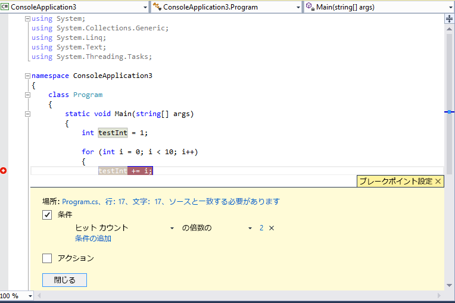

# <a name="use-breakpoints-in-the-visual-studio-debugger"></a>Visual Studio デバッガーでブレークポイントを使用します。
ブレークポイントは、開発者のツールボックスで最も重要なデバッグ手法の 1 つです。 デバッガーの実行を一時停止したい場所にブレークポイントを設定するとします。 たとえば、コードの変数の状態を参照してください。 または、特定のブレークポイントで呼び出し履歴を確認する可能性があります。 コードのデバッグを試みるのが今回初めてである場合は、この記事を先に進む前に[超初心者向けのデバッグ方法](../debugger/debugging-absolute-beginners.md)に関するページを参照することをお勧めします。
  
##  <a name="BKMK_Overview"></a> ソース コードにブレークポイントを設定  
 ブレークポイントは、実行可能ファイルの任意のコード行に設定できます。 などの次の c# コード、する可能性がありますにブレークポイントを設定変数の宣言、`for`ループ、または任意のコード内で、`for`ループします。 名前空間またはクラス宣言、またはメソッド シグネチャでは、ブレークポイントを設定できません。  

 ソース コードでブレークポイントを設定するには、コードの行の横にある左端の余白をクリックします。 キーを押して、行を選択することも**F9**を選択します**デバッグ** > **ブレークポイントの切り替え**、または右クリックし、選択**ブレークポイント** > **ブレークポイントの挿入**します。 左余白に赤い点として、ブレークポイントが表示されます。  
  
   
  
 デバッグすると、その行のコードが実行される前に、ブレークポイントで「実行が一時停止します。 ブレークポイント シンボルでは、黄色の矢印ボタンを示しています。 

 次の例の値内のブレークポイントで`testInt`1 のままです。  
  
   
  
 ブレークポイントでデバッガーが停止したら、変数の値と呼び出し履歴を含めて、アプリの現在の状態を確認できます。 呼び出し履歴の詳細については、次を参照してください。[方法: 呼び出し履歴 ウィンドウを使用して、](../debugger/how-to-use-the-call-stack-window.md)します。  

- ブレークポイント表示が切り替わります。 クリックして、キーを押してできます**F9**、使用または**デバッグ** > **ブレークポイントの切り替え**を削除または再挿入します。
  
- 削除しなくても、ブレークポイントを無効にポインターを合わせるかを右クリックして選択**ブレークポイントを無効にする**します。 左の余白に空の点として無効になっているブレークポイントが表示されます、または**ブレークポイント**ウィンドウ。 ブレークポイントを再度有効にするには、ポインターを合わせるかを右クリックして選択**ブレークポイントを有効にする**します。 
  
- 条件とアクションを設定、追加し、ラベルの編集またはを右クリックし、適切なコマンドを選択すると、上にポインターを合わせるとまたはを選択すると、ブレークポイントをエクスポート、**設定**アイコン。

##  <a name="BKMK_Set_a_breakpoint_in_a_function"></a> Windows デバッガーのブレークポイントを設定します。 

ブレークポイントを設定することも、**呼び出し履歴**と**逆アセンブル**デバッガー ウィンドウ。  
  
### <a name="BKMK_Set_a_breakpoint_in_the_call_stack_window"></a> 呼び出し履歴 ウィンドウでブレークポイントを設定します。  

 命令または呼び出し元の関数が返す行に改行をブレークポイントを設定することができます、**呼び出し履歴**ウィンドウ。 
  
**呼び出し履歴 ウィンドウでブレークポイントを設定します。**

1. 開くには、**呼び出し履歴**ウィンドウで、デバッグ中に一時停止する必要があります。 選択**デバッグ** > **Windows** > **呼び出し履歴**、またはキーを押します**Ctrl** + **Alt**+**C**します。  
   
2. **呼び出し履歴**ウィンドウでは、呼び出し元の関数を右クリックし、選択**ブレークポイント** > **ブレークポイントの挿入**、またはキーを押します**F9**.  
   
   呼び出し履歴の左端の余白内の関数呼び出し名の横にあるブレークポイント シンボルが表示されます。
   
呼び出し履歴のブレークポイントが表示されます、**ブレークポイント**関数内の次の実行可能命令に対応するメモリ位置に設定された、アドレスとしてウィンドウ。 

デバッガーは、命令で中断します。  

呼び出し履歴の詳細については、次を参照してください。[方法: 呼び出し履歴 ウィンドウを使用して、](../debugger/how-to-use-the-call-stack-window.md)します。 

視覚的にブレークポイントをトレースするコードが実行中に、次を参照してください。[デバッグ中に呼び出し履歴に対するメソッドのマップ](../debugger/map-methods-on-the-call-stack-while-debugging-in-visual-studio.md)します。 
  
### <a name="set-a-breakpoint-in-the-disassembly-window"></a>逆アセンブル ウィンドウでブレークポイントを設定します。  
   
1. 開くには、**逆アセンブル**ウィンドウで、デバッグ中に一時停止する必要があります。 選択**デバッグ** > **Windows** > **逆アセンブル**、またはキーを押します**Alt** + **8**します。  
   
2. **逆アセンブル** ウィンドウでブレークポイントを設定命令の左側の余白内をクリックします。 選択し、[できます**F9**、または右クリックし、選択**ブレークポイント** > **ブレークポイントの挿入]**。 

##  <a name="BKMK_Set_a_breakpoint_in_a_source_file"></a> 関数ブレークポイントを設定します。  

  関数が呼び出されたときに実行を中断することができます。 

**関数ブレークポイントを設定します。**
  
1. 選択**デバッグ** > **新しいブレークポイント** > **関数のブレークポイント**、またはキーを押します**Alt** +**F9** > **Ctrl**+**B**します。 
   
   選択することも**新規** > **関数のブレークポイント**で、**ブレークポイント**ウィンドウ。
   
1. **新しい関数のブレークポイント**ダイアログ ボックスで、関数名を入力、**関数名**ボックス。 

   関数の仕様を絞り込む。
   
   - 完全修飾関数名を使用します。 
     
     例:  `Namespace1.ClassX.MethodA()`
     
   - オーバー ロード関数のパラメーターの型を追加します。 
     
     例:  `MethodA(int, string)`
     
   - 使用して、'!' モジュールを指定する記号。
     
     例 : `App1.dll!MethodA`
     
   - ネイティブ C++ では、コンテキスト演算子を使用します。
     
     `{function, , [module]} [+<line offset from start of method>]`
     
     例 : `{MethodA, , App1.dll}+2`
   
1. **言語**ドロップダウンで、関数の言語を選択します。
   
1. **[OK]** を選択します。
  
### <a name="set-a-function-breakpoint-using-a-memory-address-native-c-only"></a>メモリ アドレス (ネイティブ C++ のみ) を使用して関数のブレークポイントを設定します。  
 オブジェクトのアドレスを使用して、クラスの特定のインスタンスによって呼び出されたメソッドに関数のブレークポイントを設定することができます。  たとえば、型のアドレス指定可能なオブジェクトを指定`my_class`で関数のブレークポイントを設定することができます、`my_method`メソッドの呼び出しをインスタンス化します。 
  
1.  クラスのインスタンスがインスタンス化された後にブレークポイントをどこかに設定します。  
    
2.  インスタンスのアドレスを検索 (たとえば、 `0xcccccccc`)。 
    
3.  選択**デバッグ** > **新しいブレークポイント** > **関数のブレークポイント**、またはキーを押します**Alt** +**F9** > **Ctrl**+**B**します。  
    
4.  次の追加、**関数名**ボックス、および選択**C++** 言語。  
    
    ```C++  
    ((my_class *) 0xcccccccc)->my_method  
    ```  

## <a name="BKMK_set_a_data_breakpoint_native_cplusplus_only"></a>データ ブレークポイントを設定する (ネイティブ C++ のみ) 
 
 データ ブレークポイントは、実行時に指定されたメモリ アドレスの変更に格納されている値を中断します。 値が読み取られても変更されていなければ、実行は中断されません。  
  
**データ ブレークポイントを設定します。**

1.  C++ プロジェクトでデバッグを開始し、ブレークポイントに到達するまで待機します。 **デバッグ**] メニューの [選択**新しいブレークポイント** > **データ ブレークポイント** 

    選択することも**新規** > **データ ブレークポイント**で、**ブレークポイント**ウィンドウ。
  
2.  **アドレス**ボックスに、メモリ アドレス、またはメモリ アドレスに評価される式を入力します。 たとえば、「 `&avar` 」と入力すると、変数 `avar` の値が変更されたときに中断します。  
  
3.  **[バイト数]** ドロップダウンで、デバッガーがウォッチするバイト数を選択します。 たとえば、 **[4]** を選択すると、 `&avar` で始まる 4 バイトがウォッチされ、そのバイト値のいずれかが変更されると中断します。  

データ ブレークポイントは、次の条件下で機能しません。  
-   デバッグ中でないプロセスは、メモリ位置に書き込みます。  
-   メモリの場所は、2 つ以上のプロセスで共有されます。  
-   メモリ位置がカーネル内で更新される場合 たとえば、32 ビット Windows にメモリが渡された`ReadFile`関数の場合、デバッガーが、更新プログラムを中断しないように、メモリはカーネル モードから更新されます。  

>[!NOTE]
>- データ ブレークポイントは、特定のメモリ アドレスに依存します。 変数のアドレスでは、次に 1 つのデバッグ セッションから変更データ ブレークポイントはデバッグ セッションが最後に自動的に無効にするようにします。  
>  
>- 関数の終了時にローカル変数にデータ ブレークポイントを設定した場合、ブレークポイントを有効のままメモリ アドレスのブレークポイントの動作は予測可能なので、該当するではなく。 ローカル変数にデータ ブレークポイントを設定した場合は、削除または、関数が終了する前にブレークポイントを無効にする必要があります。  

##  <a name="BKMK_Specify_advanced_properties_of_a_breakpoint_"></a> [ブレークポイント] ウィンドウでブレークポイントを管理します。 

 使用することができます、**ブレークポイント**ウィンドウを表示し、ソリューション内のすべてのブレークポイントを管理します。 この一元化された場所は、大規模なソリューションで、または複雑なデバッグ シナリオで、ブレークポイントが重要な場合に便利です。 

**ブレークポイント**ウィンドウで、することができますを検索、並べ替え、フィルター、有効/無効、またはブレークポイントを削除します。 条件とアクションを設定したり、新しい関数またはデータ ブレークポイントを追加できます。
  
開くには、**ブレークポイント**ウィンドウで、**デバッグ** > **Windows** > **ブレークポイント**、またはキーを押します**Alt**+**F9**または**Ctrl**+**Alt**+**B**します。
  
![[ブレークポイント] ウィンドウ](../debugger/media/breakpointswindow.png "[ブレークポイント] ウィンドウ")  
  
表示する列を選択する、**ブレークポイント**ウィンドウで、**列の表示**します。 ブレークポイントの一覧を並べ替える列の列ヘッダーを選択します。 

###  <a name="BKMK_Set_a_breakpoint_at_a_function_return_in_the_Call_Stack_window"></a> ブレークポイントのラベル  
並べ替えし、フィルター内のブレークポイントの一覧にラベルを使用することができます、**ブレークポイント**ウィンドウ。 

1. ブレークポイントにラベルを追加するには、ソース コード内のブレークポイントを右クリックし、または**ブレークポイント**ウィンドウで、クリックして**ラベルの編集**します。 新しいラベルを追加または既存のものを選択し、 **OK**します。
2. ブレークポイントの一覧を並べ替え、**ブレークポイント**ウィンドウを選択して、**ラベル**、**条件**、または他の列ヘッダー。 選択して表示する列を選択する**列の表示**ツールバー。 
  
### <a name="export-and-import-breakpoints"></a>ブレークポイントをエクスポートおよびインポートする  
 保存または共有の状態と、ブレークポイントの位置、エクスポートまたはインポートできます。 

- XML ファイルに単一のブレークポイントをエクスポートするには、ソース コード内のブレークポイントを右クリックしてまたは**ブレークポイント**ウィンドウ、および選択**エクスポート**または**選択されているエクスポート**します。 エクスポート先を選択し、**保存**します。 既定の場所は、ソリューション フォルダーです。 
- いくつかのブレークポイントをエクスポートする、**ブレークポイント**ウィンドウで、ブレークポイントの横にあるボックスをオンまたはで検索条件を入力、**検索**フィールド。 選択、**現在の検索条件に一致するすべてのブレークポイントをエクスポート**アイコン ファイルを保存します。 
- すべてのブレークポイントをエクスポートするをクリックし、すべてのボックスをオフのままに、**検索**フィールドを空白。 選択、**現在の検索条件に一致するすべてのブレークポイントをエクスポート**アイコン ファイルを保存します。  
- ブレークポイントをインポートする、**ブレークポイント**ウィンドウで、**ファイルからブレークポイントをインポート**アイコンは、XML ファイルの場所に移動して、選択**オープン**。 

##  <a name="breakpoint-conditions"></a>ブレークポイント条件  
 条件を設定して、ブレークポイントを実行するタイミングと場所を制御することができます。 条件には、デバッガーによって認識される有効な式を指定できます。 有効な式の詳細については、次を参照してください。[デバッガーで式](../debugger/expressions-in-the-debugger.md)します。  

**ブレークポイントの条件を設定するには。**

1. ブレークポイント シンボルを右クリックして**条件**します。 またはブレークポイント シンボルでは、選択をポイントし、**設定**アイコンをクリックして**条件**で、**ブレークポイントの設定**ウィンドウ。  

   条件を設定することもできます、**ブレークポイント**ブレークポイントを右クリックしてウィンドウ**設定**を選択し、**条件**します。 
  
     
  
2. ドロップダウンで、次のように選択します。**条件式**、**ヒット カウント**、または**フィルター**、し、値を設定します。 
  
3. 選択**閉じます**またはキーを押します**Ctrl**+**」と入力**を閉じる、**ブレークポイントの設定**ウィンドウ。 またはから、**ブレークポイント**ウィンドウで、 **OK**ダイアログ ボックスを閉じます。 

条件セットでのブレークポイントが表示されます、 **+** ソース コードでシンボルと**ブレークポイント**windows。 

<a name="BKMK_Specify_a_breakpoint_condition_using_a_code_expression"></a>
### <a name="conditional-expression"></a>条件式

選択すると**条件式**、2 つの条件から選択できます:**は**または**変更されたときに**します。 選択**は**式が満たされているときにブレークするまたは**変更されたときに**式の値が変更されたときに中断します。  
  
 次の例では、ブレークポイントがヒットした場合にのみ、値の`testInt`は**4**:  
  
   
  
 次の例では、ブレークポイントがヒットした場合にのみ、値の`testInt`変更。  
  
   
  
 無効な構文でブレークポイント条件を設定すると、警告メッセージが表示されます。 有効な構文でブレークポイント条件を指定しても、セマンティクスが無効な場合は、ブレークポイントに初めて達したときに警告メッセージが表示されます。 どちらの場合、デバッガーには、無効なブレークポイントにヒットした際が中断されます。 ブレークポイント条件が有効で、評価結果が `false`の場合にのみ、ブレークポイントはスキップされます。  
  
 >[!NOTE]
 >動作、**変更されたときに**フィールドは、さまざまなプログラミング言語によって異なります。 
 >- ネイティブ コードは、デバッガーは最初の評価でブレークポイントにヒットしないように変更する条件の最初の評価を考慮しません。 
 >- マネージ コード用デバッガーが後の最初の評価でブレークポイントに到達**変更されたときに**が選択されています。  
  
### <a name="using-object-ids-in-conditional-expressions-c-and-f-only"></a>条件式でオブジェクト Id の使用 (C#とF#のみ)  
 特定のオブジェクトの動作を確認したい場合もあります。 たとえば、理由、オブジェクトがコレクションに複数回挿入されたことを確認します。 C#とF#、オブジェクト Id の特定のインスタンスを作成する[参照型](/dotnet/csharp/language-reference/keywords/reference-types)、し、ブレークポイントの条件で使用します。 オブジェクト ID は、共通言語ランタイム (CLR) のデバッグ サービスで生成されて、オブジェクトに関連付けられます。  

**オブジェクト ID を作成します。** 
  
1. ブレークポイントを設定、コードの場所、オブジェクトが作成された後です。  
   
2. デバッグを開始し、実行がブレークポイントで一時停止したときに選択**デバッグ** > **Windows** > **ローカル**または**Alt**+ **4**を開く、**ローカル**ウィンドウ。
   
   内のブレークポイントを検索、**ローカル**ウィンドウで、右クリックし、選択**オブジェクト ID の作成**です。  
   
   **$** ウィンドウに、 **[ローカル]** ウィンドウを閉じます。 これが、オブジェクト ID です。  
   
3. を調査する時点で新しいブレークポイントを追加します。オブジェクトがコレクションに追加する場合など、表示します。 ブレークポイントを右クリックして**条件**します。  
   
4. オブジェクト ID を使用して、**条件式**フィールド。 たとえば場合、変数`item`、コレクションに追加するオブジェクトは、**が true**と種類**item $ = =\<n >** ここで、 \<n > オブジェクト ID 番号です.  
   
   そのオブジェクトがコレクションに追加されると、実行が停止します。  
   
   オブジェクト ID を削除する変数を右クリックし、**ローカル**ウィンドウと選択**オブジェクト ID の削除**します。  

>[!NOTE]
>オブジェクト ID による参照は弱参照であり、これによって、オブジェクトがガベージ コレクションの対象から外れることはありません。 オブジェクト ID は、現在のデバッグ セッションでのみ有効です。  
  
### <a name="hit-count"></a>ヒット カウント  
 コード内のループが反復回数後に誤動作を開始すると思われる場合は、その数を繰り返し押しますせずに、ヒット数の後の実行を停止するブレークポイントを設定できます**F5**そのイテレーションに到達します。  
  
 **条件**で、**ブレークポイントの設定**ウィンドウで、**ヒット カウント**、し、イテレーションの数を指定します。 次の例では、その他の反復のたびにヒットするブレークポイントが設定します。  
  
   
  
### <a name="filter"></a>フィルター  
指定されたデバイスでのみ、または指定されたプロセスとスレッドでのみ、ブレークポイントが発生するように制限できます。  
  
**条件**で、**ブレークポイントの設定**ウィンドウで、**フィルター**、次の式の 1 つ以上を入力します。  
  
-   MachineName = "name"  
-   ProcessId = value  
-   ProcessName = "name"  
-   ThreadId = value  
-   ThreadName = "name"  

文字列の値を二重引用符で囲みます。 句は、 `&` (AND)、 `||` (OR)、 `!` (NOT)、およびかっこを使用して結合できます。  
  
##  <a name="BKMK_Print_to_the_Output_window_with_tracepoints"></a> ブレークポイント アクションとトレース ポイント  
 A*トレース ポイント*メッセージを出力するブレークポイントです、**出力**ウィンドウ。 トレースポイントはプログラミング言語の一時的なトレース ステートメントのように機能できます。  
  
**トレース ポイントを設定します。**

1. ブレークポイントを右クリックして**アクション**します。 または、**ブレークポイントの設定**ウィンドウで、ブレークポイントをポイントし、選択、**設定**アイコンをクリックして**アクション**します。  
   
1. メッセージを入力して、**メッセージ出力ウィンドウを記録する**フィールド。 メッセージは、汎用テキストの文字列、変数や、中かっこと書式指定子で囲まれた式の値を含めることができます ([c#](../debugger/format-specifiers-in-csharp.md)と[C++](../debugger/format-specifiers-in-cpp.md)) の値。
   
   メッセージに次の特別なキーワードを使用することもできます。  
   
   - **$ADDRESS** -現在の命令  
   - **$CALLER** -関数名の呼び出し  
   - **$CALLSTACK** -呼び出し履歴 
   - **$FUNCTION** -現在の関数名  
   - **$PID** -プロセス id  
   - **$PNAME** -プロセス名  
   - **$TID** -スレッド id  
   - **$TNAME** -スレッド名  
   - **$TICK** -のティック数 (Windows から`GetTickCount`)  
   
1. メッセージを印刷する、**出力**せず重大で、ウィンドウ、**続けて実行**チェック ボックスをオンします。 トレース ポイントにあるメッセージと中断の実行を印刷するには、チェック ボックスをオフにします。 

トレース ポイントがソース コードの左余白に赤い菱形で表示および**ブレークポイント**windows。 
  
## <a name="see-also"></a>関連項目  
 [何をデバッグするとしますか。](../debugger/what-is-debugging.md)  
 [優れたC#Visual Studio を使用するコード](../debugger/write-better-code-with-visual-studio.md)  
 [デバッグの概要](../debugger/debugger-feature-tour.md)  
 [Visual Studio デバッガーでブレークポイントをトラブルシューティングします。](../debugger/troubleshooting-breakpoints.md)  
