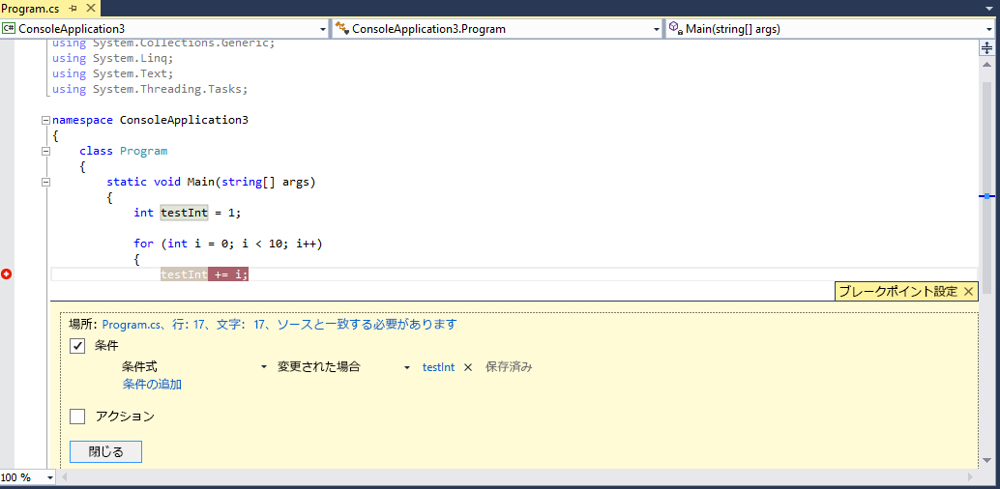

# <a name="use-breakpoints-in-the-visual-studio-debugger"></a>Visual Studio デバッガーでブレークポイントを使用する

ブレークポイントは、開発者が利用できる重要なデバッグ手法の 1 つです。 デバッガーの実行を一時停止したい任意の場所に、ブレークポイントを設定します。 たとえば、特定のブレークポイントで、コードの変数の状態を確認したり、呼び出し履歴を調べたりすることができます。  ブレークポイントを使用して警告または問題を解決しようとしている場合は、「[Visual Studio デバッガーでのブレークポイントのトラブルシューティング](../debugger/troubleshooting-breakpoints.md)」を参照してください。

> [!NOTE]
> 解決しようとしているタスクまたは問題はわかっていても、使用するブレークポイントの種類を知る必要がある場合は、「[デバッグ タスクの検索](../debugger/find-your-debugging-task.md#pause-running-code)」を参照してください。

## <a name="set-breakpoints-in-source-code"></a><a name="BKMK_Overview"></a> ソース コードにブレークポイントを設定する

ブレークポイントは、実行可能ファイルの任意のコード行に設定できます。 たとえば、次の C# コードでは、変数宣言、`for` ループ、または `for` ループ内の任意のコードにブレークポイントを設定できます。 名前空間やクラス宣言、またはメソッドのシグネチャには、ブレークポイントを設定できません。

ソース コードでブレークポイントを設定するには、コード行の左端の余白をクリックします。 行を選択して、**F9** キーを押すか、 **[デバッグ]**  >  **[ブレークポイントの設定/解除]** を選択するか、右クリックして **[ブレークポイント]**  >  **[ブレークポイントの挿入]** を選択することもできます。 左側の余白にブレークポイントが赤い点で表示されます。

C# を含むほとんどの言語では、ブレークポイントと現在の実行行が自動的に強調表示されます。 C++ コードの場合、 **[ツール]** (または **[デバッグ]** ) > **[オプション]**  >  **[デバッグ]**  >   **[ブレークポイントおよび現在のステートメントのソース行全体を強調表示する (C++ のみ)]** を選択することで、ブレークポイントと現在行の強調表示をオンにできます。


デバッグ時には、ブレークポイントで、その行のコードが実行される前に、実行が一時停止されます。 ブレークポイントの記号に黄色い矢印が表示されます。

次の例のブレークポイントでは、`testInt` の値はまだ 1 です。 つまり、黄色のステートメントはまだ実行されていないため、変数の値は初期化された状態(値 1 に設定) から変わっていません。


デバッガーがブレークポイントで停止すると、[変数の値](../debugger/debugger-feature-tour.md#inspect-variables-with-data-tips)や[呼び出し履歴](../debugger/how-to-use-the-call-stack-window.md)など、アプリの現在の状態を確認できます。

ここでは、ブレークポイントを操作するための一般的な手順について説明します。

- ブレークポイントはトグルです。 ブレークポイントをクリックするか、**F9** キーを押すか、 **[デバッグ]**  >  **[ブレークポイントの設定/解除]** を使用して、削除または再挿入することができます。

- ブレークポイントを削除せずに無効にするには、ブレークポイントをポイントするか右クリックして、 **[ブレークポイントを無効にする]** を選択します。 左側の余白または **[ブレークポイント]** ウィンドウでは、無効なブレークポイントは中空のドットとして表示されます。 ブレークポイントを再び有効にするには、ブレークポイントをポイントするか右クリックして、 **[ブレークポイントを有効にする]** を選択します。

- 条件とアクションの設定、ラベルの追加と編集、またはブレークポイントのエクスポートを行うには、右クリックして適切なコマンドを選択するか、ブレークポイントをポイントして **[設定]** アイコンを選択します。

## <a name="breakpoint-actions-and-tracepoints"></a><a name="BKMK_Print_to_the_Output_window_with_tracepoints"></a>ブレークポイント アクションとトレースポイント

*トレースポイント*は、 **[出力]** ウィンドウにメッセージを出力するブレークポイントです。 トレースポイントはプログラミング言語の一時的なトレース ステートメントのように機能し、コードの実行が一時停止されることはありません。 トレースポイントを作成するには、 **[ブレークポイント設定]** ウィンドウで特別なアクションを設定します。 詳細な手順については、[Visual Studio デバッガーでのトレースポイントの使用](../debugger/using-tracepoints.md)に関するページを参照してください。

## <a name="breakpoint-conditions"></a>ブレークポイント条件

条件を設定して、ブレークポイントを実行するタイミングと場所を制御することができます。 条件には、デバッガーによって認識される有効な式を指定できます。 有効な式の詳細については、[デバッガー内の式](../debugger/expressions-in-the-debugger.md)に関するページを参照してください。

**ブレークポイント条件を設定するには:**

1. ブレークポイントの記号を右クリックし、 **[条件]** を選択します。 または、ブレークポイントの記号をポイントして **[設定]** アイコンを選択し、 **[ブレークポイント設定]** ウィンドウで **[条件]** を選択します。

   また、 **[ブレークポイント]** ウィンドウでブレークポイントを右クリックして **[設定]** を選択し、 **[条件]** を選択することで、条件を設定することもできます。

   

2. ドロップダウンで **[条件式]** 、 **[ヒット カウント]** 、または **[フィルター]** を選択し、それぞれに応じた値を設定します。

3. **[閉じる]** を選択するか、**Ctrl** + **Enter** キーを押して、 **[ブレークポイント設定]** ウィンドウを閉じます。 または、 **[ブレークポイント]** ウィンドウで、 **[OK]** を選択してダイアログを閉じます。

ソース コードと **[ブレークポイント]** ウィンドウでは、条件が設定されているブレークポイントには **+** 記号が表示されます。

<a name="BKMK_Specify_a_breakpoint_condition_using_a_code_expression"></a>
### <a name="create-a-conditional-expression"></a>条件式を作成する

**[条件式]** を選択するときは、次の 2 つの条件のいずれかを選択できます: **[true の場合]** または **[変更された場合]** 。 式の条件を満たす場合に中断するときは **[true の場合]** をオンにし、式の値が変更されたときに中断するときは **[変更された場合]** をオンにします。

次の例では、`testInt` の値が **4** の場合にのみ、ブレークポイントがヒットするように設定します。


次の例では、`testInt` の値が変更された場合にのみ、ブレークポイントはヒットします。



無効な構文でブレークポイント条件を設定すると、警告メッセージが表示されます。 有効な構文でブレークポイント条件を指定しても、セマンティクスが無効な場合は、ブレークポイントに初めて達したときに警告メッセージが表示されます。 どちらの場合でも、デバッガーは無効なブレークポイントにヒットすると中断されます。 ブレークポイント条件が有効で、評価結果が `false`の場合にのみ、ブレークポイントはスキップされます。

>[!NOTE]
>**[変更された場合]** フィールドの動作は、プログラミング言語によって異なります。
>- ネイティブ コードの場合、デバッガーでは条件の最初の評価が変更と見なされないため、最初の評価ではブレークポイントにヒットしません。
>- マネージド コードの場合、デバッガーでは、 **[変更された場合]** がオンにされた後の最初の評価で、ブレークポイントにヒットします。

<a name="using-object-ids-in-breakpoint-conditions-c-and-f"></a>
### <a name="use-object-ids-in-conditional-expressions-c-and-f-only"></a>条件式で オブジェクト ID を使用する (C#、F# のみ)

 特定のオブジェクトの動作を観察しなければならないことがあります。 たとえば、オブジェクトがコレクションに複数回挿入された理由を確認するような場合です。 C# と F# では、[参照型](/dotnet/csharp/language-reference/keywords/reference-types) の特定のインスタンスにオブジェクト ID を作成し、それらの ID をブレークポイントの条件で使用できます。 オブジェクト ID は、共通言語ランタイム (CLR) のデバッグ サービスで生成されて、オブジェクトに関連付けられます。

**オブジェクト ID を作成するには:**

1. コードで、オブジェクトが作成された後のどこかにブレークポイントを設定します。

2. デバッグを開始し、ブレークポイントで実行が停止したら、 **[デバッグ]**  >  **[ウィンドウ]**  >  **[ローカル]** を選択するか、**Alt** + **4** キーを押して、 **[ローカル]** ウィンドウを開きます。

   **[ローカル]** ウィンドウで特定のオブジェクト インスタンスを探し、右クリックして、 **[オブジェクト ID の作成]** を選択します。

   **$** ウィンドウに、 **[ローカル]** ウィンドウを閉じます。 これが、オブジェクト ID です。

3. オブジェクトがコレクションに追加されるときなど、調査が必要となるポイントに、新しいブレークポイントを追加します。 ブレークポイントを右クリックし、 **[条件]** を選択します。

4. **[条件式]** フィールドでは、オブジェクト ID を使用します。 たとえば、変数 `item` がコレクションに追加するオブジェクトである場合、 **[true の場合]** を選択し、「**item == $\<n>** 」と入力します。\<n> はオブジェクト ID 番号です。

   そのオブジェクトがコレクションに追加されると、実行が停止します。

   オブジェクト ID を削除する場合は、 **[ローカル]** ウィンドウで変数を右クリックして、 **[オブジェクト ID の削除]** を選択します。

> [!NOTE]
> オブジェクト ID による参照は弱参照であり、これによって、オブジェクトがガベージ コレクションの対象から外れることはありません。 オブジェクト ID は、現在のデバッグ セッションでのみ有効です。

### <a name="set-a-hit-count-condition"></a>ヒット カウントの条件を設定する

コード内のループがある回数の反復の後に誤動作を開始することが疑われる場合、そのヒット カウントを超えると実行を停止するブレークポイントを設定できます。これにより、目的の反復回数に達するまで何度も **F5** キーを押す必要がなくなります。

**[ブレークポイント設定]** ウィンドウの **[条件]** で **[ヒット カウント]** を選択し、反復回数を指定します。 次の例では、反復ごとにヒットするようにブレークポイントを設定します。


### <a name="set-a-filter-condition"></a>フィルター条件を設定する

指定されたデバイスでのみ、または指定されたプロセスとスレッドでのみ、ブレークポイントが発生するように制限できます。

**[ブレークポイント設定]** ウィンドウの **[条件]** で **[フィルター]** を選択し、次の式の 1 つまたは複数を入力します。

- MachineName = "name"
- ProcessId = value
- ProcessName = "name"
- ThreadId = value
- ThreadName = "name"

文字列の値を二重引用符で囲みます。 句は、 `&` (AND)、 `||` (OR)、 `!` (NOT)、およびかっこを使用して結合できます。

## <a name="set-function-breakpoints"></a><a name="BKMK_Set_a_breakpoint_in_a_source_file"></a> 関数のブレークポイントを設定する

関数が呼び出されたときに実行を中断できます。 これは、たとえば関数名はわかっていても、その場所がわからない場合などに便利です。 また、同じ名前の関数が複数あり、それらすべてで中断したい場合にも便利です (オーバーロードされた関数や、異なるプロジェクトの関数など)。

**関数のブレークポイントを設定するには:**

1. **[デバッグ]**  >  **[新しいブレークポイント]**  >  **[関数のブレークポイント]** を選択するか、**Alt** + **F9** キー > **Ctrl** + **B** キーの順に押します。

   また、 **[ブレークポイント]** ウィンドウで **[新規]**  >  **[関数のブレークポイント]** を選択してもかまいません。

1. **[新しい関数のブレークポイント]** ダイアログで、 **[関数名]** ボックスに関数の名前を入力します。

   関数の指定を絞り込むには、次のようにします。

   - 完全修飾関数名を使用します。

     例: `Namespace1.ClassX.MethodA()`

   - オーバーロードされた関数のパラメーターの型を追加します。

     例: `MethodA(int, string)`

   - "!" 記号を使用して、モジュールを指定します。

     例 : `App1.dll!MethodA`

   - ネイティブ C++ でコンテキスト演算子を使用します。

     `{function, , [module]} [+<line offset from start of method>]`

     例 : `{MethodA, , App1.dll}+2`

1. **[言語]** ドロップダウンで、関数の言語を選択します。

1. **[OK]** を選択します。

### <a name="set-a-function-breakpoint-using-a-memory-address-native-c-only"></a>メモリ アドレスを使用して関数のブレークポイントを設定する (ネイティブ C++ のみ)
 オブジェクトのアドレスを使用して、クラスの特定のインスタンスで呼び出されるメソッドに関数のブレークポイントを設定できます。  たとえば、`my_class` 型のアドレス指定可能なオブジェクトがある場合、そのインスタンスから呼び出される `my_method` メソッドに関数のブレークポイントを設定できます。

1. クラスのそのインスタンスがインスタンス化された後のどこかにブレークポイントを設定します。

2. インスタンスのアドレスを見つけます (例: `0xcccccccc`)。

3. **[デバッグ]**  >  **[新しいブレークポイント]**  >  **[関数のブレークポイント]** を選択するか、**Alt** + **F9** キー > **Ctrl** + **B** キーの順に押します。

4. 以下を **[関数名]** ボックスに追加し、 **[C++]** 言語を選択します。

   ```cpp
   ((my_class *) 0xcccccccc)->my_method
   ```

::: moniker range=">= vs-2019"

## <a name="set-data-breakpoints-net-core-30-or-higher"></a><a name="BKMK_set_a_data_breakpoint_managed"></a>データ ブレークポイントを設定する (.NET Core 3.0 以降)

データ ブレークポイントでは、特定のオブジェクトのプロパティが変更されたときに実行が中断されます。

**データ ブレークポイントを設定するには**

1. .NET Core プロジェクトでデバッグを開始し、ブレークポイントに達するまで待ちます。

2. **[自動変数]** 、 **[ウォッチ]** 、または **[ローカル]** ウィンドウで、プロパティを右クリックし、コンテキスト メニューの **[値が変更されたときに中断]** を選択します。

    

.NET Core のデータ ブレークポイントは、次の場合は機能しません。

- ツールヒント、[ローカル]、[自動変数]、または [ウォッチ] ウィンドウで展開できないプロパティ
- 静的変数
- DebuggerTypeProxy 属性を持つクラス
- 構造体内のフィールド

::: moniker-end

## <a name="set-data-breakpoints-native-c-only"></a><a name="BKMK_set_a_data_breakpoint_native_cplusplus"></a>データ ブレークポイントを設定する (ネイティブ C++ のみ)

 データ ブレークポイントを使用すると、指定したメモリ位置に格納された値が変更されたときに、実行が中断されます。 値が読み取られても変更されていなければ、実行は中断されません。

**データ ブレークポイントを設定するには:**

1. C++ プロジェクトでデバッグを開始し、ブレークポイントに達するまで待ちます。 **[デバッグ]** メニューの **[新しいブレークポイント]**  >  **[データ ブレークポイント]** を選択します

    または、 **[ブレークポイント]** ウィンドウで **[新規]**  >  **[データ ブレークポイント]** を選択するか、 **[自動変数]** 、 **[ウォッチ]** 、または **[ローカル]** ウィンドウで項目を右クリックして、コンテキスト メニューの **[値が変更されたときに中断]** を選択することもできます。

2. **[アドレス]** ボックスに、メモリ アドレス、またはメモリ アドレスを表す式を入力します。 たとえば、「 `&avar` 」と入力すると、変数 `avar` の値が変更されたときに中断します。

3. **[バイト数]** ドロップダウンで、デバッガーがウォッチするバイト数を選択します。 たとえば、 **[4]** を選択すると、 `&avar` で始まる 4 バイトがウォッチされ、そのバイト値のいずれかが変更されると中断します。

データ ブレークポイントは次の条件では機能しません。
- デバッグ対象外のプロセスがメモリ位置に書き込む場合
- メモリ位置が 2 つ以上のプロセス間で共有されている場合
- メモリ位置がカーネル内で更新される場合 たとえば、32 ビット Windows の `ReadFile` 関数にメモリが渡された場合、メモリはカーネル モードから更新されるので、更新時にもデバッガーは中断されません。
- ウォッチ式が 4 バイト (32 ビット ハードウェア) または 8 バイト (64 ビット ハードウェア) より大きい場合。 これは、x86 アーキテクチャの制限です。

> [!NOTE]
> - データ ブレークポイントは、特定のメモリ アドレスに依存します。 変数のアドレスはデバッグ セッションが変わると変化するので、各デバッグ セッションの終了時に、データ ブレークポイントは自動的に無効になります。
>
> - ローカル変数にデータ ブレークポイントを設定すると、関数が終了してもブレークポイントは有効なままですが、メモリ アドレスは変更されるので、ブレークポイントは予測どおりに機能しなくなります。 データ ブレークポイントをローカル変数に設定した場合は、関数が終了する前にブレークポイントを削除するか無効にすることをお勧めします。

## <a name="manage-breakpoints-in-the-breakpoints-window"></a><a name="BKMK_Specify_advanced_properties_of_a_breakpoint_"></a>[ブレークポイント] ウィンドウでブレークポイントを管理する

 **[ブレークポイント]** ウィンドウを使用すると、ソリューション内のすべてのブレークポイントを表示および管理できます。 この一元化された場所は、大規模なソリューションや、ブレークポイントが重要である複雑なデバッグ シナリオに特に便利です。

**[ブレークポイント]** ウィンドウでは、ブレークポイントの検索、並べ替え、フィルター処理、有効化と無効化、削除を行うことができます。 また、条件とアクションを設定したり、新しい関数のブレークポイントまたはデータ ブレークポイントを追加したりすることもできます。

**[ブレークポイント]** ウィンドウを開くには、 **[デバッグ]**  >  **[ウィンドウ]**  >  **[ブレークポイント]** を選択するか、**Alt** + **F9** キーまたは **Ctrl** + **Alt** + **B** キーを押します。

![[ブレークポイント] ウィンドウ](../debugger/media/breakpointswindow.png "[ブレークポイント] ウィンドウ")

**[ブレークポイント]** ウィンドウに表示する列を選択するには、 **[列の表示]** を選択します。 列ヘッダーを選択すると、その列によってブレークポイントの一覧が並べ替えられます。

### <a name="breakpoint-labels"></a><a name="BKMK_Set_a_breakpoint_at_a_function_return_in_the_Call_Stack_window"></a> ブレークポイントのラベル
ラベルを使用すると、 **[ブレークポイント]** ウィンドウのブレークポイントの一覧を並べ替えたり、フィルター処理したりできます。

1. ブレークポイントにラベルを追加するには、ソース コードまたは **[ブレークポイント]** ウィンドウでブレークポイントを右クリックし、 **[ラベルの編集]** を選択します。 新しいラベルを追加するか、既存のラベルを選択し、 **[OK]** を選択します。
2. **[ブレークポイント]** ウィンドウでブレークポイントの一覧を並べ替えるには、 **[ラベル]** 、 **[条件]** 、またはその他の列ヘッダーを選択します。 ツール バーの **[列の表示]** を選択して、表示する列を選択できます。

### <a name="export-and-import-breakpoints"></a>ブレークポイントをエクスポートおよびインポートする
 ブレークポイントの状態と場所を保存または共有するには、ブレークポイントをエクスポートまたはインポートします。

- 1 つのブレークポイントを XML ファイルにエクスポートするには、ソース コードまたは **[ブレークポイント]** ウィンドウでブレークポイントを右クリックし、 **[エクスポート]** または **[選択した内容をエクスポート]** を選択します。 エクスポートの場所を選択し、 **[保存]** を選択します。 既定の場所は、ソリューション フォルダーです。
- 複数のブレークポイントをエクスポートするには、 **[ブレークポイント]** ウィンドウで、ブレークポイントの横にあるボックスを選択するか、 **[検索]** フィールドに検索条件を入力します。 **[現在の検索条件に一致するすべてのブレークポイントをエクスポートします]** アイコンをクリックして、ファイルを保存します。
- すべてのブレークポイントをエクスポートするには、すべてのボックスの選択を解除し、 **[検索]** フィールドを空白のままにします。 **[現在の検索条件に一致するすべてのブレークポイントをエクスポートします]** アイコンをクリックして、ファイルを保存します。
- ブレークポイントをインポートするには、 **[ブレークポイント]** ウィンドウで、 **[ファイルからブレークポイントをインポートします]** アイコンを 選択し、XML ファイルの場所に移動して、 **[開く]** を選択します。

## <a name="set-breakpoints-from-debugger-windows"></a><a name="BKMK_Set_a_breakpoint_from_debugger_windows"></a> デバッガー ウィンドウからブレークポイントを設定する

**[呼び出し履歴]** および **[逆アセンブル]** デバッガー ウィンドウから、ブレークポイントを設定することもできます。

### <a name="set-a-breakpoint-in-the-call-stack-window"></a>[呼び出し履歴] ウィンドウでブレークポイントを設定する

 呼び出し元の関数が戻る命令または行で中断するには、 **[呼び出し履歴]** ウィンドウでブレークポイントを設定できます。

**[呼び出し履歴] ウィンドウでブレークポイントを設定するには:**

1. **[呼び出し履歴]** ウィンドウを開くには、デバッグ中に一時停止する必要があります。 **[デバッグ]**  >  **[ウィンドウ]**  >  **[呼び出し履歴]** を選択するか、**Ctrl** + **Alt** + **C** キーを押します。

2. **[呼び出し履歴]** ウィンドウで、呼び出し元の関数を右クリックし、 **[ブレークポイント]**  >  **[ブレークポイントの挿入]** を選択するか、**F9** キーを押します。

   呼び出し履歴の左側余白の関数呼び出し名の横に、ブレークポイントの記号が表示されます。

**[ブレークポイント]** ウィンドウには、関数内の次に実行可能な命令に対応するメモリ位置に設定されたアドレスとして、呼び出し履歴のブレークポイントが表示されます。

デバッガーはその命令で中断します。

呼び出し履歴の詳細については、[[呼び出し履歴] ウィンドウの使用方法](../debugger/how-to-use-the-call-stack-window.md)に関するページを参照してください。

コード実行時にブレークポイントを目視で追跡する方法については、[デバッグを行うときの呼び出し履歴に対するメソッドのマップ](../debugger/map-methods-on-the-call-stack-while-debugging-in-visual-studio.md)に関するページを参照してください。

### <a name="set-a-breakpoint-in-the-disassembly-window"></a>[逆アセンブリ] ウィンドウでブレークポイントを設定する

1. **[逆アセンブリ]** ウィンドウを開くには、デバッグ中に一時停止する必要があります。 **[デバッグ]**  >  **[ウィンドウ]**  >  **[逆アセンブリ]** を選択するか、**Alt** + **8** キーを押します。

2. **[逆アセンブリ]** ウィンドウで、中断する命令の左側の余白をクリックします。 命令を選択して、**F9** キーを押すか、右クリックして **[ブレークポイント]**  >  **[ブレークポイントの挿入]** を選択することもできます。

## <a name="see-also"></a>関連項目

- [デバッグとは](../debugger/what-is-debugging.md)
- [Visual Studio を使用してより良い C# コードを作成する](../debugger/write-better-code-with-visual-studio.md)
- [デバッグの概要](../debugger/debugger-feature-tour.md)
- [Visual Studio デバッガーでのブレークポイントのトラブルシューティング](../debugger/troubleshooting-breakpoints.md)
