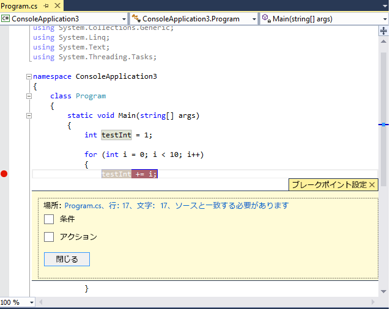
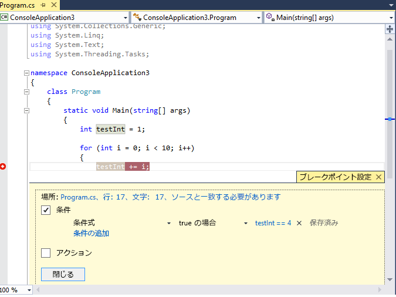

# <a name="use-breakpoints-in-the-visual-studio-debugger"></a>Visual Studio デバッガーでのブレークポイントの使用

ブレークポイントは、開発者のツールボックスで最も重要なデバッグ手法の1つです。 デバッガーの実行を一時停止する任意の場所にブレークポイントを設定します。 たとえば、コード変数の状態を確認したり、特定のブレークポイントの呼び出し履歴を確認したりすることができます。  ブレークポイントの使用中に警告または問題を解決しようとしている場合は、「 [Visual Studio デバッガーでのブレークポイントのトラブルシューティング](../debugger/troubleshooting-breakpoints.md)」を参照してください。

> [!NOTE]
> 解決しようとしているタスクまたは問題がわかっていても、使用するブレークポイントの種類を把握しておく必要がある場合は、「[デバッグタスクの検索](../debugger/find-your-debugging-task.md#pause-running-code)」を参照してください。

## <a name="BKMK_Overview"></a>ソースコードにブレークポイントを設定する

ブレークポイントは、実行可能ファイルの任意のコード行に設定できます。 たとえば、次C#のコードでは、変数宣言、`for`ループ、または`for`ループ内の任意のコードにブレークポイントを設定できます。 名前空間またはクラス宣言、またはメソッドシグネチャにブレークポイントを設定することはできません。

ソースコードにブレークポイントを設定するには、コード行の横にある左端の余白をクリックします。 また、行を選択して**F9**キーを押すか、 **[デバッグ]**  >  **[ブレークポイント]** の設定/解除 を選択するか、右クリックして **[ブレークポイント**] を選択し > ブレークポイントを**挿入**します。 ブレークポイントは、左余白に赤い点として表示されます。

を含むC#ほとんどの言語では、ブレークポイントと現在の実行行が自動的に強調表示されます。 コードC++の場合、ブレークポイントと現在の行を強調表示するには、**ツール** (または **デバッグ**) > オプション > **デバッグ**を選択し >  **ブレークポイントのソース行全体を強調表示し、現在 をクリックします。ステートメント (C++のみ)** 。


デバッグすると、その行のコードが実行される前に、ブレークポイントで実行が一時停止されます。 ブレークポイントシンボルは黄色の矢印を示しています。

次の例のブレークポイントでは、`testInt` の値は1のままです。 そのため、この値は、変数が初期化されてから変更されていません (値は 1)。黄色のステートメントはまだ実行されていません。


デバッガーがブレークポイントで停止すると、[変数の値](../debugger/debugger-feature-tour.md#inspect-variables-with-data-tips)や[呼び出し履歴](../debugger/how-to-use-the-call-stack-window.md)など、アプリの現在の状態を確認できます。

ここでは、ブレークポイントを操作するための一般的な手順について説明します。

- ブレークポイントはトグルです。 これをクリックするか、 **F9**キーを押すか、または**デバッグ** > 使用して、**ブレークポイント**を削除または再挿入できます。

- ブレークポイントを削除せずに無効にするには、ポインターをポイントするか右クリックし、 **[ブレークポイントの無効化]** を選択します。 無効なブレークポイントは、左余白または **[ブレークポイント]** ウィンドウに空のドットとして表示されます。 ブレークポイントを再度有効にするには、マウスポインターを合わせるか右クリックし、 **[ブレークポイントの有効化]** を選択します。

- 条件とアクションを設定したり、ラベルを追加および編集したり、ブレークポイントを右クリックして適切なコマンドを選択したり、**設定**アイコンを選択したりして、ブレークポイントをエクスポートします。

## <a name="BKMK_Print_to_the_Output_window_with_tracepoints"></a>ブレークポイント アクションとトレースポイント

*トレースポイント*は、 **[出力]** ウィンドウにメッセージを出力するブレークポイントです。 トレースポイントは、プログラミング言語の一時的なトレースステートメントのように機能し、コードの実行を一時停止することはありません。 トレースポイントを作成するには、 **[ブレークポイントの設定]** ウィンドウで特別なアクションを設定します。 詳細な手順については、「 [Visual Studio デバッガーでのトレースポイントの使用](../debugger/using-tracepoints.md)」を参照してください。

## <a name="breakpoint-conditions"></a>ブレークポイント条件

条件を設定して、ブレークポイントを実行するタイミングと場所を制御することができます。 条件には、デバッガーが認識する任意の有効な式を指定できます。 有効な式の詳細については、[デバッガー内の式](../debugger/expressions-in-the-debugger.md)に関するページを参照してください。

**ブレークポイント条件を設定するには:**

1. ブレークポイントシンボルを右クリックし、 **[条件]** を選択します。 または、ブレークポイントのシンボルにマウスポインターを移動し、 **[設定]** アイコンを選択し、 **[ブレークポイントの設定]** ウィンドウで **[条件]** を選択します。

   ブレークポイントを右クリックして **[設定]** を選択し、 **[条件]** を選択して、 **[ブレークポイント]** ウィンドウで条件を設定することもできます。

   

2. ドロップダウンリストで **[条件式]** 、 **[ヒットカウント]** 、または **[フィルター]** を選択し、必要に応じて値を設定します。

3. **[閉じる]** を選択するか、 **ctrl**+**enter**キーを押して、 **[ブレークポイントの設定]** ウィンドウを閉じます。 または、 **[ブレークポイント]** ウィンドウで **[OK]** を選択してダイアログを閉じます。

条件が設定されているブレークポイントは、ソースコード ウィンドウと **ブレークポイント** ウィンドウに **+** 記号と共に表示されます。

<a name="BKMK_Specify_a_breakpoint_condition_using_a_code_expression"></a>
### <a name="create-a-conditional-expression"></a>条件式を作成する

**[条件式]** を選択した場合は、 **[true]** または **[変更されたとき]** の2つの条件のいずれかを選択できます。 式が満たされたときに中断する場合は **[true]** を選択し、式の値が変更された場合は [中断] に**変更**します。

次の例では、`testInt` の値が**4**の場合にのみ、ブレークポイントがヒットします。



次の例では、`testInt` の値が変更された場合にのみ、ブレークポイントがヒットします。


無効な構文でブレークポイント条件を設定すると、警告メッセージが表示されます。 有効な構文でブレークポイント条件を指定しても、セマンティクスが無効な場合は、ブレークポイントに初めて達したときに警告メッセージが表示されます。 どちらの場合も、無効なブレークポイントにヒットするとデバッガーは中断します。 ブレークポイント条件が有効で、評価結果が `false`の場合にのみ、ブレークポイントはスキップされます。

>[!NOTE]
>**[変更された場合]** フィールドの動作は、プログラミング言語によって異なります。
>- ネイティブコードの場合、デバッガーは条件の最初の評価を変更と見なしません。そのため、最初の評価でブレークポイントにヒットしません。
>- マネージコードの場合、デバッガーは、[変更された**場合**] が選択された後の最初の評価でブレークポイントにヒットします。

<a name="using-object-ids-in-breakpoint-conditions-c-and-f"></a>
### <a name="use-object-ids-in-conditional-expressions-c-and-f-only"></a>条件式でのオブジェクト Id のC#使用F# (およびのみ)

 特定のオブジェクトの動作を確認することが必要になる場合があります。 たとえば、オブジェクトがコレクションに複数回挿入された理由を確認することができます。 C# と F# では、[参照型](/dotnet/csharp/language-reference/keywords/reference-types) の特定のインスタンスにオブジェクト ID を作成し、それらの ID をブレークポイントの条件で使用できます。 オブジェクト ID は、共通言語ランタイム (CLR) のデバッグ サービスで生成されて、オブジェクトに関連付けられます。

**オブジェクト ID を作成するには:**

1. オブジェクトが作成された後、コードにブレークポイントを設定します。

2. デバッグを開始し、ブレークポイントで実行が一時停止したら、[**デバッグ** > **Windows** > **ローカル**または**Alt**+**4** ] を選択して **[ローカル]** ウィンドウを開きます。

   **[ローカル]** ウィンドウで特定のオブジェクトインスタンスを見つけて右クリックし、 **[オブジェクト ID の作成]** を選択します。

   **$** ウィンドウに、 **[ローカル]** ウィンドウを閉じます。 これが、オブジェクト ID です。

3. 調査するポイントに新しいブレークポイントを追加します。たとえば、オブジェクトをコレクションに追加する場合などです。 ブレークポイントを右クリックし、 **[条件]** を選択します。

4. **[条件式]** フィールドでは、オブジェクト ID を使用します。 たとえば、変数 `item` がコレクションに追加されるオブジェクトである場合は、 **[true]** を選択し、「 **item = = $\<n >** 」と入力します。ここで、\<n > はオブジェクト ID 番号です。

   そのオブジェクトがコレクションに追加されると、実行が停止します。

   オブジェクト ID を削除するには、 **[ローカル]** ウィンドウで変数を右クリックし、 **[オブジェクト id の削除]** を選択します。

> [!NOTE]
> オブジェクト ID による参照は弱参照であり、これによって、オブジェクトがガベージ コレクションの対象から外れることはありません。 オブジェクト ID は、現在のデバッグ セッションでのみ有効です。

### <a name="set-a-hit-count-condition"></a>ヒットカウントの条件を設定する

特定の数のイテレーションの後にコード内のループが不適切に開始されたと思われる場合は、そのイテレーションに到達するために**F5**キーを繰り返し押すのではなく、ヒット数の後に実行を停止するようにブレークポイントを設定できます。

**[ブレークポイントの設定]** ウィンドウの **[条件]** で、 **[ヒットカウント]** を選択し、イテレーションの数を指定します。 次の例では、ブレークポイントは、他のすべてのイテレーションでヒットするように設定されています。


### <a name="set-a-filter-condition"></a>フィルター条件の設定

指定されたデバイスでのみ、または指定されたプロセスとスレッドでのみ、ブレークポイントが発生するように制限できます。

**[ブレークポイントの設定]** ウィンドウの **[条件]** で、 **[フィルター]** を選択し、次の式の1つまたは複数を入力します。

- MachineName = "name"
- ProcessId = value
- ProcessName = "name"
- ThreadId = value
- ThreadName = "name"

文字列の値を二重引用符で囲みます。 句は、 `&` (AND)、 `||` (OR)、 `!` (NOT)、およびかっこを使用して結合できます。

## <a name="BKMK_Set_a_breakpoint_in_a_source_file"></a>関数のブレークポイントの設定

関数が呼び出されると、実行が中断される可能性があります。 これは、たとえば関数名がわかっていて、その場所ではない場合などに便利です。 また、同じ名前の関数があり、それらすべてを中断する場合にも便利です (オーバーロードされた関数や異なるプロジェクトの関数など)。

**関数のブレークポイントを設定するには:**

1. [**デバッグ** > **新しいブレークポイント** > **関数のブレークポイント**] を選択するか、 **Alt**+**F9**キーを押し > **Ctrl**+**B**を押します。

   **[ブレークポイント]** ウィンドウで [**新しい** > **関数のブレークポイント**] を選択することもできます。

1. **[新しい関数のブレークポイント]** ダイアログで、 **[関数名]** ボックスに関数名を入力します。

   関数の仕様を絞り込むには、次のようにします。

   - 完全修飾関数名を使用します。

     例: `Namespace1.ClassX.MethodA()`

   - オーバーロードされた関数のパラメーターの型を追加します。

     例: `MethodA(int, string)`

   - モジュールを指定するには、'! ' 記号を使用します。

     例 : `App1.dll!MethodA`

   - ネイティブC++でコンテキスト演算子を使用します。

     `{function, , [module]} [+<line offset from start of method>]`

     例 : `{MethodA, , App1.dll}+2`

1. **[言語]** ドロップダウンで、関数の言語を選択します。

1. **[OK]** を選択します。

### <a name="set-a-function-breakpoint-using-a-memory-address-native-c-only"></a>メモリアドレスを使用して関数のブレークポイントC++を設定する (ネイティブのみ)
 オブジェクトのアドレスを使用して、クラスの特定のインスタンスによって呼び出されるメソッドに関数のブレークポイントを設定できます。  たとえば、`my_class`型のアドレス可能なオブジェクトを指定した場合、そのインスタンスが呼び出す `my_method` メソッドに関数のブレークポイントを設定できます。

1. クラスのインスタンスがインスタンス化された後のどこかにブレークポイントを設定します。

2. インスタンスのアドレスを検索します (たとえば、`0xcccccccc`)。

3. [**デバッグ** > **新しいブレークポイント** > **関数のブレークポイント**] を選択するか、 **Alt**+**F9**キーを押し > **Ctrl**+**B**を押します。

4. **[関数名]** ボックスに次のを追加し**C++** 、[言語] を選択します。

   ```cpp
   ((my_class *) 0xcccccccc)->my_method
   ```

::: moniker range=">= vs-2019"

## <a name="BKMK_set_a_data_breakpoint_managed"></a>データブレークポイントの設定 (.NET Core 3.0 以降)

データブレークポイントは、特定のオブジェクトのプロパティが変更されたときに実行を中断します。

**データブレークポイントを設定するには**

1. .NET Core プロジェクトでデバッグを開始し、ブレークポイントに到達するまで待ちます。

2. **[自動変数]** 、 **[ウォッチ]** 、または **[ローカル]** ウィンドウで、プロパティを右クリックし、コンテキストメニューの **[値の変更時に中断]** をクリックします。

    

.NET Core のデータブレークポイントは、次の場合には機能しません。

- ツールヒント、ローカル、自動変数、またはウォッチウィンドウに展開できないプロパティ
- 静的変数
- デバッガ Typeproxy 属性を持つクラス
- 構造体内のフィールド

::: moniker-end

## <a name="BKMK_set_a_data_breakpoint_native_cplusplus"></a>データブレークポイントの設定C++ (ネイティブのみ)

 指定されたメモリアドレスに格納されている値が変更されると、データブレークポイントは実行を中断します。 値が読み取られても変更されていなければ、実行は中断されません。

**データブレークポイントを設定するには:**

1. C++プロジェクトでデバッグを開始し、ブレークポイントに到達するまで待ちます。 **[デバッグ]** メニューで、[**新しいブレークポイント** > **データブレークポイント**] を選択します。

    **[ブレークポイント]** ウィンドウで [**新しい** > **データブレークポイント**] を選択するか、 **[自動変数]** 、 **[ウォッチ]** 、または **[ローカル]** ウィンドウで項目を右クリックして、コンテキストメニューの **[値の変更時に中断]** を選択することもできます。

2. **[アドレス]** ボックスに、メモリ アドレス、またはメモリ アドレスを表す式を入力します。 たとえば、「 `&avar` 」と入力すると、変数 `avar` の値が変更されたときに中断します。

3. **[バイト数]** ドロップダウンで、デバッガーがウォッチするバイト数を選択します。 たとえば、 **[4]** を選択すると、 `&avar` で始まる 4 バイトがウォッチされ、そのバイト値のいずれかが変更されると中断します。

データブレークポイントは、次の状況では機能しません。
- デバッグ対象外のプロセスがメモリ位置に書き込む場合
- メモリ位置が 2 つ以上のプロセス間で共有されている場合
- メモリ位置がカーネル内で更新される場合 たとえば、メモリが32ビットの Windows `ReadFile` 関数に渡された場合、メモリはカーネルモードから更新されるため、更新時にデバッガーが中断されることはありません。
- ここで、ウォッチ式は32ビットハードウェアでは4バイト、64ビットハードウェアでは8バイトを超えています。 これは、x86 アーキテクチャの制限です。

> [!NOTE]
> - データブレークポイントは、特定のメモリアドレスに依存します。 変数のアドレスが1つのデバッグセッションから次のセッションに変更されるため、各デバッグセッションの終了時にデータブレークポイントが自動的に無効になります。
>
> - ローカル変数にデータ ブレークポイントを設定すると、関数が終了してもブレークポイントは有効なままですが、メモリ アドレスは変更されるので、ブレークポイントは予測どおりに機能しなくなります。 ローカル変数にデータブレークポイントを設定する場合は、関数が終了する前にブレークポイントを削除するか無効にする必要があります。

## <a name="BKMK_Specify_advanced_properties_of_a_breakpoint_"></a>[ブレークポイント] ウィンドウでブレークポイントを管理する

 **[ブレークポイント]** ウィンドウを使用すると、ソリューション内のすべてのブレークポイントを表示および管理できます。 この一元化された場所は、大規模なソリューションで特に便利です。また、ブレークポイントが重要な複雑なデバッグシナリオにも役立ちます。

**[ブレークポイント]** ウィンドウでは、ブレークポイントの検索、並べ替え、フィルター処理、有効化/無効化、または削除を行うことができます。 また、条件とアクションを設定したり、新しい関数またはデータブレークポイントを追加したりすることもできます。

**[ブレークポイント]** ウィンドウを開くには、[**デバッグ** > **Windows** > **ブレークポイント**] を選択するか、alt+**F9**キーまたは Ctrl**キーを押し**+**ながら** **alt**+**B**キーを押します。


**[ブレークポイント]** ウィンドウに表示する列を選択するには、 **[列の表示]** を選択します。 列ヘッダーを選択すると、その列によってブレークポイントの一覧が並べ替えられます。

### <a name="BKMK_Set_a_breakpoint_at_a_function_return_in_the_Call_Stack_window"></a> ブレークポイントのラベル
ラベルを使用して、 **[ブレークポイント]** ウィンドウでブレークポイントの一覧の並べ替えとフィルター処理を行うことができます。

1. ブレークポイントにラベルを追加するには、ソースコードまたは **[ブレークポイント]** ウィンドウでブレークポイントを右クリックし、 **[ラベルの編集]** を選択します。 新しいラベルを追加するか、既存のラベルを選択し、[ **OK]** を選択します。
2. **[ブレークポイント]** ウィンドウで、**ラベル**、**条件**、またはその他の列ヘッダーを選択して、ブレークポイントの一覧を並べ替えます。 ツールバーの **[列の表示]** を選択すると、表示する列を選択できます。

### <a name="export-and-import-breakpoints"></a>ブレークポイントをエクスポートおよびインポートする
 ブレークポイントの状態と位置を保存または共有するには、ブレークポイントをエクスポートまたはインポートします。

- 1つのブレークポイントを XML ファイルにエクスポートするには、ソースコード ウィンドウまたは **ブレークポイント** ウィンドウでブレークポイントを右クリックし、**選択した** **エクスポート**またはエクスポート を選択します。 エクスポートの場所を選択し、 **[保存]** を選択します。 既定の場所は、ソリューションフォルダーです。
- 複数のブレークポイントをエクスポートするには、 **[ブレークポイント]** ウィンドウで、ブレークポイントの横にあるボックスを選択するか、**検索**フィールドに検索条件を入力します。 [**現在の検索条件に一致するすべてのブレークポイントをエクスポート**する] アイコンを選択し、ファイルを保存します。
- すべてのブレークポイントをエクスポートするには、すべてのボックスの選択を解除し、**検索**フィールドを空白のままにします。 [**現在の検索条件に一致するすべてのブレークポイントをエクスポート**する] アイコンを選択し、ファイルを保存します。
- ブレークポイントをインポートするには、 **[ブレークポイント]** ウィンドウで **[ファイルからブレークポイントをインポート]** アイコンを選択し、XML ファイルの場所に移動して、 **[開く]** を選択します。

## <a name="BKMK_Set_a_breakpoint_from_debugger_windows"></a>デバッガーウィンドウからブレークポイントを設定する

ブレークポイントは、 **[呼び出し履歴]** ウィンドウおよび **[逆アセンブル]** デバッガーウィンドウから設定することもできます。

### <a name="set-a-breakpoint-in-the-call-stack-window"></a>[呼び出し履歴] ウィンドウでブレークポイントを設定する

 呼び出し元の関数が返す命令または行を中断するには、 **[呼び出し履歴]** ウィンドウでブレークポイントを設定します。

**[呼び出し履歴] ウィンドウでブレークポイントを設定するには、次のようにします。**

1. **[呼び出し履歴]** ウィンドウを開くには、デバッグ中に一時停止する必要があります。 [**デバッグ** > **Windows** > **コールスタック**] を選択するか、+**ctrl**キーを押しながら**Alt**+**C**キーを押します。

2. **[呼び出し履歴]** ウィンドウで、呼び出し元の関数を右クリックし、 **[ブレークポイント**] をクリックし > **ブレークポイントを挿入**するか、 **F9**キーを押します。

   呼び出し履歴の左余白にある関数呼び出し名の横にブレークポイントシンボルが表示されます。

呼び出し履歴のブレークポイントは、関数の次の実行可能命令に対応するメモリ位置を持つアドレスとして、 **[ブレークポイント]** ウィンドウに表示されます。

デバッガーは命令で中断します。

呼び出し履歴の詳細については、「[How to: Use the Call Stack Window](../debugger/how-to-use-the-call-stack-window.md)」 (方法: [呼び出し履歴] ウィンドウの使用) を参照してください。

コードの実行中にブレークポイントを視覚的にトレースするには、「[デバッグ中の呼び出し履歴のメソッドのマップ](../debugger/map-methods-on-the-call-stack-while-debugging-in-visual-studio.md)」を参照してください。

### <a name="set-a-breakpoint-in-the-disassembly-window"></a>[逆アセンブル] ウィンドウでブレークポイントを設定する

1. **[逆アセンブル]** ウィンドウを開くには、デバッグ中に一時停止する必要があります。 [**デバッグ** > **Windows** > **逆アセンブリ**] を選択するか、 **Alt**+**8**を押します。

2. **[逆アセンブル]** ウィンドウで、中断する命令の左側の余白をクリックします。 また、これを選択して**F9**キーを押すか、右クリックし**て [ブレーク**ポイント] を選択し > **ブレークポイントを挿入**することもできます。

## <a name="see-also"></a>関連項目

- [デバッグとは](../debugger/what-is-debugging.md)
- [Visual Studio C#を使用してより優れたコードを記述する](../debugger/write-better-code-with-visual-studio.md)
- [デバッグに関する最初の確認](../debugger/debugger-feature-tour.md)
- [Visual Studio デバッガーでのブレークポイントのトラブルシューティング](../debugger/troubleshooting-breakpoints.md)
