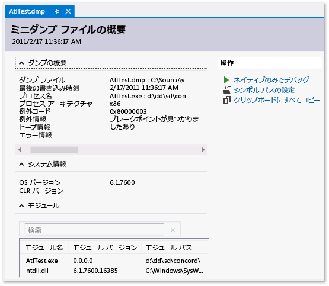

# Visual Studio でダンプ ファイルを使用します。
ダンプ ファイルの有無にかかわらずヒープダンプ ファイルを作成します。ダンプ ファイルを開くバイナリ、pdb のダンプ ファイルのソース ファイルを検索します。

##   ダンプ ファイルとは何ですか。
 A*ダンプ ファイル*時に、アプリのスナップショットは、ダンプを取得します。 ダンプ ファイルには、実行されたプロセスと読み込まれたモジュールが示されます。 ダンプがヒープ情報と共に保存された場合、ダンプ ファイルにはその時点におけるアプリのメモリの内容のスナップショットも含まれています。 Visual Studio でヒープ情報ありのダンプ ファイルを開くのは、デバッグ セッションのブレークポイントで実行を中断するようなものです。 実行を続行することはできませんが、ダンプの作成時におけるアプリのスタック、スレッド、変数値を調べることができます。

 ダンプが主に、開発者がアクセスできないマシンで発生した問題のデバッグで使用されます。 たとえば、顧客のクラッシュを再現またはコンピューターにハングすることはできませんと、顧客のコンピューターからのダンプ ファイルを使用することができます。 ダンプはテスターによっても作成されてクラッシュまたはハングアップ データの保存に使用されるため、テスト コンピューターを使用してより多くのテストを行えるようになります。 Visual Studio デバッガーでは、マネージドまたはネイティブ コードのダンプ ファイルを保存できます。 デバッガーは、Visual Studio によって、または内のファイルを保存する他のプログラムで作成されたダンプ ファイルを読み込むことができます、*ミニダンプ*形式。

##   ダンプ ファイル、ヒープの有無
 ヒープ情報あり/なしのダンプ ファイルを作成できます。

-   **ダンプ ファイルがヒープ情報あり**アプリのメモリのスナップショットが含まれます。 ダンプの作成時における変数値も含まれています。 ヒープ情報と共に保存されたダンプ ファイルを読み込む場合、Visual Studio はアプリケーション バイナリが見つからなくてもシンボルを読み込むことができます。 また、Visual Studio は、読み込まれたネイティブ モジュールのバイナリをダンプ ファイルに保存するため、デバッグが大幅に簡単になります。

-   **ヒープなしのダンプ ファイル**がヒープ情報ありのダンプよりかなり小さくなります。 ただし、デバッガーはアプリのバイナリを読み込んでシンボル情報を見つける必要があります。 バイナリはダンプの作成時に使用されたバイナリと完全に一致する必要があります。 ヒープ情報なしのダンプ ファイルには、スタック変数の値のみ保存されます。

##   要件と制限事項

-   最適化されたコードのダンプ ファイルをデバッグすると、混乱が生じることがあります。 たとえば、コンパイラによる関数のインライン展開により、予期しない呼び出し履歴になっていたり、その他の最適化により、変数の有効期間が変更されていたりします。

-   64 ビット コンピューターからのダンプ ファイルは、64 ビット コンピューター上で実行される Visual Studio のインスタンス上でデバッグする必要があります。

-   VS 2013 より前の Visual Studio のバージョンでは、一部のツール (タスク マネージャーや 64 ビット WinDbg など) によって収集された 64 ビット コンピューター上で実行する 32 ビット アプリケーションのダンプは Visual Studio で開くことができませんでした。 VS 2013 ではこの制限はありません。

-   Visual Studio では、ARM デバイスからのネイティブ アプリのダンプ ファイルをデバッグできます。 また、ARM デバイスからのマネージド アプリのダンプ ファイルもデバッグできますが、これはネイティブ デバッガーでのみ可能です。

-   デバッグする[カーネル モード](http://msdn.microsoft.com/library/windows/hardware/ff551880.aspx)ダンプ ファイルの一部である Windows 用デバッグ ツールをダウンロード、 [Windows Driver Kit (WDK)](/windows-hardware/drivers/download-the-wdk)します。

-   Visual Studio と呼ばれる以前のダンプ形式で保存されたダンプ ファイルをデバッグできません、[フル ユーザー モード ダンプ](http://msdn.microsoft.com/library/windows/hardware/ff545506.aspx)します。 フル ユーザー モード ダンプがヒープ情報ありのダンプとは異なることに注意してください。

-   デバッグする、 [SOS.dll (SOS デバッガー拡張)](/dotnet/framework/tools/sos-dll-sos-debugging-extension) Visual Studio での一部である Windows 用デバッグ ツールをインストールする必要があります、 [Windows Driver Kit (WDK)](/windows-hardware/drivers/download-the-wdk)

##   ダンプ ファイルを作成します。
 Visual Studio でダンプ ファイルを作成するには: 

-   Visual Studio でのプロセスのデバッグ中、デバッガーが例外またはブレークポイントで停止するときに、ダンプ ファイルを保存できます。 選択**デバッグ**、し**としてダンプを保存**、し**デバッグ**します。 **ダンプを保存** ダイアログ ボックスで、**型として保存** ボックスの一覧を選択できます**ミニダンプ**または**ヒープ付きミニダンプ**(既定)。

-   [Just-In-Time デバッグ](../debugger/just-in-time-debugging-in-visual-studio.md)を有効にされている場合、デバッガーの外部にクラッシュしたプロセスにデバッガーをアタッチしてダンプ ファイルを保存します。 参照してください[実行中のプロセスのアタッチ](../debugger/attach-to-running-processes-with-the-visual-studio-debugger.md)

 Windows ミニダンプ形式をサポートするプログラムでもダンプ ファイルを作成できます。 たとえば、 **Procdump**コマンド ライン ユーティリティから[Windows Sysinternals](http://technet.microsoft.com/sysinternals/default)トリガーまたはオンデマンドでプロセスのクラッシュ ダンプ ファイルを作成できます。 参照してください[要件と制限事項](../debugger/using-dump-files.md#BKMK_Requirements_and_limitations)ダンプ ファイルを作成するその他のツールを使用する方法については、このトピックでします。

##   ダンプ ファイルを開く

1.  Visual Studio で、次のように選択します。**ファイル**、**オープン**、**ファイル**します。

2.  **ファイルを開く** ダイアログ ボックスを検索して、ダンプ ファイルを選択します。 通常は拡張子 .dmp が付いています。 クリックして**OK**します。

3.  **ダンプ ファイルの概要**ウィンドウが表示されます。 このウィンドウでは、ダンプ ファイルのデバッグに関する概要情報を確認し、シンボル パスを設定したりデバッグを開始したりすることができます。概要情報をクリップボードにコピーすることもできます。

     

4.  デバッグを開始するには、**アクション**セクションし、いずれかを選択**管理のみでデバッグ**、**ネイティブのみでデバッグ**または**混合でデバッグ**.

##   バイナリ、シンボル (.pdb) ファイル、ソース ファイルを検索します。
 Visual Studio でダンプ ファイルのデバッグ機能をすべて使用するには、次のファイルにアクセスできる必要があります。

-   ダンプの作成に使用した .exe ファイルと、ダンプ プロセスで使用したその他のファイルおよびバイナリ (DLL など)。

     ヒープ情報ありのダンプをデバッグする場合、Visual Studio は、一部のモジュールにバイナリ ファイルが欠落している状況にも対処できますが、有効な呼び出し履歴を生成できる十分なモジュールのバイナリがあることが必要です。 Visual Studio は、ネイティブ モジュールのバイナリをヒープ情報ありのダンプ ファイルに保存します。

-   .exe およびその他のバイナリのシンボル (.pdb) ファイル。

-   目的のモジュールのソース ファイル。

     実行可能ファイルと .pdb ファイルは、ダンプの作成時に使用したものと、バージョンおよびビルドが正確に一致している必要があります。

     ソース ファイルが見つからない場合、モジュールの逆アセンブリを使用してデバッグすることができます。

 **実行可能ファイルの既定の検索パス**

 Visual Studio は自動的に実行可能ファイルのダンプ ファイルに含まれていないこれらの場所を検索します。

1.  ダンプ ファイルが格納されているディレクトリ。

2.  ダンプ ファイルで指定されたモジュールのパス。 これは、ダンプが収集されたコンピューター上のモジュール パスです。

3.  指定されたシンボル パス、**デバッグ**、**オプション**、**シンボル**Visual Studio のページ**ツール**、**オプション**  ダイアログ ボックス。 検索する複数の場所をこのページで追加できます。

 **No バイナリを使用して > シンボル > ページのソース**

 Visual Studio がデバッグ ダンプ内のモジュールに必要なファイルを見つけられない場合、該当するページが表示されます (**バイナリが見つかりません**、**シンボルが見つかりません**、または**ソースが見つかりません**)。 これらのページでは、問題の原因に関する詳細な情報が表示され、ファイルの正しい場所を特定するために役立つアクション リンクも表示されます。 [シンボル (.pdb) ファイルとソース ファイルの指定](../debugger/specify-symbol-dot-pdb-and-source-files-in-the-visual-studio-debugger.md)に関する記事をご覧ください。

## 関連項目

- [Just-In-Time デバッグ](../debugger/just-in-time-debugging-in-visual-studio.md)
- [シンボル (.pdb) を指定し、ソース ファイル](../debugger/specify-symbol-dot-pdb-and-source-files-in-the-visual-studio-debugger.md)
- [IntelliTrace](../debugger/intellitrace.md)