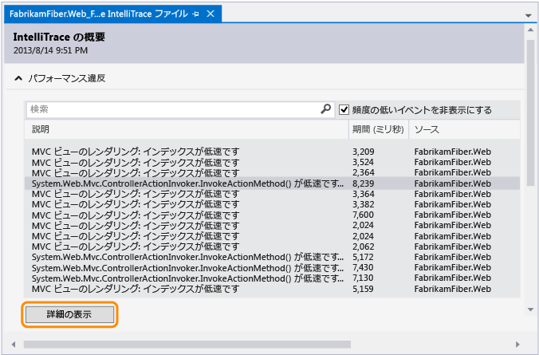
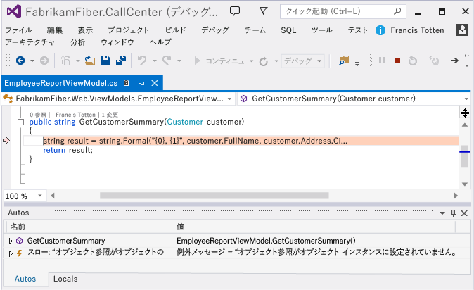
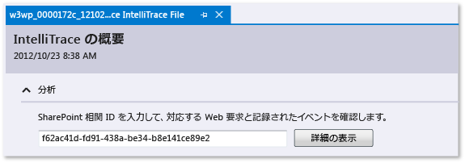
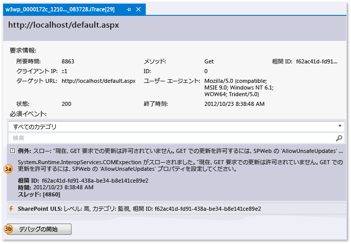
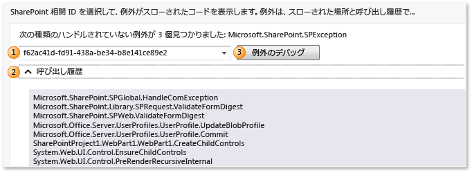

# 保存された IntelliTrace データの使用
IntelliTrace ログ (.iTrace) ファイルからデバッグを開始するときに、アプリケーションの実行においての特定のポイントに移動します。 このファイルには、アプリの実行中に IntelliTrace によって記録された、パフォーマンス イベント、例外、スレッド、テスト ステップ、モジュール、およびその他のシステム情報が格納されています。  
  
 次のソリューションがあることを確認します。  
  
-   アプリケーション コードのソース ファイルとシンボル (.pdb) ファイルの一致。 シンボル パスにない場合、Visual Studio がソースの場所を解決できないため、「シンボルが見つかりませんでした」というメッセージが表示されます。 参照してください[指定シンボル (.pdb) とソース ファイル](../debugger/specify-symbol-dot-pdb-and-source-files-in-the-visual-studio-debugger.md)と[配置後の問題の診断](../debugger/diagnose-problems-after-deployment.md)です。  
  
-   .iTrace ファイルを開くための、開発用コンピューターまたは別のコンピューター上の Visual Studio Enterprise (ただし、Professional または Community Edition を除く)  
  
-   次のいずれかのソースの .iTrace ファイル  
  
    |**ソース**|**「**|  
    |----------------|-------------|  
    |Visual Studio Enterprise Edition (ただし、Professional または Community Edition を除く) での IntelliTrace セッション|[IntelliTrace の機能](../debugger/intellitrace-features.md)|  
    |Microsoft Test Manager のテスト セッション。 これにより、.iTrace ファイルが Team Foundation Server の作業項目にアタッチされます。|[手動テストでの複数の診断データの収集](/vsts/manual-test/mtm/collect-more-diagnostic-data-in-manual-tests)|  
    |配置で実行されている ASP.NET Web アプリおよび SharePoint アプリケーションのための、単独で、または System Center 2012 R2 Operations Manager と連携して動作する Microsoft Monitoring Agent|-   [配置後の問題を診断します。](../debugger/diagnose-problems-after-deployment.md) -   [System Center 2012 R2 Operations Manager の新機能](http://technet.microsoft.com/library/dn249700.aspx)|  
  
##   実行する操作  
  
-   [IntelliTrace ログを開く](#Open)  
  
-   [IntelliTrace ログを理解する](#Understand)  
  
-   [IntelliTrace ログのデバッグを開始する](#StartDebugging)  
  
##   IntelliTrace ログを開く  
 Visual Studio Enterprise がインストールされたコンピューターで、.iTrace ファイルを開きます。  
  
-   Visual Studio の外部で .iTrace ファイルをダブルクリックするか、Visual Studio 内からファイルを開きます。  
  
     \- または  
  
-   .iTrace ファイルが Team Foundation Server の作業項目にアタッチされている場合は、作業項目の次の手順に従います。  
  
    -   **[すべてのリンク]**の下で .iTrace ファイルを見つけます。 そのファイルを開きます。  
  
         \- または  
  
    -   **[ステップの再現]**の **[IntelliTrace]** リンクを選択します。  
  
> [!TIP]
>  デバッグ中に IntelliTrace ファイルを閉じた場合、ファイルを簡単に開き直すことができます。 **[デバッグ]** メニューで **[IntelliTrace]**、 **[ログの概要の表示]**の順に選択します。 また **[IntelliTrace]** ウィンドウの **[ログの概要の表示]** を選択することもできます。 これは、IntelliTrace を使用したデバッグ中にのみ使用できます。  
  
##   IntelliTrace ログを理解する  
 .iTrace ファイルの次のセクションの一部は、特定のソース (たとえば、Test Manager、SharePoint アプリケーション) からデータを収集した場合にのみ表示されます。  
  
|**セクション**|**内容**|**コレクションのソース**|  
|-----------------|------------------|---------------------------|  
|[パフォーマンス違反](#Performance)|構成されたしきい値を超えた関数呼び出しのパフォーマンス イベント|Microsoft Monitoring Agent をいずれかのスタンドアロン コレクターまたは IIS でホストされる ASP.NET web アプリの System Center 2012 R2 Operations Manager|  
|[例外データ](#ExceptionData)|各例外の完全なコール スタックを含む、例外|すべてのソース|  
|[分析](#Analysis)|SharePoint 2010 アプリケーションと SharePoint 2013 アプリケーションのみ。 Microsoft Monitoring Agent によって記録されたデバッガー イベント、ULS イベント、ハンドルされない例外、その他のデータなど、IntelliTrace と SharePoint のイベントを診断します。|Microsoft Monitoring Agent をいずれかのスタンドアロン コレクターまたは System Center 2012 R2 Operations Manager と|  
|[システム情報](#SystemInfo)|ホスト システムの設定および仕様|すべてのソース|  
|[スレッド一覧](#ThreadsList)|コレクション中に実行されたスレッド|すべてのソース|  
|[テスト データ](#TestData)|テスト セッションのテスト ステップと結果|テスト マネージャー|  
|[モジュール](#Modules)|読み込まれた順序でターゲット プロセスが読み込まれたモジュール。|すべてのソース| 
|[Web 要求](#Modules)|運用環境の IIS の web 要求のデータは web アプリケーションと SharePoint 2010 および SharePoint 2013|Microsoft Monitoring Agent とスタンドアロン コレクター| 
  
 次に、各セクションの情報を検索するヒントを示します。  
  
-   列ヘッダーを選択してデータを並べ替えます。  
  
-   検索ボックスを使用して、データをフィルター処理します。 プレーンテキストの検索は、時間の列を除くすべての列で機能します。 また、列ごとに 1 つのフィルターで特定の列をフィルター検索できます。 空白、コロン (**:**)、および検索値のない列名を入力します。 この後にセミコロン (**;**) を置いて、別の列を追加し、値を検索します。  
  
     たとえば、 **[説明]** の列に "slow" という単語があるパフォーマンス イベントを検索するには、次のように入力します。  
  
     `Description:slow`  
  
##   IntelliTrace ログのデバッグを開始する  
  
###   パフォーマンス違反  
 アプリについて記録されたパフォーマンス イベントを確認します。 頻繁に発生しないイベントを非表示にできます。  
  
##### パフォーマンス イベントからデバッグを開始するには  
  
1.  **[パフォーマンス違反]**で、記録されたパフォーマンス イベント、総実行時間、その他のイベント情報を確認します。 その後、特定のパフォーマンス イベントの発生時に呼び出されたメソッドをさらに掘り下げます。  
  
       
  
     イベントをダブルクリックするだけでもかまいません。  
  
2.  イベント ページで、これらの呼び出しの実行時間を確認します。 実行ツリーで、時間がかかっている呼び出しを見つけます。  
  
     複数の呼び出しが入れ子などの形式で存在する場合は、最も低速な呼び出しが独自のセクションに表示されます。  
  
3.  その呼び出しを展開して、その時点で記録された、入れ子になったすべての呼び出しとパラメーター値を確認します。  
  
     (キーボード: 入れ子になった呼び出しを表示または非表示にするには、 **右矢印** キーまたは **左矢印** キーをそれぞれ押します。 入れ子になった呼び出しのパラメーター値を表示または非表示にするには、 **スペース** キーを押します。)  
  
     その呼び出しからデバッグを開始します。  
  
       
  
     また、呼び出しをダブルクリックするか、 **Enter** キーを押すこともできます。  
  
     アプリケーション コードにメソッドが含まれる場合、Visual Studio はそのメソッドに移動します。  
  
       
  
     これで、他の記録された値、つまり呼び出し履歴を確認したり、コードをステップ実行したりできます。また、 **IntelliTrace** ウィンドウを使用して、パフォーマンス イベントの発生時に呼び出された [その他のメソッド間を "時間内に" 前後に移動することもできます](../debugger/intellitrace.md) 。  
  
###   例外データ  
 アプリによってスローされ、記録された例外を確認します。 最新の例外のみが表示されるように、同じ型およびコール スタックがある例外をグループ化できます。  
  
##### 例外からデバッグを開始するには  
  
1.  **[例外データ]**では、記録された例外イベントとその種類、メッセージ、その例外がいつ発生したかを確認できます。 コードをさらに掘り下げるには、例外グループの最新のイベントからデバッグを開始します。  
  
       
  
     イベントをダブルクリックするだけでもかまいません。 イベントがグループ化されていない場合は、 **[このイベントのデバッグ]**をクリックします。  
  
     例外がアプリケーション コードで発生した場合、Visual Studio は例外が発生した場所に移動します。  
  
       
  
     これで、他の記録された値、つまり呼び出し履歴を確認したり、 **IntelliTrace** ウィンドウを使用して、 [記録されたその他のイベント間を "時間内に" 前後に移動したりできます](../debugger/intellitrace.md)。また、関連するコードや、その時点で記録された値の間も前後に移動できます。  
  
    |**列**|**内容**|  
    |----------------|-------------------|  
    |**型**|.NET 型の例外|  
    |グループ化された例外の**[最新メッセージ]** またはグループ化されていない例外の **[メッセージ]** |例外によって提供されるメッセージ|  
    |グループ化された例外の**[カウント]** |例外がスローされた回数|  
    |グループ化されていない例外の**[スレッド ID]** |例外をスローしたスレッドの ID|  
    |**[最新イベント時間]** または **[イベント時間]**|例外がスローされたときに記録されたタイム スタンプ|  
    |**呼び出し履歴**|例外の呼び出し履歴。   呼び出し履歴を表示するには、一覧で例外を選択します。 呼び出し履歴は例外の一覧の下に表示されます。|  
  
###   分析  
 SharePoint 相関 ID を使用して SharePoint 2010 と SharePoint 2013 アプリケーションの診断したり、Microsoft Monitoring Agent によって検出されたハンドルされない例外を確認したりします。  
  
-   SharePoint 相関 ID を使用して、対応する Web 要求およびイベントを検索する。 イベントを選択し、そのイベントが発生したポイントでデバッグを開始します。  
  
-   Microsoft Monitoring Agent によってハンドルされない例外が検出された場合は、例外を選択し、その例外が発生したポイントでデバッグを開始します。  
  
##### SharePoint 相関 ID を使用してデバッグを開始する  
  
1.  SharePoint 相関 ID をソースからコピーします。  
  
     例:  
  
       
  
2.  .iTrace ファイルを開き、 **[分析]** に移動して、Web 要求と記録されたイベントの一致を確認するために SharePoint 相関 ID を入力します。  
  
       
  
3.  **[要求イベント]**で、イベントを確認します。 イベントは、発生した順に上から表示されます。  
  
    1.  イベントを選択すると、その詳細が表示されます。  
  
    2.  **[デバッグ開始]** を選択すると、イベントが発生したポイントでデバッグが開始されます。  
  
       
  
 IntelliTrace イベントと共に、以下の種類の SharePoint イベントが表示されます。  
  
-   **ユーザー プロファイル イベント**  
  
     これらのイベントは、SharePoint によってユーザー プロファイルが読み込まれたとき、およびユーザー プロファイル プロパティの読み取りまたは変更が行われたときに発生します。  
  
-   **Unified Logging System (ULS) イベント**  
  
     Microsoft Monitoring Agent は、SharePoint ULS イベントのサブセットと以下のフィールドを記録します。  
  
    |**IntelliTrace のフィールド**|**SharePoint ULS のフィールド**|  
    |----------------------------|------------------------------|  
    |**ID**|**イベント ID**|  
    |**レベル**|**レベル**|  
    |**カテゴリ ID**|**カテゴリ ID**|  
    |**カテゴリ**|**カテゴリ**|  
    |**区分**|**製品**|  
    |**出力**|**[メッセージ]**|  
    |**相関 ID**|**相関 ID**|  
  
##### ハンドルされない例外からデバッグを開始する  
  
1.  例外の SharePoint 相関 ID を選択します。 例外は、種類と呼び出し履歴によってグループ化されます。  
  
2.  (省略可能) **[呼び出し履歴]** を展開して、例外のグループの呼び出し履歴を表示します。  
  
3.  **[例外のデバッグ]** を選択して、その例外が発生したポイントでデバッグを開始します。  
  
       
  
 チュートリアルについては、次を参照してください。[チュートリアル: IntelliTrace を使用した、SharePoint アプリケーションのデバッグ](../sharepoint/walkthrough-debugging-a-sharepoint-application-by-using-intellitrace.md)です。 エージェントのレコードに表示されるデータの種類の[IntelliTrace 機能の](../debugger/intellitrace-features.md)します。  
  
###   スレッド一覧  
 ターゲット プロセスで実行されたスレッドの記録を確認します。 選択されているスレッドの最初の有効な IntelliTrace イベントからデバッグを開始できます。  
  
##### 特定のスレッドからデバッグを開始するには  
  
1.  **[スレッド一覧]**で、スレッドを選択します。  
  
2.  **[スレッド一覧]**の下部にある **[デバッグ開始]**を選択します。 スレッドをダブルクリックすることもできます。  
  
     アプリが始まる場所からデバッグを開始するには、 **[メイン スレッド]**をダブルクリックします。 参照してください[IntelliTrace 機能の](../debugger/intellitrace-features.md)します。  
  
 ユーザーが作成するスレッド データは、IIS でホストされる Web アプリ用にサーバーが作成および管理するスレッドよりも便利な場合があります。  
  
|**列**|**内容**|  
|----------------|-------------------|  
|**ID**|スレッド ID 番号|  
|**Name**|スレッド名。 名前のないスレッドとして表示されます"\<名前なし >"です。|  
|**開始時刻**|スレッドが作成された時刻|  
|**終了時刻**|スレッドが完了した時刻|  
  
###   テスト データ  
 アプリのテスト中に Test Manager によって記録された IntelliTrace データを確認します。  
  
##### 特定のテスト ステップからデバッグを開始するには  
  
1.  **[テスト ステップ グリッド]**を展開します。 テスト ステップを選択します。  
  
2.  **[テスト ステップ グリッド]**の下部にある **[デバッグ開始]**を選択します。 テスト ステップをダブルクリックすることもできます。  
  
     これによって、選択されているテスト ステップの後に現れる最初の有効な IntelliTrace イベントからデバッグが開始されます。  
  
     テスト データがある場合は、IntelliTrace によって、テストの実行に使用された関連する Team Foundation Server ビルドの解決が試みられます。 ビルドが見つかった場合、アプリ用に関連付けられているシンボルは自動的に解決されます。  
  
|**フィールド**|**内容**|  
|---------------|-------------------|  
|**テスト セッション**|記録されたテスト セッション。 通常は 1 つだけです。 テスト データが手動の探索的テストを使用して作成された場合、このリストは空になります。|  
|**テスト ケース**|選択されているテスト セッションのテスト ケース。 テスト データが手動の探索的テストを使用して作成された場合、このリストは空になります。|  
|**[テスト ステップ グリッド]**|合格または不合格のテスト結果が記録されたテスト ステップ|  
  
###   システム情報  
 このセクションには、ハードウェア、オペレーティング システム、環境、プロセス固有の情報など、アプリをホストしたシステムに関する詳細が表示されます。  
  
###   モジュール  
 このセクションには、ターゲット プロセスに読み込まれたモジュールが表示されます。 モジュールは、読み込まれた順序で表示されます。  
  
|**列**|**内容**|  
|----------------|-------------------|  
|**モジュール名**|モジュール ファイル名|  
|**モジュール パス**|モジュールが読み込まれたディスクの場所|  
|**モジュール ID**|バージョン固有で一致するシンボル (PDB) ファイルに貢献するモジュールの一意の識別子。 「 [Finding symbol (.pdb) files and source files](http://msdn.microsoft.com/en-us/05384c85-d264-4e18-abaa-aa482ab25470)」を参照してください。|  
  
### 情報の入手方法  
 [IntelliTrace スタンドアロン コレクターを使用する](../debugger/using-the-intellitrace-stand-alone-collector.md)  
  
 [IntelliTrace の機能](../debugger/intellitrace-features.md)  
  
 [手動テストでの複数の診断データの収集](/vsts/manual-test/mtm/collect-more-diagnostic-data-in-manual-tests)  
  
 [[IntelliTrace]](../debugger/intellitrace.md)  
  
#### フォーラム  
 [Visual Studio Debugger](http://go.microsoft.com/fwlink/?LinkId=262263)  
  
#### ガイダンス  
 [Visual Studio 2012 - 第 6 章で継続的配信のテスト: テスト ツールボックス](http://go.microsoft.com/fwlink/?LinkID=255203)