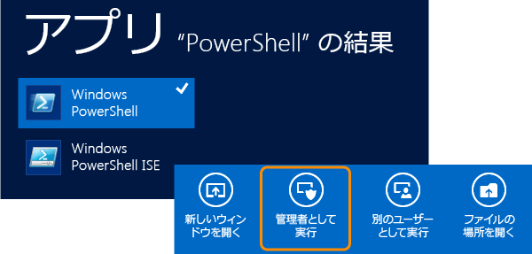
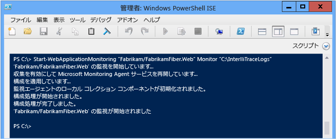
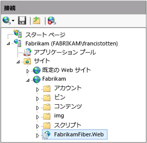
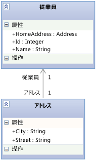

# <a name="using-the-microsoft-monitoring-agent-c-visual-basic"></a>Microsoft Monitoring Agent の使用 (C#、Visual Basic)

**Microsoft Monitoring Agent**を使用して、IIS によってホストされる ASP.NET Web アプリおよび SharePoint 2010 や SharePoint 2013 アプリケーションのエラー、パフォーマンスの問題、またはその他の問題をローカルで監視することができます。 エージェントからの診断イベントを IntelliTrace ログ (.iTrace) ファイルに保存できます。 次に、Visual Studio Enterprise (Professional Edition や Community Edition ではない) のログを開いて、すべての Visual Studio 診断ツールで問題をデバッグできます。 Agent を **トレース** モードで実行して、IntelliTrace 診断データとメソッド データを収集することもできます。 Microsoft Monitoring Agent は [Application Insights](/azure/application-insights/) および [System Center Operation Manager](/previous-versions/system-center/system-center-2012-R2/hh205987(v=sc.12))と統合できます。 Microsoft Monitoring Agent がインストールされている場合、対象システムの環境が変更されます。

> [!NOTE]
> **IntelliTrace スタンドアロン コレクター**を使用して、対象環境を変更することなく、リモート コンピューター上の Web、SharePoint、WPF、Windows フォーム アプリの IntelliTrace 診断データとメソッド データを収集することもできます。 スタンドアロン コレクターは、Microsoft Monitoring Agent を **モニター** モードで実行するよりも、パフォーマンスに大きな影響を及ぼします。 「[IntelliTrace スタンドアロン コレクターの使用](../debugger/using-the-intellitrace-stand-alone-collector.md)」を参照してください。

 System Center 2012 を使用する場合は、オペレーション マネージャーと連携する Microsoft Monitoring Agent を使用して、問題についてのアラートを取得し、保存された IntelliTrace ログへのリンクを含む Team Foundation Server の作業項目を作成します。 これで、さらにデバッグを行うためにこれらの作業項目をその他の項目に割り当てることができます。 「 [Operations Manager と開発プロセスの統合](/previous-versions/system-center/system-center-2012-R2/jj614609(v=sc.12)) 」および「 [Microsoft Monitoring Agent による監視](/previous-versions/system-center/system-center-2012-R2/dn465153(v=sc.12))」をご覧ください。

 開始する前に、ビルドされ、配置されたコードに一致するソースとシンボルがあることを確認します。 これによって、デバッグと IntelliTrace ログの診断イベントの参照を開始するときに、アプリケーション コードに直接進むことができます。 Visual Studio が配置されたコードに一致するソースを自動的に検索して、開くことができるように[ビルドを設定](../debugger/diagnose-problems-after-deployment.md) します。

1. [手順 1:Microsoft Monitoring Agent を設定する](#SetUpMonitoring)

2. [手順 2:アプリの監視を開始する](#MonitorEvents)

3. [手順 3:記録されたイベントを保存する](#SaveEvents)

## <a name="step-1-set-up-microsoft-monitoring-agent"></a><a name="SetUpMonitoring"></a>手順 1:Microsoft Monitoring Agent を設定する

 Web サーバーでスタンドアロン エージェントを設定して、アプリケーションを変更せずにローカルでの監視を実行します。 System Center 2012 を使用している場合は、「 [Microsoft Monitoring Agent のインストール](/previous-versions/system-center/system-center-2012-R2/dn465156(v=sc.12))」をご覧ください。

### <a name="set-up-the-standalone-agent"></a><a name="SetUpStandaloneMMA"></a> スタンドアロンのエージェントを設定する

1. 以下を確認します。

    - [サポートされているバージョンのインターネット インフォメーション サービス (IIS: Internet Information Services)](/previous-versions/system-center/system-center-2012-R2/dn465154(v=sc.12))が Web サーバーによって実行されている。

    - Web サーバーに .NET Framework 3.5、4、または 4.5 がある。

    - Web サーバーによって Windows PowerShell 3.0 以降が実行されている。 [Q: Windows PowerShell 2.0 を持っている場合はどうすればよいですか。](#PowerShell2)

    - 監視の開始時に PowerShell コマンドを実行し、アプリケーション プールをリサイクルするための管理者のアクセス許可が Web サーバーにある。

    - 以前のバージョンの Microsoft Monitoring Agent をすべてアンインストールしました。

2. Microsoft ダウンロード センターから Web サーバーへ[無料の Microsoft Monitoring Agent をダウンロードします](https://www.microsoft.com/download/details.aspx?id=40316)(32 ビット バージョン **MMASetup-i386.exe** 、または 64 ビット バージョン **MMASetup-AMD64.exe**)。

3. ダウンロードされた実行可能ファイルを実行してインストール ウィザードを起動します。

4. セキュリティで保護されたディレクトリを Web サーバーに作成し、IntelliTrace ログを格納します (たとえば、 **C:\IntelliTraceLogs**)。

     監視を開始する前にこのディレクトリの作成を確認します。 ご利用のアプリの処理が低下するのを回避するには、あまりアクティブではないローカルの高速なディスク上の場所を選択してください。

    > [!IMPORTANT]
    > IntelliTrace ログは個人用データおよび重要情報が含まれる場合があります。 このディレクトリへのアクセスを、ファイルを使用する必要がある ID のみに制限します。 企業のプライバシー ポリシーを確認してください。

5. 詳細な、関数レベルの監視を実行するか、または SharePoint アプリケーションを監視するために、Web アプリまたは SharePoint アプリケーションをホストするアプリケーション プールに IntelliTrace ログ ディレクトリへの読み取りおよび書き込みのアクセス許可を与えます。 [Q: アプリケーション プールへのアクセス許可の設定はどうすればよいですか。](#FullPermissionsITLog)

### <a name="q--a"></a>Q & A

#### <a name="q-what-if-i-have-windows-powershell-20"></a><a name="PowerShell2"></a> Q:Windows PowerShell 2.0 を持っている場合はどうすればよいですか。
 **A:** PowerShell 3.0 を使用することを強くお勧めします。 それ以外の場合は、PowerShell を実行するたびに Microsoft Monitoring Agent の PowerShell コマンドレットをインポートする必要があります。 また、ヘルプのダウンロード可能なコンテンツにはアクセスできません。

1. 管理者として **Windows PowerShell** または **Windows PowerShell ISE** のコマンド プロンプト ウィンドウを開きます。

2. Microsoft Monitoring Agent の PowerShell モジュールを既定のインストール場所からインポートします。

     **PS C:>Import-Module "C:\Program Files\Microsoft Monitoring Agent\Agent\PowerShell\Microsoft.MonitoringAgent.PowerShell\Microsoft.MonitoringAgent.PowerShell.dll"**

3. 最新のヘルプ コンテンツを入手するには、[TechNet にアクセスしてください](/previous-versions/system-center/developer/cc817313(v=msdn.10)) 。

#### <a name="q-how-do-i-set-up-permissions-for-the-application-pool"></a><a name="FullPermissionsITLog"></a> Q:アプリケーション プールへのアクセス許可の設定はどうすればよいですか。
 **A:** Windows の **icacls** コマンドまたはエクスプローラー (またはファイル エクスプローラー) を使用します。 次に例を示します。

- Windows の **icacls** コマンドを使用してアクセス許可を設定するには:

  - **DefaultAppPool** アプリケーション プールの Web アプリの場合:

     `icacls "C:\IntelliTraceLogs" /grant "IIS APPPOOL\DefaultAppPool":RX`

  - **SharePoint - 80** アプリケーション プールの SharePoint アプリケーションの場合:

     `icacls "C:\IntelliTraceLogs" /grant "IIS APPPOOL\SharePoint - 80":RX`

    \- または -

- エクスプローラー (またはファイル エクスプローラー) を使用してアクセス許可を設定するには:

  1. IntelliTrace ログ ディレクトリの **[プロパティ]** を開きます。

  2. **[セキュリティ]** タブで、 **[編集]** 、 **[追加]** を順に選択します。

  3. **[オブジェクトの種類を選択してください]** ボックスに **[ビルトイン セキュリティ プリンシパル]** が表示されることを確認します。 表示されない場合は、 **[オブジェクトの種類]** を選択してこれを追加します。

  4. ローカル コンピューターが **[場所の指定]** ボックスに表示されることを確認します。 表示されない場合は、 **[場所]** を選択してこれを追加します。

  5. **[選択するオブジェクト名を入力してください]** ボックスに、Web アプリまたは SharePoint アプリケーションのアプリケーション プールを追加します。

  6. **[名前の確認]** を選択して名前を解決します。 **[OK]** をクリックします。

  7. アプリケーション プールに**読み取りおよび実行**のアクセス許可があることを確認します。

## <a name="step-2-start-monitoring-your-app"></a><a name="MonitorEvents"></a>手順 2: アプリの監視を開始する
 Windows PowerShell の [Start-WebApplicationMonitoring](/previous-versions/system-center/powershell/system-center-2012-r2/dn472749(v=sc.20)) コマンドを使用してアプリの監視を開始します。 System Center 2012 を使用している場合は、「 [Microsoft Monitoring Agent による Web アプリケーションの監視](/previous-versions/system-center/system-center-2012-R2/dn465157(v=sc.12))」をご覧ください。

1. Web サーバーで、管理者として **Windows PowerShell** または **Windows PowerShell ISE** のコマンド プロンプト ウィンドウを開きます。

     

2. [Start-WebApplicationMonitoring](/previous-versions/system-center/powershell/system-center-2012-r2/dn472749(v=sc.20)) コマンドを実行してアプリの監視を開始します。 これによって、Web サーバー上のすべての Web アプリケーションが再起動されます。

     短い構文を次に示します。

     **Start-WebApplicationMonitoring** *"\<appName>"* *\<monitoringMode>* *"\<outputPath>"* *\<UInt32>* *"\<collectionPlanPathAndFileName>"*

     Web アプリの名前と軽量な **Monitor** モードのみを使用する例を次に示します。

     **PS C:>Start-WebApplicationMonitoring "FabrikamFabrikamFiber.Web" Monitor "C:IntelliTraceLogs"**

     IIS パスおよび軽量な **Monitor** モードを使用する例を次に示します。

     **PS C:>Start-WebApplicationMonitoring "IIS:sitesFabrikamFabrikamFiber.Web" Monitor "C:IntelliTraceLogs"**

     監視を開始した後、アプリの再起動中に Microsoft Monitoring Agent が一時停止する場合があります。

     

    |名前|説明|
    |-|-|
    |*"\<appName>"*|Web サイトへのパスおよび IIS での Web アプリの名前を指定します。 また、IIS パスを含めることもできます。<br /><br /> *"\<IISWebsiteName>\\<IISWebAppName\>"*<br /><br /> \- または -<br /><br /> **"IIS:\sites** *\\<IISWebsiteName\>\\<IISWebAppName\>"*<br /><br /> IIS マネージャーでこのパスを検索できます。 次に例を示します。<br /><br /> <br /><br /> また、 [Get-WebSite](/previous-versions/windows/it-pro/windows-server-2008-R2-and-2008/ee807832(v=technet.10)) コマンドおよび [Get WebApplication](/previous-versions/windows/it-pro/windows-server-2008-R2-and-2008/ee790554(v=technet.10)) コマンドを使用できます。|
    |*\<monitoringMode>*|監視モードを指定します。<br /><br /> <ul><li>**監視**: 例外イベントとパフォーマンス イベントについての最小限の情報を記録します。 このモードは既定の収集計画を使用します。</li><li>**トレース**: 指定された収集計画を使用して、関数レベルの情報を記録したり、SharePoint 2010 および SharePoint 2013 アプリケーションを監視したりします。 このモードでは、アプリの実行が遅くなる可能性があります。<br /><br /> <ul><li>[Q: アプリケーション プールへのアクセス許可の設定はどうすればよいですか。](#FullPermissionsITLog)</li><li>[Q: アプリのパフォーマンスの低下なしにほとんどのデータを取得する方法](#Minimizing)</li></ul><br />     この例では、SharePoint サイトでホストされる SharePoint アプリのイベントを記録します。<br /><br />     **Start-WebApplicationMonitoring "FabrikamSharePointSite\FabrikamSharePointApp" Trace "C:\Program Files\Microsoft Monitoring Agent\Agent\IntelliTraceCollector\collection_plan.ASP.NET.default.xml" "C:\IntelliTraceLogs"**</li><li>**カスタム**: 指定したカスタム収集計画を使用してカスタムの情報を記録します。 監視を開始してから収集計画を編集するときは、監視を再起動する必要があります。</li></ul>|
    |*"\<outputPath>"*|IntelliTrace ログを格納するディレクトリへの完全パスを指定します。 監視を開始する前にこのディレクトリの作成を確認します。|
    |*\<UInt32>*|IntelliTrace ログの最大サイズを指定します。 IntelliTrace ログの既定の最大サイズは 250 MB です。<br /><br /> ログがこの制限に達すると、エージェントは最も早いエントリを上書きして、さらに多くのエントリのための場所を確保します。 この制限を変更するには、 **-MaximumFileSizeInMegabytes** オプションを使用するか、収集計画の `MaximumLogFileSize` 属性を編集します。|
    |*"\<collectionPlanPathAndFileName>"*|完全パスまたは相対パスと収集計画のファイル名を指定します。 この計画は、エージェントの設定を構成する .xml ファイルになっています。<br /><br /> これらの計画はエージェントに含まれており、Web アプリおよび SharePoint アプリケーションを使用します。<br /><br /> -   **collection_plan.ASP.NET.default.xml**<br />     例外、パフォーマンス イベント、データベース呼び出し、Web サーバー要求などのイベントのみを収集します。<br />-   **collection_plan.ASP.NET.trace.xml**<br />     関数レベル呼び出しと既定の収集計画のすべてのデータを収集します。 この計画は詳細な分析に適していますが、アプリの速度が低下する可能性があります。<br /><br /> これらの計画のローカライズ バージョンは、エージェントのサブフォルダーに格納されています。 また、 [これらの計画をカスタマイズするか、または独自の計画を作成して](https://devblogs.microsoft.com/devops/modifying-an-intellitrace-collection-plan-for-the-stand-alone-collector/) 、アプリの速度低下を回避できます。 エージェントと同じ安全な場所にカスタム計画を配置します。<br /><br /> [Q: アプリのパフォーマンスの低下なしにほとんどのデータを取得する方法](#Minimizing)|

     完全な構文とその他の例の詳細については、**get-help Start-WebApplicationMonitoring –detailed** コマンドまたは **get-help Start-WebApplicationMonitoring –examples** コマンドを実行します。

3. すべての監視対象の Web アプリのステータスを確認するには、 [Get-WebApplicationMonitoringStatus](/previous-versions/system-center/powershell/system-center-2012-r2/dn472751(v=sc.20)) コマンドを実行します。

### <a name="q--a"></a>Q & A

#### <a name="q-how-do-i-get-the-most-data-without-slowing-down-my-app"></a><a name="Minimizing"></a> Q:アプリのパフォーマンスの低下なしにほとんどのデータを取得する方法
 **A:** Microsoft Monitoring Agent では、多くのデータを収集することができ、収集するようにしたデータと収集方法とに応じてご利用のアプリケーションのパフォーマンスが影響を受けます。 アプリのパフォーマンスが低下することなく、ほとんどのデータを取得する方法を次に示します。

- Web アプリおよび SharePoint アプリケーションの場合、エージェントは、指定されたアプリケーション プールを共有するすべてのアプリのデータを記録します。 そのため、収集を 1 つのアプリのモジュールに制限できるにもかかわらず、同じアプリケーション プールを共有するすべてのアプリの速度が低下する可能性があります。 他のアプリの速度低下を回避するには、それぞれのアプリを専用のアプリケーション プールでホストします。

- エージェントがデータを収集する収集計画のイベントを確認します。 関連性のない、または希望しないイベントを無効にするよう、収集計画を編集します。 これによって、起動時のパフォーマンスとランタイムのパフォーマンスが向上します。

   イベントを無効にするには、 `enabled` 要素の `<DiagnosticEventSpecification>` 属性を `false`に設定します。

   `<DiagnosticEventSpecification enabled="false">`

   `enabled` 属性がない場合、イベントが有効になります。

   次に例を示します。

  - Windows Workflow を使用しないアプリの Windows Workflow イベントを無効にします。

  - レジストリにアクセスするアプリのレジストリ イベントを無効にしますが、レジストリ設定の問題は表示されません。

- エージェントが収集計画でデータを収集するモジュールを確認します。 目的のモジュールのみを含めるように収集計画を編集します。

   これにより、メソッド呼び出し情報、およびアプリの開始時と実行時にエージェントが収集するその他のインストルメンテーション データの量が減少します。 このデータによって、デバッグを行い、関数に渡されて、関数呼び出しから返された値を確認しているときにコードのステップ実行ができます。

  1. 収集計画を開きます。 `<ModuleList>` 要素を検索します。

  2. `<ModuleList>`で、 `isExclusionList` 属性を `false`に設定します。

  3. `<Name>` 要素を使用して、ファイル名、文字列が名前を含まれるモジュールを含む文字列値、または公開キーのいずれかで各モジュールを指定します。

     この例では、Fabrikam Fiber Web アプリのメイン モジュールからのみデータを収集するリストを作成します。

  ```xml
  <ModuleList isExclusionList="false">
     <Name>FabrikamFiber.Web.dll</Name>
  </ModuleList>

  ```

   名前に "Fabrikam" が含まれるモジュールからデータを収集するには、次のようなリストを作成します。

  ```xml
  <ModuleList isExclusionList="false">
     <Name>Fabrikam</Name>
  </ModuleList>

  ```

   公開キー トークンを指定してモジュールからデータを収集するには、次のようなリストを作成します。

  ```xml
  <ModuleList isExclusionList="false">
     <Name>PublicKeyToken:B77A5C561934E089</Name>
     <Name>PublicKeyToken:B03F5F7F11D50A3A</Name>
     <Name>PublicKeyToken:31BF3856AD364E35</Name>
     <Name>PublicKeyToken:89845DCD8080CC91</Name>
     <Name>PublicKeyToken:71E9BCE111E9429C</Name>
  </ModuleList>

  ```

   **Q: 代わりにモジュールを除外しないのですか。**

   **A:** 既定では、収集計画は `isExclusionList` 属性を `true`に設定してモジュールを除外します。 ただし、これは、サードパーティまたはオープン ソース モジュールなどのリストの条件を満たさないモジュールまたは必要がないモジュールからデータを収集する可能性があります。

#### <a name="q-what-values-does-the-agent-collect"></a>Q:エージェントでは、どのような値が収集されますか。

**A:** パフォーマンスへの影響を軽減するために、エージェントでは以下の値のみが収集されます。

- メソッドに渡され、メソッドから返されるプリミティブ データ型

- メソッドに渡され、メソッドから返されるトップレベルのオブジェクトのフィールドのプリミティブ データ型

たとえば、整数 `AlterEmployee` と `id` オブジェクト `Employee` を受け取る `oldemployee`メソッド シグネチャがあるとします。

`public Employee AlterEmployee(int id, Employee oldemployee)`

`Employee` の型には、 `Id`、 `Name`、および `HomeAddress`の各属性が含まれます。 `Employee` の型と `Address` の型との間に、アソシエーション リレーションシップの関係が存在します。



エージェントは、 `id`メソッドから返された、 `Employee.Id`、 `Employee.Name` 、 `Employee` 、および `AlterEmployee` の各オブジェクトの値を記録します。 ただし、null であるかどうかの情報を除き、 `Address` オブジェクトについての情報は記録しません。 エージェントは、メソッド パラメーターとして記録される時点のパラメーターとしてそれらのローカル変数を他のメソッドが使用する場合を除き、 `AlterEmployee` メソッドのローカル変数に関するデータは記録しません。

## <a name="step-3-save-recorded-events"></a><a name="SaveEvents"></a> ステップ 3:記録されたイベントを保存する
 エラーやパフォーマンス上の問題を見つけた場合は、記録されたイベントを IntelliTrace ログに保存します。 エージェントでは、イベントが記録された場合にのみログが作成されます。 System Center 2012 を使用している場合は、「 [Microsoft Monitoring Agent による Web アプリケーションの監視](/previous-versions/system-center/system-center-2012-R2/dn465157(v=sc.12))」をご覧ください。

### <a name="save-recorded-events-but-continue-monitoring"></a>記録されたイベントは保存するが、監視は続ける
 IntelliTrace ログは作成するがアプリの再起動や監視の停止はしない場合は、次の手順に従います。 エージェントは、サーバーまたはアプリケーションが再起動しても監視を続けます。

1. Web サーバーで、管理者として Windows PowerShell のコマンド プロンプト ウィンドウを開きます。

2. [Checkpoint-WebApplicationMonitoring](/previous-versions/system-center/powershell/system-center-2012-r2/dn472750(v=sc.20)) コマンドを実行して IntelliTrace ログのスナップショットを保存します。

    **Checkpoint-WebApplicationMonitoring** *"\<IISWebsiteName>\\<IISWebAppName\>"*

    \- または

    **Checkpoint-WebApplicationMonitoring "IIS:\sites** *\\<IISWebsiteName\>\\<IISWebAppName\>"*

    次に例を示します。

    **PS C:\\>Checkpoint-WebApplicationMonitoring "Fabrikam\FabrikamFiber.Web"**

    \- または -

    **PS C:>Checkpoint-WebApplicationMonitoring "IIS:sitesFabrikamFabrikamFiber.Web"**

    詳細については、**get-help Checkpoint-WebApplicationMonitoring –detailed** コマンドまたは **get-help Checkpoint-WebApplicationMonitoring –examples** コマンドを実行します。

3. セキュリティで保護された共有フォルダーにログをコピーし、Visual Studio Enterprise (Professional Edition や Community Edition ではない) がインストールされているコンピューターからそのログを開きます。

   > [!IMPORTANT]
   > IntelliTrace ログには個人情報や機密情報が含まれる場合があります。したがって、このログを共有するときは注意してください。 これらのログにアクセスできるすべてのユーザーに、そのデータを閲覧するアクセス許可があることを確認してください。 企業のプライバシー ポリシーを確認してください。

   **次へ:** [Visual Studio Enterprise で記録されたイベントを診断する](../debugger/diagnose-problems-after-deployment.md#InvestigateEvents)

### <a name="save-recorded-events-and-stop-monitoring"></a>記録されたイベントを保存し、監視を停止する
 特定の問題を再現しながら診断情報を取得する必要がある場合は、次の手順に従います。 これによって、Web サーバー上のすべての Web アプリケーションが再起動されます。

1. Web サーバーで、管理者として Windows PowerShell のコマンド プロンプト ウィンドウを開きます。

2. [Stop-WebApplicationMonitoring](/previous-versions/system-center/powershell/system-center-2012-r2/dn472753(v=sc.20)) コマンドを実行して、IntelliTrace ログを作成し、特定の Web アプリの監視を停止します。

    **Stop-WebApplicationMonitoring** *"\<IISWebsiteName>\\<IISWebAppName\>"*

    \- または

    **Stop-WebApplicationMonitoring "IIS:\sites** *\\<IISWebsiteName\>\\<IISWebAppName\>"*

    すべての Web アプリの監視を停止するには、次のコマンドを実行します。

    **Stop-WebApplicationMonitoring -All**

    次に例を示します。

    **PS C:\\>Stop-WebApplicationMonitoring "Fabrikam\iFabrikamFiber.Web"**

    \- または

    **PS C:\\>Stop-WebApplicationMonitoring "IIS:\sites\Fabrikam\FabrikamFiber.Web"**

    詳細については、**get-help Stop-WebApplicationMonitoring –detailed** コマンドまたは **get-help Stop-WebApplicationMonitoring –examples** コマンドを実行します。

3. セキュリティで保護された共有フォルダーにログをコピーし、Visual Studio Enterprise がインストールされているコンピューターからそのログを開きます。

   **次へ:** [Visual Studio Enterprise で記録されたイベントを診断する](../debugger/diagnose-problems-after-deployment.md#InvestigateEvents)

## <a name="q--a"></a>Q & A

### <a name="q-where-can-i-get-more-information"></a>Q:情報の入手方法

#### <a name="blogs"></a>ブログ
 [Microsoft Monitoring Agent の概要](https://devblogs.microsoft.com/devops/introducing-microsoft-monitoring-agent/)

 [運用サーバーでの IntelliTrace 収集の最適化](https://devblogs.microsoft.com/devops/optimizing-intellitrace-collection-on-production-server/)

#### <a name="forums"></a>フォーラム
 [Visual Studio の診断](https://social.msdn.microsoft.com/Forums/en-US/home)