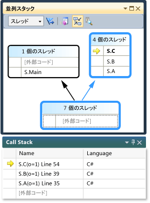
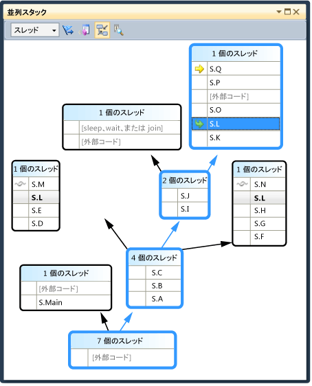
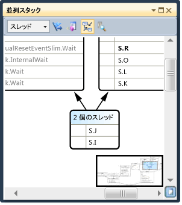

# チュートリアル: Visual Studio での並列アプリケーションのデバッグ
このチュートリアルで使用する方法、**並列タスク**と**並列スタック**windows 並列アプリケーションをデバッグします。 これらのウィンドウでは、把握し、使用するコードの実行時の動作を検証できます。、[タスク並列ライブラリ (TPL)](/dotnet/standard/parallel-programming/task-parallel-library-tpl)または[同時実行ランタイム](/cpp/parallel/concrt/concurrency-runtime)します。 このチュートリアルには、ブレークポイントが組み込まれたサンプル コードが用意されています。 このチュートリアルで使用する方法を示します、コードでは後、**並列タスク**と**並列スタック**ことを確認する windows。  
  
 このチュートリアルでは、次のタスクについて説明します。  
  
-   すべてのスレッドの呼び出し履歴を 1 つのビューに表示する方法  
  
-   アプリケーションで作成された `System.Threading.Tasks.Task` インスタンスの一覧を表示する方法  
  
-   スレッドではなくタスクの実際の呼び出し履歴を表示する方法  
  
-   コードに移動する方法、**並列タスク**と**並列スタック**windows。  
  
-   グループ化やズームなどの機能を使用してウィンドウの表示を調整する方法  
  
## 必須コンポーネント  
 このチュートリアルで**マイ コードのみ**が有効 (既定より新しいバージョンの Visual Studio では有効です)。 **ツール** メニューのをクリックして**オプション**、展開、**デバッグ**ノードの **全般**、し、**を有効にします。(マネージのみ) マイ コードのみ**します。 この機能が設定されていなくてもこのチュートリアルを使用できますが、図と異なる結果になる可能性があります。  
  
## C# のサンプル  
 C# のサンプルを使用する場合は、外部コードが非表示になっていることも前提になります。 外部コードが表示されるかどうかを切り替えるを右クリックし、**名前**のテーブル ヘッダー、**呼び出し履歴**ウィンドウで、オンまたはオフ**外部コードの表示**します。 この機能が設定されていなくてもこのチュートリアルを使用できますが、図と異なる結果になる可能性があります。  
  
## C++ のサンプル  
 C++ のサンプルを使用する場合は、このトピックの外部コードに関する記述は無視してかまいません。 外部コードに関する記述が当てはまるのは C# のサンプルだけです。  
  
## 図  
 このトピックの図は、C# のサンプルを実行するクアッド コア コンピューターで記録されたものです。 他の構成を使用してこのチュートリアルを実行することもできますが、画面の表示が図と同じにならない場合があります。  
  
## サンプル プロジェクトの作成  
 このチュートリアルのサンプル コードは、何もしないアプリケーションのコードです。 ここでの目的は、ツール ウィンドウを使用して並行アプリケーションをデバッグする方法を理解することだけです。  
  
#### サンプル プロジェクトを作成するには  
  
1.  Visual Studio で、**[ファイル]** メニューの **[新規作成]** をポイントし、**[プロジェクト]** をクリックします。  
  
2.  いずれかを選択**Visual c#**、 **Visual Basic**、または**Visual C**します。 マネージド言語については、フレームワークのボックスに [!INCLUDE[net_v40_short](../code-quality/includes/net_v40_short_md.md)] が表示されていることを確認します。  
  
3.  **Windows デスクトップ**、選択**コンソール アプリケーション**順にクリックします**OK**します。 既定のデバッグ構成をそのまま使用します。  
  
4.  プロジェクトで .cpp、.cs、または .vb コード ファイルを開きます。 その内容を削除して、空のコード ファイルを作成します。  
  
5.  空のコード ファイルに、選択した言語の次のコードを貼り付けます。  
  
 [!code-csharp[Debugger#1](../debugger/codesnippet/CSharp/walkthrough-debugging-a-parallel-application_1.cs)]
 [!code-cpp[Debugger#1](../debugger/codesnippet/CPP/walkthrough-debugging-a-parallel-application_1.cpp)]
 [!code-vb[Debugger#1](../debugger/codesnippet/VisualBasic/walkthrough-debugging-a-parallel-application_1.vb)]  
  
1.  **ファイル** メニューのをクリックして**すべて保存**します。  
  
2.  **ビルド** メニューのをクリックして**ソリューションのリビルド**します。  
  
     このコードには、`Debugger.Break` の呼び出しが 4 つあります (C++ サンプルの場合は `DebugBreak`)。したがって、ブレークポイントを挿入する必要はありません。そのまま実行するだけで、デバッガーでアプリケーションの実行が 4 回中断されます。  
  
## [並列スタック] ウィンドウの使用: スレッド ビュー  
 **[デバッグ]** メニューの **[デバッグの開始]** をクリックします。 1 つ目のブレークポイントにヒットするまで待ちます。  
  
#### 1 つのスレッドの呼び出し履歴を表示するには  
  
1.  **デバッグ**メニューで、 **Windows**  をクリックし、**スレッド**します。 ドッキング ステーション、**スレッド**Visual Studio の下部にあるウィンドウ。  
  
2.  **デバッグ**メニューで、 **Windows**  をクリックし、**呼び出し履歴**します。 ドッキング ステーション、**呼び出し履歴**Visual Studio の下部のウィンドウ。  
  
3.  内のスレッドをダブルクリックして、**スレッド**を現在のウィンドウ。 現在のスレッドには黄色の矢印が表示されます。 現在のスレッドを変更すると、その呼び出し履歴に表示されます、**呼び出し履歴**ウィンドウ。  
  
#### [並列スタック] ウィンドウを調べるには  
  
1.  **デバッグ**メニューで、 **Windows**  をクリックし、**並列スタック**します。 必ず**スレッド**が左上隅にあるボックスで選択されています。  
  
     使用して、**並列スタック**ウィンドウで、1 つのビューと同時に複数の呼び出し履歴を表示することができます。 次の図は、**並列スタック**ウィンドウの上、**呼び出し履歴**ウィンドウ。  
  
       
  
     一方のボックスにはメイン スレッドの呼び出し履歴が表示され、もう一方のボックスには他の 4 つのスレッドの呼び出し履歴がグループ化されて表示されています。 4 つのスレッドがグループ化されているのは、これらのスレッドのスタック フレームが同じメソッド コンテキストを共有している (`A`、`B`、`C` という同じメソッドにある) からです。 スレッド Id と同じボックスで、共有しているスレッドの名前は、ボックスに、ヘッダーを合わせるビューに (**4 つのスレッド**)。 現在のスレッドが太字で表示されます。  
  
       
  
     黄色の矢印は、現在のスレッドのアクティブなスタック フレームを示します。
  
     スタック フレームを表示する量の詳細情報を設定することができます (**モジュール名**、**パラメーターの型**、**パラメーター名**、**パラメーター値**、**行番号**と**バイト オフセット**) 内を右クリックして、**呼び出し履歴**ウィンドウ。  
  
     ボックスを囲む青の強調表示は、そのボックスに現在のスレッドが含まれていることを示します。 現在のスレッドは、ツールヒントで太字のスタック フレームによっても示されます。 観察できます [スレッド] ウィンドウでメイン スレッドをダブルクリックすると場合に、青の強調表示、**並列スタック**ウィンドウが適切に移動します。  
  
       
  
#### 2 つ目のブレークポイントまで実行を再開するには  
  
1.  2 つ目のブレークポイントがヒットするまで実行を再開する、**デバッグ** メニューのをクリックして**続行**します。 次の図は、2 つ目のブレークポイントのスレッド ツリーを示しています。  
  
       
  
     1 つ目のブレークポイントでは、4 つのスレッドのすべてが、S.A メソッド、S.B メソッド、S.C メソッドの順に進んでいました。 情報にまだ表示されていること、**並列スタック**ウィンドウが 4 つのスレッドがさらにわたって進行します。 そのうちの 1 つは、S.D、S.E の順に進んでいます。 また別のスレッドは、S.F、S.G、S.H の順に進んでいます。 残りの 2 つは、S.I、S.J の順に進み、そこから一方は S.K に進み、もう一方は非ユーザー外部コードに進んでいます。  
  
     たとえば、ボックス ヘッダーをポイントする**1 スレッド**または**2 つのスレッド**スレッドのスレッドの Id を確認します。 スタック フレームをポイントすると、スレッド ID とフレームのその他の詳細が表示されます。 青の強調表示は現在のスレッドを示し、黄色の矢印は現在のスレッドのアクティブなスタック フレームを示します。  
  
     (行を interweaved) より糸のアイコンは、現在のスレッドのアクティブなスタック フレームを示します。 **呼び出し履歴**ウィンドウ フレームを切り替えます S.B をダブルクリックします。 **並列スタック**ウィンドウは、緑色の曲線矢印アイコンを使用して、現在のスレッドの現在のスタック フレームを示します。  
  
     **スレッド**ウィンドウで、スレッド間で切り替えるされることを確認のビュー、**並列スタック**ウィンドウを更新します。  
  
     ショートカット メニューを使用して、別のスレッドまたは別のフレームを別のスレッドを切り替えることができます、**並列スタック**ウィンドウ。 たとえば、S.J を右クリックし、 をポイント**フレームに切り替え**コマンドを順にクリックします。  
  
       
  
     S.C を右クリックし をポイント**フレームに切り替え**します。 チェック マークが付いているコマンドがあります。これは、現在のスレッドのスタック フレームを示します。 その同じスレッドのフレームに切り替えることも (緑色の矢印のみが移動します)、他のスレッドに切り替えることもできます (青の強調表示も移動します)。 次の図は、このサブメニューを示しています。  
  
       
  
     メソッドのコンテキストが 1 つのスタック フレームに関連付けられている場合は、ボックス ヘッダーを表示します**1 スレッド**をダブルクリックして切り替えることができます。 複数のフレームが関連付けられているメソッド コンテキストをダブルクリックすると、自動的にメニューがポップアップ表示されます。 メソッド コンテキストをポイントすると右側に表示される黒い三角形を クリックして、このショートカット メニューを表示することもできます。  
  
     多数のスレッドを持つ大規模なアプリケーションでは、一部のスレッドのみに焦点を絞ることもできます。 **並列スタック**ウィンドウのみのフラグが設定されたスレッドの呼び出し履歴を表示できます。 スレッドにフラグを設定するには、ショートカット メニューを使用するか、スレッドの最初のセルを使用します。 

     ツールバーの**表示のみにフラグが設定された**リスト ボックスの横にあるボタンをクリックします。  

       

     ここで、フラグが設定されたスレッドのみに表示されます、**並列スタック**ウィンドウ。
  
#### 3 つ目のブレークポイントまで実行を再開するには  
  
1.  3 つ目のブレークポイントがヒットするまで実行を再開する、**デバッグ** メニューのをクリックして**続行**します。  
  
     同じメソッドに複数のスレッドがあるが、そのメソッドが呼び出し履歴の先頭にない場合、そのメソッドは複数のボックスに表示されます。 たとえば、現在のブレークポイントの S.L がこれに当たります。このメソッドは 3 つのスレッドを持ち、3 つのボックスに表示されています。 S.L をダブルクリックします。  
  
       
  
     他の 2 つのボックスで S.L が太字になっていることに注目してください。これにより、このメソッドが他にどこにあるのかがわかります。 S.L を呼び出すし、どのフレームを表示する場合、をクリックして、**メソッド ビューの切り替え**ツールバーのボタンをクリックします。 次の図のメソッド ビュー、**並列スタック**ウィンドウ。  
  
       
  
     選択したメソッドを中心とする図が表示されます。選択したメソッドが固有のボックスに入れられて、ビューの中心に配置されます。 その上下には、呼び出し先と呼び出し元が表示されます。 をクリックして、**メソッド ビューの切り替え**ボタンをもう一度このモードのままにします。  
  
     ショートカット メニュー、**並列スタック**ウィンドウは、次もがその他の項目。  
  
    -   **16 進表示**10 進数と 16 進数のツールヒントの数値を切り替えます。  
  
    -   **シンボルの設定**それぞれのダイアログ ボックスを開きます。  
  
    -   **ソースのスレッドを表示**ソース コード内のスレッドの場所が表示されるソース コードでスレッド マーカーの表示を切り替えます。
  
    -   **外部コードの表示**ユーザー コードでない場合でも、すべてのフレームを表示します。 この項目を選択し、図に追加のフレームが表示されることを確認してください (シンボルがないために選択不可になっている可能性があります)。  

2.  **並列スタック**ウィンドウで、ことを確認、**現在のスタック フレームに自動スクロール**ツールバーのボタンがオン。  

     大きな図がある場合は、次のブレークポイントにステップするときに、現在のスレッド (最初にブレークポイントにヒットしたスレッド) のアクティブなスタック フレームまでビューが自動的にスクロールするようにすることができます。
  
3.  続行する前で、**並列スタック**ウィンドウで、左、下に至るすべての方法をスクロールします。  
  
#### 4 つ目のブレークポイントまで実行を再開するには  
  
1.  4 つ目のブレークポイントがヒットするまで実行を再開する、**デバッグ** メニューのをクリックして**続行**します。  
  
     ビューが適切な位置まで自動的にスクロールすることに注目してください。 スレッドを切り替えたり、**スレッド**でウィンドウまたはスイッチのスタック フレーム、**呼び出し履歴**ウィンドウに注目して方法ビュー適切なフレームを常に自動でスクロールします。 オフにする**ツールの現在のフレームに自動スクロール**オプションし、の差異を表示します。  
  
     **バード アイ ビュー**で大きな図があることができます、**並列スタック**ウィンドウ。 既定で、**バード アイ ビュー**にします。 ただし、次の図に示すように、ウィンドウの右上隅にあるスクロール バーのボタンをクリックして切り替えることができます。  
  
       
  
     バード アイ ビューでは、ダイアグラムをすばやくパンする四角形を移動することができます。  
  
     図を任意の方向に移動するには、図の空白の領域をクリックして目的の方向にドラッグすることもできます。  
  
     図を拡大/縮小するには、Ctrl キーを押しながらマウス ホイールを動かします。 または、ツール バーの [ズーム] ボタンをクリックしてズーム ツールを使用します。  
  
     クリックして、ボトムアップではなく上から下方向にスタックを表示することも、**ツール**] メニューの [**オプション**、選択するか、下のオプションをオフに、**デバッグ**ノード。  
  
2.  進む前に、**デバッグ** メニューのをクリックして**デバッグの停止**実行を終了します。  
  
## [並列タスク] ウィンドウと、[並列スタック] ウィンドウのタスク ビューの使用  
 先に進む前に前の手順を完了することをお勧めします。  
  
#### 1 つ目のブレークポイントにヒットするまでアプリケーションの実行を再開するには  
  
1.  **デバッグ** メニューのをクリックして**デバッグの開始**し、最初のブレークポイントにヒットするまで待ちます。  
  
2.  **デバッグ**メニューで、 **Windows**  をクリックし、**スレッド**します。 ドッキング ステーション、**スレッド**Visual Studio の下部にあるウィンドウ。  
  
3.  **デバッグ**メニューで、 **Windows**クリック**呼び出し履歴**。 ドッキング ステーション、**呼び出し履歴**Visual Studio の下部のウィンドウ。  
  
4.  内のスレッドをダブルクリックして、**スレッド**ウィンドウには、現在します。 現在のスレッドには黄色の矢印が表示されます。 現在のスレッドを変更すると、他のウィンドウが更新されます。 次に、タスクについて調べます。  
  
5.  **デバッグ**メニューで、 **Windows**、 をクリックし、**タスク**します。 次の図は、**タスク**ウィンドウ。  
  
     ![[タスク] ウィンドウのタスクを実行している 4 つ](../debugger/media/pdb_walkthrough_6.png "PDW_Walkthrough_6")  
  
     実行中の各タスクについて、タスクの ID (同名のプロパティから返されます)、そのタスクを実行しているスレッドの ID と名前、およびタスクの場所 (ここをポイントすると、ツールヒントに呼び出し履歴全体が表示されます) が表示されます。 また、下、**タスク**列で、タスクに渡されたメソッドがわかります。 つまり、開始点。  
  
     この一覧は、任意の列で並べ替えることができます。 並べ替えグリフにより、並べ替えの列と方向が示されます。 列を左右にドラッグして列の順序を変更することもできます。  
  
     黄色の矢印は現在のタスクを示します。 タスクを切り替えるには、タスクをダブルクリックするか、ショートカット メニューを使用します。 タスクを切り替えると、基になるスレッドが現在のスレッドになり、他のウィンドウが更新されます。  
  
     タスクを手動で切り替えると黄色の矢印が移動しますが、デバッガーが中断されたタスクは引き続き白の矢印によって示されます。  
  
#### 2 つ目のブレークポイントまで実行を再開するには  
  
1.  2 つ目のブレークポイントがヒットするまで実行を再開する、**デバッグ** メニューのをクリックして**続行**します。  
  
     以前は、**状態**列で、アクティブなとしてすべてのタスクについて説明しましたが、2 つのタスクがブロックされるようになりました。 タスクがブロックされるのにはさまざまな理由があります。 **状態**列で、ブロックされている理由については、待機中のタスクをポイントします。 たとえば、次の図では、タスク 3 はタスク 4 を待機しています。  
  
     ![[タスク] ウィンドウの 2 つの待機中タスク](../debugger/media/pdb_walkthrough_7.png "PDB_Walkthrough_7")  
  
     一方、タスク 4 は、タスク 2 に割り当てられているスレッドが所有するモニターを待機しています。 (ヘッダー行を右クリックし **列** > **スレッド割り当て**タスク 2 のスレッドの割り当ての値を表示する)。
  
     
  
     最初の列でフラグをクリックして、タスクにフラグを設定することができます、**タスク**ウィンドウ。  
  
     フラグを使用するには、同じデバッグ セッションで異なるブレークポイントの間のタスクを追跡するために、タスクが呼び出し履歴を表示したり、**並列スタック**ウィンドウ。  
  
     使用したときに、**並列スタック**ウィンドウ以前では、アプリケーションのスレッドを表示します。 ビュー、**並列スタック**ウィンドウをもう一度、今度は、アプリケーションのタスクを表示します。 これには、選択**タスク**ボックスの左上でします。 次の図は、タスク ビューを示しています。  
  
       
  
     [タスク] ビューに現在のタスクを実行していないスレッドは表示されません、**並列スタック**ウィンドウ。 タスクを実行するスレッドについても、タスクに関連しないスタック フレームはスタックの上下からフィルターで除外されます。  
  
     ビュー、**タスク**ウィンドウをもう一度です。 任意の列ヘッダーを右クリックして、その列のショートカット メニューを表示します。  
  
     ショートカット メニューを使用して、列を追加したり削除したりすることができます。 たとえば、[AppDomain] 列は選択されていないため、一覧に表示されていません。 クリックして**親**します。 **親**4 つのタスクのいずれかの値を使用せずに列が表示されます。  
  
#### 3 つ目のブレークポイントまで実行を再開するには  
  
1.  3 つ目のブレークポイントがヒットするまで実行を再開する、**デバッグ** メニューのをクリックして**続行**します。  
  
     新しいタスク (タスク 5) が実行中になり、タスク 4 は待機中になっています。 待機中のタスクでポインターを合わせると、理由を確認できます、**状態**ウィンドウ。 **親**列に、そのタスク 4 タスク 5 の親であるに注意してください。  
  
     親子リレーションシップを表示するより適切に列ヘッダー行を右クリックし、**親子ビュー**します。 次の図のような画面が表示されます。  
  
       
  
     タスク 4 とタスク 5 が同じスレッドで実行されていることに注意してください (表示、**スレッド割り当て**列を非表示になっている場合)。 この情報は表示されません、**スレッド**ウィンドウ; のもう 1 つのメリットです、**タスク**ウィンドウ。 これを確認するには表示、**並列スタック**ウィンドウ。 表示されていることを確認**タスク**します。 タスク 4 と 5 をダブルクリックすることにより検索、**タスク**ウィンドウ。 ときに行うと、青の強調表示、**並列スタック**ウィンドウを更新します。 ツールヒントをスキャンして、タスク 4 と 5 を検索することも、**並列スタック**ウィンドウ。  
  
       
  
     **並列スタック**ウィンドウで、S.P を右クリックし をクリックし、**スレッドに移動**します。 ウィンドウがスレッド ビューに切り替わり、対応するフレームが表示されます。 両方のタスクが同じスレッドにあることがわかります。  
  
       
  
     これは、タスク ビューのもう 1 つのメリット、**並列スタック**と比較すると、ウィンドウ、**スレッド**ウィンドウ。  
  
#### 4 つ目のブレークポイントまで実行を再開するには  
  
1.  3 つ目のブレークポイントがヒットするまで実行を再開する、**デバッグ** メニューのをクリックして**続行**します。 をクリックして、 **ID**列ヘッダーを ID で並べ替えます。 次の図のような画面が表示されます。  
  
       
  
     タスク 5 は完了したため、もう表示されません。 コンピューターの場合は状況が、デッドロックが表示されていない場合は、キーを押して 1 回をステップ**F11**します。  
  
     タスク 3 とタスク 4 は、互いに待機しているようになりましたや、ブロックされます。 また、5 つの新しいタスクがあります。これらはタスク 2 の子で、現在スケジュールされているタスクです。 スケジュールされたタスクとは、コードで開始されているがまだ実行されていないタスクです。 そのため、その**場所**と**スレッドの割り当て**列は空です。  
  
     ビュー、**並列スタック**ウィンドウをもう一度です。 各ボックスのヘッダーをポイントすると、ツールヒントにスレッドの ID と名前が表示されます。 タスク ビューに切り替え、**並列スタック**ウィンドウ。 次の図のようにヘッダーをポイントして、タスクの ID、名前、および状態を確認します。  
  
       
  
     タスクを列でグループ化することもできます。 **タスク**ウィンドウで、右クリックし、**状態**列ヘッダーをクリック**状態でグループ化**します。 次の図は、**タスク**状態でグループ化されたウィンドウ。  
  
     ![[タスク] ウィンドウのタスクをグループ化](../debugger/media/pdb_walkthrough_12.png "PDB_Walkthrough_12")  
  
     ほかにも任意の列でグループ化できます。 タスクをグループ化すると、一部のタスクに焦点を絞ることができます。 各グループは折りたたみ可能で、それぞれにグループ化されている項目の数が表示されます。
  
     最後の機能、**タスク**ウィンドウを調べるには、タスクを右クリックしたときに表示されるショートカット メニュー。  
  
     このショートカット メニューに表示されるコマンドは、タスクの状態によって異なります。 コマンドを含めることができます**コピー**、**すべて選択**、 **16 進数表示**、**タスクに切り替える**、**固定割り当てられています。スレッド**、**がすべてのスレッドを凍結**、および**割り当てられたスレッドの凍結解除**、および**フラグ**します。  
  
     1 つまたは複数のタスクの基になるスレッドを凍結したり、割り当てられたスレッド以外のすべてのスレッドを凍結したりすることができます。 表される、凍結されたスレッド、**タスク**ほどの期間が、**スレッド**ウィンドウは、青い*を一時停止*アイコン。  
  
## まとめ  
 このチュートリアルでは説明、**並列タスク**と**並列スタック**デバッガー ウィンドウ。 マルチスレッド コードを使用する実際のプロジェクトでこれらのウィンドウを使用してみてください。 C++、C#、または Visual Basic で記述された並列コードを調べることができます。  
  
## 関連項目  
 [マルチ スレッド アプリケーションのデバッグ](../debugger/walkthrough-debugging-a-parallel-application.md)   
 [デバッガーの基本事項](../debugger/getting-started-with-the-debugger.md)   
 
  [マネージド コードをデバッグする](../debugger/debugging-managed-code.md)   
 [並列プログラミング](/dotnet/standard/parallel-programming/index)   
 [同時実行ランタイム](/cpp/parallel/concrt/concurrency-runtime)   
 [並列スタック ウィンドウの使用](../debugger/using-the-parallel-stacks-window.md)   
 [[タスク] ウィンドウの使用](../debugger/using-the-tasks-window.md)