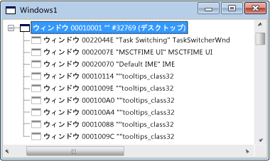

# ウィンドウ ビュー
最初に開いたとき Spy++ は、Windows ビューには、システム内のすべての windows とコントロールのツリーが表示されます。 ウィンドウ ハンドルとクラス名が表示されます。 現在のデスクトップ ウィンドウでは、ツリーの最上部にします。 その他のすべての windows は、デスクトップの子であるし、標準的なウィンドウの階層構造に従って一覧表示されます。 展開できる一覧がその親の下にインデントに兄弟ウィンドウが表示されます。

 次の図は、最上位ノードを展開で一般的な Windows spy++ ビューを示します。

  spy++ Windows ビュー

 現在のデスクトップ ウィンドウでは、ツリーの最上部にします。 その他のすべての windows は、デスクトップの子であるし、は、標準ウィンドウの階層に応じて兄弟ウィンドウが Z オーダーの順に一覧表示します。 展開したり、クリックして、ツリーの任意の親ノードを折りたたむ、+ または - 記号、ノードの横にあります。

 Windows ビューにフォーカスがある場合のファインダー ツールを使用することができます、[ウィンドウ検索 ダイアログ ボックス](../debugger/window-search-dialog-box.md)システムに、ウィンドウを開いてから情報を表示します。

## このセクションの内容
 [方法: ファインダー ツールを使用して、](../debugger/how-to-use-the-finder-tool.md)このツールがウィンドウのプロパティまたはメッセージをスキャンする方法を示しています。

 [方法: Windows のビューでウィンドウの検索](../debugger/how-to-search-for-a-window-in-windows-view.md)Windows ビューで特定のウィンドウを検索する方法について説明します。

 [方法: ウィンドウのプロパティを表示](../debugger/how-to-display-window-properties.md)ウィンドウ プロパティ ダイアログ ボックスを開くために m プロシージャ。

## 関連項目
 [Spy++ ビュー](../debugger/spy-increment-views.md) spy++ ツリー ビュー ウィンドウやメッセージ、プロセス、スレッドのについて説明します。

 [Spy++ の使用](../debugger/using-spy-increment.md)の spy++ ツールを紹介し、使用する方法について説明します。

 [検索ウィンドウ ダイアログ ボックス](../debugger/find-window-dialog-box.md)プロパティまたは特定のウィンドウからメッセージを表示するために使用します。

 [ウィンドウ検索 ダイアログ ボックス](../debugger/window-search-dialog-box.md)Windows ビューで特定のウィンドウのノードを検索するために使用します。

 [ウィンドウのプロパティ ダイアログ ボックス](../debugger/window-properties-dialog-box.md)Windows ビューで選択したウィンドウのプロパティを表示するために使用します。

 [Spy++ リファレンス](../debugger/spy-increment-reference.md)各 spy++ メニューおよびダイアログ ボックスについて説明するセクションが含まれています。