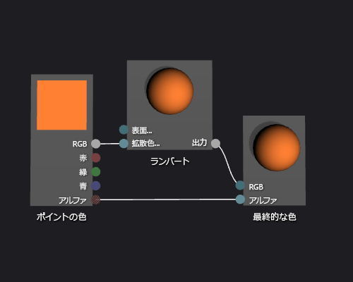

# 方法: 基本ランバート シェーダーを作成する

この記事では、シェーダー デザイナーと DGSL (Directed Graph Shader Language) を使用してクラシック ランバート照明モデルを実装するためのライティング シェーダーを作成する方法について説明します。

## ランバート照明モデル

ランバート照明モデルには、3D シーン内のオブジェクトに陰影をつけるためのアンビエント照明と指向性照明が組み込まれています。 アンビエント コンポーネントは、3D シーン内の照明の基本レベルとなります。 指向性コンポーネントは、指向性 (遠隔) 光源からの追加の照明となります。 アンビエント照明は、サーフェイスの向きに関係なく、シーン内のすべてのサーフェイスに均等に影響を及ぼします。 ある特定のサーフェイスでは、これはサーフェイスのアンビエント色とシーン内のアンビエント照明の色および輝度で決まります。 指向性照明がシーン内のサーフェイスに与える影響は、光源の方向に対するサーフェイスの向きによって、サーフェイスごとに異なります。 これは、サーフェイスの拡散色および向きと、光源の色、輝度、方向で決まります。 光源に直接面しているサーフェイスは最大の効果を受け、反対側のサーフェイスは効果を受けません。 ランバート照明モデルでは、アンビエント コンポーネントと 1 つ以上の指向性コンポーネントの組み合わせで、オブジェクトの各ポイントの総拡散色効果が決まります。

開始する前に、 **[プロパティ]** ウィンドウと**ツールボックス**が表示されていることを確認します。

1. 操作する DGSL シェーダーを作成します。 プロジェクトに DGSL シェーダーを追加する方法については、「[シェーダー デザイナー](../designers/shader-designer.md)」の「作業の開始」を参照してください。

2. **[最終的な色]** ノードから **[ポイントの色]** ノードを接続解除します。 **[ポイントの色]** ノードの **[RGB]** ターミナルを選択し、 **[リンクの解除]** を選択します。 **アルファ** ターミナルは接続したままにしておきます。

3. グラフに **[ランバート]** ノードを追加します。 **ツールボックス**の **[ユーティリティ]** で **[ランバート]** を選択し、デザイン サーフェイスに移動します。 ランバート ノードは、アンビエントおよび拡散照明パラメーターに基づいて、ピクセルの総拡散色効果を計算します。

4. **[ポイントの色]** ノードを **[ランバート]** ノードに接続します。 **[選択]** モードで、 **[ポイントの色]** ノードの **[RGB]** ターミナルを、 **[ランバート]** ノードの **[拡散色]** ターミナルに移動します。 この接続により、ランバート ノードに対してピクセルの拡散色が補間されます。

5. 計算された色の値を最終的な色に接続します。 **[ランバート]** ノードの **[出力]** ターミナルを、 **[最終的な色]** ノードの **[RGB]** ターミナルに移動します。

   次の図は、完成したシェーダー グラフと、ティーポット モデルに適用されるシェーダーのプレビューを示しています。

> [!NOTE]
> この図では、シェーダーの効果を分かりやすくするために、シェーダーの **MaterialDiffuse** パラメーターを使用してオレンジ色が指定されています。 このパラメーターをゲームやアプリで使用して、オブジェクトごとに一意の色値を指定できます。 マテリアル パラメーターについては、「[シェーダー デザイナー](../designers/shader-designer.md)」の「シェーダーのプレビュー」を参照してください。

シェーダーによっては、特定の図形でより適切にプレビューできる可能性があります。 シェーダー デザイナーでシェーダーをプレビューする方法の詳細については、「[シェーダー デザイナー](../designers/shader-designer.md)」の「シェーダーのプレビュー」を参照してください。

次の図は、このドキュメントで説明した、3D モデルに適用されるシェーダーを示しています。

3D モデルにシェーダーを適用する方法の詳細については、「[方法: シェーダーを 3D モデルに適用する](../designers/how-to-apply-a-shader-to-a-3-d-model.md)」を参照してください。

## 参照

- [方法: シェーダーを 3D モデルに適用する](../designers/how-to-apply-a-shader-to-a-3-d-model.md)
- [方法: シェーダーをエクスポートする](../designers/how-to-export-a-shader.md)
- [方法: 基本フォン シェーダーを作成する](../designers/how-to-create-a-basic-phong-shader.md)
- [シェーダー デザイナー](../designers/shader-designer.md)
- [シェーダー デザイナー ノード](../designers/shader-designer-nodes.md)
