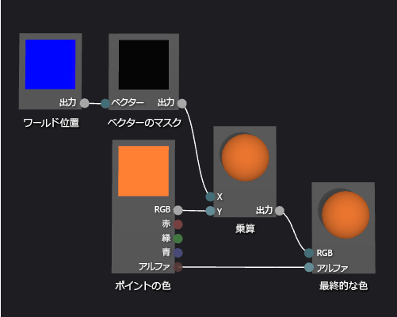

# 方法: ジオメトリベースのグラデーション シェーダーを作成する
[!INCLUDE[vs2017banner](../code-quality/includes/vs2017banner.md)]

このドキュメントでは、シェーダー デザイナーおよび Directed Graph Shader Language を使用してジオメトリ ベースのグラデーション シェーダーを作成する方法を説明します。  このシェーダーは、ワールド空間におけるオブジェクトの各ポイントの高さによって定数 RGB カラー値をスケーリングします。  
  
 このドキュメントでは、以下のアクティビティについて説明します。  
  
-   シェーダー グラフにノードを追加する  
  
-   ノード プロパティの設定  
  
-   ノードをクリッピング  
  
-   ノードの接続  
  
## ジオメトリ ベースのグラデーション シェーダーの作成  
 シェーダーにピクセルの位置を組み込むことによって、ジオメトリ ベースのシェーダーを実装できます。  網かけの言語では、2 番目のピクセルは画面のカラーと場所より詳細な情報が含まれています。  複数の *フラグメントを* ピクセルに対応する表面を表す値のコレクション システムであるためピクセルわかっている。  このドキュメントで説明するシェーダーは、フラグメントの最終的な出力色に影響を与えるためにワールド空間の 3D オブジェクト内の各ピクセルの高さを使用します。  
  
 開始する前に、**プロパティ** ウィンドウと**ツールボックス**が表示されていることを確認します。  
  
#### ジオメトリ ベースのグラデーション シェーダーを作成するには  
  
1.  操作する DGSL シェーダーを作成します。  プロジェクトに DGSL シェーダーを追加する方法については、「[シェーダー デザイナー](../designers/shader-designer.md)」の「作業の開始」を参照してください。  
  
2.  **\[最終的な色\]** ノードから **\[ポイントの色\]** ノードを接続解除します。  **\[ポイントの色\]** ノードの **\[RGB\]** ターミナルを選択し、**\[リンクの解除\]** をクリックします。  これにより、次の手順で追加するノードのための領域を確保できます。  
  
3.  グラフに **\[乗算記号\]** ノードを追加します。  **ツールボックス**の **\[数式\]** で **\[乗算記号\]** をクリックし、デザイン サーフェイスに移動します。  
  
4.  グラフに **\[ベクターのマスク\]** ノードを追加します。  **ツールボックス**の **\[ユーティリティ\]** で **\[ベクターのマスク\]** をクリックし、デザイン サーフェイスに移動します。  
  
5.  **\[ベクターのマスク\]** ノードのマスク値を指定します。  次に **\[選択\]** モードでは、**\[プロパティ\]** ウィンドウの **\[ベクターのマスク\]** ノードを設定し、**\[Green \/ Y\]** のプロパティを **\[True\]** に移動し、**\[False\]** に設定します **\[Red \/ X\]**、**\[Blue \/ Z\]** と **\[Alpha \/ W\]** のプロパティをクリックします。  この例では、**\[Red \/ X\]**、**\[Green \/ Y\]** と **\[Blue \/ Z\]** のプロパティは **\[ワールド位置\]** ノードの x、y、および z コンポーネントに対応し、**\[Alpha \/ W\]** は使用されません。  マスク後 **\[Green \/ Y\]** のみ **\[True\]** に設定されるため、入力のベクターの y コンポーネントだけが残ります。  
  
6.  グラフに **\[ワールド位置\]** ノードを追加します。  **ツールボックス**の **\[定数\]** で **\[ワールド位置\]** をクリックし、デザイン サーフェイスに移動します。  
  
7.  フラグメントのワールド空間の位置をマスクします。  **\[選択\]** モードで、**\[ワールド位置\]** ノードの **\[出力\]** ターミナルを **\[ベクターのマスク\]** ノードの **\[ベクター\]** ターミナルに移動します。  この接続は、フラグメントの位置をマスクして x コンポーネントと z コンポーネントを無視します。  
  
8.  マスクされたワールド空間の位置で RGB カラー定数を乗算します。  **\[ポイントの色\]** ノードの **\[RGB\]** ターミナルを **\[乗算記号\]** ノードの **\[Y\]** ターミナルに移動し、**\[乗算記号\]** ノードの **\[X\]** ターミナルに **\[ベクターのマスク\]** ノードの **\[出力\]** ターミナルに移動します。  この接続はワールド空間のピクセルの高さによりカラー値をスケーリングします。  
  
9. スケーリングされたカラー値を最終的な色に接続します。  **\[最終的な色\]** ノードの **\[RGB\]** ターミナルに **\[乗算記号\]** ノードの **\[出力\]** ターミナルに移動します。  
  
 次の図は、完了したシェーダー グラフと球に適用されるシェーダーのプレビューを示します。  
  
> [!NOTE]
>  この図では、シェーダーの効果をわかりやすく示すためにオレンジ色が指定されていますが、ワールド空間にプレビュー図形の位置がないため、シェーダー デザイナーでシェーダーを完全にプレビューすることができません。  完全な効果を確認するには、シェーダーを実際のシーンでプレビューする必要があります。  
  
   
  
 特定の図形を使用すると、シェーダーをより適切にプレビューできる可能性があります。  シェーダー デザイナーでシェーダーをプレビューする方法の詳細については、[シェーダー デザイナー](../designers/shader-designer.md)の **シェーダーのプレビュー** を参照してください。  
  
 次の図は、このドキュメントで説明したシェーダーを「[方法: 3\-D 地形をモデル化する](../designers/how-to-model-3-d-terrain.md)」に示した 3\-D シーンに適用したものです。  ここでは、色の輝度がワールド空間のポイントの高さと共に増加しています。  
  
   
  
 3\-D モデルにシェーダーを適用する方法の詳細については、「[方法: シェーダーを 3\-D モデルに適用する](../designers/how-to-apply-a-shader-to-a-3-d-model.md)」を参照してください。  
  
## 参照  
 [方法: シェーダーを 3\-D モデルに適用する](../designers/how-to-apply-a-shader-to-a-3-d-model.md)   
 [方法: シェーダーをエクスポートする](../designers/how-to-export-a-shader.md)   
 [方法: 3\-D 地形をモデル化する](../designers/how-to-model-3-d-terrain.md)   
 [方法: グレースケール テクスチャ シェーダーを作成する](../designers/how-to-create-a-grayscale-texture-shader.md)   
 [シェーダー デザイナー](../designers/shader-designer.md)   
 [シェーダー デザイナー ノード](../designers/shader-designer-nodes.md)