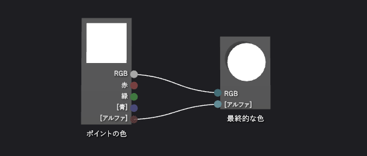
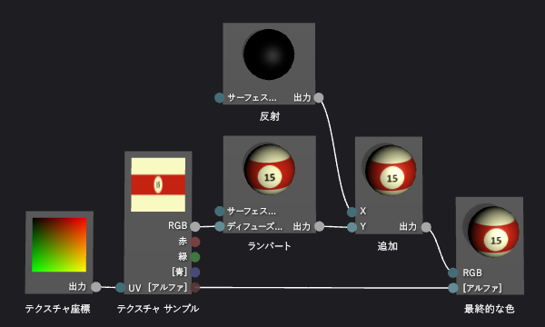

# チュートリアル: リアルな 3D のビリヤード ボールを作成する

このチュートリアルでは、Visual Studio でシェーダー デザイナーおよびイメージ エディターを使用して、リアルな 3D のビリヤード ボールを作成する方法について説明します。 ビリヤード ボールの 3D の外観は、適切なテクスチャのリソースと複数のシェーダー方法を組み合わせることによって実現します。

## 必須コンポーネント

このチュートリアルを実行するには、次のコンポーネントとスキルが必要です。

-   キューブ マップにテクスチャを統合するためのツール (June 2010 DirectX SDK に含まれる DirectX テクスチャ ツールなど)。

-   Visual Studio のイメージ エディターの知識。

-   Visual Studio のシェーダー デザイナーの知識。

## 図形およびテクスチャの基本的な外観を作成する

コンピューター グラフィックスで最も基本的な外観の要素は形と色です。 コンピューター シミュレーションでは、通常、現実世界のオブジェクトの形を表すために 3D モデルを使用します。 色の詳細は、テクスチャ マップを使用してモデルのサーフェイスに適用されます。

通常は、使用する 3D モデルの作成をアーティストに依頼する必要がありますが、ビリヤード ボールは一般的な図形 (球) であるため、シェーダー デザイナーには適切なモデルが組み込まれています。

球はシェーダー デザイナーの既定のプレビュー図形です。現在、シェーダーのプレビューで別の図形を使用している場合は、球に切り替えます。

### 球を使用してシェーダーをプレビューするには

-   シェーダー デザイナーのツール バーで、**[球でプレビュー]** を選択します。

 次の手順では、テクスチャをモデルに適用するシェーダー プログラムを作成しますが、最初に、使用するテクスチャを作成する必要があります。 このチュートリアルでは、イメージ エディターを使用してテクスチャを作成する方法を説明します。これは Visual Studio の一部ですが、適切な形式でテクスチャを保存できるすべてのイメージ エディターを使用できます。

 **[プロパティ]** ウィンドウと **[ツールボックス]** が表示されていることを確認します。

### イメージ エディターを使用してビリヤード ボールのテクスチャを作成するには

1.  操作するテクスチャを作成します。 プロジェクトにテクスチャを追加する方法については、「[イメージ エディター」](../designers/image-editor.md)の「作業の開始」を参照してください。

2.  イメージ サイズを設定し、幅が高さの 2 倍になるようにサイズを変更します。これは、ビリヤード ボールの球状のサーフェイスにテクスチャをマップする方法に必要となるためです。 イメージのサイズを変更するには、**[プロパティ]** ウィンドウの **[幅]** と **[高さ]** プロパティに適切な値を指定します。 たとえば、幅を 512、高さを 256 に設定します。

3.  テクスチャが球にどのようにマップされるかに留意しながら、ビリヤード ボールのテクスチャを描画します。

     テクスチャは次のようになります。

     

4.  必要に応じて、このテクスチャのストレージ要件を減らすこともできます。 これを行うには、テクスチャの幅を高さに合わせて縮小します。 幅に従ってテクスチャが圧縮されますが、テクスチャを球にマップする方法のため、ビリヤード ボールをレンダリングすると拡大されます。 サイズを変更すると、テクスチャは次のようになります。

     

 これで、このテクスチャをモデルに適用するシェーダーを作成できます。

### 基本的なテクスチャ シェーダーを作成するには

1.  操作する DGSL シェーダーを作成します。 プロジェクトに DGSL シェーダーを追加する方法に関する詳細については、「[シェーダー デザイナー](../designers/shader-designer.md)」の「作業の開始」セクションを参照してください。

     既定では、シェーダー グラフは次のようになります。

     

2.  テクスチャ サンプルの値が現在のピクセルに適用されるように、既定のシェーダーを変更します。 シェーダー グラフは次のようになります。

     

3.  テクスチャのプロパティを構成して、前の手順で作成したテクスチャを適用します。 **[テクスチャ サンプル]** ノードの **[テクスチャ]** プロパティの値を **[Texture1]** に設定し、同じプロパティ ウィンドウで **[Texture1]** プロパティ グループの **[ファイル名]** プロパティを使用して、テクスチャ ファイルを指定します。

 シェーダーでテクスチャを適用する方法の詳細については、「[方法: 基本テクスチャ シェーダーを作成する](../designers/how-to-create-a-basic-texture-shader.md)」を参照してください。

 ビリヤード ボールは、次のようになります。

 

## ランバート照明モデルを使用して奥行を作成する

これまでは、簡単に認識できるビリヤード ボールを作成してきました。 ただし、フラットで面白味がなく、真に迫った複製ではなく漫画のビリヤード ボールのように見えます。 単純なシェーダーのため外観がフラットになり、ビリヤード ボールのサーフェイスの各ピクセルが同じ光量を受けているように見えます。

 実際には、光は、光源に直接面するサーフェイスで最も明るく見え、光源に対して斜角にあるサーフェイスではやや暗く見えます。 これは、サーフェイスが光源に直接面するときに、光線のエネルギーが最も小さいサーフェイス領域に分散されるためです。 サーフェイスが光源から遠いほど、同じ量のエネルギーが大きいサーフェイス領域に分散されます。 光源の反対側に面しているサーフェイスは光エネルギーをまったく受けないので、完全に暗い外観になります。 オブジェクトのサーフェイス全体での明るさのばらつきは、オブジェクトの形を示すのに役立つ重要な視覚上の手掛かりです。これがないと、オブジェクトがフラットに見えます。

 コンピューター グラフィックスでは、複雑な実際の照明相互作用の単純化された近似である*照明モデル*を使用して、実際の照明の外観を複製します。 前に説明したように、ランバート照明モデルは、オブジェクトのサーフェイス全体に拡散反射される光の量を変えます。 お使いのシェーダーにランバート照明モデルを追加すると、ビリヤード ボールをより真に迫った 3D の外観にすることができます。

### ランバート照明をシェーダーに追加するには

-   シェーダーを変更して、ランバートの照明値によってテクスチャ サンプルの値を調整します。 シェーダー グラフは、次のようになります。

     

-   必要に応じて、シェーダー グラフの **MaterialDiffuse** プロパティを構成することによって、照明を動かす方法を調整することもできます。 シェーダー グラフのプロパティにアクセスするには、デザイン サーフェイス上の何もない領域を選択してから、**[プロパティ]** ウィンドウでアクセスするプロパティをクリックします。

 シェーダーでランバート照明を適用する方法の詳細については、「[方法: 基本ランバート シェーダーを作成する](../designers/how-to-create-a-basic-lambert-shader.md)」を参照してください。

 ランバート照明が適用されると、ビリヤード ボールは次のようになります。

 

## 反射の光源を使用して基本的な外観を強化する

ランバート照明モデルは、テクスチャのみのシェーダーにはない図形と次元の効果を与えます。 ただし、ビリヤード ボールの外観には多少鈍さが残っています。

 実際のビリヤード ボールには通常、ボールに当たる光を反射する光沢があります。 この反射光の一部により反射の光源が生じます。これにより、サーフェイスの反映特性をシミュレートします。 仕上げの特性によって、ハイライトは局所的または広範囲であったり、あるいは濃淡が異なっていたりします。 これらの反射の光源は、光源、サーフェイスの向き、およびカメラの位置の関係を使用してモデル化されます。つまり、カメラに直接光源を反射するサーフェイスの向きである場合にハイライトが最も強くなり、反射が直接的ではない場合はハイライトが弱くなります。

 前に説明したように、フォン照明モデルはランバート照明モデルに基づいて反射の光源を組み込みます。 シェーダーにフォン照明モデルを追加して、ビリヤード ボールをより目を引く外観が得られる疑似仕上げにすることができます。

### 反射の光源をシェーダーに追加するには

1.  追加のブレンドを使用して反射の効果を含めるようにシェーダーを変更します。 シェーダー グラフは、次のようになります。

     

2.  必要に応じて、シェーダー グラフの反射プロパティ (**MaterialSpecular** と **MaterialSpecularPower**) を構成することによって反射の光源の動きを調整できます。 シェーダー グラフのプロパティにアクセスするには、デザイン サーフェイス上の何もない領域を選択してから、**[プロパティ]** ウィンドウでアクセスするプロパティをクリックします。

 シェーダーで反射の光源を適用する方法の詳細については、「[方法: 基本フォン シェーダーを作成する](../designers/how-to-create-a-basic-phong-shader.md)」を参照してください。

 反射の光源が適用されると、ビリヤード ボールは次のようになります。

 

## 環境を反映して空間感覚を作成する

反射の光源を適用すると、かなり真に迫ったビリヤード ボールに見えます。 これには、形、ペイント、および仕上げが正しく適用されています。 ただし、ビリヤード ボールが環境の一部であるように見せるもう 1 つの方法があります。

 実際のビリヤード ボールをよく見てみると、光沢のあるサーフェイスには反射の光源だけでなく、その周囲の景色もかすかに映っています。 各ピクセルの最終的な色を決定するには、周囲の景色をテクスチャとして使用し、それをモデルの独自のテクスチャと結合することで、この景色の反射をシミュレートします。 必要な仕上げの種類によっては、適切な量の反射テクスチャをシェーダーの他の部分に結合することもできます。 たとえば、ミラーのような高反射性のサーフェイスをシミュレートするシェーダーは、反射テクスチャのみを使用することがありますが、ビリヤード ボールにあるような微妙な反射をシミュレートするシェーダーは、反射テクスチャの値の一部を他のシェーダー計算と組み合わせることがあります。

 もちろん、反射された景色を、モデルのテクスチャ マップの適用と同じ方法でモデルに適用することはできません。 それを行うと、反射された景色がボールに貼りついているかのように、周囲の景色がビリヤード ボールと一緒に動いてしまいます。 反射はどの方向からも生じるため、どの角度にも反射マップを与える方法と、環境に応じて反射マップを方向付けておく方法が必要です。 これらの要件を満たすには、*キューブ マップ*と呼ばれる特殊なテクスチャ マップを使用します。これは、キューブの面を形成するよう配置される 6 つのテクスチャを提供します。 このキューブの中から、テクスチャ値を見つけるためにどの方向でも指し示すことができます。 キューブの各面のテクスチャに周囲の景色が含まれている場合は、キューブのサーフェイスの正しい場所をサンプリングすることで景色の反射をシミュレートできます。 キューブを環境に合わせておくことで、環境の正確な反射を取得します。 キューブをサンプリングする場所を決めるには、オブジェクトのサーフェスからのカメラ ベクターの反射を計算し、その結果を 3D テクスチャ座標として使用します。 このようなキューブ マップの使用は、*環境マッピング*と呼ばれる一般的な方法です。

 環境マッピングは、前に説明したように、実際の反射の効果的近似を提供します。 環境マップされた景色の反射をシェーダーに調和させて、ビリヤード ボールにより臨場感を持たせる疑似仕上げを加えることができます。

 まず、キューブ マップ テクスチャを作成します。 多くの種類のアプリでは、特に反射がわずかな場合や、画面の特に目に付く場所にない場合は、効果を得るためにキューブ マップの内容が完全である必要はありません。 たとえば、多くのゲームでは、環境マッピングに事前計算済みのキューブ マップを使用し、各反射オブジェクトに最も近いものを使用しますが、これは正しい反射ではないことを意味します。 真に迫った効果を得るためには概算でも十分な場合があります。

### イメージ エディターを使用して環境マップのテクスチャを作成するには

1.  操作するテクスチャを作成します。 プロジェクトにテクスチャを追加する方法については、「[イメージ エディター」](../designers/image-editor.md)の「作業の開始」を参照してください。

2.  幅と高さが等しくなるように、またそれぞれの値が 2 のべき乗になるようにイメージ サイズを設定します。これは、キューブのマップに対してインデックスを作成する場合に必要です。 イメージのサイズを変更するには、**[プロパティ]** ウィンドウの **[幅]** と **[高さ]** プロパティに適切な値を指定します。 たとえば、**[幅]** と **[高さ]** の各プロパティの値を 256 に設定します。

3.  単色を使用してテクスチャを塗ります。 このテクスチャはキューブ マップの下部になります。これは、ビリヤード台のサーフェイスに対応します。 次のテクスチャのために使用した色を覚えておいてください。

4.  1 番目と同じサイズで 2 番目のテクスチャを作成します。 このテクスチャはキューブ マップの 4 面で繰り返されます。これは、ビリヤード台のサーフェイスおよび面と、ビリヤード台の周辺の領域に対応します。 下部のテクスチャと同じ色を使用して、このテクスチャでビリヤード台のサーフェイスを描画します。 テクスチャは次のようになります。

     

     効果を得るために反射マップは写真のようにリアルである必要はありません。たとえば、この文書のイメージを作成するために使用したキューブ マップには、6 つではなく 4 つのポケットがあります。

5.  他のテクスチャと同じサイズで 3 番目のテクスチャを作成します。 このテクスチャはキューブ マップの上部になります。これは、ビリヤード台の上にある天井に対応します。 この部分の反射をより目を引くものにするには、天井の照明を描画して、前の手順でシェーダーに追加した反射の光源を強めることができます。 テクスチャは次のようになります。

     

 キューブ マップの面について個々のテクスチャを作成したので、ツールを使用して、1 つの *.dds* のテクスチャに格納できるキューブ マップにそれらのテクスチャを統合できます。 キューブ マップを .dds テクスチャ形式で保存できれば、キューブ マップを作成するどのプログラムでも使用できます。 このチュートリアルでは、June 2010 DirectX SDK の一部である DirectX テクスチャ ツールを使用して、テクスチャを作成する方法を説明します。

### DirectX テクスチャ ツールを使用してキューブ マップを統合するには

1.  DirectX テクスチャ ツールのメイン メニューで、**[ファイル]** > **[New Texture]\(新しいテクスチャ\)** の順に選択します。 **[New Texture]** ダイアログ ボックスが表示されます。

2.  **[Texture Type]** グループで、**[Cubemap Texture]** を選択します。

3.  **[サイズ]** グループの **[幅]** と **[高さ]** に適切な値を入力し、**[OK]** をクリックします。 新しいテクスチャ ドキュメントが表示されます。 既定では、テクスチャ ドキュメントに最初に表示されるテクスチャは、**Positive X** のキューブ面に対応します。

4.  テクスチャ キューブの面に作成したテクスチャを、キューブ面に読み込みます。 メイン メニューで、**[ファイル]** > **[Open Onto This Cubemap Face]\(このキューブ マップ面の上に開く\)** の順に選択し、キューブの面に作成したテクスチャを選択したら、**[開く]** を選択します。

5.  **Negative X**、**Positive Z**、および **Negative Z** キューブ面について、手順 4. を繰り返します。 そのためには、読み込む面を表示する必要があります。 別のキューブ マップの面を表示するには、メイン メニューで、**[表示]** > **[Cube Map Face]\(キューブ マップ面\)** の順に選択し、表示する面を選択します。

6.  **Positive Y** キューブ面について、テクスチャ キューブの上部に作成したテクスチャを読み込みます。

7.  **Negative Y** キューブ面について、テクスチャ キューブの下部に作成したテクスチャを読み込みます。

8.  テクスチャを保存します。

 次のようなキューブ マップのレイアウトが想像されます。

 

 上のイメージは +Y (正の Y) キューブ面、真ん中のイメージは、左から -X、+Z、+X、-Z キューブ面、下のイメージは -Y キューブ面です。

 これで、キューブ マップ サンプルを残りのシェーダーに調和させるようにシェーダーを変更できます。

### 環境マッピングをシェーダーに追加するには

1.  追加のブレンドを使用して環境マッピングの効果を含めるようにシェーダーを変更します。 シェーダー グラフは、次のようになります。

     

     シェーダー グラフを単純化するために、**[積和演算]** ノードを使用できることに注目してください。

     環境マッピングを実装するシェーダー ノードの詳細なビューを次に示します。

     

2.  キューブ マップのテクスチャのプロパティを構成して、前の手順で作成したテクスチャを適用します。 **[キューブ マップのサンプル]** ノードの **[テクスチャ]** プロパティの値を **[Texture2]** に設定し、**[Texture2]** プロパティ グループの **[ファイル名]** プロパティを使用して、テクスチャ ファイルを指定します。

3.  必要に応じて、**[定数]** ノードの **[出力]** プロパティを構成して、ビリヤード ボールの反射を調整できます。 ノードのプロパティにアクセスするには、**[プロパティ]** ウィンドウで目的のノードをクリックしてから、アクセスするプロパティをクリックします。

 環境マッピングが適用されると、ビリヤード ボールは次のようになります。

 

 この最終的なイメージでは、真に迫ったビリヤード ボールを作成するために追加した効果がどのように連携しているかに注目してください。 図形、テクスチャ、および照明は、3D オブジェクトの基本的な外観を作成し、反射の光源および景色の反射は、ビリヤード ボールをより目を引くものにして、環境の一部であるかのように見せます。

## 関連項目

- [方法: シェーダーをエクスポートする](../designers/how-to-export-a-shader.md)
- [方法: シェーダーを 3D モデルに適用する](../designers/how-to-apply-a-shader-to-a-3-d-model.md)
- [シェーダー デザイナー](../designers/shader-designer.md)
- [イメージ エディター](../designers/image-editor.md)
- [シェーダー デザイナー ノード](../designers/shader-designer-nodes.md)