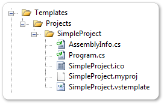
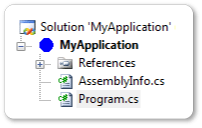
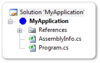
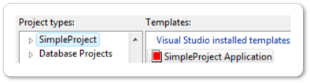
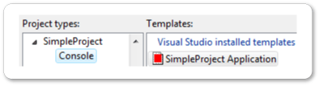
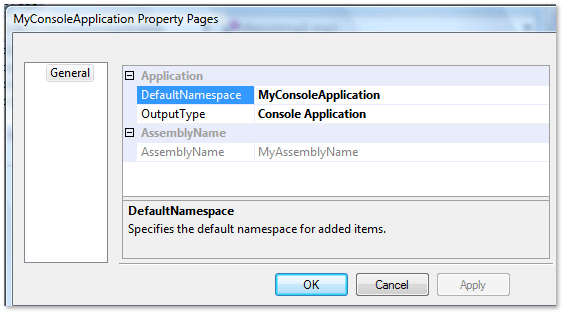
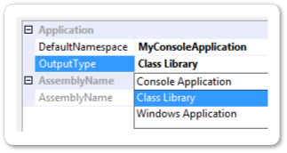

# <a name="create-a-basic-project-system-part-2"></a>基本的なプロジェクト システムの作成、パート 2
このシリーズの最初のチュートリアルである「[基本的なプロジェクト システムの作成、パート 1](../extensibility/creating-a-basic-project-system-part-1.md)」では、基本的なプロジェクト システムを作成する方法を説明しています。 このチュートリアルでは、基本的なプロジェクト システムを基に、Visual Studio テンプレート、プロパティ ページ、およびその他の機能を追加します。 このチュートリアルを開始する前に、最初のチュートリアルを完了する必要があります。

このチュートリアルでは、プロジェクト ファイル名拡張子が *.myproj* であるプロジェクト タイプを作成する方法を説明します。 このチュートリアルでは、既存の Visual C# プロジェクト システムの例を使用するため、チュートリアルを完了するために独自の言語を作成する必要はありません。

このチュートリアルでは、次のタスクを実行する方法を説明します。

- Visual Studio テンプレートを作成します。

- Visual Studio テンプレートをデプロイします。

- **[新しいプロジェクト]** ダイアログ ボックスで、プロジェクト タイプの子ノードを作成します。

- Visual Studio テンプレートでパラメーターの置換を有効にします。

- プロジェクトのプロパティ ページを作成します。

> [!NOTE]
> このチュートリアルの手順は、C# プロジェクトに基づいています。 ただし、ファイル名拡張子やコードなどの詳細情報を除き、Visual Basic プロジェクトでも同じ手順を使用できます。

## <a name="create-a-visual-studio-template"></a>Visual Studio テンプレートを作成する
- 「[基本的なプロジェクト システムの作成、パート 1](../extensibility/creating-a-basic-project-system-part-1.md)」では、基本的なプロジェクト テンプレートを作成し、プロジェクト システムに追加する方法を説明しています。 また、<xref:Microsoft.VisualStudio.Shell.ProvideProjectFactoryAttribute> 属性を使用してこのテンプレートを Visual Studio に登録する方法についても説明しています。これにより、 *\\Templates\Projects\SimpleProject\\* フォルダーの完全なパスがシステム レジストリに書き込まれます。

基本的なプロジェクト テンプレートの代わりに Visual Studio テンプレート ( *.vstemplate* ファイル) を使用すると、 **[新しいプロジェクト]** ダイアログ ボックスでのテンプレートの表示方法と、テンプレート パラメーターの置換方法を制御できます。 *.vstemplate* ファイルは、プロジェクト システム テンプレートを使用してプロジェクトを作成するときに、ソース ファイルがどのようにインクルードされるかを記述する XML ファイルです。 プロジェクト システム自体は、 *.vstemplate* ファイルとソース ファイルを *.zip* ファイルに収集することによって作成され、その *.zip* ファイルを Visual Studio が認識する場所にコピーすることによってデプロイされます。 このプロセスは、このチュートリアルの後半で詳しく説明します。

1. [!INCLUDE[vsprvs](../code-quality/includes/vsprvs_md.md)] で、「[基本的なプロジェクト システムの作成、パート 1](../extensibility/creating-a-basic-project-system-part-1.md)」に従って作成した SimpleProject ソリューションを開きます。

2. *SimpleProjectPackage.cs* ファイルで、ProvideProjectFactory 属性を見つけます。 次のように、2 番目のパラメーター (プロジェクト名) を null に、4 番目のパラメーター (プロジェクト テンプレート フォルダーのパス) を ".\\\NullPath" に置き換えます。

    ```
    [ProvideProjectFactory(typeof(SimpleProjectFactory), null,
        "Simple Project Files (*.myproj);*.myproj", "myproj", "myproj",
        ".\\NullPath",
    LanguageVsTemplate = "SimpleProject")]
    ```

3. *\\Templates\Projects\SimpleProject\\* フォルダーに、*SimpleProject.vstemplate* という名前の XML ファイルを追加します。

4. *SimpleProject.vstemplate* の内容を、次のコードに置き換えます。

    ```xml
    <VSTemplate Version="2.0.0" Type="Project"
        xmlns="http://schemas.microsoft.com/developer/vstemplate/2005">
      <TemplateData>
        <Name>SimpleProject Application</Name>
        <Description>
          A project for creating a SimpleProject application
        </Description>
        <Icon>SimpleProject.ico</Icon>
        <ProjectType>SimpleProject</ProjectType>
      </TemplateData>
      <TemplateContent>
        <Project File="SimpleProject.myproj" ReplaceParameters="true">
          <ProjectItem ReplaceParameters="true" OpenInEditor="true">
            Program.cs
          </ProjectItem>
          <ProjectItem ReplaceParameters="true" OpenInEditor="false">
            AssemblyInfo.cs
          </ProjectItem>
        </Project>
      </TemplateContent>
    </VSTemplate>
    ```

5. **[プロパティ]** ウィンドウで、 *\\Templates\Projects\SimpleProject\\* フォルダー内の 5 つのファイルをすべて選択し、 **[ビルド アクション]** を **[ZipProject]** に設定します。

    

    \<TemplateData> セクションでは、次のように、 **[新しいプロジェクト]** ダイアログ ボックスでの SimpleProject プロジェクト タイプの場所と外観を決定します。

- \<Name> 要素では、SimpleProject アプリケーションとなるプロジェクト テンプレートの名前を指定します。

- \<Description> 要素には、プロジェクト テンプレートを選択したときに **[新しいプロジェクト]** ダイアログ ボックスに表示される説明が格納されます。

- \<Icon> 要素では、SimpleProject プロジェクト タイプと共に表示されるアイコンを指定します。

- \<ProjectType> 要素では、 **[新しいプロジェクト]** ダイアログ ボックスのプロジェクト タイプの名前を指定します。 ProvideProjectFactory 属性のプロジェクト名パラメーターはこの名前に置き換えられます。

  > [!NOTE]
  > \<ProjectType> 要素は、SimpleProjectPackage.cs ファイルの `ProvideProjectFactory` 属性の `LanguageVsTemplate` 引数と一致する必要があります。

  \<TemplateContent> セクションでは、新しいプロジェクトの作成時に生成される次のファイルについて記述します。

- *SimpleProject.myproj*

- *Program.cs*

- *AssemblyInfo.cs*

  3 つのファイルすべてで `ReplaceParameters` が true に設定されています。これにより、パラメーターの置換が有効になります。 *Program.cs* ファイルでは `OpenInEditor` が true に設定されています。これにより、プロジェクトの作成時にファイルがコード エディターで開かれます。

  Visual Studio テンプレート スキーマの要素の詳細については、「[Visual Studio テンプレート スキーマ参照](../extensibility/visual-studio-template-schema-reference.md)」を参照してください。

> [!NOTE]
> プロジェクトに複数の Visual Studio テンプレートがある場合は、すべてのテンプレートが個別のフォルダーに配置されます。 そのフォルダー内のすべてのファイルで、 **[ビルド アクション]** が **[ZipProject]** に設定されている必要があります。

## <a name="adding-a-minimal-vsct-file"></a>最小限の .vsct ファイルを追加する
 新規または変更された Visual Studio テンプレートを認識するには、Visual Studio をセットアップ モードで実行する必要があります。 セットアップ モードでは、 *.vsct* ファイルが存在している必要があります。 そのため、プロジェクトに最小限の *.vsct* ファイルを追加する必要があります。

1. *SimpleProject.vsct* という名前の XML ファイルを SimpleProject プロジェクトに追加します。

2. *SimpleProject.vsct* ファイルの内容を次のコードに置き換えます。

    ```
    <?xml version="1.0" encoding="utf-8" ?>
    <CommandTable
      xmlns="http://schemas.microsoft.com/VisualStudio/2005-10-18/CommandTable">
    </CommandTable>
    ```

3. このファイルの **[ビルド アクション]** を **[VSCTCompile]** に設定します。 これは、 *.csproj* ファイルでのみ実行でき、 **[プロパティ]** ウィンドウでは実行できません。 この時点で、このファイルの **[ビルド アクション]** が **[なし]** に設定されていることを確認します。

    1. SimpleProject ノードを右クリックし、 **[SimpleProject.csproj の編集]** をクリックします。

    2. *.csproj* ファイルで、*SimpleProject.vsct* の項目を見つけます。

        ```
        <None Include="SimpleProject.vsct" />
        ```

    3. ビルド アクションを **[VSCTCompile]** に変更します。

        ```
        <VSCTCompile Include="SimpleProject.vsct" />
        ```

    4. プロジェクト ファイル、エディターを閉じます。

    5. SimpleProject ノードを保存し、**ソリューション エクスプローラー** で **[プロジェクトの再読み込み]** をクリックします。

## <a name="examine-the-visual-studio-template-build-steps"></a>Visual Studio テンプレートのビルド手順を確認する
 VSPackage プロジェクト ビルド システムでは、通常、 *.vstemplate* ファイルが変更された場合、または *.vstemplate* ファイルを含むプロジェクトがリビルドされた場合に、セットアップ モードの Visual Studio が実行されます。 MSBuild の詳細レベルを [標準] 以上に設定することによって、次の操作を行うことができます。

1. **[ツール]** メニューの **[オプション]** をクリックします。

2. **[プロジェクトおよびソリューション]** ノードを展開し、 **[ビルドと実行]** を選択します。

3. **[MSBuild プロジェクト ビルドの出力の詳細]** を **[標準]** に設定します。 **[OK]** をクリックします。

4. SimpleProject プロジェクトをリビルドします。

    *.zip* プロジェクト ファイルを作成するためのビルド手順は、次の例のようになります。

```
ZipProjects:
1>  Zipping ProjectTemplates
1>  Zipping <path>\SimpleProject\SimpleProject\obj\Debug\SimpleProject.zip...
1>  Copying file from "<path>\SimpleProject\SimpleProject\obj\Debug\SimpleProject.zip" to "<%LOCALAPPDATA%>\Microsoft\VisualStudio\14.0Exp\ProjectTemplates\\\\SimpleProject.zip".
1>  Copying file from "<path>\SimpleProject\SimpleProject\obj\Debug\SimpleProject.zip" to "bin\Debug\\ProjectTemplates\\\\SimpleProject.zip".
1>  SimpleProject -> <path>\SimpleProject\SimpleProject\bin\Debug\ProjectTemplates\SimpleProject.zip
1>ZipItems:
1>  Zipping ItemTemplates
1>  SimpleProject ->
```

## <a name="deploy-a-visual-studio-template"></a>Visual Studio テンプレートをデプロイする
Visual Studio テンプレートにはパス情報が含まれていません。 そのため、テンプレートの *.zip* ファイルは、Visual Studio で認識されている場所に配置する必要があります。 通常、ProjectTemplates フォルダーの場所は *<%LOCALAPPDATA%>\Microsoft\VisualStudio\14.0Exp\ProjectTemplates* です。

プロジェクト ファクトリを配置するには、インストール プログラムに管理者特権が必要です。 テンプレートは Visual Studio のインストール ノード *...\Microsoft Visual Studio 14.0\Common7\IDE\ProjectTemplates* にデプロイされます。

## <a name="test-a-visual-studio-template"></a>Visual Studio テンプレートをテストする
プロジェクト ファクトリをテストして、Visual Studio テンプレートを使用してプロジェクト階層が作成されるかどうかを確認します。

1. Visual Studio SDK の実験用インスタンスをリセットします。

    [!INCLUDE[win7](../debugger/includes/win7_md.md)]: **[スタート]** メニューで、**Microsoft Visual Studio/Microsoft Visual Studio SDK/Tools** フォルダーを見つけて、 **[Microsoft Visual Studio 実験用インスタンスのリセット]** を選択します。

    新しいバージョンの Windows: **[スタート]** 画面で、「**Reset the Microsoft Visual Studio \<version> Experimental Instance**」と入力します。

2. コマンド プロンプト ウィンドウが表示されます。 「**続行するには何かキーを押してください**」と表示されたら、**Enter** キーを押します。 ウィンドウが閉じたら、Visual Studio を開きます。

3. SimpleProject プロジェクトをリビルドし、デバッグを開始します。 実験用インスタンスが表示されます。

4. 実験用インスタンスで、SimpleProject プロジェクトを作成します。 **[新しいプロジェクト]** ダイアログ ボックスで、 **[SimpleProject]** を選びます。

5. SimpleProject の新しいインスタンスが表示されます。

    

    

## <a name="create-a-project-type-child-node"></a>プロジェクト タイプの子ノードを作成する
**[新しいプロジェクト]** ダイアログ ボックスのプロジェクト タイプ ノードに子ノードを追加できます。 たとえば、SimpleProject プロジェクト タイプでは、コンソール アプリケーション、ウィンドウ アプリケーション、Web アプリケーションなどの子ノードを持つことができます。

子ノードは、プロジェクト ファイルを変更し、\<ZipProject> 要素に子の \<OutputSubPath> を追加することによって作成されます。 ビルド中またはデプロイ時にテンプレートをコピーすると、すべての子ノードがプロジェクト テンプレート フォルダーのサブフォルダーになります。

このセクションでは、SimpleProject プロジェクト タイプに対して、子の Console ノードを作成する方法について説明します。

1. *\\Templates\Projects\SimpleProject\\* フォルダーの名前を *\\Templates\Projects\ConsoleApp\\* に変更します。

2. **[プロパティ]** ウィンドウで、 *\\Templates\Projects\ConsoleApp\\* フォルダー内の 5 つのファイルをすべて選択し、 **[ビルド アクション]** が **[ZipProject]** に設定されていることを確認します。

3. SimpleProject.vstemplate ファイルで、\<TemplateData> セクションの末尾、終了タグの直前に次の行を追加します。

    ```
    <NumberOfParentCategoriesToRollUp>1</NumberOfParentCategoriesToRollUp>
    ```

    これにより、コンソール アプリケーション テンプレートが、子の Console ノードと、子ノードの 1 レベル上にある親の SimpleProject ノードの両方に表示されるようになります。

4. *SimpleProject.vstemplate* ファイルを保存します。

5. *.csproj* ファイルで、それぞれの ZipProject 要素に \<OutputSubPath> を追加します。 前と同様にプロジェクトをアンロードし、プロジェクト ファイルを編集します。

6. \<ZipProject> 要素を探します。 それぞれの \<ZipProject> 要素に対して \<OutputSubPath> 要素を追加し、それに値 Console を指定します。 ZipProject

    ```
    <ZipProject Include="Templates\Projects\ConsoleApp\AssemblyInfo.cs">
      <OutputSubPath>Console</OutputSubPath>
    </ZipProject>
    <ZipProject Include="Templates\Projects\ConsoleApp\Program.cs">
      <OutputSubPath>Console</OutputSubPath>
    </ZipProject>
    <ZipProject Include="Templates\Projects\ConsoleApp\SimpleProject.myproj">
      <OutputSubPath>Console</OutputSubPath>
    </ZipProject>
    <ZipProject Include="Templates\Projects\ConsoleApp\SimpleProject.vstemplate">
      <OutputSubPath>Console</OutputSubPath>
    </ZipProject>
    <ZipProject Include="Templates\Projects\ConsoleApp\SimpleProject.ico">
      <OutputSubPath>Console</OutputSubPath>
    </ZipProject>
    ```

7. プロジェクト ファイルに次の \<PropertyGroup> を追加します。

    ```
    <PropertyGroup>
      <VsTemplateLanguage>SimpleProject</VsTemplateLanguage>
    </PropertyGroup>
    ```

8. プロジェクト ファイルを保存してプロジェクトを再度読み込みます。

## <a name="test-the-project-type-child-node"></a>プロジェクト タイプの子ノードをテストする
変更したプロジェクト ファイルをテストして、子の **Console** ノードが **[新しいプロジェクト]** ダイアログ ボックスに表示されているかどうかを確認します。

1. **Microsoft Visual Studio 実験用インスタンスのリセット** ツールを実行します。

2. SimpleProject プロジェクトをリビルドし、デバッグを開始します。 実験用インスタンスが表示されます。

3. **[新しいプロジェクト]** ダイアログで、**SimpleProject** ノードをクリックします。 **[テンプレート]** ペインに **コンソール アプリケーション** テンプレートが表示されます。

4. **SimpleProject** ノードを展開します。 子の **Console** ノードが表示されます。 **SimpleProject アプリケーション** テンプレートは **[テンプレート]** ペインに引き続き表示されます。

5. **[キャンセル]** をクリックしてデバッグを停止します。

    

    

## <a name="substitute-project-template-parameters"></a>プロジェクト テンプレート パラメーターを置換する
- 「[基本的なプロジェクト システムの作成、パート 1](../extensibility/creating-a-basic-project-system-part-1.md)」では、`ProjectNode.AddFileFromTemplate` メソッドを上書きして基本的な種類のテンプレート パラメーターの置換を実行する方法を説明しました。 このセクションでは、より高度な Visual Studio テンプレート パラメーターの使用方法について説明します。

**[新しいプロジェクト]** ダイアログ ボックスで Visual Studio テンプレートを使用してプロジェクトを作成すると、テンプレート パラメーターが文字列に置き換えられ、プロジェクトがカスタマイズされます。 テンプレート パラメーターは、先頭と末尾にドル記号が付いた特別なトークンです (例: $time$)。 次の 2 つのパラメーターは、テンプレートに基づくプロジェクトのカスタマイズを有効にする場合に特に役立ちます。

- $GUID[1-10]$ は新しい Guid に置き換えられます。 最大 10 の GUID を指定できます (たとえば、$guid1$)。

- $safeprojectname$ は、 **[新しいプロジェクト]** ダイアログ ボックスでユーザーによって指定された名前であり、安全でない文字とスペースをすべて削除するように変更されています。

  テンプレート パラメーターの完全な一覧については、「[テンプレート パラメーター](../ide/template-parameters.md)」を参照してください。

### <a name="to-substitute-project-template-parameters"></a>プロジェクト テンプレート パラメーターを置換するには

1. *SimpleProjectNode.cs* ファイルで、`AddFileFromTemplate` メソッドを削除します。

2. *\\Templates\Projects\ConsoleApp\SimpleProject.myproj* ファイルで、\<RootNamespace> プロパティを探し、その値を $safeprojectname$ に変更します。

    ```
    <RootNamespace>$safeprojectname$</RootNamespace>
    ```

3. *\\Templates\Projects\SimpleProject\Program.cs* ファイルで、ファイルの内容を次のコードに置き換えます。

    ```
    using System;
    using System.Collections.Generic;
    using System.Text;
    using System.Runtime.InteropServices;    // Guid

    namespace $safeprojectname$
    {
        [Guid("$guid1$")]
        public class $safeprojectname$
        {
            static void Main(string[] args)
            {
                Console.WriteLine("Hello VSX!!!");
                Console.ReadKey();
            }
        }
    }
    ```

4. SimpleProject プロジェクトをリビルドし、デバッグを開始します。 実験用インスタンスが表示されます。

5. 新しい SimpleProject コンソール アプリケーションを作成します ( **[プロジェクトの種類]** ペインで **[SimpleProject]** を選択します。 **[Visual Studio にインストールされたテンプレート]** の **[コンソール アプリケーション]** を選択します)。

6. 新しく作成されたプロジェクトで *Program.cs* を開きます。 次のようになります (ファイル内の GUID 値は異なります)。

    ```csharp
    using System;
    using System.Collections.Generic;
    using System.Text;
    using System.Runtime.InteropServices;    // Guid

    namespace Console_Application1
    {
        [Guid("00000000-0000-0000-00000000-00000000)"]
        public class Console_Application1
        {
            static void Main(string[] args)
            {
                Console.WriteLine("Hello VSX!!!");
                Console.ReadKey();
            }
        }
    }
    ```

## <a name="create-a-project-property-page"></a>プロジェクトのプロパティ ページを作成する
ユーザーが自分のテンプレートに基づくプロジェクトのプロパティを表示および変更できるように、プロジェクト タイプのプロパティ ページを作成できます。 このセクションでは、構成に依存しないプロパティ ページを作成する方法について説明します。 この基本的なプロパティ ページでは、プロパティ グリッドを使用して、プロパティ ページ クラスで公開するパブリック プロパティを表示します。

`SettingsPage` 基底クラスからプロパティ ページ クラスを派生させます。 `SettingsPage` クラスによって提供されるプロパティ グリッドは、ほとんどのプリミティブ データ型と、それらを表示する方法を認識します。 また、`SettingsPage` クラスは、プロパティ値をプロジェクト ファイルに保持する方法を認識します。

このセクションで作成するプロパティ ページでは、次のプロジェクトのプロパティを変更して保存できます。

- AssemblyName

- OutputType

- RootNamespace

1. *SimpleProjectPackage.cs* ファイルで、次の `ProvideObject` 属性を `SimpleProjectPackage` クラスに追加します。

    ```
    [ProvideObject(typeof(GeneralPropertyPage))]
    public sealed class SimpleProjectPackage : ProjectPackage
    ```

    これにより、プロパティ ページ クラス `GeneralPropertyPage` が COM に登録されます。

2. *SimpleProjectNode.cs* ファイルで、次の 2 つのオーバーライドされたメソッドを `SimpleProjectNode` クラスに追加します。

    ```csharp
    protected override Guid[] GetConfigurationIndependentPropertyPages()
    {
        Guid[] result = new Guid[1];
        result[0] = typeof(GeneralPropertyPage).GUID;
        return result;
    }
    protected override Guid[] GetPriorityProjectDesignerPages()
    {
        Guid[] result = new Guid[1];
        result[0] = typeof(GeneralPropertyPage).GUID;
        return result;
    }
    ```

    これらのメソッドはどちらも、プロパティ ページの GUID の配列を返します。 GeneralPropertyPage GUID は配列内の唯一の要素であるため、 **[プロパティ ページ]** ダイアログ ボックスには 1 ページしか表示されません。

3. *GeneralPropertyPage.cs* という名前のクラス ファイルを SimpleProject プロジェクトに追加します。

4. 次のコードを使用してこのファイルの内容を置き換えます。

    ```csharp
    using System;
    using System.Runtime.InteropServices;
    using Microsoft.VisualStudio;
    using Microsoft.VisualStudio.Project;
    using System.ComponentModel;

    namespace SimpleProject
    {
        [ComVisible(true)]
        [Guid("6BC7046B-B110-40d8-9F23-34263D8D2936")]
        public class GeneralPropertyPage : SettingsPage
        {
            private string assemblyName;
            private OutputType outputType;
            private string defaultNamespace;

            public GeneralPropertyPage()
            {
                this.Name = "General";
            }

            [Category("AssemblyName")]
            [DisplayName("AssemblyName")]
            [Description("The output file holding assembly metadata.")]
            public string AssemblyName
            {
                get { return this.assemblyName; }
            }
            [Category("Application")]
            [DisplayName("OutputType")]
            [Description("The type of application to build.")]
            public OutputType OutputType
            {
                get { return this.outputType; }
                set { this.outputType = value; this.IsDirty = true; }
            }
            [Category("Application")]
            [DisplayName("DefaultNamespace")]
            [Description("Specifies the default namespace for added items.")]
            public string DefaultNamespace
            {
                get { return this.defaultNamespace; }
                set { this.defaultNamespace = value; this.IsDirty = true; }
            }

            protected override void BindProperties()
            {
                this.assemblyName = this.ProjectMgr.GetProjectProperty("AssemblyName", true);
                this.defaultNamespace = this.ProjectMgr.GetProjectProperty("RootNamespace", false);

                string outputType = this.ProjectMgr.GetProjectProperty("OutputType", false);
                this.outputType = (OutputType)Enum.Parse(typeof(OutputType), outputType);
            }

            protected override int ApplyChanges()
            {
                this.ProjectMgr.SetProjectProperty("AssemblyName", this.assemblyName);
                this.ProjectMgr.SetProjectProperty("OutputType", this.outputType.ToString());
                this.ProjectMgr.SetProjectProperty("RootNamespace", this.defaultNamespace);
                this.IsDirty = false;

                return VSConstants.S_OK;
            }
        }
    }
    ```

    `GeneralPropertyPage` クラスでは、AssemblyName、OutputType、RootNamespace という 3 つのパブリック プロパティを公開します。 AssemblyName には設定メソッドがないため、読み取り専用プロパティとして表示されます。 OutputType は列挙型定数であるため、ドロップダウン リストとして表示されます。

    `SettingsPage` 基底クラスでは、プロパティを保持するために `ProjectMgr` を提供します。 `BindProperties` メソッドでは、`ProjectMgr` を使用して保持されたプロパティ値を取得し、対応するプロパティを設定します。 `ApplyChanges` メソッドでは、`ProjectMgr` を使用してプロパティの値を取得し、プロジェクト ファイルに保持します。 プロパティ設定メソッドでは、プロパティを保持する必要があることを示すために `IsDirty` が true に設定されます。 永続化は、プロジェクトまたはソリューションを保存するときに行われます。

5. SimpleProject ソリューションをリビルドし、デバッグを開始します。 実験用インスタンスが表示されます。

6. 実験用インスタンスで、新しい SimpleProject アプリケーションを作成します。

7. Visual Studio では、Visual Studio テンプレートを使用してプロジェクトを作成するために、プロジェクト ファクトリが呼び出されます。 コード エディターで新しい *Program.cs* ファイルが開かれます。

8. **ソリューション エクスプローラー** でプロジェクト ノードを右クリックし、 **[プロパティ]** をクリックします。 **[プロパティ ページ]** ダイアログ ボックスが表示されます。

    

## <a name="test-the-project-property-page"></a>プロジェクトのプロパティ ページをテストする
これで、プロパティ値を変更できるかどうかをテストできるようになりました。

1. **[MyConsoleApplication プロパティ ページ]** ダイアログ ボックスで、 **[DefaultNamespace]** を **[MyApplication]** に変更します。

2. **[OutputType]** プロパティを選択し、 **[クラス ライブラリ]** を選択します。

3. [**適用**] をクリックし、[**OK**] をクリックします。

4. **[プロパティ ページ]** ダイアログ ボックスを再び開き、変更が保存されていることを確認します。

5. Visual Studio の実験用インスタンスを終了します。

6. 実験用インスタンスを再び開きます。

7. **[プロパティ ページ]** ダイアログ ボックスを再び開き、変更が保存されていることを確認します。

8. Visual Studio の実験用インスタンスを終了します。
    
