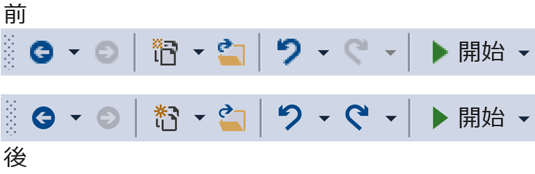
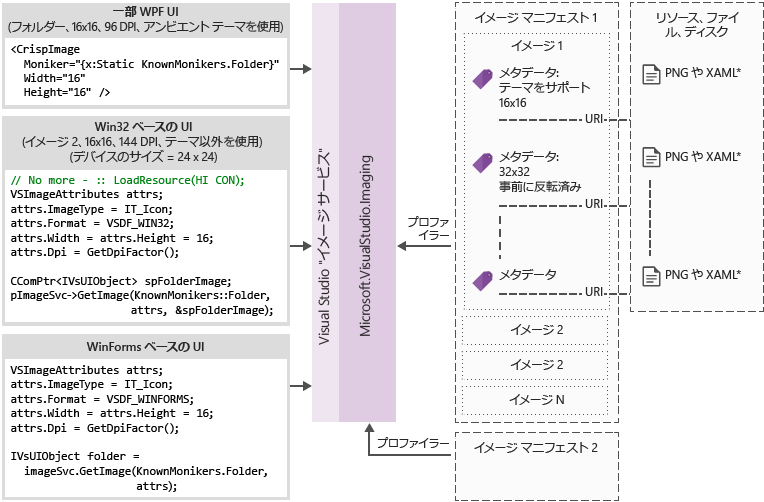

# <a name="image-service-and-catalog"></a>イメージ サービスとイメージ カタログ
このクックブックでは、Visual Studio 2015 で導入された Visual Studio イメージ サービスとイメージ カタログを採用する際のガイダンスとベスト プラクティスについて説明します。

 Visual Studio 2015 で導入されたイメージ サービスを使用すると、開発者はデバイスに最適な画像とユーザーが選択したテーマを取得して、表示されるコンテキストに合った正しいテーマなどの画像を表示することができます。 イメージ サービスを採用すると、アセットのメンテナンス、HDPI スケール、テーマ設定に関連する主要な問題点を解消することができます。

|**現在の問題**|**ソリューション**|
|-|-|
|背景色のブレンド|組み込みのアルファ ブレンド|
|(何かの) テーマ設定画像|テーマのメタデータ|
|ハイ コントラスト モード|代替ハイ コントラスト リソース|
|さまざまな DPI モードのために複数のリソースが必要|ベクターベースのフォールバックを含む選択可能なリソース|
|重複する画像|画像の概念ごとに 1 つの識別子|

 イメージ サービスを採用する理由

- Visual Studio から常に最新の "最適なピクセルの" 画像が取得されます

- 独自の画像を送信して使用することができます

- 新しい DPI スケールが Windows に追加されても、画像をテストする必要はありません

- 実装に含まれる古いアーキテクチャの課題に対処できます

  イメージ サービスを使用する前と後の Visual Studio シェルのツール バー:

  

## <a name="how-it-works"></a>しくみ
 イメージ サービスを使用すると、サポートされている UI フレームワークに適したビットマップ画像を提供できます。

- WPF: BitmapSource

- WinForms: System.Drawing.Bitmap

- Win32: HBITMAP

  イメージ サービスのフロー ダイアグラム

  

  **イメージ モニカー**

  イメージ モニカー (または略してモニカー) は、画像ライブラリ内の画像アセットまたは画像リスト アセットを一意に識別する GUID と ID のペアです。

  **既知のモニカー**

  Visual Studio イメージ カタログに含まれ、Visual Studio のコンポーネントまたは拡張機能から一般に使用できる一連のイメージ モニカー。

  **イメージ マニフェスト ファイル**

  イメージ マニフェスト ( *.imagemanifest*) ファイルは、一連の画像アセット、それらのアセットを表すモニカー、各アセットを表す実際の 1 つ以上の画像を定義する XML ファイルです。 イメージ マニフェストを使用すると、従来の UI をサポートするためにスタンドアロンの画像または画像リストを定義できます。 また、アセットまたは各アセットの背後にある個々の画像に対して設定できる属性があり、これらのアセットが表示されるタイミングと方法を変更できます。

  **イメージ マニフェストのスキーマ**

  イメージ マニフェスト全体は次のようになります。

```xml
<ImageManifest>
      <!-- zero or one Symbols elements -->
      <Symbols>
        <!-- zero or more Import, Guid, ID, or String elements -->
      </Symbols>
      <!-- zero or one Images elements -->
      <Images>
        <!-- zero or more Image elements -->
      </Images>
      <!-- zero or one ImageLists elements -->
      <ImageLists>
        <!-- zero or more ImageList elements -->
      </ImageLists>
</ImageManifest>
```

 **記号**

 読みやすく、メンテナンスを容易にするために、イメージ マニフェストには属性値として記号を使用できます。 記号は次のように定義されます。

```xml
<Symbols>
      <Import Manifest="manifest" />
      <Guid Name="ShellCommandGuid" Value="8ee4f65d-bab4-4cde-b8e7-ac412abbda8a" />
      <ID Name="cmdidSaveAll" Value="1000" />
      <String Name="AssemblyName" Value="Microsoft.VisualStudio.Shell.UI.Internal" />
</Symbols>
```

|**サブ要素**|**定義**|
|-|-|
|[インポート]|現在のマニフェストで使用するために、指定したマニフェスト ファイルの記号をインポートします|
|Guid|記号は GUID を表し、GUID の書式設定と一致する必要があります|
|id|記号は ID を表し、負でない整数である必要があります|
|String|記号は任意の文字列値を表します|

 記号は大文字と小文字が区別され、$(記号名) の構文を使用して参照されます。

```xml
<Image Guid="$(ShellCommandGuid)" ID="$(cmdidSaveAll)" >
      <Source Uri="/$(AssemblyName);Component/Resources/image.xaml" />
</Image>
```

 一部の記号は、すべてのマニフェストに対して事前に定義されています。 これらは、ローカル コンピューター上のパスを参照するために、\<Source> 要素または \<Import> 要素の Uri 属性で使用できます。

|**記号**|**説明**|
|-|-|
|CommonProgramFiles|%CommonProgramFiles% 環境変数の値|
|LocalAppData|%LocalAppData% 環境変数の値|
|ManifestFolder|マニフェスト ファイルが含まれるフォルダー|
|MyDocuments|現在のユーザーのマイ ドキュメント フォルダーの完全なパス|
|ProgramFiles|%ProgramFiles% 環境変数の値|
|システム|*Windows\System32* フォルダー|
|WinDir|%WinDir% 環境変数の値|

 **Image**

 \<Image> 要素には、モニカーから参照できる画像を定義します。 GUID と ID を組み合わせてイメージ モニカーが形成されます。 イメージ モニカーは、画像ライブラリ全体で一意である必要があります。 特定のモニカーが複数の画像に含まれている場合は、ライブラリのビルド中に最初に検出されたものが保持されます。

 ソースは少なくとも 1 つ含まれている必要があります。 サイズに依存しないソースであれば、幅広いサイズで最適な結果を得られますが、必須ではありません。 \<Image> 要素に定義されていないサイズの画像がサービスに要求され、サイズに依存しないソースが存在しない場合、サービスによって、最適なサイズ固有のソースが選択され、要求されたサイズに合わせて拡大縮小されます。

```xml
<Image Guid="guid" ID="int" AllowColorInversion="true/false">
      <Source ... />
      <!-- optional additional Source elements -->
</Image>
```

|**属性**|**定義**|
|-|-|
|Guid|[必須] イメージ モニカーの GUID 部分|
|id|[必須] イメージ モニカーの ID 部分|
|AllowColorInversion|[省略可能、既定値は true] 画像を暗い背景で使用するときに、色をプログラムによって反転するかどうかを示します。|

 **ソース**

 \<Source> 要素には、単一の画像ソース アセット (XAML と PNG) を定義します。

```xml
<Source Uri="uri" Background="background">
      <!-- optional NativeResource element -->
 </Source>
```

|**属性**|**定義**|
|-|-|
|Uri|[必須] 画像の読み込み元となる場所を定義する URI。 次のいずれかを指定できます。<br /><br /> - application:/// オーソリティを使用する[パック URI](/dotnet/framework/wpf/app-development/pack-uris-in-wpf)<br />- コンポーネントの絶対リソース参照<br />- ネイティブ リソースを含むファイルのパス|
|背景|[省略可能] ソースの使用を想定している背景の種類を示します。<br /><br /> 次のいずれかを指定できます。<br /><br /> *Light:* ソースは明るい背景で使用できます。<br /><br /> *Dark:* ソースは暗い背景で使用できます。<br /><br /> *HighContrast:* ソースは、ハイ コントラスト モードの任意の背景で使用できます。<br /><br /> *HighContrastLight:* ソースは、ハイ コントラスト モードの明るい背景で使用できます。<br /><br /> *HighContrastDark:* ソースは、ハイ コントラスト モードの暗い背景で使用できます。<br /><br /> Background 属性が省略されている場合は、任意の背景でソースを使用できます。<br /><br /> Background が *Light*、*Dark*、*HighContrastLight*、または *HighContrastDark* の場合、ソースの色は反転されません。 Background が省略されているか *HighContrast* に設定されている場合、ソースの色の反転は、画像の **AllowColorInversion** 属性によって制御されます。|

\<Source> 要素には、次のオプションのサブ要素のうち 1 つのみを含めることができます。

|**要素**|**属性 (すべて必須)**|**定義**|
|-|-|-|
|\<Size>|値|ソースは、指定されたサイズ (デバイス単位) の画像に使用されます。 画像は正方形になります。|
|\<SizeRange>|MinSize、MaxSize|ソースは、MinSize から MaxSize (デバイス単位) までの画像に使用されます。 画像は正方形になります。|
|\<Dimensions>|Width、Height|ソースは、指定された幅と高さ (デバイス単位) の画像に使用されます。|
|\<DimensionRange>|MinWidth、MinHeight、<br /><br /> MaxWidth、MaxHeight|ソースは、幅と高さの最小値から幅と高さの最大値まで (デバイス単位) の画像に使用されます。|

 \<Source> 要素には、省略可能な \<NativeResource> サブ要素を含めることもできます。これを使用して、マネージド アセンブリではなくネイティブ アセンブリから読み込まれる \<Source> を定義できます。

```xml
<NativeResource Type="type" ID="int" />
```

|**属性**|**定義**|
|-|-|
|Type|[必須] ネイティブ リソースの種類 (XAML または PNG)|
|id|[必須] ネイティブ リソースの整数 ID 部分|

 **ImageList**

 \<ImageList> 要素には、1 つのストリップで返すことができる画像のコレクションを定義します。 ストリップは必要に応じて要求時に構築されます。

```xml
<ImageList>
      <ContainedImage Guid="guid" ID="int" External="true/false" />
      <!-- optional additional ContainedImage elements -->
 </ImageList>
```

|**属性**|**定義**|
|-|-|
|Guid|[必須] イメージ モニカーの GUID 部分|
|id|[必須] イメージ モニカーの ID 部分|
|外部|[省略可能、既定値は false] イメージ モニカーから、現在のマニフェスト内の画像が参照されているかどうかを示します。|

 含まれている画像のモニカーから、現在のマニフェストに定義されている画像を参照する必要はありません。 含まれている画像が画像ライブラリに見つからない場合は、空白のプレースホルダー画像が代わりに使用されます。

## <a name="using-the-image-service"></a>イメージ サービスの使用

### <a name="first-steps-managed"></a>最初の手順 (マネージド)
 イメージ サービスを使用するには、次のアセンブリの一部またはすべてへの参照をプロジェクトに追加する必要があります。

- *Microsoft.VisualStudio.ImageCatalog.dll*

  - 組み込みのイメージ カタログ **KnownMonikers** を使用する場合に必要です。

- *Microsoft.VisualStudio.Imaging.dll*

  - WPF UI で **CrispImage** および **ImageThemingUtilities** を使用する場合に必要です。

- *Microsoft.VisualStudio.Imaging.Interop.14.0.DesignTime.dll*

  - **ImageMoniker** および **ImageAttributes** 型を使用する場合に必要です。

  - **EmbedInteropTypes** を true に設定する必要があります。

- *Microsoft.VisualStudio.Shell.Interop.14.0.DesignTime*

  - **IVsImageService2** 型を使用する場合に必要です。

  - **EmbedInteropTypes** を true に設定する必要があります。

- *Microsoft.VisualStudio.Utilities.dll*

  - WPF UI で **ImageThemingUtilities.ImageBackgroundColor** に **BrushToColorConverter** を使用する場合に必要です。

- *Microsoft.VisualStudio.Shell.\<VSVersion>.0*

  - **IVsUIObject** 型を使用する場合に必要です。

- *Microsoft.VisualStudio.Shell.Interop.10.0.dll*

  - WinForms 関連の UI ヘルパーを使用する場合に必要です。

  - **EmbedInteropTypes** を true に設定する必要があります

### <a name="first-steps-native"></a>最初の手順 (ネイティブ)
 イメージ サービスを使用するには、プロジェクトに次のヘッダーの一部またはすべてを含める必要があります。

- **KnownImageIds.h**

  - 組み込みのイメージ カタログ **KnownMonikers** を使用していても、**ImageMoniker** 型を使用できない場合に必要です。たとえば、**IVsHierarchy GetGuidProperty** や **GetProperty** の呼び出しから値を返すときなどです。

- **KnownMonikers.h**

  - 組み込みのイメージ カタログ **KnownMonikers** を使用する場合に必要です。

- **ImageParameters140.h**

  - **ImageMoniker** および **ImageAttributes** 型を使用する場合に必要です。

- **VSShell140.h**

  - **IVsImageService2** 型を使用する場合に必要です。

- **ImageThemingUtilities.h**

  - イメージ サービスにテーマ設定を任せることができない場合に必要です。

  - イメージ サービスでテーマ設定を処理できる場合は、このヘッダーを使用しないでください。

::: moniker range="vs-2017"
- **VSUIDPIHelper.h**

  - DPI ヘルパーを使用して現在の DPI を取得する場合に必要です。

::: moniker-end

::: moniker range=">=vs-2019"
- **VsDpiAwareness.h**

  - DPI 認識ヘルパーを使用して現在の DPI を取得する場合に必要です。

::: moniker-end

## <a name="how-do-i-write-new-wpf-ui"></a>新しい WPF UI を作成する方法

1. まず、前述の「最初の手順」セクションで必要なアセンブリ参照をプロジェクトに追加します。 すべてを追加する必要はないので、必要な参照のみを追加してください (注: **Brushes** ではなく **Colors** を使用しているか、アクセスできる場合、コンバーターは不要なので、**Utilities** への参照をスキップできます)。

2. 目的の画像を選択し、そのモニカーを取得します。 **KnownMoniker** を使用するか、独自のカスタム画像とモニカーがある場合は独自のものを使用します。

3. XAML に **CrispImages** を追加します (下の例を参照してください)。

4. UI 階層に **ImageThemingUtilities.ImageBackgroundColor** プロパティを設定します (これは、背景色がわかる場所に設定する必要があり、**CrispImage** に必須なものではありません) (次の例を参照してください)。

```xaml
<Window
  x:Class="WpfApplication.MainWindow"
  xmlns="http://schemas.microsoft.com/winfx/2006/xaml/presentation"
  xmlns:x="http://schemas.microsoft.com/winfx/2006/xaml"
  xmlns:imaging="clr-namespace:Microsoft.VisualStudio.Imaging;assembly=Microsoft.VisualStudio.Imaging"
  xmlns:theming="clr-namespace:Microsoft.VisualStudio.PlatformUI;assembly=Microsoft.VisualStudio.Imaging"
  xmlns:utilities="clr-namespace:Microsoft.Internal.VisualStudio.Imaging;assembly=Microsoft.VisualStudio.Imaging"
  xmlns:catalog="clr-namespace:Microsoft.VisualStudio.Imaging;assembly=Microsoft.VisualStudio.ImageCatalog"
  Title="MainWindow" Height="350" Width="525" UseLayoutRounding="True">
  <Window.Resources>
    <utilities:BrushToColorConverter x:Key="BrushToColorConverter"/>
  </Window.Resources>
  <StackPanel Background="White" VerticalAlignment="Center"
    theming:ImageThemingUtilities.ImageBackgroundColor="{Binding Background, RelativeSource={RelativeSource Self}, Converter={StaticResource BrushToColorConverter}}">
    <imaging:CrispImage Width="16" Height="16" Moniker="{x:Static catalog:KnownMonikers.MoveUp}" />
  </StackPanel>
</Window>
```

 **既存の WPF UI を更新する方法**

 既存の WPF UI の更新は比較的簡単であり、次の 3 つの基本的な手順で構成されます。

1. UI のすべての \<Image> 要素を \<CrispImage> 要素に置き換えます。

2. すべてのソース属性を Moniker 属性に変更します。

    - 画像が変更されず、**KnownMonikers** を使用している場合は、そのプロパティを **KnownMoniker** に静的にバインドします (上の例を参照してください)。

    - 画像が変更されず、独自のカスタム画像を使用している場合は、独自のモニカーに静的にバインドします。

    - 画像が変更される可能性がある場合は、プロパティの変更時に通知するコード プロパティに Moniker 属性をバインドします。

3. UI 階層内のどこかに **ImageThemingUtilities.ImageBackgroundColor** を設定し、色の反転が正しく機能することを確認します。

    - これには、**BrushToColorConverter** クラスの使用が必要になる場合があります (上の例を参照してください)。

## <a name="how-do-i-update-win32-ui"></a>Win32 UI を更新する方法
 必要に応じて以下をコードに追加し、画像の生の読み込みを置き換えます。 必要に応じて HBITMAP、HICON、または HIMAGELIST を返すように値を切り替えます。

 **イメージ サービスを取得する**

```cpp
CComPtr<IVsImageService2> spImgSvc;
CGlobalServiceProvider::HrQueryService(SID_SVsImageService, &spImgSvc);
```

 **画像の要求**

::: moniker range="vs-2017"

```cpp
ImageAttributes attr = { 0 };
attr.StructSize      = sizeof(attributes);
attr.Format          = DF_Win32;
// IT_Bitmap for HBITMAP, IT_Icon for HICON, IT_ImageList for HIMAGELIST
attr.ImageType       = IT_Bitmap;
attr.LogicalWidth    = 16;
attr.LogicalHeight   = 16;
attr.Dpi             = VsUI::DpiHelper::GetDeviceDpiX();
// Desired RGBA color, if you don't use this, don't set IAF_Background below
attr.Background      = 0xFFFFFFFF;
attr.Flags           = IAF_RequiredFlags | IAF_Background;

CComPtr<IVsUIObject> spImg;
// Replace this KnownMoniker with your desired ImageMoniker
spImgSvc->GetImage(KnownMonikers::Blank, attributes, &spImg);
```

::: moniker-end

::: moniker range=">=vs-2019"

```cpp
UINT dpiX, dpiY;
HWND hwnd = // get the HWND where the image will be displayed
VsUI::CDpiAwareness::GetDpiForWindow(hwnd, &dpiX, &dpiY);

ImageAttributes attr = { 0 };
attr.StructSize      = sizeof(attributes);
attr.Format          = DF_Win32;
// IT_Bitmap for HBITMAP, IT_Icon for HICON, IT_ImageList for HIMAGELIST
attr.ImageType       = IT_Bitmap;
attr.LogicalWidth    = 16;
attr.LogicalHeight   = 16;
attr.Dpi             = dpiX;
// Desired RGBA color, if you don't use this, don't set IAF_Background below
attr.Background      = 0xFFFFFFFF;
attr.Flags           = IAF_RequiredFlags | IAF_Background;

CComPtr<IVsUIObject> spImg;
// Replace this KnownMoniker with your desired ImageMoniker
spImgSvc->GetImage(KnownMonikers::Blank, attributes, &spImg);
```

::: moniker-end

## <a name="how-do-i-update-winforms-ui"></a>WinForms UI を更新する方法
 必要に応じて以下をコードに追加し、画像の生の読み込みを置き換えます。 必要に応じて Bitmap または Icon を返すように値を切り替えます。

 **役に立つ using ステートメント**

```csharp
using GelUtilities = Microsoft.Internal.VisualStudio.PlatformUI.Utilities;
```

 **イメージ サービスを取得する**

```csharp
// This or your preferred way of querying for Visual Studio services
IVsImageService2 imageService = (IVsImageService2)Package.GetGlobalService(typeof(SVsImageService));

```

 **画像を要求する**

::: moniker range="vs-2017"

```csharp
ImageAttributes attributes = new ImageAttributes
{
    StructSize    = Marshal.SizeOf(typeof(ImageAttributes)),
    // IT_Bitmap for Bitmap, IT_Icon for Icon, IT_ImageList for ImageList
    ImageType     = (uint)_UIImageType.IT_Bitmap,
    Format        = (uint)_UIDataFormat.DF_WinForms,
    LogicalWidth  = 16,
    LogicalHeight = 16,
    Dpi           = (int)DpiHelper.DeviceDpiX;
    // Desired RGBA color, if you don't use this, don't set IAF_Background below
    Background    = 0xFFFFFFFF,
    Flags         = unchecked((uint)_ImageAttributesFlags.IAF_RequiredFlags | _ImageAttributesFlags.IAF_Background),
};

// Replace this KnownMoniker with your desired ImageMoniker
IVsUIObject uIObj = imageService.GetImage(KnownMonikers.Blank, attributes);

Bitmap bitmap = (Bitmap)GelUtilities.GetObjectData(uiObj); // Use this if you need a bitmap
// Icon icon = (Icon)GelUtilities.GetObjectData(uiObj);    // Use this if you need an icon
```

::: moniker-end

::: moniker range=">=vs-2019"

```csharp
Control control = // get the control where the image will be displayed

ImageAttributes attributes = new ImageAttributes
{
    StructSize    = Marshal.SizeOf(typeof(ImageAttributes)),
    // IT_Bitmap for Bitmap, IT_Icon for Icon, IT_ImageList for ImageList
    ImageType     = (uint)_UIImageType.IT_Bitmap,
    Format        = (uint)_UIDataFormat.DF_WinForms,
    LogicalWidth  = 16,
    LogicalHeight = 16,
    Dpi           = (int)DpiAwareness.GetWindowDpi(control.Handle);
    // Desired RGBA color, if you don't use this, don't set IAF_Background below
    Background    = 0xFFFFFFFF,
    Flags         = unchecked((uint)_ImageAttributesFlags.IAF_RequiredFlags | _ImageAttributesFlags.IAF_Background),
};

// Replace this KnownMoniker with your desired ImageMoniker
IVsUIObject uIObj = imageService.GetImage(KnownMonikers.Blank, attributes);

Bitmap bitmap = (Bitmap)GelUtilities.GetObjectData(uiObj); // Use this if you need a bitmap
// Icon icon = (Icon)GelUtilities.GetObjectData(uiObj);    // Use this if you need an icon
```

::: moniker-end

## <a name="how-do-i-use-image-monikers-in-a-new-tool-window"></a>新しいツール ウィンドウでイメージ モニカーを使用する方法
 VSIX パッケージ プロジェクト テンプレートは、Visual Studio 2015 用に更新されました。 新しいツール ウィンドウを作成するには、VSIX プロジェクトを右クリックし、 **[追加]**  >  **[新しい項目]** (**Ctrl**+**Shift**+**A** キー) を選択します。 プロジェクト言語の [機能拡張] ノードで、 **[カスタム ツール ウィンドウ]** を選択し、ツール ウィンドウに名前を付けて、 **[追加]** ボタンを押します。

 これらは、ツール ウィンドウでモニカーを使用する主な場所です。 それぞれの手順に従ってください。

1. タブが十分に小さくなったときのツール ウィンドウ タブ (**Ctrl**+**Tab** ウィンドウ スイッチャーでも使用されます)。

    **ToolWindowPane** 型から派生するクラスのコンストラクターに次の行を追加します。

   ```csharp
   // Replace this KnownMoniker with your desired ImageMoniker
   this.BitmapImageMoniker = KnownMonikers.Blank;
   ```

2. ツール ウィンドウを開くコマンド。

    パッケージの *.vsct* ファイルで、ツール ウィンドウのコマンド ボタンを編集します。

   ```xml
   <Button guid="guidPackageCmdSet" id="CommandId" priority="0x0100" type="Button">
     <Parent guid="guidSHLMainMenu" id="IDG_VS_WNDO_OTRWNDWS1"/>
     <!-- Replace this KnownMoniker with your desired ImageMoniker -->
     <Icon guid="ImageCatalogGuid" id="Blank" />
     <!-- Add this -->
     <CommandFlag>IconIsMoniker</CommandFlag>
     <Strings>
       <ButtonText>MyToolWindow</ButtonText>
     </Strings>
   </Button>
   ```

   **既存のツール ウィンドウでイメージ モニカーを使用する方法**

   イメージ モニカーを使用するように既存のツール ウィンドウを更新するには、新しいツール ウィンドウを作成する場合と同様の手順で行います。

   これらは、ツール ウィンドウでモニカーを使用する主な場所です。 それぞれの手順に従ってください。

3. タブが十分に小さくなったときのツール ウィンドウ タブ (**Ctrl**+**Tab** ウィンドウ スイッチャーでも使用されます)。

   1. **ToolWindowPane** 型から派生したクラスのコンストラクター内にあるこれらの行 (存在する場合) を削除します。

       ```csharp
       this.BitmapResourceID = <Value>;
       this.BitmapIndex = <Value>;
       ```

   2. 「新しいツール ウィンドウでイメージ モニカーを使用する方法」の手順 1 を参照してください。 セクションを参照してください。

4. ツール ウィンドウを開くコマンド。

   - 「新しいツール ウィンドウでイメージ モニカーを使用する方法」の手順 2 を参照してください。 セクションを参照してください。

## <a name="how-do-i-use-image-monikers-in-a-vsct-file"></a>.vsct ファイルでイメージ モニカーを使用する方法
 次のコメント行に示されているように、 *.vsct* ファイルを更新します。

```xml
<?xml version="1.0" encoding="utf-8"?>
<CommandTable xmlns="http://schemas.microsoft.com/VisualStudio/2005-10-18/CommandTable" xmlns:xs="http://www.w3.org/2001/XMLSchema">
  <!--  Include the definitions for images included in the VS image catalog -->
  <Include href="KnownImageIds.vsct"/>
  <Commands package="guidMyPackage">
    <Buttons>
      <Button guid="guidMyCommandSet" id="cmdidMyCommand" priority="0x0000" type="Button">
        <!-- Add an Icon element, changing the attributes to match the image moniker you want to use.
             In this case, we're using the Guid for the VS image catalog.
             Change the id attribute to be the ID of the desired image moniker. -->
        <Icon guid="ImageCatalogGuid" id="OpenFolder" />
        <CommandFlag>DynamicVisibility</CommandFlag>
        <CommandFlag>DefaultInvisible</CommandFlag>
        <CommandFlag>DefaultDisabled</CommandFlag>
        <CommandFlag>CommandWellOnly</CommandFlag>
        <CommandFlag>IconAndText</CommandFlag>
        <!-- Add the IconIsMoniker CommandFlag -->
        <CommandFlag>IconIsMoniker</CommandFlag>
        <Strings>
          <ButtonText>Quick Fixes...</ButtonText>
          <CommandName>Show Quick Fixes</CommandName>
          <CanonicalName>ShowQuickFixes</CanonicalName>
          <LocCanonicalName>ShowQuickFixes</LocCanonicalName>
        </Strings>
      </Button>
    </Buttons>
  </Commands>
  <!-- It is recommended that you remove <Bitmap> elements that are no longer used in the vsct file -->
  <Symbols>
    <GuidSymbol name="guidMyPackage"    value="{1491e936-6ffe-474e-8371-30e5920d8fdd}" />
    <GuidSymbol name="guidMyCommandSet" value="{10347de4-69a9-47f4-a950-d3301f6d2bc7}">
      <IDSymbol name="cmdidMyCommand" value="0x9437" />
    </GuidSymbol>
  </Symbols>
</CommandTable>
```

 **以前のバージョンの Visual Studio でも .vsct ファイルを読み取る必要がある場合**

 以前のバージョンの Visual Studio では、**IconIsMoniker** コマンド フラグが認識されません。 イメージ サービスの画像は、それをサポートするバージョンの Visual Studio 上では使用できますが、以前のバージョンの Visual Studio 上では引き続き古いスタイルの画像を使用できます。 これを行うには、 *.vsct* ファイルを変更せずに (そのため、以前のバージョンの Visual Studio との互換性が保たれます)、 *.vsct* ファイルの \<Bitmaps> 要素に定義されている GUID と ID のペアから、イメージ モニカーの GUID と ID のペアにマップする CSV (コンマ区切りの値) ファイルを作成します。

 マッピング CSV ファイルの形式は次のとおりです。

```
Icon guid, Icon id, Moniker guid, Moniker id
b714fcf7-855e-4e4c-802a-1fd87144ccad,1,fda30684-682d-421c-8be4-650a2967058e,100
b714fcf7-855e-4e4c-802a-1fd87144ccad,2,fda30684-682d-421c-8be4-650a2967058e,200
```

 CSV ファイルはパッケージと共に配置され、その場所は **ProvideMenuResource** パッケージ属性の **IconMappingFilename** プロパティで指定されます。

```csharp
[ProvideMenuResource("MyPackage.ctmenu", 1, IconMappingFilename="IconMappings.csv")]
```

 **IconMappingFilename** は、(上の例のように)暗黙的に $PackageFolder$ をルートとする相対パスか、 *@"%UserProfile%\dir1\dir2\MyMappingFile.csv"* のように環境変数に定義されたディレクトリをルートとする明示的な絶対パスのいずれかです。

## <a name="how-do-i-port-a-project-system"></a>プロジェクト システムをポートする方法
 **プロジェクトに ImageMoniker を提供する方法**

1. プロジェクトの **IVsHierarchy** に **VSHPROPID_SupportsIconMonikers** を実装し、true を返します。

2. **VSHPROPID_IconMonikerImageList** (元のプロジェクトに **VSHPROPID_IconImgList** が使用されている場合)、または **VSHPROPID_IconMonikerGuid**、**VSHPROPID_IconMonikerId**、**VSHPROPID_OpenFolderIconMonikerGuid**、**VSHPROPID_OpenFolderIconMonikerId** (元のプロジェクトに **VSHPROPID_IconHandle** と **VSHPROPID_OpenFolderIconHandle** が使用されている場合) を実装します。

3. 拡張ポイントから要求された場合にアイコンの "レガシ" バージョンを作成するように、アイコンの元の VSHPROPID の実装を変更します。 **IVsImageService2** には、このようなアイコンを取得するために必要な機能があります。

   **VB および C# プロジェクトのフレーバーのための追加要件**

   プロジェクトが **最も外側のフレーバー** であることを検出した場合にのみ、**VSHPROPID_SupportsIconMonikers** を実装します。 そうしないと、実際には最も外側のフレーバーがイメージ モニカーをサポートしていない場合あり、カスタマイズされた画像がベース フレーバーによって実質的に "隠される" 可能性があります。

   **CPS でイメージ モニカーを使用する方法**

   CPS (Common Project System) でカスタム画像を設定するには、手動で行うか、Project System Extensibility SDK に付属の項目テンプレートを使用します。

   **Project System Extensibility SDK の使用**

   「[プロジェクトの種類または項目の種類に対してカスタム アイコンを用意する](https://github.com/Microsoft/VSProjectSystem/blob/master/doc/scenario/provide_custom_icons_for_the_project_or_item_type.md)」の手順に従って CPS 画像をカスタマイズします。 CPS の詳細については、[Visual Studio プロジェクト システムの機能拡張に関するドキュメント](https://github.com/Microsoft/VSProjectSystem)を参照してください。

   **ImageMoniker を手動で使用する**

4. プロジェクト システムで **IProjectTreeModifier** インターフェイスを実装してエクスポートします。

5. **KnownMoniker** とカスタム イメージ モニカーのどちらを使用するかを決定します。

6. **ApplyModifications** メソッドで、新しいツリーを返す前に、メソッド内のどこかで次の例のような処理を行います。

   ```csharp
   // Replace this KnownMoniker with your desired ImageMoniker
   tree = tree.SetIcon(KnownMonikers.Blank.ToProjectSystemType());
   ```

7. 新しいツリーを作成する場合は、次の例のように、目的のモニカーを NewTree メソッドに渡すことでカスタム画像を設定できます。

   ```csharp
   // Replace this KnownMoniker with your desired ImageMoniker
   ProjectImageMoniker icon         = KnownMonikers.FolderClosed.ToProjectSystemType();
   ProjectImageMoniker expandedIcon = KnownMonikers.FolderOpened.ToProjectSystemType();

   return this.ProjectTreeFactory.Value.NewTree(/*caption*/<value>,
                                                /*filePath*/<value>,
                                                /*browseObjectProperties*/<value>,
                                                icon,
                                                expandedIcon);
   ```

## <a name="how-do-i-convert-from-a-real-image-strip-to-a-moniker-based-image-strip"></a>実際のイメージ ストリップからモニカーベースのイメージ ストリップに変換する方法
 **HIMAGELIST をサポートする必要がある**

 コードに既存のイメージ ストリップがあり、イメージ サービスを使用するために更新したいが、画像リストの受け渡しを必要とする API の制約がある場合でも、イメージ サービスのメリットを受けられます。 モニカーベースのイメージ ストリップを作成するには、次の手順に従って、既存のモニカーからマニフェストを作成します。

1. **ManifestFromResources** ツールを実行し、イメージ ストリップを渡します。 これにより、ストリップのマニフェストが生成されます。

   - 推奨: 用途に合わせて、マニフェストに既定値ではない名前を付けてください。

2. **KnownMonikers** のみを使用している場合は、以下を実行します。

   - マニフェストの \<Images> セクションを \<Images/> に置き換えます。

   - すべてのサブ画像 ID (\<imagestrip name>_## が付いているもの) を削除します。

   - 推奨: 用途に合わせて、AssetsGuid シンボルとイメージ ストリップ シンボルの名前を変更します。

   - 各 **ContainedImage** の GUID を $(ImageCatalogGuid) に置き換え、各 **ContainedImage** の ID を $(\<moniker>) に置き換え、各 **ContainedImage** に External="true" 属性を追加します。

       - \<moniker> は、画像と一致する **KnownMoniker** に置き換えますが、"KnownMonikers." を 名前から削除する必要があります。

   - \<Symbols> セクションの一番上に、<Import Manifest="$(ManifestFolder)\\<Relative install dir path to *\>\Microsoft.VisualStudio.ImageCatalog.imagemanifest" /\*> を追加します。

       - 相対パスは、マニフェストの設定作成に定義されている配置場所によって決まります。

3. **ManifestToCode** ツールを実行してラッパーを生成し、イメージ サービスにイメージ ストリップを照会するために使用できるモニカーを、既存のコードが持つようにします。

   - 推奨: 用途に合わせて、ラッパーと名前空間に既定値ではない名前を付けてください。

4. イメージ サービスと新しいファイルを使用できるように、すべての追加、設定の作成と配置、その他のコード変更を行います。

   内部と外部の画像の両方を含むサンプル マニフェストを使用して、どのように表示されるかを確認します。

```xml
<?xml version="1.0"?>
<ImageManifest
  xmlns:xsi="http://www.w3.org/2001/XMLSchema-instance"
  xmlns:xsd="http://www.w3.org/2001/XMLSchema"
  xmlns="http://schemas.microsoft.com/VisualStudio/ImageManifestSchema/2014">

  <Symbols>
    <!-- This needs to be the relative path from your manifest to the ImageCatalog's manifest
         where $(ManifestFolder) is the deployed location of this manifest. -->
    <Import Manifest="$(ManifestFolder)\<RelPath>\Microsoft.VisualStudio.ImageCatalog.imagemanifest" />

    <String Name="Resources" Value="/My.Assembly.Name;Component/Resources/ImageStrip" />
    <Guid Name="ImageGuid" Value="{fb41b7ef-6587-480c-aa27-5b559d42cfc9}" />
    <Guid Name="ImageStripGuid" Value="{9c84a570-d9a7-4052-a340-188fb276f973}" />
    <ID Name="MyImage_0" Value="100" />
    <ID Name="MyImage_1" Value="101" />
    <ID Name="InternalList" Value="1001" />
    <ID Name="ExternalList" Value="1002" />
  </Symbols>

  <Images>
    <Image Guid="$(ImageGuid)" ID="$(MyImage_0)">
      <Source Uri="$(Resources)/MyImage_0.png">
        <Size Value="16" />
      </Source>
    </Image>
    <Image Guid="$(ImageGuid)" ID="$(MyImage_1)">
      <Source Uri="$(Resources)/MyImage_1.png">
        <Size Value="16" />
      </Source>
    </Image>
  </Images>

  <ImageLists>
    <ImageList Guid="$(ImageStripGuid)" ID="$(InternalList)">
      <ContainedImage Guid="$(ImageGuid)" ID="$(MyImage_0)" />
      <ContainedImage Guid="$(ImageGuid)" ID="$(MyImage_1)" />
    </ImageList>
    <ImageList Guid="$(ImageStripGuid)" ID="$(ExternalList)">
      <ContainedImage Guid="$(ImageCatalogGuid)" ID="$(StatusError)" External="true" />
      <ContainedImage Guid="$(ImageCatalogGuid)" ID="$(StatusWarning)" External="true" />
      <ContainedImage Guid="$(ImageCatalogGuid)" ID="$(StatusInformation)" External="true" />
    </ImageList>
  </ImageLists>

</ImageManifest>
```

 **HIMAGELIST をサポートする必要がない**

1. イメージ ストリップ内の画像と一致する **KnownMonikers** のセットを決定するか、イメージ ストリップ内の画像に独自のモニカーを作成します。

2. イメージ ストリップ内の必要なインデックスにある画像を取得するために使用したマッピングを、代わりにモニカーを使用するように更新します。

3. イメージ サービスを使用し、更新されたマッピングを介してモニカーを要求するようにコードを更新します (これは、場合によっては、マネージド コードのために **CrispImages** に更新することや、イメージ サービスから HBITMAP または HICON を要求してネイティブ コードのために受け渡しすることになります)。

## <a name="testing-your-images"></a>画像のテスト
 Image Library Viewer ツールを使用すると、イメージ マニフェストをテストし、すべてが正しく作成されていることを確認できます。 このツールは [Visual Studio 2015 SDK](visual-studio-sdk.md) に含まれています。 このツールやその他のツールのドキュメントについては、[こちら](./internals/vssdk-utilities.md?view=vs-2015&preserve-view=true)を参照してください。

## <a name="additional-resources"></a>その他のリソース

### <a name="samples"></a>サンプル
 さまざまな Visual Studio 拡張ポイントの一部としてイメージ サービスを使用する方法を示すために、GitHub 上の Visual Studio サンプルのいくつかが更新されています。が示されています。

 最新のサンプルについては、[http://github.com/Microsoft/VSSDK-Extensibility-Samples](https://github.com/Microsoft/VSSDK-Extensibility-Samples) を参照してください。

### <a name="tooling"></a>ツール
 イメージ サービスと連携する UI の作成と更新を支援するために、イメージ サービスの一連のサポート ツールが作成されました。 各ツールの詳細については、ツールに付属のドキュメントを参照してください。 これらのツールは、[Visual Studio 2015 SDK](visual-studio-sdk.md) の一部として含まれています。

 **ManifestFromResources**

 Manifest from Resources ツールを使用すると、画像リソース (PNG または XAML) の一覧を取得し、それらの画像をイメージ サービスで使用するためのイメージ マニフェスト ファイルを生成できます。

 **ManifestToCode**

 Manifest to Code ツールを使用すると、イメージ マニフェスト ファイルを受け取り、コード (C++、C#、または VB) または *.vsct* ファイルのマニフェスト値を参照するためのラッパー ファイルを生成できます。

 **ImageLibraryViewer**

 Image Library Viewer ツールを使用すると、イメージ マニフェストを読み込むことができます。また、ユーザーはマニフェストが正しく作成されるように Visual Studio と同じ方法で操作することができます。 ユーザーは、背景、サイズ、DPI 設定、ハイ コントラストなどの設定を変更できます。 また、マニフェスト内のエラーを検出する読み込み情報も表示され、マニフェスト内の各画像のソース情報が表示されます。

## <a name="faq"></a>よく寄せられる質問

- \<Reference Include="Microsoft.VisualStudio.*.Interop.14.0.DesignTime" /> を読み込むときに含める必要のある依存関係はありますか。

  - すべての相互運用 DLL に EmbedInteropTypes="true" を設定します。

- イメージ マニフェストを拡張機能と一緒に配置するにはどうすればよいですか。

  - *.imagemanifest* ファイルをプロジェクトに追加します。

  - "Include in VSIX" を True に設定します。

- CPS プロジェクト システムを更新しています。 **ImageName** と **StockIconService** はどうなりましたか。

  - モニカーを使用するように CPS が更新されたときに、これらは削除されました。 **StockIconService** を呼び出す必要はなくなりました。CPS ユーティリティで、**ToProjectSystemType()** 拡張メソッドを使用して、単に目的の **KnownMoniker** をメソッドまたはプロパティに渡してください。 **ImageName** から **KnownMonikers** へのマッピングは次のとおりです。

    |**ImageName**|**KnownMoniker**|
    |-|-|
    |ImageName.OfflineWebApp|KnownImageIds.Web|
    |ImageName.WebReferencesFolder|KnownImageIds.Web|
    |ImageName.OpenReferenceFolder|KnownImageIds.FolderOpened|
    |ImageName.ReferenceFolder|KnownImageIds.Reference|
    |ImageName.Reference|KnownImageIds.Reference|
    |ImageName.SdlWebReference|KnownImageIds.WebReferenceFolder|
    |ImageName.DiscoWebReference|KnownImageIds.DynamicDiscoveryDocument|
    |ImageName.Folder|KnownImageIds.FolderClosed|
    |ImageName.OpenFolder|KnownImageIds.FolderOpened|
    |ImageName.ExcludedFolder|KnownImageIds.HiddenFolderClosed|
    |ImageName.OpenExcludedFolder|KnownImageIds.HiddenFolderOpened|
    |ImageName.ExcludedFile|KnownImageIds.HiddenFile|
    |ImageName.DependentFile|KnownImageIds.GenerateFile|
    |ImageName.MissingFile|KnownImageIds.DocumentWarning|
    |ImageName.WindowsForm|KnownImageIds.WindowsForm|
    |ImageName.WindowsUserControl|KnownImageIds.UserControl|
    |ImageName.WindowsComponent|KnownImageIds.ComponentFile|
    |ImageName.XmlSchema|KnownImageIds.XMLSchema|
    |ImageName.XmlFile|KnownImageIds.XMLFile|
    |ImageName.WebForm|KnownImageIds.Web|
    |ImageName.WebService|KnownImageIds.WebService|
    |ImageName.WebUserControl|KnownImageIds.WebUserControl|
    |ImageName.WebCustomUserControl|KnownImageIds.WebCustomControl|
    |ImageName.AspPage|KnownImageIds.ASPFile|
    |ImageName.GlobalApplicationClass|KnownImageIds.SettingsFile|
    |ImageName.WebConfig|KnownImageIds.ConfigurationFile|
    |ImageName.HtmlPage|KnownImageIds.HTMLFile|
    |ImageName.StyleSheet|KnownImageIds.StyleSheet|
    |ImageName.ScriptFile|KnownImageIds.JSScript|
    |ImageName.TextFile|KnownImageIds.Document|
    |ImageName.SettingsFile|KnownImageIds.Settings|
    |ImageName.Resources|KnownImageIds.DocumentGroup|
    |ImageName.Bitmap|KnownImageIds.Image|
    |ImageName.Icon|KnownImageIds.IconFile|
    |ImageName.Image|KnownImageIds.Image|
    |ImageName.ImageMap|KnownImageIds.ImageMapFile|
    |ImageName.XWorld|KnownImageIds.XWorldFile|
    |ImageName.Audio|KnownImageIds.Sound|
    |ImageName.Video|KnownImageIds.Media|
    |ImageName.Cab|KnownImageIds.CABProject|
    |ImageName.Jar|KnownImageIds.JARFile|
    |ImageName.DataEnvironment|KnownImageIds.DataTable|
    |ImageName.PreviewFile|KnownImageIds.Report|
    |ImageName.DanglingReference|KnownImageIds.ReferenceWarning|
    |ImageName.XsltFile|KnownImageIds.XSLTransform|
    |ImageName.Cursor|KnownImageIds.CursorFile|
    |ImageName.AppDesignerFolder|KnownImageIds.Property|
    |ImageName.Data|KnownImageIds.Database|
    |ImageName.Application|KnownImageIds.Application|
    |ImageName.DataSet|KnownImageIds.DatabaseGroup|
    |ImageName.Pfx|KnownImageIds.Certificate|
    |ImageName.Snk|KnownImageIds.Rule|
    |ImageName.VisualBasicProject|KnownImageIds.VBProjectNode|
    |ImageName.CSharpProject|KnownImageIds.CSProjectNode|
    |ImageName.Empty|KnownImageIds.Blank|
    |ImageName.MissingFolder|KnownImageIds.FolderOffline|
    |ImageName.SharedImportReference|KnownImageIds.SharedProject|
    |ImageName.SharedProjectCs|KnownImageIds.CSSharedProject|
    |ImageName.SharedProjectVc|KnownImageIds.CPPSharedProject|
    |ImageName.SharedProjectJs|KnownImageIds.JSSharedProject|
    |ImageName.CSharpCodeFile|KnownImageIds.CSFileNode|
    |ImageName.VisualBasicCodeFile|KnownImageIds.VBFileNode|

  - 入力候補一覧プロバイダーを更新しています。 以前の **StandardGlyphGroup** と **StandardGlyph** の値と一致する **KnownMonikers** は何ですか。

    |名前|名前|名前|
    |-|-|-|
    |GlyphGroupClass|GlyphItemPublic|ClassPublic|
    |GlyphGroupClass|GlyphItemInternal|ClassInternal|
    |GlyphGroupClass|GlyphItemFriend|ClassInternal|
    |GlyphGroupClass|GlyphItemProtected|ClassProtected|
    |GlyphGroupClass|GlyphItemPrivate|ClassPrivate|
    |GlyphGroupClass|GlyphItemShortcut|ClassShortcut|
    |GlyphGroupConstant|GlyphItemPublic|ConstantPublic|
    |GlyphGroupConstant|GlyphItemInternal|ConstantInternal|
    |GlyphGroupConstant|GlyphItemFriend|ConstantInternal|
    |GlyphGroupConstant|GlyphItemProtected|ConstantProtected|
    |GlyphGroupConstant|GlyphItemPrivate|ConstantPrivate|
    |GlyphGroupConstant|GlyphItemShortcut|ConstantShortcut|
    |GlyphGroupDelegate|GlyphItemPublic|DelegatePublic|
    |GlyphGroupDelegate|GlyphItemInternal|DelegateInternal|
    |GlyphGroupDelegate|GlyphItemFriend|DelegateInternal|
    |GlyphGroupDelegate|GlyphItemProtected|DelegateProtected|
    |GlyphGroupDelegate|GlyphItemPrivate|DelegatePrivate|
    |GlyphGroupDelegate|GlyphItemShortcut|DelegateShortcut|
    |GlyphGroupEnum|GlyphItemPublic|EnumerationPublic|
    |GlyphGroupEnum|GlyphItemInternal|EnumerationInternal|
    |GlyphGroupEnum|GlyphItemFriend|EnumerationInternal|
    |GlyphGroupEnum|GlyphItemProtected|EnumerationProtected|
    |GlyphGroupEnum|GlyphItemPrivate|EnumerationPrivate|
    |GlyphGroupEnum|GlyphItemShortcut|EnumerationShortcut|
    |GlyphGroupEnumMember|GlyphItemPublic|EnumerationItemPublic|
    |GlyphGroupEnumMember|GlyphItemInternal|EnumerationItemInternal|
    |GlyphGroupEnumMember|GlyphItemFriend|EnumerationItemInternal|
    |GlyphGroupEnumMember|GlyphItemProtected|EnumerationItemProtected|
    |GlyphGroupEnumMember|GlyphItemPrivate|EnumerationItemPrivate|
    |GlyphGroupEnumMember|GlyphItemShortcut|EnumerationItemShortcut|
    |GlyphGroupEvent|GlyphItemPublic|EventPublic|
    |GlyphGroupEvent|GlyphItemInternal|EventInternal|
    |GlyphGroupEvent|GlyphItemFriend|EventInternal|
    |GlyphGroupEvent|GlyphItemProtected|EventProtected|
    |GlyphGroupEvent|GlyphItemPrivate|EventPrivate|
    |GlyphGroupEvent|GlyphItemShortcut|EventShortcut|
    |GlyphGroupException|GlyphItemPublic|ExceptionPublic|
    |GlyphGroupException|GlyphItemInternal|ExceptionInternal|
    |GlyphGroupException|GlyphItemFriend|ExceptionInternal|
    |GlyphGroupException|GlyphItemProtected|ExceptionProtected|
    |GlyphGroupException|GlyphItemPrivate|ExceptionPrivate|
    |GlyphGroupException|GlyphItemShortcut|ExceptionShortcut|
    |GlyphGroupField|GlyphItemPublic|FieldPublic|
    |GlyphGroupField|GlyphItemInternal|FieldInternal|
    |GlyphGroupField|GlyphItemFriend|FieldInternal|
    |GlyphGroupField|GlyphItemProtected|FieldProtected|
    |GlyphGroupField|GlyphItemPrivate|FieldPrivate|
    |GlyphGroupField|GlyphItemShortcut|FieldShortcut|
    |GlyphGroupInterface|GlyphItemPublic|InterfacePublic|
    |GlyphGroupInterface|GlyphItemInternal|InterfaceInternal|
    |GlyphGroupInterface|GlyphItemFriend|InterfaceInternal|
    |GlyphGroupInterface|GlyphItemProtected|InterfaceProtected|
    |GlyphGroupInterface|GlyphItemPrivate|InterfacePrivate|
    |GlyphGroupInterface|GlyphItemShortcut|InterfaceShortcut|
    |GlyphGroupMacro|GlyphItemPublic|MacroPublic|
    |GlyphGroupMacro|GlyphItemInternal|MacroInternal|
    |GlyphGroupMacro|GlyphItemFriend|MacroInternal|
    |GlyphGroupMacro|GlyphItemProtected|MacroProtected|
    |GlyphGroupMacro|GlyphItemPrivate|MacroPrivate|
    |GlyphGroupMacro|GlyphItemShortcut|MacroShortcut|
    |GlyphGroupMap|GlyphItemPublic|MapPublic|
    |GlyphGroupMap|GlyphItemInternal|MapInternal|
    |GlyphGroupMap|GlyphItemFriend|MapInternal|
    |GlyphGroupMap|GlyphItemProtected|MapProtected|
    |GlyphGroupMap|GlyphItemPrivate|MapPrivate|
    |GlyphGroupMap|GlyphItemShortcut|MapShortcut|
    |GlyphGroupMapItem|GlyphItemPublic|MapItemPublic|
    |GlyphGroupMapItem|GlyphItemInternal|MapItemInternal|
    |GlyphGroupMapItem|GlyphItemFriend|MapItemInternal|
    |GlyphGroupMapItem|GlyphItemProtected|MapItemProtected|
    |GlyphGroupMapItem|GlyphItemPrivate|MapItemPrivate|
    |GlyphGroupMapItem|GlyphItemShortcut|MapItemShortcut|
    |GlyphGroupMethod|GlyphItemPublic|MethodPublic|
    |GlyphGroupMethod|GlyphItemInternal|MethodInternal|
    |GlyphGroupMethod|GlyphItemFriend|MethodInternal|
    |GlyphGroupMethod|GlyphItemProtected|MethodProtected|
    |GlyphGroupMethod|GlyphItemPrivate|MethodPrivate|
    |GlyphGroupMethod|GlyphItemShortcut|MethodShortcut|
    |GlyphGroupOverload|GlyphItemPublic|MethodPublic|
    |GlyphGroupOverload|GlyphItemInternal|MethodInternal|
    |GlyphGroupOverload|GlyphItemFriend|MethodInternal|
    |GlyphGroupOverload|GlyphItemProtected|MethodProtected|
    |GlyphGroupOverload|GlyphItemPrivate|MethodPrivate|
    |GlyphGroupOverload|GlyphItemShortcut|MethodShortcut|
    |GlyphGroupModule|GlyphItemPublic|ModulePublic|
    |GlyphGroupModule|GlyphItemInternal|ModuleInternal|
    |GlyphGroupModule|GlyphItemFriend|ModuleInternal|
    |GlyphGroupModule|GlyphItemProtected|ModuleProtected|
    |GlyphGroupModule|GlyphItemPrivate|ModulePrivate|
    |GlyphGroupModule|GlyphItemShortcut|ModuleShortcut|
    |GlyphGroupNamespace|GlyphItemPublic|NamespacePublic|
    |GlyphGroupNamespace|GlyphItemInternal|NamespaceInternal|
    |GlyphGroupNamespace|GlyphItemFriend|NamespaceInternal|
    |GlyphGroupNamespace|GlyphItemProtected|NamespaceProtected|
    |GlyphGroupNamespace|GlyphItemPrivate|NamespacePrivate|
    |GlyphGroupNamespace|GlyphItemShortcut|NamespaceShortcut|
    |GlyphGroupOperator|GlyphItemPublic|OperatorPublic|
    |GlyphGroupOperator|GlyphItemInternal|OperatorInternal|
    |GlyphGroupOperator|GlyphItemFriend|OperatorInternal|
    |GlyphGroupOperator|GlyphItemProtected|OperatorProtected|
    |GlyphGroupOperator|GlyphItemPrivate|OperatorPrivate|
    |GlyphGroupOperator|GlyphItemShortcut|OperatorShortcut|
    |GlyphGroupProperty|GlyphItemPublic|PropertyPublic|
    |GlyphGroupProperty|GlyphItemInternal|PropertyInternal|
    |GlyphGroupProperty|GlyphItemFriend|PropertyInternal|
    |GlyphGroupProperty|GlyphItemProtected|PropertyProtected|
    |GlyphGroupProperty|GlyphItemPrivate|PropertyPrivate|
    |GlyphGroupProperty|GlyphItemShortcut|PropertyShortcut|
    |GlyphGroupStruct|GlyphItemPublic|StructurePublic|
    |GlyphGroupStruct|GlyphItemInternal|StructureInternal|
    |GlyphGroupStruct|GlyphItemFriend|StructureInternal|
    |GlyphGroupStruct|GlyphItemProtected|StructureProtected|
    |GlyphGroupStruct|GlyphItemPrivate|StructurePrivate|
    |GlyphGroupStruct|GlyphItemShortcut|StructureShortcut|
    |GlyphGroupTemplate|GlyphItemPublic|TemplatePublic|
    |GlyphGroupTemplate|GlyphItemInternal|TemplateInternal|
    |GlyphGroupTemplate|GlyphItemFriend|TemplateInternal|
    |GlyphGroupTemplate|GlyphItemProtected|TemplateProtected|
    |GlyphGroupTemplate|GlyphItemPrivate|TemplatePrivate|
    |GlyphGroupTemplate|GlyphItemShortcut|TemplateShortcut|
    |GlyphGroupTypedef|GlyphItemPublic|TypeDefinitionPublic|
    |GlyphGroupTypedef|GlyphItemInternal|TypeDefinitionInternal|
    |GlyphGroupTypedef|GlyphItemFriend|TypeDefinitionInternal|
    |GlyphGroupTypedef|GlyphItemProtected|TypeDefinitionProtected|
    |GlyphGroupTypedef|GlyphItemPrivate|TypeDefinitionPrivate|
    |GlyphGroupTypedef|GlyphItemShortcut|TypeDefinitionShortcut|
    |GlyphGroupType|GlyphItemPublic|TypePublic|
    |GlyphGroupType|GlyphItemInternal|TypeInternal|
    |GlyphGroupType|GlyphItemFriend|TypeInternal|
    |GlyphGroupType|GlyphItemProtected|TypeProtected|
    |GlyphGroupType|GlyphItemPrivate|TypePrivate|
    |GlyphGroupType|GlyphItemShortcut|TypeShortcut|
    |GlyphGroupUnion|GlyphItemPublic|UnionPublic|
    |GlyphGroupUnion|GlyphItemInternal|UnionInternal|
    |GlyphGroupUnion|GlyphItemFriend|UnionInternal|
    |GlyphGroupUnion|GlyphItemProtected|UnionProtected|
    |GlyphGroupUnion|GlyphItemPrivate|UnionPrivate|
    |GlyphGroupUnion|GlyphItemShortcut|UnionShortcut|
    |GlyphGroupVariable|GlyphItemPublic|FieldPublic|
    |GlyphGroupVariable|GlyphItemInternal|FieldInternal|
    |GlyphGroupVariable|GlyphItemFriend|FieldInternal|
    |GlyphGroupVariable|GlyphItemProtected|FieldProtected|
    |GlyphGroupVariable|GlyphItemPrivate|FieldPrivate|
    |GlyphGroupVariable|GlyphItemShortcut|FieldShortcut|
    |GlyphGroupValueType|GlyphItemPublic|ValueTypePublic|
    |GlyphGroupValueType|GlyphItemInternal|ValueTypeInternal|
    |GlyphGroupValueType|GlyphItemFriend|ValueTypeInternal|
    |GlyphGroupValueType|GlyphItemProtected|ValueTypeProtected|
    |GlyphGroupValueType|GlyphItemPrivate|ValueTypePrivate|
    |GlyphGroupValueType|GlyphItemShortcut|ValueTypeShortcut|
    |GlyphGroupIntrinsic|GlyphItemPublic|ObjectPublic|
    |GlyphGroupIntrinsic|GlyphItemInternal|ObjectInternal|
    |GlyphGroupIntrinsic|GlyphItemFriend|ObjectInternal|
    |GlyphGroupIntrinsic|GlyphItemProtected|ObjectProtected|
    |GlyphGroupIntrinsic|GlyphItemPrivate|ObjectPrivate|
    |GlyphGroupIntrinsic|GlyphItemShortcut|ObjectShortcut|
    |GlyphGroupJSharpMethod|GlyphItemPublic|MethodPublic|
    |GlyphGroupJSharpMethod|GlyphItemInternal|MethodInternal|
    |GlyphGroupJSharpMethod|GlyphItemFriend|MethodInternal|
    |GlyphGroupJSharpMethod|GlyphItemProtected|MethodProtected|
    |GlyphGroupJSharpMethod|GlyphItemPrivate|MethodPrivate|
    |GlyphGroupJSharpMethod|GlyphItemShortcut|MethodShortcut|
    |GlyphGroupJSharpField|GlyphItemPublic|FieldPublic|
    |GlyphGroupJSharpField|GlyphItemInternal|FieldInternal|
    |GlyphGroupJSharpField|GlyphItemFriend|FieldInternal|
    |GlyphGroupJSharpField|GlyphItemProtected|FieldProtected|
    |GlyphGroupJSharpField|GlyphItemPrivate|FieldPrivate|
    |GlyphGroupJSharpField|GlyphItemShortcut|FieldShortcut|
    |GlyphGroupJSharpClass|GlyphItemPublic|ClassPublic|
    |GlyphGroupJSharpClass|GlyphItemInternal|ClassInternal|
    |GlyphGroupJSharpClass|GlyphItemFriend|ClassInternal|
    |GlyphGroupJSharpClass|GlyphItemProtected|ClassProtected|
    |GlyphGroupJSharpClass|GlyphItemPrivate|ClassPrivate|
    |GlyphGroupJSharpClass|GlyphItemShortcut|ClassShortcut|
    |GlyphGroupJSharpNamespace|GlyphItemPublic|NamespacePublic|
    |GlyphGroupJSharpNamespace|GlyphItemInternal|NamespaceInternal|
    |GlyphGroupJSharpNamespace|GlyphItemFriend|NamespaceInternal|
    |GlyphGroupJSharpNamespace|GlyphItemProtected|NamespaceProtected|
    |GlyphGroupJSharpNamespace|GlyphItemPrivate|NamespacePrivate|
    |GlyphGroupJSharpNamespace|GlyphItemShortcut|NamespaceShortcut|
    |GlyphGroupJSharpInterface|GlyphItemPublic|InterfacePublic|
    |GlyphGroupJSharpInterface|GlyphItemInternal|InterfaceInternal|
    |GlyphGroupJSharpInterface|GlyphItemFriend|InterfaceInternal|
    |GlyphGroupJSharpInterface|GlyphItemProtected|InterfaceProtected|
    |GlyphGroupJSharpInterface|GlyphItemPrivate|InterfacePrivate|
    |GlyphGroupJSharpInterface|GlyphItemShortcut|InterfaceShortcut|
    |GlyphGroupError||StatusError|
    |GlyphBscFile||ClassFile|
    |GlyphAssembly||リファレンス|
    |GlyphLibrary||ライブラリ|
    |GlyphVBProject||VBProjectNode|
    |GlyphCoolProject||CSProjectNode|
    |GlyphCppProject||CPPProjectNode|
    |GlyphDialogId||ダイアログ|
    |GlyphOpenFolder||FolderOpened|
    |GlyphClosedFolder||FolderClosed|
    |GlyphArrow||GoToNext|
    |GlyphCSharpFile||CSFileNode|
    |GlyphCSharpExpansion||スニペット|
    |GlyphKeyword||IntellisenseKeyword|
    |GlyphInformation||StatusInformation|
    |GlyphReference||ClassMethodReference|
    |GlyphRecursion||再帰|
    |GlyphXmlItem||タグ|
    |GlyphJSharpProject||DocumentCollection|
    |GlyphJSharpDocument||ドキュメント|
    |GlyphForwardType||GoToNext|
    |GlyphCallersGraph||CallTo|
    |GlyphCallGraph||CallFrom|
    |GlyphWarning||StatusWarning|
    |GlyphMaybeReference||QuestionMark|
    |GlyphMaybeCaller||CallTo|
    |GlyphMaybeCall||CallFrom|
    |GlyphExtensionMethod||ExtensionMethod|
    |GlyphExtensionMethodInternal||ExtensionMethod|
    |GlyphExtensionMethodFriend||ExtensionMethod|
    |GlyphExtensionMethodProtected||ExtensionMethod|
    |GlyphExtensionMethodPrivate||ExtensionMethod|
    |GlyphExtensionMethodShortcut||ExtensionMethod|
    |GlyphXmlAttribute||XmlAttribute|
    |GlyphXmlChild||XmlElement|
    |GlyphXmlDescendant||XmlDescendant|
    |GlyphXmlNamespace||XmlNamespace|
    |GlyphXmlAttributeQuestion||XmlAttributeLowConfidence|
    |GlyphXmlAttributeCheck||XmlAttributeHighConfidence|
    |GlyphXmlChildQuestion||XmlElementLowConfidence|
    |GlyphXmlChildCheck||XmlElementHighConfidence|
    |GlyphXmlDescendantQuestion||XmlDescendantLowConfidence|
    |GlyphXmlDescendantCheck||XmlDescendantHighConfidence|
    |GlyphCompletionWarning||IntellisenseWarning|
