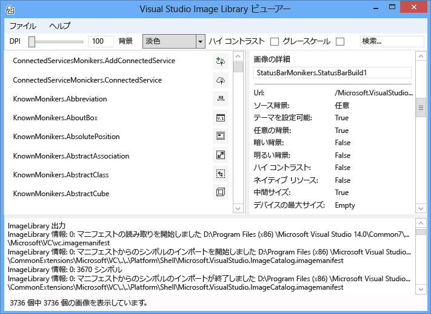
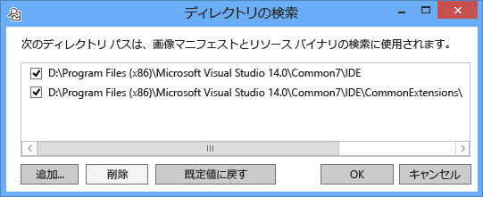
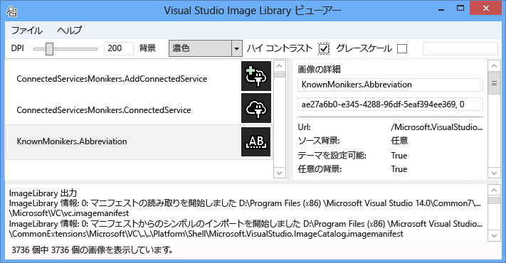
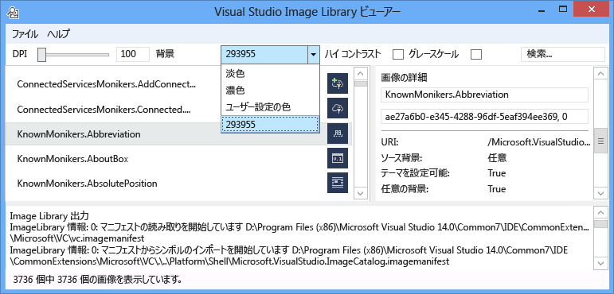
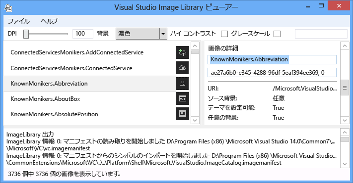
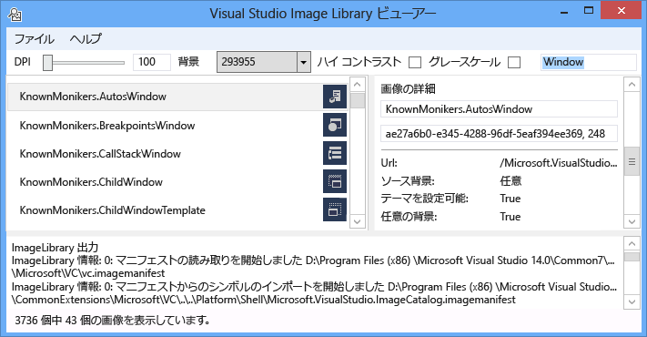
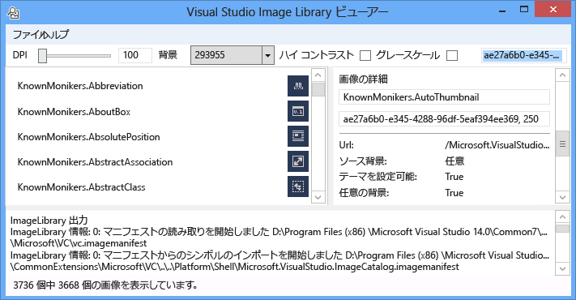
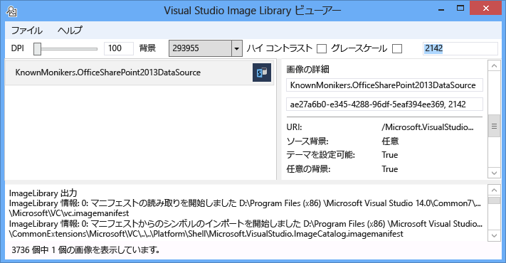

# <a name="image-library-viewer"></a>イメージ ライブラリ ビューア
Visual Studio イメージ ライブラリ ビューアー ツールでは、イメージ マニフェストの読み込みと検索を行うことができます。これにより、Visual Studio の場合と同じ方法でユーザーが操作できるようになります。 ユーザーは、背景、サイズ、DPI、ハイ コントラストなどの設定を変更できます。 このツールでは、各イメージ マニフェストの読み込み情報も表示され、イメージ マニフェスト内の各イメージのソース情報が表示されます。 このツールは次の目的に役立ちます。

1. エラーの診断

2. カスタム イメージ マニフェストで属性が正しく設定されていることの確認

3. Visual Studio の拡張機能で Visual Studio のスタイルに適合するイメージを使用できるように、Visual Studio イメージ カタログ内のイメージを検索する

   

   **イメージ モニカー**

   イメージ モニカー (または略してモニカー) は、イメージ ライブラリ内のイメージ アセットまたはイメージ リスト アセットを一意に識別する GUID:ID のペアです。

   **イメージ マニフェスト ファイル**

   イメージ マニフェスト (.imagemanifest) ファイルは、一連のイメージ アセット、それらのアセットを表すモニカー、および実際のイメージまたは各アセットを表すイメージを定義する XML ファイルです。 イメージ マニフェストでは、従来の UI をサポートするために、スタンドアロン イメージまたはイメージ リストを定義できます。 また、アセットまたは各アセットの背後にある個々の画像に対して設定できる属性があり、これらのアセットが表示されるタイミングと方法を変更できます。

   **イメージ マニフェストのスキーマ**

   イメージ マニフェスト全体は次のようになります。

```xml
<ImageManifest>
      <!-- zero or one Symbols elements -->
      <Symbols>
        <!-- zero or more Guid, ID, or String elements -->
      </Symbols>
      <!-- zero or one Images elements -->
      <Images>
        <!-- zero or more Image elements -->
      </Images>
      <!-- zero or one ImageLists elements -->
      <ImageLists>
        <!-- zero or more ImageList elements -->
      </ImageLists>
</ImageManifest>
```

 **記号**

 読みやすく、メンテナンスを容易にするために、イメージ マニフェストには属性値として記号を使用できます。 記号は次のように定義されます。

```xml
<Symbols>
      <Import Manifest="manifest" />
      <Guid Name="ShellCommandGuid" Value="8ee4f65d-bab4-4cde-b8e7-ac412abbda8a" />
      <ID Name="cmdidSaveAll" Value="1000" />
      <String Name="AssemblyName" Value="Microsoft.VisualStudio.Shell.UI.Internal" />
</Symbols>
```

|**サブ要素**|**定義**|
|-|-|
|[インポート]|現在のマニフェストで使用するために、指定されたマニフェスト ファイルの記号をインポートします。|
|Guid|記号は GUID を表し、GUID の書式設定と一致する必要があります。|
|id|記号は ID を表し、負でない整数である必要があります。|
|String|記号は任意の文字列値を表します。|

 記号は大文字と小文字が区別され、$(記号名) の構文を使用して参照されます。

```xml
<Image Guid="$(ShellCommandGuid)" ID="$(cmdidSaveAll)" >
      <Source Uri="/$(AssemblyName);Component/Resources/image.xaml" />
</Image>
```

 一部の記号は、すべてのマニフェストに対して事前に定義されています。 これらは、ローカル コンピューター上のパスを参照するために、\<Source> 要素または \<Import> 要素の Uri 属性で使用できます。

|**記号**|**説明**|
|-|-|
|CommonProgramFiles|%CommonProgramFiles% 環境変数の値|
|LocalAppData|%LocalAppData% 環境変数の値|
|ManifestFolder|マニフェスト ファイルが含まれるフォルダー|
|MyDocuments|現在のユーザーのマイ ドキュメント フォルダーの完全なパス|
|ProgramFiles|%ProgramFiles% 環境変数の値|
|システム|Windows\System32 フォルダー|
|WinDir|%WinDir% 環境変数の値|

 **Image**

 \<Image> 要素には、モニカーから参照できる画像を定義します。 GUID と ID を組み合わせてイメージ モニカーが形成されます。 イメージ モニカーは、画像ライブラリ全体で一意である必要があります。 特定のモニカーが複数の画像に含まれている場合は、ライブラリのビルド中に最初に検出されたものが保持されます。

 ソースは少なくとも 1 つ含まれている必要があります。 サイズに依存しないソースは幅広いサイズで最適な結果を得られますが、必須ではありません。 サービスが \<Image> 要素で定義されていないサイズのイメージを要求され、サイズに依存しないソースが存在しない場合、サービスでは最適なサイズ固有のソースを選択し、要求されたサイズにスケーリングします。

```xml
<Image Guid="guid" ID="int" AllowColorInversion="true/false">
      <Source ... />
      <!-- optional additional Source elements -->
</Image>
```

|**属性**|**定義**|
|-|-|
|Guid|[必須] イメージ モニカーの GUID 部分|
|id|[必須] イメージ モニカーの ID 部分|
|AllowColorInversion|[省略可能、既定値は true] 画像を暗い背景で使用するときに、色をプログラムによって反転するかどうかを示します。|

 **ソース**

 \<Source> 要素には、単一の画像ソース アセット (XAML と PNG) を定義します。

```xml
<Source Uri="uri" Background="background">
      <!-- optional NativeResource element -->
 </Source>
```

|**属性**|**定義**|
|-|-|
|Uri|[必須] 画像の読み込み元となる場所を定義する URI。 次のいずれかを指定できます。<br /><br /> - application:/// オーソリティを使用する[パック URI](/dotnet/framework/wpf/app-development/pack-uris-in-wpf)<br /><br /> - コンポーネントの絶対リソース参照<br /><br /> - ネイティブ リソースを含むファイルのパス|
|バックグラウンド|[省略可能] ソースの使用を想定している背景の種類を示します。<br /><br /> 次のいずれかを指定できます。<br /><br /> - *Light*: ソースは明るい背景で使用できます。<br /><br /> - *Dark*: ソースは暗い背景で使用できます。<br /><br /> - *HighContrast*: ソースは、ハイ コントラスト モードの任意の背景で使用できます。<br /><br /> - *HighContrastLight*: ソースは、ハイ コントラスト モードの明るい背景で使用できます。<br /><br /> -*HighContrastDark*: ソースは、ハイ コントラスト モードの暗い背景で使用できます。<br /><br /> **Background** 属性が省略されている場合は、任意の背景でソースを使用できます。<br /><br /> **Background** が *Light*、*Dark*、*HighContrastLight*、または *HighContrastDark* の場合、ソースの色は反転されません。 **Background** が省略されているか *HighContrast* に設定されている場合、ソースの色の反転は、イメージの **AllowColorInversion** 属性によって制御されます。|

 \<Source> 要素には、次のオプションのサブ要素のうち 1 つのみを含めることができます。

|**要素**|**属性 (すべて必須)**|**定義**|
|-|-|-|
|\<Size>|値|ソースは、指定されたサイズ (デバイス単位) の画像に使用されます。 画像は正方形になります。|
|\<SizeRange>|MinSize、MaxSize|ソースは、MinSize から MaxSize (デバイス単位) までの画像に使用されます。 画像は正方形になります。|
|\<Dimensions>|Width、Height|ソースは、指定された幅と高さ (デバイス単位) の画像に使用されます。|
|\<DimensionRange>|MinWidth、MinHeight、<br /><br /> MaxWidth、MaxHeight|ソースは、幅と高さの最小値から幅と高さの最大値まで (デバイス単位) の画像に使用されます。|

 \<Source> 要素には、省略可能な \<NativeResource> サブ要素を含めることもできます。これを使用して、マネージド アセンブリではなくネイティブ アセンブリから読み込まれる \<Source> を定義できます。

```xml
<NativeResource Type="type" ID="int" />
```

|**属性**|**定義**|
|-|-|
|Type|[必須] ネイティブ リソースの種類 (XAML または PNG)|
|id|[必須] ネイティブ リソースの整数 ID 部分|

 **ImageList**

 \<ImageList> 要素には、1 つのストリップで返すことができる画像のコレクションを定義します。 ストリップは必要に応じて要求時に構築されます。

```xml
<ImageList>
      <ContainedImage Guid="guid" ID="int" External="true/false" />
      <!-- optional additional ContainedImage elements -->
 </ImageList>
```

|**属性**|**定義**|
|-|-|
|Guid|[必須] イメージ モニカーの GUID 部分|
|id|[必須] イメージ モニカーの ID 部分|
|外部|[省略可能、既定値は false] イメージ モニカーから、現在のマニフェスト内の画像が参照されているかどうかを示します。|

 含まれている画像のモニカーから、現在のマニフェストに定義されている画像を参照する必要はありません。 含まれているイメージがイメージ ライブラリに見つからない場合は、空白のプレースホルダー イメージが代わりに使用されます。

## <a name="how-to-use-the-tool"></a>ツールの使用方法
 **カスタム イメージ マニフェストの検証**

 カスタム マニフェストを作成するには、ManifestFromResources ツールを使用してマニフェストを自動生成することをお勧めします。 カスタム マニフェストを検証するには、イメージ ライブラリ ビューアーを起動し、[ファイル] > [パスの設定...] の順に選択して、[ディレクトリの検索] ダイアログを開きます。 このツールでは、検索ディレクトリを使用してイメージ マニフェストを読み込みますが、それを使用してマニフェスト内のイメージを含む .dll ファイルも検索します。そのため、このダイアログにはマニフェストと DLL の両方のディレクトリが含まれている必要があります。

 

 **[追加...]** をクリックして新しい検索ディレクトリを選択し、マニフェストとそれに対応する DLL を検索します。 このツールでは、これらの検索ディレクトリが記憶され、ディレクトリのチェック ボックスをオンまたはオフにすることで、これらのディレクトリを有効または無効にすることができます。

 既定では、ツールは Visual Studio のインストール ディレクトリを検索し、これらのディレクトリを検索ディレクトリの一覧に追加しようとします。 ツールによって検出されないディレクトリを手動で追加することができます。

 すべてのマニフェストが読み込まれたら、ツールを使用してイメージの **背景** 色、**DPI**、**ハイ コントラスト**、または **グレースケール** を切り替えることができます。これにより、ユーザーはイメージ アセットを視覚的に調べて、さまざまな設定に対して正しくレンダリングされていることを確認できます。

 

 背景色は、Light、Dark、またはカスタム値に設定できます。 [カスタム色] を選択すると、色の選択ダイアログが開き、後で簡単に再呼び出しできるように、背景コンボ ボックスの下部にそのカスタム色が追加されます。

 

 イメージ モニカーを選択すると、右側の [イメージの詳細] ペインにモニカーの背後にある実際の各イメージの情報が表示されます。 このペインでは、ユーザーが名前または未加工の GUID:ID 値を使用してモニカーをコピーすることもできます。

 

 各イメージ ソースに対して表示される情報には、表示する背景の種類、テーマを使用できるか、ハイ コントラストをサポートするか、有効なサイズまたはサイズに依存しないか、およびイメージがネイティブ アセンブリから取得されるかどうかが含まれます。

 

 イメージ マニフェストを検証するときは、実際の場所にマニフェストとイメージ DLL を配置することをお勧めします。 これにより、相対パスが正常に機能していること、およびイメージ ライブラリがマニフェストとイメージ DLL を見つけて読み込むことができることが確認されます。

 **イメージ カタログ KnownMonikers の検索**

 Visual Studio のスタイルに適合するように、Visual Studio 拡張機能では、独自のイメージを作成して使用するのではなく、Visual Studio イメージ カタログのイメージを使用できます。 これにはこれらのイメージを管理する必要がないという利点があり、Visual Studio でサポートされているすべての DPI 設定で適切に表示されるように、イメージが高 DPI のバッキング イメージを持つことが保証されます。

 イメージ ライブラリ ビューアーではマニフェストを検索できるため、ユーザーはイメージ アセットを表すモニカーを見つけて、そのモニカーをコードで使用できます。 イメージを検索するには、検索ボックスに目的の検索語句を入力し、Enter キーを押します。 下部のステータス バーには、すべてのマニフェストのイメージ全体から見つかった一致の数が表示されます。

 

 既存のマニフェストでイメージ モニカーを検索する場合は、Visual Studio イメージ カタログのモニカー、他の意図的にパブリックにアクセスできるモニカー、または独自のカスタム モニカーだけを検索して使用することをお勧めします。 非パブリック モニカーを使用すると、その非パブリック モニカーやイメージが変更または更新された場合に、カスタム UI が破損したり、予期しない方法でイメージが変更されたりする可能性があります。

 また、GUID で検索することもできます。 この種の検索は、リストを 1 つのマニフェストにフィルター処理する場合、またはマニフェストに複数の GUID が含まれている場合にマニフェストのサブセクションを絞り込む場合に便利です。

 

 最後に、ID で検索することもできます。

 

## <a name="notes"></a>Notes

- 既定では、ツールは Visual Studio のインストール ディレクトリに存在する複数のイメージ マニフェストを取得します。 一般公開されているモニカーを持つ唯一のものは、**Microsoft.VisualStudio.ImageCatalog** マニフェストです。 GUID: ae27a6b0-e345-4288-96df-5eaf394ee369 (カスタム マニフェストではこの GUID をオーバーライド **しません**) 型: KnownMonikers

- 起動時には検出されたすべてのイメージ マニフェストを読み込もうとするため、アプリケーションが実際に表示されるまでに数秒かかることがあります。 マニフェストの読み込み中に、処理速度が低下したり、応答しなくなったりすることもあります。

## <a name="sample-output"></a>出力例
 このツールは出力を生成しません。
