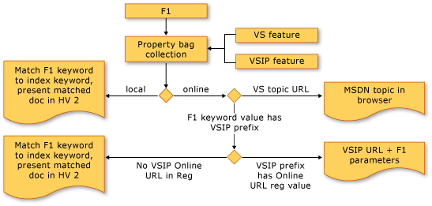

# <a name="microsoft-help-viewer-sdk"></a>Microsoft ヘルプ ビューアー SDK

この記事には、Visual Studio ヘルプ ビューアーのインテグレーター向けの次のタスクが含まれています。

- トピックの作成 (F1 のサポート)

- ヘルプ ビューアーのコンテンツブランド化パッケージの作成

- 一連の記事の展開

- Visual Studio シェル (統合または分離) へのヘルプの追加

- その他の情報

## <a name="create-a-topic-f1-support"></a>トピックを作成する (F1 のサポート)

このセクションでは、表示されるトピックのコンポーネントの概要、トピックの要件、トピックの作成方法の簡単な説明 (F1 のサポート要件など)、そして最後にレンダリングされた結果を含むトピックの例について説明します。

**ヘルプ ビューアー トピックの概要**

トピックがレンダリングのために呼び出されると、ヘルプ ビューアーにより、ブランド化パッケージ要素が取得されます。これらは、インストール時または最終更新時にトピックの XHTML と共にトピックに関連付けられ、2 つが組み合わされて、表示されるコンテンツ ビュー (ブランド データ + トピック データ) になります。  ブランド化パッケージには、ロゴ、コンテンツ動作のサポート、およびブランド化テキスト (著作権など) が含まれています。  ブランド化パッケージ要素の詳細については、後述するブランド化パッケージの作成に関するセクションを参照してください。  トピックに関連付けられたブランド化パッケージがない場合、ヘルプ ビューアーにより、ヘルプ ビューアー アプリケーションのルート (Branding_en-US.mshc) にあるフォールバック ブランド化パッケージが使用されます。

**ヘルプ ビューアー トピックの要件**

ヘルプ ビューアー内で正しくレンダリングされるには、生のトピック コンテンツが W3C Basic 1.1 XHTML である必要があります。

通常、トピックには次の 2 つのセクションがあります。

- メタデータ (「コンテンツのメタデータ」のリファレンスを参照してください): トピックに関するデータ。たとえば、トピックの一意の ID、キーワード値、トピックの目次 ID、親ノード ID などです。

- 本文のコンテンツ: サポートされているコンテンツの動作 (折りたたみ可能な領域、コード スニペットなど。詳細な一覧については後述します) を含め、W3C Basic 1.1 XHTML に準拠しています。

Visual Studio ブランド化パッケージでサポートされるコントロール:

- リンク

- CodeSnippet

- CollapsibleArea

- 継承メンバー

- LanguageSpecificText

サポートされている言語の文字列 (大文字と小文字は区別されません):

- JavaScript

- csharp または c#

- cplusplus または visualc++ または c++

- jscript

- visual basic または vb

- f# または fsharp.core または fs

- その他 - 言語名を表す文字列

**ヘルプ ビューアー トピックの作成**

ContosoTopic4.htm という名前の新しい XHTML ドキュメントを作成し、タイトル タグ (後述) を含めます。

```html
<html>
<head>
<title>Contoso Topic 4</title>
</head>

<body>

</body>
</html>

```

次に、データを追加し、トピックの表示方法 (自己ブランド化されているかどうか)、F1 のこのトピックの参照方法、目次内でのこのトピックの位置、その ID (他のトピックからのリンク参照用) などを定義します。サポートされているメタデータの詳細な一覧については、次の「コンテンツのメタデータ」の表を参照してください。

- この例では、Visual Studio ヘルプ ビューアー ブランド化パッケージのバリエーションである独自のブランド化パッケージを使用します。

- IDE プロパティ バッグで指定された F1 値と一致する F1 メタ名と値 ("Microsoft.Help.F1" content = "ContosoTopic4") を追加します (詳細については、「F1 のサポート」セクションを参照してください)。この値は IDE 内からの F1 の呼び出しと照合され、IDE で F1 が選択されたときにこのトピックが表示されます。

- トピック ID を追加します。 これは、他のトピックからこのトピックにリンクするために使用される文字列です。 これはこのトピックのヘルプ ビューアー ID です。

- 目次の場合、このトピックの親ノードを追加して、このトピックの目次ノードが表示される位置を定義します。

- 目次の場合、このトピックのノード順序を追加します。 親ノードに `n` 個の子ノードがある場合、このトピックの位置を子ノードの順序で定義します。 たとえば、このトピックは 4 つの子トピックのうちの 4 番目です。

メタデータ セクションの例:

```html
<html>
<head>
<title>Contoso Topic 4</title>

<meta name="SelfBranded" content="false" />
    <meta http-equiv="Content-Type" content="text/html; charset=UTF-8" />
    <meta name="Microsoft.Help.Id" content="ContosoTopic4" />
<meta name="Microsoft.Help.F1" content=" ContosoTopic4" />
    <meta name="Language" content="en-us" />
<meta name="Microsoft.Help.TocParent" content="ContosoTopic0" />
<meta name="Microsoft.Help.TocOrder" content="4" />

</head>

<body>

</body>
</html>
```

**トピックの本文**

トピックの本文 (ヘッダーとフッターを含まない) には、ページ リンク、メモ セクション、折りたたみ可能領域、コード スニペット、および言語固有のテキストのセクションが含まれます。  表示されるトピックのこれらの領域については、ブランド化のセクションを参照してください。

1. トピック タイトル タグを追加します: `<div class="title">Contoso Topic 4</div>`

2. メモ セクションを追加します: `<div class="alert"> add your table tag and text </div>`

3. 折りたたみ可能な領域を追加します: `<CollapsibleArea Expanded="1" Title="Collapsible Area Test Heading"> add text  </CollapsibleArea>`

4. コード スニペットを追加します: `<CodeSnippet EnableCopyCode="true" Language="CSharp" ContainsMarkup="false" DisplayLanguage="C#" > a block of code </CodeSnippet>`

5. コード言語固有のテキストを追加します: `<LanguageSpecificText devLangcs="CS" devLangvb="VB" devLangcpp="C++" devLangnu="F#" />` `devLangnu=` を使用すると、他の言語を入力できることに注意してください。 たとえば、コード スニペット DisplayLanguage = Fortran の場合、`devLangnu="Fortran"` により、Fortran が表示されます

6. ページ リンクを追加します: `<a href="ms-xhelp:///?Id=ContosoTopic1">Main Topic</a>`

> [!NOTE]
> 注: サポートされていない新しい "表示言語" (F#、Cobol、Fortran など) の場合、コード スニペットのコードの色分けはモノクロになります。

**ヘルプ ビューアー トピックの例** このコードは、メタデータ、コード スニペット、折りたたみ可能な領域、および言語固有のテキストを定義する方法を示すものです。

```html
<?xml version="1.0" encoding="utf-8"?>
<html>
<head>
<title>Contoso Topic 4</title>

    <meta http-equiv="Content-Type" content="text/html; charset=UTF-8" />
    <meta name="Microsoft.Help.Id" content="ContosoTopic4" />
<meta name="Microsoft.Help.F1" content=" ContosoTopic4" />
    <meta name="Language" content="en-us" />
<meta name="Microsoft.Help.TocParent" content="ContosoTopic0" />
<meta name="Microsoft.Help.TocOrder" content="4" />
<meta name="SelfBranded" content="false" />
</head>

<body>
<div class="title">Contoso Topic 4</div>

  <div id="header">
<table id="bottomTable" cellpadding="0" cellspacing="0"  width="100%">
        <tr id="headerTableRow2"><td align="left">
            <span id="nsrTitle">Contoso Topic 1</span>
          </td>
<td align="right">
</td></tr>
<tr id="headerTableRow1"><td align="left">
            <span id="runningHeaderText">Contoso Widgets & Sprockets</span>
          </td></tr>
      </table>
</div>

<h2>Table of Contents</h2>

<ul class="toc">
<li class="tocline1"><a href="#introduction" target="_self">1.0 Introduction</a></li>
<li class="tocline1"><a href="#seealso" target="_self">See Also</a></li>
</ul>

<div class="topic">

<div id="mainSection">
<div id="mainBody">

<a name="introduction"></a>
<h2>1.0 Introduction</h2>
<p>[This documentation is for sample purposes only.]</p>

<p>Contoso Topic 1 contains examples of:
<ul>
<li>Collapsible Area</li>
<li>Bookmark ("See also")</li>
<li>Code Snippets from Branding Package</li>
</ul>
 </p>
<div class="alert"><table><tr><th>
<strong>Note </strong></th></tr>
<tr><td>
<p>This is an example of a <span class="label">Note </span>section.
Call out important items for your reader in this <span class="label">Note </span>box.
</p></td></tr>
</table>
</div>
</div>

<CollapsibleArea Expanded="1" Title="Collapsible Area Test Heading">

            <a id="sectionToggle0"><!----></a>

<div>
Example of Collapsible Area
<br/>
Lorem ipsum dolor sit amet...
</div>
</CollapsibleArea>

<div id="snippetGroup" >
<CodeSnippet EnableCopyCode="true" Language="VisualBasic" ContainsMarkup="false" DisplayLanguage="Visual Basic" >
Private Sub ToolStripRenderer1_RenderGrip(sender as Object, e as ToolStripGripRenderEventArgs) _ Handles ToolStripRenderer1.RenderGrip
Dim messageBoxVB as New System.Text.StringBuilder()
    messageBoxVB.AppendFormat("{0} = {1}", "GripBounds", e.GripBounds)
    messageBoxVB.AppendLine()
 ...
    MessageBox.Show(messageBoxVB.ToString(),"RenderGrip Event")
End Sub
</CodeSnippet>

<CodeSnippet EnableCopyCode="true" Language="CSharp" ContainsMarkup="false" DisplayLanguage="C#" >
private void ToolStripRenderer1_RenderGrip(Object sender, ToolStripGripRenderEventArgs e)
{
System.Text.StringBuilder messageBoxCS = new System.Text.StringBuilder();
messageBoxCS.AppendFormat("{0} = {1}", "GripBounds", e.GripBounds );
messageBoxCS.AppendLine();
...
MessageBox.Show(messageBoxCS.ToString(), "RenderGrip Event" );
}
</CodeSnippet>

<CodeSnippet EnableCopyCode="true" Language="fsharp" ContainsMarkup="false" DisplayLanguage="F#" >
some F# code
</CodeSnippet>
</div>

<h4 class="subHeading">Example of code specific text</h4>Language = <LanguageSpecificText devLangcs="CS" devLangvb="VB" devLangcpp="C++" devLangnu="F#" />

<a name="seealso"></a>
<h1 class="heading">See Also</h1>

    <div id="seeAlsoSection" class="section">
    <div class="seeAlsoStyle">
        <a href="ms-xhelp:///?Id=ContosoTopic1">Main Topic</a>
    </div>
 </div>
</div>
</div>
</body>
</html>
```

**F1 のサポート**

Visual Studio では、F1 により、IDE 内のカーソルの配置から提供される値が生成され、提供された値 (カーソルの位置に基づく) が "プロパティ バッグ" に入力されます。 カーソルが機能 x の上に置かれると、機能 x はアクティブになり (フォーカスが設定され)、プロパティ バッグに値が設定されます。  F1 を選択すると、プロパティ バッグにデータが設定され、Visual Studio の F1 コードにより、顧客の既定のヘルプ ソースがローカルかオンラインか (オンラインが既定値) が確認され、ユーザー設定に基づいて適切な文字列が作成されます (オンラインが既定値)。つまり、ローカル ヘルプ ビューアーのパラメーターを指定したシェル実行 (exe の起動パラメーターについてはヘルプ管理者ガイドを参照してください) + ローカル ヘルプが既定値の場合はプロパティ バッグからのキーワード、またはパラメーター一覧にキーワードを使用する MSDN URL です。

F1 に対して複数値文字列と呼ばれる 3 つの文字列が返された場合は、最初の用語が取得され、ヒットするものが検索され、見つかった場合は完了です。そうでない場合は、次の文字列に移動します。  順序が重要です。 複数値キーワードの表示は、最長の文字列から最短の文字列になるようにします。  複数値キーワードの場合にこれを確認するには、選択したキーワードを含むオンラインの F1 URL 文字列を確認します。

Visual Studio 2012 では、意図的に、オンラインとオフラインの区別をより厳格にしました。そのため、ユーザーの設定がオンラインの場合、Visual Studio 2010 のようにヘルプ ライブラリ エージェントを介してルーティングするのではなく、F1 要求を MSDN のオンライン クエリ サービスに直接渡すようになりました。 次に、"vendor content installed = true" の状態に基づいて、そのコンテキストで何か別のことを行うかどうかを判断します。 true の場合、顧客向けに何をサポートしたいかに応じて、この解析とルーティング ロジックを実行します。 false の場合は、MSDN にアクセスします。 ユーザーの設定がローカルの場合、すべての呼び出しはローカル ヘルプ エンジンに送信されます。

F1 フロー図:



ヘルプ ビューアーの既定のヘルプ コンテンツ ソースがオンラインに設定されている場合 (ブラウザーでの起動):

- Visual Studio Partner (VSP) 機能により、F1 プロパティ バッグに値が出力される (プロパティ バッグ prefix.keyword とレジストリにあるプレフィックスのオンライン URL): F1 により、VSP URL + パラメーターがブラウザーに送信されます。

- Visual Studio の機能 (言語エディター、Visual Studio 固有のメニュー項目など): F1 により、Visual Studio の URL がブラウザーに送信されます。

ヘルプ ビューアーの既定のヘルプ コンテンツ ソースがローカルのヘルプに設定されている場合 (ヘルプ ビューアーでの起動):

- F1 プロパティ バッグとローカル ストア インデックスの間でキーワードが一致する VSP の機能 (つまり、プロパティ バッグの prefix.keyword = ローカル ストア インデックスで見つかった値): F1 により、ヘルプ ビューアーにトピックがレンダリングされます。

- Visual Studio の機能 (VSP には、Visual Studio の機能から発行されたプロパティ バッグをオーバーライドするオプションがありません): F1 により、ヘルプ ビューアーに Visual Studio のトピックがレンダリングされます。

ベンダーのヘルプ コンテンツに対する F1 フォールバックを有効にするには、次のレジストリ値を設定します。 F1 フォールバックとは、F1 ヘルプ コンテンツをオンラインで検索するように ヘルプ ビューアーが設定されており、ユーザーのハード ドライブのローカルにベンダーのコンテンツがインストールされていることを意味します。 既定の設定がオンライン ヘルプの場合でも、ヘルプ ビューアーからはコンテンツのローカル ヘルプを確認する必要があります。

1. 次の Help 2.3 レジストリ キー以下にある **VendorContent** 値を設定します。

   - 32 ビット オペレーティング システムの場合:

        HKEY_LOCAL_MACHINE\SOFTWARE\Microsoft\Help\v2.3\Catalogs\VisualStudio15

        "VendorContent"=dword:00000001

   - 64 ビット オペレーティング システムの場合:

        HKEY_LOCAL_MACHINE\SOFTWARE\Wow6432Node\Microsoft\Help\v2.3\Catalogs\VisualStudio15

        "VendorContent"=dword:00000001

2. 次の Help 2.3 レジストリ キー以下に partner 名前空間を登録します。

   - 32 ビット オペレーティング システムの場合:

      HKEY_LOCAL_MACHINE\SOFTWARE\Microsoft\Help\v2.3\Partner<em>\\<namespace\></em>

      "location"="offline"

   - 64 ビット オペレーティング システムの場合:

      HKEY_LOCAL_MACHINE\SOFTWARE\Wow6432Node\Microsoft\Help\v2.3\Partner<em>\\<namespace\></em>

      "location"="offline"

**ベース ネイティブ名前空間の解析**

ベース ネイティブ名前空間の解析を有効にするには、レジストリで (サポートするカタログ キー以下に) BaseNativeNamespaces という名前の新しい DWORD を追加し、その値を 1 に設定します。  たとえば、Visual Studio カタログを使用する場合は、次のパスにキーを追加します。

HKEY_LOCAL_MACHINE\SOFTWARE\Wow6432Node\Microsoft\Help\v2.3\Catalogs\VisualStudio15

HEADER/METHOD 形式の F1 キーワードが検出されると、"/" 文字が解析され、次のように構成されます。

- HEADER: レジストリへの登録に使用できる名前空間になります

- METHOD: 渡されるキーワードになります。

たとえば、CustomLibrary というカスタム ライブラリと MyTestMethod というメソッドがある場合、F1 要求が届くと、`CustomLibrary/MyTestMethod` という形式になります。

これで、ユーザーは Partners ハイブ以下の名前空間として CustomLibrary を登録し、必要な位置キーを指定できるようになります。また、クエリに渡されるキーワードは MyTestMethod になります。

**IDE でヘルプ デバッグ ツールを有効にする**

次のレジストリ キーと値を追加します。

::: moniker range="vs-2017"

**HKEY_CURRENT_USER\Software\Microsoft\VisualStudio\15.0\Dynamic Help**

::: moniker-end

::: moniker range=">=vs-2019"

**HKEY_CURRENT_USER\Software\Microsoft\VisualStudio\16.0\Dynamic Help**

::: moniker-end

値: Display Debug Output in Retail Data (小売データにデバッグ出力を表示する): はい

IDE の [ヘルプ] メニュー項目で、 **[ヘルプ コンテキストのデバッグ]** を選択します。

**コンテンツのメタデータ**

次の表で、角かっこで囲まれた文字列はプレースホルダーであり、認識される値に置き換える必要があります。 たとえば、\<meta name="Microsoft.Help.Locale" content="[language code]" /> の "[language code]" は "en-us" などの値に置き換える必要があります。

| Property (HTML 表現) | 説明 |
| - | - |
| \< meta name="Microsoft.Help.Locale" content="[language-code]" /> | このトピックのロケールを設定します。 このタグをトピックで使用する場合は、1 回だけ使用し、他の Microsoft ヘルプ タグよりも上に挿入する必要があります。 このタグが使用されていない場合、トピックの本文テキストは、製品のロケールが指定されている場合、それに関連付けられているワード ブレーカーを使用してインデックスが作成されます。それ以外の場合は、en-us のワード ブレーカーが使用されます。 このタグは ISOC RFC 4646 に準拠しています。 Microsoft ヘルプが正しく動作するには、汎用の言語属性ではなくこのプロパティを使用してください。 |
| \< meta name="Microsoft.Help.TopicLocale" content="[language-code]" /> | 他のロケールも使用されている場合は、このトピックのロケールを設定します。 このタグをトピックで使用する場合は、1 回だけ使用する必要があります。 カタログに複数の言語のコンテンツが含まれている場合は、このタグを使用します。 カタログ内の複数のトピックに同じ ID を設定することはできますが、それぞれに一意の TopicLocale を指定する必要があります。 カタログのロケールと一致する TopicLocale を指定するトピックは、目次に表示されるトピックになります。 ただし、トピックのすべての言語バージョンが検索結果に表示されます。 |
| \< title>[Title]\</title> | このトピックのタイトルを指定します。 このタグは必須であり、トピックで 1 回だけ使用する必要があります。 トピックの本文にタイトルの \<div> セクションが含まれていない場合、このタイトルはトピックと目次に表示されます。 |
| \< meta name=" Microsoft.Help.Keywords" content="[aKeywordPhrase]"/> | ヘルプ ビューアーのインデックス ペインに表示されるリンクのテキストを指定します。 リンクをクリックすると、トピックが表示されます。 トピックに複数のインデックス キーワードを指定できます。このトピックへのリンクをインデックスに表示しない場合は、このタグを省略できます。 以前のバージョンのヘルプにあった "K" キーワードは、このプロパティに変換することができます。 |
| \< meta name="Microsoft.Help.Id" content="[TopicID]"/> | このトピックの識別子を設定します。 このタグは必須であり、トピックで 1 回だけ使用する必要があります。 ID は、カタログ内のロケール設定が同じトピック間で一意にする必要があります。 別のトピックでは、この ID を使用してこのトピックへのリンクを作成できます。 |
| \< meta name="Microsoft.Help.F1" content="[System.Windows.Controls.Primitives.IRecyclingItemContainerGenerator]"/> | このトピックの F1 キーワードを指定します。 1 つのトピックに複数の F1 キーワードを指定できます。また、アプリケーション ユーザーが F1 キーを押したときにこのトピックを表示しない場合は、このタグを省略できます。 通常、1 つのトピックには 1 つの F1 キーワードのみが指定されます。 以前のバージョンのヘルプにあった "F" キーワードは、このプロパティに変換することができます。 |
| \< meta name="Description" content="[topic description]" /> | このトピックのコンテンツの簡単な概要を表示します。 このタグをトピックで使用する場合は、1 回だけ使用する必要があります。 このプロパティには、クエリ ライブラリから直接アクセスします。これはインデックス ファイルには格納されません。 |
| meta name="Microsoft.Help.TocParent" content="[parent_Id]"/> | 目次内のこのトピックの親トピックを指定します。 このタグは必須であり、トピックで 1 回だけ使用する必要があります。 値は、親の Microsoft.Help.Id です。 1 つのトピックが目次内に持つことができる位置は 1 つのみです。 "-1" は、目次ルートのトピック ID と見なされます。 [!INCLUDE[vs_dev12](../../extensibility/includes/vs_dev12_md.md)] の場合、そのページはヘルプ ビューアーのホームページです。 これは、一部のトピックに TocParent = -1 を明示的に追加して、最上位に表示されるようにする場合と同じ理由です。 ヘルプ ビューアーのホーム ページはシステム ページであるため、置き換えることはできません。 VSP により、ID が -1 のページを追加しようとすると、コンテンツ セットには追加されても、ヘルプ ビューアーには常にシステム ページ (ヘルプ ビューアーのホーム) が使用されます |
| \< meta name="Microsoft.Help.TocOrder" content="[positive integer]"/> | このトピックが、そのピア トピックとの相対関係で目次のどこに表示されるかを指定します。 このタグは必須であり、トピックで 1 回だけ使用する必要があります。 値は整数です。 低い値の整数が指定されたトピックは、高い値の整数が指定されたトピックよりも上に表示されます。 |
| \< meta name="Microsoft.Help.Product" content="[product code]"/> | このトピックで説明する製品を指定します。 このタグをトピックで使用する場合は、1 回だけ使用する必要があります。 この情報は、ヘルプ インデクサーに渡されるパラメーターとして指定することもできます。 |
| \< meta name="Microsoft.Help.ProductVersion" content="[version number]"/> | このトピックで説明する製品のバージョンを指定します。 このタグをトピックで使用する場合は、1 回だけ使用する必要があります。 この情報は、ヘルプ インデクサーに渡されるパラメーターとして指定することもできます。 |
| \< meta name="Microsoft.Help.Category" content="[string]"/> | コンテンツのサブセクションを識別するために製品によって使用されます。 1 つのトピックに対する複数のサブセクションを識別できます。リンクでサブセクションを識別しない場合は、このタグを省略できます。 このタグは、トピックが以前のバージョンのヘルプから変換されたときに、TargetOS と TargetFrameworkMoniker の属性を格納するために使用されます。 コンテンツの形式は AttributeName:AttributeValue です。 |
| \< meta name="Microsoft.Help.TopicVersion content="[topic version number]"/> | カタログ内に複数のバージョンが存在する場合に、このバージョンのトピックを指定します。 Microsoft.Help.Id は一意であることが保証されていないため、複数バージョンのトピックがカタログ内に存在する場合は、このタグが必要です。たとえば、カタログ内に .NET Framework 3.5 用のトピックと .NET Framework 4 用のトピックがあり、両方とも Microsoft.Help.Id が同じ場合などです。 |
| \< meta name="SelfBranded" content="[TRUE or FALSE]"/> | このトピックでヘルプ ライブラリ マネージャーのスタートアップ ブランド化パッケージを使用するか、トピックに固有のブランド化パッケージを使用するかを指定します。 このタグは TRUE または FALSE のいずれかにする必要があります。 TRUE の場合、関連するトピックのブランド化パッケージにより、ヘルプ ライブラリ マネージャーの起動時に設定されるブランド化パッケージはオーバーライドされるため、他のコンテンツのレンダリングと異なっていても、トピックは意図したとおりにレンダリングされます。 FALSE の場合、現在のトピックは、ヘルプ ライブラリ マネージャーの起動時に、設定されているブランド化パッケージに従ってレンダリングされます。 既定では、SelfBranded 変数が TRUE と宣言されていない限り、ヘルプ ライブラリ マネージャーにより、自己ブランド化は false と見なされます。そのため、\<meta name="SelfBranded" content="FALSE"/> を宣言する必要はありません。 |

## <a name="create-a-branding-package"></a>ブランド化パッケージを作成する

Visual Studio のリリースには、Visual Studio パートナー向けの分離シェルや統合シェルなど、さまざまな Visual Studio 製品が含まれています。  これらの各製品で、製品に固有のトピック ベースのヘルプ コンテンツ ブランド化をある程度サポートする必要があります。  たとえば、Visual Studio トピックには一貫したブランド表示が必要ですが、Isolated Shell をラップする SQL Studio にはトピックごとに独自のヘルプ コンテンツのブランド化が必要です。  Integrated Shell パートナーは、独自のトピック ブランド化を維持しながら、ヘルプ トピックを親の Visual Studio 製品のヘルプ コンテンツ内に含めることを希望する場合があります。

ブランド化パッケージは、ヘルプ ビューアーを含む製品によってインストールされます。  Visual Studio 製品の場合:

- フォールバック ブランド化パッケージ (Branding_\<locale>.mshc) は、ヘルプ ビューアー言語パックによってヘルプ ビューアー 2.3 アプリのルート (例: C:\Program Files (x86)\Microsoft Help Viewer\v2.3) にインストールされます。  これは、製品のブランド化パッケージがインストールされていない (コンテンツがインストールされていない) 場合、またはインストールされているブランド化パッケージが破損している場合に使用されます。  アプリ ルートのフォールバック ブランド化パッケージが使用されている場合、Visual Studio 要素 (ロゴとフィードバック) は無視されます。

- Visual Studio コンテンツがコンテンツ パッケージ サービスからインストールされると、ブランド化パッケージもインストールされます (初めてのコンテンツ インストール シナリオの場合)。  ブランド化パッケージに更新がある場合、次のコンテンツ更新または追加のパッケージ インストール アクションが発生したときに更新がインストールされます。

Microsoft ヘルプ ビューアーは、トピック メタデータに基づくトピックのブランド化をサポートしています。

- トピック メタデータに自己ブランド化 = true が定義されている場合、トピックはそのままレンダリングされ、(ブランド化に関しては) 何も実行されません。

- トピック メタデータに自己ブランド化 = false が定義されている場合、TopicVendor メタデータ値に関連付けられているブランド化パッケージが使用されます。

- トピック メタデータに name = name="Microsoft.Help.TopicVendor" content=\< branding package name in vendor MSHA> が定義されている場合、コンテンツ値に定義されているブランド化パッケージが使用されます。

- Visual Studio カタログ内には、ブランド化パッケージの優先適用があります。  最初に Visual Studio の既定のブランド化が適用され、次に、トピック メタデータに定義され、関連するブランド化パッケージ (インストール msha で定義されているもの) でサポートされている場合、ベンダー定義のブランド化がオーバーライドとして適用されます。

通常、ブランド化要素は、次の 3 つの主要なカテゴリに分類されます。

- ヘッダー要素 (たとえば、フィードバック リンク、条件付き免責事項のテキスト、ロゴなど)

- コンテンツの動作 (たとえば、展開と折りたたみコントロールのテキスト要素やコード スニペット要素など)

- フッター要素 (たとえば、著作権)

ブランド要素と考えられる項目には、次のようなものがあります (この仕様で詳細について説明されています)。

- カタログと製品ロゴ (例: Visual Studio)

- フィードバック リンクと電子メールの要素

- 免責事項のテキスト

- 著作権テキスト

Visual Studio ヘルプ ビューアーのブランド化パッケージのサポート ファイルには、次のようなものがあります。

- グラフィックス (ロゴ、アイコンなど)

- Branding.js - コンテンツの動作をサポートするスクリプト ファイル

- Branding.xml - カタログ コンテンツ全体で一貫して使用される文字列。  注: branding.xml の Visual Studio のローカライズ テキスト要素の場合は、_locID="\<unique value>" を含めます。

- Branding.css - 表示の一貫性のためのスタイル定義

- Printing.css - 印刷物の一貫した表示のためのスタイル定義

前述のように、ブランド化パッケージは次のトピックに関連付けられています。

- SelfBranded = false がメタデータに定義されている場合、トピックにより、カタログ ブランド化パッケージが継承されます

- または、SelfBranded = false であり、MSHA に定義され、コンテンツのインストール時に使用できる一意のブランド化パッケージがある場合

カスタム ブランド化パッケージ (VSP コンテンツ、SelfBranded = True) を実装する VSP の場合、(ヘルプ ビューアーと共にインストールされる) フォールバック ブランド化パッケージから始めて、必要に応じてファイルの名前を変更するという方法もあります。  Branding_\<locale>.mshc ファイルは、ファイルの拡張子が .mshc に変更された zip ファイルであるため、拡張子を .mshc から .zip に変更するだけで、コンテンツを抽出できます。  ブランド化パッケージ要素については以下を参照し、必要に応じて変更してください (たとえば、ロゴを VSP ロゴに変更する、Branding.xml ファイル内のロゴへの参照を変更する、VSP の仕様に従って Branding.xml を更新するなど)。

すべての変更が完了したら、目的のブランド化要素を含む zip ファイルを作成し、拡張子を .mshc に変更します。

カスタム ブランド化パッケージを関連付けるには、MSHA を作成します。これには、ブランド化 mshc ファイルへの参照とコンテンツ mshc (トピックを含む) が含まれています。  基本的な MSHA の作成方法については、後述する MSHA のセクションを参照してください。

トピックに \<meta name="Microsoft.Help.SelfBranded" content="false"/> が含まれている場合、Branding.xml ファイルには、トピック内の特定の項目を一貫した方法でレンダリングするために使用される要素の一覧が含まれています。  Branding.xml ファイル内の要素の Visual Studio の一覧を以下に示します。  この一覧は、Isolated Shell を採用する場合にテンプレートとして使用するためのものです。独自の製品ブランド化のニーズに合わせて、これらの要素 (ロゴ、フィードバック、著作権など) を変更します。

注: "{n}" で示されている変数には、コードの依存関係があります。これらの値を削除または変更すると、エラーが発生し、アプリケーションがクラッシュする可能性があります。 ローカライズ識別子 (例: _locID="codesnippet.n") は、Visual Studio ブランド化パッケージに含まれています。

**Branding.xml**

| 要素 | 説明 |
| - | - |
| 機能: | **CollapsibleArea** |
| 次のコマンドを使用します。 | 展開と折りたたみのコンテンツ コントロール テキスト |
| **要素** | **Value** |
| ExpandText | Expand |
| CollapseText | [折りたたみ] |
| 機能: | **CodeSnippet** |
| 次のコマンドを使用します。 | コード スニペット コントロール テキスト。  注: "Non-Breaking" スペースを含むコード スニペット コンテンツは、スペースに変更されます。 |
| **要素** | **Value** |
| CopyToClipboard | [クリップボードにコピー] |
| ViewColorizedText | カラー表示 |
| CombinedVBTabDisplayLanguage | Visual Basic (サンプル) |
| VBDeclaration | 宣言 |
| VBUsage | 使用法 |
| 機能: | **フィードバック、フッター、ロゴ** |
| 次のコマンドを使用します。 | 顧客が現在のトピックに関するフィードバックをメールで送信するためのフィードバック コントロールを用意します。  コンテンツの著作権テキスト。  ロゴの定義。 |
| **要素** | **値 (これらの文字列は、コンテンツ採用者のニーズに合わせて変更できます。)** |
| CopyRight | © 2013 Microsoft Corporation. All rights reserved. |
| SendFeedback | Microsoft にこのトピックについての\<a href="{0}" {1}>フィードバックを送信\</a>する。 |
| FeedbackLink | |
| LogoTitle | [!INCLUDE[vs_dev12](../../extensibility/includes/vs_dev12_md.md)] |
| LogoFileName | vs_logo_bk.gif |
| LogoFileNameHC | vs_logo_wh.gif |
| 機能: | **免責事項** |
| 次のコマンドを使用します。 | 機械翻訳されたコンテンツに関する一連のケース固有の免責事項。 |
| **要素** | **Value** |
| MT_Editable | この記事は機械翻訳されたものです。 インターネットに接続できる場合は、[このトピックをオンラインで表示する] をクリックして、このページを編集可能モードで表示すると同時に元の英語コンテンツを表示してください。 |
| MT_NonEditable | この記事は機械翻訳されたものです。 インターネットに接続できる場合は、[このトピックをオンラインで表示する] をクリックして、このページを編集可能モードで表示すると同時に元の英語コンテンツを表示してください。 |
| MT_QualityEditable | この記事は手動翻訳されたものです。 インターネットに接続できる場合は、[このトピックをオンラインで表示する] をクリックして、このページを編集可能モードで表示すると同時に元の英語コンテンツを表示してください。 |
| MT_QualityNonEditable | この記事は手動翻訳されたものです。 インターネットに接続できる場合は、[このトピックをオンラインで表示する] をクリックして、このページを編集可能モードで表示すると同時に元の英語コンテンツを表示してください。 |
| MT_BetaContents | この記事は暫定リリース用に機械翻訳されたものです。 インターネットに接続できる場合は、[このトピックをオンラインで表示する] をクリックして、このページを編集可能モードで表示すると同時に元の英語コンテンツを表示してください。 |
| MT_BetaRecycledContents | この記事は暫定リリース用に手動翻訳されたものです。 インターネットに接続できる場合は、[このトピックをオンラインで表示する] をクリックして、このページを編集可能モードで表示すると同時に元の英語コンテンツを表示してください。 |
| 機能: | **LinkTable** |
| 次のコマンドを使用します。 | オンライン トピック リンクのサポート |
| **要素** | **Value** |
| LinkTableTitle | リンク テーブル |
| TopicEnuLinkText | このコンピューター上で利用できるこのトピックの英語版\</a>を表示します。 |
| TopicOnlineLinkText | このトピックを\<a href="{0}" {1}>オンライン\</a>で表示します |
| OnlineText | オンライン |
| 機能: | **ビデオ オーディオ コントロール** |
| 次のコマンドを使用します。 | ビデオ コンテンツの要素とテキストを表示します |
| **要素** | **Value** |
| MultiMediaNotSupported | {0} のコンテンツをサポートするには、Internet Explorer 9 以降がインストールされている必要があります。 |
| VideoText | ビデオの表示 |
| AudioText | オーディオのストリーミング |
| OnlineVideoLinkText | \<p>このトピックに関連するビデオを視聴するには、{0}\<a href="{1}">{2}ここ\</a>をクリックしてください。\</p> |
| OnlineAudioLinkText | \<p>このトピックに関連するオーディオを視聴するには、{0}\<a href="{1}">{2}ここ\</a>をクリックしてください。\</p> |
| 機能: | **"コンテンツがインストールされていません" コントロール** |
| 次のコマンドを使用します。 | contentnotinstalled.htm のレンダリングに使用されるテキスト要素 (文字列) |
| **要素** | **Value** |
| ContentNotInstalledTitle | このコンピューター上でコンテンツが見つかりませんでした。 |
| ContentNotInstalledDownloadContentText | \<p>コンテンツをコンピューターにダウンロードするには、\<a href="{0}" {1}>[管理] タブをクリック\</a>してください。\</p> |
| ContentNotInstalledText | \<p>このコンピューターにはコンテンツがインストールされていません。 ヘルプ コンテンツをローカルにインストールする場合は、管理者に問い合わせてください。\</p> |
| 機能: | **"トピックが見つかりません" コントロール** |
| 次のコマンドを使用します。 | topicnotfound.htm のレンダリングに使用されるテキスト要素 (文字列) |
| **要素** | **Value** |
| TopicNotFoundTitle | このコンピューター上で要求されたコンテンツが見つかりません。 |
| TopicNotFoundViewOnlineText | \<p>このコンピューター上で要求されたコンテンツが見つかりませんでした。ただし、\<a href="{0}" {1}>トピックをオンラインで表示\</a>できます。\</p> |
| TopicNotFoundDownloadContentText | \<p>類似トピックへのリンクについては、ナビゲーション ペインを参照してください。コンテンツをコンピューターにダウンロードするには、\<a href="{0}" {1}>[管理] タブをクリック\</a>してください。\</p> |
| TopicNotFoundText | \<p>このコンピューター上で要求されたトピックが見つかりませんでした。\</p> |
| 機能: | **"トピックが破損しています" コントロール** |
| 次のコマンドを使用します。 | topiccorrupted.htm のレンダリングに使用されるテキスト要素 (文字列) |
| **要素** | **Value** |
| TopicCorruptedTitle | 要求されたトピックを表示できません。 |
| TopicCorruptedViewOnlineText | \<p>要求されたトピックをヘルプ ビューアーで表示できません。 トピックのコンテンツまたは基になるシステム依存関係に誤りがある可能性があります。\</p> |
| 機能: | **ホーム ページ コントロール** |
| 次のコマンドを使用します。 | ヘルプ ビューアーの最上位ノード コンテンツの表示をサポートするテキスト。 |
| **要素** | **Value** |
| HomePageTitle | ヘルプ ビューアー ホーム |
| HomePageIntroduction | \<p>Microsoft ヘルプ ビューアーへようこそ。ヘルプ ビューアーは、Microsoft のツール、製品、技術、およびサービスを利用するすべての方にとっての基本的な情報源です。 ヘルプ ビューアーを使用すれば、手順、リファレンス、サンプル コード、技術記事などさまざまな情報を入手できます。 必要なコンテンツを探すには、目次、フルテキスト検索機能、またはキーワード インデックスを使用します。\</p> |
| HomePageContentInstallText | \<p>\<br />\<a href="{0}" {1}>[コンテンツの管理]\</a> タブを使用すると、次の操作を実行できます。\<ul>\<li>コンテンツをこのコンピューターに追加する。\</li>\<li>ローカル コンテンツの更新の有無を調べる。\</li>\<li>このコンピューターからコンテンツを削除する。\</li>\</ul>\</p> |
| HomePageInstalledBooks | インストールされているブック |
| HomePageNoBooksInstalled | このコンピューター上でコンテンツが見つかりませんでした。 |
| HomePageHelpSettings | ヘルプ コンテンツの設定 |
| HomePageHelpSettingsText | \<p>Your current setting is local help. (現在の設定はローカル ヘルプです。) このコンピューターにインストールされているコンテンツが、ヘルプ ビューアーに表示されます。\<br />ヘルプ コンテンツのソースを変更するには、Visual Studio メニュー バーの \<span style="{0}">[ヘルプ] の [ヘルプ設定の設定]\</span> をクリックしてください。\<br />\</p> |
| MegaByte | MB |

**branding.js**

branding.js ファイルには、Visual Studio ヘルプ ビューアーのブランド化要素に使用される JavaScript が含まれています。  以下は、ブランド化要素とそれをサポートする JavaScript 関数の一覧です。  このファイルに対してローカライズされるすべての文字列は、このファイルの上部にある "Localizable Strings" (ローカライズ可能な文字列) セクションに定義されています。  branding.js ファイル内の loc 文字列用に ICL ファイルが作成されています。

|**ブランド化機能**|**JavaScript 関数**|**説明**|
|-|-|-|
|Var ...||変数の定義|
|ユーザー コード言語を取得します|setUserPreferenceLang|インデックス番号をコード言語にマップします|
|cookie 値の設定と取得|getCookie、setCookie||
|継承メンバー|changeMembersLabel|継承メンバーの展開と折りたたみ|
|SelfBranded = False の場合|onLoad|クエリ文字列を読み取り、それが印刷要求かどうかを確認します。  すべてのコードスニペットを設定して、ユーザーの優先するタブにフォーカスを設定します。印刷要求の場合は、isPrinterFriendly を true に設定します。 ハイ コントラスト モードを確認します。|
|コード スニペット|addSpecificTextLanguageTagSet||
||getIndexFromDevLang||
||ChangeTab||
||setCodesnippetLang||
||setCurrentLang||
||CopyToClipboard||
|CollapsibleArea|addToCollapsibleControlSet|折りたたみ可能なすべてのコントロール オブジェクトを一覧に書き込みます。|
||CA_Click|折りたたみ可能な領域の状態に基づいて、表示する画像とテキストを定義します|
|ロゴのコントラスト サポート|isBlackBackground()|背景が黒かどうかを判断するために呼び出されます。  ハイ コントラスト モードの場合にのみ正確です。|
||isHighContrast()|色付きのスパンを使用してハイ コントラスト モードを検出します|
||onHighContrast(black)|ハイ コントラストが検出されると呼び出されます|
|LST 機能|||
||addToLanSpecTextIdSet(id)||
||updateLST(currentLang)||
||getDevLangFromCodeSnippet(lang)||
|マルチメディア機能|caption(begin, end, text, style)||
||findAllMediaControls(normalizedId)||
||getActivePlayer(normalizedId)||
||captionsOnOff(id)||
||toSeconds(t)||
||getAllComments(node)||
||styleRectify(styleName, styleValue)||
||showCC(id)||
||subtitle(id)||

**HTM ファイル**

ブランド化パッケージには、ヘルプ コンテンツのユーザーに重要な情報を伝えるためのシナリオをサポートする HTM ファイルのセットが含まれています。たとえば、インストールされているコンテンツ セットを説明するセクションを含むホームページや、ローカルのトピック セットにトピックが見つからない場合にユーザーに通知するページなどです。 これらの HTM ファイルは製品ごとに変更できます。  Isolated Shell ベンダーは、既定のブランド化パッケージを使用して、ニーズに合わせてこれらのページの動作とコンテンツを変更できます。  これらのファイルは、ブランド化タグにより、branding.xml ファイルから対応するコンテンツを取得できるように、それぞれのブランド化パッケージを参照しています。

|**[最近使ったファイル]**|**用途**|**表示されるコンテンツ ソース**|
|-|-|-|
|homepage.htm|これは、現在インストールされているコンテンツと、コンテンツについてユーザーに提示するのに適したその他のメッセージが表示されるページです。  このファイルには、このコンテンツをローカル コンテンツの目次の先頭に配置する追加のメタデータ属性 "Microsoft.Help.Id" content="-1" があります。||
||<META_HOME_PAGE_TITLE_ADD />|Branding.xml、タグ \<HomePageTitle>|
||<HOME_PAGE_INTRODUCTION_SECTION_ADD />|Branding.xml、タグ \<HomePageIntroduction>|
||<HOME_PAGE_CONTENT_INSTALL_SECTION_ADD />|Branding.xml、タグ \<HomePageContentInstallText>|
||<HOME_PAGE_BOOKS_INSTALLED_SECTION_ADD />|見出しセクションの Branding.xml タグ \<HomePageInstalledBooks>、アプリケーションから生成されたデータ、ブックがインストールされていない場合の \<HomePageNoBooksInstalled>。|
||<HOME_PAGE_SETTINGS_SECTION_ADD />|見出しセクションの Branding.xml タグ \<HomePageHelpSettings>、セクション テキスト \<HomePageHelpSettingsText>。|
|topiccorrupted.htm|ローカル セットにトピックが存在するが、何らかの理由で表示できない場合 (コンテンツの破損)。||
||<META_TOPIC_CORRUPTED_TITLE_ADD />|Branding.xml、タグ \<TopicCorruptedTitle>|
||<TOPIC_CORRUPTED_SECTION_ADD />|Branding.xml、タグ \<TopicCorruptedViewOnlineText>|
|topicnotfound.htm|ローカル コンテンツ セットにトピックが見つからず、オンラインでも使用できない場合||
||<META_TOPIC_NOT_FOUND_TITLE_ADD />|Branding.xml、タグ \<TopicNotFoundTitle>|
||<META_TOPIC_NOT_FOUND_ID_ADD />|Branding.xml、タグ \<TopicNotFoundViewOnlineText> + \<TopicNotFoundDownloadContentText>|
||<TOPIC_NOT_FOUND_SECTION_ADD />|Branding.xml、タグ \<TopicNotFoundText>|
|contentnotinstalled.htm|製品用にローカル コンテンツがインストールされていない場合。||
||<META_CONTENT_NOT_INSTALLED_TITLE_ADD />|Branding.xml、タグ \<ContentNotInstalledTitle>|
||<META_CONTENT_NOT_INSTALLED_ID_ADD />|Branding.xml、タグ \<ContentNotInstalledDownloadContentText>|
||<CONTENT_NOT_INSTALLED_SECTION_ADD />|Branding.xml、タグ \<ContentNotInstalledText>|

**CSS ファイル**

Visual Studio ヘルプ ビューアー ブランド化パッケージには、一貫した Visual Studio ヘルプ コンテンツの表示をサポートする 2 つの css ファイルが含まれています。

- Branding.css - SelfBranded=false の場合のレンダリング用 css 要素が含まれています

- Printer.css - SelfBranded=false の場合のレンダリング用 css 要素が含まれています

Branding.css ファイルには、Visual Studio トピックの表示の定義が含まれています (パッケージ サービスの Branding_\<locale>.mshc に含まれる branding.css は変更される可能性があることに注意してください)。

**グラフィック ファイル**

Visual Studio コンテンツには、Visual Studio ロゴやその他のグラフィックが表示されます。  Visual Studio ヘルプ ビューアー ブランド化パッケージのグラフィック ファイルの詳細な一覧を以下に示します。

|**[最近使ったファイル]**|**用途**|**使用例**|
|-|-|-|
|clear.gif|折りたたみ可能な領域をレンダリングするために使用されます||
|footer_slice.gif|フッターの表示||
|info_icon.gif|情報を表示するときに使用されます|免責情報|
|online_icon.gif|このアイコンはオンライン リンクに関連付けられます||
|tabLeftBD.gif|コード スニペット コンテナーをレンダリングするために使用されます||
|tabRightBD.gif|コード スニペット コンテナーをレンダリングするために使用されます||
|vs_logo_bk.gif|Branding.xml タグ \<LogoFileName> に定義されている通常のコントラスト ロゴの参照に使用されます。  Visual Studio 製品の場合、ロゴ名は vs_logo_bk.gif です。||
|vs_logo_wh.gif|Branding.xml タグ \<LogoFileNameHC> に定義されている高コントラスト ロゴの参照に使用されます。  Visual Studio 製品の場合、ロゴ名は vs_logo_wh.gif です。||
|ccOff.png|字幕のグラフィック||
|ccOn.png|字幕のグラフィック||
|ImageSprite.png|折りたたみ可能な領域をレンダリングするために使用されます|展開または折りたたみのグラフィック|

## <a name="deploy-a-set-of-topics"></a>一連のトピックを展開する

これは、MSHA ファイルとトピックを含む cab または MSHC のセットで構成されるヘルプ ビューアー コンテンツ展開セットを作成するための簡単ですぐに確認できるチュートリアルです。 MSHA は、cab または MSHC ファイルのセットを記述した XML ファイルです。 ヘルプ ビューアーを使用すると、MSHA を読み取り、ローカルのインストールに使用できるコンテンツ (.CAB または .MSHC ファイル) の一覧を取得できます。

これは、ヘルプ ビューアー MSHA のごく基本的な XML スキーマを説明した入門編に過ぎません。  この簡単な概要の下の実装例と、サンプルの HelpContentSetup.msha があります。

これは入門編なので、MSHA の名前は HelpContentSetup.MSHA にしています (拡張子が .MSHA であれば、ファイルは任意の名前にすることができます)。 HelpContentSetup.msha (次の例) には、使用可能な cab または MSHC の一覧を含める必要があります。  ファイルの種類は MSHA 内で一貫している必要があります (MSHA と CAB のファイルの種類の組み合わせはサポートされません)。 CAB または MSHC ごとに、\<div class="package">...\</div> が必要です (次の例を参照してください)。

注: 次の実装例では、ブランド化パッケージを含めています。 必要な Visual Studio コンテンツ レンダリング要素とコンテンツ動作を取得するには、これを含めることが重要です。

サンプル HelpContentSetup.msha ファイル: ("content set name 1" や "content set name 2" などは実際のファイル名に置き換えてください。)

```html
<html>
<head />
<body class="vendor-book">
<div class="details">
<span class="vendor">Your Company</span>
<span class="locale">en-us</span>
<span class="product">Your Company Help Content</span>
<span class="name">Your Company Help Content</span>
</div>
<div class="package-list">
<div class="package">
<span class="name">Your_Company _Content_Set_1</span>
<span class="deployed">True</span>
<a class="current-link" href="Your_Company _Content_Set_1.mshc">Your_Company _Content_Set_1.mshc </a>
</div>
<div class="package">
<span class="name">Your_Company _Content_Set_2</span>
<span class="deployed">True</span>
<a class="current-link"href=" Your_Company _Content_Set_2.mshc "> Your_Company _Content_Set_2.mshc </a>
</div>.
```

1. ローカル フォルダーを作成します ("C:\SampleContent" など)

2. この例では、トピックを含む MSHC ファイルを使用します。  MSHC は、ファイル拡張子が .zip から .MSHC に変更された zip です。

3. 次の HelpContentSetup.msha をテキスト ファイルとして作成し (このファイルの作成にはメモ帳を使用しました)、上記のフォルダーに保存します (手順 1 を参照してください)。

クラス "Branding" が存在し、一意です。 この入門編には Branding mshc が含まれているので、インストールされるコンテンツにはブランド化があり、MSHC に含まれるコンテンツの動作には、ブランド化パッケージに含まれている適切なサポート要素があります。 これがないと、リッピングされた (インストールされた) コンテンツの一部ではないサポート項目がシステムによって検索されたときにエラーが発生します。

Visual Studio ブランド化パッケージを入手するには、C:\Program Files (x86)\Microsoft Help Viewer\v2.3\ にある Branding_en-US.mshc ファイルを作業フォルダーにコピーします。

```html
<html>
<head />
<body class="vendor-book">
<div class="details">
<span class="vendor">Your Company</span>
<span class="locale">en-us</span>
<span class="product">Your Company Help Content</span>
<span class="name">Your Company Help Content</span>
</div>
<div class="package-list">
<div class="package">
<span class="name">Your_Company _Content_Set_1</span>
<span class="deployed">True</span>
<a class="current-link" href="Your_Company _Content_Set_1.mshc">Your_Company _Content_Set_1.mshc </a>
</div>
<div class="package">
<span class="name">Your_Company _Content_Set_2</span>
<span class="deployed">True</span>
<a class="current-link"href=" Your_Company _Content_Set_2.mshc "> Your_Company _Content_Set_2.mshc </a>
</div>
<div class="package">
<span class="packageType">branding</span>
<span class="name">Branding_en-US</span>
<span class="deployed">True</span>
<a class="current-link" href="Branding_en-US.mshc">Branding_en-US.mshc</a>
</div>
</div>
</body>
</html>
```

**まとめ**

上記の手順を使用し、拡張すると、VSP により、Visual Studio ヘルプ ビューアー用のコンテンツ セットを展開できるようになります。

### <a name="add-help-to-the-visual-studio-shell-integrated-and-isolated"></a>Visual Studio シェル (統合と分離) にヘルプを追加する

**はじめに**

このチュートリアルでは、ヘルプ コンテンツを Visual Studio シェル アプリケーションに組み込んで展開する方法について説明します。

**必要条件**

1. [!INCLUDE[vs_dev12](../../extensibility/includes/vs_dev12_md.md)]

2. [Visual Studio 2013 Isolated Shell Redist](https://visualstudio.microsoft.com/vs/older-downloads/isolated-shell/)

**概要**

[!INCLUDE[vs_dev12](../../extensibility/includes/vs_dev12_md.md)] シェルは [!INCLUDE[vs_dev12](../../extensibility/includes/vs_dev12_md.md)] IDE のバージョンの 1 つであり、これをベースにしてアプリケーションを作成することができます。 このようなアプリケーションには、作成した拡張機能と共に分離シェルが含まれています。 拡張機能をビルドするには、[!INCLUDE[vs_dev12](../../extensibility/includes/vs_dev12_md.md)] SDK に含まれている Isolated Shell プロジェクト テンプレートを使用します。

Isolated Shell ベースのアプリケーションとそのヘルプを作成するための基本的な手順:

1. [!INCLUDE[vs_dev12](../../extensibility/includes/vs_dev12_md.md)] Isolated Shell 再頒布可能ファイル (Microsoft ダウンロード) を入手します。

2. Visual Studio で、その分離シェルに基づくヘルプ拡張機能を作成します。たとえば、このチュートリアルの後半で説明する Contoso ヘルプの拡張機能です。

3. 拡張機能と Isolated Shell 再頒布可能ファイル を展開の MSI (アプリケーション セットアップ) にラップします。 このチュートリアルには、セットアップ手順は含まれていません。

Visual Studio コンテンツ ストアを作成します。 統合シェルのシナリオでは、次のように Visual Studio12 を製品カタログ名に変更します。

- フォルダー C:\ProgramData\Microsoft\HelpLibrary2\Catalogs\VisualStudio15 を作成します。

- CatalogType.xml という名前のファイルを作成し、そのフォルダーに追加します。 このファイルには、次のコード行が含まれています。

    ```xml
    <?xml version="1.0" encoding="UTF-8"?>
    <catalogType>UserManaged</catalogType>
    ```

レジストリでコンテンツ ストアを定義します。 統合シェルの場合は、VisualStudio15 を製品カタログ名に変更します。

- HKLM\SOFTWARE\Wow6432Node\Microsoft\Help\v2.3\Catalogs\VisualStudio15

   キー: LocationPath  文字列値: C:\ProgramData\Microsoft\HelpLibrary2\Catalogs\VisualStudio15\

- HKLM\SOFTWARE\Wow6432Node\Microsoft\Help\v2.3\Catalogs\VisualStudio15\en-US

   キー: CatalogName 文字列値: [!INCLUDE[vs_dev12](../../extensibility/includes/vs_dev12_md.md)] Documentation

**プロジェクトの作成**

Isolated Shell 拡張機能を作成するには:

1. Visual Studio で **[ファイル]** の **[新しいプロジェクト]** を選択し、 **[その他のプロジェクトの種類]** の **[拡張機能]** を選択し、 **[Visual Studio Isolated Shell]** を選択します。 プロジェクトに `ContosoHelpShell`) という名前を付け、Visual Studio Isolated Shell テンプレートに基づいて拡張機能のプロジェクトを作成します。

2. ソリューション エクスプローラーで、ContosoHelpShellUI プロジェクトの Resource Files フォルダー内にある ApplicationCommands.vsct を開きます。 この行がコメント アウトされていることを確認します ("No_Help" を検索してください): `<!-- <define name="No_HelpMenuCommands"/> -->`

3. F5 キーを押してコンパイルし、 **[デバッグ]** を実行します。 Isolated Shell IDE の実験用インスタンスで、 **[ヘルプ]** メニューを選択します。 **[ヘルプの表示]** 、 **[ヘルプ コンテンツの追加と削除]** 、および **[ヘルプ設定の変更]** のコマンドが表示されていることを確認します。

4. ソリューション エクスプローラーで、ContosHelpShell プロジェクトの Shell Customization フォルダー内にある ContosoHelpShell.pkgdef を開きます。 Contoso ヘルプ カタログを定義するには、次の行を追加します。

    ```
     [$RootKey$\Help]
    "Product"="Contoso"
    "Catalog"="Contoso"
    "Version"="100"
    "BrandingPackage"="ContosoBrandingPackage.mshc"
    ```

5. ソリューション エクスプローラーで、ContosHelpShell プロジェクトの Shell Customization フォルダー内にある ContosoHelpShell.Application.pkgdef を開きます。 F1 ヘルプを有効にするには、次の行を追加します。

    ```
    // F1 Help Provider

    [$RootKey$\HelpProviders\{C99BDC23-FF29-46bf-9658-ADD634CCAED8}]
    "Name"="13407"
    "Package"="{DA9FB551-C724-11d0-AE1F-00A0C90FFFC3}"
    @="Help3 Provider"
    [$RootKey$\HelpProviders]
    @="{C99BDC23-FF29-46bf-9658-ADD634CCAED8}"
    [$RootKey$\Services\{C99BDC23-FF29-46bf-9658-ADD634CCAED8}]
    "Name"="Help3 Provider"
    @="{4A791146-19E4-11D3-B86B-00C04F79F802}"
    ```

6. ソリューション エクスプローラーで、ContosoHelpShell ソリューションのコンテキスト メニューで、 **[プロパティ]** メニュー項目を選択します。 **[構成プロパティ]** で **[構成マネージャー]** を選択します。 **[構成]** 列で、すべての "デバッグ" 値を "リリース" に変更します。

7. ソリューションをビルドします。 これにより、リリース フォルダーにファイルのセットが作成され、次のセクションで使用されます。

展開されている場合のようにこれをテストするには:

1. Contoso を展開する先のマシンに、上記のダウンロードした Isolated Shell をインストールします。

2. \\\Program Files (x86)\\ にフォルダーを作成し、`Contoso` という名前を付けます。

3. ContosoHelpShell リリース フォルダーから \\\Program Files (x86)\Contoso\ フォルダーにコンテンツをコピーします。

4. **[スタート]** メニューで **[実行]** を選択し、「`Regedit`」と入力して、レジストリ エディターを起動します。 レジストリ エディターで、 **[ファイル]** 、 **[インポート]** の順に選択します。 ContosoHelpShell プロジェクト フォルダーを参照します。 ContosoHelpShell サブフォルダーにある ContosoHelpShell.reg を選択します。

5. コンテンツ ストアを作成します。

    Isolated Shell の場合 - Contoso コンテンツ ストア C:\ProgramData\Microsoft\HelpLibrary2\Catalogs\ContosoDev12 を作成します

    [!INCLUDE[vs_dev12](../../extensibility/includes/vs_dev12_md.md)] Integrated Shell の場合、フォルダー C:\ProgramData\Microsoft\HelpLibrary2\Catalogs\VisualStudio15 を作成します。

6. CatalogType.xml を作成し、以下を含むコンテンツ ストア (前の手順) に追加します。

   ```xml
   <?xml version="1.0" encoding="UTF-8"?>
   <catalogType>UserManaged</catalogType>
   ```

7. 次のレジストリ キーを追加します。

    HKLM\SOFTWARE\Wow6432Node\Microsoft\Help\v2.3\Catalogs\VisualStudio15 キー: LocationPath  文字列値:

    Isolated Shell の場合:

    C:ProgramDataMicrosoftHelpLibrary2CatalogsVisualStudio15

    [!INCLUDE[vs_dev12](../../extensibility/includes/vs_dev12_md.md)] Integrated Shell:

    C:ProgramDataMicrosoftHelpLibrary2CatalogsVisualStudio15en-US

    キー: CatalogName 文字列値: [!INCLUDE[vs_dev12](../../extensibility/includes/vs_dev12_md.md)] Documentation。 Isolated Shell の場合、これはカタログの名前です。

8. コンテンツ (cab または MSHC と、MSHA) をローカル フォルダーにコピーします。

9. コンテンツ ストアをテストするための Integrated Shell コマンド ラインの例。 Isolated Shell の場合、製品と一致するように必要に応じてカタログと launchingApp の値を変更します。

     "C:\Program Files (x86)\Microsoft Help Viewer\v2.3\HlpViewer.exe" /catalogName VisualStudio15 /helpQuery method="page&id=ContosoTopic0" /launchingApp Microsoft,VisualStudio,12.0

10. (Contoso アプリのルートから) Contoso アプリケーションを起動します。 Isolated Shell 内で **[ヘルプ]** メニュー項目を選択し、 **[ヘルプ設定の変更]** を **[ローカル ヘルプを使用する]** に変更します。

11. シェル内で **[ヘルプ]** メニュー項目、 **[ヘルプの表示]** の順に選択します。 ローカル ヘルプ ビューアーが起動します。 **[コンテンツの管理]** タブを選択します。 **[インストール元]** の **[ディスク]** オプション ボタンを選択します。 **[...]** ボタンを選択し、(上記の手順でローカル フォルダーにコピーした) Contoso コンテンツを含むローカル フォルダーを参照します。 HelpContentSetup.msha を選択します。 ブックの選択肢にブックとして Contoso が表示されます。 **[追加]** を選択し、 **[更新]** ボタン (右下隅) を選択します。

12. Contoso IDE 内で F1 を押して F1 機能をテストします。

## <a name="additional-resources"></a>その他のリソース

ランタイム API については、[Windows ヘルプ API](/previous-versions/windows/desktop/helpapi/helpapi-portal) に関するページを参照してください。

ヘルプ API を活用する方法の詳細については、[ヘルプ ビューアーのコード例](https://marketplace.visualstudio.com/items?itemName=RobChandlerHelpMVP.HelpViewer20CodeExamples)に関するページを参照してください。

[開発者コミュニティ](https://aka.ms/feedback/suggest?space=8)では機能の提案を送信できます。
