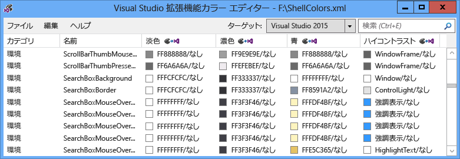
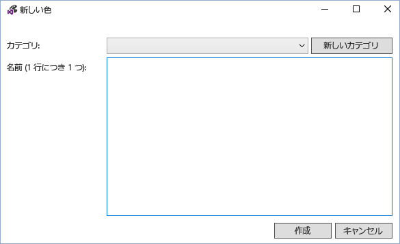
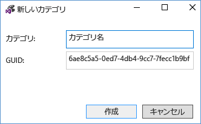
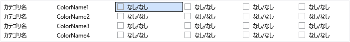
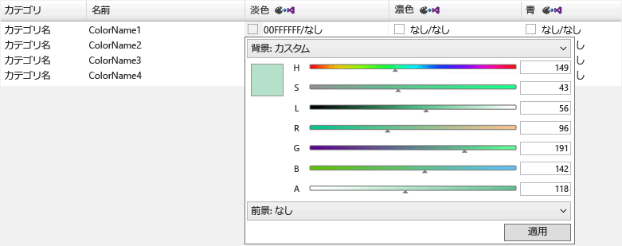
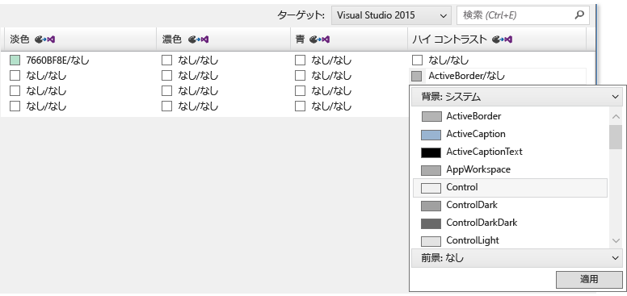
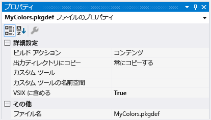
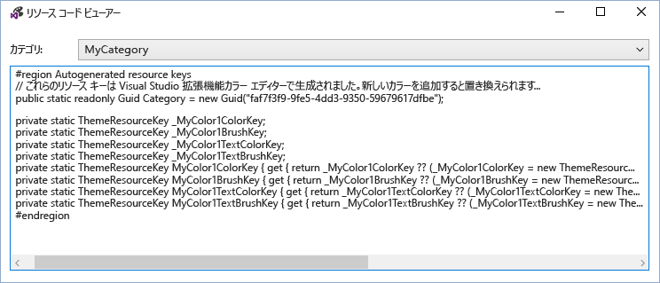
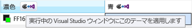

# <a name="vsix-color-editor"></a>VSIX カラー エディター
Visual Studio の拡張機能であるカラー エディター ツールでは、Visual Studio 用のユーザー設定の色を作成および編集できます。 このツールでは、色をコードで使用できるように、テーマ リソース キーを生成することもできます。 このツールは、テーマをサポートする Visual Studio 拡張機能用の色を作成する場合に便利です。 このツールでは、.pkgdef および .xml ファイルを開くことができます。 Visual Studio テーマ (.vstheme ファイル) は、ファイル拡張子を .xml に変更することによって、Visual Studio 拡張機能のカラー エディターで使用できます。 また、.vstheme ファイルを現在の .xml ファイルにインポートすることもできます。

 

 **パッケージ定義ファイル**

 パッケージ定義 (.pkgdef) ファイルは、テーマを定義するファイルです。 色自体はテーマの色の .xml ファイルに保存され、これらのファイルが .pkgdef ファイルにコンパイルされます。 .pkgdef ファイルは、Visual Studio の検索可能な場所にデプロイされ、実行時に処理され、テーマを定義するためにマージされます。

 **色トークン**

 色トークンは、次の 4 つの要素で構成されます。

- **カテゴリ名:** 一連の色を論理的にグループ化したもの。 目的の UI 要素または UI 要素のグループに固有の色が既に存在する場合は、既存のカテゴリ名を使用します。

- **トークン名:** 色トークンとトークン セットのわかりやすい名前。 セットには、背景および前景 (テキスト) のトークン名と、それらの状態のすべてが含まれます。これらには、適用先のペアと状態を容易に識別できるような名前を付ける必要があります。

- **色の値 (または色相):** 配色テーマごとに必要です。 背景とテキストの色の値は、常にペアで作成します。 描画の背景色に対してテキスト (前景) が常に判読可能な色になるよう、前景と背景の色は常にペアで扱われます。 これらの色はリンクされ、UI では一緒に使用されます。 テキストとの組み合わせを想定していない背景の場合は、前景色を定義しないでください。

- **システム カラー名:** ハイコントラスト ディスプレイで使用します。

## <a name="how-to-use-the-tool"></a>ツールの使用方法
 可能な限り、また適切な場合は、新しい色を作成するのではなく既存の Visual Studio の色を再利用してください。 ただし、適切な色が定義されていない場合は、拡張テーマの互換性を維持するためにユーザー設定の色を作成してください。

 **新しい色トークンの作成**

 Visual Studio 拡張機能のカラー エディターを使用してユーザー設定の色を作成するには、次の手順を実行します。

1. 新しい色トークンのカテゴリ名とトークン名を決定します。

2. UI 要素が各テーマに使用する色相と、ハイ コントラスト用のシステム カラーを選択します。

3. カラー エディターを使用して新しい色トークンを作成します。

4. Visual Studio 拡張機能で色を使用します。

5. Visual Studio で変更をテストします。

   **手順 1: 新しい色トークンのカテゴリ名とトークン名を決定します。**

   VSColor で推奨される名前付け方式は **[カテゴリ] [UI の種類] [状態]** です。 冗長になるため、VSColor の名前に "color" という単語は使用しないでください。

   カテゴリ名は論理的なグループ化を提供し、できるだけ狭く定義する必要があります。 たとえば、1 つのツール ウィンドウの名前はカテゴリ名に適していますが、ビジネス ユニット全体やプロジェクト チームの名前は適していません。 エントリをカテゴリにグループ化すると、同じ名前の色を混同しにくくなります。

   トークン名は、要素の種類と、色が適用される状況 ("状態") を明確に示す必要があります。 たとえば、アクティブなデータ チップの **[UI の種類]** は "**DataTip**" という名前に、 **[状態]** は "**Active**" という名前にすることができ、結果として色の名前は "**DataTipActive**" になります。 データ ヒントにはテキストがあるため、前景色と背景色の両方を定義する必要があります。 背景と前景のペアを使用すると、カラー エディターによって、背景には "**DataTipActive**"、前景には "**DataTipActiveText**" という色が自動的に作成されます。

   UI 要素に 1 つの状態しかない場合、名前の **[状態]** の部分は省略できます。 たとえば、検索ボックスに境界線があり、境界線の色に影響を及ぼす状態変化がない場合、境界線の色トークンの名前は単に "**SearchBoxBorder**" になります。

   一般的な状態名には、次のようなものがあります。

- アクティブ

- 非アクティブ

- MouseOver

- MouseDown

- オン

- フォーカスされている

  リスト アイテム コントロールの部品のトークン名には、次のようなものがあります。

- ListItem

- ListItemBorder

- ListItemMouseOver

- ListItemMouseOverBorder

- ListItemSelected

- ListItemSelectedBorder

- ListItemDisabled

- ListItemDisabledBorder

  **手順 2: UI 要素が各テーマに使用する色相と、ハイ コントラスト用のシステム カラーを選択します。**

  UI に対してユーザー設定の色を選択するときは、類似した既存の UI 要素を選択して、その色をベースとして使用します。 最初から用意されている UI 要素の色は、レビューとテストが行われているため、すべてのテーマで適切に表示され、正しく動作します。

  **手順 3: カラー エディターを使用して新しい色トークンを作成します。**

  カラー エディターを起動し、新しいカスタムのテーマの色の .xml ファイルを開くか、作成します。 メニューから **[編集] > [新しい色]** を選択します。 これにより、カテゴリと、そのカテゴリ内の色エントリの 1 つ以上の名前を指定するためのダイアログが開きます。

  

  既存のカテゴリを選択するか、 **[新しいカテゴリ]** を選択して新しいカテゴリを作成します。 別のダイアログが開き、新しいカテゴリ名が作成されます。

  

  **[新しい色]** のカテゴリ ドロップダウン メニューに新しいカテゴリが追加されます。 カテゴリを選択した後、新しい色トークンごとに 1 行に 1 つの名前を入力し、終了したら [作成] を選択します。

  ")

  色の値は背景と前景のペアで示され、"なし" は色が定義されていないことを示します。 注: 色にテキストの色と背景色のペアがない場合は、背景のみを定義する必要があります。

  

  色トークンを編集するには、そのトークンのテーマ (列) の色エントリを選択します。 色の値を追加するには、8 桁の ARGB 形式で 16 進数の色の値を入力するか、システム カラー名をセルに入力するか、ドロップダウン メニューを使用して一連の色スライダーまたはシステム カラーの一覧から目的の色を選択します。

  

  

  テキストを表示する必要がないコンポーネントの場合、1 つの色の値 (背景色) のみを入力します。 それ以外の場合は、背景とテキストの両方の色の値をスラッシュで区切って入力します。

  ハイ コントラスト用の値を入力するときは、有効な Windows システム カラー名を入力します。 ハードコードされた ARGB 値は入力しないでください。 有効なシステム カラー名の一覧は、色の値のドロップダウン メニューから "背景: システム" または "前景: システム" を選択すると表示できます。 テキスト コンポーネントを含む要素を作成する場合は、背景とテキストの適切なシステム カラーのペアを使用してください。そうしないと、テキストが判読できない可能性があります。

  色トークンの作成、設定、編集が終了したら、.xml または .pkgdef のいずれかの形式で保存します。 背景も前景も設定されていない色トークンは、.xml 形式では空の色として保存されますが、.pkgdef 形式では破棄されます。 空の色を .pkgdef ファイルに保存しようとした場合、色が失われる可能性を警告するダイアログが表示されます。

  **手順 4: Visual Studio 拡張機能で色を使用します。**

  新しい色トークンを定義した後、"ビルド アクション" を "コンテンツ" に、"VSIX に含める" を "はい" に設定して、プロジェクト ファイルに .pkgdef を含めます。

  

  Visual Studio 拡張機能のカラー エディターで、[ファイル] > [リソース コードの表示] を選択して、WPF ベースの UI でユーザー設定の色にアクセスするために使用するコードを表示します。

  

  このコードをプロジェクトの静的クラスに含めます。 **ThemeResourceKey** の種類を使用するには、**Microsoft.VisualStudio.Shell.\<VSVersion>.0.dll** への参照をプロジェクトに追加する必要があります。

```csharp
namespace MyCustomColors
{
    public static class MyCategory
    {
        #region Autogenerated resource keys
        // These resource keys are generated by Visual Studio Extension Color Editor, and should be replaced when new colors are added to this category.
        public static readonly Guid Category = new Guid("faf7f3f9-9fe5-4dd3-9350-59679617dfbe");

        private static ThemeResourceKey _MyColor1ColorKey;
        private static ThemeResourceKey _MyColor1BrushKey;
        private static ThemeResourceKey _MyColor1TextColorKey;
        private static ThemeResourceKey _MyColor1TextBrushKey;
        public static ThemeResourceKey MyColor1ColorKey { get { return _MyColor1ColorKey ?? (_MyColor1ColorKey = new ThemeResourceKey(Category, "MyColor1", ThemeResourceKeyType.BackgroundColor)); } }
        public static ThemeResourceKey MyColor1BrushKey { get { return _MyColor1BrushKey ?? (_MyColor1BrushKey = new ThemeResourceKey(Category, "MyColor1", ThemeResourceKeyType.BackgroundBrush)); } }
        public static ThemeResourceKey MyColor1TextColorKey { get { return _MyColor1TextColorKey ?? (_MyColor1TextColorKey = new ThemeResourceKey(Category, "MyColor1", ThemeResourceKeyType.ForegroundColor)); } }
        public static ThemeResourceKey MyColor1TextBrushKey { get { return _MyColor1TextBrushKey ?? (_MyColor1TextBrushKey = new ThemeResourceKey(Category, "MyColor1", ThemeResourceKeyType.ForegroundBrush)); } }
        #endregion
    }
}
```

 これにより、XAML コードで色にアクセスできるようになり、UI でテーマの変更に応答できるようになります。

```xaml
<UserControl x:Class="NewTestProject.TestPackageControl" Name="MyToolWindow"
             xmlns="http://schemas.microsoft.com/winfx/2006/xaml/presentation"
             xmlns:x="http://schemas.microsoft.com/winfx/2006/xaml"
             xmlns:ns="clr-namespace:MyCustomColors">
  <Grid>
    <TextBlock Background="{DynamicResource {x:Static ns:MyCategory.MyColor1BrushKey}}"
               Foreground="{DynamicResource {x:Static ns:MyCategory.MyColor1TextBrushKey}}"
      >Sample Text</TextBlock>

  </Grid>
</UserControl>
```

 **手順 5: Visual Studio で変更をテストします。**

 カラー エディターでは、Visual Studio の実行中のインスタンスに色トークンを一時的に適用して、拡張機能パッケージをリビルドすることなく色のライブ変更を表示することができます。 これを行うには、各テーマ列のヘッダーにある [実行中の Visual Studio ウィンドウにこのテーマを適用する] ボタンをクリックします。 この一時的なテーマは、VSIX カラー エディターを閉じると破棄されます。

 

 変更を永続的にするには、新しい色を .pkgdef ファイルに追加し、それらの色を使用するコードを記述した後、Visual Studio 拡張機能をリビルドおよび再デプロイします。 Visual Studio 拡張機能をリビルドすると、新しい色のレジストリ値がテーマの残り部分にマージされます。 次に、Visual Studio を再起動し、UI を表示して、新しい色が想定どおりに表示されることを確認します。

## <a name="notes"></a>Notes
 このツールの使用目的は、既存の Visual Studio テーマ用にユーザー設定の色を作成すること、またはユーザー設定の Visual Studio テーマの色を編集することです。 完全なカスタムの Visual Studio テーマを作成するには、Visual Studio 拡張機能ギャラリーから [Visual Studio Color Theme Editor 拡張機能](https://marketplace.visualstudio.com/items?itemName=VisualStudioProductTeam.VisualStudio2015ColorThemeEditor)をダウンロードします。

## <a name="sample-output"></a>出力例
 **XML カラー出力**

 ツールによって生成される .xml ファイルは次のようになります。

```xml
<Themes>
  <Theme Name="Light" GUID="{de3dbbcd-f642-433c-8353-8f1df4370aba}">
    <Category Name="CategoryName" GUID="{eee9d521-dac2-48d9-9a5e-5c625ba2040c}">
      <Color Name="ColorName1">
        <Background Type="CT_RAW" Source="FFFFFFFF" />
      </Color>
      <Color Name="ColorName2">
        <Background Type="CT_RAW" Source="FFFFFFFF" />
        <Foreground Type="CT_RAW" Source="FF000000" />
      </Color>
      <Color Name="ColorName3">
        <Background Type="CT_RAW" Source="FFFF0000" />
      </Color>
      <Color Name="ColorName4">
        <Background Type="CT_RAW" Source="FF000088" />
        <Foreground Type="CT_RAW" Source="FFFFFFFF" />
      </Color>
    </Category>
  </Theme>
  <Theme Name="Dark" GUID="{1ded0138-47ce-435e-84ef-9ec1f439b749}">...</Theme>
  <Theme Name="Blue" GUID="{a4d6a176-b948-4b29-8c66-53c97a1ed7d0}">...</Theme>
  <Theme Name="HighContrast" GUID="{a5c004b4-2d4b-494e-bf01-45fc492522c7}">...</Theme>
</Themes>

```

 **PKGDEF カラー出力**

 ツールによって生成される .pkgdef ファイルは次のようになります。

```
[$RootKey$\Themes\{de3dbbcd-f642-433c-8353-8f1df4370aba}\CategoryName]
"Data"=hex:78,00,00,00,0b,00,00,00,01,00,00,00,21,d5,e9,ee,c2,da,d9,48,9a,5e,5c,62,5b,a2,04,0c,04,00,00,00,0a,00,00,00,43,6f,6c,6f,72,4e,61,6d,65,31,01,ff,ff,ff,ff,00,0a,00,00,00,43,6f,6c,6f,72,4e,61,6d,65,32,01,ff,ff,ff,ff,01,00,00,00,ff,0a,00,00,00,43,6f,6c,6f,72,4e,61,6d,65,33,01,ff,00,00,ff,00,0a,00,00,00,43,6f,6c,6f,72,4e,61,6d,65,34,01,00,00,88,ff,01,ff,ff,ff,ff
[$RootKey$\Themes\{1ded0138-47ce-435e-84ef-9ec1f439b749}\CategoryName]
"Data"=hex:...
[$RootKey$\Themes\{a4d6a176-b948-4b29-8c66-53c97a1ed7d0}\CategoryName]
"Data"=hex:...
[$RootKey$\Themes\{a5c004b4-2d4b-494e-bf01-45fc492522c7}\CategoryName]
"Data"=hex:...

```

 **C# リソース キー ラッパー**

 ツールによって生成される色リソース キーは次のようになります。

```csharp
namespace MyNamespace
{
    public static class MyColors
    {
        #region Autogenerated resource keys
        // These resource keys are generated by Visual Studio Extension Color Editor, and should be replaced when new colors are added to this category.

        public static string ColorName1ColorKey { get { return "ColorName1ColorKey"; } }
        public static string ColorName1BrushKey { get { return "ColorName1BrushKey"; } }

        public static string ColorName2ColorKey { get { return "ColorName2ColorKey"; } }
        public static string ColorName2BrushKey { get { return "ColorName2BrushKey"; } }
        public static string ColorName2TextColorKey { get { return "ColorName2TextColorKey"; } }
        public static string ColorName2TextBrushKey { get { return "ColorName2TextBrushKey"; } }

        public static string ColorName3ColorKey { get { return "ColorName4ColorKey"; } }
        public static string ColorName3BrushKey { get { return "ColorName4BrushKey"; } }
        public static string ColorName3TextColorKey { get { return "ColorName4TextColorKey"; } }
        public static string ColorName3TextBrushKey { get { return "ColorName4TextBrushKey"; } }
        #endregion
    }
}
```

 **WPF リソース ディクショナリ ラッパー**

 ツールによって生成される色の **ResourceDictionary** キーは次のようになります。

```xaml
<ResourceDictionary xmlns="http://schemas.microsoft.com/winfx/2006/xaml/presentation"
        xmlns:x="http://schemas.microsoft.com/winfx/2006/xaml"
        xmlns:colors="clr-namespace:MyNamespace">

  <SolidColorBrush x:Key="{x:Static colors:MyColors.ColorName1BrushKey}" Color="#FFFFFFFF" />
  <Color x:Key="{x:Static colors:MyColors.ColorName1ColorKey}" A="255" R="255" G="255" B="255" />

  <SolidColorBrush x:Key="{x:Static colors:MyColors.ColorName2BrushKey}" Color="#FFFFFFFF" />
  <Color x:Key="{x:Static colors:MyColors.ColorName2ColorKey}" A="255" R="255" G="255" B="255" />
  <SolidColorBrush x:Key="{x:Static colors:MyColors.ColorName2TextBrushKey}" Color="#FF000000" />
  <Color x:Key="{x:Static colors:MyColors.ColorName2TextColorKey}" A="255" R="0" G="0" B="0" />

  <SolidColorBrush x:Key="{x:Static colors:MyColors.ColorName3BrushKey}" Color="#FFFF0000" />
  <Color x:Key="{x:Static colors:MyColors.ColorName3ColorKey}" A="255" R="255" G="0" B="0" />

  <SolidColorBrush x:Key="{x:Static colors:MyColors.ColorName4BrushKey}" Color="#FF000088" />
  <Color x:Key="{x:Static colors:MyColors.ColorName4ColorKey}" A="255" R="0" G="0" B="136" />
  <SolidColorBrush x:Key="{x:Static colors:MyColors.ColorName4TextBrushKey}" Color="#FFFFFFFF" />
  <Color x:Key="{x:Static colors:MyColors.ColorName4TextColorKey}" A="255" R="255" G="255" B="255" />
</ResourceDictionary>
```
