# Visual Studio のアニメーション
## アニメーションの基礎

### Visual Studio でのアニメーションのベスト プラクティス
Visual Studio の IDE 全体で一貫性のあるユーザー フレンドリーなアニメーション スタイルになるようにするには、次の規則に従います。

- **慎重に選択します。** アニメーションを特定の目的を果たすものに制限します。

- 遷移が迅速かつ自然に感じられるようにするには、**タイミングと速度が重要です**。

  - アニメーション化された遷移を 0.5 秒 (500 ミリ秒) 以内に完了します。

  - 頻繁に実行されるアニメーションは、ユーザーのワークフローを中断しないように、十分に迅速である必要があります。 アニメーションを繰り返し確認し、適切に感じるまでタイミングを調整します。

  - アニメーションは、理解するのが難しいほど速すぎたり、不快なものではない必要がありますが、遷移の完了が我慢できないほど遅くない必要があります。

  - 重要度を強調するには、可変のタイミングを使用します。 たとえば、クラス ダイアグラムの一連の項目をナビゲーションするときに、項目間の移動では速度を上げて、重要な項目に焦点を当てるために速度を落とします。

- 落ち着いた自然な動きの感覚を与えるために、ある状態から別の状態への **緩やかで非線形のイージングを使用します**。

- マウスの下の対話型の要素を示すために、可能な場合は、**ホバー時に微かなアニメーションを使用します**。

- 機能でアニメーションに大きく依存している場合は、 **[ツール] > [オプション]** ダイアログ ボックスのオプションとして、ローカルに **オフにする手段を提供します** (すべての機能について)。

- **一度に 1 つのアニメーションのみを実行し**、1 つの情報のみを伝達する必要があります。 複数のオブジェクトを移動したり、複数のことを伝達したりしようとすると、混乱を招く可能性があります。

- **繊細さが重要です。** ほとんどの場合、アニメーションでは、目的を果たすために、ユーザーの注意を喚起する必要はありません。 タイミング、シーケンス処理、動作を微妙に変更することによって、知覚に大きな影響を与えることができます。これにより、効果的なアニメーションと効果的ではないアニメーションの違いが生じることがあります。

- アニメーションを使用して何かに注意を喚起する場合は、**ユーザーの思考の流れを中断する価値があることを確認してください**。

- アニメーションを使用して **進行状況または状態を表示する場合**:

  - 基になるプロセスが進行していないときは、進行状況の動きを表示しないようにします。

  - 不確定のプロセスと確定したプロセスを区別します。

  - アニメーションの完了と失敗の状態が識別可能であるようにします。

  - 状態を表示するアニメーション効果の使用を最小限に抑え、実際の使用状況に合わせた追加情報を提供することによって、実質的な価値を持つようにします。 例としては、一時的な状態の変更や緊急時があります

#### アニメーションの注意事項:

- 小さな移動 (小さなフットプリントでの移動) は使用しないでください。 オブジェクトの移動よりもフェードと変更を優先してください。

- 画面の広い領域で実行されるアニメーションは使用しないでください。 サイズに関係なく、このスタイルのアニメーションはユーザーの注意をそらします。

- ユーザーが現在注目しているか、操作しているオブジェクトと関係のないアニメーションを使用しないでください。

- 状態をリセットするためにユーザーの対話式操作が必要となるアニメーションを使用しないでください (点滅する通知の点滅を停止するために、ユーザーにその通知に応答させるなど)。 何らかの方法でそれらを操作するだけで、それらを片付けるのに十分なはずです。

これらのベスト プラクティスの適用の詳細については、「[アニメーションのパターン](../../extensibility/ux-guidelines/animations-for-visual-studio.md#BKMK_AnimationPatterns)」を参照してください。

### アニメーションのメトリック

- システムでは、10 ミリ秒未満のユーザー ジェスチャに視覚的に反応する必要があります。

- アニメーション化された遷移を完了するのに、500 ミリ秒より長くかからないようにする必要があります。

- 時間がかかる遷移を補う方法の 1 つは、それを 2 つの部分に分割することです。 たとえば、アニメーションの最初の部分を空のコンテンツのコンテナー (最大 500 ミリ秒) にして、その後、コンテンツがコンテナーにフェードインします (最大 500 ミリ秒)。

- 読み込み時間を計算できる場合は、確定の進行状況インジケーター (完了率の進行状況インジケーター) をお勧めします。

- 読み込み時間を計算できない場合は、カーソルまたは埋め込みの回転アニメーション (読み込みまたは動作インジケーター) のようなビジー状態を示すインジケーターが適しています。

### コミュニケーション ツールとしてのアニメーション
Visual Studio の UI では、アニメーションはコミュニケーション ツールとしてのみ機能します。  これは、UI の構造上の変更 (たとえば、メニューを開いたり閉じたりしたときなど) などのさまざまな情報を伝えるために使用されます。 アニメーションは、インストールの進行状況の視覚化など、複雑なシステムの時間に依存する動作を視覚化するのに役立ちます。 アニメーションは、アラートや通知を使用して注意を喚起するためにも使用できます。

 通常、UI のアニメーションは、視覚化、注意の喚起、シミュレーション、応答時間/進行状況インジケーターの 4 つの方法で機能します。

#### 視覚化する
アニメーションでは、オブジェクトの 3 次元の性質を強調して、ユーザーが空間構造を簡単に思い描くことできるようにすることができます。 これを実現するために、アニメーションでは、オブジェクトを完全な円で回転させたり、ゆっくりと戻したり進めたり、オブジェクトを近づけてサイズをわずかに大きくしてロールオーバーやフォーカスを強調したりすることが必要になることがあります。

3 次元オブジェクトはユーザーによる制御で移動させることができますが、デザイナーは、オブジェクトを最適に理解できる動きを最も良くアニメーション化する方法を、(プログラムまたは手動で) 前もって決定する必要があります。 このプログラミングされたアニメーションは、ユーザーがオブジェクトの上にカーソルを置くことによってアクティブ化できます。一方、ユーザー制御の移動では、ユーザーがオブジェクトの操作方法を理解している必要があります。 一度に 1 つの軸または向きに移動するように制限します (スケール、回転、または変換)。ただし、同時に複数の移動を実行しないでください。

視覚化のカテゴリには、データ、リレーションシップ、状態、構造、シーケンス、時間の特性が含まれます。

##### データ
複雑で可変の情報を示します。

- チャートやグラフなどの情報の視覚化を通じた移動

- シーケンス、ガイド ツアー、ページングのステップ実行

- 特定の情報の詳細、ポイント、強調表示のコールアウト

- フォーカスされた要素の上に詳細や追加情報をオーバーレイする

- ある構造体または組織の表現から別のものの表現へのモーフィング

- 時間スライダー、ジョグとシャトルのホイール、トランスポート コントロール (再生、停止、一時停止) を使用した時間の経過に伴う変化の表現

##### リレーションシップ

- 項目が相互にどのように関連しているか、または指定された項目に関連する項目を示します

- 階層と親子関係または兄弟関係を表示する

- 1 つの要素によって別の要素が生成される

- 1 つの要素が別の要素に最小化される

- 1 つの要素が別の要素に結び付けられる

##### 州

- コンテンツの更新

- ユーザーのフォーカスと選択

- 進捗状況

- エラー

##### 構造体

- 1 つのノードでの構造のピボット

- 方向を変える

- 最小化と最大化、または展開と折りたたみ

##### シーケンス

- スライドショー シーケンス

- 画像をめくる

##### Time

- 時間の経過に伴う変化、時間の経過、スクリーンキャストの表示

- ごみ箱へ移動、元に戻す、やり直し

- 履歴状態の復元

#### 注意を喚起する
複数の要素のうちの 1 つにユーザーの注意を喚起すること、または更新された情報をユーザーに通知することが目的である場合は、アニメーションが適切である可能性があります。 たとえば、アプリケーションのスタート ページには、ページが読み込まれた後にそこに滑らかに現れる [作業の開始] ボタンが採用される場合があります。

原則として、画面上で最後に移動した要素はユーザーの注意を引きます。  一連のアニメーション要素では、ユーザーの注意は最後に移動したオブジェクトに留まります。

##### アラート:

- ユーザーへのアラートの通知、注意の喚起、進行状況の表示

- 何かが正しく行われていることまたは間違っていることを示すか、進行状況または進行状況の変化を示す

- タスクの実行中にユーザーにメッセージを表示する (オンラインで情報を見つけたり、現在のタスクについて説明したりするなど)

##### 通知

- エラー状態についてユーザーに通知する

- ユーザーに割り込んで、他の何かに参加するかどうかを確認する

- プロセスが完了または変更されたことをユーザーに丁寧に伝える (ダウンロードが完了したときなど)。

#### シミュレート
このカテゴリは、実体性と特質をカバーしています。

- オブジェクトの取得元または移動先を示す

- 展開と折りたたみ、または開閉

- パン、スクロール、ページめくり

- スタックと Z オーダー

- カルーセルとアコーディオン

- UI の反転と回転

#### 応答インジケーターと進行状況インジケーター
進行状況インジケーターには、いくつかの注目すべき利点があります。

- 確定および不確定の進行状況インジケーターはどちらも、システムがクラッシュしておらず、問題に対処していることをユーザーに知らせます。

- 確定インジケーターでは、アクションがどれくらい進行したかをユーザーに示したり、完了に近づいたことを示したりします。

##  アニメーションのパターン

### 概要
Visual Studio のアニメーションは、ユーザーの生産性を損なうことなく、特定の機能を提供することが意図されています。 一般に、Visual Studio でのアニメーションは次のようにする必要があります。

- 小さくて控えめ

- 自然で現実的

- 微妙で抑制的

- 高速で効率的

- リラックスしていて、慌ただしくない

次の図は、Visual Studio の推奨されるアニメーションのスタイルを示しています。 最も頻繁に使用されるのは、アニメーションなしや、フェード イン/フェード アウトなどの微かなアニメーションです。 展開と折りたたみ、X と Y の位置の変更、回転などの移動アニメーションの適用は限られています。

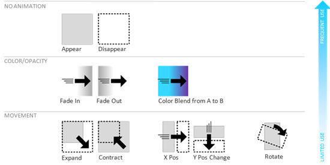 Visual Studio で推奨されるアニメーションのスタイル

#### 表示と非表示
このパターンでは、遷移アニメーションを使用せずに、要素の表示と非表示が切り替えられます。

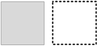 アニメーションの表示と非表示

##### 正しい使用方法
ユーザーの気をそらしたり妨げたりしないように、直ちに表示または非表示にする必要がある、適宜更新される UI 要素。 また、ゆっくり動くアニメーションは、表示と非表示のスタイルでは発生しないパフォーマンスの妨げとして認識されることがあります。

##### 間違った使用方法
UI が突然表示されると、ユーザーは何が起こったのかわかりませんが、アニメーションを追加すると、コンテキストの理解に役立ちます。

##### アニメーションのプロパティ
遅延時間は通常 0 秒です。

##### 例
- 自動的に非表示になるツール ウィンドウ

- キーボードでアクティブ化されたエディターの UI (IntelliSense やパラメーターのヘルプなど)

- コード領域の展開と折りたたみ

#### フェードインとフェードアウト
このパターンでは、UI 要素が非表示 (0% の不透明度) から表示 (100% の不透明度)、またはその逆に遷移します。

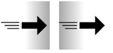 フェードインとフェードアウトのアニメーション

##### 正しい使用方法
これは、最も一般的に推奨される UI アニメーションです。 フローを中断することなく関心を引く微かな効果です。 場合によっては、ユーザーがアニメーションがあることに気が付かず、スムーズで流れるような UI システムと感じることもあります。

##### アニメーションのプロパティ

- 開始時の不透明度: フェードインの場合は 0%、フェードアウトの場合は 100%

- 終了時の不透明度: フェードインの場合は 100%、フェードアウトの場合は 0%

- 期間: スタンドアロンの場合は 200 ミリ秒、組み合わせアニメーション シーケンスの一部として使用する場合は 100 ミリ秒

- イージング スタイル: 正弦 InOut

##### 例

- 自動的に非表示になるツール ウィンドウ

- メニューを開いたり閉じたりする

- バックグラウンドとフォアグラウンドのタブの切り替え

#### A から B への色のブレンド
このパターンでは、UI 要素が色 A から色 B に変化します。

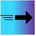 色のブレンドのアニメーション

##### 正しい使用方法
あるコンテキストや状態から別のものに遷移すると UI 要素の色が変更される場合のアニメーション化された遷移として。

##### アニメーションのプロパティ

- 開始色: UI 固有

- 終了色: UI 固有

- 期間: スタンドアロンの場合は 200 ミリ秒、組み合わせアニメーション シーケンスの一部として使用する場合は 100 ミリ秒

- イージング スタイル: 正弦 InOut

##### 例

- ドキュメント ウィンドウの状態の遷移 (アクティブ、最後のアクティブ、非アクティブ)

- ツール ウィンドウの状態遷移 (フォーカスとフォーカスなし)

#### 展開と折りたたみ
このパターンでは、UI 要素が X、Y、または双方向に展開されます。

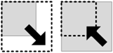 展開と折りたたみのアニメーション

##### 正しい使用方法
あるコンテキストから別のコンテキストに遷移するときに UI 要素のサイズが変更される場合のアニメーション化された遷移として。

##### アニメーションのプロパティ

- X のスケール: % または特定のディメンション (ピクセル単位)

- Y のスケール: % または特定のディメンション (ピクセル単位)

- アンカー位置: 一般に左上 (左から右の言語の場合) または右上 (右から左の言語の場合)

- 期間: スタンドアロンの場合は 200 ミリ秒、組み合わせアニメーション シーケンスの一部として使用する場合は 100 ミリ秒

##### 例

- アーキテクチャ エクスプローラー パネルの展開と折りたたみ

- Visual Studio 2017 のスタート ページの項目の展開と折りたたみ

#### X-Y 位置の変更
このパターンでは、UI 要素の X または Y の位置またはその両方が変更されます。

 X-Y 位置の変更のアニメーション

##### 正しい使用方法
あるコンテキストから別のコンテキストに遷移するときに UI 要素の位置が変更される場合のアニメーション化された遷移として。

##### アニメーションのプロパティ

- X と Y の開始位置: UI 固有

- X と Y の終了位置: UI 固有

- アニメーションの軌跡: なし

- 期間: スタンドアロンの場合は 200 ミリ秒、組み合わせアニメーション シーケンスの一部として使用する場合は 100 ミリ秒

- イージング スタイル: 正弦 InOut

##### 例
タブの並べ替え

#### Rotate
このパターンでは、UI 要素が回転します。

 UI 要素の回転のアニメーション

##### 正しい使用方法
不確定の回転進行状況インジケーターの場合のみ。

##### アニメーションのプロパティ

- 回転の角度: 360

- 回転の中心: オブジェクトの中央

- 期間: 連続

##### 例
不確定の進行状況インジケーター (回転)

### 一般的なシェル UI のアクションと推奨されるアニメーション

#### タブを開く
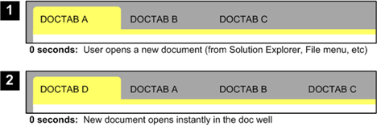 タブを開くアニメーション

- スタイル: 表示

- 期間: 0 秒

#### タブを閉じる
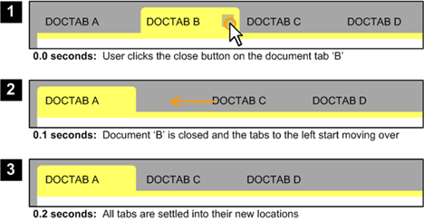 タブを閉じるアニメーション

- スタイル: X 位置の変更

- 期間: 200 ミリ秒

#### タブの並べ替え
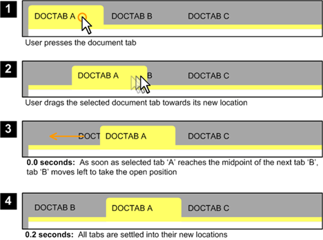 タブの並べ替えアニメーション

- スタイル: X 位置の変更

- 期間: 200 ミリ秒

#### 移動ドキュメントを閉じる
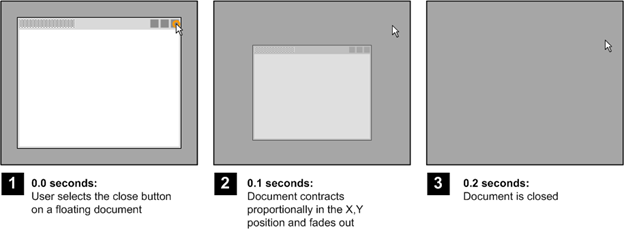 移動ドキュメントを閉じるアニメーション

- スタイル: 表示

- 期間: 200 ミリ秒

#### ウィンドウの状態の切り替え
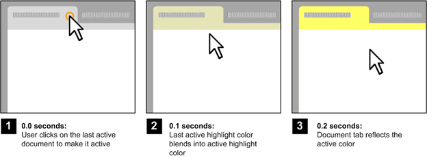 ウィンドウの状態の切り替えアニメーション

- スタイル: 他のウィンドウとの一貫性を保つために、現在のオペレーティング システムでドキュメントを閉じるアニメーションを定義します。

- 期間: 200 ミリ秒

#### メニューを開く
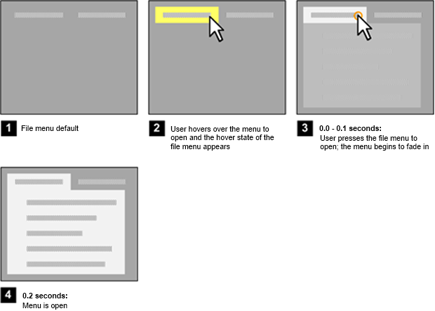 メニューを開くアニメーション

- スタイル: フェードイン

- 期間: 200 ミリ秒

#### メニューを閉じる
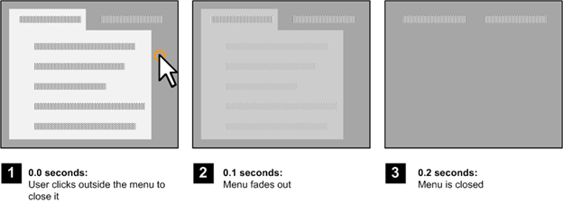 メニューを閉じるアニメーション

- スタイル: フェードアウト

- 期間: 200 ミリ秒

#### 自動的に非表示になるツール ウィンドウを表示する
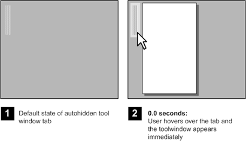 自動的に非表示になるツール ウィンドウを表示するアニメーション

- スタイル: 表示

- 期間: 0 秒
