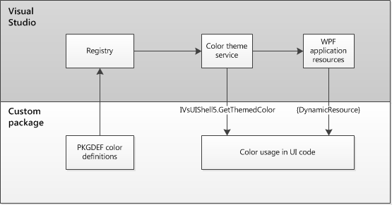
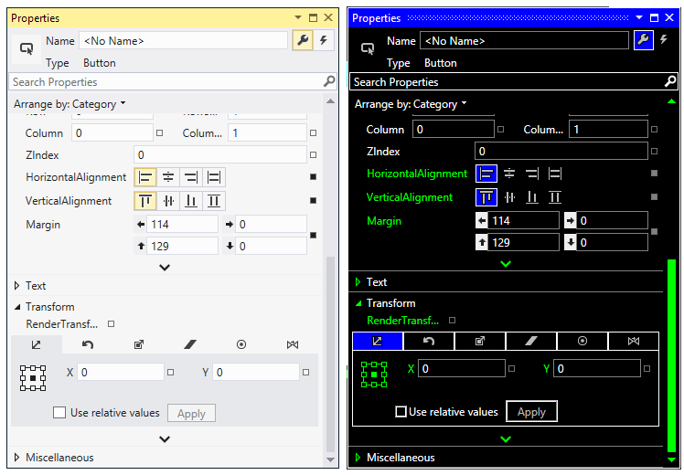
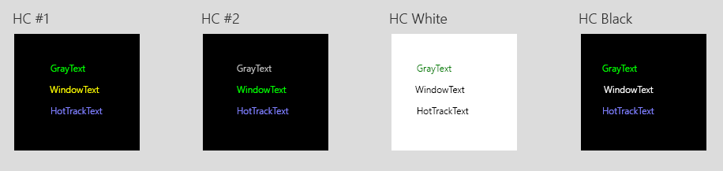
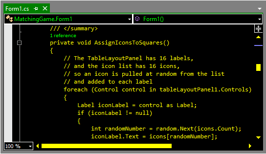
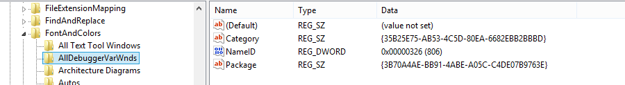

# <a name="colors-and-styling-for-visual-studio"></a>Visual Studio の色とスタイル

## <a name="use-color-in-visual-studio"></a>Visual Studio で色を使用する

Visual Studio では、色は単なる装飾ではなく、主にコミュニケーション ツールとして使用されます。 色の使用は最小限にし、以下のことが必要な状況に備えて色を取っておくようにしてください。

- 意味や所属を伝える (プラットフォームや言語の修飾子など)

- 注目を引く (状態の変化を知らせるなど)

- 読みやすさを高めたり、目印を提供したりして UI を操作しやすくする

- 魅力を高める

Visual Studio の UI 要素に色を割り当てるためのオプションは複数あります。 使用すべきオプションや、オプションの正しい使用方法がわかりにくい場合もあります。 このトピックは、次の目的に役立ちます。

- Visual Studio で色を定義するために使用するさまざまなサービスおよびシステムについて理解します。

- 特定の要素に対して正しいオプションを選択します。

- 選択したオプションを正しく使用します。

> [!NOTE]
> 16 進数の色、RGB 色、またはシステム カラーを UI 要素にハードコードしないでください。 サービスを使用すると、色相を柔軟に調整できます。 さらに、サービスがないと、[VSColor サービス](../../extensibility/ux-guidelines/colors-and-styling-for-visual-studio.md#BKMK_TheVSColorService)のテーマ切り替え機能を利用できなくなります。

### <a name="methods-for-assigning-color-to-visual-studio-interface-elements"></a>Visual Studio のインターフェイス要素に色を割り当てる方法

対象の UI 要素に最適な方法を選択します。

| UI | メソッド | それらは何ですか? |
| --- | --- | --- |
| 埋め込みまたはスタンドアロンのダイアログ ボックスがある。 | **システム カラー** | コモン ダイアログ コントロールなどの UI 要素の色や外観をオペレーティング システムで定義するためのシステム名。 |
| VS 環境全体との一貫性を持たせたいカスタム UI があり、共有トークンのカテゴリとセマンティックな意味に一致する UI 要素がある。 | **一般的な共有の色** | 特定の UI 要素用の既存の定義済み色トークン名 |
| 個別機能または機能のグループがあり、類似の要素間で共有される色はない。 | **[作成した色]** | 領域に固有であり、他の UI との共有を意図していない色トークン名 |
| エンド ユーザーが (テキスト エディターや特殊なデザイナー ウィンドウの) UI やコンテンツをカスタマイズできるようにしたい。 | **エンドユーザーのカスタマイズ**<br /><br />**([ツール] &gt; [オプション] ダイアログ)** | **[ツール] &gt; [オプション]** ダイアログの [フォントおよび色] ページ、または 1 つの UI 機能に固有の特殊なページで定義する設定。 |

### <a name="visual-studio-themes"></a>Visual Studio のテーマ

Visual Studio には、淡色、濃色、青の 3 種類の配色テーマがあります。 また、ハイ コントラスト モードも検出されます。これは、アクセシビリティのために設計されたシステム全体の配色テーマです。

ユーザーは、Visual Studio を最初に使用するときに、テーマを選択するように求められます。また、後から **[ツール] &gt; [オプション] &gt; [環境] &gt; [全般]** にアクセスして、[配色テーマ] ドロップダウン メニューから新しいテーマを選択してテーマを切り替えることができます。

ユーザーはコントロール パネルを使用して、複数あるハイ コントラスト テーマのどれかにシステム全体を切り替えることもできます。 ユーザーがハイ コントラスト テーマを選択した場合、Visual Studio の配色テーマ セレクターは Visual Studio の色に影響しなくなりますが、テーマの変更は、ユーザーがハイ コントラスト モードを終了したときに備えて保存されます。 ハイ コントラスト モードの詳細については、「[ハイ コントラスト色の選択](../../extensibility/ux-guidelines/colors-and-styling-for-visual-studio.md#BKMK_ChoosingHighContrastColors)」を参照してください。

### <a name="the-vscolor-service"></a>VSColor サービス

Visual Studio には、VSColor サービスと呼ばれる環境の色のサービスが用意されています。これを使用すると、UI 要素の色の値を、Visual Studio の各テーマ用の配色値を含む名前付きエントリにバインドできます。 これにより、ユーザーが選択した現在のテーマまたはシステムのハイ コントラスト モードを反映するように、色が自動的に変更されます。 このサービスを使用すると、テーマに関連したすべての配色変更の実装が 1 か所で処理されるようになります。また、サービスが提供する一般的な共有の色を使用している場合、Visual Studio の将来のバージョンで UI に新しいテーマが自動的に反映されます。

### <a name="implementation"></a>実装

Visual Studio のソース コードには、トークン名のリストとそれぞれの色の値をテーマごとに格納した、複数のパッケージ定義ファイルが含まれています。 カラー サービスでは、これらのパッケージ定義ファイルで定義されている VSColor を読み取ります。 これらの色は XAML マークアップまたはコードで参照された後、`IVsUIShell5.GetThemedColor` メソッドまたは DynamicResource マッピングのいずれかを通じて読み込まれます。

### <a name="system-colors"></a>システム カラー

コモン コントロールは、既定でシステム カラーを参照します。 埋め込みまたはスタンドアロン ダイアログの作成時のように、UI でシステム カラーを使用する場合は、何もする必要はありません。

### <a name="common-shared-colors-in-the-vscolor-service"></a>VSColor サービスの一般的な共有の色

インターフェイス要素は、Visual Studio 環境全体を反映している必要があります。 設計中の UI コンポーネントに適している一般的な共有の色を再利用することで、インターフェイスが他の Visual Studio インターフェイスとの一貫性を備えていること、また、テーマが追加または更新されたときに色が自動的に更新されることを保証します。

一般的な共有の色を使用する前に、その正しい使用方法を理解していることを確認してください。 一般的な共有の色を誤って使用した結果、ユーザーにとって一貫性がない、イライラする、または混乱を招くエクスペリエンスになる可能性があります。

### <a name="user-customizable-colors"></a>ユーザーがカスタマイズ可能な色

参照: [エンド ユーザー向けの色の公開](../../extensibility/ux-guidelines/colors-and-styling-for-visual-studio.md#BKMK_ExposingColorsForEndUsers)

開発者がコード エディターやデザイン サーフェイスを作成しているときのように、エンド ユーザーが UI をカスタマイズできるようにしたい場合があります。 カスタマイズ可能な UI コンポーネントは、 **[ツール] &gt; [オプション]** ダイアログの **[フォントおよび色]** セクションにあります。ユーザーはここで、前景色、背景色、または両方を変更することを選択できます。

![[ツール] &gt; [オプション] ダイアログ](../../extensibility/ux-guidelines/media/0301-a_toolsoptionsdialog.png "0301-a_ToolsOptionsDialog")<br />[ツール] &gt; [オプション] ダイアログ

## <a name="the-vscolor-service"></a><a name="BKMK_TheVSColorService"></a>VSColor サービス

Visual Studio には、VSColor サービスまたはシェル カラー サービスとも呼ばれる環境の色のサービスが用意されています。 このサービスを使用すると、UI 要素の色の値を、各テーマ用の色を含む名前と値のカラー セットにバインドできます。 すべての UI 要素に対して VSColor サービスを使用する必要があります。これにより、ユーザーが選択している現在のテーマを反映して色が自動的に変更されるように、また、環境の色のサービスにバインドされた UI が Visual Studio の将来のバージョンで新しいテーマと統合されるようになります。

### <a name="how-the-service-works"></a>サービスのしくみ

環境の色のサービスでは、UI コンポーネントの .pkgdef で定義された VSColor を読み取ります。 その後、これらの VSColor は XAML マークアップまたはコードで参照され、`IVsUIShell5.GetThemedColor` または `DynamicResource` マッピングのいずれかを通じて読み込まれます。

<br />環境の色のサービス アーキテクチャ

### <a name="accessing-the-service"></a>サービスへのアクセス

VSColor サービスには、使用している色トークンの種類と、記述しているコードの種類に応じて、何通りかのアクセス方法があります。

#### <a name="predefined-environment-colors"></a>事前定義済みの環境の色

##### <a name="from-native-code"></a>ネイティブ コードから

シェルには、色の `COLORREF` へのアクセスを提供するサービスが用意されています。 サービス/インターフェイスは次のとおりです。

```
IVsUIShell2::GetVSSysColorEx(VSSYSCOLOR dwSysColIndex, DWORD *pdwRGBval)
```

VSShell80.idl ファイルで、列挙型 `__VSSYSCOLOREX` にはシェルの色定数があります。 これを使用するには、MSDN のドキュメントに記載されている `enum __VSSYSCOLOREX` の値のいずれか、または、Windows システム API の `GetSysColor` が受け付ける通常のインデックス番号のどちらかをインデックス値として渡します。 これを行うと、使用する色の RGB 値が 2 番目のパラメーターに返されます。

ペンまたはブラシを新しい色で保存する場合は、(Visual Studio シェルから) `AdviseBroadcastMessages` を実行して、`WM_SYSCOLORCHANGE` および `WM_THEMECHANGED` メッセージをリッスンする必要があります。

ネイティブ コードでカラー サービスにアクセスするには、次のような呼び出しを行います。

```
pUIShell2->GetVSSysColorEx(VSCOLOR_COLOR_NAME, &rgbLOCAL_COLOR);
```

> [!NOTE]
> `GetVSSysColorEx()` によって返される `COLORREF` の値には、テーマの色の R、G、B 成分のみが含まれます。 テーマ エントリで透明度を使用する場合、戻る前にアルファ チャネル値は破棄されます。 したがって、目的の環境の色を、透明度チャネルが重要である場所に使用することが必要な場合は、このトピックの後半で説明するように `IVsUIShell2::GetVSSysColorEx` の代わりに `IVsUIShell5.GetThemedColor` を使用する必要があります。

##### <a name="from-managed-code"></a>マネージド コードから

ネイティブ コードから VSColor サービスにアクセスするのは簡単です。 しかし、マネージド コードから操作する場合、サービスを使用する方法を決めるのが難しいかもしれません。 以上を念頭に、このプロセスの例を示す次の C# コード スニペットをご覧ください。

```csharp
private void VSColorPaint(object sender, System.Windows.Forms.PaintEventArgs e)
{
    //getIVSUIShell2
    IVsUIShell2 uiShell2 = Package.GetService(typeof(SVsUIShell)) as IVsUIShell2;
    Debug.Assert (uiShell2 != null, "failed to get IVsUIShell2");

    if (uiShell2 != null)
    {
        //get the COLORREF structure
        uint win32Color;
        uiShell2.GetVSSysColorEx((int)__VSSYSCOLOREX.VSCOLOR_SMARTTAG_HOVER_FILL, out win32Color);

        //translate it to a managed Color structure
        Color myColor = ColorTranslator.FromWin32((int)win32Color);
        //use it
        e.Graphics.FillRectangle(new SolidBrush(myColor), 0, 0, 100, 100);
    }
}
```

Visual Basic で作業している場合は、次を使用します。

```vb
Dim myColor As Color = ColorTranslator.FromWin32((Integer)win32Color)
```

##### <a name="from-wpf-ui"></a>WPF UI から

アプリケーションの `ResourceDictionary` にエクスポートされた値を通じて、Visual Studio の色にバインドできます。 次の例では、カラー テーブルのリソースを使用し、XAML で環境フォント データにバインドします。

```xml
<Style TargetType="{x:Type Button}">
    <Setter Property="TextBlock.FontFamily"
            Value="{DynamicResource VsFont.EnvironmentFontFamily}" />
    <Setter Property="TextBlock.FontSize"
            Value="{DynamicResource VsFont.EnvironmentFontSize}" />
    <Setter Property="Background"
            Value="{DynamicResource VsBrush.EnvironmentBackgroundGradient}" />
</Style>
```

#### <a name="helper-classes-and-methods-for-managed-code"></a>マネージド コード用のヘルパー クラスとヘルパー メソッド

シェルの Managed Package Framework ライブラリ (`Microsoft.VisualStudio.Shell.12.0.dll`) には、マネージド コードでテーマの色を使いやすくする 2 つのヘルパー クラスが含まれています。

MPF の `Microsoft.VisualStudio.Shell.VsColors` クラスのヘルパー メソッドには、`GetThemedGDIColor()` と `GetThemedWPFColor()` があります。 これらのヘルパー メソッドは、WinForms または WPF UI で使用するテーマ エントリの色の値を `System.Drawing.Color` または `System.Windows.Media.Color` として返します。

```csharp
IVsUIShell5 shell5;
Button button = new Button();
button.BackColor = GetThemedGDIColor(shell5, SolutionExplorerColors.SelectedItemBrushKey);
button.ForeColor = GetThemedGDIColor(shell5, SolutionExplorerColors.SelectedItemTextBrushKey);

/// <summary>
/// Gets a System.Drawing.Color value from the current theme for the given color key.
/// </summary>
/// <param name="vsUIShell">The IVsUIShell5 service, used to get the color's value.</param>
/// <param name="themeResourceKey">The key to find the color for.</param>
/// <returns>The current theme's value of the named color.</returns>
public static System.Drawing.Color GetThemedGDIColor(this IVsUIShell5 vsUIShell, ThemeResourceKey themeResourceKey)
{
   Validate.IsNotNull(vsUIShell, "vsUIShell");
   Validate.IsNotNull(themeResourceKey, "themeResourceKey");

   byte[] colorComponents = GetThemedColorRgba(vsUIShell, themeResourceKey);

   // Note: The Win32 color we get back from IVsUIShell5.GetThemedColor is ABGR
   return System.Drawing.Color.FromArgb(colorComponents[3], colorComponents[0], colorComponents[1], colorComponents[2]);
}

private static byte[] GetThemedColorRgba(IVsUIShell5 vsUIShell, ThemeResourceKey themeResourceKey)
{
   Guid category = themeResourceKey.Category;
   __THEMEDCOLORTYPE colorType = __THEMEDCOLORTYPE.TCT_Foreground
   if (themeResourceKey.KeyType == ThemeResourceKeyType.BackgroundColor || themeResourceKey.KeyType == ThemeResourceKeyType.BackgroundBrush)
   {
      colorType = __THEMEDCOLORTYPE.TCT_Background;
   }

   // This call will throw an exception if the color is not found
   uint rgbaColor = vsUIShell.GetThemedColor(ref category, themeResourceKey.Name, (uint)colorType);
   return BitConverter.GetBytes(rgbaColor);
}
public static System.Windows.Media.Color GetThemedWPFColor(this IVsUIShell5 vsUIShell, ThemeResourceKey themeResourceKey)
{
   Validate.IsNotNull(vsUIShell, "vsUIShell");
   Validate.IsNotNull(themeResourceKey, "themeResourceKey");

   byte[] colorComponents = GetThemedColorComponents(vsUIShell, themeResourceKey);

    return System.Windows.Media.Color.FromArgb(colorComponents[3], colorComponents[0], colorComponents[1], colorComponents[2]);
}
```

このクラスを使用して、特定の WPF カラー リソース キーの VSCOLOR 識別子を取得することもでき、その逆も可能です。

```csharp
public static string GetColorBaseKey(int vsSysColor);
public static bool TryGetColorIDFromBaseKey(string baseKey, out int vsSysColor);
```

`VsColors` クラスのメソッドは、呼び出されるたびに、VSColor サービスをクエリして色の値を返します。 代わりに `Microsoft.VisualStudio.PlatformUI.VSThemeColor` クラスのメソッドを使用する方法でも、色の値を `System.Drawing.Color` として取得できますが、この場合、VSColor サービスから取得した色の値をキャッシュするため、パフォーマンスの面で優位です。 このクラスは、内部でシェルのブロードキャスト メッセージ イベントをサブスクライブし、テーマ変更イベントが発生したら、キャッシュされた値を破棄します。 このクラスは、テーマの変更をサブスクライブするための、.NET と親和性が高いイベントも提供します。 `ThemeChanged` イベントを使用して新しいハンドラーを追加し、`GetThemedColor()` メソッドを使用して目的の `ThemeResourceKeys` の色の値を取得します。 サンプル コードは次のようになります。

```csharp
public MyWindowPanel()
{
    InitializeComponent();

    // Subscribe to theme changes events so we can refresh the colors
    VSColorTheme.ThemeChanged += VSColorTheme_ThemeChanged;

    RefreshColors();
}

private void VSColorTheme_ThemeChanged(ThemeChangedEventArgs e)
{
    RefreshColors();

    // Also post a message to all the children so they can apply the current theme appropriately
    foreach (System.Windows.Forms.Control child in this.Controls)
    {
        NativeMethods.SendMessage(child.Handle, e.Message, IntPtr.Zero, IntPtr.Zero);
    }
}

private void RefreshColors()
{
    this.BackColor = VSColorTheme.GetThemedColor(EnvironmentColors.ToolWindowBackgroundColorKey);
    this.ForeColor = VSColorTheme.GetThemedColor(EnvironmentColors.ToolWindowTextColorKey);
}

protected override void Dispose(bool disposing)
{
    if (disposing)
    {
        VSColorTheme.ThemeChanged -= this.VSColorTheme_ThemeChanged;
        base.Dispose(disposing);}
}
```

## <a name="choosing-high-contrast-colors"></a><a name="BKMK_ChoosingHighContrastColors"></a>ハイ コントラスト色の選択

### <a name="overview"></a>概要

Windows では、テキスト、背景、画像の色のコントラストを上げて画面上で要素をさらに際立たせる、システムレベルのハイ コントラスト テーマをいくつか使用します。 アクセシビリティ上の理由から、ユーザーがハイ コントラスト テーマに切り替えたときに Visual Studio のインターフェイス要素が正しく応答することは重要です。

ハイ コントラスト テーマに使用できるシステム カラーはごく少数です。 システム カラー名を選択するときは、次のヒントに留意してください。

- 色を適用する要素と **セマンティックの意味が同じであるシステム カラーを選択します**。 たとえば、ウィンドウ内のテキスト用にハイ コントラストの色を選択する場合、ControlText ではなく WindowText を使用します。

- **前景と背景のペアの選択** はまとめて行います。そうしないと、選択した色がすべてのハイ コントラスト テーマで機能するかどうか確信が持てなくなります。

- **UI のどの部分が最も重要であるかを判断し、そのコンテンツ領域が目立つようにします。** 通常であれば色相の微妙な違いによって区別される多くの詳細が失われるため、また、コンテンツ領域を差別化する色のバリエーションが存在しないため、より強い境界色を使用してコンテンツ領域を定義するのが一般的です。

### <a name="system-color-set"></a>システム カラー セット

[WPF チーム ブログの SystemColors リファレンス](/archive/blogs/wpf/systemcolors-reference)の表では、すべてのシステム カラー名と、それぞれの名前に対応した色相の各テーマでの表示を示しています。

この限られた色のセットを UI に適用すると、 *"通常の" テーマに存在していた微妙な詳細が失われることが予想されます*。 次に示すのは、灰色の濃淡を使用してツール ウィンドウ内の領域を区別する UI の例です。 同じウィンドウをハイ コントラスト モードで表示したものと比べると、すべての背景が同じ色相であり、各領域の境目が境界線のみで示されていることがわかります。

<br />ハイ コントラストで微妙な詳細が失われる例

#### <a name="choosing-text-colors-in-an-editor"></a>エディターでのテキストの色の選択

エディターまたはデザイン サーフェイスで、テキストの色分けは、類似した項目のグループに意味を与えて識別しやすくするために使用します。 しかし、ハイ コントラスト テーマでは、3 色を超えてテキストを色分けすることはできません。 WindowBackground サーフェイスで使用できるのは、WindowText、GrayText、HotTrackText の 3 色だけです。 使用できるのは 3 色までのため、ハイ コントラスト モードで表示上の区別をする最も重要な要素を慎重に選択してください。

エディター サーフェイスで使用できる各トークン名の色相は、それぞれのハイ コントラスト テーマで表示すると、次のようになります。

<br />ハイ コントラスト エディターの比較

青のテーマのエディター サーフェイスの例:

<br />青のテーマでのエディター

<br />ハイ コントラスト #1 テーマのエディター

### <a name="usage-patterns"></a>使用パターン

多くの一般的な UI 要素には、ハイ コントラストの色が既に定義されています。 類似のコンポーネントとの間で UI 要素の一貫性が保たれるよう、独自のシステム カラー名を選択するときにこれらの使用パターンを参照することができます。

| システム カラー | 使用方法 |
| --- | --- |
| ActiveCaption | - アクティブな IDE およびフローティング ウィンドウのボタンのグリフ (ホバー時および押下時)<br />- IDE およびフローティング ウィンドウのタイトル バーの背景<br />- 既定のステータス バーの背景 |
| ActiveCaptionText | - アクティブな IDE およびフローティング ウィンドウのタイトル バーの背景 (テキストとグリフ)<br />- アクティブ ウィンドウ ボタンのホバー時と押下時の背景と境界線 |
| Control | - コンボ ボックス、ドロップダウン リスト、および検索コントロールの既定の背景と無効にされた背景 (ドロップダウン ボタンを含む)<br />- ドッキング ターゲット ボタンの背景<br />- コマンド バーの背景<br />- ツール ウィンドウの背景 |
| ControlDark | - IDE の背景<br />- メニューおよびコマンド バーの区切り<br />- コマンド バーの境界線<br />- メニューの影<br />- ツール ウィンドウのタブの既定およびホバー時の境界線と区切り<br />- ドキュメント ウェル オーバーフロー ボタンの背景<br />- ドッキング ターゲットのグリフの境界線 |
| ControlDarkDark |- フォーカスのない、選択されたドキュメント タブ ウィンドウ |
| ControlLight |- 自動的に隠すタブの境界線<br />- コンボ ボックスとドロップダウン リストの境界線<br />- ドッキング ターゲットの背景と境界線 |
| ControlLightLight | - 選択され、フォーカスされた一時的な境界線 |
| ControlText | - コンボ ボックスとドロップダウン リストのグリフ<br />- ツール ウィンドウの選択されていないタブのテキスト |
| GrayText |- コンボ ボックスとドロップダウン リストの無効にされた境界線、ドロップダウンのグリフ、テキスト、およびメニュー項目のテキスト<br />- 無効にされたメニュー テキスト<br />- 検索コントロールの "検索オプション" ヘッダー テキスト<br />- 検索コントロールのセクション区切り |
| 強調表示 | - すべてのホバー時および押下時の背景と境界線 (コンボ ボックス ドロップダウン ボタンの背景と、ドキュメント ウェル オーバーフロー ボタンの境界線を除く)<br />- 選択された項目の背景 |
| HighlightText | - すべてのホバー時および押下時の前景 (テキストとグリフ)<br />- フォーカスされたツール ウィンドウおよびドキュメント タブ ウィンドウ コントロールの前景<br />- フォーカスされたツール ウィンドウのタイトル バーの境界線<br />- フォーカスされ、選択された一時的なタブの前景<br />- ホバー時および押下時のドキュメント ウェル オーバーフロー ボタンの境界線<br />- 選択されたアイコンの境界線|
| HotTrack | - 押下時のスクロール バーのつまみの背景と境界線<br />- 押下時のスクロール バーの矢印のグリフ |
| InactiveCaption | - アクティブでない IDE およびフローティング ウィンドウのボタンのグリフ (ホバー時)<br />- IDE およびフローティング ウィンドウのタイトル バーの背景<br />- 無効にされた検索コントロールの背景 |
| InactiveCaptionText | - アクティブでない IDE およびフローティング ウィンドウのタイトル バーの背景 (テキストとグリフ)<br />- アクティブでないウィンドウ ボタンの背景と境界線 (ホバー時)<br />- フォーカスのないツール ウィンドウ ボタンの背景と境界線<br />- 無効にされた検索コントロールの前景 |
| メニュー | - ドロップダウン メニューの背景<br />- オンまたはオフのチェック マークの背景 |
| MenuText | - ドロップダウン メニューの境界線<br />- チェック マーク<br />- メニューのグリフ<br />- ドロップダウン メニューのテキスト<br />- 選択されたアイコンの境界線 |
| スクロール バー | - スクロール バーとスクロール バーの矢印の背景 (すべての状態) |
| ウィンドウ | - 自動的に隠すタブの背景<br />- メニュー バーとコマンド シェルフの背景<br />- フォーカスがないか選択されていないドキュメント ウィンドウ タブの背景とドキュメントの境界線 (開いているタブと一時的なタブの両方)<br />- フォーカスのないツール ウィンドウのタイトル バーの背景<br />- ツール ウィンドウのタブの背景 (選択時と非選択時の両方) |
| WindowFrame | - IDE の境界線 |
| WindowText | - 自動的に隠すタブの前景<br />- 選択されたツール ウィンドウのタブの前景<br />- フォーカスのないドキュメント ウィンドウ タブと、フォーカスがないか選択されていない一時的なタグの前景<br />- ツリー ビューの既定の前景と、未選択項目ホバー時のグリフ<br />- ツール ウィンドウの選択されたタブの境界線<br />- スクロール バーのつまみの背景、境界線、グリフ |

## <a name="exposing-colors-for-end-users"></a><a name="BKMK_ExposingColorsForEndUsers"></a>エンド ユーザー向けの色の公開

### <a name="overview"></a>概要

開発者がコード エディターやデザイン サーフェイスを作成しているときのように、エンド ユーザーが UI をカスタマイズできるようにしたい場合があります。 これは、 **[ツール] &gt; [オプション]** ダイアログを使用して行うのが最も一般的な方法です。 特殊なコントロールが必要である特殊性の高い UI がある場合を除き、カスタマイズを提示するには、ダイアログの **[環境]** セクション内の **[フォントおよび色]** ページを使用するのが最も簡単な方法です。 カスタマイズのために公開する要素ごとに、ユーザーは前景色、背景色、またはその両方を変更することを選択できます。

### <a name="building-a-vspackage-for-your-customizable-colors"></a>カスタマイズ可能な色のための VSPackage の構築

VSPackage では、カスタムのカテゴリを使用してフォントと色を制御したり、[フォントおよび色] プロパティ ページに項目を表示したりできます。 このメカニズムを使用する場合、VSPackages では、[IVsFontAndColorDefaultsProvider](/dotnet/api/microsoft.visualstudio.shell.interop.ivsfontandcolordefaultsprovider) インターフェイスとそれに関連するインターフェイスを実装する必要があります。

原則としては、このメカニズムを使用して、既存のすべての表示項目とそれらを含むカテゴリを変更できます。 ただし、[テキスト エディター] カテゴリまたはその表示項目の変更には使用しないでください。 [テキストエディター] カテゴリの詳細については、[フォントと色の概要](/previous-versions/visualstudio/visual-studio-2015/extensibility/font-and-color-overview?preserve-view=true&view=vs-2015)に関するページを参照してください。

カスタムのカテゴリまたは表示項目を実装するには、VSPackage で次のことを行う必要があります。

- **レジストリでカテゴリを作成または識別します。** IDE の **[フォントおよび色]** プロパティ ページの実装では、この情報を使用して、特定のカテゴリをサポートするサービスを正しくクエリします。

- **レジストリでグループを作成または識別します (省略可能)。** 2 つ以上のカテゴリの和集合を表すグループを定義すると便利な場合があります。 グループが定義されている場合、IDE はサブカテゴリを自動的にマージし、グループ内の表示項目を分散させます。

- **IDE サポートを実装します。**

- **フォントと色の変更を処理します。**

#### <a name="to-create-or-identify-categories"></a>カテゴリを作成または識別するには

特別な種類のカテゴリ レジストリ エントリを `[HKLM\SOFTWARE\Microsoft \Visual Studio\\<Visual Studio version\>\FontAndColors\\<Category\>]` の配下に作成します。`<Category>` は、カテゴリのローカライズされていない名前です。

レジストリに 2 つの値を設定します。

| 名前 | 種類 | データ | 説明 |
| --- | --- | --- | --- |
| カテゴリ | REG_SZ | GUID | カテゴリを識別するために作成された GUID |
| パッケージ | REG_SZ | GUID | カテゴリをサポートする VSPackage サービスの GUID |

 レジストリで指定されたサービスは、対応するカテゴリの [IVsFontAndColorDefaults](/dotnet/api/microsoft.visualstudio.shell.interop.ivsfontandcolordefaults) の実装を提供する必要があります。

#### <a name="to-create-or-identify-groups"></a>グループを作成または識別するには

特別な種類のカテゴリ レジストリ エントリを `[HKLM\SOFTWARE\Microsoft \Visual Studio\\<Visual Studio version\>\FontAndColors\\<group\>]` の配下に作成します。`<group>` は、グループのローカライズされていない名前です。

レジストリに 2 つの値を設定します。

| 名前 | 種類 | データ | 説明 |
|--- | --- | --- | --- |
| カテゴリ | REG_SZ | GUID | カテゴリを識別するために作成された GUID |
| パッケージ | REG_SZ | GUID | カテゴリをサポートする VSPackage サービスの GUID |

レジストリで指定されたサービスは、対応するグループの <xref:Microsoft.VisualStudio.Shell.Interop.IVsFontAndColorGroup> の実装を提供する必要があります。

<br />`IVsFontAndColorGroup` の実装

### <a name="to-implement-ide-support"></a>IDE サポートを実装するには

[GetObject](/dotnet/api/microsoft.visualstudio.shell.interop.ivsfontandcolordefaultsprovider.getobject) を実装します。これは、指定されたカテゴリまたはグループ GUID ごとに、IDE への [IVsFontAndColorDefaults](/dotnet/api/microsoft.visualstudio.shell.interop.ivsfontandcolordefaults) インターフェイスまたは <xref:Microsoft.VisualStudio.Shell.Interop.IVsFontAndColorGroup> インターフェイスのどちらかを返します。

VSPackage では、サポートしているすべてのカテゴリに対して、[IVsFontAndColorDefaults](/dotnet/api/microsoft.visualstudio.shell.interop.ivsfontandcolordefaults) インターフェイスの別個のインスタンスを実装します。

[IVsFontAndColorDefaults](/dotnet/api/microsoft.visualstudio.shell.interop.ivsfontandcolordefaults) を通じて実装されるメソッドでは、次のものを備えた IDE を提供する必要があります。

- カテゴリ内の表示項目の一覧

- 表示項目のローカライズ可能な名前

- カテゴリの各メンバーの情報を表示する

> [!NOTE]
> すべてのカテゴリに、少なくとも 1 つの表示項目が含まれている必要があります。

IDE では、<xref:Microsoft.VisualStudio.Shell.Interop.IVsFontAndColorGroup> インターフェイスを使用して、複数のカテゴリの和集合を定義します。

その実装により、IDE に次のものが提供されます。

- 特定のグループを構成するカテゴリの一覧

- グループ内の各カテゴリをサポートしている [IVsFontAndColorDefaults](/dotnet/api/microsoft.visualstudio.shell.interop.ivsfontandcolordefaults) のインスタンスへのアクセス

- ローカライズ可能なグループ名

#### <a name="updating-the-ide"></a>IDE の更新

IDE では、フォントと色の設定に関する情報をキャッシュします。 そのため、IDE の [フォントおよび色] の構成を変更した後は、キャッシュが最新であることを確認することをお勧めします。

キャッシュの更新は [IvsFontAndColorCacheManager](/dotnet/api/microsoft.visualstudio.shell.interop.ivsfontandcolorcachemanager) インターフェイスを通じて行われ、グローバルに、または選択した項目のみに対して実行できます。

### <a name="handling-font-and-color-changes"></a>フォントと色の変更の処理

VSPackage が表示するテキストの色付けを適切にサポートするには、VSPackage をサポートしている色付けサービスが、ユーザーが開始して [フォントおよび色] プロパティ ページで行われた変更に応答する必要があります。

これを行うために、VSPackage では次の処理を行う必要があります。

- [IVsFontAndColorEvents](/dotnet/api/microsoft.visualstudio.shell.interop.ivsfontandcolorevents) インターフェイスを実装して、**IDE で生成されたイベントを処理** します。 IDE は、[フォントおよび色] ページでユーザーが変更を行った後に、適切なメソッドを呼び出します。 たとえば、新しいフォントが選択された場合は [OnFontChanged](/dotnet/api/microsoft.visualstudio.shell.interop.ivsfontandcolorevents.onfontchanged) メソッドを呼び出します。

  **OR**

- **IDE の変更をポーリング** します。 これは、システムで実装された [IVsFontAndColorStorage](/dotnet/api/microsoft.visualstudio.shell.interop.ivsfontandcolorstorage) インターフェイスを通じて実行できます。 [GetItem](/dotnet/api/microsoft.visualstudio.shell.interop.ivsfontandcolorstorage.getitem) メソッドは、主に永続性をサポートするためのものですが、表示項目のフォントと色の情報を取得できます。 フォントと色の設定の詳細については、[保存されたフォントと色の設定へのアクセス](/previous-versions/visualstudio/visual-studio-2015/extensibility/accessing-stored-font-and-color-settings?preserve-view=true&view=vs-2015)に関する MSDN の記事を参照してください。

> [!NOTE]
> ポーリング結果が正しいことを確認するには、[IVsFontAndColorCacheManager](/dotnet/api/microsoft.visualstudio.shell.interop.ivsfontandcolorcachemanager) インターフェイスを使用して、[IVsFontAndColorStorage](/dotnet/api/microsoft.visualstudio.shell.interop.ivsfontandcolorstorage) インターフェイスの取得メソッドを呼び出す前にキャッシュのフラッシュと更新が必要かどうかを判断します。

#### <a name="registering-custom-font-and-color-category-without-implementing-interfaces"></a>インターフェイスを実装せずにカスタムのフォントと色のカテゴリを登録する

次のコード例は、インターフェイスを実装せずにカスタムのフォントと色のカテゴリを登録する方法を示しています。

```
HKEY_LOCAL_MACHINE\SOFTWARE\Microsoft\VisualStudio\8.0Exp\FontAndColors\CSharp Tool Window]
"Package"="{F5E7E71D-1401-11D1-883B-0000F87579D2}"
"Category"="{9FF46859-A47E-47bf-8AC5-EC3DBE69D1FE}"
"ToolWindowPackage"="{7259e420-6241-4e0d-b535-5b820671d183}"

    "NameID"=dword:00000064
```

このコード例の説明は次のとおりです。

- `"NameID"` = パッケージ内のローカライズされたカテゴリ名のリソース ID
- `"ToolWindowPackage"` = パッケージ GUID
- `"Category"="{9FF46859-A47E-47bf-8AC5-EC3DBE69D1FE}"` は単なる例であり、実際の値は、実装者が提供する新しい GUID にすることができます。

### <a name="set-the-font-and-color-property-category-guid"></a>フォントと色のプロパティ カテゴリ GUID を設定する

次のコード例は、カテゴリ GUID の設定を示しています。

```csharp
// m_pView is your IVsTextView
IVsTextEditorPropertyCategoryContainer spPropCatContainer =
(IVsTextEditorPropertyCategoryContainer)m_pView;
if (spPropCatContainer != null)
{
IVsTextEditorPropertyContainer spPropContainer;
Guid GUID_EditPropCategory_View_MasterSettings =
new Guid("{D1756E7C-B7FD-49a8-B48E-87B14A55655A}");
hr = spPropCatContainer.GetPropertyCategory(
ref GUID_EditPropCategory_View_MasterSettings,
out spPropContainer);
if(hr == 0)
{
hr =
spPropContainer.SetProperty(
VSEDITPROPID.VSEDITPROPID_ViewGeneral_FontCategory,
catGUID);
hr =
spPropContainer.SetProperty(
VSEDITPROPID.VSEDITPROPID_ViewGeneral_ColorCategory,
catGUID);
}
}
```
