# Visual Studio の コモン コントロール パターン
## コモン コントロール

### 概要
コモン コントロールは、Visual Studio のユーザー インターフェイスの大部分を構成します。 Visual Studio のインターフェイスで使用されるほとんどのコモン コントロールは、[対話に関する Windows デスクトップのガイドライン](/windows/desktop/uxguide/controls)に従う必要があります。 このトピックは Visual Studio に固有であり、これらの Windows ガイドラインを拡張する特殊な状況または詳細について扱います。

#### このトピックで扱うコモン コントロール

- [スクロール バー](../../extensibility/ux-guidelines/common-control-patterns-for-visual-studio.md#BKMK_Scrollbars)

- [入力フィールド](../../extensibility/ux-guidelines/common-control-patterns-for-visual-studio.md#BKMK_InputFields)

- [コンボ ボックスとドロップダウン リスト](../../extensibility/ux-guidelines/common-control-patterns-for-visual-studio.md#BKMK_ComboBoxesAndDropDowns)

- [チェック ボックス](../../extensibility/ux-guidelines/common-control-patterns-for-visual-studio.md#BKMK_CheckBoxes)

- [ラジオ ボタン](../../extensibility/ux-guidelines/common-control-patterns-for-visual-studio.md#BKMK_RadioButtons)

- [グループ フレーム](../../extensibility/ux-guidelines/common-control-patterns-for-visual-studio.md#BKMK_GroupFrames)

- [テキスト コントロール](../../extensibility/ux-guidelines/common-control-patterns-for-visual-studio.md#BKMK_TextControls)

- [ボタンとハイパーリンク](../../extensibility/ux-guidelines/common-control-patterns-for-visual-studio.md#BKMK_ButtonsAndHyperlinks)

- [ツリー ビュー](../../extensibility/ux-guidelines/common-control-patterns-for-visual-studio.md#BKMK_TreeViews)

#### 視覚スタイル
コントロールのスタイルを設定するときに最初に考慮すべきことは、コントロールがテーマ付き UI で使用されるかどうかです。 標準 UI のコントロールはテーマのない UI であり、[通常の Windows デスクトップ スタイル](/windows/desktop/uxguide/controls)に従う必要があります。つまり、再テンプレート化されることはなく、既定のコントロールの外観で表示される必要があります。

- **標準 (ユーティリティ) ダイアログ:** テーマは適用されません。 再テンプレート化しないでください。 基本コントロール スタイルの既定値を使用します。

- **ツール ウィンドウ、ドキュメント エディター、デザイン サーフェイス、テーマ付きダイアログ:** カラー サービスを使用して、特別なテーマを適用した外観を使用します。

### スクロール バー
 スクロール バーは、コード エディターの場合のようにコンテンツ情報で拡張されていない限り、[Windows スクロール バーの一般的な対話パターン](/windows/desktop/Controls/about-scroll-bars)に従う必要があります。

### 入力フィールド
 一般的な対話動作については、[テキスト ボックスに関する Windows デスクトップのガイドライン](/windows/desktop/uxguide/ctrl-text-boxes)に従ってください。

#### 視覚スタイル

- 入力フィールドのスタイルをユーティリティ ダイアログで設定してはなりません。 コントロールに固有の基本スタイルを使用します。

- テーマ付きの入力フィールドは、テーマ付きダイアログとツール ウィンドウでのみ使用してください。

#### 特殊な対話

- 読み取り専用フィールドは、灰色 (無効) の背景の一方で既定 (アクティブ) の前景になります。

- 必須フィールドは、その内部に透かしとして **\<Required>** を含める必要があります。 まれな状況を除いて、背景色を変更しないでください。

- エラーの検証: 「[Visual Studio の通知と進行状況](../../extensibility/ux-guidelines/notifications-and-progress-for-visual-studio.md)」を参照

- 入力フィールドのサイズは内容に合わせてください。フィールドがその中に表示されるウィンドウの幅に合わせたり、パスのような長いフィールドの長さに際限なく合わせたりしないでください。 長さは、フィールドに入力できる文字数の制限をユーザーに示す場合があります。

     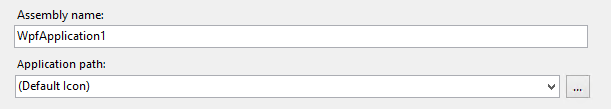 正しくない入力フィールドの長さ: 名前がこれほど長くなる可能性はほとんどありません。

     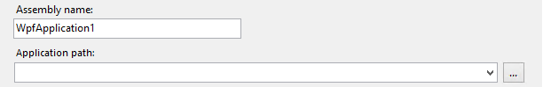 正しい入力フィールドの長さ: 入力フィールドは、期待される内容に対して妥当な幅です。

### コンボ ボックスとドロップダウン リスト
一般的な対話動作については、[ドロップダウン リストとコンボ ボックスに関する Windows デスクトップのガイドライン](/windows/desktop/uxguide/ctrl-drop)に従ってください。

#### 視覚スタイル

- ユーティリティ ダイアログでは、コントロールを再テンプレート化しないでください。 コントロールに固有の基本スタイルを使用します。

- テーマ付き UI では、コンボ ボックスとドロップダウンはコントロールの標準テーマに従います。

#### Layout
コンボ ボックスとドロップダウンのサイズは内容に合わせてください。フィールドがその中に表示されるウィンドウの幅に合わせたり、パスのような長いフィールドの長さに際限なく合わせたりしないでください。

 正しくない: ドロップダウンの幅が、表示されるコンテンツに対して長すぎます。

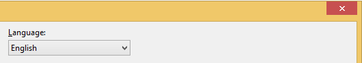 正しい: ドロップダウンは、翻訳によって長くなることを許容するサイズですが、不必要に長くはありません。

### チェック ボックス
一般的な対話動作については、[チェック ボックスに関する Windows デスクトップのガイドライン](/windows/desktop/uxguide/ctrl-check-boxes)に従ってください。

#### 視覚スタイル

- ユーティリティ ダイアログでは、コントロールを再テンプレート化しないでください。 コントロールに固有の基本スタイルを使用します。

- テーマ付き UI では、チェック ボックスはコントロールの標準テーマに従います。

#### 特殊な対話

- チェック ボックスの操作によって、ダイアログがポップアップ表示されたり、別の領域に移動したりしないようにしてください。

- チェック ボックスをテキストの 1 行目のベースラインに揃えます。

     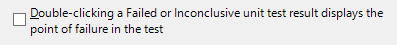 正しくない: チェック ボックスがテキストに対して中央揃えになっています。

     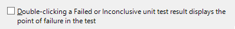 正しい: チェック ボックスをテキストの 1 行目に揃えています。

### ラジオ ボタン
一般的な対話動作については、[ラジオ ボタンに関する Windows デスクトップのガイドライン](/windows/desktop/uxguide/ctrl-radio-buttons)に従ってください。

#### 視覚スタイル
ユーティリティ ダイアログでは、ラジオ ボタンのスタイルを設定しないでください。 コントロールに固有の基本スタイルを使用します。

#### 特殊な対話
窮屈なレイアウトでグループの区別を維持する必要がある場合を除き、グループ フレームを使用してラジオ選択肢を囲む必要はありません。

### グループ フレーム
一般的な対話動作については、[グループ フレームに関する Windows デスクトップのガイドライン](/windows/desktop/uxguide/ctrl-group-boxes)に従ってください。

#### 視覚スタイル
ユーティリティ ダイアログでは、グループ フレームのスタイルを設定しないでください。 コントロールに固有の基本スタイルを使用します。

#### Layout

- 窮屈なレイアウトでグループの区別を維持する必要がある場合を除き、グループ フレームを使用してラジオ選択肢を囲む必要はありません。

- 1 つのコントロールに対してグループ フレームを使用しないでください。

- グループ フレーム コンテナーの代わりに水平方向の罫線を使用することが許容される場合があります。

## テキスト コントロール

### 静的テキスト フィールド

静的テキスト フィールドは読み取り専用の情報を表示し、ユーザーが選択することはできません。 ユーザーがクリップボードにコピーする可能性があるテキストには使用しないでください。 ただし、読み取り専用の静的テキストは、状態の変化を反映して変更することができます。 下記の例で、[情報] グループの [出力名] 静的テキストは、その上の [ルート名前空間] テキスト ボックスに加えられた変更を反映するために変更されます。

静的テキスト情報を表示するには、2 つの方法があります。

グループ化の競合がない場合、静的テキストは上位要素なしでダイアログ内に単独で存在できます。 ボックスの余分な行が本当に必要かどうかを判断します。 次に示すように、グループ行によって作成されたセクションの下にディレクトリ パスを表示するのはその例です。

 テキスト コントロール内の静的テキスト情報

他のグループ化された領域が存在し、情報の囲い込みによって読みやすさが向上するダイアログで、( **[プロパティ] ウィンドウ** の説明ペインのように) セクションの表示と非表示を切り替えることができる場合や、同様の UI との一貫性を持たせたい場合は、ボックスの内側に静的テキストを配置します。 このグループ ボックスは 1 本の罫線にして `ButtonShadow` で色付けする必要があります。

![[プロパティ] ウィンドウ内の静的テキスト](../../extensibility/ux-guidelines/media/PropertiesWindow.png "PropertiesWindow.png") [プロパティ] ウィンドウ内の静的テキスト

### 読み取り専用テキスト ボックス

これにより、ユーザーはフィールド内のテキストを選択できますが、編集はできません。 これらのテキスト ボックスは、通常の 3D チゼルと `ButtonShadow` の塗りつぶしによって境界が設定されます。

チェック ボックスのオン/オフやラジオ ボタンの選択/選択解除など、関連付けられたコントロールをユーザーが変更したときにテキスト ボックスをアクティブ (編集可能) にすることができます。 たとえば、次に示す **[ツール] &gt; [オプション]** ページでは、 **[既定値を使用]** チェック ボックスをオフにすると **[ホーム ページ]** テキスト ボックスがアクティブになります。

 非アクティブとアクティブの状態を示す読み取り専用テキスト ボックス

### ダイアログでのテキストの使用

ダイアログ内のテキストに関する主なガイドラインは次のとおりです。

- テーマのないダイアログ内のテキスト ボックス、リスト ボックス、フレームのラベルは、動詞で始め、最初の単語の先頭のみを大文字にし、コロンで終えます。

    > テーマ付きダイアログ内のテキスト コントロールでは、[Windows デスクトップ UX ガイドライン](/windows/desktop/uxguide/top-violations)に従い、ヘルプ リンク内の疑問符を除いて文末記号は使用しません。

- チェック ボックスとオプション ボタンのラベルは、動詞で始め、最初の単語のみ先頭を大文字にし、文末記号は使用しません。

- ボタン、メニュー、メニュー項目、タブのラベルは、各単語の先頭を大文字にします (タイトル ケース)。

- ラベルの文言は、他のダイアログ内の同様のラベルと一貫させてください。

- 可能であれば、実装のために開発者に送る前に、ライターや編集者がテキストを記述または承認するようにしてください。

- タブ移動で十分な特別な状況を除き、すべてのコントロールにラベルを付けてください。
必要に応じてヘルパー テキストを使用します。

### ヘルパー テキスト

ダイアログに含めて、ユーザーがダイアログの目的を理解できるようにしたり、実行するアクションを指示したりします。 シンプルなダイアログを煩雑にしないよう、ヘルパー テキストは必要時にのみ使用してください。 ヘルパー テキストには、ダイアログと透かしの 2 つのバリエーションがあります。

ヘルパー テキストの一般的な位置に従い、新しい領域の導入は慎重に行ってください。 ヘルパー テキストの一般的なシナリオは次のとおりです。

- ダイアログ内のヘルパー テキスト。複雑なダイアログの操作方法について追加の指示を与えます。

- 空のツール ウィンドウまたはダイアログ内の透かしテキスト。コンテンツが表示されない理由を説明します。

- **[プロパティ] ウィンドウ** の下部にあるような説明ペイン。

- 空のエディター内の透かしテキスト。ユーザーが最初に実行すべきアクションを説明します。

### ダイアログ ヘルパー テキスト

どのような場合にヘルパー テキストを使用するのが適切であるかに関しては、ユーザー エクスペリエンス デザイナーの判断が役立つ場合があります。 デザイナーは、ヘルパー テキストが表示される位置とその一般的な内容を定義することができます。 実際のテキストはユーザー アシスタンスが作成または編集できます。

### 透かし

ダイアログでは、透かしのガイドラインが若干異なります。 ダイアログは多くの UI 要素 (ラベル、ヒント テキスト、ボタン、その他のテキスト付きコンテナー コントロール) でごった返す可能性があり、それらが黒で表示される場合は特に、濃い灰色 (VSColor: `ButtonShadow`) の透かしが目立ちます。 透かしは通常、背景が白 (VSColor: `Window`) のリスト ボックスのようなコントロールの内側に表示されます。

- テキストは濃い灰色 (VSColor: `ButtonShadow`) で表示されます。 ただし、中程度の灰色またはその他の色 (VSColor: `ButtonFace`) の背景の上に透かしが表示され、読みやすさが懸念される場合は、黒のテキスト (VSColor: `WindowText`) を使用してください。

- 透かしは中央揃えまたは左揃えにできます。 配置を決定するときは、標準のデザイン ルールを適用します。 背景上で透かしは選択できません。

 透かしテキストの例

### コンテキスト固有 (動的) テキスト

動的テキストは、ダイアログまたはモードレス UI で、動的ラベルまたは動的コンテンツのいずれかとして使用できます。

- 動的ラベル: 動的テキストは一般に、選択した項目の詳細情報を提供する説明パネルで使用します。たとえば、要素のリストがあり、各要素のプロパティが右側のグリッドに表示されるダイアログで使用します。 プロパティ グリッドのラベルを動的にして、左側で項目を選択すると、右側のグリッドにその特定の項目の情報が表示されるようにすることができます。

- 動的テキスト: 特定の情報や、このように一般的でない情報を表示する必要がある場合に役立つことがありますが、使いすぎないように注意してください。

ユーザーが情報をコピーできるようにする場合は、読み取り専用のテキスト フィールドに動的テキストを配置する必要があります。

## ボタンとハイパーリンク

### 概要
ボタンとリンク コントロール (ハイパーリンク) は、使用法、表現、サイズ設定、間隔に関して、[ハイパーリンクに関する基本的な Windows デスクトップ ガイダンス](/windows/desktop/uxguide/ctrl-links)に従う必要があります。

### ボタンとリンクのどちらを使用するか
従来は、アクションにはボタンを使用し、ハイパーリンクはナビゲーション以外には極力使用しないことになっていました。 ボタンはどのような場面でも使用できますが、Visual Studio ではリンクの役割が拡張され、ボタンとリンクのどちらを使用してもよい場面が増えました。

コマンド ボタンを使用する場合:

- プライマリ コマンド

- 入力を収集したり選択を行ったりするために使用されるウィンドウの表示 (セカンダリ コマンドの場合を含む)

- 破壊的または不可逆的なアクション

- ウィザードやページ フロー内の確定ボタン

ツール ウィンドウではコマンド ボタンを避けてください。また、ラベルを 3 語以上にする必要がある場合にも避けてください。 リンクのラベルはもっと長くてもかまいません。

 リンクは次のような場合に使用します。

- 別のウィンドウ、ドキュメント、または Web ページへのナビゲーション

- アクションの意図を説明するために長めのラベルや短い文が必要な状況

- スペースが狭く、ボタンでは UI に収まらない場合 (アクションが破壊的でも不可逆的でもないことが条件)

- 多くのコマンドがある状況でのセカンダリ コマンドの強調解除

#### 例
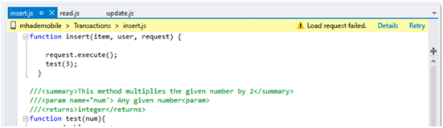 ステータス メッセージの後に情報バーで使用されるコマンド リンク

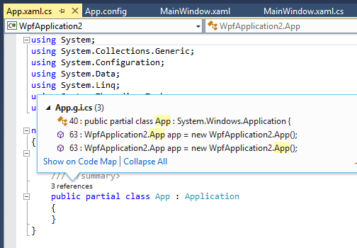 CodeLens ポップアップで使用されているリンク

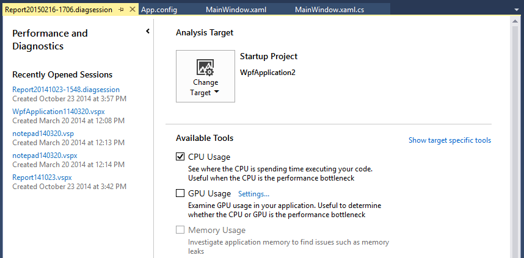 ボタンがあまり注意を引かないセカンダリ コマンドに使用されるリンク

### 一般的なボタン

#### Text
「[UI のテキストおよび用語](../../extensibility/ux-guidelines/ui-text-and-help-for-visual-studio.md#BKMK_UITextAndTerminology)」の記述ガイドラインに従います。

#### 視覚スタイル

##### 標準 (テーマなし)
Visual Studio のほとんどのボタンはユーティリティ ダイアログに表示されるため、スタイルを設定しないでください。 オペレーティング システムで規定された標準的なボタンの外観を反映するようにしてください。

##### テーマあり
スタイル付きの UI 内でボタンが使用される場合があり、そのようなボタンは適切にスタイルを設定する必要があります。 テーマ付きのコントロールについては、[ダイアログ](../../extensibility/ux-guidelines/application-patterns-for-visual-studio.md#BKMK_Dialogs)に関するページを参照してください。

### 特別なボタン

#### [参照...] ボタン
**[参照...]** ボタンは、グリッド、ダイアログ、ツール ウィンドウ、その他のモードレス UI 要素で使用されます。 このボタンは、ユーザーがコントロールに値を入力するのを支援するピッカーを表示します。 このボタンには長短 2 つのバリエーションがあります。

![長い [参照...] ボタン](../../extensibility/ux-guidelines/media/070703-04_browselong.gif "070703-04_BrowseLong") 長い [参照...] ボタン

![省略記号のみの短い [...] ボタン](../../extensibility/ux-guidelines/media/070703-05_browseshort.gif "070703-05_BrowseShort") 省略記号のみの短い [...] ボタン

省略記号のみの短いボタンを使用する場合:

- 複数のフィールドで参照操作を実行できるなど、長い **[参照...]** ボタンがダイアログ内に複数ある場合。 この状況によって生じるアクセス キーの混乱 (同じダイアログに **[参照 (&B)]** と **[参照 (&R)]** がある) を避けるために、それぞれに対して短い **[...]** ボタンを使用します。

- ダイアログが狭いか、長いボタンを配置するのに適した場所がない場合。

- ボタンがグリッド コントロールに表示される場合。

このボタンの使用ガイドラインは次のとおりです。

- アクセス キーを使用しないでください。 キーボードを使用してアクセスするには、ユーザーは隣接するコントロールからタブ移動する必要があります。 入力フィールドの直後に参照ボタンが表示されるタブ順序になっていることを確認してください。 最初のピリオドの下にアンダースコアを使用しないでください。

- Microsoft Active Accessibility (MSAA) の **[名前]** プロパティを **[参照...]** に設定して (省略記号を含めます)、スクリーン リーダーが "ドット ドット ドット" や "ピリオド ピリオド ピリオド" ではなく "参照" とボタンを読み上げるようにします。 マネージド コントロールの場合は、**AccessibleName** プロパティを設定します。

- 省略記号 **[...]** ボタンは、参照アクション以外には使用しないでください。 たとえば、 **[新規...]** ボタンが必要だがテキストを入れるスペースがない場合、ダイアログを再設計する必要があります。

##### サイズ設定と間隔
![[参照...] ボタンのサイズ設定: 標準バージョンは 75 x 23 ピクセル、短いバージョンは 26 x 23 ピクセル](../../extensibility/ux-guidelines/media/070703-06_browsesizing.png "070703-06_BrowseSizing") サイズ変更の [参照...] ボタン

![[参照...] ボタンの間隔: 関連するコントロールと標準の [参照] ボタンの間隔は 7 ピクセル、関連するコントロールと短い [参照] ボタンの間隔は 5 ピクセル](../../extensibility/ux-guidelines/media/070703-07_browsespacing.png "070703-07_BrowseSpacing") 行間の [参照...] ボタン

#### グラフィカル ボタン
一部のボタンでは、常にグラフィカル イメージを使用し、テキストを含めないでください。これは、スペースを節約し、ローカリゼーションの問題を回避するためです。 これらは、フィールド ピッカーやその他の並べ替え可能なリストでよく使用されます。

> [!NOTE]
> ユーザーはこれらのボタンにタブ移動する必要があるため (アクセス キーはありません)、適切な順序で配置してください。 スクリーン リーダーがボタンのアクションを正しく解釈できるように、ボタンの `name` プロパティを、そのボタンが実行するアクションにマップします。

| 機能 | ボタン |
| --- | --- |
| 追加 | ![グラフィカルな [追加] ボタン](../../extensibility/ux-guidelines/media/070703-08_buttonadd.png "070703-08_ButtonAdd") |
| 削除 | ![グラフィカルな [削除] ボタン](../../extensibility/ux-guidelines/media/070703-09_buttonremove.png "070703-09_ButtonRemove") |
| [すべてを追加] | ![グラフィカルな [すべて追加] ボタン](../../extensibility/ux-guidelines/media/070703-10_buttonaddall.png "070703-10_ButtonAddAll") |
| [すべて削除] | ![グラフィカルな [すべて削除] ボタン](../../extensibility/ux-guidelines/media/070703-11_buttonremoveall.png "070703-11_ButtonRemoveAll") |
| [上へ移動] | ![グラフィカルな [上へ移動] ボタン](../../extensibility/ux-guidelines/media/070703-12_buttonmoveup.png "070703-12_ButtonMoveUp") |
| [上へ移動] | ![グラフィカルな [下へ移動] ボタン](../../extensibility/ux-guidelines/media/070703-13_buttonmovedown.png "070703-13_ButtonMoveDown") |
| 削除 | ![グラフィカルな [消去] ボタン](../../extensibility/ux-guidelines/media/070703-14_buttondelete.png "070703-14_ButtonDelete") |

##### サイズ設定と間隔
グラフィカル ボタンのサイズは、 **[参照...]** ボタンの短いバージョンと同じです (26 x 23 ピクセル)。

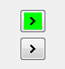 ボタン上のグラフィカル イメージの外観 (透明色の表示の有無別)

### ハイパーリンク
ハイパーリンクは、ヘルプ トピック、モーダル ダイアログ、またはウィザードを開くなど、ナビゲーションベースのアクションに適しています。 コマンドに使用する場合のハイパーリンクは常に、UI に対する目に見える形の顕著な変化を表示するようにしてください。 一般に、アクションにコミットするアクション (保存、キャンセル、削除など) は、ボタンを使用したほうが意図が伝わりやすくなります。

#### 記述スタイル
[ユーザー インターフェイス テキストに関する Windows デスクトップのガイドライン](/windows/desktop/uxguide/text-ui)に従います。 "Learn more about" (～の詳細)、"Tell me more about" (～について教えて)、"Get help with this" (これについてのヘルプを表示) などの表現は使用しないでください。 代わりに、ヘルプ リンク テキストの表現は、ヘルプ コンテンツで回答している主な質問を反映したものにします。 たとえば、"**How do I add a server to the Server Explorer?** " (サーバー エクスプローラーにサーバーを追加する方法は?) のようにします。

#### 視覚スタイル

- ハイパーリンクでは、常に [VSColor](../../extensibility/ux-guidelines/colors-and-styling-for-visual-studio.md#BKMK_TheVSColorService) サービスを使用する必要があります。 スタイルが正しく設定されていない場合、ハイパーリンクは、アクティブなときに赤で点滅するか、アクセス後に違った色で表示されます。

- 透かしの場合のように、リンクが完全な文の中の断片である場合を除いて、未操作状態のコントロールには下線を含めないでください。

- ホバー時に下線を表示しないでください。 代わりに、リンクがアクティブであることのフィードバックをユーザーに提供するには、わずかな色の変化と適切なリンク カーソルを使用してください。

## ツリー ビュー

ツリー ビューを使用すると、複雑なリストを親と子のグループにまとめることができます。 ユーザーは、親グループを展開するか折りたたんで、下位の子項目の表示と非表示を切り替えることができます。 ツリー ビュー内の各項目を選択して、さらにアクションを提供できます。

### ツリー ビューの視覚スタイル

#### 展開コントロール
ツリー ビュー コントロールは、Windows および Visual Studio で使用されるエキスパンダー デザインに準拠する必要があります。 各ノードでは、エキスパンダー コントロールを使用して、下位の項目の表示と非表示を切り替えます。 エキスパンダー コントロールを使用すると、Windows や Visual Studio 内でさまざまなツリー ビューに遭遇するユーザーに対して、一貫性が提供されます。

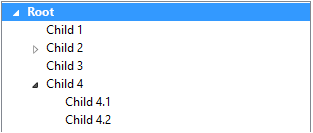 正: 展開コントロールを使用したツリー ビュー ノードの正しいスタイル

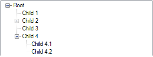 誤: ツリー ビュー ノードの不適切なスタイル

#### 選択
ツリー ビュー内でノードを選択すると、ツリー ビュー コントロールの幅いっぱいにハイライトが拡大します。 これによって、ユーザーは選択した項目を明確に識別できます。 選択色は、現在の Visual Studio テーマを反映している必要があります。

 正: 選択したノードのハイライトがツリー ビュー コントロールの幅全体に収まる。

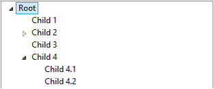 誤: 選択したノードのハイライトがツリー ビュー コントロールの幅全体に収まらない。

#### アイコン
ツリー ビュー コントロールでは、項目間の違いを視覚的に識別するのに役立つ場合にのみ、アイコンを使用してください。 一般に、アイコンは、種類が入り混じったリストにおいて、要素の種類を区別するために役立つ情報をアイコンが伝達する場合にのみ使用してください。 種類が一様なリストでは、アイコンの使用はノイズと見なされることが多いため、避けるようにしてください。 その場合、グループ アイコン (親) で、その中にある項目の種類を示すことができます。 このルールの例外は、アイコンが動的であり、状態を示すために使用される場合です。

#### スクロール バー
コンテンツがツリー ビュー コントロール内に収まる場合は、スクロール バーを常に非表示にしてください。 スクロール可能ウィンドウでスクロール バーを非表示または半透明にして、ツリー ビューを含むウィンドウにフォーカスがあるとき、またはツリー ビュー自体にマウス ポインターを置いたときにスクロール バーを表示することは認められています。

 内容がツリー ビュー コントロールの制限を超えたため、垂直と水平の両方のスクロール バーが表示されます。

### ツリー ビューの対話

#### コンテキスト メニュー
ツリー ビュー ノードでは、サブメニュー オプションをコンテキスト メニューに表示できます。 これは通常、ユーザーが項目を右クリックしたとき、または項目が選択された状態で Windows キーボードの Menu キーを押したときに発生します。 ノードがフォーカスを取得して選択されることが重要です。 これは、サブメニューがどの項目に属するのかをユーザーが識別するのに役立ちます。

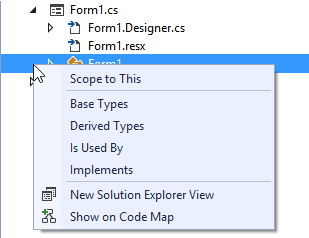 コンテキスト メニューを生成した項目がフォーカスを取得し、どの項目が選択されているかをユーザーに知らせます。

#### キーボード
ツリー ビューでは、項目の選択やノードの展開/折りたたみをキーボードを使って実行できるようにしてください。 これにより、ナビゲーションが Microsoft のアクセシビリティ要件を満たすようになります。

##### ツリー ビュー コントロール
Visual Studio のツリー コントロールは、一般的なキーボード ナビゲーションに従う必要があります。

- **上矢印:** ツリーを上に移動して項目を選択する

- **下矢印:** ツリーを下に移動して項目を選択する

- **右矢印:** ツリー内のノードを展開する

- **左矢印:** ツリー内のノードを折りたたむ

- **Enter キー:** 選択した項目を開始する、読み込む、実行する

##### Trid (ツリー ビューとグリッド ビュー)
Trid コントロールは、グリッド内にツリー ビューが含まれる複合コントロールです。 ツリー ビューと同じキーボード コマンドを使用してツリーの展開、折りたたみ、ナビゲーションを実行できる必要があり、以下が追加されます。

- **右矢印:** ノードを展開します。 ノードが展開された後、続けて右側の最も近い列に移動する必要があります。 ナビゲーションは行の終わりで停止する必要があります。

- **Tab:** 右側の最も近いセルに移動します。  行の終わりでは、ナビゲーションは次の行に続きます。

- **Shift + Tab:** 左側の最も近いセルに移動します。  行の先頭では、ナビゲーションは前の行の右端のセルに続きます。

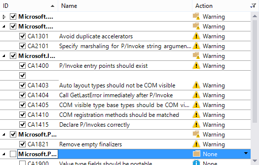 Visual Studio の Trid コントロール
