# Visual Studio の複合パターン
複合パターンは、個別の構成で対話要素とデザイン要素を結合します。 一貫性に関連する、Visual Studio の最も重要な複合パターンには、次のものがあります。

- [データの視覚化](../../extensibility/ux-guidelines/composite-patterns-for-visual-studio.md#BKMK_DataVisualization)

- [オンオブジェクト UI とクイック表示](../../extensibility/ux-guidelines/composite-patterns-for-visual-studio.md#BKMK_OnObjectUI)

- [選択モデル](../../extensibility/ux-guidelines/composite-patterns-for-visual-studio.md#BKMK_SelectionModels)

- [永続化と保存の設定](../../extensibility/ux-guidelines/composite-patterns-for-visual-studio.md#BKMK_PersistenceAndSavingSettings)

- [タッチ入力](../../extensibility/ux-guidelines/composite-patterns-for-visual-studio.md#BKMK_TouchInput)

## データの視覚化

### 概要
 グラフは、意思決定を裏付けるために、データを集計して視覚化する視覚的な方法です。 グラフは、大量のデータに向き合うユーザーにとっては有用ですが、要注意の対象や対応が必要な対象を特定するのにはほとんど役立ちません。

 ユーザーがグラフの恩恵を受けられるのは、次の条件のいずれかに該当する場合です。

- グラフは、ユーザーが実行できるタスクの特定に役立ちますか?

- グラフによって、可能性がある変更の結果をユーザーが予測できるようになりますか?

- グラフは、ユーザーが傾向を発見したりパターンを特定したりするのに役立ちますか?

- グラフによって、ユーザーはより的確な意思決定ができるようになりますか?

- グラフは、特定の状況でユーザーが抱く可能性がある特定の疑問への答えを導くのに役立ちますか?

#### グラフについての一般的な規則

- データを明確にラベル付けします。 説明のないイラストは、美しい絵にすぎません。

- 傾斜した比率を避けるために、軸をゼロから開始します。 行の長さと棒のサイズは、データ ポイント間の関係を理解するために重要な視覚的ヒントです。

- インフォグラフィックではなく、グラフを作成します。 インフォグラフィックはデータの芸術的表現であり、その主な目標は視覚的なストーリーテリングです。 グラフは視覚に訴えることができますし、そうすべきですが、データが自らを物語るようにしてください。

- スキューモーフィズム、ピクトリアル棒グラフ、コントラスト ハッシュマーク、その他のインフォグラフィック タッチは避けてください。

- 3D 効果を装飾要素として使用しないでください。 それらは、ユーザーが情報を理解する能力にとって本当に不可欠な場合にのみ使用してください。

- 複数の線と塗りつぶしを使用しないでください。2 色を超えると、この種類のグラフが読みにくくなったり、正しい解釈が難しくなったりする可能性があります。

- グラフ (またはイラスト) を、概念の理解またはデータの操作のための唯一の手段として使用しないでください。 視覚障碍のあるユーザーに困難をもたらします。

- ページ上で、不必要または装飾的な要素としてグラフを使用しないでください。 具体的には、グラフに何の付加価値もない場合や、ユーザーの問題解決にグラフが役立たない場合は、使用しないでください。

### グラフの種類
 Visual Studio で使われるグラフの種類には、棒グラフ、折れ線グラフ、リング グラフまたは "ドーナツ グラフ" と呼ばれる修正された円グラフ、タイムライン、散布図 ("クラスター グラフ" とも呼ばれます)、およびガント チャートが含まれます。 それぞれの種類のグラフは、さまざまな種類の情報を伝えるために役立ちます。

### グラフ作成に関するその他の考慮事項

#### Color
 Visual Studio での使用のために定義された、グラフの色の特定のパレットがあります。 このパレットは、主要なタイプの色覚異常への配慮がなされており、非常に狭い色のスライスとして使用する場合でも色を区別できるようになっています。 これらの色は、任意の組み合わせで、UI 内のあらゆる種類のグラフに対して使用できます。 それほど多くの色を区別する必要がない場合、7 色すべてを使用する必要はありません。 これらの色は前景要素で使用するようには設計されていないため、これらの色の前面にテキストやグリフを配置しないでください。 これらの色相はハードコードして、 **[ツール] > [オプション]** でユーザー カスタマイズに公開する必要があります ([エンド ユーザー向けの色の公開](../../extensibility/ux-guidelines/colors-and-styling-for-visual-studio.md#BKMK_ExposingColorsForEndUsers)に関するページを参照)。

|見本|Hex|RGB|
|------------|---------|---------|
||#71B252|113,178,82|
||#BF3F00|191,63,0|
||#FCB714|252,183,20|
||#903F8B|144,63,139|
||#117AD1|17,122,209|
||#79D7F2|121,215,242|
||#B5B5B5|181,181,181|

## オンオブジェクト UI とクイック表示
 このセクションでは、Visual Studio に固有のオンオブジェクト UI の一種であり、コード ピーク ビューとも呼ばれるクイック表示のコンテキストを示します。

### 概要

- オンオブジェクト UI では、メイン タスクからユーザーの気を散らすことなく、より多くの情報や、より高度な対話性をユーザーに提供する必要があります。

- Visual Studio のオンオブジェクト UI のメイン パターンは "注意点の情報" と呼ばれるものです。

- Visual Studio のオンオブジェクト UI は、インラインまたはフローティングのいずれかであり、永続的または一時的です。

  - Visual Studio のオンオブジェクト UI の一種であるコード ピーク ビューは、インラインであり、永続的です。

  - Visual Studio のオンオブジェクト UI の一種である CodeLens は、フローティングであり、一時的です。

  コード片がどのように動作するかを理解したり、そのコードの詳細を解明したりするために、開発者はしばしば、コンテキストを切り替えて他のコンテンツや別のウィンドウに移動する必要があります。 ユーザーがメイン ウィンドウを離れると、元のタスクへの集中力を失うことがあるため、このようなコンテキスト シフトは混乱を招く可能性があります。 さらに、ウィンドウを切り替えると元のコードが他の UI によって隠れてしまう場合は特に、コンテキストを元に戻すのが難しいことがあります。

  オンオブジェクト UI は、"注意点の情報" と呼ばれるパターンに従います。 これらのメッセージ、ポップアップ ウィンドウ、およびダイアログ ボックスは、ユーザーのメイン タスクへの集中を妨げることなく、明確さや対話性を付加する追加の関連情報をユーザーに提供します。 オンオブジェクト UI の例には、通知領域のアイコンにユーザーがポインターを合わせると表示されるポップアップ ウィンドウ、スペルミスがある単語の下の赤い波線、Visual Studio 2013 で導入されたピーク ビューなどがあります。

### デシジョン ポイント
 Visual Studio 内で、この "注意点の情報" パターンを使用するいくつかの方法があります。 適切なメカニズムを選択し、一貫性のある予測可能な方法でそれを実装することは、エクスペリエンス全体にとって不可欠です。 そうしないと、混乱を招く、あるいは一貫性のないエクスペリエンスがユーザーに提供され、コンテンツ自体への集中の妨げになる可能性があります。

#### マスター コンテンツと詳細コンテンツの関係
 "注意点の情報" は、ユーザーが集中しているコンテンツ ("マスター" コンテンツ) と、追加の関連コンテンツ ("詳細" コンテンツ) の関係を表示するために使用されます。 このパターンでは、詳細コンテンツはユーザーが扱っているコンテンツに明確に関連しており、マスター コンテンツの近くに表示できます。 補足情報や、要約してもマスター コンテンツの妨げになることが避けられない情報は、"ツール ウィンドウ" などの別のパターンに従う必要があります。

- **常に**、詳細コンテンツをマスター コンテンツの近くに表示してください。

- **常に**、詳細コンテンツがマスターコンテンツへのユーザーの集中を妨げないようにしてください。 多くの場合、詳細コンテンツをマスター コンテンツにできるだけ近づけるのが、これを実現する最良の方法です。 マスター コンテンツの隣のポップアップ ウィンドウに詳細コンテンツを表示するか、マスター コンテンツの下にインラインで詳細コンテンツを表示すると、これを実現できます。

- **決して**、ユーザーをマスター コンテンツから遠ざけるような "注意点の情報" は使用しないでください。 ユーザーが詳細コンテンツを別途表示する必要がある場合は、ユーザーがこれを行えるようにする明示的なアクションを公開します。

#### 設計の詳細
 オンオブジェクト UI が正しい選択肢であると判断した後の設計上の考慮事項には、主に次の 4 つがあります。

1. **永続性:** コンテンツは永続的または一時的のどちらであると想定されていますか。
   ユーザーは、参照または操作のために、情報が表示されたままになることを望みますか。 それとも、ユーザーは情報をちらっと確認したらメイン タスクに戻ることを望みますか。

2. **コンテンツ タイプ**: コンテンツは情報提供、要対応、またはナビゲーションのどれに当てはまりますか。
   マスター コンテンツに関する追加の詳細がユーザーに必要ですか。 マスター コンテンツに影響を与えるタスクをユーザーが完了する必要がありますか。 それとも、ユーザーを別のリソースに誘導する必要がありますか。

3. **インジケーターの種類:** アンビエント インジケーターは有意義なものですか。
   便利な形で情報を要約し、マスター コンテンツの妨げにならないように表示することができますか。

4. **ジェスチャ**: どのようなジェスチャを使用して UI を起動し、終了しますか。
   ユーザーはどのようにして詳細コンテンツを表示し、表示を消しますか。 一時的な状態と永続的な状態を切り替えるためにピン留めなどのジェスチャを追加する価値はありますか。

   以上 4 つの決定要因はそれぞれ、オンオブジェクト UI の主要コンポーネントに影響を与えます。

### オンオブジェクト UI コンポーネント

1. コンテナー (コンテンツ プレゼンター) の種類

    - フローティング

    - インライン

2. Content type

    - 情報: 静的または動的な可能性があるデータ

    - 要対応: マスター コンテンツを変更するコマンド

    - ナビゲーション: ユーザーを別のウィンドウまたはアプリケーション (例: MSDN) に誘導するリンク

3. ジェスチャ

    - 呼び出し

    - 無視

    - ピン留め

    - その他の相互作用

4. 永続化とコミット モデル

    - 一時的

    - Durable

    - 自動

    - オンデマンド

5. アンビエント インジケーター (省略可能)

    - 波下線

    - スマート タグ アイコン

    - その他のアンビエント インジケーター

#### コンテナー (コンテンツ プレゼンター) の種類
 注意点にコンテンツを提示するために利用できる、2 つの主要なオプションがあります。

1. **インライン**: Visual Studio 2013 のコード エディターで導入されたピーク ビューなどのインライン プレゼンターでは、既存のコンテンツをシフトして、新しいコンテンツのためのスペースを確保します。

    - インライン プレゼンターが **望ましい** のは、提示したコンテンツをユーザーが参照または操作するのにかなり時間がかかることが予想される場合です。

    - インライン プレゼンターを **避けるべき** なのは、ユーザーは提示された情報をちらっと確認するだけで、最小限の中断でメイン タスクに戻ろうとすることが予想される場合です。

2. **フローティング**: フローティング プレゼンターは、選択したコンテンツのなるべく近くに配置されますが、既存のコンテンツのレイアウトは変更しません。 選択したシンボルに最も近い空白部分の上にフローティング コンテンツ パネルを表示するなど、さまざまな戦略を採用できます。

    - フローティング プレゼンターが **望ましい** のは、ユーザーは提示された情報をちらっと確認するだけで、最小限の中断でメイン タスクに戻ろうとすることが予想される場合です。

    - フローティング プレゼンターを **避けるべき** なのは、提示したコンテンツをユーザーが参照または操作するのにかなり時間がかかることが予想される場合です。

#### Content type
 オンオブジェクト UI コンテナー内に表示できるコンテンツは、主に 3 種類あります。 これらの種類の情報は任意に組み合わせて表示できます。 3 つのタイプは次のとおりです。

1. **情報**: ほとんどのオンオブジェクト UI コンテナーは、何らかの種類の情報コンテンツを表示します。 このコンテンツは、環境の現在の状態についての情報を表すこともあれば、環境の潜在的な将来の状態についての情報を表すこともあります。 たとえば、リファクタリングなど、既存のコードに対する特定のコマンドの効果を示すために使用できます。

    - **常に**、表示する情報の標準的な表現を使用してください。 たとえば、コードはあくまでコードらしく、構文の強調も含めて表示する必要があり、ユーザーが設定したフォントやその他の環境設定に従う必要があります。

    - **常に**、同じ情報がマスター コンテンツとして提示された場合に実行可能なあらゆるアクションを、情報コンテンツに対してもサポートすることを検討してください。 たとえば、オンオブジェクト UI コンテナー内で既存のコードを表示する場合は、そのコードを参照および修正する機能をサポートすることを強く検討してください。

    - **常に**、潜在的な将来の状態を表す情報コンテンツを提示する場合は、異なる背景色を使用することを検討してください。

2. 要対応: 一部のオンオブジェクト UI コンテナーは、リファクタリング操作の実行など、何らかのアクションをマスター コンテンツに対して実行する機能を提供します。

    - **常に**、要対応のコマンドは情報コンテンツから離して配置してください。

    - **常に**、状況に応じてアクションを有効または無効にしてください。

    - **常に**、ダイアログ ボックス内でコマンドを表すための標準ガイドラインを参照してください。

    - **常に**、オンオブジェクト UI コンテナーで公開されるアクションの数は最小限に抑えてください。 オンオブジェクト UI の操作を、軽量かつ高速にしてください。 オンオブジェクト UI コンテナー自体の管理にユーザーがエネルギーを浪費しなくて済むようにしてください。

    - **常に**、オンオブジェクト UI コンテナーをいつ、どのようにして閉じる (破棄する) かを検討してください。 ベスト プラクティスとして、マスター コンテンツと詳細コンテンツ間の対話を終えるアクションは、そのアクションが起動された時点でオンオブジェクト UI コンテナーを閉じる必要もあります。

3. **ナビゲーション**: 一部のオンオブジェクト UI コンテナーには、ユーザーの Web ブラウザーで MSDN の記事を開くなど、別のウィンドウまたはアプリケーションにユーザーを誘導するリンクが含まれています。

    - **常に**、他のコンテンツに誘導されてもユーザーが驚かないよう、ナビゲーション リンクの前に "開く" の表記を付けてください。

    - **常に**、ナビゲーション リンクを要対応リンクから分離してください。

#### アンビエント インジケーター (省略可能)
 アンビエント インジケーターは、コードの残りの部分とコントラストをなす色で表示したテキストのように控えめにすることも、波下線やスマート タグ アイコンなどの備忘録的な記号のようによく目立つものにすることもできます。 アンビエント インジケーターは、追加の関連情報があることを知らせます。 ユーザーに対話を要求せずに有用な情報を提供するのが理想的です。

- **常に**、アンビエント インジケーターは、ユーザーの集中を妨げないように、また情報過多にならないように配置してください。 そのような形でアンビエント インジケーターを配置できない場合は、別の解決策を検討してください。

- **常に**、アンビエント インジケーターは、関連するコンテンツのできるだけ近くに配置してください。

- **常に**、提示する情報を要約するインジケーターを作成するようにしてください。 提示するデータ項目の数を示す (たとえば、単に "参照" ではなく "3 つの参照" とする) か、他の何らかの方法でデータを要約することを検討してください。

  - インジケーターのデータを常に計算して表示できるとは限らない場合は、値が計算され次第、進行形のフィードバックを提供することを検討してください。 たとえば、Windows Phone で未読メールが増えるとメールのライブ タイルが更新されるのと同じように、参照できるデータの更新を反映して変更をアニメーション化することを検討してください。

- **決して**、特定のコンテンツに関してユーザーが情報を消化できる妥当な範囲を超えてインジケーターを追加しないでください。 アンビエント インジケーターでは、有用ではあるがユーザーに対話を要求しないものにしてください。 視界に入れるためにオーバーフローやその他の管理コントロールが必要なインジケーターはアンビエントとは言えません。

#### ジェスチャ
 ユーザーがマスター コンテンツに集中し続けられるようにするための重要な側面は、追加の詳細コンテンツを開いたり閉じたりするための適切なジェスチャをサポートすることです。

- **常に**、追加のコンテンツを開くために何らかの明示的なジェスチャを実行するようユーザーに要求してください。 一般的な開くジェスチャには、次のものがあります。

  - **ホバー**: ヒントまたは非対話型の情報コンテンツ

  - **明示的なコマンド**: インライン プレゼンター

  - **アンビエント インジケーターのダブルクリック**: CodeLens ポップアップ ウィンドウ

- **常に**、ユーザーが Esc キーを押すたびに詳細コンテンツを閉じるようにしてください。

- **常に**、オンオブジェクト UI のコンテキストを考慮してください。 コンテナー内で対話を許可するコンテンツ プレゼンターについては、ホバー時に追加情報を表示するとユーザーのワークフローを阻害する可能性があるため、表示するかどうかを慎重に検討してください。

- **決して**、編集可能な印象を与えるコンテンツや、ユーザーの対話を促すコンテンツは、ホバー時に表示しないでください。 ヒントを生成したマスター コンテンツからカーソルが離れたらすぐに消滅するのがヒントの標準的な動作であるため、このような動作は、詳細コンテンツにカーソルを移動しようとしたユーザーにとってストレスになる可能性があります。

## 選択モデル

### 概要
 選択モデルは、ユーザー インターフェイス内にある 1 つ以上の目的のオブジェクトに対する操作を指示したり、確認したりするために使用されるメカニズムです。 このトピックでは、Visual Studio のドキュメント エディター (テキスト エディター、デザイン サーフェイス、およびモデリング サーフェイス) 内での選択の対話パターンについて説明します。

 ユーザーには、自分が操作しようとしている対象を Visual Studio に指示する手段が必要です。また Visual Studio は、操作が行われようとしている対象についてのフィードバックをユーザーに提供することで、予測可能な応答をする必要があります。 ユーザーとユーザー インターフェイスの間で認識のずれや伝達ミスがあると、ユーザーがアクションに気付かない可能性があり、それによって意図しない結果が生じる可能性があります。 多くの場合、何かが不足しているか何か変化があったことをユーザーが認識するまで、エラーは気付かれません。 そのため、選択モデルは、ユーザー インターフェイス設計の最も重要な要素の 1 つです。 Visual Studio の選択モデルは Windows との一貫性がありますが、微妙な違いがあります。

 Visual Studio では、Windows と同様、対話が発生するコンテキストによって選択モデルが異なります。 選択は、次の 4 種類のオブジェクトで発生する可能性があります。

- Text

- グラフィック オブジェクト

- リストとツリー

- グリッド

  これらのオブジェクト内で、次の 3 種類の選択肢があります。

- 連続

- 非結合

- リージョン

#### Scope
 選択の最も重要な要素は、自分がどのウィンドウで作業していて (アクティブ化) フォーカスがどこにあるのか (選択) をユーザーが確実に認識していることです。 Visual Studio は Windows のウィンドウ管理機能を拡張しますが、アクティブ化スキームは同じで、ウィンドウとの対話を開始するとそのウィンドウにフォーカスが移動します。 Visual Studio には、アクティブ化のための 2 つのインジケーターがあります。1 つはドキュメント ウィンドウ用で、もう 1 つはツール ウィンドウ用です。

 ドキュメント ウィンドウの場合、アクティブなウィンドウは、ドキュメント ウィンドウ タブが最前面に来てその背景色が変わることによって示されます。

 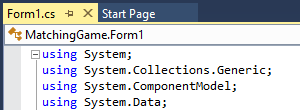

 **アクティブなタブの選択**

 ツール ウィンドウの場合、アクティブなウィンドウは、ツール ウィンドウのタイトル バー領域の色の変化によって示されます。

 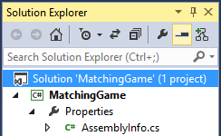

 **ノードのプライマリ選択を示しているアクティブなツール ウィンドウ**

 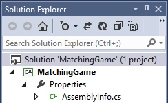

 **ノードの潜在的な選択を示している非アクティブなツール ウィンドウ**

 ウィンドウがアクティブになると、ガイドラインのこのセクションで説明している選択モデルに従って、そのフォーカスが示されます。

#### Context
 Visual Studio は、コンテキストの強い概念を保持し、ユーザーがどこで作業しているかを追跡するように設計されました。 ツール ウィンドウかドキュメント ウィンドウかを問わず、1 つのウィンドウだけがアクティブです。 ただし、最前面のドキュメント ウィンドウは常に、潜在的な選択を保持します。 フォーカスがツール ウィンドウにある場合でも、最後にアクティブだったドキュメント ウィンドウには、非アクティブ状態であっても選択が表示されます。 これは、ユーザーが編集していたドキュメントにユーザーのコンテキストを保持し、ツール ウィンドウとドキュメント ウィンドウをシームレスに行き来できるよう Visual Studio がユーザーの状態を保持していることをユーザーに示すために行われます。

### テキストの選択
 組み込みのテキスト エディターなど、厳密にテキスト用である Visual Studio のエディターでは、MSDN の Windows ユーザー エクスペリエンス インタラクション ガイドラインの「[マウスとポインター](/windows/desktop/uxguide/inter-mouse)」ページで説明されているものと同じテキスト選択モデルおよび外観を使用します。 テキスト エディターの入力フォーカスは、挿入ポイントと呼ばれる縦棒によって示されます。 挿入ポイントは幅 1 ピクセルで、その背後のあらゆる要素の反転色になります。 コントロール パネルの **[キーボード]** アプレットの **[速度]** タブにある **[カーソルの点滅速度]** で設定した速度に従って点滅します。

#### 連続した選択と非結合の選択
 テキスト エディター内の選択は連続のみです。 非結合テキスト選択は許可されていませんが、グラフィカル オブジェクト エディターで対処する必要があります。 ユーザーのマウスポインターがテキスト領域上にあると、カーソルが I ビームに変わります。 シングルクリックすると、テキスト エディター内でクリック位置に挿入ポイントが配置されます。 マウス ボタンを押したままにすると選択ハイライトが開始し、マウス ボタンを放すと選択ハイライトが終了します。

#### 領域選択 (ボックス選択)
 Visual Studio では、テキスト エディターでの領域選択がサポートされており、これはボックス選択と呼ばれます。 ボックス選択によって、ユーザーは通常のテキスト ストリームに従わないテキストの領域を選択できます。 標準のテキスト選択と同様に、選択は連続している必要があります。 ボックス選択を開始するには、Alt キーを押したままマウスでドラッグします。 Alt キーと Shift キーを押したまま、方向キーを使用して選択の領域を指示することによってボックス選択を開始することもできます。 ボックス選択では、通常の選択ハイライトが使用され、選択エリアの終端に挿入ポイント カーソルが点滅表示されます。

 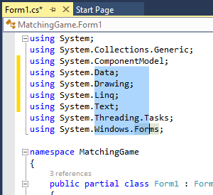

 **Visual Studio での領域 (ボックス) 選択**

#### テキストの選択の外観
 エディターでアクティブおよび非アクティブ選択に使用される色はカスタマイズできます。 ユーザーは **[ツール] > [オプション]** 、次に **[環境] > [フォントおよび色] > [テキスト エディター]** の順にアクセスして、エディターの視覚的な外観をカスタマイズできます。

### グラフィカルな選択

#### 相互作用
 グラフィカル オブジェクトの選択は複雑になる可能性があり、いくつかの要因に依存します。

- **エディターのプライマリ選択モデル。** グラフィカル オブジェクトを含むエディターを使用して、テキストやグリッドを編集することもできます。 たとえば、エディターは、Visual Studio XAML デザイナーのように、グラフィカル オブジェクトの配置もサポートするテキストベースのエディターである場合があります。 複数のオブジェクトの種類をサポートすると、さまざまな種類のオブジェクトで構成されたグループをユーザーが選択する方法に影響を与える可能性があります。

- **プライマリおよびセカンダリ選択状態のサポート。** エディターでは、オブジェクトを同時に編集したり、互いに位置を揃えたり、一緒にサイズ変更したりできるように、プライマリとセカンダリの選択状態を提供できます。

- **インプレース編集のサポート。** エディターでは、そのグラフィカル オブジェクトの内容の編集を許可することもできます。 たとえば、四角形の図形の内側に、ユーザーが変更できるテキストを含めることもできます。 さらに、そのテキストを中央揃えまたは両端揃えにすることができます。 インプレース編集には、より詳細なレベルのユーザー対話が関係するため、状態情報をユーザーに提示する一連の適切な視覚的ヒントが必要です。

#### マウスの相互作用

|入力|結果|
|-----------|------------|
|未選択オブジェクトをクリック|オブジェクトのサイズ変更が可能な場合、オブジェクトを選択して破線と選択ハンドルを表示します。|
|選択したオブジェクトをクリック|オブジェクトでサポートされている場合、インプレース編集をアクティブにします。 オブジェクトの外側をクリックすると、インプレース編集モードが非アクティブになります。|
|オブジェクトをダブルクリック|オブジェクトに関連付けられたコードを編集のために開きます。必要に応じて、既定のイベント ハンドラーが挿入される場合があります。|
|オブジェクトをポイント|ポインターを移動カーソルに変更します。 輝度や色など、オブジェクトの外観が変わる場合があります。|
|選択ハンドルをポイント|ポインターをサイズ変更カーソルに変更します。 回転をサポートするオブジェクトの場合、一部の選択ハンドルでは、選択ハンドルからの相対的なポインターの位置が異なる (たとえば、遠ざかる) ため、ポインターが回転カーソルに変わる場合があります。|
|ドラッグ|オブジェクトが以前に選択されていない場合でも、ポインターを移動カーソルに変更してオブジェクトを移動します。|
|エディターがフォーカスを喪失|インプレース編集モードを非アクティブにしますが、オブジェクトの内容と外観は最後の操作/選択状態時のまま保持されます。|
|オブジェクト選択|境界線、点線、または、オブジェクトの境界を強調するその他の視覚的特徴によって示されます。|
|選択したオブジェクトのサイズを変更|選択ハンドルによって示されます。   サイズ変更可能なオブジェクトには、サイズを変更できるそれぞれの方向を表す 8 つのハンドルがあります。 特定の方向にしかオブジェクトのサイズを変更できない場合、使用されるハンドルの数が減ることがあります。 8 つのハンドルでは操作しにくい大きさまでユーザーがオブジェクトを縮小すると、使用されるハンドルが 4 つになる場合があります。 ハンドル サイズは、表示解像度に比例したサイズにするために、**GetSystemMetrics** API 関数を使用してウィンドウの境界と端のメトリックに関連付ける必要があります。   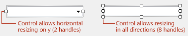|
|選択したオブジェクトを回転|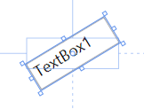|

#### キーボード操作

|入力|結果|
|-----------|------------|
|タブ|エディター内でオブジェクトの論理的な順序に従ってフォーカス インジケーターを移動します。 これは、**TabIndex** (またはそれに相当する) プロパティの値、オブジェクトの作成順、そしてエディターの全体的な目的に応じて、左から右または上から下のどちらかになります。 Shift + Tab キーを押すと、フォーカス インジケーターの方向が反転します。|
|Space|キー ストロークが維持されている間、パン モードをアクティブにします。 ビューポートの位置をパンするには、追加のマウス入力が必要です。|
|Ctrl + Space|キー ストロークが維持されている間、ズーム モードをアクティブにします。 拡大/縮小率を上げ下げするには、追加のマウス入力が必要です。|
|Ctrl + Alt + マイナス記号 (-)|拡大/縮小率を 1 段階下げます。|
|Ctrl + Alt + プラス記号 (+)|拡大/縮小率を 1 段階上げます。|
|Shift または Ctrl|オブジェクトを選択グループに追加します。 Ctrl キーを使用して、選択グループからオブジェクトを個別に削除することもできます。|
|Enter|オブジェクトに対して既定のコマンドを実行します (通常は [開く] または [編集])。|
|F2|オブジェクトのインプレース編集をアクティブにします。|
|方向キー|選択されたオブジェクトを、押された方向キーの方向に少しずつ (たとえば、1 ピクセルずつ) 移動します。|
|Ctrl + 方向キー|選択されたオブジェクトを、押された方向キーの方向にやや大きく (たとえば、10 ピクセルずつ) 移動します。|
|Shift + 方向キー|選択されたオブジェクトを、それぞれの方向に少しずつ (たとえば、1 ピクセルずつ) サイズ変更します。|
|Ctrl + Shift + 方向キー|選択されたオブジェクトを、それぞれの方向にやや大きく (たとえば、10 ピクセルずつ) サイズ変更します。|

 ユーザーがインプレースでコントロールを編集するとき、ユーザー入力に伴ってオブジェクトが自動的にサイズ変更されると便利な場合があります。 たとえば、ユーザーがラベル コントロールを編集する場合に、ユーザーが入力したテキストが表示されるようにラベルを拡大します。 これが行われない場合、ユーザーはテキストを編集した後にコントロールのサイズを手動で変更する必要があります。 多くのコントロールがある場合、これは機械的で非生産的なタスクになります。

#### グラフィカル コンテナー
 グラフィカル エディターは、Windows フォーム パネル コントロールや、HTML デザイナーのグリッド レイアウト コントロールなど、他のグラフィカル オブジェクトのコンテナーを提供する場合もあります。 他のグラフィカル オブジェクト用のコンテナーがエディターに用意されている場合、以下の選択モデルはコンテナーのみに使用してください (コンテナー内のオブジェクトは前述の標準モデルに従います)。

|入力|結果|
|-----------|------------|
|コンテナーをシングルクリック|コンテナー内のオブジェクトのどれも直接選択せずに、コンテナー オブジェクトを選択します。 コンテナーは、(前に説明したように) 標準のマウスおよびキーボード入力で移動したり、サイズを変更したりできます。 コンテナー内のオブジェクトはコンテナーとの関連で移動されますが、コンテナー内のオブジェクトは、同時に直接選択されていない限りサイズは変更されません。|
|コンテナーの境界領域上をホバー|マウスを移動カーソルに変えて、コンテナーが移動可能であることを示します。|
|コンテナーの境界領域をドラッグ|マウスを移動カーソルに変えて、コンテナー (およびその中に含まれるオブジェクト) を移動します。 コンテナーは、最初にシングルクリックで選択しないと移動できません。|
|コンテナー内のオブジェクトをシングルクリック|コンテナーを選択解除し (選択されている場合)、クリックしたオブジェクトのみを選択します。|
|Shift または Ctrl キーを押しながらコンテナー内のオブジェクトまたはコンテナーをクリック|クリックしたオブジェクトを既存の選択または選択グループに追加します。 クリックしたオブジェクトが既に選択グループのメンバーである場合は、選択グループから削除されます。|

 コンテナー内のオブジェクトは、前のセクションで説明した基本的な選択モデルに準拠する必要があります。 Windows フォーム デザイナーのユーザビリティ テストでは、ユーザーは、(コンテナー オブジェクトによって課せられる) 介入ステップなしでコンテナー内のオブジェクトにシームレスにアクセスできることを期待していました。

#### 非結合選択と領域選択
 グラフィカル オブジェクト エディターでは、非結合選択をサポートする必要があります。 この画像は、Visual Studio のコントロールの外観を示すものではないことに注意してください。 詳細なビジュアル仕様については、「[グラフィカルなオブジェクト選択の外観](../../extensibility/ux-guidelines/composite-patterns-for-visual-studio.md#BKMK_GraphicalObjectSelectionAppearance)」を参照してください。

 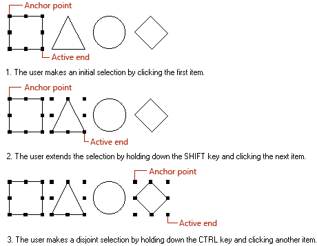

 **非結合選択**

 グラフィカル エディターでは、マーキー型の選択インジケーターによる領域選択も提供する必要があります。 グラフィカル エディターで (テキストなどの) 他のオブジェクトの種類をサポートしている場合、そうした他のオブジェクトの種類の制約によっては、領域選択が不可能な場合があります。

 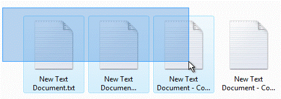

 **マーキーの選択**

#### プライマリおよびセカンダリ選択
 一部のグラフィカル オブジェクト エディターでは、ユーザーがグループ内のオブジェクトを編集または整列できます。 この場合、プライマリ選択とセカンダリ選択の概念を導入する必要があります。 プライマリ選択は、グループ操作のために他のすべてのオブジェクトがそれに呼応するオブジェクトです。 ユーザーが最初に選択したオブジェクトがプライマリ コントロールになり、それ以降の選択はセカンダリ選択になります。 プライマリ選択は、どのオブジェクトがプライマリであるかを示すために、セカンダリ選択とは異なった視覚的取り扱いがなされます。

 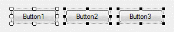

 **2 つのセカンダリ選択があるプライマリ選択**

#### グラフィカルなオブジェクト選択の外観
 選択ハンドルは、オブジェクトの境界ボックスのまわりに四角形のパターンで描画される正方形です。 次の表では、グラフィカル オブジェクトがとりうるさまざまな状態の例を、ハンドル、サイズ変更、インプレース編集の外観と共に示しています。 **GetSystemMetrics** API を使用して、ハンドルのサイズをウィンドウの境界と端のメトリックに関連付ける必要があります。

| 州 | 外観 | ビジュアルの詳細 |
|-------------------------|---------------| - |
| **未選択** | Default | 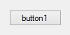 |
| **プライマリ選択** | サイズ変更可能 | 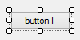 |
| **プライマリ選択** | サイズ変更不可 |  |
| **プライマリ選択** | ロック | 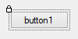 |
| **セカンダリ選択** | サイズ変更可能 | 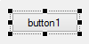 |
| **セカンダリ選択** | サイズ変更不可 |  |
| **セカンダリ選択** | ロック | 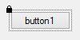 |
| **UI アクティブ** | Default | 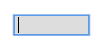 |

### ビュー選択モデル

#### ツリー構造
 ツリー ビューでの選択は、単純なハイライトで示されます。 ユーザーがノード名またはノード アイコンをクリックすると、ノードが選択された状態になります。 ノードの左側にある三角形のグリフは、ツリー コントロールを展開または縮小しますが、ユーザーの選択には影響しません。ただし、1 つの例外として、選択がそのノードの子にあるときに親ノードを折りたたむと、親に選択が移ります。

 

 **Visual Studio での一般的なツリー ビュー**

 ツリー ビューでは、ツリー内の複数のレベルにまたがる場合も含め、連続した選択と非結合の選択をサポートできます。 連続または非結合の複数選択は、見えているツリー ノードに対して行う必要があります。 ノードが折りたたまれている場合、非結合の選択は解除され、折りたたまれたノードに選択が移ります。 これにより、操作の影響を受けるノードをユーザーが確認できます。 ノードが折りたたまれると、どのノードが影響を受けるかが不明確になります。

 親ノードを選択したとき、操作は本来親に適用されますが、親とそのすべての子に操作を適用することが理にかなっている場合もあります。 この場合は、操作中に、"すべての子に適用する" オプションをユーザーに明示するチェック ボックスや確認ダイアログなどの追加 UI を提供します。

##### 名前の変更
 ツリー内のノードで名前の変更がサポートされている場合、名前の変更は適切に行う必要があります。 Visual Studio のすべてのツリー コントロールで、インプレース操作を標準にする必要があります。 ノードの名前全体のテキストが選択され、ユーザー入力を受け付ける準備ができたインプレース編集モードをすぐにアクティブにする名前変更コマンドを提供します。 ノードがファイルを表している場合、ファイル名に拡張子を含める必要があります。 選択ハイライトにはファイル名の本体のみを含め、拡張子は含めないでください。

|入力|結果|
|-----------|------------|
|Enter キー|名前変更操作を確定します|
|Esc キー|名前変更操作を取り消します|
|インプレース編集領域の外側をクリック|名前変更操作を確定します|
|元に戻す|名前変更操作を取り消して簡単に元に戻せます|

#### リストおよびグリッド コントロール内での選択
 リスト選択の重要な概念は、それが行ベースである (選択が行われると行全体が 1 つの単位として選択される) ことです。 これに対し、グリッドでは、行の他の部分に影響を与えずに特定のセルを選択できます。 グリッドには、(TreeGrid の場合のように) 入れ子になった行の階層が含まれることもあります。この場合、親の行を操作することによって、階層の分岐全体を選択および選択解除できます。 リストでの選択は、データ行全体の単純なハイライト色で示されます。 フォーカスは、現在の編集可能な行またはセル (すべてのセルが読み取り専用の場合は行) を囲む 1 ピクセルの点線の境界で示されます。

> [!NOTE]
> **フォーカス** と **選択** は異なる概念です。 *フォーカス* は、別のオブジェクトに明示的に向けられていない入力を受け付けるターゲットになっているのが、どの UI 要素であるかを示すものです。それに対し、*選択* は、後続の操作が発生する可能性があるオブジェクトの集合に当該オブジェクトが含まれている状態を指すものです。

 リストでの選択は連続、非結合、または領域のいずれかです。 複数選択が許可されている場合、連続および非結合の選択は常にサポートする必要がありますが、領域 (ボックス) 選択のサポートはオプションです。 領域選択は、リスト本体の空白部分をドラッグして開始します。

| オブジェクト | 選択 |
|--------|------------|
| List | 連続 |
| List | 非結合 |
| List | リージョン |

 リストの上で 1 回クリックすると、クリックが発生した位置の行が選択されます。 インプレース編集をサポートしているリスト セルをユーザーがクリックすると、セルもすぐにインプレース編集のためにアクティブになります。 それ以外の場合は、行全体がすぐに選択されてハイライトが表示されます。

 リスト本体をドラッグすると、次の 3 つの処理のいずれかが発生します。

- リストで領域選択がサポートされており、マウス ボタンを押下した位置が空白の場合、領域選択を開始します

- ドラッグ元になることがリストのセルまたは行でサポートされている場合、ドラッグ/ドロップ操作を開始します

- 現在の行を選択します

##### インプレース編集
 インプレース編集を許可する際、単純編集コントロールとプロパティ ピッカーの 2 つの基本モデルがあります。 単純編集コントロールを使用する場合、インプレース編集がアクティブになるとすぐ、コンテンツはハイライトされてユーザー入力の準備が整います。 プロパティ ピッカーを実装する場合、インプレース編集モードがアクティブになると、プロパティ ピッカーを呼び出すボタンが表示され、現在の選択はハイライトされません。 ピッカーのボタンはセル内で右揃えにする必要があります。 インプレース編集の例については、Visual Studio で **[プロパティ ウィンドウ]** および **[タスク一覧]** を参照してください。

##### キーボードのサポート
 リストおよびグリッドでの選択のためのキーボード サポートは、標準的な Windows の慣例に従います。

- 方向キーでリスト内を移動し、フォーカスが移動するたびに 1 行または 1 つのセルが選択されます。

- Shift + 方向キーで、方向キーの方向に連続選択を実行します。

- Ctrl + 方向キー、Space キーの順に押すと、選択範囲のリスト項目の追加と削除が切り替わり、非結合の選択が作成されます。

- 入れ子になった階層を含むグリッドの場合、右方向キーで親の行を展開し、左方向キーで折りたたみます。

- Tab キーで、現在の行内のセル間でフォーカスを移動します (セルが編集可能な場合)。

- Enter キーで、リスト内の項目に対して既定のコマンド (多くの場合、 **[開く]** ) を実行します。

- F2 キーで、現在選択されているセルのインプレース編集をアクティブにします。

## 永続化と保存の設定

### 概要
 Visual Studio の各ソフトウェア コンポーネントは通常、その状態や永続性を自らの責任で管理しますが、ウィンドウのサイズや位置などの設定が Visual Studio によって自動的に保存される場合もあります。 次の表は、自動的に保存される設定と、ユーザーまたはプログラムによる明示的なアクションの実行が必要な設定の組み合わせです。

|オブジェクト|保存するもの|セーブするタイミング|保存先|
|------------|------------------|------------------|-------------------|
|選択可能オブジェクト (コード行など)|コード行のブレークポイント   コード行に関連付けられたユーザー ショートカット|プロジェクトが保存されたとき|プロジェクトの **ユーザー オプション (.suo)** ファイル|
|ダイアログ|ダイアログの位置 (移動された場合)   ユーザーがダイアログで最後に使用したビュー|ダイアログ ボックスが閉じたとき   Visual Studio セッションが終了したとき|メモリ内   **HKEY_Current_User** 内のレジストリ|
|ウィンドウ|ウィンドウのサイズと位置|ウィンドウが閉じたとき   Visual Studio のモードが変わったとき   Visual Studio セッションが終了したとき|プロジェクトの **ユーザー オプション (.suo)** ファイル   ウィンドウ設定のカスタム オプション ファイル|
|ドキュメント|ドキュメントの現在の選択範囲   ドキュメントのビュー   ユーザーが最後にアクセスした複数の場所|ドキュメントが保存されたとき|プロジェクトの **ユーザー オプション (.suo)** ファイル|
|Project|ファイルへの参照   ディスク上のディレクトリへの参照   その他のソフトウェアへの参照   Components   プロジェクト自体に関する状態情報|プロジェクトが保存されたとき|プロジェクト ファイル|
|解答|プロジェクトへの参照   ファイルへの参照|プロジェクトまたはソリューションが保存されたとき|**ソリューション (.sln)** ファイル|
|**[ツール] > [オプション]** の設定|キーボードのカスタマイズ   ツール バーのカスタマイズ   配色|**[ツール] > [オプション]** ダイアログが閉じたとき   Visual Studio セッションが終了したとき|**HKEY_Current_User** 内のレジストリ|

 ユーザーが実行する操作と実行のタイミングによって、設定が (セッション中に) メモリに保存されるか、(セッション全体でレジストリ設定として) ディスクに保存されるか、プロジェクトまたはソリューション ファイル自体の一部として保存されるか、**ソリューション オプション (.suo)** ファイルの一部として保存されるか、それとも、ソフトウェア コンポーネントのみが認識するカスタムの設定ファイルとして保存されるかが決まります。 上の表には、その時点で設定を保存できるいくつかのイベントを示しています。 ただし、次のようなタイミングで状態を保存したい場合もあります。

- ダイアログまたはウィンドウ内でユーザーが位置を変更したとき

- ユーザーが別のウィンドウにフォーカスを移したとき

- ユーザーがデザイン モードからデバッグ モードに切り替えたとき

- ユーザーがアカウントからログオフしたとき

- コンピューターが休止状態になったかシャットダウンしたとき

- コンピューター/ハード ドライブの再フォーマットと再セットアップが行われようとしているとき

### ウィンドウ構成
 ウィンドウ構成は、開発環境の基本的な表現であり、存在するツール ウィンドウの一覧とそれらの配置方法で構成されるスキームです。 IDE によって管理されるウィンドウ (IDE ウィンドウ) の場合、レイアウト情報はユーザーごとに保持されるため、ユーザーが IDE を起動したときのウィンドウ レイアウトは、そのユーザーが最後に Visual Studio を終了したときと同じになります。 IDE ウィンドウの状態と位置は、XML 形式のカスタム オプション ファイルに保存されます。 パッケージによって作成され、IDE に読み込まれるツール ウィンドウは、その状態情報をレジストリに保存しますが、これはユーザー単位で行われる場合とそうでない場合があります。

#### プロファイル固有のレイアウト
 個々のプロファイルには、特定の開発者ペルソナになじみ深い配置のツール ウィンドウ レイアウトが含まれています (Visual C++ 開発者は IDE の左側に **ソリューション エクスプローラー** があることを期待する一方で、C# 開発者は右側に **ソリューション エクスプローラー** があることを期待します)。 プロファイル固有のウィンドウ レイアウトは、起動時にユーザーがプロファイルを選択した後に読み込まれます。 パッケージの作成者は、ユーザーがウィンドウ構成に加えた変更は保存されることを前提に、顧客のエクスペリエンスに最適なウィンドウ レイアウトを決定する必要があります。

##  タッチ入力
 ユーザーがタッチ デバイスで Microsoft の開発製品を使用する機会が増えています。 ただし、タッチ デバイスで開発ツールを使用することを難しくする障壁があります。 ユーザーが期待するのは、確実に、そして正確に製品をタッチ操作できることです。 これらのガイドラインの意図は、どのタッチ機能を組み込むかについての決定を周知すること、また、Visual Studio と関連製品の全体にわたって一貫性のあるタッチ エクスペリエンスを促進することです。

### 経験レベル
 以下の経験レベルは、タッチ分野への投資上の関心の目的とするレベルに基づいて、どのタッチ機能を提供するかをチームで決定するために役立つガイドとして機能することが意図されています。

- **基本的なエクスペリエンス** は、行き詰まることなく作業を完遂できる範囲でタッチ機能を提供したいと考えるチーム向けのものです。

- **最適化されたエクスペリエンス** は、最も一般的なタッチ機能 (たとえば、インターネット ブラウザーアプリケーションで通常利用可能なもの) を提供したいと考えるチーム向けのものです。

- **高度なエクスペリエンス** は、ジェスチャなどの機能や、アプリケーションを主にタッチで操作できるようにするその他のオプション機能を追加したいと考えるチーム向けのものです。

||基本的なエクスペリエンス|最適化されたエクスペリエンス|高度なエクスペリエンス|
|-|----------------------|--------------------------|-------------------------|
|**ユーザーができること**|コードやソリューション/プロジェクトレベルの読み取り値を行き詰まることなく修正する|メンテナンス、リファクター、ナビゲーションの各タスクを実行する|一貫性があり、直感的で、滑らかなエクスペリエンスで迷いなく操作する|
|**[エディター]**|タッチによるパンと選択   スクロール バーをタッチしてジャンプ、押しながらドラッグ|ピンチ ズーム   高速スクロール   選択   コンテキスト メニューの使いやすさ||
|**トップ ツール ウィンドウ**|リストのパン   項目の選択   スクロール バーをタッチしてジャンプ、押しながらドラッグ|項目を簡単にスクロールおよび選択||
|**ウィンドウ化**||ウィンドウのサイズ変更   クイック アクセス||
|**ドキュメント ウェル**||開いているファイル間を簡単に移動||
|**ジェスチャ**||共通のジェスチャが IDE 全体で機能することの確認|ジェスチャベースのアクション   ドラッグ アンド ドロップとデザイナーのサポート|
|**その他の考慮事項**|||カスタムのスクリーン キーボード|

#### ジェスチャ
 ジェスチャは、それ以外の方法ではより複雑な対話を必要とするコマンドへのショートカットをユーザーに提供します。 [デスクトップ アプリケーションの一般的なタッチ ジェスチャ](/windows/desktop/wintouch/windows-touch-gestures-overview)に関する Windows ガイドラインを参照し、パンやズームなどの単純なジェスチャを含むほとんどのジェスチャについては、このガイダンスに従ってください。
