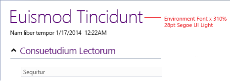
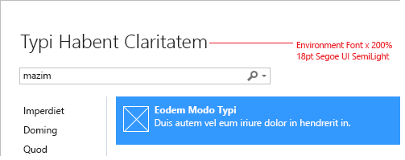
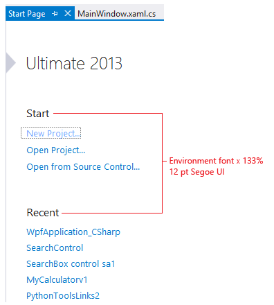
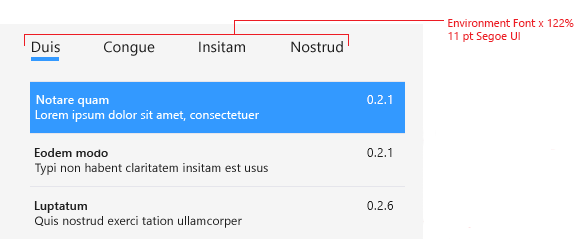
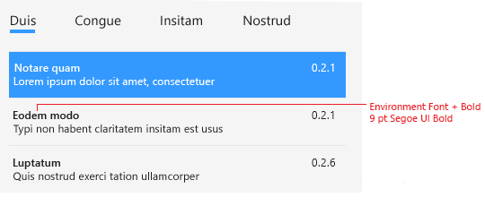
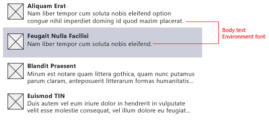

# <a name="fonts-and-formatting-for-visual-studio"></a>Visual Studio のフォントと書式設定
## <a name="the-environment-font"></a><a name="BKMK_TheEnvironmentFont"></a>環境フォント
 Visual Studio 内のすべてのフォントは、カスタマイズのためにユーザーに公開する必要があります。 これは主に、 **[ツール] > [オプション]** ダイアログの **[フォントおよび色]** ページを使用して行います。 フォント設定には、主に次の 3 つのカテゴリがあります。

- **環境フォント** - IDE (統合開発環境) 用のプライマリ フォントで、ダイアログ、メニュー、ツール ウィンドウ、ドキュメント ウィンドウなど、すべてのインターフェイス要素に使用されます。 既定では、環境フォントは、現在のバージョンの Windows では 9 ポイントの Segoe UI で表示されるシステム フォントに関連付けられています。 すべてのインターフェイス要素に 1 つのフォントを使用すると、IDE 全体で一貫したフォントの外観を確保できます。

- **テキスト エディター** - コードやその他のテキストベース エディターに表出する要素は、 **[ツール] > [オプション]** の [テキスト エディター] ページでカスタマイズできます。

- **特定のコレクション** - ユーザーによるインターフェイス要素のカスタマイズを提供するデザイナー ウィンドウでは、そのデザイン サーフェイスに固有のフォントを、 **[ツール] > [オプション]** にある独自の設定ページで公開することができます。

### <a name="editor-font-customization-and-resizing"></a>エディターのフォントのカスタマイズとサイズ変更
 一般的なユーザー インターフェイスとは別に、ユーザーが自分の好みに合わせてエディター内でテキストの拡大縮小や色の変更を行うことはよくあります。 環境フォントは、エディターやデザイナー内で、またはそれらの一部として表示される可能性がある要素で使用されるため、これらのフォント分類のいずれかが変更されたときに予想される動作に注意することは重要です。

 エディターに表示されるが *コンテンツ* の一部ではない UI 要素を作成するときは、要素のサイズを変更しても動作が予測できるよう、テキスト フォントではなく環境フォントを使用することが重要です。

1. エディター内のコード テキストについては、コード テキストのフォント設定でサイズを変更し、エディター テキストのズームレベルに応答します。

2. インターフェイスの他のすべての要素は、環境のフォント設定に関連付けられて環境のグローバルな変更に応答するようにしします。 たとえば、次のようなものが挙げられます。

    - コンテキスト メニュー内のテキスト

    - エディターの表示要素内のテキスト (電球メニューのテキスト、クイック検索エディター ペイン、ナビゲーション ペインなど)

    - ダイアログ ボックス内のラベル テキスト ( **[フォルダーを指定して検索]** や **[リファクター]** など)

### <a name="accessing-the-environment-font"></a>環境フォントへのアクセス
 ネイティブまたは WinForms コードで、環境フォントには、`SID_SUIHostLocale` サービスからインターフェイスをクエリした後に `IUIHostLocale::GetDialogFont` メソッドを呼び出してアクセスできます。

 Windows Presentation Foundation (WPF) の場合、ダイアログ ウィンドウ クラスは、WPF の `Window` クラスではなくシェルの `DialogWindow` クラスから派生させます。

 XAML では、コードは次のようになります。

```xaml
<ui:DialogWindow
    x:Class"MyNameSpace.MyWindow"
    xmlns="http://schemas.microsoft.com/winfx/2006/xaml/presentation"
    xmlns:s="http://schemas.microsoft.com/winfx/2006/xaml"
    xmlns:ui="clr-namespace:Microsoft.VisualStudio.PlatformUI;assembly=Microsoft.VisualStudio.Shell.11.0"
    ShowInTaskbar="False"
    WindowStartupLocation="CenterOwner"
    Title="My Dialog">
</ui:DialogWindow>
```

分離コード:

```csharp
internal partial class WebConfigModificationWindow : DialogWindow
{
}
```

 (`Microsoft.VisualStudio.Shell.11.0` は、MPF DLL の現在のバージョンに置き換えます。)

 ダイアログを表示するには、クラスの "`ShowModal()`" を `ShowDialog()` よりも優先して呼び出します。 `ShowModal()` は、正しいモーダル状態をシェルで設定し、親ウィンドウなどの中でダイアログが中央に位置するようにします。

 コードは次のとおりです。

```csharp
MyWindow window = new MyWindow();
window.ShowModal()
```

 `ShowModal` は bool? (null 許容ブール値) を `DialogResult` と共に返します (後者は必要に応じて使用できます)。 ダイアログが **[OK]** で閉じられた場合、戻り値は true です。

 ダイアログではなく、その独自の `HwndSource` でホストされる何らかの WPF UI (ポップアップ ウィンドウや、Win32/WinForms 親ウィンドウの WPF 子ウィンドウなど) を表示する必要がある場合、WPF 要素のルート要素で `FontFamily` および `FontSize` を設定することが必要になります (メイン ウィンドウのプロパティはシェルによって設定されますが、`HWND` を越えて継承されることはありません)。 次のようにして、シェルが提供するリソースにプロパティをバインドできます。

```xaml
<Setter Property="FontFamily" Value="{DynamicResource VsFont.EnvironmentFontFamily}" />
<Setter Property="FontSize" Value="{DynamicResource VsFont.EnvironmentFontSize}" />
```

### <a name="formatting-scalingbolding-reference"></a><a name="BKMK_Formatting"></a>書式設定 (拡大縮小/太字) 参照
 一部のダイアログでは、特定のテキストを太字または環境フォントと異なるサイズにする必要があります。 以前は、環境フォントよりも大きいフォントを "`environment font +2`" のようにコード化していました。 提供されているコード スニペットを使用すると、高 DPI モニターがサポートされ、表示テキストが常に正しいサイズと太さ (細字や準細字など) で表示されるようになります。

> [!NOTE]
> 書式設定を適用する前に、「[テキスト スタイル](../../extensibility/ux-guidelines/fonts-and-formatting-for-visual-studio.md#BKMK_TextStyle)」に記載のガイダンスに従っていることを確認してください。**

 環境フォントを拡大縮小するには、示されているように TextBlock または Label のスタイルを設定します。 これらの各コード スニペットを適切に使用すると、適切なサイズと太さのバリエーションを含む正しいフォントが生成されます。

 "`vsui`" は名前空間 `Microsoft.VisualStudio.Shell` への参照です。

```xaml
xmlns:vsui="clr-namespace:Microsoft.VisualStudio.Shell;assembly=Microsoft.VisualStudio.Shell.14.0"
```

#### <a name="375-environment-font--light"></a>375% 環境フォント + 細字

**表示:** 34 ポイント Segoe UI Light

::: moniker range="vs-2017"

**用途:** (まれ) 独自ブランド UI (スタート ページなど)

::: moniker-end

::: moniker range=">=vs-2019"

**用途:** (まれ) 独自ブランド UI

::: moniker-end

**手続き型コード:** `textBlock` は以前に定義した TextBlock、`label` は以前に定義した Label:

```csharp
textBlock.SetResourceReference(TextBlock.StyleProperty,  
        VsResourceKeys.TextBlockEnvironment375PercentFontSizeStyleKey); 
label.SetResourceReference(Label.StyleProperty,  
        VsResourceKeys.LabelEnvironment375PercentFontSizeStyleKey);
```

**XAML:** 次のように、TextBlock または Label のスタイルを設定します。

```xaml
<TextBlock Style="{DynamicResource {x:Static vsui:VsResourceKeys.TextBlockEnvironment375PercentFontSizeStyleKey}}">TextBlock: 375 Percent Scaling</TextBlock> 
<Label Style="{DynamicResource {x:Static vsui:VsResourceKeys.LabelEnvironment375PercentFontSizeStyleKey}}">Label: 375 Percent Scaling</Label>
```

#### <a name="310-environment-font--light"></a>310% 環境フォント + 細字
 **表示:** 28 ポイント Segoe UI Light **用途:** 大きい主要なダイアログのタイトル、レポートの主見出し

 **手続き型コード:** `textBlock` は以前に定義した TextBlock、`label` は以前に定義した Label:

```csharp
textBlock.SetResourceReference(TextBlock.StyleProperty,  
        VsResourceKeys.TextBlockEnvironment310PercentFontSizeStyleKey); 
label.SetResourceReference(Label.StyleProperty,  
        VsResourceKeys.LabelEnvironment310PercentFontSizeStyleKey);
```

 **XAML:** 次のように、TextBlock または Label のスタイルを設定します。

```xaml
<TextBlock Style="{DynamicResource {x:Static vsui:VsResourceKeys.TextBlockEnvironment310PercentFontSizeStyleKey}}">TextBlock: 310 Percent Scaling</TextBlock> 
<Label Style="{DynamicResource {x:Static vsui:VsResourceKeys.LabelEnvironment310PercentFontSizeStyleKey}}">Label: 310 Percent Scaling</Label>
```

#### <a name="200-environment-font--semilight"></a>200% 環境フォント + 準細字
 **表示:** 18 ポイント Segoe UI Semilight **用途:** 小見出し、中ぐらいか小さいダイアログのタイトル

 **手続き型コード:** `textBlock` は以前に定義した TextBlock、`label` は以前に定義した Label:

```csharp
textBlock.SetResourceReference(TextBlock.StyleProperty,  
        VsResourceKeys.TextBlockEnvironment200PercentFontSizeStyleKey); 
label.SetResourceReference(Label.StyleProperty,  
        VsResourceKeys.LabelEnvironment200PercentFontSizeStyleKey);
```

 **XAML:** 次のように、TextBlock または Label のスタイルを設定します:

```xaml
<TextBlock Style="{DynamicResource {x:Static vsui:VsResourceKeys.TextBlockEnvironment200PercentFontSizeStyleKey}}">TextBlock: 200 Percent Scaling</TextBlock> 
<Label Style="{DynamicResource {x:Static vsui:VsResourceKeys.LabelEnvironment200PercentFontSizeStyleKey}}">Label: 200 Percent Scaling</Label>
```

#### <a name="155-environment-font"></a>155% 環境フォント
 **表示:** 14 ポイント Segoe UI **用途:** ドキュメント ウェル UI またはレポートのセクション見出し

 **手続き型コード:** `textBlock` は以前に定義した TextBlock、`label` は以前に定義した Label:

```csharp
textBlock.SetResourceReference(TextBlock.StyleProperty,  
        VsResourceKeys.TextBlockEnvironment155PercentFontSizeStyleKey); 
label.SetResourceReference(Label.StyleProperty,  
        VsResourceKeys.LabelEnvironment155PercentFontSizeStyleKey);
```

 **XAML:** 次のように、TextBlock または Label のスタイルを設定します:

```xaml
<TextBlock Style="{DynamicResource {x:Static vsui:VsResourceKeys.TextBlockEnvironment155PercentFontSizeStyleKey}}">TextBlock: 155 Percent Scaling</TextBlock> 
<Label Style="{DynamicResource {x:Static vsui:VsResourceKeys.LabelEnvironment155PercentFontSizeStyleKey}}">Label: 155 Percent Scaling</Label>
```

#### <a name="133-environment-font"></a>133% 環境フォント
 **表示:** 12 ポイント Segoe UI **用途:** 主要なダイアログやドキュメント ウェル UI の比較的小さな小見出し

 **手続き型コード:** `textBlock` は以前に定義した TextBlock、`label` は以前に定義した Label:

```csharp
textBlock.SetResourceReference(TextBlock.StyleProperty,  
        VsResourceKeys.TextBlockEnvironment133PercentFontSizeStyleKey); 
label.SetResourceReference(Label.StyleProperty,  
        VsResourceKeys.LabelEnvironment133PercentFontSizeStyleKey);
```

 **XAML:** 次のように、TextBlock または Label のスタイルを設定します:

```xaml
<TextBlock Style="{DynamicResource {x:Static vsui:VsResourceKeys.TextBlockEnvironment133PercentFontSizeStyleKey}}">TextBlock: 133 Percent Scaling</TextBlock> 
<Label Style="{DynamicResource {x:Static vsui:VsResourceKeys.LabelEnvironment133PercentFontSizeStyleKey}}">Label: 133 Percent Scaling</Label>
```

#### <a name="122-environment-font"></a>122% 環境フォント
 **表示:** 11 ポイント Segoe UI **用途:** 主要なダイアログのセクション見出し、ツリー ビューのトップ ノード、縦方向のタブ ナビゲーション

 **手続き型コード:** `textBlock` は以前に定義した TextBlock、`label` は以前に定義した Label:

```csharp
textBlock.SetResourceReference(TextBlock.StyleProperty,  
        VsResourceKeys.TextBlockEnvironment122PercentFontSizeStyleKey); 
label.SetResourceReference(Label.StyleProperty,  
        VsResourceKeys.LabelEnvironment122PercentFontSizeStyleKey);
```

 **XAML:** 次のように、TextBlock または Label のスタイルを設定します:

```xaml
<TextBlock Style="{DynamicResource {x:Static vsui:VsResourceKeys.TextBlockEnvironment122PercentFontSizeStyleKey}}">TextBlock: 122 Percent Scaling</TextBlock> 
<Label Style="{DynamicResource {x:Static vsui:VsResourceKeys.LabelEnvironment122PercentFontSizeStyleKey}}">Label: 122 Percent Scaling</Label>
```

#### <a name="environment-font--bold"></a>環境フォント + 太字
 **表示:** 太字 9 ポイント Segoe UI **用途:** 主要なダイアログ、レポート、およびドキュメント ウェル UI のラベルと小見出し

 **手続き型コード:** `textBlock` は以前に定義した TextBlock、`label` は以前に定義した Label:

```csharp
textBlock.SetResourceReference(TextBlock.StyleProperty,  
        VsResourceKeys.TextBlockEnvironmentBoldStyleKey); 
label.SetResourceReference(Label.StyleProperty,  
        VsResourceKeys.LabelEnvironmentBoldStyleKey);
```

 **XAML:** 次のように、TextBlock または Label のスタイルを設定します:

```xaml
<TextBlock Style="{DynamicResource {x:Static vsui:VsResourceKeys.TextBlockEnvironmentBoldStyleKey}}"> Bold TextBlock</TextBlock> 
<Label Style="{DynamicResource {x:Static vsui:VsResourceKeys.LabelEnvironmentBoldStyleKey}}"> Bold Label</Label>
```

### <a name="localizable-styles"></a>ローカライズ可能なスタイル
 ローカライザーは、東アジア言語のテキストから太字を削除するなど、さまざまなロケールのフォント スタイルを変更する必要に迫られる場合があります。 フォント スタイルのローカライズを可能にするには、スタイルが .resx ファイル内になければなりません。 これを実現した上で、Visual Studio のフォーム デザイナーでもフォント スタイルを編集するには、デザイン時にフォント スタイルを明示的に設定するのが最良の方法です。 これにより完全なフォント オブジェクトが作成されるため、親フォントの継承が途切れるように思われるかもしれませんが、フォントを設定するために使用されるのは FontStyle プロパティだけです。

 解決法は、ダイアログ フォームの `FontChanged` イベントをフックすることです。 `FontChanged` イベントでは、すべてのコントロールについて順次、そのフォントが設定されているかどうかを確認します。 設定されている場合、フォームのフォントとコントロールの以前のフォント スタイルに基づいて新しいフォントに変更します。 コードでのこの例は次のとおりです。

```csharp
private void Form1_FontChanged(object sender, System.EventArgs e)
{
          SetFontStyles();
}

/// <summary>
/// SetFontStyles - This function will iterate all controls on a page
/// and recreate their font with the desired fontstyle.
/// It should be called in the OnFontChanged handler (and also in the constructor
/// in case the IUIService is not available so OnFontChange doesn't fire).
/// This way, when the VS shell font is given to us the controls that have
/// a different style for the font (bolded for example) will recreate their font
/// and use the VS shell font but with a style variation (bolded ...).
/// </summary>
protected void SetFontStyles()
{
     SetFontStyles(this, this, this.Font);
}

protected static void SetFontStyles(Control topControl, Control parent, Font referenceFont)
{
     foreach(Control c in parent.Controls)
     {
          if (c.Controls != null && c.Controls.Count > 0) {
               SetFontStyles(topControl, c, referenceFont);
          }
          if (c.Font != topControl.Font) {
               c.Font = new Font(referenceFont, c.Font.Style);
          }
     }
}
```

 このコードを使用すると、フォームのフォントが更新されたときにコントロールのフォントも更新されることが保証されます。 ダイアログで `IUIService` のインスタンスを取得できず、`FontChanged` イベントが発生しない可能性があるため、このメソッドは、フォームのコンストラクターからも呼び出す必要があります。 `FontChanged` をフックすると、ダイアログが既に開いている場合でも、ダイアログで新しいフォントを動的に選択できるようになります。

### <a name="testing-the-environment-font"></a>環境フォントのテスト
 UI で環境フォントを使用しており、サイズ設定に適合していることを確認するには、 **[ツール] > [オプション] > [環境] > [フォントおよび色]** を開き、[設定の表示:] ドロップダウン メニュー下の [環境フォント] を選択します。

 ![[ツール] &gt; [オプション] ダイアログの [フォントおよび色] 設定](../../extensibility/ux-guidelines/media/0201-a_optionsfonts.png "0201-a_OptionsFonts")<br />[ツール] &gt; [オプション] ダイアログの [フォントおよび色] 設定

 フォントを、既定値とは大きく異なっているものに設定します。 どの UI が更新されないかを明らかにするには、"Times New Roman" などのセリフ体フォントを選択し、非常に大きなサイズを設定します。 次に、UI をテストして、環境に適合していることを確認します。 ライセンス ダイアログを使用した例を次に示します。

 <br />環境フォントに適合していない UI テキストの例

 この場合、"User Information" と "Product Information" はフォントが適合していません。 これは、デザインで明示的に選択する場合もありますが、レッドライン仕様の一部として明示的フォントが指定されていない場合はバグである可能性があります。

 フォントを再設定するには、 **[ツール] > [オプション] > [環境] > [フォントおよび色]** で [既定値を使用] をクリックします。

## <a name="text-style"></a><a name="BKMK_TextStyle"></a>テキストのスタイル
 テキストのスタイルとは、フォント サイズ、太さ、文字種のことです。 実装ガイダンスについては、「[環境フォント](../../extensibility/ux-guidelines/fonts-and-formatting-for-visual-studio.md#BKMK_TheEnvironmentFont)」を参照してください。

### <a name="text-casing"></a>テキストの文字種

#### <a name="all-caps"></a>すべて大文字
 "すべて大文字" は、Visual Studio のタイトルまたはラベルには使用しないでください。

#### <a name="all-lowercase"></a>すべて小文字
 "すべて小文字" は、Visual Studio のタイトルまたはラベルには使用しないでください。

#### <a name="sentence-and-title-case"></a>"文の先頭文字を大文字にする" と "各単語の先頭文字を大文字にする"
 Visual Studio のテキストでは、状況に応じて、"各単語の先頭文字を大文字にする" と "文の先頭文字を大文字にする" のどちらかを使用する必要があります。

|"各単語の先頭文字を大文字にする" を使用するもの|"文の先頭文字を大文字にする" を使用するもの|
|-------------------------|----------------------------|
|ダイアログ タイトル|ラベル|
|グループ ボックス|チェック ボックス|
|メニュー項目|ラジオ ボタン|
|コンテキスト メニュー項目|リスト ボックス項目|
|ボタン|ステータス バー|
|表のラベル||
|列見出し||
|ヒント||

##### <a name="title-case"></a>先頭文字が大文字
 "各単語の先頭文字を大文字にする" は、語句内のほとんどまたは全部の単語の先頭文字を大文字にするスタイルです。 Visual Studio では、以下を含む多くの項目で "各単語の先頭文字を大文字にする" を使用します。

- **ツールヒント。** 例: "Preview Selected Items"

- **列見出し。** 例: "System Response"

- **メニュー項目。** 例: "Save All"

  "各単語の先頭文字を大文字にする" を使用する場合、単語の先頭文字を大文字にするか、それとも小文字のままにするかに関しては、次のガイドラインがあります。

|大文字|説明と例|
|---------------|---------------------------|
|すべての名詞||
|すべての動詞|"Is" や "to be" のその他の形式を含む|
|すべての副詞|"Than" や "When" を含む|
|すべての形容詞|"This" や "That" を含む|
|すべての代名詞|所有格の "Its" や、代名詞 "it" と動詞 "is" の縮約形である "It's" を含む|
|最初と最後の単語 (品詞不問)||
|動詞句の一部である前置詞|"Closing Out All Windows" または "Shutting Down the System"|
|頭字語のすべての文字|HTML、XML、URL、IDE、RGB|
|複合語の 2 番目の単語 (名詞または固有形容詞の場合、あるいは単語の重みが等しい場合)|Cross-Reference、Pre-Microsoft Software、Read/Write Access、Run-Time|

|小文字|例|
|---------------|--------------|
|複合語の 2 番目の単語 (別の品詞であるか、最初の単語を修飾する分詞である場合)|How-to、Take-off|
|冠詞 (タイトルの最初の単語である場合を除く)|a、an、the|
|等位接続詞|and、but、for、nor、or|
|動詞句の外側に 4 文字以下の単語がある前置詞|into、onto、as for、out of、on top of|
|不定詞句で使用する場合の "To"|"How to Format Your Hard Disk"|

##### <a name="sentence-case"></a>文の先頭文字を大文字にする
 "文の先頭文字を大文字にする" は、文章を書くときの標準的な大文字小文字の使い分けであり、文の最初の単語と固有名詞の先頭文字、および代名詞 "I" のみを大文字にします。 一般には、"文の先頭文字を大文字にする" のほうが、世界中の読者にとって (内容を機械翻訳する場合は特に) 読みやすくなります。 "文の先頭文字を大文字にする" を使用するもの

1. **ステータス バーのメッセージ。** これらは単純で、短く、ステータス情報のみを提供します。 例: "Loading project file"

2. **その他すべての UI 要素。** ラベル、チェック ボックス、ラジオ ボタン、リスト ボックス項目など。 例: "Select all items in list"

### <a name="text-formatting"></a>テキストの書式設定
 Visual Studio 2013 の既定のテキスト書式設定は、[環境フォント](../../extensibility/ux-guidelines/fonts-and-formatting-for-visual-studio.md#BKMK_TheEnvironmentFont)によって制御されます。 このサービスは、IDE (統合開発環境) 全体でフォントの外観の一貫性を保つために役立ち、ユーザー エクスペリエンスの一貫性を保証するために使用する必要があります。

 Visual Studio フォント サービスで使用される既定のサイズは Windows と同じ 9 ポイント表示です。

 環境フォントに書式を適用できます。 このトピックでは、スタイルを使用する方法と場面について説明します。 実装に関する情報は、「[環境フォント](../../extensibility/ux-guidelines/fonts-and-formatting-for-visual-studio.md#BKMK_TheEnvironmentFont)」を参照してください。

#### <a name="bold-text"></a>太字テキスト
 太字のテキストは Visual Studio ではあまり使用されず、次の目的に限定する必要があります。

- 質問ラベル (ウィザード)

- ソリューション エクスプローラーでアクティブなプロジェクトを示す

- オーバーライドされた値 (プロパティ ツール ウィンドウ)

- 特定のイベント (Visual Basic エディターのドロップダウン リスト)

- サーバーによって生成されたコンテンツ (Web ページのドキュメント アウトライン)

- セクション見出し (複雑なダイアログまたはデザイナー UI)

#### <a name="italics"></a>斜体
 Visual Studio では、斜体または太字斜体のテキストは使用しません。

#### <a name="color"></a>Color

- 青色はハイパーリンク (ナビゲーションとコマンド実行) 用に予約されています。オリエンテーションには使用しないでください。

- 次の目的で、(環境フォント x 155% 以上の) 大きな見出しに色を付けることができます。

  - 主要な Visual Studio UI を視覚的に強調する

  - 特定の領域に注意を引く

  - 標準の濃い灰色/黒の環境テキスト色から目立たせる

- 見出しの色には、既存の Visual Studio ブランド カラー (主に、メイン紫の #FF68217A) を使用します。

- 見出しで色を使用するときは、コントラスト比や、アクセシビリティに関するその他の考慮事項など、[色に関する Windows のガイドライン](/windows/desktop/uxguide/vis-color)に従う必要があります。

### <a name="font-size"></a>フォント サイズ
 Visual Studio の UI デザインの特徴は、明るく、余白が多い外観です。 可能な場合、クロムとタイトル バーは縮小または削除されます。 情報の密度は Visual Studio の要件ですが、文字体裁も重要であり、広めの行間隔と、フォントのサイズおよび太さのバリエーションに重点が置かれています。

 以下の表では、Visual Studio で使用される表示フォントについて、デザインの詳細と視覚的な例を示しています。 一部の表示フォントのバリエーションでは、準細字 (Semilight) や細字 (Light) のように、サイズと太さの両方が外観に組み込まれています。

 すべての表示フォント用の実装コード スニペットは、「[書式設定 (倍率/太字) のリファレンス](../../extensibility/ux-guidelines/fonts-and-formatting-for-visual-studio.md#BKMK_Formatting)」にあります。

#### <a name="375-environment-font--light"></a>375% 環境フォント + 細字

|使用方法|外観|
|-|-|
|**用途:** まれ。 独自ブランド UI のみ。<br /><br /> **推奨事項:**<br /><br /> -   "文の先頭文字を大文字にする" を使用する<br />-   太さは常に細字を使用する<br /><br /> **禁止事項:**<br /><br /> -   スタート ページなどの主要 UI 以外の UI に使用する<br />-   太字、斜体、または太字斜体<br />-   本文のテキストに使用する<br />-   ツール ウィンドウで使用する|**表示:** 34 ポイント Segoe UI Light<br /><br /> **表示例:**<br /><br /> *現在使用されていません。Visual Studio 2017 のスタート ページで使用される場合があります。*|

#### <a name="310-environment-font--light"></a>310% 環境フォント + 細字

::: moniker range="vs-2017"

|使用方法|外観|
|-|-|
|**使用法:**<br /><br /> -   主要ダイアログ内の比較的大きな見出し<br />-   レポートの主見出し<br /><br /> **推奨事項:**<br /><br /> -   "文の先頭文字を大文字にする" を使用する<br />-   太さは常に細字を使用する<br /><br /> **禁止事項:**<br /><br /> -   スタート ページなどの主要 UI 以外の UI に使用する<br />-   太字、斜体、または太字斜体<br />-   本文のテキストに使用する<br />-   ツール ウィンドウで使用する|**表示:** 28 ポイント Segoe UI Light<br /><br /> **表示例:**<br /><br /> |

::: moniker-end

::: moniker range=">=vs-2019"

|使用方法|外観|
|-|-|
|**使用法:**<br /><br /> -   主要ダイアログ内の比較的大きな見出し<br />-   レポートの主見出し<br /><br /> **推奨事項:**<br /><br /> -   "文の先頭文字を大文字にする" を使用する<br />-   太さは常に細字を使用する<br /><br /> **禁止事項:**<br /><br /> -   主要 UI 以外の UI に使用する<br />-   太字、斜体、または太字斜体<br />-   本文のテキストに使用する<br />-   ツール ウィンドウで使用する|**表示:** 28 ポイント Segoe UI Light<br /><br /> **表示例:**<br /><br /> |

::: moniker-end

#### <a name="200-environment-font--semilight"></a>200% 環境フォント + 準細字

|使用方法|外観|
|-|-|
|**使用法:**<br /><br /> -   小見出し<br />-   小さいか中ぐらいのダイアログのタイトル<br /><br /> **推奨事項:**<br /><br /> -   "文の先頭文字を大文字にする" を使用する<br />-   太さは常に準細字を使用する<br /><br /> **禁止事項:**<br /><br /> -   太字、斜体、または太字斜体<br />-   本文のテキストに使用する<br />-   ツール ウィンドウで使用する|**表示:** 18 ポイント Segoe UI Semillight<br /><br /> **表示例:**<br /><br /> |

#### <a name="155-environment-font"></a>155% 環境フォント

|使用方法|外観|
|-|-|
|**使用法:**<br /><br /> -   ドキュメント ウェル UI のセクション見出し<br />-   レポート<br /><br /> **推奨事項:** "文の先頭文字を大文字にする" を使用する<br /><br /> **禁止事項:**<br /><br /> -   太字、斜体、または太字斜体<br />-   本文のテキストに使用する<br />-   標準の Visual Studio コントロールで使用する<br />-   ツール ウィンドウで使用する|**表示:** 14 ポイント Segoe UI<br /><br /> **表示例:**<br /><br /> |

#### <a name="133-environment-font"></a>133% 環境フォント

|使用方法|外観|
|-|-|
|**使用法:**<br /><br /> -   主要ダイアログの比較的小さな小見出し<br />-   ドキュメント ウェル UI の比較的小さな小見出し<br /><br /> **推奨事項:** "文の先頭文字を大文字にする" を使用する<br /><br /> **禁止事項:**<br /><br /> -   太字、斜体、または太字斜体<br />-   本文のテキストに使用する<br />-   標準の Visual Studio コントロールで使用する<br />-   ツール ウィンドウで使用する|**表示:** 12 ポイント Segoe UI<br /><br /> **表示例:**<br /><br /> |

#### <a name="122-environment-font"></a>122% 環境フォント

|使用方法|外観|
|-|-|
|**使用法:**<br /><br /> -   主要ダイアログのセクション見出し<br />-   ツリー ビューのトップ ノード<br />-   縦方向のタブ ナビゲーション<br /><br /> **推奨事項:** "文の先頭文字を大文字にする" を使用する<br /><br /> **禁止事項:**<br /><br /> -   太字、斜体、または太字斜体<br />-   本文のテキストに使用する<br />-   標準の Visual Studio コントロールで使用する<br />-   ツール ウィンドウで使用する|**表示:** 11 ポイント Segoe UI<br /><br /> **表示例:**<br /><br /> |

#### <a name="environment-font--bold"></a>環境フォント + 太字

|使用方法|外観|
|-|-|
|**使用法:**<br /><br /> -   主要ダイアログのラベルと小見出し<br />-   レポートのラベルと小見出し<br />-   ドキュメント ウェル UI のラベルと小見出し<br /><br /> **推奨事項:**<br /><br /> -   "文の先頭文字を大文字にする" を使用する<br />-   太さは太字を使用する<br /><br /> **禁止事項:**<br /><br /> -   斜体または太字斜体<br />-   本文のテキストに使用する<br />-   標準の Visual Studio コントロールで使用する<br />-   ツール ウィンドウで使用する|**表示:** 太字 9 ポイント Segoe UI<br /><br /> **表示例:**<br /><br /> |

#### <a name="environment-font"></a>環境フォント

|使用方法|外観|
|-|-|
|**用途:** その他のすべてのテキスト<br /><br /> **推奨事項:** "文の先頭文字を大文字にする" を使用する<br /><br /> **禁止事項:** 斜体または太字斜体|**表示:** 9 ポイント Segoe UI<br /><br /> **表示例:**<br /><br /> |

### <a name="padding-and-spacing"></a>パディングと間隔
 見出しの周囲には、適度な強調のためのスペースが必要です。 このスペースはポイント サイズによって異なり、環境フォントの水平規則やテキスト行など、見出しの近くにある他の要素によっても異なります。

- 見出し自体の理想的なパディングは、文字の高さのスペースの 90% です。 たとえば、28 ポイント Segoe UI Light の見出しは文字の高さが 26 ポイントであるため、パディングは約 23 ポイント (約 31 ピクセル) にします。

- 見出しの周囲の最小スペースは、文字の高さの 50% にします。 罫線や、その他のぴったり収めるための要素が見出しに付属している場合は、スペースを減らすことができます。

- 太字の環境フォント テキストは、既定の行の高さの行間とパディングに従う必要があります。

## <a name="see-also"></a>関連項目

- [フォント (Windows)](/windows/desktop/uxguide/vis-fonts)
- [ユーザー インターフェイスのテキスト (Windows)](/windows/desktop/uxguide/text-ui)
