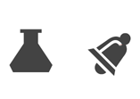

# イメージと Visual Studio のアイコン
[!INCLUDE[vs2017banner](../../code-quality/includes/vs2017banner.md)]

##   Visual Studio でのイメージの使用  
 アートワークを作成する前に考慮で 1,000 社を超えるイメージの使用、 [Visual Studio Image Library](http://www.microsoft.com/en-my/download/details.aspx?id=35825)します。  
  
### イメージの種類  
  
-   **アイコン**します。 コマンド、階層、テンプレート、およびなどに表示される小さいイメージ。 Visual Studio で使用される既定のアイコンのサイズは、16 x 16 PNG です。 イメージのサービスによって自動的に生成されるアイコンは、HDPI サポートについては、XAML 形式を生成します。  
  
     **注:** ] メニューの [システムのイメージが使用されますが、すべてのコマンドのアイコンを作成しません。 参照してください [メニューと Visual Studio のコマンド](../../extensibility/ux-guidelines/menus-and-commands-for-visual-studio.md) をコマンドがアイコンを取得するかどうかを確認します。  
  
-   **縮小表示します。** 新しいプロジェクト] ダイアログなどのダイアログ ボックスの [プレビュー] 領域で使用する画像。  
  
-   **ダイアログのイメージです。** ダイアログ ボックスまたはウィザードでは、わかりやすいグラフィックスまたはメッセージ インジケーターとして表示される画像。 頻度の低いと難しい概念を説明またはユーザーの注意 (アラート、警告) を確保するために必要な場合にのみを使用します。  
  
-   **アニメーション画像です。** 進行状況インジケーター、ステータス バー、および操作のダイアログ ボックスで使用されます。  
  
-   **カーソルです。** オブジェクトが破棄される可能性がありには、マウスを使用して、操作を許可するかどうかを示すために使用されます。  
  
##   アイコンの設計  
  
### 概要  
 Visual Studio では、クリーンなジオメトリと正または負 (明/暗) の 50/50 残高および理解できるものの直接のメタファを使用して、モダン スタイル アイコンを使用します。 重要なアイコンの設計では、わかりやすくするため、単純化、およびコンテキストを中心とを指しています。  
  
-   **わかりやすくするため:** の意味と個性アイコンは、コア メタファに注目します。  
  
-   **簡素化:** の中核的な意味をアイコンに減らす – だけ必要な要素と省いた間でテーマを取得します。  
  
-   **コンテキスト:** どの要素を構成して、アイコンの中核となるメタファを決定するときに重要になる概念開発中にアイコンのロールのすべての側面を検討してください。  
  
 アイコンには、多数を回避する設計ポイントがあります。  
  
-   該当する場合を除く、UI 要素を示すアイコンを使用しないでください。 UI 要素は一般的な明確でも一意より抽象的またはシンボルのアプローチを選択します。  
  
-   ドキュメント、フォルダー、矢印、および、この虫眼鏡のような共通の要素を過剰に使用しません。 アイコンの意味に不可欠な場合にのみ、このような要素を使用します。 たとえば、右向きの虫眼鏡が検索のみを示す必要がありますを参照し、検索します。  
  
-   一部のレガシ アイコン要素は、パースペクティブの使用を管理、作成しないで新しいアイコンがある観点を持つ要素がないとわかりやすくするためがない限り、ください。  
  
-   アイコンに大量の情報を詰め込むしません。 簡単に認識または認識可能なシンボルとして得られたできる単純なイメージは過度に複雑なイメージよりもはるかに便利です。 アイコンは、すべてのシナリオを判断できません。  
  
### アイコンの作成  
  
#### 開発の概念  
 Visual Studio では、さまざまなアイコンの種類がその UI 内には。 開発中に、アイコンの種類を慎重に検討します。 アイコン要素の不明なまたは珍しいことで UI オブジェクトを使用しないでください。 スマート タグ] アイコンをこのような場合は、シンボリック リンクのようにできます。 左側のタグが抽象の意味は、右側、漠然とした UI ベースのバージョンよりもわかりやすいことに注意してください。  
  
|||  
|-|-|  
|**シンボルの画像の正しい使用**|**シンボルの画像の不適切な使用**|  
|![正しい [スマート タグ] アイコン](../Image/0404-01_SmartTagCorrect.png "0404-01_SmartTagCorrect")|![正しくない [スマート タグ] アイコン](../Image/0404-02_SmartTagIncorrect.png "0404-02_SmartTagIncorrect")|  
  
 標準的でわかりやすいの UI 要素がうまくアイコンにもインスタンスがあります。 ウィンドウはその一例を追加します。  
  
|||  
|-|-|  
|**アイコンの正しい UI 要素**|**アイコンの正しくない UI 要素**|  
|![正しい [ウィンドウの追加] アイコン](../Image/0404-03_AddWindowCorrect.png "0404-03_AddWindowCorrect")|![正しくない [ウィンドウの追加] アイコン](../Image/0404-04_AddWindowIncorrect.png "0404-04_AddWindowIncorrect")|  
  
 アイコンの意味するために不可欠である場合を除き、基本要素として、ドキュメントを使用しないでください。 せず、ドキュメント (以下)、意味の文書に追加の要素は、一方の更新で、ドキュメント要素は意味を通信するために必要ないない失われます。  
  
|||  
|-|-|  
|**[ドキュメント] アイコンの正しい使用**|**[ドキュメント] アイコンの不適切な使用**|  
|![正しい [ドキュメント] アイコン](../Image/0404-05_DocumentIconCorrect.png "0404-05_DocumentIconCorrect")|![正しくない [ドキュメント] アイコン](../Image/0404-06_DocumentIconIncorrect.png "0404-06_DocumentIconIncorrect")|  
  
 "Show"の概念は、最適なものが表示されているなどと同様に、[すべてのファイルの例を示すアイコンで表示する必要があります。 リソース ビューの例など、必要に応じて、"view"の概念を示すためには、レンズ メタファができる指定します。  
  
|||  
|-|-|  
|**[表示]**|**[表示]**|  
|||  
  
 右向きの表す・のみ検索ガラスのアイコンを拡大、検索、および参照します。 プラス記号またはマイナス記号を使用して、左向きのバリアントでの唯一のズームを表す/[縮小する必要があります。  
  
|||  
|-|-|  
|**[検索]**|**[拡大]**|  
|||  
  
 ツリー ビューでは、フォルダー アイコンと修飾子の両方使用されません。 有効な場合は、修飾子のみを使用します。  
  
|||  
|-|-|  
|**正しい [ツリー ビュー アイコン**|**正しくない [ツリー ビュー アイコン**|  
|![正しい [ツリー ビュー] アイコンと #40; 1 & #41 です。](../Image/0404-11_TreeViewCorrect1.png "0404-11_TreeViewCorrect1") |![正しくない [ツリー ビュー] アイコンと #40; 1 & #41 です。](../Image/0404-13_TreeViewIncorrect1.png "0404-13_TreeViewIncorrect1") |  
  
### スタイルの詳細  
  
#### レイアウト  
 標準の 16 × 16 のアイコンに示すようには、要素をスタックにします。  
  
   
  
 **16 x 16 のアイコンのレイアウト スタック**  
  
 状態通知の要素は、スタンドアロンのアイコンとして使用されています。 ただしを通知する必要がありますに重ねる base 要素など、タスクの完了のアイコンでコンテキストがあります。  
  
   
  
 **スタンドアロンの通知アイコン**  
  
 ![[タスクの完了] アイコン](../Image/0404-17_TaskComplete.png "0404-17_TaskComplete")  
  
 **タスクの完了] アイコン**  
  
 [プロジェクト] アイコンは、通常複数のサイズを含む .ico ファイルです。 ほとんどの 16 × 16 のアイコンには、同じ要素が含まれます。 32 x 32 のバージョンでは、詳細については、該当する場合、プロジェクトの種類を含むがあります。  
  
 ![Visual Studio での [プロジェクト] アイコン](../Image/0404-18_IconProjectThreeSizes.png "0404-18_IconProjectThreeSizes")  
  
 **16 x 16、32 x 32 の VB Windows コントロール ライブラリ プロジェクト アイコン**  
  
 ピクセル フレーム内のアイコンを中心にします。 方法が使用できない場合、アイコン、トップに戻ると、フレームの右に揃えます。  
  
   
  
 **ピクセル フレーム内で中央揃え] アイコン**  
  
   
  
 **一番上に配置されたアイコン、フレームの右**  
  
   
  
 **中央揃えで、フレームの先頭に配置されたアイコン**  
  
 最適な配置とのバランスを実現する障害アクション グリフでアイコンの基本要素をしないでください。 基本要素の上部にあるグリフが左を置きます。 別の要素を追加する場合は、配置とアイコンの分散を検討してください。  
  
|||  
|-|-|  
|**適切なアラインメントと残高**|**配置が正しくないと残高**|  
|||  
  
 要素を共有し、セットで使用されるアイコンのサイズのパリティを確認します。 不適切な組み合わせで、円と矢印はサイズ超過に注意してくださいし、一致しません。  
  
|||  
|-|-|  
|**適切なサイズのパリティ**|**サイズが正しくありませんパリティ**|  
|||  
  
 一貫性のある行とビジュアルの重みを使用します。 他のアイコンをサイド バイ サイドの比較を使用して作成するアイコンの比較を評価します。 16 x 16 の枠の使用が 15 x、またはより小さな 15 を使用しないでください。 負の値に正 (暗い光) の比率を 50/50 にする必要があります。  
  
|||  
|-|-|  
|**正しい負の値が正数比**|**不適切な負の値に正の比率**|  
|      ||  
  
 シンプルで同等の図形と補色角度を使用すると、要素の整合性を損なうことがなく、要素を作成します。 可能であれば、45 度または 90 度の角度を使用します。  
  
   
  
#### 透視投影  
 明確でわかりやすいアイコンを保持します。 パースペクティブと光の光源を使用しているために必要な場合にのみ使用します。 パースペクティブを使用するアイコンの要素では避ける必要があります、いくつかの要素はなしで認識されていません。 このような場合は、定型パースペクティブは、要素のわかりやすいようにを通信します。  
  
   
  
 **3 点透視投影**  
  
   
  
 **1 点透視投影**  
  
 ほとんどの要素に直接つながっている必要がありますか、右に傾いたします。  
  
   
  
 オブジェクトに必要なわかりやすくするためを追加する場合にのみ、光源を使用します。  
  
|||  
|-|-|  
|**正しい光源**|**正しくない光源**|  
|||  
  
 アウトラインを使用するは、読みやすさを向上させる場合にのみ、メタファのコミュニケーションを改善したりできます。 正の負の値 (暗い光) 残高を 50/50 にする必要があります。  
  
|||  
|-|-|  
|**アウトラインの正しい使用**|**アウトラインの不適切な使用**|  
|||  
  
#### アイコンの種類  
 **シェルおよびコマンド バー** アイコンは、次の要素のうちの 3 つ以内ので構成されています。 基数が 1 つ、修飾子を 1 つ、1 つの操作または 1 つの状態。  
  
   
  
 **シェルおよびコマンド バーのアイコンの例**  
  
 **ツール ウィンドウのコマンド バー** アイコンは、次の要素のうちの 3 つ以内ので構成されています。 基数が 1 つ、修飾子を 1 つ、1 つの操作または 1 つの状態。  
  
 ![[ツール] ウィンドウのコマンド バー アイコン](../Image/0404-39_ToolWindowCommandBarIcons.png "0404-39_ToolWindowCommandBarIcons")  
  
 **ツール ウィンドウのコマンド バーのアイコンの例**  
  
 **ツリー ビューの曖昧性解消子** アイコンは、次の要素のうちの 3 つ以内ので構成されています。 基数が 1 つ、修飾子を 1 つ、1 つの操作または 1 つの状態。  
  
   
  
 **ビューの曖昧性解消子のアイコンをツリーの例**  
  
 **値の状態に基づいた分類** アイコンは、次の状態で存在: アクティブ、無効になっている、アクティブおよび非アクティブな無効になっています。  
  
   
  
 **値の状態に基づいた分類アイコンの例**  
  
 **IntelliSense** アイコンは、次の要素のうちの 3 つ以内ので構成されています。 基数が 1 つ、1 つの修飾子、および 1 つの状態。  
  
   
  
 **IntelliSense アイコンの例**  
  
 **小規模な (16 x 16) プロジェクト** アイコンは以下の 2 つの要素を持つ必要があります: 1 つのベースと修飾子を 1 つです。  
  
     
  
 **小さな (16 x 16) プロジェクトのアイコンの例**  
  
 **(32 x 32) の大規模なプロジェクト** 、次の要素の 4 つ以下のアイコンで構成されます。 基数が 1 つ、1 ~ 2 修飾子、およびオーバーレイの 1 つの言語です。  
  
   
  
 **大規模な (32 x 32) プロジェクトのアイコンの例**  
  
### 運用環境の詳細  
 Windows Presentation Foundation (WPF) を使用して、すべての新しい UI 要素を作成する必要があり、WPF のすべての新しいアイコンが 32 ビット PNG 形式でなければなりません。 24 ビット PNG は、透過性をサポートしていませんし、したがっては推奨されませんアイコンのレガシ形式です。  
  
 96 DPI の解像度を保存します。  
  
#### ファイルの種類  
  
-   **32 ビット PNG:** アイコンの優先形式です。 単一のラスター (ピクセル) イメージを格納できるロスレス データの圧縮ファイル形式です。 32 ビットの PNG ファイルは、アルファ チャネル透明度、ガンマ補正とインター レースをサポートします。  
  
-   **32 ビット BMP:** 非 WPF コントロールです。 XP または high color とも呼ばれ、32 ビットの bmp ファイルは、RGB/A イメージ形式、アルファ チャネル透明 true カラー イメージです。 アルファ チャネルは、追加の (4) として、ビットマップ内では保存して Adobe Photoshop で指定した透過性のレイヤーの色チャネル。 黒の背景色は、クイックに対して視覚的な色深度を提供するすべての 32 ビット BMP ファイルにアートワークの実稼動中に追加されます。 この黒の背景色は、UI でアウト マスクされる領域を表します。  
  
-   **32 ビット ICO:** のプロジェクト アイコンと項目の追加。 すべての ICO ファイルは、32 ビットの場合は true。 カラー アルファ チャネル透明度 (RGB/A)。 ICO ファイルは、複数のサイズと色深度に格納するため Vista アイコンは 16 x 16、32 x 32、48 x 48、および 256 x 256 イメージのサイズを含む ICO 形式で多くの場合です。 Windows エクスプ ローラーで正しく表示するために ICO ファイル必要がある保存の一覧をイメージのサイズごとに 24 ビットと 8 ビットの色深度。  
  
-   **XAML:** のデザイン画面や Windows 装飾します。 XAML のアイコンは、拡大/縮小、回転、整理、および透過性をサポートするベクター ベースのイメージ ファイルです。 これらは、現在 Visual Studio では一般的ではありませんが、柔軟性のため普及しつつあります。  
  
-   **SVG**  
  
-   **24 ビット BMP:** Visual Studio のコマンド バーのです。 True 色の RGB 画像形式、24 ビット bmp ファイルは、マゼンタ (R = 255, G = 0, B = 255) を使用して透明度のレイヤーを非難アウト透過性レイヤーの色キーを作成するアイコン規則があります。 24 ビット BMP、背景色を使用してすべてのマゼンタ サーフェスが表示されます。  
  
-   **24 ビット GIF:** Visual Studio のコマンド バーのです。 透過性をサポートする true 色の RGB イメージ形式。 GIF ファイルは、ウィザードのアートワークや GIF アニメーションでよく使用されます。  
  
### アイコンの構築  
 Visual Studio で最も小さいアイコンのサイズは、16 x 16 です。 最大共通の使用はサイズが 32 × 32 です。 アイコンをデザインするときに、全体の 16 x 16、24 x 24、またはサイズが 32 × 32 フレームにいっぱいにしないことに注意してください。 読みやすい、統一されたアイコンの構築は、ユーザーの認識に不可欠です。 アイコンを構築するときに、次の点に準拠します。  
  
-   アイコンは、明快かつ一貫したわかりやすいものにする必要があります。  
  
-   状態通知の要素を 1 つのアイコンとして使用して、アイコンの基本要素の上に重ねることがお勧めします。 特定のコンテキストでは、基本要素と組み合わせて使用 status 要素が UI にあります。  
  
-   [プロジェクト] アイコンは、通常、いくつかのサイズを含む .ico ファイルです。 16 x 16、24 x 24、および 32 x 32 アイコンのみを更新しています。 ほとんどの 16 x 16、24 x 24 アイコンは、同じ要素が含まれます。 32 x 32 のアイコンには、詳細についてには、該当する場合は、プロジェクトの言語の種類などが含まれます。  
  
-   32 x 32 アイコンの基本要素は、2 ピクセルの線の太さを一般にあります。 1 または 2 ピクセルの太さは、詳細要素を使用できます。 特定するより適切な判断を使用します。  
  
-   16 x 16 の要素と 24 x 24 アイコンの間には、少なくとも 1 ピクセルのスペースがあります。 32 x 32 アイコンの間および修飾子と基本要素の要素間の 2 ピクセルの間隔を使用します。  
  
   
  
 **16 x 16、24 x 24、および 32 x 32 アイコンの要素間スペースのサイズ**  
  
#### 色およびユーザー補助機能  
 Visual Studio コンプライアンス ガイドラインでは、製品内のすべてのアイコンがカラーおよびコントラスト ユーザー補助に関する要件を渡すことが必要です。 アイコンの逆転、これを実現し、設計する際は注意してください、製品のプログラムを使用して逆はします。  
  
 Visual Studio のアイコンの色の使用に関する詳細については、次を参照してください。 [画像の色を使用して](../../extensibility/ux-guidelines/images-and-icons-for-visual-studio.md#BKMK_UsingColorInImages)します。  
  
##   画像の色を使用します。  
  
### 概要  
 Visual Studio でのアイコンは、主にモノクロです。 色が固有の情報を伝えるために予約されていると、装飾のことはありません。 色を使用します。  
  
-   アクションを示すために  
  
-   状態の通知をユーザーに警告するには  
  
-   言語への関連付けを指定するには  
  
-   IntelliSense 内のアイテムを区別するために  
  
### ユーザー補助  
 Visual Studio コンプライアンス ガイドラインでは、製品のパスにチェックインされたすべてのアイコンが、色、およびコントラストのユーザー補助に関する要件を使用することが必要です。 ビジュアルな言語のパレットの色がテストされ、これらの要件を満たしています。  
  
#### ダーク テーマの色の反転  
 アイコンを Visual Studio ダーク テーマで正しいコントラスト比が表示するために、反転はプログラムで適用されます。 それらを正しく反転ように部分的にこのガイドで色が選択されています。 このパレットに色の使用が制限されるかの逆転を適用すると、予期しない結果が表示されます。  
  
   
  
 **それぞれの色が反転されているアイコンの例**  
  
### 基本パレット  
 すべての標準的なアイコンには、次の 3 つの基本色が含まれます。 アイコンは、グラデーションが含まれていないか、ドロップ シャドウなどの 3D ツール アイコンの 1 つまたは 2 つの例外を許可します。  
  
|使用方法|名前|値 (ライト テーマ)|見本|例|  
|-----------|----------|---------------------------|------------|-------------|  
|バック グラウンド/暗|VS BG|424242 / 66,66,66|||  
|フォア グラウンド/低負荷|VS FG|F0EFF1 240,239,241/|||  
|アウトライン|VS アウト|F6F6F6 246,246,246/|||  
  
 基本色だけでなく各アイコンは、拡張パレットから 1 つの追加の配色を含めることができます。  
  
### 拡張パレット  
  
#### 操作の修飾子  
 次の 4 つの色は、操作の修飾子で必要なアクションの種類を示します。  
  
|使用方法|名前|値 (すべてのテーマ)|見本|  
|-----------|----------|--------------------------|------------|  
|正|VS アクション緑|388A34 56,138,52/||  
|負|VS アクション赤|A1260D 161,38,13/||  
|ニュートラル|VS アクション青|00539 C 0,83,156/||  
|/[新規作成|VS アクション オレンジ色|C27D1A 194,156,26/||  
  
##### 例  
 緑色は「追加」などの正の操作の修飾子の使用「実行」"Play、"と「検証」  
  
|||||  
|-|-|-|-|  
| **実行**| **クエリの実行**| **すべてのステップの再生**|![コントロールの追加] アイコン](../Image/0405-06_AddControl.png "0405-06_AddControl") **コントロールの追加**|  
  
 赤は負の値の操作の修飾子など使用「削除」「停止」、「キャンセル」と「閉じる」。  
  
|||||  
|-|-|-|-|  
|![[リレーションシップ] アイコンを削除](../Image/0405-07_DeleteRelationship.png "0405-07_DeleteRelationship") **リレーションシップの削除**|![[列] アイコンを削除](../Image/0405-08_DeleteColumn.png "0405-08_DeleteColumn") **列の削除**| **クエリの停止**|![接続の [オフライン] アイコン](../Image/0405-10_ConnectionOffline.png "0405-10_ConnectionOffline") **オフライン接続**|  
  
 青は修飾子を最もよく「開くには、」[次へ] を"Previous、"などの矢印で示され"Import"、「エクスポート」中立的な操作に適用されます。  
  
|||||  
|-|-|-|-|  
| **フィールドに移動します。**| **バッチ チェックイン**|![[アドレス エディター] アイコン](../Image/0405-13_AddressEditor.png "0405-13_AddressEditor") **アドレス エディター**|![[関連付けエディター] アイコン](../Image/0405-14_AssociationEditor.png "0405-14_AssociationEditor") **関連付けエディター**|  
  
 濃い金は「新規」修飾子は、主に使用されます。  
  
|||||  
|-|-|-|-|  
|![[新しいプロジェクト] アイコン](../Image/0405-15_NewProject.png "0405-15_NewProject") **新しいプロジェクト**| **新しいグラフの作成**|![新しい単体テスト] アイコン](../Image/0405-17_NewUnitTest.png "0405-17_NewUnitTest") **新しい単体テスト**| **新しいリスト アイテム**|  
  
#### 特殊なケース  
 特殊なケースで色付きアクション修飾子が単独で使用スタンドアロン アイコンとして。 アイコンに使用される色は、アイコンが関連付けられているアクションを反映します。 この使用も含め、アイコンの小さなサブセットに制限されています。  
  
||||||  
|-|-|-|-|-|  
| **実行**| **停止**| **の削除**|![[保存] アイコン](../Image/0405-21_Save.png "0405-21_Save") **保存**|![[戻る] アイコンを移動](../Image/0405-22_NavigateBack.png "0405-22_NavigateBack") **移動戻る**|  
  
### コード階層パレット  
  
#### フォルダー  
  
|使用方法|名前|値 (すべてのテーマ)|見本|例|  
|-----------|----------|--------------------------|------------|-------------|  
|フォルダー|フォルダー|DCB67A 220,182,122/|||  
  
#### Visual Studio の言語  
 一般的な言語や Visual Studio で使用可能なプラットフォームには、関連付けられている色があります。 [基本] アイコンまたは複合のアイコンの右上隅に表示される言語修飾子で、これらの色が使用されます。  
  
|使用方法|名前|値 (すべてのテーマ)|見本|  
|-----------|----------|--------------------------|------------|  
|ASP では、HTML、WPF|ASP HTML WPF 青|0095D 7 0,149,215/||  
|C++|紫の cpp になります。|9B4F96 155,79,150/||  
|C#|CS 緑 (VS アクション緑)|388A34 56,138,52/||  
|CSS|CSS 赤|BD1E2D 189,30,45/||  
|F#|FS 紫|672878 / 103,40,120||  
|JavaScript|JS オレンジ色|F 16421 241,100,33/||  
|VB|VB 青 (VS アクション青)|00539 C 0,83,156/||  
|TypeScript|TS オレンジ色|E04C06 224,76,6/||  
|Python|PY 緑|879636 / 135,150,54||  
  
##### 言語修飾子を持つアイコンの例  
  
|||||||  
|-|-|-|-|-|-|  
| **VB**| **c#**| **C++**| **f#**| **JavaScript**| **Python**|  
| **HTML**| **WPF**| **ASP**| **CSS**| **TypeScript**||  
  
#### IntelliSense  
 IntelliSense アイコンは、排他的なカラー パレットを使用します。 これらの色は、IntelliSense のポップアップ リスト内の別のアイテムをすばやく区別ユーザー支援に使用されます。  
  
|使用方法|名前|値 (すべてのテーマ)|見本|  
|-----------|----------|--------------------------|------------|  
|イベント クラス|VS アクション オレンジ色|C27D1A 194,125,26/||  
|拡張メソッド、メソッド、モジュール、デリゲート|VS アクション紫|652 D 90 101,45,144/||  
|インターフェイスのフィールド、項目の列挙、マクロ、構造体、共用体の値の型、演算子、|VS アクション青|00539 C 0,83,156/||  
|オブジェクト|VS アクション緑|388A34 56,138,52/||  
|定数、例外、列挙型の項目、マップ、マップ アイテム、テンプレートの名前空間は、種類の定義|バック グラウンド (VS BG)|424242 / 66,66,66||  
  
##### IntelliSense アイコンの例  
  
||||||  
|-|-|-|-|-|  
| **クラス**| **プライベート イベント**| **委任**| **メソッド フレンド**| **フィールド**|  
| **列挙型の項目の保護**| **オブジェクト**| **テンプレート**| **例外のショートカット**||  
  
### 通知  
 Visual Studio での通知は、ステータスを示すために使用されます。 通知パレットでは、次の 4 色として白か黒の前景色の塗りつぶしのオプションを使用して、次のステータス レベルを使用して通知を定義します。  
  
|使用方法|名前|値 (すべてのテーマ)|見本|  
|-----------|----------|--------------------------|------------|  
|状態: ニュートラル|通知の青 (VS 青)|1BA1E2 27,161,226/||  
|状態: 正|通知の緑 (VS 緑)|339933 / 51,153,51||  
|状態: 負の値|通知の赤 (VS 赤)|E 51400 229,20,0/||  
|状態: 警告|通知黄色 (VS オレンジ色)|FFCC00 255,204,0/||  
|前景の塗りつぶし|通知 Black (黒)|000000 / 0,0,0||  
|前景の塗りつぶし|通知白 (白)|FFFFFF 255,255,255/||  
  
#### 通知アイコンの例  
  
|||||  
|-|-|-|-|  
| **アラート**| **警告**|![[完了] アイコン](../Image/0405-46_Complete.png "0405-46_Complete") **完了**| **停止**|  
  
### Visual Studio Online  
 一般に、Visual Studio Online の機能で構成、ブラウザーでホストされています。 色は、さまざまな環境では変わりますが、スタイルは変わりません。  
  
|グループ化|使用方法|名前|値 (すべてのテーマ)|見本|  
|-----------|-----------|----------|--------------------------|------------|  
|TFS|背景|TFSO BG|656565/ 101, 101, 101||  
|TFS|アウトライン|アウト TFSO|FFFFFF/255, 255, 255||  
|Napa|背景|白|FFFFFF/255, 255, 255||  
|モナコ|背景|白|FFFFFF/255, 255, 255||  
|F12|背景|白|FFFFFF/255, 255, 255||  
|F12|Normal|F12 Grey_Primary|555555 / 85, 85, 85||  
|F12|ホバー|F12 Blue_Hover|2279 BF 34,121,191/||  
|F12|無効|F12 LtGrey_Disabled|ABABAC 171,171,172/||  
|F12|ホバー時のバック グラウンド|Bg のマウス ポインターを移動します。|D9EBF7 217,235,247/||  
|F12|押された状態の背景|押された bg|B2D7F0 178,215,240/||  
|F12|アウトライン|VS アウト|F6F6F6 246,246,246/||  
|F12|情報|情報|00BCF2 0,188,242/||  
|F12|警告|警告|F 28300 242,131,0/||  
|F12|エラー/負の値|Error_Negative|E 81123 232,17,35/||  
|F12|開始/正の値|Start_Positive|009E49 0,158,73/||  
|F12|中断の種類|中断の種類|9B4F96 155,79,150/||  
|F12|イベントのマーク|イベントのマーク|A51F00 165,31,0/||  
|F12|ユーザー マーク|ユーザー マーク|F 16220 241,98,32/||  
  
#### Visual Studio Online のアイコンの例  
  
|TFS オンライン||||  
|----------------|-|-|-|  
| **Online チーム**| **情報**| **履歴**| **分岐**|  
  
|Napa||||  
|----------|-|-|-|  
| **コンテンツ**| **Office メール**| **SharePoint**| **] 作業ウィンドウ**|  
  
|モナコ||||  
|------------|-|-|-|  
| **ファイル**| **Git**| **検索**| **テキスト**|  
  
|F12||||  
|---------|-|-|-|  
| **かなりコード**| **警告**| **エミュレーション**|