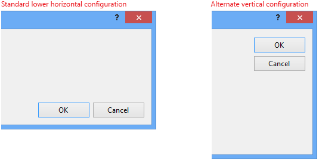
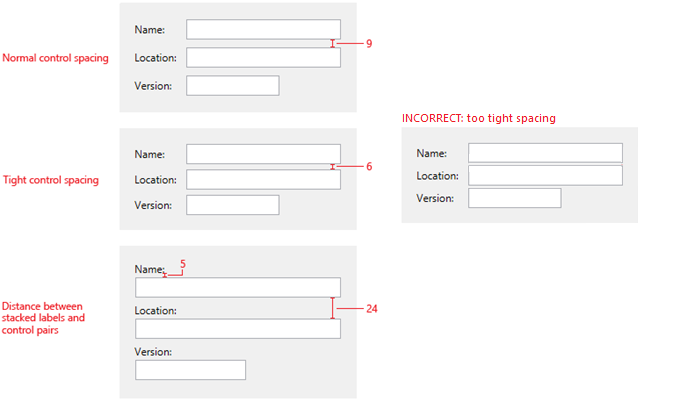
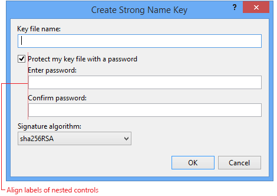
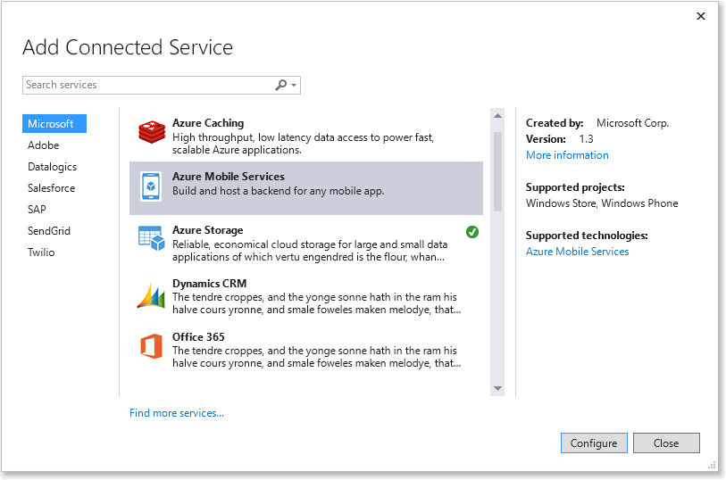

# Visual Studio のレイアウト
Visual Studio ダイアログの大部分は[ユーティリティ ダイアログのレイアウト](../../extensibility/ux-guidelines/layout-for-visual-studio.md#BKMK_UtilityDialogLayout)です。これは、標準の [Windows デスクトップ ダイアログ レイアウトの原則](/windows/desktop/uxguide/win-dialog-box)に従う、テーマが適用されていないダイアログです。 Visual Studio が UI を更新するために移行されると、一部の代表的なダイアログには、製品を明確するエクスペリエンスとしてそれらが確立される新しいデザインが使用されます。 これらの[テーマが適用されたダイアログのレイアウト](../../extensibility/ux-guidelines/layout-for-visual-studio.md#BKMK_ThemedDialogLayout)は、テーマが適用された外観を持っています。

##  ユーティリティ ダイアログのレイアウト

- ユーティリティ ダイアログ内のすべてのコントロールは、左上から始まり、下のほうに続いていきます。

- ダイアログの中央にコントロールを配置して、大きな領域が占有されないようにしてください。

- すべてのダイアログのテキストに環境フォントを使用します。 視覚的な仕様を記述するときは、特定のフォントとサイズを選択するのではなく、環境フォントを指定します。 「[環境フォント](../../extensibility/ux-guidelines/fonts-and-formatting-for-visual-studio.md#BKMK_TheEnvironmentFont)」を参照してください。

- 一貫性のあるコントロールの間隔と配置を使用して、技術品質の目標をサポートします。

- ダイアログは、より多くのコントロール、独特なコントロールの並置、またはその両方によって、より複雑になる可能性があります。 このような複雑な状況の場合は、コントロール グループ間に十分な間隔を取り、解析するための論理フローをユーザーに与えることができます。

### ユーティリティ ダイアログのレイアウトの例
 すべてのディメンションはピクセルで表されます。

 ")

 **図 08.01-a: コントロールの上にラベルを持つユーティリティ ダイアログの間隔のガイドライン**

 ")

 **図 08.01-b: コントロールの左にラベルを持つユーティリティ ダイアログの間隔のガイドライン**

### レイアウトの詳細

#### 余白

- すべてのダイアログには、すべての端のまわりに 12 ピクセルの境界線が必要です。

- グループ フレーム内の余白は、フレームの端から 9 ピクセルである必要があります。

- タブ コントロール内の余白は、タブ コントロールの端から 6 ピクセルである必要があります。

#### コマンド ボタン

- コマンド ボタンは、コンテンツではなく、ダイアログのフレームで動作します。 これらは、右下に配置する必要があり、ボタンを明確に区別できるように、上に十分な可変領域が必要です。

- ダイアログ内で動作する水平方向のボタンがある場合、代替のコマンド ボタンの構成では右上に垂直方向に積み重ねられます。 以下の「[内部コマンド ボタン](../../extensibility/ux-guidelines/layout-for-visual-studio.md#BKMK_InteriorCommandButtons)」を参照してください。

- コマンド ボタンの左側にあるスペース (ダイアログの下部の左/中央) は、ダイアログ操作コントロールの "バンド" の一部と見なされます。 この領域に割り込ませる必要があるのは、タスクまたはダイアログ全体に関連するヘルプ リンクだけです。

- コマンド ボタンは 75 x 23 ピクセルである必要があります。

- コマンド ボタンは、6 ピクセル離れている必要があります。

  

  **図 08.01-c: 基本的なボタンの配置**

#### ラベル

- すべてのラベルを左揃えにします。

- コントロールの上にあるラベルの場合は、その下にあるコントロールと正確に左揃えにする必要があります。また、ラベルの下部は、他のコントロール (コンボ ボックスなど) の上部の 5 ピクセル上にする必要があります。

- コントロールの左側にあるラベルの場合、ラベルと入力コントロールの間の最小幅は 10 ピクセルです。 テキスト ボックス、コンボ ボックス、またはその他のコントロールを揃えるために、暗黙的な 2 番目の列を設定する必要があります。

- ラベルは文の文字形式であり、その後にコロンが続きます。 [テキストのスタイル](../../extensibility/ux-guidelines/fonts-and-formatting-for-visual-studio.md#BKMK_TextStyle)に関するページを参照してください。

#### コントロール間の距離
 コントロールは適切に積み重ねます。 積み重ねたコントロール間の間隔に関する絶対的なガイドラインはありません。 コントロール同士の近さは、ダイアログによって若干異なる場合があります。 推奨される間隔は、垂直のコントロール/ラベルのペアの場合は 20 ピクセル、水平のコントロール/ラベルのペアの場合は 9 ピクセルです。 水平のペアの場合、コントロールの最小間隔は 6 ピクセルです。

 

 **図 08.01-d: コントロール間の距離に関する推奨事項**

#### コントロールのインデント
 コントロールが入れ子になっている場合は、内側のコントロールを上のコントロール (通常はラベル) の左端と水平方向に揃えます。

 

 **図 08.01-e: 入れ子になったコントロールの配置**

#### コントロールの幅
 テキスト ボックスまたはその他の同様のコントロールの幅は、フィールドの平均入力値以下である必要があります。 英単語の平均は 5 文字です。 たとえば、長いパス名を必要とするテキスト ボックスは、水平レイアウトで許可される長さである必要があります。一方、プラットフォーム名のドロップダウンは、最も長いエントリを収容できる長さである必要があります。

#### ヘルパー テキスト

- ダイアログには、ダイアログの目的に関する情報をさらに提供するヘルパー テキストを表示できます。 通常、これは上部にあり、1 から 2 文にすることができます。

- 行の長さは、ユーザーが解析して読み取るのに適切な幅である必要があります。 中間のダイアログの幅は、550 ピクセル以下である必要があります。

####  内部コマンド ボタン
 より複雑なダイアログでは、内部コントロールに独自の関連するボタンがある場合があります。これは、ダイアログのコミット ボタンが配置される場所に影響を与えることがあります。

- **[OK]** / **[キャンセル]** が右下隅で水平方向に配置されている場合は、内部ボタンの垂直方向の配置 (列) を使用します。

- **[OK]** / **[キャンセル]** が右下隅で垂直方向に配置されている場合は、内部ボタンの水平方向の配置 (列) を使用します。 この状況はあまり一般的ではありません。

- 内部ボタンのサイズは、可能な場合は **[OK]** / **[キャンセル]** ボタンのサイズと一致する、標準のボタン サイズの 75 x 23 ピクセルを目標にする必要があります。 ボタンのラベルによってボタンのサイズが標準のボタンのサイズを超える場合、そのセット内の他のボタンはその大きいサイズに揃える必要があります。

  ![横方向の [OK] と [キャンセル] ボタン](../../extensibility/ux-guidelines/media/0801-f_horizokcan.png "0801-f 水平方向の [OK]/[キャンセル]")

  **図 08.01-f: 水平方向の [OK]/[キャンセル] と垂直方向の内部ボタン**

  ![縦方向の [OK] と [キャンセル] ボタン](../../extensibility/ux-guidelines/media/0801-g_vertokcan.png "0801-g 垂直方向の [OK]/[キャンセル]")

  **図 08.01-f: 垂直方向の [OK]/[キャンセル] と水平方向の内部ボタン**

#### [参照] ボタン
 テキスト ボックスの後に表示される **[参照...]** ボタンでは、"参照..." と完全に表示されます (省略記号を含む)。 間隔が狭い場合、または画面に複数の **[参照...]** ボタンがある場合は、ボタンを省略記号だけに縮小できます。

##  テーマが適用されたダイアログのレイアウト
 Visual Studio のテーマが適用されたダイアログでは、外観が明るくなり、より多くの空白が提供されます。 文字体裁では、より広い行間隔と、フォント サイズおよび太さのバリエーションが提供されるため、より強調して関心を引くことができます。 可能な場合、クロムとタイトル バーは縮小または削除されます。 これらのダイアログのレイアウトでは、次の基本的なパターンに従う必要があります。

1. ダイアログの背景は白です。

2. 中間値の灰色の 1 ピクセルの罫線があります。

3. ダイアログのタイトルはタイトル バーに表示されなくなりますが、大きなポイント サイズで視覚的な関心と強調が提供されます。 ([テキストのスタイル](../../extensibility/ux-guidelines/fonts-and-formatting-for-visual-studio.md#BKMK_TextStyle)に関するページのフォント サイズのセクションを参照してください。)

4. 説明などの追加テキストと組み合わされたラベルは、**環境フォント + 太字** にする必要があります。

5. 内部の列は、薄い灰色の 1 ピクセルの罫線で区切られます。

6. 既定のリンクにはアンダースコアがありません。 ホバー状態と押された状態では、色が変更されてアンダースコアが付きます。

7. コミット ボタン ( **[OK]** / **[キャンセル]** など) は右下隅に配置されます。

### テーマが適用されたダイアログのレイアウトの例
 

 **図 08.01-h: テーマが適用されたダイアログ**

 ")

 **図 08.01-i: テーマが適用されたダイアログ - ディメンション**

 ")

 **図 08.01-j: テーマが適用されたダイアログ - フォント**

 ")

 **図 08.01-k: テーマが適用されたダイアログ - 色**

## 関連項目
- [Visual Studio のアプリケーション パターン](../../extensibility/ux-guidelines/application-patterns-for-visual-studio.md)
- [コントロール (Windows)](/windows/desktop/uxguide/controls)
- [ダイアログ ボックス (Windows)](/windows/desktop/uxguide/win-dialog-box)
