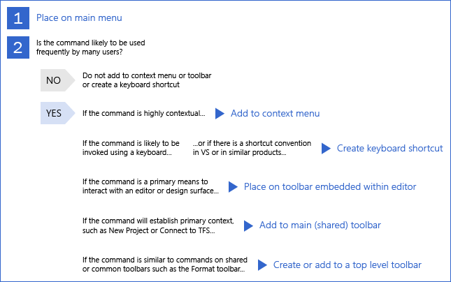
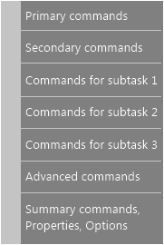
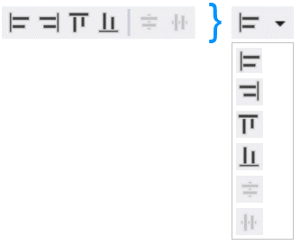

# Visual Studio のメニューとコマンド
## コマンドの使用方法

### 概要
 多数の個別の製品で構成されるスイートである Microsoft Office とは異なり、Visual Studio には、それぞれがグローバルな Visual Studio IDE に対してコマンド セットを提供する製品が多数含まれています。 IDE により、コンテキストに基づいてユーザーが使用できる機能はフィルター処理され、何千ものコマンドの複雑さが管理されています。

 デザイン ウィンドウからコード編集ウィンドウへの切り替えなど、ユーザーのコンテキストが変わると、新しいコンテキストに関係のない機能は非表示になります。 同時に、プロパティやツールボックス オプションなどの関連する動的情報と共に、新しい機能が表示されます。 ユーザーは、使用可能なコマンド セットが入れ替わったことに気づかないはずです。 コマンドの表示または非表示にユーザーが気を取られたり混乱したりする場合は、UI のデザインを調整する必要があります。 ユーザーの現在のコンテキストは、IDE タイトル バー、プロパティ ウィンドウ、[プロパティ ページ] ダイアログ ボックスなど、常に 1 つ以上の方法で示されます。

 コマンド バーを使用すると、UI の柔軟性を高めることができます。 Visual Studio 環境に固有のコマンド構造は、メイン メニューとメイン コマンド バーだけです。これらをカスタマイズすることや、非表示にすることができます。 他のコマンド バーは、アプリケーションの状態に基づいて表示されたり、非表示になったりします。 ツール ウィンドウとドキュメント エディターには、ウィンドウの端に埋め込みツール バーを含めることもできます。

#### 基本的なガイドライン

##### 可能な限り、既存の共有コマンド、コマンド グループ、およびメニューを使用する。
 通常、コマンドはコンテキストに基づいて表示されるため、既存の共有メニューとコマンド グループを使用すると、コンテキストが変化してもコマンドの構造は比較的安定した状態に保たれます。 共有コマンドを再利用し、関連する共有コマンドの近くに新しいコマンドを配置すると、IDE の複雑さが軽減され、より使いやすいエクスペリエンスを実現できます。 新しいコマンドを定義する必要がある場合は、既存の共有コマンド グループに配置してみてください。 新しいグループを定義する必要がある場合は、新しい最上位メニューを作成する前に、関連するコマンド グループの近くにある既存の共有メニューにグループを配置します。

##### すべてのコマンドにアイコンを作成しない。
 コマンド アイコンを作成する前に、慎重に検討してください。 アイコンは、次のようなコマンドに対してのみ作成するようにします。

- 既定のツール バーに表示される。

- ユーザーが **[カスタマイズ]** ダイアログを使用してツール バーに追加する可能性がある。

- 別の Microsoft 製品の同じアクションにアイコンが関連付けられている。

##### キーボード ショートカットの追加を制限する
 大多数のユーザーは、使用可能なすべてのショートカットのうち、ごく一部しか使用していません。 迷う場合は、機能をキーボード ショートカットにバインドしないでください。 新しいショートカットを追加する前に、ユーザー エクスペリエンス チームに相談してください。

##### コマンドに既定のメニューの配置を指定する。
 コマンドは他のユーザーによってカスタマイズされることを意識し、それに応じて設計します。 隠しコマンドのようなものはありません。 すべての Visual Studio コマンドは、 **[ツール] > [カスタマイズ]** ダイアログ、コマンド ウィンドウ、オートコンプリート、 **[ツール] > [オプション] > [キーボード]** ダイアログ、および開発ツール環境 (DTE) に表示されます。 ユーザーが簡単に見つけられるように、必ず .ctc ファイルでコマンドに名前とツールヒントを付けてください。

##### 埋め込みツール バーで共有コマンドを重複させない。
 ユーザーのフォーカス領域のすぐ近くにコマンドを配置すると便利です。 これを行う方法の 1 つは、ツール ウィンドウまたはドキュメント エディターの上部に埋め込みツール バーを作成することです。 ツール バーに配置されるコマンドは、ウィンドウ内のコンテンツ領域に固有のものにします。 これらのツール バーに共有コマンドを重複して配置しないでください。 たとえば、埋め込みツール バー内に [保存] アイコンを配置しないでください。

### コンテンツとコマンドの可視性
 コマンドは、**環境**、**階層**、および **ドキュメント** のスコープ内に存在します。 各スコープを把握することで、自信を持ってコマンドを配置することができます。

 **環境** スコープのコマンドによって、プライマリ コンテキストが確立され、複数のコンテキスト間で共有されます。 また、ドキュメントやツールのウィンドウの表示や配置が変更されます。 環境スコープのコマンドには、 **[新しいプロジェクト]** 、 **[サーバーへの接続]** 、 **[プロセスのアタッチ]** 、 **[切り取り]** 、 **[コピー]** 、 **[貼り付け]** 、 **[検索]** 、 **[オプション]** 、 **[カスタマイズ]** 、 **[新しいウィンドウ]** 、 **[ヘルプの表示]** などがあります。

 **階層** スコープのコマンドにより、**プロジェクト**、**チーム**、**データ** などの Visual Studio の階層が管理されます。 これらはプロジェクトのサブコンテキストに関連しています。たとえば、**デバッグ**、**ビルド**、**テスト**、**アーキテクチャ**、**分析** などです。 階層スコープのコマンドには、 **[新しい項目の追加]** 、 **[新しいクエリ]** 、 **[プロジェクトの設定]** 、 **[新しいデータソースの追加]** 、 **[パフォーマンス ウィザードの起動]** 、 **[新しいダイアグラム]** などがあります。

 **ドキュメント** スコープのコマンドは、コード、デザイン、作業項目クエリ (WIQ) などのドキュメントの内容に作用します。 これらは、ツール ウィンドウのビューにも作用するか、そのツール ウィンドウに固有です。 ドキュメント スコープ コマンドは、 **[プロジェクトから削除]** のように、それ自体が階層固有のファイル オブジェクトにも作用します。 ドキュメント スコープのコマンドには、 **[リファクター] > [名前の変更]** 、 **[作業項目のコピーの作成]** 、 **[すべて展開]** 、 **[すべて折りたたむ]** 、 **[ユーザー タスクの作成]** などがあります。

### コマンド配置の決定
 コマンドを作成することを決定したら、その適切な配置と、キーボード ショートカットを作成するかどうかを決定する必要があります。 次の決定パスに従って、コマンドを配置する位置を決めてください。

 

 **Visual Studio でのコマンド配置の決定パス**

### メニュー内のコマンド配置

#### メイン メニュー バー
 メイン メニュー バーは、UI に寄与するあらゆるコンテキスト固有のメニュー パッケージのコマンドにとって、標準の場所にする必要があります。 メイン メニュー バーが他のコマンド構造と異なるのは、表示するコマンドを制御するために環境に使用されるという点です。 他のすべてのコマンド バーの場合、配置場所がメニューかツール バーかに関係なく、コンテキスト外のコマンドは無効にされるだけです。

 環境には、IDE 全体と複数のタスク ドメインに共通するコマンド セットが定義され、メイン メニュー バーに組み込まれます。 これらのコマンドは、環境に読み込まれている VSPackage に関係なく常に表示されます。 VSPackage を使用してこのコマンド セットを拡張できますが、各製品のコマンド セットとそのコマンドの配置は、各チームの担当です。

 Visual Studio のメイン メニューの構造は、次のメニュー カテゴリに分けられます。

##### コア メニュー

- ファイル

- [編集]

- 表示

- ツール

- ウィンドウ

- ヘルプ

##### プロジェクト固有のメニュー

- Project

- ビルド

- デバッグ

##### コンテキスト固有のメニュー

- チーム

- Data

- テスト

- アーキテクチャ

- 分析

##### ドキュメント固有のメニュー

- フォーマット

- テーブル

##### メイン メニューを設計するときは、次の規則に従う。

- 1 つのコンテキストで最上位項目数が 25 個を超えてはなりません

- メニューの高さは 600 ピクセルを超えないようにします。

- Ultimate SKU や全般的なプロファイルなど、複数のコンテキストでメイン メニューを評価します。

- ポップアップ メニューは許容されます。

- ポップアップ メニューに含める項目数は、3 個以上 7 個以下にします。

- ポップアップ メニューの深さは 1 レベルのみにします。一部の Visual Studio メニュー項目にはカスケード サブメニューがありますが、このパターンは推奨されません。

- 使用する区切りは 6 個以下にします。 グループ化は次の図に従うようにします。

     

- この図の各グループを含める必要はありませんが、その他のグループの追加は制限されます。

- 各グループのメニュー項目数は 2 個から 7 個にします。

#### メイン メニューの順序
 新しい最上位項目を追加する前に、既存の最上位メニューにコマンドを配置することを検討します。 新しい最上位メニューを追加するときは、正しい場所に配置してください。 プロジェクト、コンテキスト、またはドキュメントのどれに固有のメニューかを決定します。 最上位メニューの名前は簡潔にし、1 つの単語のみを使用します。

 コア メニューは、その他のコマンドのブックエンドとなるようにします。 [ファイル]、[編集]、および [表示] は常に左側に配置し、[ツール]、[ウィンドウ]、および [ヘルプ] は常に右側に配置します。

#### コンテキスト メニュー
 コンテキスト メニュー内に配置する機能数が多すぎると、インターフェイスがわかりづらくなります。 すべての主要な機能は、メイン メニュー バーから使用できるようにします。 コマンドの配置は、コマンドの重複を避けるように既存のコマンドと調整します。 コンテキスト メニューの場合、ソリューション、プロジェクト ノード、またはプロジェクト項目のいずれのコンテキスト メニューであるかに応じて、含める標準のメニュー グループがシェルに定義されています。

 コンテキスト メニューを設計するときは、メイン メニューと同じ規則に加えて、次のことにも従ってください。

- 最上位のメニュー項目数を 25 個以下にします。

- ポップアップ メニューは許容されますが、1 レベルを超える深さにはしないでください。カスケード式のポップアップは絶対に使用しないでください。

- 使用する区切りは 6 個以下にします。

### ツール バー内のコマンドの配置

#### 一般的なツール バー
 ツール バーを設計および配置するときは、次の基準に従ってください。

- 1 つのボタンに複数の動詞を使用しないでください。 1 つのボタン = 1 つのアクションです。

- ラベルで補強する必要がある場合にのみ、アイコンの横にテキストを使用してください。

- 1 回のセッションで何度も切り替えられるプロパティにのみ、コンボ ボックスを使用します。 それ以外の場合は、他の場所でプロパティを公開します。

- コンボ ボックスの幅は、ボックス内で最も長い項目の幅 + 30% になるようにします。 たとえば、最も長い項目が 200 ピクセルの場合、コンボ ボックスの幅は 260 ピクセルにします。

- 区切りの使用を制限します。 ドロップダウン自体の形状が視覚的な区切りとして機能するので、ドロップダウンの次に区切りを使用することは推奨されません。

- アイコン グループに含めるアイコン数は、3 個から 6 個にします。

- 修飾語句によって複数の便利なコマンドになる場合は、最後の設定を格納する分割ボタンを使用します。

     

     **分割ボタンの例。左側の 6 個のコマンドではなく 1 つのボタンに収めることができます。**

#### 製品固有のツール バー
 各製品には、頻繁に使用される重要なコマンドを含む既定のツール バーを用意することができます。また、各製品の既定のツール バーは、製品のインストール後に初めて Visual Studio を起動したときに表示されます。

 製品には、IDE に用意されている共有のコマンド グループとメニューも活用します。 各共有コマンド グループは、ユーザーにとって意味のある方法で関連するコマンドが整理されるように、共有メニューに配置されています。 複雑さを軽減するために、この共有コマンド構造を活用することが重要です。

#### グローバル ツール バー
 グローバル ツール バーは、既定の状態で 1 行に収まるようにする必要があります。 新しいグローバル ツール バーを作成するときは、そのツール バーの種類のガイドラインに従ってください。

 **一般的なツール バーのガイドライン:**

- 各ツール バーは、共通のコントロール (グリッパー、オーバーフロー) 内で 24 ピクセルです。

- 各ツール バー ボタンの幅は、パディングを含めて 22 ピクセルです。 アイコンを分割ボタンにすると、幅はさらに 11 ピクセル増えます。

- ツール バー間でのコマンドの重複は許可されています。

  **ドキュメント固有のツール バー** は、特定のファイルの種類がアクティブになると表示され、別のファイルの種類がアクティブになると非表示になります。

- ドキュメント固有のツール バーのボタン数は 12 個以下にします。

- ツール バーの合計幅は 300 ピクセル以下にします。

- ファイルの種類ごとに、1 つの埋め込みツール バーまたは 1 つのドキュメント固有のグローバル ツール バーの両方ではなく、いずれかを含めることができます。

  **コンテキスト固有のツール バー** は、特定のコンテキストが設定されている場合に表示され、長時間アクティブのままになる傾向があります。

- すべてのコンテキスト固有のツール バーに対するボタン数の上限は 18 個です。

- あるコンテキストがアクティブなときに、ほとんどのユーザーがこのツール バーのコマンドを一貫して使用しない場合は、このツール バーをそのコンテキストに関連付けないでください。

- コンテキストを終了するときにツール バーが非表示になることを確認します。 このようなツール バーは、起動時に表示されません。

  **コンテキストのないツール バー** が自動的に表示されることはありません。 これらは、ユーザーがアクティブにした場合にのみ表示されます。 最大幅は 200 ピクセル未満に保ちます。

### 一般的な編成とシェルで定義されたグループ
 既存の共有コマンド、コマンド グループ、メニューを使用します。 新しいコマンドを定義する必要がある場合は、既存の共有コマンド グループに配置してみてください。 新しいグループを定義する必要がある場合は、新しい最上位メニューを作成する前に、関連するコマンド グループの近くにある既存の共有メニューにグループを配置してみてください。 こうすることで、IDE 内の一貫したコマンド配置を確保しながら、コマンドの複雑さを軽減できます。

 共有の **[書式設定]** メニューは、通常、次の図のように、デザイナースタイルのドキュメント ウィンドウのコンテキストで表示されます。

 ![Visual Studio でのコールアウト付きの [書式] メニュー](../../extensibility/ux-guidelines/media/0501-d_formatmenu.png "0501-d_FormatMenu")

 **Visual Studio のメニュー グループ**

### コマンドの削減と再利用
 通常、ユーザーに表示されるコマンド数を減らすために、コンテキストに基づいてコマンドが表示されます。 一方で、コンテキストが変わってもコマンド構造が比較的安定するように、既存の共有メニューとコマンド グループを再利用します。

 共有コマンドを再利用し、関連する共有コマンドの近くに新しいコマンドを配置すると、IDE の複雑さも軽減され、より使いやすいエクスペリエンスを実現できます。

## コマンドの名前付け

### 名前付け規則
 ユーザーがコマンドを見つけて、コマンド ラインを使用するかキーボード ショートカットにバインドして実行できるように、一貫したコマンドの名前付けが重要です。 コマンド名は、ツール バー、カスケード メニュー、またはコンテキスト メニューに表示されるときに、ユーザーがそのコマンドの目的を理解するためにも役立ちます。

#### コマンドに名前を付ける場合:

- ローカライズしやすいようにテキストを作成します。 テキストのローカライズの詳細については、「[推奨されるローカリゼーション手順](/dotnet/standard/globalization-localization/best-practices-for-developing-world-ready-apps#localization-best-practices)」を参照してください。

- 簡潔にします。 コマンドに使用する単語数は 3 個以下にします。

- タイトルの大文字と小文字の書式を使用します。つまり、各単語の最初の文字を大文字にします。 Visual Studio でのテキストの書式の詳細については、「[テキスト スタイル](../../extensibility/ux-guidelines/fonts-and-formatting-for-visual-studio.md#BKMK_TextStyle)」を参照してください。

- コマンドが配置される位置を考慮します。 最上位メニューですか。それともポップアップですか。 たとえば、整列コマンドをポップアップにグループ化する場合、最上位コマンドは [整列] であり、ポップアップ コマンドは [左]、[右]、[中央]、[両端揃え] などにします。 ポップアップ コマンドに [左寄せ] または [右寄せ] という名前を付けるのは冗長です。

     ![Visual Studio での [書式] メニュー](../../extensibility/ux-guidelines/media/0502-a_formatmenu.png "0502-a_FormatMenu")

### アイコンとコマンドの併用
 コマンドとアイコンの併用は慎重に行います。 一意の画像をコマンドに関連付けると、ユーザーがそのコマンドを識別しやすくなりますが、画像を多用すると視覚的に混乱し、非効率になります。 次の規則は、コマンド アイコンを作成するかどうかを決定するときに役立ちます。

#### 次の場合にのみ、アイコンとコマンドを併用します。

- 別の主要な Microsoft 製品 (Microsoft Office アプリケーションの 1 つなど) で、同じコマンドにアイコンが関連付けられている。

- このコマンドは既定のツール バーに配置される。

- このコマンドは、ユーザーが **[カスタマイズ]** ダイアログを使用してツール バーに追加する可能性が高い特別なコマンドである。

## アクセスとショートカット キー

### 概要
 キーボード キーの割り当てには、次の 2 種類があります。

- **アクセス キー**(アクセラレータとも呼ばれます) を使用すると、コマンドのメニューを介して、ダイアログ UI の各ラベルにキーボードでアクセスできます。 アクセス キーは主にアクセシビリティを目的とし、すべてのメニューとほとんどのダイアログ ボックスのコントロールに割り当てられます。記憶するものではなく、現在のウィンドウにのみ影響し、ローカライズされます。

- **ショートカット キー** には、主にコントロール (Ctrl) とファンクション (Fn) のキー シーケンスが使用されます。 上級ユーザー向けに設計されており、生産性の向上に役立ちます。 使用頻度が高いコマンドにのみ割り当てられており、メイン メニューをバイパスし、すばやくアクセスできます。 ショートカット キーは記憶するものであるため、プロファイル スキームに沿って割り当てる必要があります。 ショートカット キー スキームは、プロファイルごとに異なる場合があります。 ユーザーは、 **[ツール] > [オプション] > [キーボード]** を使用してショートカット キーをカスタマイズできます。

### アクセス キーの割り当て
 アクセス キーは、Alt + 英数字キーで構成されます。 各メニュー項目には、例外なくアクセス キーを割り当てます。 アクセス キーの割り当てについては、Windows 規則と一般的な規則に従ってください。 たとえば、 **[ファイル] > [新規]** のアクセス キーは常に **Alt、F、N** キーにする必要があります。

 "i" (大文字または小文字) や小文字の "l" など、1 ピクセル幅の文字を使用しないでください。また、ディセンダーがある文字 (g、j、p、q、および y) の使用は避けてください。これらは区別しにくいためです。

 可能な限り、重複するキーの使用は避けてください。 重複が避けられない場合、メニュー システムにより、そのキーを使用するすべてのコマンドが循環され、競合が処理されます。 例として、[ファイル] メニュー以下に "N" アクセス キーが重複する架空の [Number]\(番号\) コマンドがある場合、**Alt、F、N** キーを押すと、新しいファイルが作成され、**Alt、F、N、N** を押すと、[Number]\(番号\) コマンドが実行されます。

### ショートカット キーの割り当て
 新しいショートカット キーの割り当ては避けてください。すべてのコマンドに必要なわけではなく、使いすぎるとシステム (とユーザー メモリ) に負担がかかります。 カスタマー エクスペリエンス向上プログラム (CEIP) のデータによると、Visual Studio ユーザーは統合されたショートカットのごく一部しか使用していません。

 ショートカットを定義するときは、次の規則に従います。

- **コントロール (Ctrl) とファンクション (Fn) のキー シーケンスを使用します。**

- **使用頻度の高いショートカットを保持します。** よく使うショートカットを残しておきます。

- **エディターのショートカットを簡単に入力できるようにします。** 開発者がコードを書くときに最も必要になるコマンドに、入力しやすいショートカットをバインドします。 たとえば、**Edit.InvokeSmartTag** には、Alt + Shift + F10 キーではなく Ctrl + / キーのような簡単なショートカット キーを割り当てる必要があります。

- **一貫したテーマのショートカットを目指します。**

- **Windows のガイドラインに従って、使用する修飾キーを決定します。** ドキュメント全体に適用されるコマンドなど、大規模な効果を持つコマンドには、Ctrl キーの組み合わせを使用します。 標準のショートカット キーのアクションを拡張または補完するコマンドには、Shift キーの組み合わせを使用します。 Ctrl + Alt キーの組み合わせは使用しないでください。

- **余計なショートカットを削除します。** レガシ機能があり、アクセス キーを使用して同じコマンドにすばやくアクセスできる場合は、使用頻度が極端に低い (CEIP データによると 10 回未満) または中程度 (CEIP データによると 100 回未満) のショートカットを削除することを検討してください。 例: Alt、H、C キーを押すと、[ヘルプ] の [目次] が開きます。

  ショートカットの有無を確認する簡単な方法はありません。 ショートカットを追加する場合は、次の手順を実行します。

1. [Visual Studio 2013 のショートカット](http://visualstudioshortcuts.com/2013/)の一覧を確認して、グループ化する類似のコマンドがあるかどうかを判断します。

2. **[ツール] > [オプション] > [環境] > [キーボード]** に移動し、ショートカットをテストします。 [次の追加キーボード マップ スキームを適用] に表示される各キーボード マップ スキームを確認します。 全般、C#、VB、および C++ の各プロファイルは、固有のショートカットを共有しているので、確認します。 ショートカットは、これらの場所のいずれにもマップされていない場合に使用できます。
