# Visual Studio の共有色
共通の Visual Studio シェル要素を使用する UI を設計する場合、または類似の機能との一貫性をインターフェイス要素に持たせる場合、パッケージ定義ファイルにある既存のトークン名を使用して色を選択し、割り当てます。 これにより、UI が Visual Studio 環境全体で一貫性を保ち、テーマが追加された場合や更新された場合に自動的に更新されるようになります。

この記事では、類似の UI を構築する際に参照できる一般的な UI 要素と UI 要素で使用されるトークン名について説明します。 これらの色のトークンにアクセスする方法の詳細については、「 [The VSColor Service](../../extensibility/ux-guidelines/colors-and-styling-for-visual-studio.md#BKMK_TheVSColorService)」を参照してください。

トークン名は次のように正しく使用してください。

- **色自体ではなく、機能に基づいてトークン名を使用します。** 一般的な共有色は、特定のインターフェイス要素と関連付けられ、同一または類似した機能に対してのみ使用されることを想定しています。 たとえば、押されているコンボ ボックスの色を、単にその色が好きという理由で進行状況を示す回転アニメーションに再利用しないでください。 コンボ ボックスとアニメーションの機能は異なり、コンボ ボックスに関連付けられている色が変更された場合、アニメーション要素にとっては適切な色でなくなる可能性があります。 色を一貫して使用すると、ユーザーの理解を助け、混乱を避けるために役立ちます。

- **背景色とテキストの色を適切な組み合わせで使用します。** テキストと共に使用することが想定された背景色には、テキストの色が関連付けられています。 その背景に指定されている色以外のテキストの色を使用しないでください。 テキストの色が関連付けられていない背景色は、テキストを表示する予定のサーフェイスで使用しないでください。 テキストの色と背景色の他の組み合わせによって、読み取り不可能なインターフェイスが生成される場合があります。

- **場所に適したコントロールの色を使用します。** 特定の状態では、一部の Visual Studio コントロールに個別の境界線の色と背景色がありません。 代わりに、それらのコントロールにはその背後のサーフェイスから色が適用されます。 コントロールを配置する場所に適したトークン名を常に使用してください。

> [!IMPORTANT]
> "スタート ページ" や "Cider" のカテゴリにあるトークンは使用しないでください。

## コモン共有コントロール

標準の Visual Studio のコマンド バーを機能で使用する場合、スタイル設定されたシェル コントロールにアクセスできます。 これらのコモン コントロールを再テンプレート化する必要はありません。 ただし、カスタム コマンド バーを作成する必要がある場合は、カスタム コントロールも構築することが必要な場合があります。 その場合は、UI が Visual Studio の他の部分と一貫性を持つように、次の各コントロールに正しいトークン名を使用してください。

### ボタン コントロール

| 使用する ... | 使用しない ... |
| --- | --- |
| ... Visual Studio のテーマ (淡色、濃色、青、またはシステムのハイコントラスト テーマ) と統合するドキュメント ウェル内のボタン。 | ... Visual Studio のテーマの一部でないカスタム背景に対して表示されるボタン。 |

**ボタン: 標準の状態**

 標準のボタン

| 要素 | トークン名: Category.color |
| --- | --- |
| ボタン | `CommonControls.Button` |
| ボタンの境界線 | `CommonControls.ButtonBorder` |

**ボタン: 既定の状態**

 既定のボタン

| 要素 | トークン名: Category.color |
| --- | --- |
| ボタン | `CommonControls.ButtonDefault` |
| ボタンの境界線 | `CommonControls.ButtonBorderDefault` |

**ボタン: 無効な状態**

 無効なボタン

| 要素 | トークン名: Category.color |
| --- | --- |
| ボタン | `CommonControls.ButtonDisabled` |
| ボタンの境界線 | `CommonControls.ButtonBorderDisabled` |

**ボタン: ホバー状態**

 ホバー時のボタン

| 要素 | トークン名: Category.color |
| --- | --- |
| ボタン | `CommonControls.ButtonHover` |
| ボタンの境界線 | `CommonControls.ButtonBorderHover` |

**ボタン: 押された状態**

 押されたボタン

| 要素 | トークン名: Category.color |
| --- | --- |
| ボタン | `CommonControls.ButtonPressed` |
| ボタンの境界線 | `CommonControls.ButtonBorderPressed` |

**ボタン: フォーカスされた状態**

 フォーカスされたボタン

| 要素 | トークン名: Category.color |
| --- | --- |
| ボタン | `CommonControls.ButtonFocused` |
| ボタンの境界線 | `CommonControls.ButtonBorderFocused` |

### チェック ボックス コントロール
 チェック ボックス (赤線)

| 使用する ... | 使用しない ... |
| --- | --- |
| ... ドキュメント ウェル内に含まれるチェック ボックス コントロール。 | ... チェック ボックス コントロールでない UI。 |

**チェック ボックス: 既定の状態**

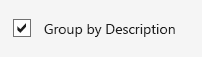 既定のチェック ボックス

| 要素 | トークン名: Category.color |
| --- | --- |
| 背景 | `CommonControls.CheckBoxBackground` |
| 境界線 | `CommonControls.CheckBoxBorder` |
| Text | `CommonControls.CheckBoxText` |
| グリフ | `CommonControls.CheckBoxGlyph` |

**チェック ボックス: 無効な状態**

 無効にされたチェック ボックス

| 要素 | トークン名: Category.color |
| --- | --- |
| 背景 | `CommonControls.CheckBoxBackgroundDisabled` |
| 境界線 | `CommonControls.CheckBoxBorderDisabled` |
| Text | `CommonControls.CheckBoxTextDisabled` |
| グリフ | `CommonControls.CheckBoxGlyphDisabled` |

**チェック ボックス: ホバー状態**

  ホバー時のチェック ボックス

| 要素 | トークン名: Category.color |
| --- | --- |
| 背景 | `CommonControls.CheckBoxBackgroundHover` |
| 境界線 | `CommonControls.CheckBoxBorderHover` |
| Text | `CommonControls.CheckBoxTextHover` |
| グリフ | `CommonControls.CheckBoxGlyphHover` |

**チェック ボックス: 押された状態**

 押されたチェック ボックス

| 要素 | トークン名: Category.color |
| --- | --- |
| 背景 | `CommonControls.CheckBoxBackgroundPressed` |
| 境界線 | `CommonControls.CheckBoxBorderPressed` |
| Text | `CommonControls.CheckBoxTextPressed` |
| グリフ | `CommonControls.CheckBoxGlyphPressed` |

**チェック ボックス: フォーカスされた状態**

 フォーカスされたチェック ボックス

| 要素 | トークン名: Category.color |
| --- | --- |
| 背景 | `CommonControls.CheckBoxBackgroundFocused` |
| 境界線 | `CommonControls.CheckBoxBorderFocused` |
| Text | `CommonControls.CheckBoxTextFocused` |
| グリフ | `CommonControls.CheckBoxGlyphFocused` |

### ドロップダウンおよびコンボ ボックス
 ドロップダウン/コンボ ボックス (赤線)

| 使用する ... | 使用しない ... |
| --- | --- |
| ... ドキュメント ウェル内のドロップダウンとコンボ ボックス。 | ... ドロップダウンまたはコンボ ボックスでない UI。 |
| | ... コマンドバーの[ドロップダウン](../../extensibility/ux-guidelines/shared-colors-for-visual-studio.md#BKMK_CommandDropDown)または[コンボ ボックス](../../extensibility/ux-guidelines/shared-colors-for-visual-studio.md#BKMK_CommandComboBox)。 |

**ドロップダウンとコンボ ボックス: 既定の状態**

 既定のドロップダウン/コンボ ボックス

| 要素 | トークン名: Category.color |
| --- | --- |
| 背景 | `CommonControls.ComboBoxBackground` |
| 境界線 | `CommonControls.ComboBoxBorder` |
| Text | `CommonControls.ComboBoxText` |
| 区切り記号 | `CommonControls.ComboBoxSeparator` |
| グリフ | `CommonControls.ComboBoxGlyph` |
| グリフの背景 | `CommonControls.ComboBoxGlyphBackground` |

**ドロップダウンとコンボ ボックス: 無効な状態**

 無効にされたドロップダウン/コンボ ボックス

| 要素 | トークン名: Category.color |
| --- | --- |
| 背景 | `CommonControls.ComboBoxBackgroundDisabled` |
| 境界線 | `CommonControls.ComboBoxBorderDisabled` |
| Text | `CommonControls.ComboBoxTextDisabled` |
| 区切り記号 | `CommonControls.ComboBoxSeparatorDisabled` |
| グリフ | `CommonControls.ComboBoxGlyphDisabled` |
| グリフの背景 | `CommonControls.ComboBoxGlyphBackgroundDisabled` |

**ドロップダウンとコンボ ボックス: ホバー状態**

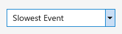 ホバー時のドロップダウン/コンボ ボックス

| 要素 | トークン名: Category.color |
| --- | --- |
| 背景 | `CommonControls.ComboBoxBackgroundHover` |
| 境界線 | `CommonControls.ComboBoxBorderHover` |
| Text | `CommonControls.ComboBoxTextHover` |
| 区切り記号 | `CommonControls.ComboBoxSeparatorHover` |
| グリフ | `CommonControls.ComboBoxGlyphHover` |
| グリフの背景 | `CommonControls.ComboBoxGlyphBackgroundHover` |

**ドロップダウンとコンボ ボックス: 押された状態**

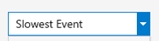 押されたドロップダウン/コンボ ボックス

| 要素 | トークン名: Category.color |
| --- | --- |
| 背景 | `CommonControls.ComboBoxBackgroundPressed` |
| 境界線 | `CommonControls.ComboBoxBorderPressed` |
| Text | `CommonControls.ComboBoxTextPressed` |
| 区切り記号 | `CommonControls.ComboBoxSeparatorPressed` |
| グリフ | `CommonControls.ComboBoxGlyphPressed` |
| グリフの背景 | `CommonControls.ComboBoxGlyphBackgroundPressed` |

**ドロップダウンとコンボ ボックスのリスト項目ビュー: 押された状態**

  ドロップダウン/コンボ ボックスの押されたリスト項目ビュー

| 要素 | トークン名: Category.color |
| --- | --- |
| 背景 | `CommonControls.ComboBoxListBackground` `CommonControls.ComboBoxListBackgroundHover` `CommonControls.ComboBoxListItemBackgroundPressed` `CommonControls.ComboBoxListItemBackgroundFocused` |
| 境界線 | `CommonControls.ComboBoxListBorder` `CommonControls.ComboBoxListBorderHover` `CommonControls.ComboBoxListBorderPressed` `CommonControls.ComboBoxListBorderFocused` |
| 項目のテキスト | `CommonControls.ComboBoxListItemText`  `CommonControls.ComboBoxListItemTextHover` `CommonControls.ComboBoxListItemTextPressed` `CommonControls.ComboBoxListItemTextFocused` |
| 背景の影 | `CommonControls.ComboBoxListBackgroundShadow` |

**ドロップダウンとコンボ ボックス: フォーカスされた状態**

 フォーカスされたドロップダウン/コンボ ボックス

| 要素 | トークン名: Category.color |
| --- | --- |
| 背景 | `CommonControls.ComboBoxBackgroundFocused` |
| 境界線 | `CommonControls.ComboBoxBorderFocused` |
| Text | `CommonControls.ComboBoxTextFocused` |
| 区切り記号 | `CommonControls.ComboBoxSeparatorFocused` |
| グリフ | `CommonControls.ComboBoxGlyphFocused` |
| グリフの背景 | `CommonControls.ComboBoxGlyphBackgroundFocused` |

**ドロップダウンとコンボ ボックス: テキスト入力選択**

 ドロップダウン/コンボ ボックスのテキスト入力選択

| 要素 | トークン名: Category.color |
| --- | --- |
| 強調表示 | `CommonControls.ComboBoxTextInputSelection` |

### 表形式のデータ (グリッド) コントロール
表形式のデータ コントロール (グリッド コントロールとも呼ばれる) は、複数列の大量のデータを表示するために使用する Visual Studio のコモン コントロールです。 標準の表形式のデータ コントロールは、[エラー一覧] ツール ウィンドウ、IntelliTrace レポート、メモリ ヒープ ビューなど、Visual Studio 内の複数の場所にあります。 提供される標準の表形式のデータ コントロールを常に使用します。 まれに、標準の表形式のデータ コントロールにアクセスできないことがあります。 このような場合は、次のトークン名を使用して、UI が Visual Studio の他の表形式のデータ コントロールと一貫性を保つようにします。

 表形式のデータ/グリッド コントロール (赤線)

| 使用する ... | 使用しない ... |
| --- | --- |
| ... 表形式コントロールまたはグリッド コントロール。 | ... 表形式またはグリッド コントロール以外の UI。 |

#### 列見出し
列ヘッダーは、背景、境界線、タイトル テキスト、およびグリッドがその列で並べ替えられたときに通常使用されるオプションのグリフで構成されます。

**列見出し: 既定の状態**

| 要素 | トークン名: Category.color |
| --- | --- |
| 背景 | `Header.Default` |
| 前景 (テキスト) | `Environment.CommandBarTextActive` |
| 前景 (グリフ) | `Header.Glyph` |
| 境界線 | `Header.SeparatorLine` |

**列見出し: ホバー状態**

| 要素 | トークン名: Category.color |
| --- | --- |
| 背景 | `Header.MouseOver` |
| 前景 (テキスト) | `Environment.CommandBarTextHover` |
| 前景 (グリフ) | `Header.MouseOverGlyph` |
| 境界線 | `Header.SeparatorLine` |

**列見出し: 押された状態**

| 要素 | トークン名: Category.color |
| --- | --- |
| 背景 | `CommonControls.CheckBoxBackgroundPressed` |
| 前景 (テキスト) | `CommonControls.CheckBoxBorderPressed` |
| 前景 (グリフ) | `CommonControls.CheckBoxTextPressed` |
| 境界線 | `CommonControls.CheckBoxGlyphPressed` |

#### リスト ビュー項目
 リスト ビュー項目は、背景とコンテンツで構成されます。 コンテンツは、テキスト、アイコン、またはその両方の場合があります。

**リスト ビュー項目: 既定の状態**

| 要素 | トークン名: Category.color |
| --- | --- |
| 背景 | 透明 |
| 前景 (テキスト) | `Environment.CommandBarTextActive` |
| 境界線 | なし |

**リスト ビュー項目: アクティブな状態**

| 要素 | トークン名: Category.color |
| --- | --- |
| 背景 | `TreeView.SelectedItemActive` |
| 前景 (テキスト) | `TreeView.SelectedItemActiveText` |
| 境界線 | なし |

**リスト ビュー項目: アクティブでない状態**

| 要素 | トークン名: Category.color |
| --- | --- |
| 背景 | `TreeView.SelectedItemInactive` |
| 前景 (テキスト) | `TreeView.SelectedItemInactiveText` |
| 境界線 | なし |

### UI テキスト

#### 指示テキスト
指示テキストでは、ダイアログまたはドキュメント ページで何をすべきかという説明が目立つように示されます。

 既定の指示テキスト

| 要素 | トークン名: Category.color |
| --- | --- |
| 前景 (テキスト) | `Environment.ControlText` |

#### セカンダリ指示テキスト
多くのテキストやコントロールが含まれるドキュメント ページでは、一部の指示テキストで使用する色値を変更します。 これによって、どの情報が最も重要であるかを伝え、UI 要素の全体な密集を緩和することができます。 (ヒント テキストについては、以下のセクションも参照してください。)

 セカンダリ指示テキスト

| 要素 | トークン名: Category.color |
| --- | --- |
| 前景 (テキスト) | `Environment.ControlEditHintText` |

#### ヒント テキスト
ヒント テキストは、空のコントロール、コントロールの下、または空のドキュメント サーフェイスに表示され、次に実行する操作をユーザーに示します。 ヒント テキストは、ウィンドウまたはコントロールの背景と共に使用できます。

**既定のヒント テキスト**

 既定のヒント テキスト

| 要素 | トークン名: Category.color |
| --- | --- |
| 前景 (テキスト) | `Environment.ControlEditHintText` |

**必須のヒント テキスト**

 必須のヒント テキスト

| 要素 | トークン名: Category.color |
| --- | --- |
| 前景 (テキスト) | `Environment.ControlRequiredHintText` |
| 背景 | `Environment.ControlRequiredBackground` |

**検索ボックス コントロール テキスト**

> 検索コントロールに関連するその他の色のトークンについては、「[検索ボックス](../../extensibility/ux-guidelines/shared-colors-for-visual-studio.md#BKMK_SearchBoxes)」を参照してください。

 検索ボックス コントロール テキスト

| 要素 | トークン名: Category.color |
| --- | --- |
| 前景 (テキスト) | `SearchControl.UnfocusedWatermarkText` |

### ハイパーリンク
ハイパーリンクは、前景と背景の組み合わせがない 1 つのコントロールです。 すべての場合において、ハイパーリンクの前景色を使用します。この色は濃色、灰色、白の背景で正しく表示されます。 ハイパーリンク コントロールの色トークンを使用しない場合、"押されている" ことを示す既定のシステム カラー (明るい赤) が表示されます。 これは、コントロールで適切な環境の色トークンが使用されていないことを示します。

 ハイパーリンク (赤線)

| 使用する ... | 使用しない ... |
| --- | --- |
| ... カスタム ハイパーリンクを作成する必要がある場合。 | ... ハイパーリンク以外のすべてのもの。 |

**ハイパーリンク: 既定の状態**

 既定のハイパーリンク

| 要素 | トークン名: Category.color |
| --- | --- |
| 前景 (テキスト) | `Environment.PanelHyperlink` |

**ハイパーリンク: ホバー状態**

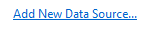 ホバー時のハイパーリンク

| 要素 | トークン名: Category.color |
| --- | --- |
| 前景 (テキスト) | `Environment.PanelHyperlinkHover` |

**ハイパーリンク: 押された状態**

 押されたハイパーリンク

| 要素 | トークン名: Category.color |
| --- | --- |
| 前景 (テキスト) | `Environment.PanelHyperlinkPressed` |

**ハイパーリンク: 無効な状態**

 無効にされたハイパーリンク

| 要素 | トークン名: Category.color |
| --- | --- |
| 前景 (テキスト) | `Environment.PanelHyperlinkDisabled` |

### 情報バー
情報バーは該当するコンテキストの詳細を提供するために使用され、常にドキュメント ウィンドウまたはツール ウィンドウの上部に表示されます。

 情報バー (赤線)

| 使用する ... | 使用しない ... |
| --- | --- |
| ... カスタム情報バーを作成する場合。 | ... 情報バーに類似していない UI 要素。 |

**情報バー: 既定の状態**

 既定の情報バー

| 要素 | トークン名: Category.color |
| --- | --- |
| 背景 | `InfoBar.InfoBarBackground` |
| 前景 (テキスト) | `InfoBar.InfoBar` |
| 境界線 | `InfoBar.InfoBarBorder` |

**情報バーの閉じる (&times;) ボタン: 既定の状態**

 情報バーの既定の閉じる (&times;) ボタン

| 要素 | トークン名: Category.color |
| --- | --- |
| 背景 | `InfoBar.CloseButton` |
| 境界線 | `InfoBar.CloseButtonBorder` |
| グリフ | `InfoBar.CloseButtonGlyph` |

**情報バーの閉じる (&times;) ボタン: ホバー状態**

 情報バーのホバー時の閉じる (&times;) ボタン

| 要素 | トークン名: Category.color |
| --- | --- |
| 背景 | `InfoBar.CloseButtonHover` |
| 境界線 | `InfoBar.CloseButtonHoverBorder` |
| グリフ | `InfoBar.CloseButtonHoverGlyph` |

**情報バーの閉じる (&times;) ボタン: 押された状態**

 情報バーの押された閉じる (&times;) ボタン

| 要素 | トークン名: Category.color |
| --- | --- |
| 背景 | `InfoBar.CloseButtonDown` |
| 境界線 | `InfoBar.CloseButtonDownBorder` |
| グリフ | `InfoBar.CloseButtonDownGlyph` |

**情報バーのハイパーリンク ボタン: 既定の状態**

 情報バーの既定のハイパーリンク ボタン

| 要素 | トークン名: Category.color |
| --- | --- |
| 前景 (テキスト) | `InfoBar.Hyperlink` |

**情報バーのハイパーリンク ボタン: ホバー状態**

 情報バーのホバー時のハイパーリンク ボタン

| 要素 | トークン名: Category.color |
| --- | --- |
| 前景 (テキスト) | `Infobar.HyperlinkMouseOver` (下線あり) |

**情報バーのハイパーリンク ボタン: 押された状態**

 情報バーの押されたハイパーリンク ボタン

| 要素 | トークン名: Category.color |
| --- | --- |
| 前景 (テキスト) | `Infobar.HyperlinkMouseDown` (下線あり) |

**情報バーのインライン ハイパーリンク (文中): 既定の状態**

 情報バーの既定のインライン ハイパーリンク ボタン

| 要素 | トークン名: Category.color |
| --- | --- |
| 前景 (テキスト) | `InfoBar.Hyperlink` |

**情報バーのインライン ハイパーリンク (文中): ホバー状態**

 情報バーのホバー時のインライン ハイパーリンク ボタン

| 要素 | トークン名: Category.color |
| --- | --- |
| 前景 (テキスト) | `Infobar.HyperlinkMouseOver` (下線あり) |

**情報バーのインライン ハイパーリンク (文中): 押された状態**

 情報バーの押されたインライン ハイパーリンク ボタン

| 要素 | トークン名: Category.color |
| --- | --- |
| 前景 (テキスト) | `Infobar.HyperlinkMouseDown` (下線あり) |

**情報バー ボタン: 既定の状態**

 既定の情報バー ボタン

| 要素 | トークン名: Category.color |
| --- | --- |
| 背景 | `InfoBar.Button` |
| 前景 (テキスト) | `InfoBar.Button` |
| 境界線 | `InfoBar.ButtonBorder` |

**情報バー ボタン: ホバー状態**

 ホバー時の情報バー ボタン

| 要素 | トークン名: Category.color |
| --- | --- |
| 背景 | `InfoBar.ButtonMouseOver` |
| 前景 (テキスト) | `InfoBar.ButtonMouseOver` |
| 境界線 | `InfoBar.ButtonMouseOverBorder` |

**情報バー ボタン: 押された状態**

 押された情報バー ボタン

| 要素 | トークン名: Category.color |
| --- | --- |
| 背景 | `InfoBar.ButtonMouseDown` |
| 前景 (テキスト) | `InfoBar.ButtonMouseDown` |
| 境界線 | `InfoBar.ButtonMouseDownBorder` |

**情報バー ボタン: 無効な状態**

 無効にされた情報バー ボタン

| 要素 | トークン名: Category.color |
| --- | --- |
| 背景 | `InfoBar.ButtonDisabled` |
| 前景 (テキスト) | `InfoBar.ButtonDisabled` |
| 境界線 | `InfoBar.ButtonDisabledBorder` |

**情報バーボタン: フォーカスされた状態**

 フォーカスされた情報バー ボタン

| 要素 | トークン名: Category.color |
| --- | --- |
| 背景 | `InfoBar.ButtonFocus` |
| 前景 (テキスト) | `InfoBar.ButtonFocus` |
| 境界線 | `InfoBar.ButtonFocusBorder` |

### スクロール バー
スクロール バーは Visual Studio 環境によってスタイルが設定され、テーマを指定する必要はありません。 ただし、UI が Visual Studio 環境のこの部分と常に一貫性のある状態で表示されるように、スクロール バーで使用する色を活用することができます。

 スクロール バー (赤線)

| 使用する ... | 使用しない ... |
| --- | --- |
| ... Visual Studio のスクロール バーに合わせた UI を作成する場合。 | ... スクロール バーの UI と常に合わせる必要がないもの。 |

**スクロール バー: 既定の状態**

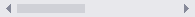 既定のスクロール バー

| 要素 | トークン名: Category.color |
| --- | --- |
| スクロール バー | `Environment.ScrollBarBackground` |
| 前景 (つまみ) | `Environment.ScrollBarThumbBackground` |

**スクロール バー: ホバー時**

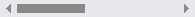 ホバー時のスクロール バー

| 要素 | トークン名: Category.color |
| --- | --- |
| スクロール バー | `Environment.ScrollBarBackground` |
| 前景 (つまみ) | `Environment.ScrollBarThumbMouseOverBackground` |

*スクロール バー: 押された状態**

 押されたスクロール バー

| 要素 | トークン名: Category.color |
| --- | --- |
| スクロール バー | `Environment.ScrollBarBackground` |
| 前景 (つまみ) | `Environment.ScrollBarThumbPressedBackground` |

**スクロール バーの矢印: 既定の状態**

 スクロール バーの既定の矢印

| 要素 | トークン名: Category.color |
| --- | --- |
| 背景 | `Environment.ScrollBarArrowBackground` (スクロール バーと同じ色に設定されます。) |
| 前景 (グリフ) | `Environment.ScrollBarArrowGlyph` |

**スクロール バーの矢印: ホバー状態**

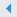 ホバー時のスクロール バーの矢印

| 要素 | トークン名: Category.color |
| --- | --- |
| 背景 | `Environment.ScrollBarArrowMouseOverBackground` (スクロール バーと同じ色に設定されます。) |
| 前景 (グリフ) | `Environment.ScrollBarArrowGlyphMouseOver` |

**スクロール バーの矢印: 押された状態**

 スクロール バーの押された矢印

| 要素 | トークン名: Category.color |
| --- | --- |
| 背景 | `Environment.ScrollBarArrowPressedBackground` (スクロール バーと同じ色に設定されます。) |
| 前景 (グリフ) | `Environment.ScrollBarArrowGlyphPressed` |

### 検索ボックス
可能な場合は常に、Visual Studio 環境で提供されるコモン検索コントロールを使用します。 検索ボックスの色は、入力フィールド、動作設定ボタン、ドロップダウン ボタン、ドロップダウン メニューのトークン名が格納されている **ShellColors.pkgdef** ファイルの "SearchControl" カテゴリにあります。

検索ボックスは次の複数の状態のいずれかの場合があり、一部の状態は相互に排他的です。

- "フォーカスされている" または "フォーカスされていない" は、カーソルがテキスト ボックス内にあるかどうかを示します。

- "アクティブ" または "非アクティブ" は、ユーザーがテキスト ボックスに検索クエリを入力したかどうかを示します。

- "ホバー" は、ユーザーがマウスを使用して検索ボックスの上にマウス ポインターを置いたことを意味します (この状態は他のすべての状態よりもオーバーライドされます)。

- "無効" は、現在のコンテキストに対して検索機能がオフになっていることを意味します。

 検索ボックス (赤線)

| 使用する ... | 使用しない ... |
| --- | --- |
| ... カスタム検索ボックスを設計する場合。 | ... 検索ボックス以外のすべてのもの。 |
| | ... 検索ボックスの UI と常に合わせる必要がないすべてのもの。 |

**フォーカスされた検索入力フィールド**

 フォーカスされた検索入力フィールド

| 要素 | トークン名: Category.color |
| --- | --- |
| 背景 | `SearchControl.FocusedBackground` |
| 前景 (テキスト) | `SearchControl.FocusedBackground` |
| 境界線 | `SearchControl.FocusedBorder` |
| 区切り記号 | `SearchControl.FocusedDropDownSeparator` |

**フォーカスされてない、アクティブな検索入力フィールド**

 フォーカスされてない、アクティブな検索入力フィールド

| 要素 | トークン名: Category.color |
| --- | --- |
| 背景 | `SearchControl.SearchActiveBackground` |
| 前景 (テキスト) | `SearchControl.SearchActiveBackground` |
| 境界線 | `SearchControl.UnfocusedBorder` |
| 区切り記号 | `SearchControl.DropDownSeparator` |

**フォーカスされてない、アクティブでない検索入力フィールド**

 フォーカスされてない、アクティブでない検索入力フィールド

| 要素 | トークン名: Category.color |
| --- | --- |
| 背景 | `SearchControl.Unfocused` |
| 前景 (テキスト) | `SearchControl.Unfocused` |
| 境界線 | `SearchControl.UnfocusedBorder` |
| 区切り記号 | `SearchControl.DropDownSeparator` |

**強調表示された検索入力フィールド (テキストのみ)**

 強調表示された検索入力フィールド

| 要素 | トークン名: Category.color |
| --- | --- |
| 背景 | `SearchControl.Selection` |
| 前景 (テキスト) | `SearchControl.FocusedBackground` |
| 境界線 | なし |
| 区切り記号 | `SearchControl.FocusedDropDownSeparator` |

**無効にされた検索入力フィールド**

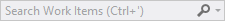 無効にされた検索入力フィールド

| 要素 | トークン名: Category.color |
| --- | --- |
| 背景 | `SearchControl.Disabled` |
| 前景 (テキスト) | `SearchControl.Disabled` |
| 境界線 | `SearchControl.DisabledBorder` |
| 区切り記号 | `SearchControl.DropDownSeparator` |

**フォーカスされた検索操作ボタン**

 フォーカスされた検索操作ボタン

| 要素 | トークン名: Category.color |
| --- | --- |
| 背景 | なし |
| 前景 (検索グリフ) | `SearchControl.SearchGlyph` |
| 前景 (停止グリフ) | `SearchControl.StopGlyph` |
| 前景 (クリア グリフ) | `SearchControl.ClearGlyph` |
| 境界線 | 該当なし |

**フォーカスされていない検索操作ボタン**

 フォーカスされていない検索操作ボタン

| 要素 | トークン名: Category.color |
| --- | --- |
| 背景 | 該当なし |
| 前景 (検索グリフ) | `SearchControl.SearchGlyph` |
| 前景 (停止グリフ) | `SearchControl.StopGlyph` |
| 前景 (クリア グリフ) | `SearchControl.ClearGlyph` |
| 境界線 | 該当なし |

**押された検索操作ボタン**

 押された検索操作ボタン

| 要素 | トークン名: Category.color |
| --- | --- |
| 背景 | `SearchControl.ActionButtonMouseDown` |
| 前景 (グリフ) | `SearchControl.ActionButtonMouseDownGlyph` |
| 境界線 | `SearchControl.ActionButtonMouseDownBorder` |

**無効にされた検索操作ボタン**

 無効にされた検索操作ボタン

| 要素 | トークン名: Category.color |
| --- | --- |
| 背景 | なし |
| 前景 (グリフ) | `SearchControl.ActionButtonDisabledGlyph` |
| 境界線 | なし |

**フォーカスされた検索ドロップダウン ボタン**

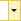 フォーカスされた検索ドロップダウン ボタン

| 要素 | トークン名: Category.color |
| --- | --- |
| 背景 | `SearchControl.FocusedDropDownButton` |
| 前景 (グリフ) | `SearchControl.FocusedDropDownButtonGlyph` |
| 境界線 | `SearchControl.FocusedDropDownButtonBorder` |

**フォーカスされていない検索ドロップダウン ボタン**

 フォーカスされていない検索ドロップダウン ボタン

| 要素 | トークン名: Category.color |
| --- | --- |
| 背景 | `SearchControl.UnfocusedDropDownButton` |
| 前景 (グリフ) | `SearchControl.UnfocusedDropDownButtonGlyph` |
| 境界線 | `SearchControl.UnfocusedDropDownButtonBorder` |

**押された検索ドロップダウン ボタン**

 押された検索ドロップダウン ボタン

| 要素 | トークン名: Category.color |
| --- | --- |
| 背景 | `SearchControl.MouseDownDropDownButton` |
| 前景 (グリフ) | `SearchControl.MouseDownDropDownButtonGlyph` |
| 境界線 | `SearchControl.MouseDownDropDownButtonBorder` |

**無効にされた検索ドロップダウン ボタン**

 無効にされた検索ドロップダウン ボタン

| 要素 | トークン名: Category.color |
| --- | --- |
| 背景 | なし |
| 前景 (グリフ) | `SearchControl.DisabledDownButtonGlyph` |
| 境界線 | なし |

#### 検索ドロップダウン リスト
検索ボックスのドロップダウン メニューは、Visual Studio の他のドロップダウン メニューより少し複雑になる可能性があります。 "提案される検索" と "検索オプション" の各セクションは、メニューに単独または一緒に表示され、それぞれに別の色が付けられます。 これらの 2 つのセクションが一緒に表示される場合は線で区切られ、ドロップダウン メニュー全体が境界線で囲まれます。

 検索ドロップダウン リスト (赤線)

| 使用する ... | 使用しない ... |
| --- | --- |
| ... カスタム検索ドロップダウン リストを作成する場合。 | ... 他のコンテキストで表示されるドロップダウン リスト。 |
| ... 正しいリスト コンポーネントの正しいトークン名。 | ... 指定以外の背景と前景の組み合わせ。 |

**検索ドロップダウン リストの要素**

| 要素 | トークン名: Category.color |
| --- | --- |
| 境界線 | `SearchControl.PopupBorder` |
| 区切り記号 | `SearchControl.PopupSectionHeaderSeparator` |
| シャドウ | `Environment.DropShadowBackground` |

**提案される検索: 既定の状態**

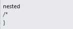 既定の提案される検索

| 要素 | トークン名: Category.color |
| --- | --- |
| 背景 | `SearchControl.PopupItemsListBackgroundGradientBegin` (このトークンのグラデーション境界はテーマ付き UI では使用されません。) |
| 前景 (テキスト) | `SearchControl.PopupItemText` |

**提案される検索: ホバー状態**

 ホバー時の提案される検索

| 要素 | トークン名: Category.color |
| --- | --- |
| 背景 | `SearchControl.PopupControlMouseOverBackgroundGradientBegin` (このトークンのグラデーション境界はテーマ付き UI では使用されません。) |
| 前景 (テキスト) | `SearchControl.PopupMouseOverItemText` |
| 境界線 | `SearchControl.PopupControlMouseOverBorder` |

**検索オプション: 既定の状態**

 既定の検索オプション (チェック ボックス)

 既定の検索オプション (リンク)

| 要素 | トークン名: Category.color |
| --- | --- |
| 背景 | `SearchControl.PopupSectionBackgroundGradientBegin` (このトークンのグラデーション境界はテーマ付き UI では使用されません。) |
| 前景 (チェック ボックス テキスト) | `SearchControl.PopupCheckboxText` |
| 前景 (リンク テキスト) | `SearchControl.PopupButtonText` |
| ヘッダーの背景 | `SearchControl.PopupSectionHeaderGradientBegin` (このトークンのグラデーション境界はテーマ付き UI では使用されません。) |
| 前景 (ヘッダー テキスト) | `SearchControl.PopupSectionHeaderText` |

**検索オプション: ホバー状態**

 ホバー時の検索オプション (チェック ボックス)

 ホバー時の検索オプション (リンク)

| 要素 | トークン名: Category.color |
| --- | --- |
| 背景 | `SearchControl.PopupControlMouseOverBackgroundGradientBegin` (このトークンのグラデーション境界はテーマ付き UI では使用されません。) |
| 前景 (チェック ボックス テキスト) | `SearchControl.PopupCheckboxMouseDownText` |
| 前景 (リンク テキスト) | `SearchControl.PopupButtonMouseDownText` |
| 境界線 | `SearchControl.PopupControlMouseOverBorder` |

**検索オプション: 押された状態**

 押された検索オプション (チェック ボックス)

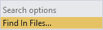 押された検索オプション (リンク)

| 要素 | トークン名: Category.color |
| --- | --- |
| チェック ボックスの背景 | `SearchControl.PopupControlMouseDownBackgroundGradientBegin` `SearchControl.PopupControlMouseDownBackgroundGradientEnd` (このトークンのグラデーション境界はテーマ付き UI では使用されません。) |
| 前景 (チェック ボックス テキスト) | `SearchControl.PopupCheckboxMouseDownText` |
| リンクの背景 | `SearchControl.PopupButtonMouseDownBackgroundGradientBegin` (このトークンのグラデーション境界はテーマ付き UI では使用されません。) |
| 前景 (リンク テキスト) | `SearchControl.PopupButtonMouseDownText` |

###  ツリー ビュー
ソリューション エクスプローラー、サーバー エクスプローラー、クラス ビューなど、いくつかのツール ウィンドウでは、色が `TreeView` カテゴリの色の名前によって制御される階層組織スキームが実装されます。 ツリー ビューのすべての項目に背景色とテキスト色があります。 入れ子にされた子要素がある項目には、項目が展開されているか折りたたまれているかを示すグリフもあります。

 ツリー ビュー (赤線)

| 使用する ... | 使用しない ... |
| --- | --- |
| ... 階層組織ビューを実装する必要があるすべての場所。 | ... ツリー ビューに類似していないすべてのもの。 |
| | ... 指定以外の背景と前景の組み合わせ。 |

**ツリー ビュー項目: 既定の状態**

 既定のツリー ビュー項目

| 要素 | トークン名: Category.color |
| --- | --- |
| 背景 | `TreeView.Background` |
| 前景 (テキスト) | `TreeView.Background` |
| 前景 (グリフ) | `TreeView.Glyph` |
| 境界線 | なし |

**ツリー ビュー項目: ホバー状態**

 ホバー時のツリー ビュー項目

| 要素 | トークン名: Category.color |
| --- | --- |
| 背景 | `TreeView.Background` |
| 前景 (テキスト) | `TreeView.Background` |
| 前景 (グリフ) | `TreeView.GlyphMouseOver` |
| 境界線 | なし |

**ツリー ビュー項目: ドラッグ状態**

 ツリー ビュー項目: ドラッグ状態

| 要素 | トークン名: Category.color |
| --- | --- |
| 背景 | `TreeView.DragOverItem` |
| 前景 (テキスト) | `TreeView.DragOverItem` |
| 前景 (グリフ) | `TreeView.DragOverItemGlyph` |
| 境界線 | なし |

**ツリー ビュー項目: 選択され、フォーカスされた状態**

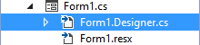 選択およびフォーカスされたツリー ビュー項目

| 要素 | トークン名: Category.color |
| --- | --- |
| 背景 | `TreeView.SelectedItemActive` |
| 前景 (テキスト) | `TreeView.SelectedItemActive` |
| 前景 (グリフ) | `TreeView.SelectedItemActiveGlyph` |
| 境界線 | `TreeView.FocusVisualBorder` |

**ツリー ビュー項目: 選択され、フォーカスされていない状態**

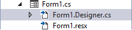 選択され、フォーカスされていないツリー ビュー項目

| 要素 | トークン名: Category.color |
| --- | --- |
| 背景 | `TreeView.SelectedItemInactive` |
| 前景 (テキスト) | `TreeView.SelectedItemInactive` |
| 前景 (グリフ) | `TreeView.SelectedItemInactiveGlyph` |
| 境界線 | なし |

**ツリー ビュー項目: 選択およびフォーカスされたホバー状態**

 選択およびフォーカスされたホバー時のツリー ビュー項目

| 要素 | トークン名: Category.color |
| --- | --- |
| 背景 | `TreeView.SelectedItemActive` |
| 前景 (テキスト) | `TreeView.SelectedItemActive` |
| 前景 (グリフ) | `TreeView.SelectedItemActiveGlyphMouseOver` |
| 境界線 | `TreeView.FocusVisualBorder` |

**ツリー ビュー項目: 選択され、フォーカスされていないホバー状態**

 選択され、フォーカスされていないホバー時のツリー ビュー項目

| 要素 | トークン名: Category.color |
| --- | --- |
| 背景 | `TreeView.SelectedItemInactive` |
| 前景 (テキスト) | `TreeView.SelectedItemInactive` |
| 前景 (グリフ) | `TreeView.SelectedItemActiveGlyphMouseOver` |
| 境界線 | なし |

## シェルの外観

### 背景
環境の背景色は、2 つのレイヤーで構成されます。 下部レイヤーは、IDE 全体にわたる単色です。 上部レイヤーは、コマンド シェルフの下、および IDE の左端と右端のツール ウィンドウ自動非表示チャネルの間に収まります。 上部と下部の背景レイヤーは、ライト テーマとダーク テーマで同じ色に設定されます。

 Visual Studio シェル背景 (赤線)

| 使用する ... | 使用しない ... |
| --- | --- |
| ... Visual Studio 環境の背景に合わせる場所。 | ... 背景サーフェイスではない場所の塗りつぶしとして。 |
| | ... 前景要素を配置する背景として。 |

**下部レイヤー シェルの外観**

| 要素 | トークン名: Category.color |
| --- | --- |
| 背景 | `Environment.EnvironmentBackground` |

**上部レイヤー シェルの外観**

> グラデーション境界は、Visual Studio 2013 のライト テーマとダーク テーマで同じ色の値に設定されます。

| 要素 | トークン名: Category.color |
| --- | --- |
| 背景 | `Environment.EnvironmentBackgroundGradientBegin` `Environment.EnvironmentBackgroundGradientEnd` `Environment.EnvironmentBackgroundGradientMiddle1` `Environment.EnvironmentBackgroundGradientMiddle2` |

### コマンド シェルフ
コマンド シェルフの背景には 2 セットのトークン名が使用されます。1 セットはメニュー バーが位置する場所、もう 1 セットはコマンド バーが位置する場所に使用されます。 個々のコマンド バー グループには、独自の背景色値があります。これについては「コマンド バー」セクションで詳しく説明しています。 メニュー バーとコマンド バーのテキストについては、それぞれメニューとコマンド バーのセクションで説明しています。

 Visual Studio コマンド シェルフ (赤線)

| 使用する ... | 使用しない ... |
| --- | --- |
| ... メニューまたはツール バーを配置する領域。 | ... コマンド シェルフに類似していない領域。 |
|... 正しい背景/前景トークン名の組み合わせと共に。 | |

**コマンド シェルフのメニュー バー**

> グラデーション境界は、Visual Studio 2013 のライト テーマとダーク テーマで同じ色の値に設定されます。

| 要素 | トークン名: Category.color |
| --- | --- |
| 背景 | `Environment.CommandShelfHighlightGradientBegin`  `Environment.CommandShelfHighlightGradientMiddle` `Environment.CommandShelfHighlightGradientEnd` |

**コマンド シェルフのコマンド バー**

> グラデーション境界は、Visual Studio 2013 のライト テーマとダーク テーマで同じ色の値に設定されます。

| 要素 | トークン名: Category.color |
| --- | --- |
| 背景 | `Environment.CommandShelfBackgroundGradientBegin` `Environment.CommandShelfBackgroundGradientMiddle` `Environment.CommandShelfBackgroundGradientEnd` |

## マニフェスト デザイナー
マニフェスト デザイナーは、Windows 8 および Windows Phone 8 プロジェクトのマニフェスト ファイルを編集しやすくするための手段として設計されています。 使用可能な共有フレームワークはありませんが、向き/ナビゲーション タブと全体的な構造のデザイン レイアウトおよび色を一致させることが適切な場合があります。 レイアウトの詳細については、「 [Layout for Visual Studio](../../extensibility/ux-guidelines/layout-for-visual-studio.md)」を参照してください。

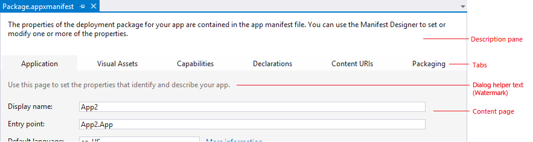 マニフェスト デザイナー (赤線)

| 使用する ... | 使用しない ... |
| --- | --- |
| ... マニフェスト デザイナーと同様のデザイナー。 | ... 7 つ以上のタブがある場合。 |
| ... ドキュメント ウェル内のエディターの上部でコモン タブ コントロールを使用する代わり。 | ... マニフェスト デザイナーのように構造化されていないすべての UI。 |

**マニフェスト デザイナーの選択されたタブ: 既定の状態**

| 要素 | トークン名: Category.color |
| --- | --- |
| 背景 | `ManifestDesigner.TabActive` |
| 境界線 | なし |

**マニフェスト デザイナーの選択された説明ペイン: 既定の状態**

| 要素 | トークン名: Category.color |
| --- | --- |
| 背景 | `ManifestDesigner.DescriptionPane` |

**マニフェスト デザイナーの選択されたコンテンツ ページ: 既定の状態**

| 要素 | トークン名: Category.color |
| --- | --- |
| 背景 | `ManifestDesigner.Background` |
| ダイアログ ヘルパー テキスト | `ManifestDesigner.WatermarkText` (このトークン名はその機能と合っていません。) |

**マニフェスト デザイナー タブ: 選択されていない状態**

| 要素 | トークン名: Category.color |
| --- | --- |
| 背景 | `ManifestDesigner.Tab.Inactive` |

**マニフェスト デザイナー タブ: ホバー状態**

| 要素 | トークン名: Category.color |
| --- | --- |
| 背景 | `ManifestDesigner.Tab.Mouseover` |

## コマンドの構造

###  メニュー
メニューは、メイン メニュー バー、ドキュメントまたはツール ウィンドウへの埋め込み、IDE 全体のさまざまな場所での右クリックなど、Visual Studio 内の複数の場所で表示することができます。 他の UI 要素に関連付けられたメニューの実装については、それぞれの要素のセクションで説明します。 Visual Studio 環境で提供される標準のメニュー実装を常に使用してください。 ただし、まれに、標準の Visual Studio メニューにアクセスできないことがあります。 このような場合は、次のトークン名を使用して、UI が Visual Studio の他のメニューと一貫性を保つようにします。

 Visual Studio のメニュー (赤線)

| 使用する ... | 使用しない ... |
| --- | --- |
| ... カスタム メニューを作成する必要がある場合。| ... 背景色単独の場合。 常に指定された背景と前景の組み合わせを使用します。 |
| ... Visual Studio メニューと合わせる新しい UI コンポーネントがある場合。| |

#### メニュー タイトル
メニュー タイトルは、背景、境界線、タイトル テキスト、および通常、メニューがコマンド バーにあるときは、オプションのグリフで構成されます。

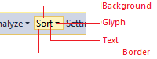 メニュー タイトル (赤線)

| 使用する ... | 使用しない ... |
| --- | --- |
| ... カスタム メニュー タイトルを作成する場合。 | ... メニュー タイトルと常に合わせる必要がないすべてのもの。 |
| | ... 指定以外の背景と前景の組み合わせ。 |

**メニュー タイトル: 既定の状態**

 既定のメニュー タイトル

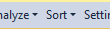 グリフを含む既定のメニュー タイトル

| 要素 | トークン名: Category.color |
| --- | --- |
| 背景 | なし |
| 前景 (テキスト) | `Environment.CommandBarTextActive` |
| 前景 (グリフ) | `Environment.CommandBarMenuGlyph` |
| 境界線 | なし |

**メニュー タイトル: ホバー状態**

 ホバー時のメニュー タイトル

 ホバー時のグリフのメニュー タイトル

| 要素 | トークン名: Category.color |
| --- | --- |
| 背景 | `Environment.CommandBarMouseOverBackgroundBegin` (このトークンのグラデーション境界はテーマ付き UI では使用されません。) |
| 前景 (テキスト) | `Environment.CommandBarTextHover` |
| 前景 (グリフ) | `Environment.CommandBarMenuMouseOverGlyph` |
| 境界線 | `Environment.CommandBarBorder` |

**メニュー タイトル: 押された状態**

 押されたメニュー タイトル

 グリフを含む押されたメニュー タイトル

| 要素 | トークン名: Category.color |
| --- | --- |
| 背景 | `Environment.CommandBarMenuBackgroundGradientBegin` (このトークンのグラデーション境界はテーマ付き UI では使用されません。) |
| 前景 (テキスト) | `Environment.CommandBarTextActive` |
| 前景 (グリフ) | `Environment.CommandBarMenuMouseDownGlyph` |
| 境界線 | `Environment.CommandBarMenuBorder` (左側、上部、右側のみ。) |

**メニュー タイトル: 無効な状態**

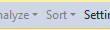 グリフを含む無効にされたメニュー タイトル

| 要素 | トークン名: Category.color |
| --- | --- |
| 背景 | なし |
| 前景 (テキスト) | `Environment.CommandBarTextInactive` |
| 前景 (グリフ) | `Environment.CommandBarTextInactive` |
| 境界線 | なし |

#### メニュー項目
個々のメニュー項目は、メニュー テキストとオプションのアイコン、チェック ボックス、またはサブメニュー グリフで構成されます。 その背景色とテキストの色はホバー時に変化します。 この色トークンは、背景と前景のペアです。

| 使用する ... | 使用しない ... |
|---|---|
| ... メニュー バーまたはコマンド バーから起動されるドロップダウン リスト。 | ... 別のコンテキストのすべてのドロップダウン リスト。 |
| | ... 指定以外の背景と前景の組み合わせ。 |

**メニュー項目: 既定の状態**

 既定のメニュー項目

| 要素 | トークン名: Category.color |
| --- | --- |
| 背景 | `Environment.CommandBarMenuBackgroundGradientBegin` (このトークンのグラデーション境界はテーマ付き UI では使用されません。) |
| 前景 (テキスト) | `Environment.CommandBarTextActive` |
| 前景 (サブメニュー グリフ) | `Environment.CommandBarMenuSubmenuGlyph` |
| 境界線 | `Environment.CommandBarMenuBorder` |
| アイコン チャネルの背景 | `Environment.CommandBarMenuIconBackground` |
| 区切り記号 | `Environment.CommandBarMenuSeparator` |
| シャドウ | `Environment.DropShadowBackground` |

**メニュー項目: チェックおよび選択された状態**

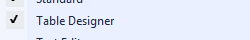 チェックされたメニュー項目

 選択されたメニュー項目

| 要素 | トークン名: Category.color |
| --- | --- |
| チェック マーク | `Environment.CommandBarCheckBox` |
| チェック マークの背景 | `Environment.CommandBarSelectedIcon` |
| アイコンの背景 | `Environment.CommandBarSelected` |
| アイコンの境界線 | `Environment.CommandBarSelectedBorder` |

**メニュー項目: ホバー状態**

 ホバー時のメニュー項目

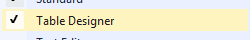 チェックされたホバー時のメニュー項目

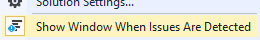 選択されたホバー時のメニュー項目

| 要素 | トークン名: Category.color |
| --- | --- |
| 背景 | `Environment.CommandBarMenuItemMouseOver` |
| 前景 (テキスト) | `Environment.CommandBarMenuItemMouseOverText` |
| 前景 (サブメニュー グリフ) | `Environment.CommandBarMenuMouseOverSubmenuGlyph` |
| チェック マーク | `Environment.CommandBarCheckBoxMouseOver` |
| チェック マークの背景 | `Environment.CommandBarHoverOverSelectedIcon` |
| アイコンの背景 | `Environment.CommandBarHoverOverSelected` |
| アイコンの境界線 | `Environment.CommandBarHoverOverSelectedIconBorder` |

**メニュー項目: 無効な状態**

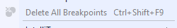 無効にされたメニュー項目

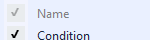 無効にされたチェックマーク付きメニュー項目

| 要素 | トークン名: Category.color |
| --- | --- |
| 前景 (テキスト) | `Environment.CommandBarTextInactive` |
| 前景 (サブメニュー グリフ) | `Environment.CommandBarMenuSubmenuGlyph` |
| チェック マーク | `Environment.CommandBarCheckBoxDisabled` |
| チェック マークの背景 | `Environment.CommandBarSelectedIconDisabled` |

### コマンド バー
コマンド バーは、Visual Studio IDE 内の複数の場所、特にコマンド シェルフ、およびツールまたはドキュメント ウィンドウへの埋め込みで表示できます。

通常は、Visual Studio 環境で提供される標準のコマンド バー実装を常に使用してください。 標準メカニズムを使用すると、すべての表示の詳細が正しく表示され、対話型要素が他の Visual Studio のコマンド バーのコントロールと一貫して動作するようになります。 ただし、独自のコマンド バーを作成する必要がある場合は、次のトークン名を使用してスタイルを正しく設定してください。

 コマンド バー (赤線)

 オーバーフロー ボタン (赤線)

| 使用する ... | 使用しない ... |
| --- | --- |
| ... 埋め込みコマンド バーが必要だが、標準の Visual Studio のコマンド バー実装を使用できない場所。 | ... コマンド バーに類似していない UI 要素。 |
| | ... トークン名が指定されているもの以外のコマンド バー コンポーネント。 |

#### コマンド バー グループ
コマンド バー グループは、関連する一連のコマンド バー コントロールで構成され、任意の数のボタン、分割ボタン、ドロップダウン メニュー、コンボ ボックス、またはメニューを含めることができます。 これらのコントロールの色は別々のトークン名によって制御され、このガイドの他の場所で個別に説明されています。 区切り線を使用して、コマンド バー グループを関連するサブグループに分割します。

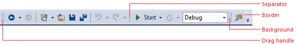 コマンド バー グループ (赤線)

| 使用する ... | 使用しない ... |
| --- | --- |
| ... 埋め込みコマンド バーが必要だが、標準の Visual Studio のコマンド バー実装を使用できない場所。 | ... コマンド バーに類似していない UI 要素。 |
| | ... トークン名が指定されているもの以外のコマンド バー コンポーネント。 |

**コマンド バー グループ: 既定の状態**

| 要素 | トークン名: Category.color |
| --- | --- |
| 背景 | `Environment.CommandBarGradientBegin` (このトークンのグラデーション境界はテーマ付き UI では使用されません。) |
| 境界線 | `Environment.CommandBarToolBarBorder` |
| ドラッグ ハンドル | `Environment.CommandBarDragHandle` |
| 区切り記号 | `Environment.CommandBarToolBarSeparator` `Environment.CommandBarToolBarSeparatorHighlight` |

#### コマンド アイコン
 コマンド アイコン (赤線)

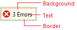 テキスト付きコマンドアイコン (赤線)

| 使用する ... | 使用しない ... |
| --- | --- |
| ... コマンド バーに配置されるボタン。 | ... 独自のトークン名があるコントロール。 |
| | ... 指定以外の背景と前景の組み合わせ。 |

**コマンド アイコン: 既定の状態**

 既定のコマンド アイコン

| 要素 | トークン名: Category.color |
| --- | --- |
| 背景 | 該当なし (コマンド バーの背景から継承) |
| 前景 (テキスト) | `Environment.CommandBarTextActive` |
| 境界線 | 該当なし |

**コマンド アイコン: 選択された既定の状態**

 既定の選択されたコマンド アイコン

| 要素 | トークン名: Category.color |
| --- | --- |
| 背景 | `Environment.CommandBarSelected` |
| 前景 (テキスト) | `Environment.CommandBarTextSelected` |
| 境界線 | `Environment.CommandBarSelectedBorder` |

**コマンド アイコン: ホバーまたはフォーカス状態**

 ホバー時またはフォーカス時のコマンド アイコン

| 要素 | トークン名: Category.color |
| --- | --- |
| 背景 | `Environment.CommandBarMouseOverBackgroundBegin` (このトークンのグラデーション境界はテーマ付き UI では使用されません。) |
| 前景 (テキスト) | `Environment.CommandBarTextHover` |
| 境界線 | `Environment.CommandBarBorder` |

**コマンド アイコン: 選択されているホバーまたはフォーカス状態**

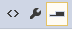 ホバー時またはフォーカス時の選択されているコマンド アイコン

| 要素 | トークン名: Category.color |
| --- | --- |
| 背景 | `Environment.CommandBarHoverOverSelected` |
| 前景 (テキスト) | `Environment.CommandBarTextHoverOverSelected` |
| 境界線 | `Environment.CommandBarHoverOverSelectedIconBorder` |

 **コマンド アイコン: 押された状態**

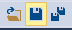 押されているコマンド アイコン

| 要素 | トークン名: Category.color |
| --- | --- |
| 背景 | `Environment.CommandBarMouseDownBackgroundBegin` (このトークンのグラデーション境界はテーマ付き UI では使用されません。) |
| 前景 (テキスト) | `Environment.CommandBarTextMouseDown` |
| 境界線 | `Environment.CommandBarBorder` |

**コマンド アイコン: 無効な状態**

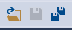 無効化されたコマンド アイコン

| 要素 | トークン名: Category.color |
| --- | --- |
| 背景 | 該当なし (コマンド バーの背景から継承) |
| 前景 (テキスト) | `Environment.CommandBarTextInactive` |
| 境界線 | 該当なし |

####  コマンド バーのコンボ ボックス

> [!IMPORTANT]
> コンボ ボックスはドロップダウンに似ていますが、編集可能なテキスト領域が含まれます。 ドロップダウンに編集可能なテキスト領域が含まれていない場合は、[コマンド バーのドロップダウン](../../extensibility/ux-guidelines/shared-colors-for-visual-studio.md#BKMK_CommandDropDown)の色トークンを使用します。

 コマンド バーのコンボ ボックス (赤線)

| 使用する ... | 使用しない ... |
| --- | --- |
| ... カスタム コンボ ボックスを作成する場合。 | ... コマンド バー UI と常に合わせる必要がないすべてのもの。 |
| ... コンボ ボックスに類似したコマンド バー コントロールを作成する場合。 | ... スタイル設定されたコンボ ボックスにアクセスできる場合。 |

**コマンド バーのコンボ ボックスの入力フィールド: 既定の状態**

 コマンド バーのコンボ ボックスの入力フィールド

| 要素 | トークン名: Category.color |
| --- | --- |
| 背景 | `Environment.ComboBoxBackground` |
| 前景 (テキスト) | `Environment.ComboBoxText` |
| 境界線 | `Environment.ComboBoxBorder` |
| 区切り記号 | 区切り記号なし |

**コマンド バーのドロップダウン ボタン: 既定の状態**

 コマンド バーのドロップダウン ボタン

| 要素 | トークン名: Category.color |
| --- | --- |
| 背景 | 該当なし (コマンド バーの背景から継承) |
| 前景 (グリフ) | `Environment.ComboBoxGlyph` |

**コマンド バーのドロップダウン リスト: 既定の状態**

 コマンド バーのドロップダウン リスト

| 要素 | トークン名: Category.color |
| --- | --- |
| 背景 | `Environment.ComboBoxPopupBackgroundBegin` (このトークンのグラデーション境界はテーマ付き UI では使用されません。) |
| 前景 (テキスト) | `Environment.ComboBoxItemText` |
| 境界線 | `Environment.ComboBoxPopupBorder` |

**コマンド バーのコンボ ボックスの入力フィールド: ホバー状態**

 ホバー時のコマンド バーのコンボ ボックスの入力フィールド

| 要素 | トークン名: Category.color |
| --- | --- |
| 背景 | `Environment.ComboBoxMouseOverBackgroundBegin` (このトークンのグラデーション境界はテーマ付き UI では使用されません。) |
| 前景 (テキスト) | `Environment.ComboBoxMouseOverText` |
| 境界線 | `Environment.ComboBoxMouseOverBorder` |
| 区切り記号 | `Environment.ComboBoxMouseOverSeparator` |

 **コマンド バーのドロップダウン ボタン: ホバー状態**

 ホバー時のコマンド バーのドロップダウン ボタン

| 要素 | トークン名: Category.color |
| --- | --- |
| 背景 | `Environment.ComboBoxButtonMouseOverBackground` |
| 前景 (グリフ) | `Environment.ComboBoxMouseOverGlyph` |

**コマンド バーのドロップダウン リスト: ホバー状態**

  ホバー時のコマンド バーのドロップダウン リスト

| 要素 | トークン名: Category.color |
| --- | --- |
| 背景 (メニュー項目) | `Environment.ComboBoxItemMouseOverBackground` |
| 前景 (テキスト) | `Environment.ComboBoxItemMouseOverText` |
| 境界線 (メニュー項目) | `Environment.ComboBoxItemMouseOverBorder` |

 **コマンド バー コンボ ボックスの入力フィールド: フォーカス状態**

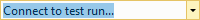 コマンド バーのコンボ ボックスのフォーカスされた入力フィールド

| 要素 | トークン名: Category.color |
| --- | --- |
| 背景 | `Environment.ComboBoxFocusedBackground` |
| 前景 (テキスト) | `Environment.ComboBoxFocusedText` |
| 境界線 | `Environment.ComboBoxFocusedBorder` |
| 区切り記号 | `Environment.ComboBoxFocusedButtonSeparator` |

**コマンド バーのドロップダウンボタン: フォーカス状態**

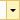 コマンド バーのフォーカスされたドロップダウン ボタン

| 要素 | トークン名: Category.color |
| --- | --- |
| 背景 | `Environment.ComboBoxFocusedButtonBackground` |
| 前景 (グリフ) | `Environment.ComboBoxFocusedGlyph` |

 **コマンド バー コンボ ボックスの入力フィールド: 押された状態**

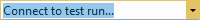 コマンド バーのコンボ ボックスの押された入力フィールド

| 要素 | トークン名: Category.color |
| --- | --- |
| 背景 | `Environment.ComboBoxMouseDownBackground` |
| 前景 (テキスト) | `Environment.ComboBoxMouseDownText` |
| 境界線 | `Environment.ComboBoxMouseDownBorder` |
| 区切り記号 | `Environment.ComboBoxMouseDownSeparator` |

**コマンド バーのドロップダウンボタン: 押された状態**

 コマンド バーの押されたドロップダウン ボタン

| 要素 | トークン名: Category.color |
| --- | --- |
| 背景 | `Environment.ComboBoxButtonMouseDownBackground` |
| 前景 (グリフ) | `Environment.ComboBoxMouseDownGlyph` |

**コマンド バーのコンボ ボックスの入力フィールド: 無効な状態**

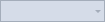 コマンド バーのコンボ ボックスの無効にされた入力フィールド

| 要素 | トークン名: Category.color |
| --- | --- |
| 背景 | `Environment.ComboBoxDisabledBackground` |
| 前景 (テキスト) | `Environment.ComboBoxDisabledText` |
| 境界線 | `Environment.ComboBoxDisabledBorder` |
| 区切り記号 | 区切り記号なし |

**コマンド バーのドロップダウン ボタン: 無効な状態**

 コマンド バーの無効にされたドロップダウン ボタン

| 要素 | トークン名: Category.color |
| --- | --- |
| 背景 | なし |
| 前景 (グリフ) | `Environment.ComboBoxDisabledGlyph` |

####  コマンド バーのドロップダウン

> [!IMPORTANT]
> ドロップダウンはコンボ ボックスに似ていますが、編集可能なテキスト領域がありません。 ドロップダウンに編集可能なテキスト領域が含まれる場合は、 [コマンド バーのコンボ ボックス](../../extensibility/ux-guidelines/shared-colors-for-visual-studio.md#BKMK_CommandComboBox)の色トークンを使用します。

 コマンド バーのドロップダウン (赤線)

| 使用する ... | 使用しない ... |
| --- | --- |
| ... カスタム ドロップダウン リスト コントロールを作成する場合。 | ... ドロップダウン リストに類似していないすべてのもの。 |
| | ... コンボ ボックスまたは分割ボタン。 |

**コマンド バーのドロップダウンの選択フィールド: 既定の状態**

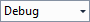 既定のコマンド バーのドロップダウンの選択フィールド

| 要素 | トークン名: Category.color |
| --- | --- |
| 背景 | `Environment.DropDownBackground` |
| 前景 (テキスト) | `DropDownText` |
| 境界線 | `DropDownBorder` |
| 区切り記号 | 区切り記号なし |

**コマンド バーのドロップダウン ボタン: 既定の状態**

 既定のコマンド バーのドロップダウン ボタン

| 要素 | トークン名: Category.color |
| --- | --- |
| 背景 | なし |
| 前景 (グリフ) | `Environment.DropDownGlyph` |

**コマンド バーのドロップダウン リスト: 既定の状態**

 既定のコマンド バーのドロップダウン リスト

| 要素 | トークン名: Category.color |
| --- | --- |
| 背景 | `Environment.DropDownPopupBackgroundBegin` (このトークンのグラデーション境界はテーマ付き UI では使用されません。) |
| 前景 (テキスト) | `Environment.ComboBoxItemText` |
| 境界線 | `Environment.DropDownPopupBorder` |
| シャドウ | `Environment.DropShadowBackground` |

**コマンド バーのドロップダウンの選択フィールド: ホバー状態**

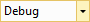 ホバー時のコマンド バーのドロップダウンの選択フィールド

| 要素 | トークン名: Category.color |
| --- | --- |
| 背景 | `Environment.DropDownMouseOverBackgroundBegin` (このトークンのグラデーション境界はテーマ付き UI では使用されません。) |
| 前景 (テキスト) | `Environment.DropDownMouseOverText` |
| 境界線 | `Environment.DropDownMouseOverBorder` |
| 区切り記号 | `Environment.DropDownButtonMouseOverSeparator` |

**コマンド バーのドロップダウン ボタン: ホバー状態**

 ホバー時のコマンド バーのドロップダウン ボタン

| 要素 | トークン名: Category.color |
| --- | --- |
| 背景 | `Environment.DropDownButtonMouseOverBackground` |
| 前景 (グリフ) | `Environment.DropDownMouseOverGlyph` |

**コマンド バーのドロップダウン リスト: ホバー状態**

 ホバー時のコマンド バーのドロップダウン リスト

| 要素 | トークン名: Category.color |
| --- | --- |
| 背景 (メニュー項目) | `Environment.ComboBoxItemMouseOverBackground` |
| 前景 (テキスト) | `Environment.ComboBoxItemMouseOverText` |
| 境界線 (メニュー項目) | `Environment.ComboBoxItemMouseOverBorder` |

 **コマンド バーのドロップダウンの選択フィールド: 押された状態**

 コマンド バーのドロップダウンの押された選択フィールド

| 要素 | トークン名: Category.color |
| --- | --- |
| 背景 | `Environment.DropDownMouseDownBackground` |
| 前景 (テキスト) | `Environment.DropDownMouseDownText` |
| 境界線 | `Environment.DropDownMouseDownBorder` |
| 区切り記号 | `Environment.DropDownButtonMouseDownSeparator` |

**コマンド バーのドロップダウンボタン: 押された状態**

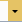 コマンド バーの押されたドロップダウン ボタン

| 要素 | トークン名: Category.color |
| --- | --- |
| 背景 | `Environment.DropDownButtonMouseDownBackground` |
| 前景 (グリフ) | `Environment.DropDownMouseDownGlyph` |

**コマンド バーのドロップダウンの選択フィールド: 無効な状態**

 コマンド バーのドロップダウンの無効にされた選択フィールド

| 要素 | トークン名: Category.color |
| --- | --- |
| 背景 | `Environment.DropDownDisabledBackground` |
| 前景 (テキスト) | `Environment.DropDownDisabledText` |
| 境界線 | `Environment.DropDownDisabledBorder` |
| 区切り記号 | 区切り記号なし |

**コマンド バーのドロップダウン ボタン: 無効な状態**

 コマンド バーの無効にされたドロップダウン ボタン

| 要素 | トークン名: Category.color |
| --- | --- |
| 背景 | 該当なし |
| 前景 (グリフ) | `Environment.DropDownDisabledGlyph` |

#### コマンド バーの分割ボタン
分割ボタンは、ボタン、メニュー、コマンド バー テキストなど、他のコマンド バー コントロールと多くのトークン名を共有します。 ここでは利便性のために、すべての必要なアクション ボタンとドロップダウン ボタンのトークン名を繰り返しています。 分割ボタンのドロップダウン リストは、コマンド バー [メニュー](../../extensibility/ux-guidelines/shared-colors-for-visual-studio.md#BKMK_CommandMenus)の実装です。

 コマンド バーの分割ボタン (赤線)

| 使用する ... | 使用しない ... |
| --- | --- |
| ... カスタム分割ボタンを作成する場合。 | ... 他の種類のボタン。 |
| | ... 指定以外の背景と前景の組み合わせ。 |

**コマンド バーの分割ボタン: 既定の状態**

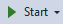 既定のコマンド バーの分割ボタン

| 要素 | トークン名: Category.color |
| --- | --- |
| 背景 | なし |
| 前景 (テキスト) | `Environment.CommandBarTextActive` |
| 前景 (グリフ) | `Environment.CommandBarSplitButtonGlyph` |
| 境界線 | 該当なし |
| 区切り記号 | 該当なし |

**コマンド バーの分割ボタン: ホバー状態**

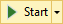 ホバー時のコマンド バーの分割ボタン

| 要素 | トークン名: Category.color |
| --- | --- |
| 背景 | `Environment.CommandBarMouseOverBackgroundBegin` (このトークンのグラデーション境界はテーマ付き UI では使用されません。) |
| 前景 (テキスト) | `Environment.CommandBarTextHover` |
| 前景 (グリフ) | `Environment.CommandBarSplitButtonMouseOverGlyph` |
| 境界線 | `Environment.CommandBarBorder` |
| 区切り記号 | `Environment.CommandBarSplitButtonSeparator` |

**コマンド バーの分割ボタン: 押された状態**

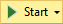 コマンド バーの押された分割ボタン

| 要素 | トークン名: Category.color |
| --- | --- |
| 背景 | `Environment.CommandBarMouseDownBackgroundBegin` (このトークンのグラデーション境界はテーマ付き UI では使用されません。) |
| 前景 (テキスト) | `Environment.CommandBarTextMouseDown` |
| 前景 (グリフ) | `Environment.CommandBarSplitButtonMouseDownGlyph` |
| 境界線 | `Environment.CommandBarBorder` |
| 区切り記号 | 該当なし |

**コマンド バーの分割ボタン: 無効な状態**

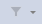 コマンド バーの無効にされた分割ボタン

| 要素 | トークン名: Category.color |
| --- | --- |
| 背景 | 該当なし |
| 前景 (テキスト) | `Environment.ComboBoxItemTextInactive` |
| 前景 (グリフ) | `Environment.CommandBarTextInactive` |
| 境界線 | 該当なし |
| 区切り記号 | 該当なし |

#### コマンド バーの "その他のオプション" ボタンと "オーバーフロー" ボタン
[その他のオプション] ボタンは、関連するコマンド バー ボタンを追加または削除して、コマンド バー グループをカスタマイズできる場合に使用します。 [オーバーフロー] ボタンは、横のスペースが不足しているためにコマンド バーが切り詰められた場合に表示され、クリックすると、表示できないコマンド バー ボタンを含むメニューが表示されます。 これら 2 つのボタンの色は、同じトークン名のセットによって制御されます。

 コマンド バーの "その他のオプション" ボタン (赤線)

| 使用する ... | 使用しない ... |
| --- | --- |
| ... カスタムの "その他のオプション" または "オーバーフロー" ボタン。 | ... "その他のオプション" または "オーバーフロー" ボタンと同様の機能を持たないボタン。 |

**コマンド バーの "その他のオプション" ボタンと "オーバーフロー" ボタン: 既定の状態**

 既定のコマンド バーの "その他のオプション" ボタン

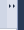 既定のコマンド バーの "オーバーフロー" ボタン

| 要素 | トークン名: Category.color |
| --- | --- |
| 背景 | `Environment.CommandBarOptionsBackground` |
| 前景 (グリフ) | `Environment.CommandBarOptionsGlyph` |

**コマンド バーの "その他のオプション" ボタンと "オーバーフロー" ボタン: ホバー状態**

 ホバー時のコマンド バーの "その他のオプション" ボタン

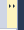 ホバー時のコマンド バーの "オーバーフロー" ボタン

| 要素 | トークン名: Category.color |
| --- | --- |
| 背景 | `Environment.CommandBarOptionsMouseOverBackgroundBegin` (このトークンのグラデーション境界はテーマ付き UI では使用されません。) |
| 前景 (グリフ) | `Environment.CommandBarOptionsMouseDownGlyph` |

**コマンド バーの "その他のオプション" ボタンと "オーバーフロー" ボタン: 押された状態**

 コマンド バーの押された "その他のオプション" ボタン

 コマンド バーの押された "オーバーフロー" ボタン

| 要素 | トークン名: Category.color |
| --- | --- |
| 背景 | `Environment.CommandBarOptionsMouseDownBackgroundBegin` (このトークンのグラデーション境界はテーマ付き UI では使用されません。) |
| 前景 (グリフ) | `Environment.CommandBarOptionsMouseDownGlyph` |

## ドキュメント ウィンドウ
ドキュメント ウィンドウ は Visual Studio 環境で提供されるため、レプリケートする必要はありません。 ただし、UI が Visual Studio 環境のこの部分と常に一貫性のある状態で表示されるように、ドキュメント ウィンドウで使用する色を活用することができます。

ドキュメント ウィンドウの色のトークンを使用する場合は、類似の要素に対してのみ、常にペアで使用するように注意してください。 そうしないと、予期しない結果が UI に生じることがあります。

### ドキュメント ウィンドウ フレーム
ドキュメント ウィンドウは IDE にドッキングしたり、別のウィンドウとしてフローティングさせたりすることができます。 ドキュメント ウィンドウは、IDE の外部にフローティングしているときも、ドキュメント ウェル内に存在し、IDE の一部であるときと同じ背景、境界線、テキスト、タブの色を持ちます。 ただし、ドキュメントは、独自の背景、境界線、テキストの色を持つフレーム内に配置されます。 ツール ウィンドウをドキュメント ウェルにドッキングした場合、ツール ウィンドウはタブの動作と色をドキュメント ウィンドウのトークン名から継承します。

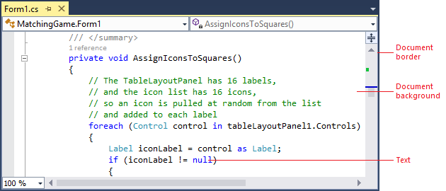 ドッキングされたドキュメント ウィンドウ (赤線)

 フローティング ドキュメント ウィンドウ (赤線)

| 使用する ... | 使用しない ... |
| --- | --- |
| ... ドキュメント ウィンドウと合わせる UI を作成するすべての場所。 | ... シェルにテーマの更新がある場合に自動的に変更しない UI。 |

**ドッキングまたはフローティング ドキュメント ウィンドウ: 既定の状態**

| 要素 | トークン名: Category.color |
| --- | --- |
| 背景 | ドキュメントの種類によって異なります |
| 前景 (テキスト) | ドキュメントの種類によって異なります |
| 境界線 | `Environment.ToolWindowBorder` |

**フォーカスされたフローティング ドキュメント ウィンドウ フレーム: 既定の状態**

 フォーカスされた既定のフローティング ドキュメント ウィンドウ フレーム

| 要素 | トークン名: Category.color |
| --- | --- |
| 背景 | `Environment.ToolWindowFloatingFrame` |
| 前景 (テキスト) | `Environment.ToolWindowFloatingFrame` |
| 前景 (グリフ) | `Environment.RaftedWindowButtonActiveGlyph` |
| 境界線 | `Environment.MainWindowActiveDefaultBorder` |
| 境界線 (グリフ) | `Environment.RaftedWindowButtonActiveBorder` (透明に設定されます) |

**フォーカスされていないフローティング ドキュメント ウィンドウ フレーム: 既定の状態**

 フォーカスされていない既定のフローティング ドキュメント ウィンドウ フレーム

| 要素 | トークン名: Category.color |
| --- | --- |
| 背景 | `Environment.ToolWindowFloatingFrameInactive` |
| 前景 (テキスト) | `Environment.ToolWindowFloatingFrameInactive` |
| 前景 (グリフ) | `Environment.RaftedWindowButtonInactiveGlyph` |
| 境界線 | `Environment.MainWindowInactiveBorder` |
| 境界線 (グリフ) | `Environment.RaftedWindowButtonInactiveBorder` (透明に設定されます) |

**フォーカスされたフローティング ドキュメント ウィンドウ フレーム: ホバー状態**

 フォーカスされたホバー時のフローティング ドキュメント ウィンドウ フレーム

| 要素 | トークン名: Category.color |
| --- | --- |
| 背景 (グリフ) | `Environment.RaftedWindowButtonHoverActive` |
| 前景 (グリフ) | `Environment.RaftedWindowButtonHoverActiveGlyph` |
| 境界線 (グリフ) | `Environment.RaftedWindowButtonHoverActiveBorder` |

**フォーカスされていないフローティング ドキュメント ウィンドウ フレーム: ホバー状態**

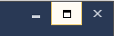 フォーカスされていないホバー時のフローティング ドキュメント ウィンドウ フレーム

| 要素 | トークン名: Category.color |
| --- | --- |
| 背景 (グリフ) | `EnvironmentRaftedWindowButtonHoverInactive` |
| 前景 (グリフ) | `Environment.RaftedWindowButtonHoverInactiveGlyph` |
| 境界線 (グリフ) | `Environment.RaftedWindowButtonHoverInactiveBorder` |

**フォーカスされたフローティング ドキュメント ウィンドウ フレーム: 押された状態**

 フォーカスされ、押されているフローティング ドキュメント ウィンドウ フレーム

| 要素 | トークン名: Category.color |
| --- | --- |
| 背景 (グリフ) | `Environment.RaftedWindowButtonDown` |
| 前景 (グリフ) | `Environment.RaftedWindowButtonDownGlyph` |
| 境界線 (グリフ) | `Environment.RaftedWindowButtonDownBorder` |

### ドキュメント タブ
ドキュメント タブはタブ チャネル内に存在し、現在どのドキュメントが開いているか、およびどのドキュメントが現在選択されているか、またはアクティブなドキュメントであるかを示します。 ツール ウィンドウも、ユーザーが配置した場合、ドキュメント タブ チャネルにドッキングできます。 この場合、ツール ウィンドウではドキュメント ウィンドウと同じタブの色が使用されます。 ドキュメント ウィンドウの色と常に一致する UI を作成する場合は (テーマの更新や、新しいテーマがインストールされた場合を含む)、これらの色のトークンを参照します。

 ドキュメント タブ (赤線)

| 使用する ... | 使用しない ... |
| --- | --- |
| ... ドキュメント タブに合わせ、テーマの更新や新しいテーマの色を自動的に取得する UI を作成するすべての場所。 | ... シェルにテーマの更新がある場合に自動的に変更しない UI。 |

#### 開いているドキュメントのタブ
開いている各ドキュメントには、ドキュメント タブ チャネルに名前を表示するタブがあります。 ドキュメントはバックグラウンドで選択したり開いたりすることができ、タブはこれらの状態を反映します。

- 選択されているタブは、現在ドキュメント ウェルに表示されているドキュメントを表します。 選択されているタブには、ドキュメント ウェルの上端にまたがって拡張するドキュメントの境界線があります。

- 背景タブは、現在選択されていないドキュメント タブです。クリックすると、それらは選択されたタブになり、トークン名からすべての背景、境界線、テキストの色を取得します。

![[ドキュメントを開く] タブ (赤線)](../../extensibility/ux-guidelines/media/0303-073_opendocumenttabredline.png "0303-073_OpenDocumentTabRedline") [ドキュメントを開く] タブ (赤線)

| 使用する ... | 使用しない ... |
| --- | --- |
| ... カスタム ドキュメント タブを作成する場合。 | ... 一時的な (プレビュー) タブ。 |
| | ... シェルにテーマの更新がある場合に自動的に変更しない UI。 |

**選択およびフォーカスされたドキュメント タブ**

 選択およびフォーカスされたドキュメント タブ

| 要素 | トークン名: Category.color |
| --- | --- |
| 背景 | `Environment.FileTabSelectedGradientTop` (このトークンのグラデーション境界はテーマ付き UI では使用されません。) |
| 前景 (テキスト) | `Environment.FileTabSelectedText` |
| 境界線 | `Environment.FileTabSelectedBorder` (背景と同じ色に設定されます。) |
| ドキュメントの境界線 | `Environment.FileTabDocumentBorderBackground` |

**選択され、フォーカスされていないドキュメント タブ**

 選択され、フォーカスされていないドキュメント タブ

| 要素 | トークン名: Category.color |
| --- | --- |
| 背景 | `Environment.FileTabInactiveGradientTop` (このトークンのグラデーション境界はテーマ付き UI では使用されません。) |
| 前景 (テキスト) | `Environment.FileTabInactiveText` |
| 境界線 | `Environment.FileTabInactiveBorder` (背景と同じ色に設定されます。) |
| ドキュメントの境界線 | `Environment.FileTabInactiveDocumentBorderBackground` |

**背景ドキュメント タブ: 既定の状態**

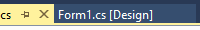 既定の背景ドキュメント タブ

| 要素 | トークン名: Category.color |
| --- | --- |
| 背景 | `Environment.FileTabBackground` |
| 前景 (テキスト) | `Environment.FileTabText` |
| 境界線 | `Environment.FileTabBorder` (背景と同じ色に設定されます。) |

**背景ドキュメント タブ: ホバー状態**

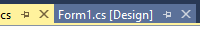 ホバー時の背景ドキュメント タブ

| 要素 | トークン名: Category.color |
| --- | --- |
| 背景 | `Environment.FileTabHotGradientTop` (このトークンのグラデーション境界はテーマ付き UI では使用されません。) |
| 前景 (テキスト) | `Environment.FileTabHotText` |
| 境界線 | `Environment.FileTabHotBorder` (背景と同じ色に設定されます。) |

#### プレビュー タブ
"一時的な" タブとも呼ばれます。プレビュー タブは、ユーザーがソリューション エクスプローラーのツール ウィンドウで項目をクリックすると、ドキュメント タブ チャネルの右側に表示されます。 プレビュー タブはドキュメントのプレビューとして機能し、ユーザーはドキュメント タブ チャネルの左側でドキュメントを開いたままにできます。 プレビュー タブは一度に 1 つのみ開くことができます。 プレビュー タブには、開いているタブと同様に、背景と選択された状態の両方があり、アクティブな状態でフォーカスされている場合とフォーカスされていない場合があります。

 プレビュー タブ (赤線)

| 使用する ... | 使用しない ... |
| --- | --- |
| ... 一時的なプレビューを作成し、一部の要素を現在のプレビュー タブの色と合わせるすべての場所。 | ... 一時的 (プレビュー) でないすべての種類のドキュメントまたはタブ。 |
| | ... シェルにテーマの更新がある場合に自動的に変更しない UI。 |

**フォーカスおよび選択されたプレビュー タブ**

 フォーカスおよび選択されたプレビュー タブ

| 要素 | トークン名: Category.color |
| --- | --- |
| 背景 | `Environment.FileTabProvisionalSelectedActive` |
| 前景 (テキスト) | `Environment.FileTabProvisionalSelectedActiveForeground` |
| 境界線 | `Environment.FileTabProvisionalSelectedActiveBorder` (背景と同じ色に設定されます。) |
| ドキュメントの境界線 | `Environment.FileTabProvisionalSelectedActiveBorder` |

**フォーカスされていない、選択されたプレビュー タブ**

 フォーカスされていない、選択されたプレビュー タブ

| 要素 | トークン名: Category.color |
| --- | --- |
| 背景 | `Environment.FileTabProvisionalSelectedInactive` |
| 前景 (テキスト) | `Environment.FileTabProvisionalSelectedInactiveForeground` |
| 境界線 | `Environment.FileTabProvisionalSelectedInactiveBorder` |
| ドキュメントの境界線 | `Environment.FileTabProvisionalSelectedInactiveBorder` |

**背景プレビュー タブ: 既定の状態**

 既定の背景プレビュー タブ

| 要素 | トークン名: Category.color |
| --- | --- |
| 背景 | `Environment.FileTabProvisionalInactive` |
| 前景 (テキスト) | `Environment.FileTabProvisionalInactiveForeground` |
| 境界線 | `Environment.FileTabProvisionalInactiveBorder` (背景と同じ色に設定されます。) |

**背景プレビュー タブ: ホバー状態**

 ホバー時の背景プレビュー タブ

| 要素 | トークン名: Category.color |
| --- | --- |
| 背景 | `Environment.FileTabProvisionalHover` |
| 前景 (テキスト) | `Environment.FileTabProvisionalHoverForeground` |
| 境界線 | `Environment.FileTabProvisionalHoverBorder` (背景と同じ色に設定されます。) |

#### ドキュメント オーバーフロー ボタン
ドキュメント オーバーフロー ボタンは、すべてのドキュメント タブに適した垂直スペースが現在の構成にあるかどうかに関係なく、1 つ以上のドキュメントが開いている場合に表示されます。 [コマンド バー メニュー](../../extensibility/ux-guidelines/shared-colors-for-visual-studio.md#BKMK_CommandMenus)の色で制御されるドキュメント オーバーフロー ドロップダウン メニューには、表示と非表示の両方の開いているすべてのドキュメントのリストが表示され、オーバーフロー グリフは開いているすべてのドキュメントがタブ チャネルに表示されるかどうかに応じて変化します。

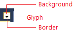 ドキュメント オーバーフロー ボタン (赤線)

| 使用する ... | 使用しない ... |
| --- | --- |
| ... カスタム ドキュメント オーバーフロー ボタンを作成する場合。 | ... オーバーフロー ボタンと類似していない UI。 |
| | ... コマンド バー オーバーフロー ボタン。 |

**ドキュメント オーバーフロー ボタン: 既定の状態**

 既定のドキュメント オーバーフロー ボタン

| 要素 | トークン名: Category.color |
| --- | --- |
| 背景 | `Environment.DocWellOverflowButtonBackground` |
| 前景 (グリフ) | `Environment.DocWellOverflowButtonGlyph` |
| 境界線 | 該当なし |

**ドキュメント オーバーフロー ボタン: ホバー状態**

 ホバー時のドキュメント オーバーフロー ボタン

| 要素 | トークン名: Category.color |
| --- | --- |
| 背景 | `Environment.DocWellOverflowButtonMouseOverBackground` |
| 前景 (グリフ) | `Environment.DocWellOverflowButtonMouseOverGlyph` |
| 境界線 | `Environment.DocWellOverflowButtonMouseOverBorder` |

**ドキュメント オーバーフロー ボタン: 押された状態**

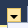 押されたドキュメント オーバーフロー ボタン

| 要素 | トークン名: Category.color |
| --- | --- |
| 背景 | `Environment.DocWellOverflowButtonMouseDownBackground` |
| 前景 (グリフ) | `Environment.DocWellOverflowButtonMouseDownGlyph` |
| 境界線 | `Environment.DocWellOverflowButtonMouseDownBorder` |

### タグ付け
Visual Studio は、タグ付けをサポートしています。タグ付けにより、ユーザーは追跡のために検索可能なキーワードを宣言できます。 たとえば、プロジェクト マネージャーと開発者は、Team Foundation Server (TFS) を使用して作業項目にタグを付けることができます。 次の表に、タグ自体と、ホバー時および選択済み状態で表示される "アイコンを閉じる" グリフの両方の色の名前を示します。

 Visual Studio でのタグ付け (赤線)

| 使用する ... | 使用しない ... |
| --- | --- |
| ... タグ付けをサポートする UI。 | ... 他の種類の UI。 |

#### タグ

**タグ: 既定の状態**

 既定のタグ

| 要素 | トークン名: Category.color |
| --- | --- |
| 背景 | `Tag.Background` |
| 前景 (テキスト) | `Tag.Background` |

**タグ: ホバー状態**

 ホバー時のタグ

| 要素 | トークン名: Category.color |
| --- | --- |
| 背景 | `Tag.HoverBackground` |
| 前景 (テキスト) | `Tag.HoverBackgroundText` |

**タグ: 押された状態**

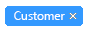 押されたタグ

| 要素 | トークン名: Category.color |
| --- | --- |
| 背景 | `Tag.PressedBackground` |
| 前景 (テキスト) | `Tag.PressedBackgroundText` |

**タグ: 選択された状態**

 選択されたタグ

| 要素 | トークン名: Category.color |
| --- | --- |
| 背景 | `Tag.SelectedBackground` |
| 前景 (テキスト) | `Tag.SelectedBackgroundText` |

#### 閉じる (&times;) タグ グリフ

**とじる (&times;) タグ グリフ: 既定の状態**

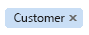 既定の閉じる (&times;) タグ グリフ

| 要素 | トークン名: Category.color |
| --- | --- |
| 背景 | 該当なし |
| 前景 (グリフ) | `Tag.TagHoverGlyph` |

**閉じる (&times;) タグ グリフ: ホバー状態**

 ホバー時の閉じる (&times;) タグ グリフ

| 要素 | トークン名: Category.color |
| --- | --- |
| 背景 | `Tag.TagHoverGlyphHoverBackground` |
| 前景 (グリフ) | `Tag.TagHoverGlyphHover` |
| 境界線 | `Tag.TagHoverGlyphHoverBorder` |

**閉じる (&times;) タグ グリフ: 押された状態**

 押された閉じる (&times;) タグ グリフ

| 要素 | トークン名: Category.color |
| --- | --- |
| 背景 | `Tag.TagHoverGlyphPressedBackground` |
| 前景 (グリフ) | `Tag.TagHoverGlyphPressed` |
| 境界線 | `Tag.TagHoverGlyphPressedBorder` |

**閉じる (&times;) グリフを含む選択済みタグ: 既定の状態**

 閉じる (&times;) グリフを含む既定の選択済みタグ

| 要素 | トークン名: Category.color |
| --- | --- |
| 背景 | 該当なし |
| 前景 (グリフ) | `Tag.TagSelectedGlyph` |

**閉じる (&times;) グリフを含む選択済みタグ: ホバー状態**

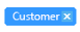 閉じる (&times;) グリフを含むホバー時の選択済みタグ

| 要素 | トークン名: Category.color |
| --- | --- |
| 背景 | `Tag.TagSelectedGlyphHoverBackground` |
| 前景 (グリフ) | `Tag.TagSelectedGlyphHover` |
| 境界線 | `Tag.TagSelectedGlyphHoverBorder` |

**閉じる (&times;) グリフを含む選択済みタグ: 押された状態**

 閉じる (&times;) グリフを含む押された選択済みタグ

| 要素 | トークン名: Category.color |
| --- | --- |
| 背景 | `Tag.TagSelectedGlyphPressedBackground` |
| 前景 (グリフ) | `Tag.TagSelectedGlyphPressed` |
| 境界線 | `Tag.TagSelectedGlyphPressedBorder` |

## ツール ウィンドウ
ツール ウィンドウは Visual Studio 環境で提供されるため、レプリケートする必要はありません。 ただし、UI が Visual Studio 環境のこの部分と常に一貫性のある状態で表示されるように、ツール ウィンドウで使用する色を活用することができます。

 ツール ウィンドウ (赤線)

| 使用する ... | 使用しない ... |
| --- | --- |
| ... ツール ウィンドウと合わせる UI を作成するすべての場所。 | ... シェルにテーマの更新がある場合に自動的に変更しない UI。 |

### ツール ウィンドウ フレーム
Visual Studio のツール ウィンドウはさまざまなタスクに使用され、いくつかの異なる状態の 1 つで配置できます。 ツール ウィンドウが開いている場合、ドキュメント領域の 4 辺のいずれかに割り当てることができます。 ツール ウィンドウは IDE の外部でフローティングさせることもでき、ユーザーの画面内の任意の場所に再配置できます。 フローティング ウィンドウは、常に IDE の一番上に配置されます。 最後に、ツール ウィンドウはドキュメント ウィンドウとしてドッキングし、ドキュメント ウェルのタブとして表示できます。 ドキュメント ウィンドウとしてドッキングされたツール ウィンドウは、ドキュメント ウィンドウのトークン名を使用して一部の色が付けられます。

 ツール ウィンドウ フレーム (赤線)

| 使用する ... | 使用しない ... |
| --- | --- |
| ...  ツール ウィンドウと合わせる UI を作成するすべての場所。 | ... シェルにテーマの更新がある場合に自動的に変更しない UI。 |

**ドッキングされたツール ウィンドウ**

 ドッキングされたツール ウィンドウ

| 要素 | トークン名: Category.color |
| --- | --- |
| 背景 | `Environment.ToolWindowBackground` |
| 境界線 | `Environment.ToolWindowBorder` |

**フォーカスされたフローティング ツール ウィンドウ**

 フォーカスされたフローティング ツール ウィンドウ

| 要素 | トークン名: Category.color |
| --- | --- |
| 背景 | `Environment.ToolWindowBackground` |
| 境界線 | `Environment.MainWindowActiveDefaultBorder` |

**フォーカスされていないフローティング ツール ウィンドウ**

 フォーカスされていないフローティング ツール ウィンドウ

| 要素 | トークン名: Category.color |
| --- | --- |
| 背景 | `Environment.ToolWindowBackground` |
| 境界線 | `Environment.MainWindowInactiveBorder` |

### ツールボックスのようなウィンドウ
ツールボックスは、Visual Studio で最も頻繁に使用される一般的なツール ウィンドウの 1 つです。 これは基本的には、特別なテーマとスタイルが適用されたツリー コントロールです。

 ツールボックスのようなウィンドウ (赤線)

| 使用する ... | 使用しない ... |
| --- | --- |
| ... 常にシェル ツールボックスと一貫性を維持するツール ウィンドウを設計する場合。 | ... ツールボックス UI と類似していないすべてのもの、またはシェル ツールボックスの色を変更した場合に UI に問題が発生するかどうか不明な場合。 |

**ツールボックス ノード: 既定の状態**

 既定のツール ボックスの親ノード

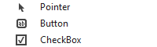 既定のツール ボックスの子ノード

| 要素 | トークン名: Category.color |
| --- | --- |
| 背景 | `Environment.ToolboxContent` (見出し) |
| 背景 | `Environment.ToolWindowBackground` (個々の項目、または利用可能なコントロールがない場合はウィンドウ全体) |
| 境界線 | なし |
| 前景 (グリフ) | `Environment.ToolboxContent` |
| 前景 (テキスト) | `Environment.ToolboxContent` |

**ツールボックスの子ノード: ホバー状態**

 ホバー時のツールボックスの子ノード

| 要素 | トークン名: Category.color |
| --- | --- |
| 背景 | `Environment.ToolboxContentMouseOver` (個々の項目のみ) |
| 境界線 | なし |
| 前景 (テキスト) | `Environment.ToolboxContentMouseOver` (個々の項目のみ) |

**選択したツールボックス ノード: フォーカス状態**

 フォーカスおよび選択されたツールボックスの親ノード

 フォーカスおよび選択されたツールボックスの子ノード

| 要素 | トークン名: Category.color |
| --- | --- |
| 背景 | `TreeView.SelectedItemActive` [Tree view](../../extensibility/ux-guidelines/shared-colors-for-visual-studio.md#BKMK_TreeView) カテゴリから |
| 境界線 | `TreeView.FocusVisualBorder` [Tree view](../../extensibility/ux-guidelines/shared-colors-for-visual-studio.md#BKMK_TreeView) カテゴリから |
| 前景 (グリフ) | `TreeView.SelectedItemActive` [Tree view](../../extensibility/ux-guidelines/shared-colors-for-visual-studio.md#BKMK_TreeView) カテゴリから |
| 前景 (テキスト) | `TreeView.SelectedItemActive` [Tree view](../../extensibility/ux-guidelines/shared-colors-for-visual-studio.md#BKMK_TreeView) カテゴリから |

**選択したツールボックス ノード: 未フォーカス状態**

 選択され、フォーカスされていないツールボックスの親ノード

 選択され、フォーカスされていないツールボックスの子ノード

| 要素 | トークン名: Category.color |
| --- | --- |
| 背景 | `TreeView.SelectedItemInactive` [Tree view](../../extensibility/ux-guidelines/shared-colors-for-visual-studio.md#BKMK_TreeView) カテゴリから |
| 境界線 | なし |
| 前景 (グリフ) | `TreeView.SelectedItemInactive` [Tree view](../../extensibility/ux-guidelines/shared-colors-for-visual-studio.md#BKMK_TreeView) カテゴリから |
| 前景 (テキスト) | `TreeView.SelectedItemInactive` [Tree view](../../extensibility/ux-guidelines/shared-colors-for-visual-studio.md#BKMK_TreeView) カテゴリから |

### ツール ウィンドウのタイトル バー
タイトル バーの境界線は実際の境界線ではなく、タイトル バーの上部に沿った太い線です。 フォーカスされていない状態のトークン名はありません。

 ツール ウィンドウのタイトル バー (赤線)

| 使用する ... | 使用しない ... |
| --- | --- |
| ... ツール ウィンドウと合わせる UI を作成するすべての場所。 | ... シェルにテーマの更新がある場合に自動的に変更しない UI。 |

**フォーカスされたタイトル バー**

 フォーカスされたタイトル バー

| 要素 | トークン名: Category.color |
| --- | --- |
| 背景 | `Environment.TitleBarActiveGradientBegin` (このトークンのグラデーション境界はテーマ付き UI では使用されません。) |
| 前景 (テキスト) | `Environment.TitleBarActiveText` |
| 境界線 | `Environment.TitleBarActiveBorder` (背景と同じ色に設定されます。) |
| ドラッグ ハンドル | `Environment.TitleBarDragHandleActive` |

**フォーカスされていないタイトル バー**

 フォーカスされていないタイトル バー

| 要素 | トークン名: Category.color |
| --- | --- |
| 背景 | `Environment.TitleBarInactiveGradientBegin` (このトークンのグラデーション境界はテーマ付き UI では使用されません。) |
| 前景 (テキスト) | `Environment.TitleBarInactiveText` |
| 境界線 | 該当なし |
| ドラッグ ハンドル | `Environment.TitleBarDragHandle` |

#### ツール ウィンドウのタイトル バーのボタン
 タイトル バーのボタン (赤線)

| 使用する ... | 使用しない ... |
| --- | --- |
| ... ツール ウィンドウのタイトル バーの色のトークンを使用する UI に表示されるボタン。 | ... その他の場所に表示されるボタン。 |
| | ... 指定以外の背景と前景の組み合わせ。 |

**フォーカスされたタイトル バー ボタン: 既定の状態**

 フォーカスされた既定のタイトル バー ボタン

| 要素 | トークン名: Category.color |
| --- | --- |
| 背景 | 該当なし |
| 前景 (グリフ) | `Environment.ToolWindowButtonActiveGlyph` |
| 境界線 | 該当なし |

**フォーカスされていないタイトル バー ボタン: 既定の状態**

 フォーカスされていない既定のタイトル バー ボタン

| 要素 | トークン名: Category.color |
| --- | --- |
| 背景 | 該当なし |
| 前景 (グリフ) | `Environment.ToolWindowButtonInactiveGlyph` |
| 境界線 | 該当なし |

**フォーカスされたタイトル バー ボタン: ホバー状態**

 フォーカスされたホバー時のタイトル バー ボタン

| 要素 | トークン名: Category.color |
| --- | --- |
| 背景 | `Environment.ToolWindowButtonHoverActive` |
| 前景 (グリフ) | `Environment.ToolWindowButtonHoverActiveGlyph` |
| 境界線 | `Environment.ToolWindowButtonHoverActiveBorder` |

**フォーカスされていないタイトル バー ボタン: ホバー状態**

 フォーカスされていないホバー時のタイトル バー ボタン

| 要素 | トークン名: Category.color |
| --- | --- |
| 背景 | `Environment.ToolWindowButtonHoverInactive` |
| 前景 (グリフ) | `Environment.ToolWindowButtonHoverInactiveGlyph` |
| 境界線 | `Environment.ToolWindowButtonHoverInactiveBorder` |

**フォーカスされたタイトル バー ボタン: 押された状態**

 フォーカスされ、押されたタイトル バー ボタン

| 要素 | トークン名: Category.color |
| --- | --- |
| 背景 | `Environment.ToolWindowButtonDown` |
| 前景 (グリフ) | `Environment.ToolWindowButtonDownActiveGlyph` |
| 境界線 | `Environment.ToolWindowButtonDownBorder` |

**フォーカスされていないタイトル バー ボタン: 押された状態**

 フォーカスされず、押されたタイトル バー ボタン

| 要素 | トークン名: Category.color |
| --- | --- |
| 背景 | `Environment.ToolWindowButtonDown` |
| 前景 (グリフ) | `Environment.ToolWindowButtonDownInactiveGlyph` |
| 境界線 | `Environment.ToolWindowButtonDownBorder` |

### ツール ウィンドウ タブ
 ツール ウィンドウ タブ (赤線)

| 使用する ... | 使用しない ... |
| --- | --- |
| ... ツール ウィンドウと合わせる UI を作成するすべての場所。 | ... シェルにテーマの更新がある場合に自動的に変更しない UI。 |

**選択され、フォーカスされたツール ウィンドウ タブ**

 選択され、フォーカスされたツール ウィンドウ タブ

| 要素 | トークン名: Category.color |
| --- | --- |
| 背景 | `Environment.ToolWindowTabSelectedTab` |
| 前景 (テキスト) | `Environment.ToolWindowTabSelectedActiveText` |
| 境界線 | `Environment.ToolWindowTabSelectedBorder` (背景と同じ色に設定されます。) |

**選択され、フォーカスされていないツール ウィンドウ タブ**

 選択され、フォーカスされていないツール ウィンドウ タブ

| 要素 | トークン名: Category.color |
| --- | --- |
| 背景 | `Environment.ToolWindowTabSelectedTab` |
| 前景 (テキスト) | `Environment.ToolWindowTabSelectedText` |
| 境界線 | `Environment.ToolWindowTabSelectedBorder` (背景と同じ色に設定されます。) |

**背景ツール ウィンドウ タブ: 既定の状態**

 既定の背景ツール ウィンドウ タブ

| 要素 | トークン名: Category.color |
| --- | --- |
| 背景 | `Environment.ToolWindowTabGradientBegin` `Environment.ToolWindowTabGradientEnd` (グラデーション境界は、Visual Studio 2013 では同じ色の値に設定されます。) |
| 前景 (テキスト) | `Environment.ToolWindowTabText` |
| 境界線 | `Environment.ToolWindowTabBorder` |

**背景ツール ウィンドウ タブ: ホバー状態**

 ホバー時の背景ツール ウィンドウ タブ

| 要素 | トークン名: Category.color |
| --- | --- |
| 背景 | `Environment.ToolWindowTabMouseOverBackgroundBegin` `Environment.ToolWindowTabMouseOverBackgroundEnd` (グラデーション境界は、Visual Studio 2013 では同じ色の値に設定されます。) |
| 前景 (テキスト) | `Environment.ToolWindowTabMouseOverText` |
| 境界線 | `Environment.ToolWindowTabMouseOverBorder` (背景と同じ色に設定されます。) |

### 自動非表示タブ

自動非表示タブ (赤線)

| 使用する ... | 使用しない ... |
| --- | --- |
| ... 自動非表示ツール ウィンドウ タブと合わせる UI を作成するすべての場所。 | ... シェルにテーマの更新がある場合に自動的に変更しない UI。 |

**自動非表示タブ: 既定の状態**

 既定の自動非表示タブ

| 要素 | トークン名: Category.color |
| --- | --- |
| 背景 | `Environment.AutoHideTabBackgroundBegin` (このトークンのグラデーション境界はテーマ付き UI では使用されません。) |
| 前景 (テキスト) | `Environment.AutoHideTabText` |
| 境界線 | `Environment.AutoHideTabBorder` |

**自動非表示タブ: ホバー状態**

![ホバー時の [自動非表示] タブ](../../extensibility/ux-guidelines/media/0303-109_autohidetabhover.png "0303-109_AutoHideTabHover") ホバー時の [自動非表示] タブ

| 要素 | トークン名: Category.color |
| --- | --- |
| 背景 | `Environment.AutoHideTabMouseOverBackgroundBegin` (このトークンのグラデーション境界はテーマ付き UI では使用されません。) |
| 前景 (テキスト) | `Environment.AutoHideTabMouseOverText` |
| 境界線 | `Environment.AutoHideTabMouseOverBorder` |
