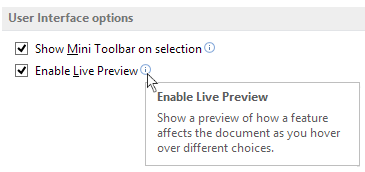
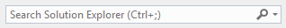
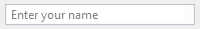
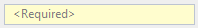
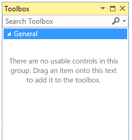

# <a name="ui-text-and-help-for-visual-studio"></a>Visual Studio の UI テキストとヘルプ
## <a name="ui-text-and-terminology"></a><a name="BKMK_UITextAndTerminology"></a> UI のテキストおよび用語
 わかりやすいテキストは、効果的な UI にとって不可欠です。 ソフトウェア ユーザーは、ラベルから読む傾向があります。つまり、作業中のタスクを完了するために最も関連性が高いものです。 静的テキストはそれほど読まれません。 ウィンドウ全体をざっと見てから大まかに次の順序で UI を読んで作業セッションを開始するユーザーのために、計画を立てます。

1. 中央の対話型コントロール

2. コミット ボタン

3. 他の場所にある対話型コントロール

4. 主要な命令

5. 補足的な説明

6. ウィンドウのタイトル

7. 本文内の他の静的テキスト

### <a name="usage-patterns-for-ui-text"></a>UI テキストの使用パターン

#### <a name="title-bar-text"></a>タイトル バーの文字列
 タイトル バーのテキストは、その UI を生成したコマンドと一致する必要があります。

#### <a name="instructional-text-helper-text"></a>指示テキスト (ヘルパー テキスト)
 ダイアログによっては、ウィンドウまたはページで何を行うかを説明する手順を目立つように示すと役立ちます。 これは、"ヘルパー テキスト" と呼ばれることもあります。

##### <a name="writing-style-rules-for-helper-text"></a>ヘルパー テキストの記述スタイル ルール

- 明白なことを説明しないでください。 指示テキストは、絶対に必要な場合以外は含めません。

- 指示テキストは常にダイアログの一番上に配置し、実行中のタスクを説明する必要があります。

- 行うべき操作をユーザーに対して正確に説明します。 過剰な情報や冗長性を回避します。

- 各ウィンドウを見直して、重複する語や文を削除します。

- 指示テキストは短めにします。 特定のユーザーまたはシナリオについて詳細情報が必要な場合は、詳細な概念的オンライン トピックへのリンクを提供します。

- すべての語が重要かつ必要であるようにテキストを記述します。

- [ユーザー インターフェイスのテキスト](/windows/desktop/uxguide/text-ui)および[スタイルとトーン](/windows/desktop/uxguide/text-style-tone)については、Microsoft の既存のガイダンスに従ってください。

#### <a name="supplemental-instructions"></a>補足説明
 補足説明は、コントロールまたはコントロールのグループ化をユーザーが理解するのに役立つ追加情報を提供します。 これには、入力コントロールで想定される形式の理解に必要なヒント テキストを含めることもできます。 補足説明は控えめに使用してください。 ユーザーが行おうとする選択の影響を十分に理解できない可能性があるケースに備えます。

 ![オプションの設定変更の影響について説明する補足テキストが [Internet Explorer Options]\(Internet Explorer オプション\) ボタンの下に表示されているスクリーンショット。](../../extensibility/ux-guidelines/media/0601-b_supplementaltext1.png "0601-b_SupplementalText1")

 **Visual Studio での補足のテキスト**

 ![ソース管理システム オプションそれぞれを説明する補足テキストが表示されている Visual Studio の [ソース管理の選択] ダイアログのスクリーンショット。](../../extensibility/ux-guidelines/media/0601-c_supplementaltext2.png "0601-c_SupplementalText2")

 **Visual Studio での補足のテキスト**

#### <a name="infotips"></a>ヒント
 多くの場合、指示テキストは、UI 内に配置するには長すぎたり、役に立つのは新規ユーザーのみで経験豊富なユーザーにとって煩雑に感じられたりすることがあります。 このようなケースでは、指示や情報のテキストをヒントの下にツールヒントとして配置する必要があります。

 ヒントは、関連付けられているコントロールの近くに配置する必要があります。また、ヒントを示す固有のアイコン (目立たないが気付きやすいもの) を使用する必要があります。

 

 **Visual Studio のヒントの例**

##### <a name="writing-style-rules-for-infotips"></a>ヒントの記述スタイル ルール

- ヒントは完全な文章として記述します。 明確な動詞、先頭の大文字、および文末の区切り記号が必要です。

- 主な説明または情報を補足するためにヒントを使用します。 違う言葉を使用して主な情報を言い換えるだけなら、ヒントは必要ありません。

- ヒントは簡潔にします。 ユーザーをサポートし励ますように、平易な単語と日常的な言葉づかいを使用します。

- [ユーザー インターフェイスのテキスト](/windows/desktop/uxguide/text-ui)および[スタイルとトーン](/windows/desktop/uxguide/text-style-tone)については、Microsoft の既存のガイダンスに従ってください。

#### <a name="control-labels"></a>コントロール ラベル
 コントロール ラベルは短く正確にする必要があります。また、[コントロールに関する Windows デスクトップのガイダンス](/windows/desktop/uxguide/controls)に従ってください。

 コントロール ラベルの形式と UI 内の配置の詳細については、「[Visual Studio のレイアウト](../../extensibility/ux-guidelines/layout-for-visual-studio.md)」を参照してください。

#### <a name="help-links"></a>[ヘルプ] リンク
 ヘルプ リンクは、指示テキスト内に配置することも、UI 本体に配置することもできます。 ヘルプへのリンクまたは内部ダイアログを開くリンクにすることができます。

##### <a name="visual-style-rules-for-help-links"></a>ヘルプ リンクの視覚スタイル ルール

- ハイパーリンクには正しい環境色を使用します。 正しいスタイルのハイパーリンクは、クリックしたときに赤く点滅しません。 このように表示されるのは、環境色が使用されていないことを意味します。

- 下線は、ホバー時またはリンクが段落に埋め込まれている場合にのみ使用してください。

- ハイパーリンクの視覚および対話スタイルの詳細については、ボタンとハイパーリンクに関する項を参照してください。

##### <a name="writing-style-rules-for-help-links"></a>ヘルプ リンクの記述スタイル ルール

- ダイアログの起動時には、省略記号の標準を維持します。つまり、ナビゲーションでは省略記号を付けず、追加の UI が必要なタスクには省略記号を付けます。

     

     **ヘルプ リンク内の省略記号 (...) は、そのタスクに追加の UI が必要であることを示します。**

- リンクに "学ぶ" を使用しないでください。これはユーザーの意図ではないためです。 ユーザーは、一般的な学習ではなく特定の質問への回答を望んでいます。

- リンクの文章を質問にして、トピックがその回答になるようにします。

     不適切:    "Windows Azure Mobile Services の価格について学ぶ"

     適切:    "Microsoft Azure Mobile Service にはどのような価格のオプションがありますか。"

- リンク テキストとして "*クリック*" を決して使用しないでください。

- "こちら" という語のみを決してリンクしないでください。 スクリーン リーダーによっては、ハイパーリンクされた単語のみが読み上げられるため問題があります。

     不適切:    "Windows Azure Mobile Services の情報を **こちら** で確認します"

     適切:    "Microsoft Azure Mobile Service にはどのような価格のオプションがありますか。"

- ヘルプ リンクの正しい記述スタイルの詳細については、[ヘルプに関する Windows デスクトップのガイダンス](/windows/desktop/uxguide/winenv-help)を参照してください。

#### <a name="hint-text"></a>ヒント テキスト
 ヒント テキストは、コントロール内またはコントロールの下にウォーターマークとして表示されます。 正しい書式設定は、適切な VSColors トークン `Environment.GrayText` を使用して適用されます。

 さまざまな形式で表示できます。

- コントロール ラベルの代わり:

     

- 指示を示す動詞を含む:

     

- 必須エントリを示すテキストを含む:

     

#### <a name="watermark-text"></a>ウォーターマーク テキスト
 空のデザイン サーフェイスでは、テキストを使用して、何を行うかを示したり、必要であれば他の関連ウィンドウを開くリンクを提供したりする必要があります。

 

 **Visual Studio でのウォーターマーク テキストの例**

### <a name="common-terminology"></a>一般的な用語

|期間|説明|解説|
|----------|-----------------|-------------|
|サインイン/サインアウト|Web プロパティでの認証を表す同義語として Web に関して使用される動詞。 クライアント内では、これを IDE ユーザー接続のサインインとサインアウトの最上位概念として 1 回使用します。最上位の ID を表し、他のすべての接続では使用できないローミングやライセンス適用といった上位レベル機能が提供されます。|IDE ユーザーはサインイン/サインアウト動詞を表す唯一のフィーチャーです (最上位 IDE ユーザーを表すため)。|
|接続/切断|機能がオンライン サービスへの単一の接続を保持する場合に使用します。|サーバー エクスプローラーは、使用できるアクティブ Azure 接続が一度に 1 つであるため、接続/切断の一例です。|
|追加/削除|非破壊的。 リストの内容を追加または削除するときに使用します。|[TFS Connection Manager server list]\(TFS 接続マネージャー サーバー一覧\) ダイアログは、追加/削除の一例です。|
|削除|破壊的。 除去する要素がディスクから完全に破棄または削除される場合にのみ使用します。|"削除" の結果としてディスクからファイルが削除される場合、通常、プロンプトが必要です。|

## <a name="error-messages"></a>エラー メッセージ

### <a name="overview"></a>概要
 エラーは発生します。 ユーザーが行えることに制限を設定するのは、回避できるエラー メッセージを防ぐ最初のステップとして妥当です。 ただし、エラーが発生する場合は、適切に記述されたエラー メッセージによって、長い目で見ると問題の軽減につながります。 エラー メッセージは同期されており、解決すべき問題が示されるため、ユーザーに対して表示される通知の中で最も重要な種類であることはほぼ確実です。 適切に記述されていないエラー メッセージの場合は、エラーの原因や可能性がある解決策をユーザー自身が判別することになります。

 ユーザーは、過剰に使用されるエラー メッセージやわかりづらいエラー メッセージには注意を払わなくなる場合があります。ユーザー エクスペリエンスの価値が高まる、必要なメッセージのみを記述してください。 メッセージが単なる通知の場合は、別の表現を使用します。

### <a name="rules-for-creating-an-error-message"></a>エラー メッセージを作成するための規則

- エラー メッセージを作成するときは、対象ユーザーに対して適切なエラー レベルを選択します。 ユーザーが実行できるアクションを示す、単純な概要を目指します (該当する場合)。 ユーザーが知る必要のないものは記述しないでください。

- 建設的な支援を提供します。 手順を含むエラー メッセージは読むのも操作するのも容易です。

- 二重否定は使用しないでください。

- 作成したエラー メッセージに対して、文法およびスペル チェックを自動と手動の両方で実行します。

- 複雑なエラー メッセージの場合、順次伝達を避けてください。 エラー メッセージでは F1 フックアップを決して使用しないでください。 メッセージそのもので十分であるようにします。

- 正しいアイコンを使用します。

- 理解しやすいように質問を作成し、"削除" や "キャンセル" など、明確な選択肢のボタンを使用します。

- 警告の場合は、続行した結果がどのようになるかを明確に示します。 ボタンが結果を示すようにします。

- エラーの場合は、問題を解決するためにユーザーが実行できることを説明します。 ボタンは、アクションを示すか、"閉じる" である必要があります。 エラー メッセージでは [OK] ボタンを使用しないでください。

- エラー メッセージを作成する際には、次の点を確認してください。

  - このエラーだけでユーザーが問題の解決方法を判断できますか。

  - ユーザーはこのエラーと同じ語彙を使用しますか。

  - このエラーはあいまいですか。つまり、複数の状況に当てはまりますか。 その場合、必要な解決方法にどうやってユーザーを導きますか。

#### <a name="build-errors"></a>ビルド エラー
 Visual Studio はソフトウェア開発ツールであるため、そのコンポーネントの多くには、開発者の作業をバイナリ形式に変換するコンパイル、変換、またはエンコードの手順が含まれています。 これらの変換でエラーが発生するのは、正しく作成されていないファイルをコンパイラが処理できない場合、またはコンパイラ オプションが正しく設定されなかった場合です。

 Visual Studio ユーザーは、ビルド エラーを解決するために膨大な開発時間を費やす可能性があります。 このような解決の時間が長引くのは、エラーに依存関係があるとき、またはエラー メッセージの記述が適切でないときです (エラーの原因を特定するのが難しくなる)。

 最良のビルド エラーとは、そもそもビルド エラーが発生しないことです。Visual Studio によって AutoComplete および IntelliSense の波線が提供されるのはこのためです。 スキーマ検証コントロールなどのツールで、同じ種類のフィードバックが提供されます。 これらのメカニズムによって、ユーザーが正しい形式のコードを作成するように事前に導かれ、ビルド エラーの可能性が削減されます。

 Visual Studio のツール ウィンドウでは、ドキュメント ウィンドウで発生したエラーをユーザーが読んだり移動したりすることができます。 ユーザーが大量のコード内をすばやく移動し、問題の場所に直接移動できるように、キーボード ショートカットが用意されています。 Visual Studio では、各ビルド エラーを特定のヘルプ キーワード/コンテキスト ID と結び付けることもできます。これにより、ユーザーは、エラーについて詳しい情報を得られるヘルプ トピックに直接アクセスできます。

 明確で簡潔なビルド エラーを記述します。

- **平易な言葉づかいを使用**、コンパイラの専門用語をほとんど (またはまったく) 使わずに問題を説明します。 ビルド エラーのテキストをあまり技術的にする必要はありません。

- **考えられる原因の概要を示します。** たとえば、"宣言の '(プロパティ) : (値)' で、プロパティと値の間にコロンがありません。"

- 可能性がある修正方法の詳細を示します。 場所が十分にない場合は、対応するヘルプ トピックに追加の詳細情報を含めることができます。

### <a name="components-of-a-well-written-error-message"></a>適切に記述されたエラー メッセージのコンポーネント

#### <a name="use-the-shell-dialog-service-for-error-messages"></a>エラー メッセージのためにシェル ダイアログ サービスを使用します。
 シェル ダイアログ サービスを使用すると、個々の要素に大きな変更を加えずに、メッセージの外観、特にフォントの外観を制御できます。 **IErrorInfo** メカニズムを使用し、**IVsUIShell::SetErrorInfo/ReportErrorInfo** を使用してレポートします。

#### <a name="choose-an-effective-and-appropriate-notification-presentation"></a>効果的で適切な通知の表示方法を選択します。
 データの損失を回避するために直ちに対処する必要がある場合は、重大な警告を含むモーダル ダイアログを使用します (同期通知)。 重要なアイコンは、メッセージを読まずに閉じると悪影響が生じる可能性があるときに使用します。 データの損失は、アラームレベルの応答を必要とする重大な状況です。 重要なアイコンを使用しすぎると、ユーザーが重要性を感じなくなります。 エラー メッセージの性質が情報提供である場合は、モーダル ダイアログに代わる手段 (非同期通知) を検討してください。

#### <a name="provide-a-clean-succinct-explanation-of-why-the-problem-occurred-rather-than-a-technical-explanation"></a>技術的な説明ではなく、問題が発生した理由をわかりやすく簡潔に説明します。
 説明の技術的な詳細がユーザーの負担になると、ユーザーがエラー メッセージを無視することにつながります。 優れたメッセージの例を次に示します。

- "要求されたファイルを開けません。"

- "インターネットに接続できません。"

#### <a name="provide-information-about-how-to-fix-the-problem"></a>問題の解決方法に関する情報を提供します。
 問題の解決方法をユーザーに提案します。 提案がない場合は、ユーザーに正直に伝えます。 テクニカル サポートやコミュニティ サポートなど、代替オンライン ソースへの直接リンクを提供します。 問題に関連する特定のオンライン情報をユーザーに示すようにしてください。 エラー ID の場合は、その特定のエラーに関するディスカッション スレッドのリンクをユーザーに示すことを検討してください。 優れたメッセージの例を次に示します。

- "インターネットに接続していることを確認してから、操作をやり直してください。"

- "ファイルが存在していることと、それを開くためのアクセス許可があることを確認してください。"

#### <a name="write-a-message-that-is-short-and-to-the-point"></a>的を射た短いメッセージを作成します。
 エラー メッセージは、解決方法の通知、説明、および提供を行うことができますが、長すぎると無視されます。 1 つの解決策は、詳細ボタンを使用して漸進的に開示することです。 たとえば、短い説明/解決方法を示して、詳細ボタンの下に詳細を配置します。 ユーザーがエラーの詳細情報を読むことにした場合は、そうできます。

 メッセージの言葉づかいは次のようにします。

- **分野に合わせます。** ユーザーが理解できる言葉づかいを使用します。 お客様が開発者であっても、多くの場合、同じコンテキストや用語は使用されていません。

- **具体的にします。** あいまいな表現を避け、関連するオブジェクトの具体的な名前と場所を示します。 たとえば、"文字が無効です" といったエラー メッセージは役に立ちません。 どの文字でしょうか。 "ファイルが見つかりません。" どのファイルですか。

- **礼儀正しくします。** ユーザーを非難したり、見下したりしません。 悪意がある言葉や不快な言葉 (kill (殺す)、execute (処刑する)、terminate (打ち切る)、fatal (致命的)、illegal (不正)) を避けます。 大文字を使用しないでください。多くの場合、怒鳴っているように見え、読みやすくありません。 ユーモアは使用しないでください。

- **正解です。** 正しいスペルと文法を使用します (アルファ版でも)。 入力ミスは見苦しく、プロにふさわしくありません。

- **文脈に適しています。** 適切なボタン テキストを使用します。 [OK] ボタンを使用せずに、代わりに [続行] または [はい]/[いいえ] を使用します。

### <a name="error-message-examples"></a>エラー メッセージの例

|良い|不良|
|----------|---------|
|"ダイヤルした番号は現在使用されていません。 電話番号を確認して、もう一度ダイヤルするか、0 をダイヤルしてオペレーターにおかけください。"|-   "エラー (449): 無効な数値"<br />-   "この未処理の例外エラーは、操作が正常に終了したことを示します。"<br /><br /> |

## <a name="accessing-help"></a>ヘルプへのアクセス

### <a name="overview"></a>概要
 Visual Studio ユーザーには、MSDN のドキュメントに加えて、ユーザーを支援するいくつかのアクセス ポイントが UI で提供されます。 これらのアクセス ポイントが常に使用可能であるようにするために、フィーチャー チームは、環境によって提供されるヘルプ システムを利用する必要があります。 これらのアクセス ポイントは次のとおりです。

- **ダイアログの指示テキストと補足テキスト。** UI 画面上に、またはヒント アイコンの上にマウス ポインターを置いたときに表示される、指示または説明を提供する静的テキスト。

- **F1 ヘルプ** (エディターのみ)。 Visual Studio エディターでは、F1 キーを押すと現在の選択項目に固有のヘルプ トピックが常に表示されることをユーザーは信頼できます。 F1 に関連付けられたトピックが適切であり、有益であることを確認します。

- **ヘルプ トピックへのハイパーリンク。** ダイアログ、ツール ウィンドウ、またはデザイン サーフェイス内のハイパーリンク。これによって、トピックが表示され、タスクの実行方法に関するテクノロジ、機能、または情報をユーザーが理解できるように支援します。

- **ヘルパー UI メカニズム (スマート タグやビルディング ダイアログなど)。** これらのメカニズムは、ユーザーが UI 要素を理解できるようにしたり、タスクを促進したりします (スマート タグやビルダー ダイアログなど)。

- **UI ヘルプ ボタン** (非推奨)。 関連する F1 ヘルプ トピックへのアクセスを提供する、タイトル バーに表示されるインジケーター。

### <a name="text"></a>Text

#### <a name="instructional-and-supplemental-text-in-dialogs"></a>ダイアログの指示テキストと補足テキスト。
 複雑なタスクをサポートするダイアログでは、場合によっては指示テキストを UI 内に (ダイアログの一番上か複雑なコントロールの近くなど) に示す必要があります。 記述スタイルの詳細については、「[UI のテキストおよび用語](../../extensibility/ux-guidelines/ui-text-and-help-for-visual-studio.md#BKMK_UITextAndTerminology)」を参照してください。

#### <a name="infotips"></a>ヒント
 多くの場合、指示テキストは、UI 内に配置するには長すぎたり、役に立つのは新規ユーザーのみで経験豊富なユーザーにとって煩雑に感じられたりすることがあります。 このようなケースでは、指示や情報のテキストをヒントの下にツールヒントとして配置する必要があります。

 ヒントは、関連付けられているコントロールの近くに配置する必要があります。また、ヒントを示す固有のアイコン (目立たないが気付きやすいもの) を使用する必要があります。

 

 **Visual Studio のヒントの例**

### <a name="interactive-help-mechanisms"></a>対話型ヘルプのメカニズム

#### <a name="f1-help"></a>F1 ヘルプ
 F1 ヘルプは、エディターまたはデザイン サーフェイス内で必要ですが、Visual Studio 環境内の他の場所では必要ありません。

#### <a name="hyperlinks-to-help-topics"></a>ヘルプ トピックへのハイパーリンク
 ハイパーリンクを使用すると、アクションの実行、IDE 内での移動、またはブラウザーでのヘルプの起動を行うことができます。 言葉づかいの詳細については「[UI のテキストおよび用語](../../extensibility/ux-guidelines/ui-text-and-help-for-visual-studio.md#BKMK_UITextAndTerminology)」、視覚およびレイアウトのガイドラインについては 07.10.01 のボタンとハイパーリンクに関する項を参照してください。

#### <a name="help--buttons-in-dialog-title-bars-deprecated"></a>ダイアログ タイトル バーのヘルプ [?] ボタン (非推奨)
 ほとんどの場合、ダイアログ ボックスのタイトル バーにあるヘルプ ボタン ([?]) は非推奨になりました。 UI トピックはドキュメント モデルの一部ではなくなったため、リンク先の関連トピックがない可能性があります。 基本的にタイトル バー ボタンは F1 ヘルプと同じだったため、ダイアログでは不要になりました。 場合によっては、概念または手順の情報を得られることを示すインジケーターとしてこれを使用できますが、新しい UI ではハイパーリンクの方がよく使用されます。

##### <a name="dialogs-created-through-the-environment"></a>環境を使用して作成されるダイアログ
 多くのシェル ダイアログは、**VBDialogBoxParam** 関数を使用して作成されます。 この共有関数が更新されて、ダイアログの **[ヘルプ]** ボタンから **[?]** ボタンへの移行に対応するようになりました。この際、下位互換性を備えた拡張可能なアーキテクチャは維持されます。

 具体的には、**VBDialogBoxParam** 関数が、ID が **IDHELP** (9) あるいはラベルが **Help** または **&Help** のボタンをダイアログ テンプレートで確認します。 [ヘルプ] ボタンが見つかると非表示になり、**WS_EX_CONTEXTHELP** スタイルがダイアログに追加されます。これによって **[?]** ボタンがダイアログのタイトル バーに配置されます。

 ダイアログが作成されるとき、ダイアログ プロシージャがスタックにプッシュされ、**DialogPreProc** という名前の前処理ダイアログ プロシージャを使用してダイアログが呼び出されます。 **[?]** ボタンがクリックされると、**SC_CONTEXTHELP** の **WM_SYSCOMMAND** がダイアログに送信されます。 **DialogPreProc** が、このコマンドをキャプチャして **WM_HELP** メッセージに変更し、それが元のダイアログ プロシージャに渡されます。

 環境で作成されたほとんどのダイアログには、ダイアログに [ヘルプ] ボタンがあります。 ダイアログが表示されるとき、[ヘルプ] ボタンは自動的に非表示になり、 **[?]** ボタンのみが機能します。 仮に **[?]** ボタンが Windows で削除または変更された場合には、このソリューションによって元の [ヘルプ] ボタンにすぐに戻ることができます。

 このソリューションではバグを引き起こす 4 つの可能性が想定されています。

- ダイアログのヘルプ ボタンが **IDHELP** (9) です。

- [ヘルプ] ボタンが非表示のとき、ダイアログが正しく表示されます。

- ダイアログが winproc の代わりになりません。

- ダイアログが別のダイアログの内部に埋め込まれていません。

  ダイアログが msenv 内に存在しており、**VBDialogBoxParam** を使用しない場合は、独自のハンドラーを実装する前に **VBDialogBoxParam** の活用を検討してください。

##### <a name="dialogs-created-through-other-packages"></a>他のパッケージを使用して作成されるダイアログ
 msenv の外部にあるダイアログのために独自のソリューションを実装できます。 VSPackage パッケージの共有ダイアログ クラスでは、ボタンをタイトル バーに移動するか、各ダイアログにハンドラーを実装することを検討してください。 次のコードは、作業を開始するのに役立つ実装のスケルトンです。

```
struct DLGPROCITEM
{
    FARPROC proc; // The info used to create the dialog.
    DLGPROCITEM* procPrev;
};

DLGPROCITEM* g_dlgProcStack = NULL;

// A dialog starter/wrapper function is used to push the new
// dialog proc to the top of our dialog proc stack.

int SomeDialogStarterFunction(hinst, id, proc, etc)
{
    if (g_dlgProcStack == NULL)
    {
        g_dlgProcStack = new DLGPROCITEM;
        g_dlgProcStack->procPrev = NULL;
    }
    else
    {
        DLGPROCITEM* procItem = new DLGPROCITEM;
        g_dlgProcStack->procPrev = g_dlgProcStack;
        g_dlgProcStack = procItem;
    }
}

// Pop this dialog proc off the dialog proc stack.

DialogBoxIndirectParam...(...)
{
    DLGPROCITEM* procItem = g_dlgProcStack->procPrev;
    delete g_dlgProcStack;
    g_dlgProcStack = procItem;
}

// A wrapper dialog procedure will allow us to capture the
// SC_CONTEXTHELP button on the title bar from Windows and
// forward it as a simple WM_HELP message back to the dialog.

INT_PTR CALLBACK DialogPreProc(HWND hwndDlg, UINT uMsg,
    WPARAM wParam, LPARAM lParam)
{
    if (uMsg == WM_SYSCOMMAND && wParam == SC_CONTEXTHELP)
    {
        uMsg = WM_HELP;
        wParam = 0;
        lParam = 0;
    }
    return CallWindowProc((WNDPROC)g_dlgProcStack->proc,
        hwndDlg, uMsg, wParam, lParam);
}
```

##### <a name="help-buttons-in-managed-code"></a>マネージド コードでの [ヘルプ] ボタン
 ウィンドウ タイトル バーの [ヘルプ] ボタンの既定の動作は、マネージド コード内で簡単にオーバーライドできます。 この動作を示すデモ アプリケーション全体を以下に示します。 基本的には、**SC_CONTEXTHELP** メッセージがインターセプトされたときに、フォームの **WndProc** メソッドをオーバーライドしてから F1 ヘルプ要求を起動する必要があります。

```
using System;
using System.Windows.Forms;

public class HelpForm : Form
{
    private const int SC_CONTEXTHELP = 0xF180;
    private const int WM_SYSCOMMAND = 0x0112;

    public HelpForm()
    {
        this.ClientSize = new System.Drawing.Size(300, 250);
        this.HelpButton = true;
        this.MaximizeBox = false;
        this.MinimizeBox = false;
        this.Name = "HelpForm";
        this.Text = "Help Form";
    }

    protected override void WndProc(ref Message m)
    {
        if (m.Msg == WM_SYSCOMMAND && SC_CONTEXTHELP == (int)m.WParam)
            ShowHelp();
        else
            base.WndProc(ref m);
    }

    private void ShowHelp()
    {
        MessageBox.Show("F1 Help goes here.");
    }

     [STAThread]
    static void Main()
    {
        Application.EnableVisualStyles();
        Application.EnableRTLMirroring();
        Application.Run(new HelpForm());
    }
}
```

## <a name="see-also"></a>こちらもご覧ください
- [Visual Studio のフォントと書式設定](../../extensibility/ux-guidelines/fonts-and-formatting-for-visual-studio.md)
- [Visual Studio のレイアウト](../../extensibility/ux-guidelines/layout-for-visual-studio.md)
- [Visual Studio の通知と進行状況](../../extensibility/ux-guidelines/notifications-and-progress-for-visual-studio.md)
