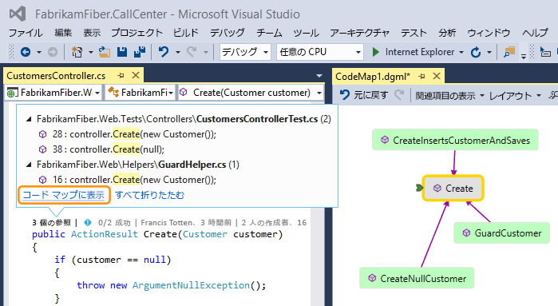
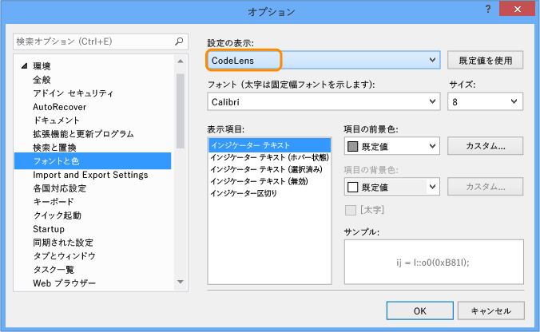

# CodeLens によるコード変更とその他の履歴の検索

CodeLens では、エディターを離れずにコードに関する情報を検索できるため、自分の作業に専念できます。 コードの参照、コードへの変更、リンクされたバグ、作業項目、コード レビュー、単体テストを検索できます。

::: moniker range=">=vs-2019"

> [!NOTE]
> CodeLens は Visual Studio Community エディションで使用できますが、"*ソース管理*" のインジケーターはこのエディションでは使用できません。

::: moniker-end

::: moniker range="vs-2017"

> [!NOTE]
> CodeLens は、Visual Studio の Enterprise および Professional エディションのみで使用できます。 Visual Studio Community エディションでは使用できません。

::: moniker-end

コードの各部分がソリューションのどこでどのように使用されているかをご覧ください。

エディターから離れずに、コードの変更についてチームに問い合わせることができます。

表示するインジケーターを選択するか、CodeLens のオンとオフを切り替えるには、 **[ツール]** 、 **[オプション]** 、 **[テキスト エディター]** 、 **[すべての言語]** 、 **[CodeLens]** の順に移動します。

## コード参照の検索

C# コードまたは Visual Basic コードでの参照を検索することができます。

1. **参照**インジケーターを選択するか、または **Alt**+**2** キーを押します。

   

   > [!NOTE]
   > インジケータの表示に**参照が 1 つもない**場合は、C# コードまたは Visual Basic コードからの参照がないということです。 ただし、 *.xaml* ファイルや *.aspx* ファイルなどの他の項目に参照が含まれる場合があります。

2. 参照元コードを表示するには、リスト内の参照の上にマウス ポインターを合わせます。

   

3. 参照を含むファイルを開くには、参照をダブルクリックします。

### コード マップ

コードとその参照の間の関係を表示するには、[コード マップを作成](../modeling/map-dependencies-across-your-solutions.md)します。 コード マップのショートカット メニューで、 **[すべての参照の表示]** を選択します。

## コードに含まれる変更の検索

コードの変遷をたどるため、コードの履歴を確認します。 または、他の分岐での変更がコードに与える可能性のある影響を理解できるよう、変更をコードにマージする前に、それらの変更を検討します。

要件:

- Visual Studio Enterprise または Professional エディション

- Azure DevOps Services、Team Foundation Server 2013 以降、または Git

- コード エディターからチームと通信するための [Skype for Business](/skypeforbusiness/)

Team Foundation バージョン管理 (TFVC) または Git で格納されている C# または Visual Basic コードでは、CodeLens の詳細をクラス レベルまたはメソッド レベルで取得します (*コードの要素レベル*のインジケーター)。 Git リポジトリが TfGit でホストされている場合、TFS 作業項目へのリンクも取得します。

*.cs* または *.vb* 以外のファイルの種類については、ウィンドウ下部の 1 個所でファイル全体の CodeLens の詳細を取得します (*ファイル レベル* のインジケーター)。

### コードの要素レベルのインジケーター

コードの要素レベルのインジケーターでは、コードの変更者とその変更内容を確認できます。 コードの要素レベルのインジケーターは、C# および Visual Basic コードに対して利用できます。

これは、Team Foundation Server または Azure DevOps Services で Team Foundation バージョン管理 (TFVC) を使用するときに表示されます。

既定の時間は直近 12 か月です。 Team Foundation Server にコードが格納される場合、[TFSConfig](/azure/devops/server/command-line/tfsconfig-cmd) コマンドおよび **/indexHistoryPeriod** フラグを指定した [CodeIndex](../ide/codeindex-command.md) コマンドを実行することにより、この期間を変更できます。

1 年以上前のものを含む、すべての変更の詳細な履歴を表示するには、 **[すべてのファイルの変更を表示する]** を選択します。

**[履歴]** ウィンドウが開きます。

ファイルが Git リポジトリにある場合に、コードの要素レベルの変更インジケーターを選択すると、このように表示されます。

### ファイル レベルのインジケーター

ウィンドウ下部のファイル レベルのインジケーターで、ファイル全体の変更を探します。

> [!NOTE]
> ファイル レベルのインジケーターは、C# ファイルおよび Visual Basic ファイルでは利用できません。

変更に関する詳細情報を取得するには、その項目を右クリックします。 TFVC を使用しているか Git を使用しているかに応じて、ファイルのバージョンの比較、詳細の表示と変更セットの追跡、ファイルの選択バージョンの取得、その変更の作成者への電子メール通知のためのオプションがあります。 **チーム エクスプローラー**に詳細の一部が表示されます。

一定期間内にコードを変更したユーザーも表示されます。 これは、チームでの変更のパターンを見つけて影響を評価するために役立ちます。

### 現在の分岐での変更の検索

安定したコードの状態を損なわせるリスクを軽減するために、チームは複数の分岐 (メイン分岐とその下位の開発分岐など) で作業する場合があります。

メイン分岐で、コードを変更したユーザーの数と、変更の数を確認できます。それには、**Alt**+**6**キーを押します。

### コードが分岐された時期の確認

コードが分岐された時期を確認するには、子分岐のコードに移動します。 次に、**変更**インジケーターを選択するか、**Alt**+**6** キーを押します。

### 他の分岐から追加される変更の検索

追加された変更を表示することができます。 次のスクリーン ショットでは、"Dev" 分岐で、バグ修正が行われています。

変更は、現在の分岐 ("Main" 分岐) を離れることなく検討できます。

### 変更がマージされた時期の確認

変更がマージされた時期を確認できます。したがって、分岐にどの変更が含まれているかを特定できます。

たとえば、メイン分岐のコードに、"Dev" 分岐からのバグ修正が適用されるとします。

### 追加される変更をローカル バージョンと比較します

追加される変更をローカル バージョンと比較するには、**Shift**+**F10** キーを押すか、または変更セットをダブルクリックします。

### 分岐アイコン

**[分岐]** 列のアイコンは、分岐が、作業中の分岐とどのような関係にあるのかを示します。

|**アイコン**|**変更元:**|
|--------------| - |
|![CodeLens:[現在の分岐からの変更] アイコン](../ide/media/codelensbranchcurrenticon.png)|現在の分岐|
|![CodeLens:[親分岐からの変更] アイコン](../ide/media/codelensbranchparenticon.png)|親分岐|
|![CodeLens:[子分岐からの変更] アイコン](../ide/media/codelensbranchchildicon.png)|子分岐|
|![CodeLens:[ピア分岐からの変更] アイコン](../ide/media/codelensbranchpeericon.png)|ピア分岐|
|![CodeLens:[遠くの分岐からの変更] アイコン](../ide/media/codelensbranchfurtherawayicon.png)|親、子、またはピアより遠い分岐|
|![CodeLens:[親からのマージ] アイコン](../ide/media/codelensbranchmergefromparenticon.png)|親分岐から子分岐へのマージ|
|![CodeLens:[子分岐からのマージ] アイコン](../ide/media/codelensbranchmergefromchildicon.png)|子分岐から親分岐へのマージ|
|![CodeLens:[関連付けられていない分岐からのマージ] アイコン](../ide/media/codelensbranchmergefromunrelatedicon.png)|無関係の分岐からのマージ (ベースレス マージ)|

## リンクされた作業項目

リンクされた作業項目を検出するには、**作業項目**インジケーターを選択するか、または **Alt**+**8** キーを押します。

## リンクされたコード レビュー

リンクされたコード レビューを検出するには、**レビュー** インジケーターを選択します。 キーボードを使用する場合は、**Alt** キーを押しながら**左方向**キーまたは**右方向**キーを押して、インジケーター オプション間を移動します。

## リンクされているバグ

リンクされているバグを検出するには、**バグ** インジケーターを選択するか、または **Alt**+**7** キーを押します。

## 項目の所有者に連絡する

項目の所有者を確認するには、**所有者**インジケーターを選択するか、または **Alt**+**5** キーを押します。

連絡先のオプションを表示する項目のショートカット メニューを開きます。 Lync または Skype for Business がインストールされている場合は、次のオプションが表示されます。

## 関連付けられた単体テスト

**テスト エクスプローラー**を開くことなく、ご使用の C# コードまたは Visual Basic コード向けに存在する単体テストを検出することができます。

1. [単体テスト コード](../test/unit-test-your-code.md)に関連付けられたアプリケーション コードに移動します。

2. CodeLens テスト インジケーターを読み込むためにアプリケーションをまだビルドしていない場合は、ビルドします。 

3. コード用のテストをレビューするには、**Alt**+**3** キーを押します。

     

4. 警告アイコン が表示された場合、まだ実行されていないので、テストを実行します。

     

5. テストの定義を確認するには、CodeLens インジケーターのウィンドウでテスト項目をダブルクリックして、エディターでコード ファイルを開きます。

     

6. テストの結果を確認するには、テスト状態インジケーター (または) を選択するか、**Alt**+**1** キーを押します。

     

7. 何人のユーザーによってこのテストが変更されたか、だれがこのテストを変更したか、また、このテストに対していくつの変更が行われたかを確認するには、[コードの履歴とリンクされた項目を検索](#find-changes-in-your-code)します。

## キーボード ショートカット

キーボードを使用してインジケーターを選択するには、**Alt** キーを押したままにして関連する数字キーを表示し、目的のインジケーターに対応する数字キーを押します。

> [!NOTE]
> **レビュー** インジケーターを選択するには、**Alt** キーを押しながら、左方向キーと右方向キーを使用して移動します。

## Q & A

### Q:CodeLens を有効または無効にしたり、表示するインジケーターを選択したりするには、どうしたらいいですか。

**A:** 参照インジケーター以外のインジケーターは無効にも有効にもできます。 **[ツール]** 、 **[オプション]** 、 **[テキスト エディター]** 、 **[すべての言語]** 、 **[CodeLens]** の順に進みます。

インジケーターが有効の場合は、インジケーターから CodeLens のオプションを開くこともできます。

エディター ウィンドウの下部にあるシェブロン アイコンを使用して、CodeLens のファイル レベル インジケーターのオンとオフを切り替えます。

### Q:CodeLens はどこにありますか。

**A:** CodeLens は、メソッド、クラス、インデクサー、プロパティ レベルの C# および Visual Basic のコードで表示されます。 それ以外の種類のファイルについては、ファイル レベルで CodeLens が表示されます。

- CodeLens が有効になっていることを確認します。 **[ツール]** 、 **[オプション]** 、 **[テキスト エディター]** 、 **[すべての言語]** 、 **[CodeLens]** の順に進みます。

- コードが TFS に格納されている場合は、 [TFS Config コマンド](../ide/codeindex-command.md) と共に [CodeIndex コマンド](/azure/devops/server/command-line/tfsconfig-cmd)を使用することによって、コード インデックス作成が有効になっていることを確認します。

- DevOps 関連のインジケーターは、作業項目がコードにリンクされていて、リンクされた作業項目を開くアクセス許可をユーザーが持っている場合にだけ表示されます。 [チーム メンバーのアクセス許可](/azure/devops/organizations/security/view-permissions?view=vsts)があることを確認してください。

- アプリケーション コードに単体テストがない場合は、単体テスト インジケーターが表示されません。 テスト状態インジケーターは、テスト プロジェクトに自動的に表示されます。 アプリケーション コードに単体テストがあることがわかっているのに、テスト インジケーターが表示されない場合は、ソリューションのビルドを試みます (**Ctrl**+**Shift**+**B**)。

::: moniker range=">=vs-2019"

> [!TIP]
> CodeLens は Visual Studio Community エディションで使用できますが、"*ソース管理*" のインジケーターはこのエディションでは使用できません。

::: moniker-end

::: moniker range="vs-2017"

> [!TIP]
> CodeLens は、Visual Studio Community エディションでは使用できません。

::: moniker-end

### Q:コミットの作業項目詳細が表示されないのはなぜですか。

**A:** CodeLens が Azure Boards または TFS で作業項目を見つけることができない可能性があります。 その作業項目があるプロジェクトに接続していることと、その作業項目を表示するアクセス許可があることを確認してください。 Azure Boards または TFS での作業項目 ID に関する誤った情報がコミットの説明に含まれている場合、作業項目の詳細が表示されないこともあります。

### Q:Skype インジケーターが表示されないのはなぜですか。

**A:** Skype for Business にサインインしていない場合、Skype for Business がインストールされていない場合、またはサポートされている構成がない場合、Skype インジケーターは表示されません。 ただし、その場合でもメールの送信はできます。

**サポートされる Skype および Lync 構成**

- Skype for Business (32 ビットまたは 64 ビット)

- Lync 2010 以降のみ (32 ビットまたは 64 ビット)。ただし Windows 8.1 での Lync Basic 2013 は除く

CodeLens では、異なるバージョン の Lync または Skype はインストールできません。 Visual Studio のローカライズ バージョンに対して、Lync または Skype がローカライズされていないことがあります。

### Q:CodeLens のフォントと色を変更するにはどうすればよいですか。

**A:** **[ツール]** 、 **[オプション]** 、 **[環境]** 、 **[フォントおよび色]** の順に進みます。

キーボードを使用するには:

1. **Alt**+**T**+**O** キーを押して、 **[オプション]** ダイアログ ボックスを開きます。

2. **上方向** キーまたは **下方向** キーを押して **[環境]** ノードに移動するか、 **左方向** キーを押してノードを展開します。

3. **下方向** キーを押して **[フォントおよび色]** に移動します。

4. **Tab** キーを押して **[設定の表示]** の一覧に移動し、**下方向**キーを押して **[CodeLens]** を選択します。

### Q:CodeLens ヘッドアップ ディスプレイを移動できますか。

**A:** はい、できます。![[Dock] アイコン](../ide/media/codelensdockwindow.png)を選択して、CodeLens をウィンドウとしてドッキングします。

![CodeLens インジケーター ウィンドウの [Dock] ボタン](../ide/media/codelensselectdockwindow.png)

### Q:インジケーターを更新するにはどうすればよいですか。

**A:** 方法は、インジケーターによって異なります。

- **参照**:このインジケーターは、コードが変更されるときに自動的に更新されます。 **参照**インジケーターが独立したウィンドウとしてドッキングされている場合は、 **[更新]** を選択することでインジケーターを更新できます。

   ![CodeLens 参照の [更新] ボタン](../ide/media/codelensviewreferencesdocked.png)

- **チーム**:これらのインジケーターを更新するには、右クリック メニューから **[CodeLens チームのインジケーターの更新]** を選択します。

   ![[CodeLens チームのインジケーターの更新] メニュー項目](../ide/media/codelensrefreshindicatorsfromcode.png)

- **テスト**:[コードの単体テストを検索し](#associated-unit-tests)、**テスト** インジケーターを更新します。

### Q:"ローカル バージョン" とは何ですか。

**A:** **[ローカル バージョン]** 矢印は、ファイルのローカル バージョンの最新の変更セットを指しています。 サーバーにさらに新しい変更セットが含まれる場合、その変更セットは、使用されている並べ替え順序に応じて **[ローカル バージョン]** 矢印の上または下に表示されます。

### Q:履歴やリンクされた項目が表示されるように CodeLens によるコードの処理方法を管理することはできますか。

**A:** はい。 コードが TFS にある場合は、[TFS Config コマンド](/azure/devops/server/command-line/tfsconfig-cmd) と共に [CodeIndex コマンド](../ide/codeindex-command.md)を使用します。

### Q:ソリューションを最初に開いたときに、ファイルに CodeLens テスト インジケーターが表示されなくなります。 これを読み込むにはどうすればよいですか。

**A:** プロジェクトをリビルドし、ファイルに読み込む CodeLens テスト インジケーターを取得します。 パフォーマンスを向上させるため、Visual Studio では、コード ファイルが読み込まれるときにテスト インジケーターのソース情報がフェッチされなくなります。 テスト インジケーターは、ビルド後、または**テスト エクスプローラー**でダブルクリックしてテストに移動するときに読み込まれます。

## 関連項目

- [コード エディターの機能](../ide/writing-code-in-the-code-and-text-editor.md)
