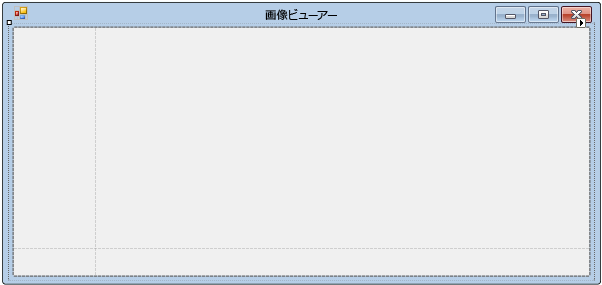

# 手順 4: TableLayoutPanel コントロールを使用したフォームのレイアウトの設定

この手順では、フォームに <xref:System.Windows.Forms.TableLayoutPanel> コントロールを追加します。 TableLayoutPanel は、後で追加するフォームのコントロールを適切にアラインするために役立ちます。

## TableLayoutPanel コントロールを使用してフォームのレイアウトを設定する方法

1. Visual Studio IDE の左側で、 **[ツールボックス]** タブを選択します。(または、メニュー バーから **[表示]**  >  **[ツールボックス]** の順に選択するか、**Ctrl**+**Alt**+**X** キーを押します)

1. 次のスクリーンショットに示すように、 **[コンテナー]** グループの横にある小さな三角形をクリックし、このグループを開きます。

     ![[コンテナー] グループ](../ide/media/express_toolbox.png) 
"***[コンテナー]*** *グループ*"

1. ボタン、チェック ボックス、ラベルなどのコントロールをフォームに追加できます。 **ツールボックス**の TableLayoutPanel コントロールをダブルクリックします。 (または、ツールボックスからフォームへ、コントロールをドラッグできます。)次のスクリーンショットに示すように、この操作を行うと、IDE で TableLayoutPanel コントロールがフォームに追加されます。

      
"***TableLayoutPanel*** *コントロール*"

    > [!NOTE]
    > TableLayoutPanel を追加した後、 **[TableLayoutPanel タスク]** というタイトルのウィンドウがフォーム内に表示された場合は、フォーム内の任意の場所をクリックしてそのウィンドウを閉じます。 このウィンドウについては、このチュートリアルで後ほど詳しく説明します。

     **ツールボックス**は、タブをクリックするとフォームの前面に展開され、ツールボックスの外部の任意の場所をクリックすると閉じます。 これは IDE の自動非表示機能です。 ウィンドウの右上隅にあるプッシュピン アイコンをクリックすると、すべてのウィンドウについてこの機能のオンとオフを切り替えることができます。このアイコンをクリックするたびに、自動非表示になるか位置が固定されるかが切り替わります。 プッシュピン アイコンは次のように表示されます。

      
"***プッシュピン*** *アイコン*"

1. TableLayoutPanel をクリックして選択します。 どのコントロールが選択されているかを確認するには、次のスクリーンショットのような、 **[プロパティ]** ウィンドウの上部にあるドロップダウン リストを確認します。

     ![TableLayoutPanel コントロールを示す [プロパティ] ウィンドウ](../ide/media/express_controlspropwin.png) 
"***TableLayoutPanel*** *コントロールを示す* ***[プロパティ]*** *ウィンドウ*"

1. **[プロパティ]** ウィンドウのツール バーにある **[アルファベット順]** をクリックします。 これにより、 **[プロパティ]** ウィンドウのプロパティの一覧がアルファベット順に並べ替えられ、このチュートリアルのプロパティが探しやすくなります。

1. コントロール セレクターは、 **[プロパティ]** ウィンドウの上部にあるドロップダウン リストです。 この例では、`tableLayoutPanel1` というコントロールが選択されています。 コントロールを選択するには、**Windows フォーム デザイナー**の領域をクリックするか、コントロール セレクターから選択します。

   TableLayoutPanel が選択されているので、**Dock** プロパティを探し、 **[Dock]** をクリックします (**None** に設定されています)。 値の横にドロップダウン矢印が表示されます。 次のスクリーンショットに示すように、矢印をクリックし、 **[Fill]** ボタン (中央にある大きいボタン) をクリックします。

     ![[塗りつぶし] が選択された [プロパティ] ウィンドウ](../ide/media/express_docktable.png) 
"***[塗りつぶし]*** *が選択された* ***[プロパティ]*** *ウィンドウ*"

     ウィンドウが別のウィンドウまたは IDE の領域にアタッチされている場合、Visual Studio の*ドッキング*が参照します。 たとえば、 **[プロパティ]** ウィンドウはドッキング解除できます &mdash;つまり、Visual Studio にアタッチせず、フローティング状態にします&mdash; または、**ソリューション エクスプローラー**にドッキングできます。

1. TableLayoutPanel の **Dock** プロパティを **Fill** に設定すると、パネルがフォーム全体に表示されることにご注目ください。 この後にフォームのサイズを変更した場合、TableLayoutPanel はドッキングされたまま、フォームに合わせてサイズが変更されます。

    > [!NOTE]
    > TableLayoutPanel は、Microsoft Office Word の表のように動作します。行と列があり、個々のセルは複数の行および列にまたがることができます。 各セルでは、1 つのコントロール (ボタン、チェック ボックス、ラベルなど) を保持できます。 TableLayoutPanel では、上の行全体にまたがる <xref:System.Windows.Forms.PictureBox> コントロール、左下のセルの <xref:System.Windows.Forms.CheckBox> コントロール、右下のセルの 4 つの <xref:System.Windows.Forms.Button> コントロールが与えられます。

1. 現在、TableLayoutPanel には 2 つの行と 2 つの列がありますが、いずれもサイズは同じになっています。 上の行と右の列のサイズがそれぞれ他方よりもかなり大きくなるように変更してみましょう。 **Windows フォーム デザイナー**で、TableLayoutPanel を選択します。 右上隅に、次のような小さな黒い三角形のボタンが表示されます。

      
"***三角形*** *のボタン*"

     このボタンは、コントロールのプロパティを自動的に設定するのに役立つタスクがあることを示しています。

1. 三角形をクリックします。次のスクリーンショットに示すように、コントロールのタスク一覧が表示されます。

      
"***TableLayoutPanel*** *タスク*"

1. **[行および列の編集]** タスクをクリックして、 **[列と行のスタイル]** ウィンドウを表示します。 **[Column1]** をクリックし、サイズを 15% に設定します。設定するには、 **[パーセント]** ボタンが選択されていることを確認し、 **[パーセント]** ボックスに「**15**」と入力します。 (これは、この後の別のチュートリアルで使用する <xref:System.Windows.Forms.NumericUpDown> コントロールです) **[Column2]** をクリックし、85% に設定します。 クリックするとウィンドウが閉じるため、まだ **[OK]** はクリックしないでください (クリックした場合は、タスク一覧を使用して再度開くことができます)

      
"***TableLayoutPanel*** *の列と行のスタイル*"

1. **[列と行のスタイル]** ウィンドウの上部にある **[表示]** ドロップダウン リストの **[行]** をクリックします。 **Row1** を 90% に、**Row2** を 10% に設定します。

1. **[OK]** を選択します。 これで、TableLayoutPanel の上の行が大きくなり、下の行が小さくなります。また、左の列が小さくなり、右の列が大きくなります。 (フォームで **tableLayoutPanel1** をクリックし、その行と列の境界線をドラッグして、TableLayoutPanel の行と列をサイズ変更できます)

      
"***TableLayoutPanel*** がサイズ変更された ***Form1*** *(画像ビューアー)* "

## 次の手順

* チュートリアルの次の手順に進むには、「 **[手順 5: フォームへのコントロールの追加](../ide/step-5-add-controls-to-your-form.md)** 」を参照してください。

* チュートリアルの前の手順に戻るには、「[手順 3:フォームのプロパティの設定](../ide/step-3-set-your-form-properties.md)」をご覧ください。

## 関連項目

* [チュートリアル 2: 制限時間ありの計算クイズの作成](tutorial-2-create-a-timed-math-quiz.md)
* [チュートリアル 3: 絵合わせゲームの作成](tutorial-3-create-a-matching-game.md)
