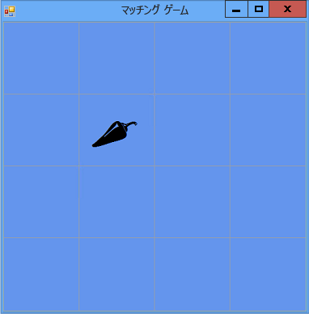

# 手順 5: ラベルの参照の追加
プログラムでは、プレーヤーがどのラベル コントロールをクリックしたかを追跡する必要があります。 現在のところ、プレーヤーが選択したすべてのラベルが表示されます。 しかし、次のように変更します。 1 つ目のラベルがクリックされると、プログラムではラベルのアイコンを表示します。 2 つ目のラベルがクリックされると、一時的に両方のアイコンを表示した後に、再びアイコンを非表示にします。 *参照変数* を使用して、1 回目および 2 回目にどのラベル コントロールがクリックされたかを追跡します。

## ラベルの参照を追加するには

1. 次のコードを使用して、フォームにラベルの参照を追加します。

     :::code language="vb" source="../snippets/visualbasic/VS_Snippets_VBCSharp/vbexpresstutorial4step5/vb/form1.vb" id="Snippet5":::
     :::code language="csharp" source="../snippets/csharp/VS_Snippets_VBCSharp/vbexpresstutorial4step5/cs/form1.cs" id="Snippet5":::

     > [!IMPORTANT]
     > このページの右上にあるプログラミング言語のコントロールを使用して、C# コード スニペットまたは Visual Basic コード スニペットのいずれかを表示します。  

     これらの参照変数は、フォームにオブジェクト (<xref:System.Windows.Forms.Timer> オブジェクト、<xref:System.Collections.Generic.List%601> オブジェクト、<xref:System.Random> オブジェクトなど) を追加するために前に使用したステートメントに似ているように見えます。 ただし、これらのステートメントでは、フォームに追加の 2 つのラベル コントロールは表示されません。これは、2 つのステートメントのいずれにも `new` を使用していないためです。 `new` キーワードを使用しないと、オブジェクトは作成されません。 `firstClicked` および `secondClicked` が参照変数と呼ばれるのはこのためです。これらは、単に Label オブジェクトを追跡 (参照) するだけです。

     変数は、オブジェクトを追跡していない間は、特殊な予約値 `null` (C# の場合) および `Nothing` (Visual Basic の場合) に設定されます。 そのため、プログラムが起動されると、`firstClicked` および `secondClicked` の両方が `null` または `Nothing` に設定されます。これは、変数が何も追跡していないことを意味しています。

2. 新しい `firstClicked` 参照変数を使用するように <xref:System.Windows.Forms.Control.Click> イベント ハンドラーを変更します。 `label_Click()` イベント ハンドラー メソッドの最後のステートメント (`clickedLabel.ForeColor = Color.Black;`) を削除し、次に示す `if` ステートメントに置き換えます  (必ずコメントと `if` ステートメント全体を含めてください)。

     :::code language="vb" source="../snippets/visualbasic/VS_Snippets_VBCSharp/vbexpresstutorial4step5/vb/form1.vb" id="Snippet6":::
     :::code language="csharp" source="../snippets/csharp/VS_Snippets_VBCSharp/vbexpresstutorial4step5/cs/form1.cs" id="Snippet6":::

3. プログラムを保存し、実行します。 いずれかのラベル コントロールをクリックすると、そのアイコンが表示されます。

4. 次のラベル コントロールをクリックすると、何も起こらないことに気付きます。 プログラムでは、プレーヤーがクリックした 1 つ目のラベルが既に追跡されているため、`firstClicked` は `null` (C# の場合) または `Nothing` (Visual Basic の場合) ではありません。 `if` ステートメントは、`firstClicked` が `null` または `Nothing` かどうかをチェックし、そうでないことがわかった場合は、`if` ステートメント内のステートメントを実行しません。 そのため、次の図に示すように、クリックされた 1 つ目のアイコンのみが黒になり、他のアイコンは非表示になります。

      
*1 つのアイコンが表示された **絵合わせゲーム** _ _*

     この状況は、チュートリアルの次のステップで **Timer** コントロールを追加することで修正します。

## 続行または確認するには

- チュートリアルの次の手順に進むには、「 **[手順 6: タイマーの追加](../ide/step-6-add-a-timer.md)** 」をご覧ください。

- チュートリアルの前の手順に戻るには、「[手順 4: 各ラベルへの Click イベント ハンドラーの追加](../ide/step-4-add-a-click-event-handler-to-each-label.md)」を参照してください。
