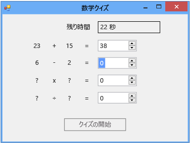

# 手順 6: 減算問題を追加する
このチュートリアルの第 6 部では、減算問題を追加し、次のタスクを実行する方法を説明します。

-   減算の値を格納します。

-   問題の乱数を生成します (答えが 0 ～ 100 になるようにします)。

-   解答を確認するメソッドを更新して、新しい減算問題についても確認するようにします。

-   タイマーの <xref:System.Windows.Forms.Timer.Tick> イベント ハンドラーを、残り時間がなくなったら正しい答えを表示するように更新します。

## 減算問題を追加するには

1.  減算問題の 2 つの整数変数をフォームの加算問題の整数変数とタイマーの間に追加します。 コードは次のようになります。

     [!code-vb[VbExpressTutorial3Step5_6#12](../ide/codesnippet/VisualBasic/step-6-add-a-subtraction-problem_1.vb)]
     [!code-csharp[VbExpressTutorial3Step5_6#12](../ide/codesnippet/CSharp/step-6-add-a-subtraction-problem_1.cs)]

     新しい整数変数の名前 (**minuend** および **subtrahend**) は、プログラミング用語ではありません。 これらは、減算する数値 (subtrahend/減数) と減算される数値 (minuend/被減数) を表す従来の数学用語です。 被減数から減数を引いたものが差になります。 変数、コントロール、コンポーネント、またはメソッドの名前を特定の名前にするようにプログラムで制限されているわけではないため、別の名前を使用することもできます。 名前の先頭を数字にすることはできないなどの規則に従う必要はありますが、一般に、x1、x2、x3、x4 などの名前を使用できます。 ただし、汎用名はコードを読み取りにくくし、問題の追跡がほとんど不可能になります。 変数名を一意で役立つようにしておくために、このチュートリアルでは乗算 (被乗数 × 乗数 = 積) および除算 (被除数 ÷ 除数 = 商) についても従来の名前を使用します。

     次に、`StartTheQuiz()` メソッドを変更して減算問題に乱数値を提供します。

2.  "Fill in the subtraction problem" というコメントの後に次のコードを追加します。

     [!code-vb[VbExpressTutorial3Step5_6#13](../ide/codesnippet/VisualBasic/step-6-add-a-subtraction-problem_2.vb)]
     [!code-csharp[VbExpressTutorial3Step5_6#13](../ide/codesnippet/CSharp/step-6-add-a-subtraction-problem_2.cs)]

     減算問題の解答が負にならないように、このコードでは、加算問題とは少し異なる方法で <xref:System.Random.Next> クラスの <xref:System.Random> メソッドを使用します。 `Next()` メソッドに 2 つの値を指定した場合、最初の値以上で 2 番目の値未満の乱数が選択されます。 次のコードでは、1 ～ 100 の乱数が選択され、minuend 変数に格納されます。

     [!code-vb[VbExpressTutorial3Step5_6#21](../ide/codesnippet/VisualBasic/step-6-add-a-subtraction-problem_3.vb)]
     [!code-csharp[VbExpressTutorial3Step5_6#21](../ide/codesnippet/CSharp/step-6-add-a-subtraction-problem_3.cs)]

     複数の方法で、このチュートリアルで前に randomizer と名付けた、Random クラスの `Next()` メソッドを呼び出すことができます。 複数の方法で呼び出すことができるメソッドをオーバーロード メソッドと呼び、IntelliSense を使用して確認することができます。 `Next()` メソッドについての IntelliSense ウィンドウのツールヒントをもう一度見てください。

     
**IntelliSense** ウィンドウのツールヒント

     ツールヒントには "**(+ 2 オーバーロード)**" と表示され、これは他の 2 つの方法で `Next()` メソッドを呼び出せることを意味します。 オーバーロードには、異なる数または型の引数が含まれていて、互いに動作が若干異なります。 たとえば、メソッドは単一の整数引数を受け取ることがあり、さらにオーバーロードの 1 つは整数と文字列を受け取ることがありますが、 目的に基づいて適切なオーバーロードを選択します。 `StartTheQuiz()` メソッドにコードを追加すると、`randomizer.Next(` を入力するとすぐに、詳細情報が IntelliSense ウィンドウに表示されます。 別のオーバーロードに切り替えるには、次の図に示すように、**上矢印**キーおよび**下矢印**キーを押します。

      **IntelliSense** での **Next()** メソッドのオーバーロード

     この場合、最小値と最大値を指定できるため、最後のオーバーロードを選択する必要があります。

3.  `CheckTheAnswer()` メソッドを、減算の答えが正しいかどうかを確認するように変更します。

     [!code-vb[VbExpressTutorial3Step5_6#14](../ide/codesnippet/VisualBasic/step-6-add-a-subtraction-problem_4.vb)]
     [!code-csharp[VbExpressTutorial3Step5_6#14](../ide/codesnippet/CSharp/step-6-add-a-subtraction-problem_4.cs)]

     Visual C# では、`&&` は `logical and` 演算子です。 Visual Basic でこれに相当する演算子は `AndAlso` です。 これらの演算子は、"addend1 と addend2 の合計が sum NumericUpDown の値と等しい場合、かつ minuend から subtrahend を引いた値が difference NumericUpDown の値と等しい場合" ということを示しています。 `CheckTheAnswer()` メソッドは、加算問題と減算問題の両方に正解した場合にのみ `true` を返します。

4.  タイマーの Tick イベント ハンドラーの最後の部分を次のコードで置き換えて、残り時間がなくなったら正しい解答を表示するようにします。

     [!code-vb[VbExpressTutorial3Step5_6#22](../ide/codesnippet/VisualBasic/step-6-add-a-subtraction-problem_5.vb)]
     [!code-csharp[VbExpressTutorial3Step5_6#22](../ide/codesnippet/CSharp/step-6-add-a-subtraction-problem_5.cs)]

5.  コードを保存し、実行します。

     プログラムには、次の図に示すように減算問題が含まれます。

     
減算の問題のある**計算クイズ**

## 続行または確認するには

-   チュートリアルの次の手順に進むには、「[手順 7:乗算問題と除算問題の追加](../ide/step-7-add-multiplication-and-division-problems.md)」を参照してください。

-   チュートリアルの前の手順に戻るには、「[手順 5:NumericUpDown コントロールの Enter イベント ハンドラーの追加](../ide/step-5-add-enter-event-handlers-for-the-numericupdown-controls.md)」を参照してください。
