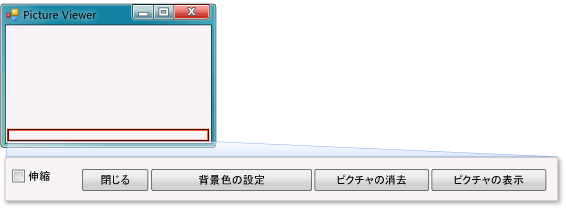

# <a name="step-9-review-comment-and-test-your-code"></a>手順 9: レビュー、コメントの追加、およびコードのテスト

次に、コードにコメントを追加します。 コメントは、アプリの動作には影響しないメモです。 コメントを追加すると、コードを読む人が動作内容を理解しやすくなります。 コードにコメントを追加することをお勧めします。

行をコメントとしてマークするには、C# では 2 つのスラッシュ (//) を使用します。 Visual Basic では、単一引用符 (') を使用してコメントとしてマークします。 コメントを追加したら、アプリケーションをテストします。 プロジェクトで作業している間にコードを頻繁に実行してテストすることをお勧めします。これによって、コードが複雑になる前に、問題を早期に見つけて修正することができます。 これは*反復テスト*と呼ばれます。

一部の機能を作成しただけで、まだ完成はしていませんが、既にピクチャを読み込むことはできます。 コードへのコメントの追加とテストを行う前に、頻繁に使用することになるコードの概念についてここで確認しておきましょう。

- **Windows フォーム デザイナー**で **[Show a picture]** ボタンをダブルクリックしたとき、プログラムのコードに自動的に*メソッド*が追加されました。

- メソッドはコードを整理する 1 つの方法で、これを使用してコードをまとめることができます。

- ほとんどの場合、メソッドではいくつかの処理を特定の順序で行います。たとえば、ここで作成した `showButton_Click()` (または `ShowButton_Click()`) メソッドでは、ダイアログ ボックスを表示してから、ピクチャを読み込みます。

- メソッドは、コード *ステートメント*、またはコード行で構成されます。 コード ステートメントをまとめたものがメソッドであると考えることができます。

- メソッドを実行する (*呼び出す*) と、メソッド内のステートメントが最初のものから順番に 1 つずつ実行されます。

   ステートメントの例を次に示します。

  ```csharp
  PictureBox1.Load(openFileDialog1.FileName);
  ```

  ```vb
  pictureBox1.Load(openFileDialog1.FileName)
  ```

   ステートメントは、プログラムに処理を実行させる指示にあたります。 C# の場合、ステートメントは必ずセミコロンで終わります。 Visual Basic の場合は、行の末尾がステートメントの末尾になります (Visual Basic ではセミコロンは必要ありません)。上記のステートメントでは、ユーザーが **OpenFileDialog** コンポーネントで選択したファイルを読み込むように <xref:System.Windows.Forms.PictureBox> コントロールに指示しています。

## <a name="to-add-comments"></a>コメントを追加するには

1. コードに次のコメントを追加します。

     [!INCLUDE [devlang-control-csharp-vb](./includes/devlang-control-csharp-vb.md)]

     [!code-csharp[VbExpressTutorial1Step9_10#1](../ide/codesnippet/CSharp/step-9-review-comment-and-test-your-code_1.cs)]

     [!code-vb[VbExpressTutorial1Step9_10#1](../ide/codesnippet/VisualBasic/step-9-review-comment-and-test-your-code_1.vb)]

    これで **showButton** ボタンの <xref:System.Windows.Forms.Control.Click> イベント ハンドラーが完成し、使用できる状態になりました。 コードの記述を開始するとき、最初に `if` ステートメントを記述しました。 `if` ステートメントは、"ある条件を確認し、それに当てはまる場合に処理を実行する" ようにアプリに指示するステートメントです。 ここでは、 **[ファイルを開く]** ダイアログ ボックスを開き、ユーザーがファイルを選択して **[OK]** をクリックした場合にそのファイルを **PictureBox** に読み込むようにアプリに指示しています。

    > [!TIP]
    > IDE はコードを簡単に記述できるように設計されており、そのための方法の 1 つとして*コード スニペット*が用意されています。 スニペットは、小さなコードのブロックに展開されるショートカットです。
    >
    >  使用可能なすべてのスニペットを表示できます。 メニュー バーで、 **[ツール]**  >  **[コード スニペット マネージャー]** の順に選択します。 C# では、`if` スニペットは **Visual C#** に含まれています。 Visual Basic の場合、`if` スニペットは **[コード パターン]**  >  **[条件とループ]** にあります。 このマネージャーを使用して、既存のスニペットを参照したり独自のスニペットを追加したりすることができます。
    >
    >  コードの入力時にスニペットをアクティブにするには、そのスニペットを入力して **Tab** キーを押します。 多くのスニペットは **IntelliSense** ウィンドウに表示されます。**Tab** キーを 2 回押すのは、1 回目で **IntelliSense** ウィンドウからスニペットを選択し、2 回目でそのスニペットを使用するように IDE に指示するためです (IntelliSense は `if` スニペットはサポートしますが、`ifelse` スニペットはサポートしません)。

1. アプリケーションを実行する前に、 **[すべてを保存]** ツール バーのボタンを選択してアプリを保存します。これは次のスクリーンショットのようになります。

     ![[すべてを保存] ツール バー ボタン](../ide/media/express_iconsaveall.png)<br>
***[すべてを保存]*** *ボタン*

     また、アプリを保存するには、メニュー バーから **[ファイル]**  >  **[すべてを保存]** を選択します (または、**Ctrl**+**Shift**+**S** キーを押します)。 早めに、かつ頻繁に保存することをお勧めします。

     実行中のプログラムは次の図のようになります。

     <br>***Picture Viewer***

## <a name="to-test-your-app"></a>アプリをテストするには

1. **F5** キーを押すか、ツール バーの **[デバッグ開始]** をクリックします。

1. **[Show a picture]** をクリックして、記述したコードを実行します。 まず、アプリで **[ファイルを開く]** ダイアログ ボックスを開きます。 ダイアログ ボックスの下部にある **[ファイルの種類]** ボックスにフィルターが表示されることを確認します。 次に、ピクチャがある場所に移動して、そのピクチャを開きます。 通常、Windows オペレーティング システムに付属しているサンプルのピクチャが *My Documents* フォルダーの *My Pictures\Sample Pictures* フォルダーにあります。

    > [!TIP]
    > **[Select a picture file]** ダイアログ ボックスにイメージが表示されない場合は、ダイアログ ボックスの右下のボックスで **[すべてのファイル (*.\*)]** フィルターが選択されていることを確認します。

1. ピクチャを読み込みます。ピクチャが PictureBox に表示されます。 その後、境界線をドラッグしてフォームのサイズを変更してみてください。 フォーム内にドッキングした TableLayoutPanel 内に PictureBox をドッキングしてあるため、ピクチャの領域が、幅はフォームと同じで、高さはフォームの上部 90% に収まるようにサイズ変更されます。 <xref:System.Windows.Forms.TableLayoutPanel> コンテナーと <xref:System.Windows.Forms.FlowLayoutPanel> コンテナーを使用したのはそのためです。これらのコンテナーを使用することで、ユーザーがフォームのサイズを変更したときに適切なサイズが維持されます。

     この時点では、大きなピクチャはピクチャ ビューアーの境界線を超えます。 次の手順では、ウィンドウに合ったピクチャを作成するコードを追加します。

## <a name="to-continue-or-review"></a>続行または確認するには

- チュートリアルの次の手順に進むには、「 **[手順 10:その他のボタンおよびチェック ボックスに対するコードの記述](../ide/step-10-write-code-for-additional-buttons-and-a-check-box.md)** 」を参照してください。

- チュートリアルの前の手順に戻るには、「[手順 8:[Show a Picture] ボタンのイベント ハンドラーのコードの記述](../ide/step-8-write-code-for-the-show-a-picture-button-event-handler.md)」をご覧ください。

## <a name="see-also"></a>関連項目

* [チュートリアル 2: 制限時間ありの計算クイズの作成](tutorial-2-create-a-timed-math-quiz.md)
* [チュートリアル 3: 絵合わせゲームの作成](tutorial-3-create-a-matching-game.md)
