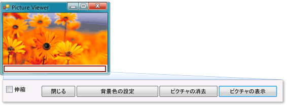

# チュートリアル 1: ピクチャ ビューアーの作成

このチュートリアルでは、ピクチャをファイルから読み込んでウィンドウに表示するアプリを作成します。 **Windows フォーム デザイナー**を使用してボタンやピクチャ ボックスなどのコントロールをフォームにドラッグする方法、それらのプロパティを設定する方法、およびコンテナーを使用してフォームのサイズを滑らかに変更する方法を習得できます。 また、コードの記述の基本事項についても学習します。

> [!NOTE]
> このチュートリアルでは、Visual C# と Visual Basic の両方が取り上げられているため、使用しているプログラミング言語固有の情報に注意してください。

このチュートリアルでは、次のタスクについて説明します。

* 新しいプロジェクトを作成します。

* アプリケーションをテスト (デバッグ) します。

* チェック ボックスやボタンなどの基本的なコントロールをフォームに追加します。

* レイアウトを使用してフォーム上のコントロールの位置を設定します。

* **[ファイルを開く]** ダイアログ ボックスと **[色]** ダイアログ ボックスをフォームに追加します。

* IntelliSense とコード スニペットを使用してコードを記述します。

* イベント ハンドラー メソッドを記述します。

完了すると、アプリは次の図のようになります。

## チュートリアルのリンク

|Title|説明|
|-----------|-----------------|
|[手順 1:Windows フォーム アプリ プロジェクトを作成する](../ide/step-1-create-a-windows-forms-application-project.md)|まず、Windows フォーム アプリ プロジェクトを作成します。|
|[手順 2:Picture Viewer アプリを実行する](../ide/step-2-run-your-program.md)|前の手順で作成した Windows フォーム アプリ プロジェクトを実行します。|
|[手順 3:フォームのプロパティの設定](../ide/step-3-set-your-form-properties.md)|**[プロパティ]** ウィンドウを使用してフォームの外観を変更します。|
|[手順 4:TableLayoutPanel コントロールを使用したフォームのレイアウトの設定](../ide/step-4-lay-out-your-form-with-a-tablelayoutpanel-control.md)|フォームに `TableLayoutPanel` コントロールを追加します。|
|[手順 5:フォームへのコントロールの追加](../ide/step-5-add-controls-to-your-form.md)|`PictureBox` コントロールや `CheckBox` コントロールなどのコントロールをフォームに追加します。 また、ボタンも追加します。|
|[手順 6:ボタン コントロールの名前を設定する](../ide/step-6-name-your-button-controls.md)|ボタンの名前をわかりやすい名前に変更します。|
|[手順 7:フォームへのダイアログ コンポーネントの追加](../ide/step-7-add-dialog-components-to-your-form.md)|フォームに `OpenFileDialog` コンポーネントと `ColorDialog` コンポーネントを追加します。|
|[手順 8:[Show a Picture] ボタンのイベント ハンドラーのコードの記述](../ide/step-8-write-code-for-the-show-a-picture-button-event-handler.md)」をご覧ください。|IntelliSense ツールを使用してコードを記述します。|
|[手順 9:レビュー、コメントの追加、およびコードのテスト](../ide/step-9-review-comment-and-test-your-code.md)|コードのレビューとテストを行います。 必要に応じてコメントを追加します。|
|[手順 10:その他のボタンおよびチェック ボックスに対するコードの記述](../ide/step-10-write-code-for-additional-buttons-and-a-check-box.md)|他のボタンやチェック ボックスを使用できるようにするために、IntelliSense を使用してコードを記述します。|
|[手順 11:アプリを実行して他の機能を試す](../ide/step-11-run-your-program-and-try-other-features.md)|アプリを実行して背景色を設定します。 色、フォント、および境界線の変更など、その他の機能を試します。|

## 次の手順

チュートリアルを開始するには、「 **[手順 1:Windows フォーム アプリケーション プロジェクトの作成](../ide/step-1-create-a-windows-forms-application-project.md)** 」から始めます。

## 関連項目

* [その他の C# のチュートリアル](/visualstudio/get-started/csharp/)
* [Visual Basic のチュートリアル](/visualstudio/get-started/visual-basic/)
* [C++ のチュートリアル](../ide/getting-started-with-cpp-in-visual-studio.md)
