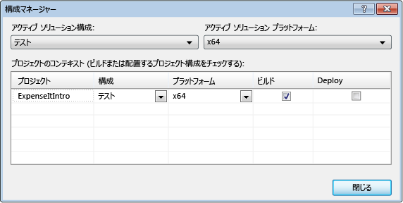
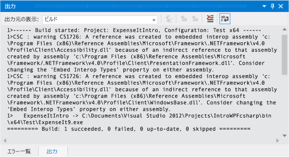

# チュートリアル: アプリケーションを構築する

このチュートリアルを完了すると、Visual Studio を使用してアプリケーションをビルドする際に構成できるオプションの使用方法を習得できます。 サンプル アプリケーション用に、カスタムのビルド構成の作成、特定の警告メッセージの非表示設定、ビルド出力情報の拡張を行います。

## サンプル アプリケーションをインストールする

[WPF アプリケーションのビルドの概要](https://code.msdn.microsoft.com/Introduction-to-Building-b8d16419)サンプルをダウンロードします。 C# か Visual Basic を選択します。 ダウンロードした *.zip* ファイルを解凍し、Visual Studio で *ExpenseItIntro.sln* ファイルを開きます。

## カスタム ビルド構成を作成する

ソリューションを作成すると、デバッグ ビルド構成およびリリース ビルド構成と、これらの既定のプラットフォーム ターゲットがソリューションに対して自動的に定義されます。 これらの構成をカスタマイズすることも、独自に作成することもできます。 ビルド構成では、ビルドの種類を指定します。 ビルド プラットフォームでは、その構成でアプリケーションが対象とするオペレーティング システムを指定します。 詳細については、「[ビルド構成について](../ide/understanding-build-configurations.md)」、「[ビルド プラットフォームについて](../ide/understanding-build-platforms.md)」、「[方法: デバッグ構成とリリース構成を設定する](../debugger/how-to-set-debug-and-release-configurations.md)」を参照してください。

**[構成マネージャー]** ダイアログ ボックスを使用すると、構成とプラットフォームの設定を変更または作成できます。 この手順では、テスト用のビルド構成を作成します。

### ビルド構成を作成する

1. **[構成マネージャー]** ダイアログ ボックスを開きます。

   ![[ビルド] メニュー、[構成マネージャー] コマンド](../ide/media/buildwalk_configurationmanagerdialogbox.png)

1. **[アクティブ ソリューション構成]** 一覧の **\<New...\>** をクリックします。

1. **[新しいソリューション構成]** ダイアログ ボックスで、新しい構成の名前として「`Test`」と入力し、既存の **デバッグ** 構成から設定をコピーして、 **[OK]** を選びます。

   ![[新しいソリューション構成] ダイアログ ボックス](../ide/media/buildwalk_newsolutionconfigdlgbox.png)

1. **[アクティブ ソリューション プラットフォーム]** 一覧の **[\<New...\>]** を選択します。

1. **[新しいソリューション プラットフォーム]** ダイアログ ボックスで、 **[x64]** を選択します。x86 プラットフォームの設定はコピーしません。

   ![[新しいソリューション プラットフォーム] ダイアログ ボックス](../ide/media/buildwalk_newsolutionplatform.png)

1. **[OK]** を選択します。

   アクティブなソリューション構成が **テスト** に変更され、アクティブなソリューション プラットフォームが x64 に設定されました。

   

1. **[閉じる]** を選択します。

**[標準]** ツール バーの **[ソリューション構成]** ボックスの一覧を使用すると、アクティブなソリューション構成を簡単に確認または変更することができます。

![[ソリューション構成] オプション (標準ツール バー)](../ide/media/buildwalk_standardtoolbarsolutioncongfig.png)

## アプリケーションのビルド

次に、カスタム ビルド構成を使用してソリューションをビルドします。

### ソリューションをビルドする

- メニュー バーで **[ビルド]**  >  **[ソリューションのビルド]** の順に選択するか、**Ctrl**+**Shift**+**B** キーを押します。

    **[出力]** ウィンドウに、ビルドの結果が表示されます。 ビルドに成功しました。

## コンパイラの警告を非表示にする

次に、コンパイラに警告を生成させるコードを紹介します。

1. C# プロジェクトで、*ExpenseReportPage.xaml.cs* ファイルを開きます。 **ExpenseReportPage** メソッドにコード `int i;` を追加します。

    OR

    Visual Basic プロジェクトで、*ExpenseReportPage.xaml.vb* ファイルを開きます。 カスタム コンストラクターの **Public Sub New...** にコード `Dim i` を追加します。

1. ソリューションをビルドします。

**[出力]** ウィンドウに、ビルドの結果が表示されます。 ビルドに成功しましたが、次の警告が生成されました。

ビルド出力が見やすくなるように、ビルド時に特定の警告メッセージを一時的に非表示にすることができます。

### C# の特定の警告を非表示にする

1. **ソリューション エクスプローラー** で、最上位のプロジェクト ノードを選択します。

1. メニュー バーで **[表示]**  >  **[プロパティ ページ]** の順に選びます。

     **プロジェクト デザイナー** が開きます。

1. **[ビルド]** ページを選択し、 **[警告の表示なし]** ボックスで、警告番号 **0168** を指定します。

     ![[ビルド] ページ、[プロジェクト デザイナー]](../ide/media/buildwalk_csharpsuppresswarnings.png)

     詳細については、「[Build Page, Project Designer (C#)](../ide/reference/build-page-project-designer-csharp.md)」([ビルド] ページ (プロジェクト デザイナー) (C#)) を参照してください。

1. ソリューションをビルドします。

     **[出力]** ウィンドウには、ビルドの概要情報のみが表示されます。

     

### Visual Basic のすべてのビルド警告を非表示にする

1. **ソリューション エクスプローラー** で、最上位のプロジェクト ノードを選択します。

2. メニュー バーで **[表示]**  >  **[プロパティ ページ]** の順に選びます。

     **プロジェクト デザイナー** が開きます。

3. **[コンパイル]** ページで、 **[すべての警告を表示しない]** チェック ボックスをオンにします。

     ![[コンパイル] ページ、[プロジェクト デザイナー]](../ide/media/buildwalk_vbsuppresswarnings.png)

     詳細については、「[Visual Basic での警告の構成](../ide/configuring-warnings-in-visual-basic.md)」を参照してください。

4. ソリューションをビルドします。

   **[出力]** ウィンドウには、ビルドの概要情報のみが表示されます。

   

   詳細については、[コンパイラ警告の非表示](../ide/how-to-suppress-compiler-warnings.md)」を参照してください。

## 出力ウィンドウに追加のビルド詳細を表示する

**[出力]** ウィンドウに表示されるビルド プロセスに関する情報量を変更できます。 ビルドの詳細度は、通常、**最小** に設定されています。これは、優先度の高い警告またはエラーと共にビルド プロセスの概要のみが **[出力]** ウィンドウに表示されることを意味します。 ビルドに関する詳細情報を表示するには、「[[オプション] ダイアログ ボックス、[プロジェクトおよびソリューション]、[ビルド/実行]](../ide/reference/options-dialog-box-projects-and-solutions-build-and-run.md)」を参照してください。

> [!IMPORTANT]
> 詳細情報を表示する場合は、ビルドの完了までにかかる時間が長くなります。

### [出力] ウィンドウの情報量を変更する

1. **[オプション]** ダイアログ ボックスを開きます。

     ![[ツール] メニューの [オプション] コマンド](../ide/media/exploreide-toolsoptionsmenu.png)

1. **[プロジェクトおよびソリューション]** カテゴリを選択し、 **[ビルド/実行]** ページを選択します。

1. **[MSBuild プロジェクト ビルドの出力の詳細]** ボックスの一覧の **[標準]** を選択し、 **[OK]** をクリックします。

1. メニュー バーで、 **[ビルド]**  >  **[ソリューションのクリーン]** を選びます。

1. ソリューションをビルドし、 **[出力]** のウィンドウの情報をレビューします。

     ビルド情報には、ビルドの開始時刻 (出力の先頭にあります) とファイルが処理された順序が含まれています。 この情報には、ビルド時に Visual Studio で実行される実際のコンパイラ構文も含まれています。

     たとえば、C# のビルドの場合、[/nowarn](/dotnet/visual-basic/reference/command-line-compiler/nowarn) オプションには、このトピックで指定した警告コード **0168** が、他の 3 つの警告と共に示されます。

     Visual Basic のビルドの場合、[/nowarn](/dotnet/visual-basic/reference/command-line-compiler/nowarn) には除外する特定の警告が含まれていないため、警告は表示されません。

    > [!TIP]
    > **Ctrl**+**F** キーを押して **[検索]** ダイアログ ボックスを表示すると、**[出力]** ウィンドウの内容を検索できます。

詳細については、[ビルド ログ ファイルを表示、保存、および構成する](../ide/how-to-view-save-and-configure-build-log-files.md)」をご覧ください。

## リリース ビルドを作成する

出荷用に最適化されたバージョンとしてサンプル アプリケーションをビルドすることができます。 リリース ビルドでは、ビルドの開始前に実行可能ファイルをネットワーク共有にコピーすることを指定します。

詳細については、[ビルド出力ディレクトリを変更する](../ide/how-to-change-the-build-output-directory.md)」と「[Visual Studio でのプロジェクトとソリューションのビルドおよびクリーン](../ide/building-and-cleaning-projects-and-solutions-in-visual-studio.md)」を参照してください。

### Visual Basic 用にリリース ビルドを指定する

1. **プロジェクト デザイナー** を開きます。

     ![[表示] メニュー、[プロパティ ページ] コマンド](../ide/media/buildwalk_viewpropertypages.png)

1. **[コンパイル]** ページをクリックします。

1. **[構成]** ボックスの一覧の **[リリース]** をクリックします。

1. **[プラットフォーム]** ボックスの一覧の **[x86]** をクリックします。

1. **[ビルド出力パス]** ボックスに、ネットワーク パスを指定します。

     たとえば、`\\myserver\builds` を指定できます。

    > [!IMPORTANT]
    > メッセージ ボックスが表示され、指定したネットワーク共有が信頼できる場所ではない可能性があるという警告が示されることがあります。 指定した場所を信頼できる場合は、メッセージ ボックスの **[OK]** をクリックします。

1. アプリケーションをビルドします。

     ![[ビルド] メニューの [ソリューションのビルド] コマンド](../ide/media/exploreide-buildsolution.png)

### C\# 用にリリース ビルドを指定する

1. **プロジェクト デザイナー** を開きます。

     ![[表示] メニュー、[プロパティ ページ] コマンド](../ide/media/buildwalk_viewpropertypages.png)

1. **[ビルド]** ページを選びます。

1. **[構成]** ボックスの一覧の **[リリース]** をクリックします。

1. **[プラットフォーム]** ボックスの一覧の **[x86]** をクリックします。

1. **[出力パス]** ボックスに、ネットワーク パスを指定します。

     たとえば、`\\myserver\builds` を指定できます。

    > [!IMPORTANT]
    > メッセージ ボックスが表示され、指定したネットワーク共有が信頼できる場所ではない可能性があるという警告が示されることがあります。 指定した場所を信頼できる場合は、メッセージ ボックスの **[OK]** をクリックします。

1. **標準ツール バー** で、ソリューション構成を **[リリース]** に、ソリューション プラットフォームを **[x86]** に設定します。

1. アプリケーションをビルドします。

     ![[ビルド] メニューの [ソリューションのビルド] コマンド](../ide/media/exploreide-buildsolution.png)

   指定したネットワーク パスに、実行可能ファイルがコピーされます。 そのパスは `\\myserver\builds\\FileName.exe` になります。

おめでとうございます! これで、このチュートリアルを完了できました。

## 関連項目

- [チュートリアル: プロジェクトの構築 (C++)](/cpp/ide/walkthrough-building-a-project-cpp)
- [ASP.NET Web アプリケーション プロジェクト プリコンパイルの概要](/previous-versions/aspnet/aa983464\(v\=vs.110\))
- [チュートリアル: MSBuild の使用](../msbuild/walkthrough-using-msbuild.md)
